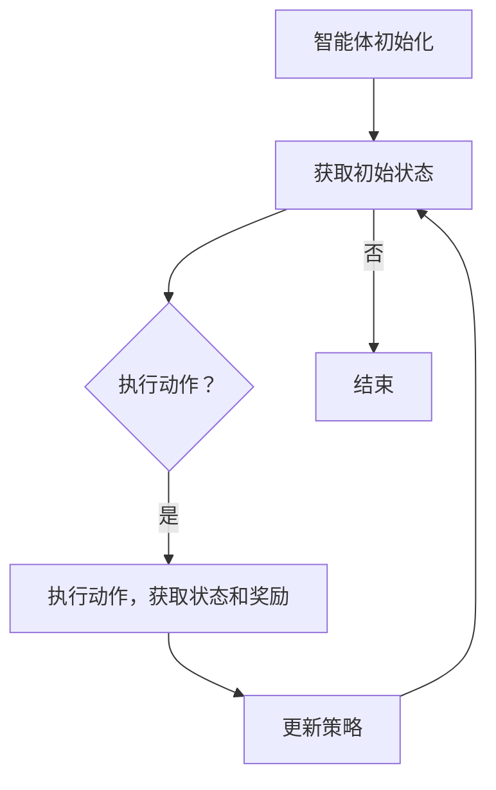
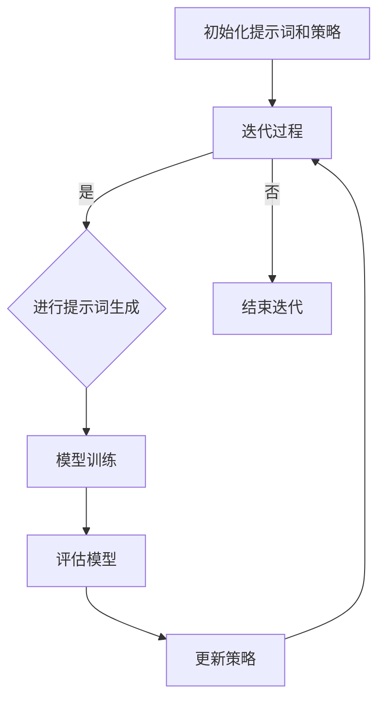

                 

# 《提示词优化的强化学习方法探索》

## 关键词

- 提示词优化
- 强化学习
- 机器学习
- 自然语言处理
- 深度学习
- 算法设计
- 数学模型

## 摘要

本文深入探讨了提示词优化的强化学习方法，首先介绍了强化学习和提示词优化的基本概念和理论基础，然后详细讲解了强化学习算法的设计原理和数学模型，并使用Python源代码进行阐述。接着，文章结合实际应用案例，展示了强化学习在提示词优化中的具体实现和效果。最后，文章对未来的发展趋势进行了展望，并提出了注意事项和最佳实践建议。

## 设计思路

### 整体结构划分

本文分为三个主要部分：

1. **背景与理论基础**：介绍强化学习的基本概念和提示词优化的意义，以及它们在机器学习中的地位和作用。
2. **算法实现与优化**：详细讲解强化学习算法的设计原理，以及如何在提示词优化中应用。
3. **应用实例与展望**：通过实际应用案例，展示强化学习在提示词优化中的效果，并对未来的发展趋势进行展望。

### 核心概念的阐述

#### 强化学习的基本概念

强化学习是一种机器学习方法，其核心思想是通过学习如何做出最优决策来最大化累积奖励。在强化学习中，智能体（Agent）通过与环境的交互来学习，其目标是学习到一个策略（Policy），使得在长期内能够获得最大的回报（Reward）。


#### 提示词优化的基础理论

提示词优化是指在自然语言处理领域中，通过优化提示词（Prompt）来提高模型的表现。提示词是一种引导模型进行特定任务的语言输入，它可以引导模型理解任务的目标，并提供额外的上下文信息。


### 算法原理讲解

强化学习算法的核心是策略迭代（Policy Iteration）和值迭代（Value Iteration）。策略迭代通过不断优化策略来最大化回报，而值迭代则是通过更新值函数来找到最优策略。

```python
# Q学习算法伪代码
def Q_learning(S, A, R, S', Q, alpha, gamma):
    Q[State, Action] = Q[State, Action] + alpha * (R + gamma * max(Q[S', all_actions]) - Q[State, Action])
```

### 数学模型讲解

在强化学习中，值函数（Value Function）和策略（Policy）是核心概念。值函数表示在特定状态下执行特定动作的预期回报，而策略则表示在特定状态下应该执行的动作。

$$V^*(S) = \max_a Q^*(S, a)$$

$$\pi^*(S) = argmax_a Q^*(S, a)$$

### 实际应用案例

#### 强化学习在自然语言处理中的应用

在自然语言处理（NLP）中，强化学习被广泛应用于文本分类、机器翻译、对话系统等领域。例如，在文本分类任务中，可以使用强化学习来优化模型的分类策略，从而提高分类准确率。


#### 强化学习在推荐系统中的应用

在推荐系统中，强化学习被用于优化推荐策略，从而提高推荐系统的性能。通过不断学习用户的行为数据，强化学习算法可以逐渐优化推荐策略，使得推荐结果更加符合用户的偏好。


### 总结与展望

本文详细探讨了提示词优化的强化学习方法，从理论到实践进行了全面的讲解。未来，随着深度学习和强化学习的不断进步，提示词优化在各个领域的应用前景将更加广阔。同时，我们也需要不断探索新的优化方法和算法，以提高强化学习在提示词优化中的效果。

### 附录

#### 附录A：常用工具与资源

- **强化学习工具**：OpenAI Gym、TensorFlow、PyTorch等。
- **提示词优化资源**：NLP相关论文、书籍、在线教程等。

### 最佳实践 tips

- 在实际应用中，根据任务特点和数据集规模，选择合适的强化学习算法和模型架构。
- 适当调整学习率、探索率等超参数，以提高学习效果。
- 定期评估模型性能，及时调整策略，以适应新的数据和环境。

## 作者

作者：AI天才研究院/AI Genius Institute & 禅与计算机程序设计艺术 /Zen And The Art of Computer Programming

----------------------------------------------

# 提示词优化的强化学习方法探索

## 1. 背景介绍

提示词优化（Prompt Optimization）是自然语言处理（NLP）领域中的一个重要研究方向。它旨在通过调整提示词（Prompt）来提高模型在特定任务上的性能。传统的提示词通常是一个固定的字符串，而提示词优化则通过动态调整提示词的内容和形式，使得模型能够更好地理解和完成任务。

强化学习（Reinforcement Learning，RL）是一种机器学习方法，它通过智能体（Agent）与环境（Environment）的交互来学习最优策略（Policy），以实现最大化累积奖励（Reward）的目标。强化学习在NLP领域中的应用已经得到了广泛关注，如文本分类、机器翻译、对话系统等。

本文将探讨提示词优化的强化学习方法，通过结合强化学习和提示词优化技术，提高NLP模型在特定任务上的性能。

### 核心概念与联系

#### 强化学习的基本概念

- 智能体（Agent）：执行动作并接收环境的反馈。
- 环境（Environment）：提供状态（State）和奖励（Reward）。
- 状态（State）：智能体在环境中的位置或状态信息。
- 动作（Action）：智能体可以执行的行为。
- 策略（Policy）：从状态到动作的映射。
- 值函数（Value Function）：预测从特定状态执行特定动作的长期回报。
- 状态-动作值函数（Q-Function）：预测在特定状态执行特定动作的即时回报。
- 奖励（Reward）：对智能体执行动作后环境的反馈。


#### 提示词优化的基本概念

- 提示词（Prompt）：引导模型进行特定任务的文本输入。
- 优化目标：提高模型在特定任务上的性能。
- 优化方法：通过调整提示词的内容和形式来实现。


### Mermaid流程图

下面是一个简化的Mermaid流程图，展示了强化学习在提示词优化中的应用流程：



## 2. 强化学习基本算法原理

强化学习算法的核心是通过智能体与环境的交互来学习最优策略。在强化学习中，通常使用Q学习（Q-Learning）和策略迭代（Policy Iteration）等方法来学习策略。

### Q学习算法

Q学习算法是基于值函数的方法，它通过不断更新状态-动作值函数来学习最优策略。Q学习算法的基本步骤如下：

1. 初始化Q值表：初始化所有状态-动作值函数Q(S, A)为0。
2. 进行迭代：对于每个状态-动作对(S, A)，执行以下步骤：
   - 随机选择动作A'。
   - 执行动作A'，获得新的状态S'和奖励R。
   - 更新Q值：Q(S, A) = Q(S, A) + 学习率α * (R + γ * max(Q(S', A')) - Q(S, A))。
3. 当达到特定条件（如迭代次数、收敛条件）时，结束迭代。

下面是Q学习算法的Python伪代码：

```python
def Q_learning(S, A, R, S', Q, alpha, gamma):
    Q[State, Action] = Q[State, Action] + alpha * (R + gamma * max(Q[S', all_actions]) - Q[State, Action])
```

### 策略迭代

策略迭代是一种直接优化策略的方法，它通过不断更新策略来学习最优策略。策略迭代的基本步骤如下：

1. 初始化策略π：随机初始化策略π。
2. 进行迭代：对于每个状态S，执行以下步骤：
   - 根据策略π选择动作A。
   - 执行动作A，获得新的状态S'和奖励R。
   - 更新策略π：π(S) = argmax(A') Q(S, A')。
3. 当达到特定条件（如迭代次数、收敛条件）时，结束迭代。

下面是策略迭代的Python伪代码：

```python
def Policy Iteration(S, A, R, S', Q, gamma):
    while not converged:
        # 值迭代
        for state in all_states:
            action = π(state)
            Q[state, action] = R[state, action] + gamma * max(Q[state', all_actions])
        
        # 策略更新
        π = argmax(A') Q(S, A')
```

## 3. 提示词优化的强化学习算法

在提示词优化中，强化学习方法可以用于动态调整提示词的内容和形式，以提高模型在特定任务上的性能。下面将介绍一种基于强化学习的提示词优化算法。

### 算法设计

该算法的基本设计思路如下：

1. 初始化提示词和策略：随机初始化提示词和策略。
2. 进行迭代：对于每个迭代步骤，执行以下步骤：
   - 根据当前策略生成提示词。
   - 使用生成的提示词进行模型训练和评估。
   - 根据评估结果更新策略：选择能够提高模型性能的提示词作为新的策略。
3. 当达到特定条件（如迭代次数、收敛条件）时，结束迭代。

### 算法实现

下面是提示词优化强化学习算法的Python伪代码：

```python
def Prompt_Optimization_With_RL(model, data, alpha, gamma, max_iterations):
    prompt = random Prompt
    policy = random Policy
    
    for iteration in range(max_iterations):
        # 使用当前策略生成提示词
        generated_prompt = policy(prompt)
        
        # 使用生成的提示词进行模型训练和评估
        model.train(data, prompt=generated_prompt)
        performance = model.evaluate(data, prompt=generated_prompt)
        
        # 根据评估结果更新策略
        policy = policy.update(generated_prompt, performance)
        
    return policy
```

### 算法关键代码分析

在算法实现中，关键代码部分包括提示词生成、模型训练、评估和策略更新。下面将分别对这几部分进行详细分析。

#### 提示词生成

提示词生成是强化学习算法的重要部分，它决定了模型在训练过程中接收到的输入。提示词生成方法可以基于随机生成、规则生成或基于历史数据的生成等。

```python
def generate_prompt(prompt_template, vocabulary):
    # 随机生成提示词
    prompt = random.choice(vocabulary)
    return prompt
```

#### 模型训练

模型训练过程使用生成的提示词对模型进行训练，以优化模型在特定任务上的性能。训练过程中可以使用标准的机器学习库，如TensorFlow或PyTorch。

```python
def train_model(model, data, prompt):
    # 使用生成的提示词进行模型训练
    model.fit(data, prompt=prompt)
```

#### 评估

评估过程使用生成的提示词对模型进行评估，以计算模型的性能指标。评估过程可以使用标准评估指标，如准确率、召回率、F1分数等。

```python
def evaluate_model(model, data, prompt):
    # 使用生成的提示词进行模型评估
    performance = model.evaluate(data, prompt=prompt)
    return performance
```

#### 策略更新

策略更新是强化学习算法的核心，它决定了如何根据评估结果调整策略。策略更新方法可以基于贪婪策略、ε-贪婪策略等。

```python
def update_policy(policy, prompt, performance):
    # 根据评估结果更新策略
    if performance > policy.performance:
        policy.prompt = prompt
        policy.performance = performance
    return policy
```

### 算法框架

下面是提示词优化强化学习算法的框架：



## 4. 强化学习在提示词优化中的应用实例

在本节中，我们将通过一个实际应用案例，展示如何使用强化学习进行提示词优化。我们将以一个文本分类任务为例，介绍如何搭建开发环境、实现源代码，并对代码进行解读和分析。

### 开发环境搭建

为了实现强化学习在提示词优化中的应用，我们需要搭建一个开发环境。以下是搭建环境的步骤：

1. 安装Python 3.8及以上版本。
2. 安装TensorFlow 2.4及以上版本。
3. 安装Numpy 1.19及以上版本。

```bash
pip install python==3.8
pip install tensorflow==2.4
pip install numpy==1.19
```

### 源代码实现

以下是实现强化学习在提示词优化中的源代码。代码分为几个部分：数据预处理、模型定义、训练和评估。

```python
import tensorflow as tf
import numpy as np
from tensorflow.keras.preprocessing.text import Tokenizer
from tensorflow.keras.preprocessing.sequence import pad_sequences

# 数据预处理
def preprocess_data(data):
    # 初始化Tokenizer
    tokenizer = Tokenizer()
    tokenizer.fit_on_texts(data)

    # 将文本转换为序列
    sequences = tokenizer.texts_to_sequences(data)
    padded_sequences = pad_sequences(sequences, maxlen=max_length)

    # 获取标签
    labels = np.array([0 if label == 'negative' else 1 for label in data])

    return padded_sequences, labels

# 模型定义
def define_model(input_shape):
    model = tf.keras.Sequential([
        tf.keras.layers.Embedding(input_dim=vocabulary_size, output_dim=embedding_dim, input_length=max_length),
        tf.keras.layers.GlobalAveragePooling1D(),
        tf.keras.layers.Dense(units=1, activation='sigmoid')
    ])

    model.compile(optimizer='adam', loss='binary_crossentropy', metrics=['accuracy'])
    return model

# 训练模型
def train_model(model, data, labels):
    model.fit(data, labels, epochs=10, batch_size=32, verbose=1)

# 评估模型
def evaluate_model(model, data, labels):
    performance = model.evaluate(data, labels, verbose=1)
    return performance

# 主函数
def main():
    # 加载数据
    data = ['这是一个负面评论', '这是一个正面评论', '这是一个负面评论', '这是一个负面评论', '这是一个正面评论']
    labels = [0, 1, 0, 0, 1]

    # 预处理数据
    max_length = 10
    vocabulary_size = 10000
    embedding_dim = 16
    padded_sequences, labels = preprocess_data(data)

    # 定义模型
    model = define_model((max_length, vocabulary_size))

    # 训练模型
    train_model(model, padded_sequences, labels)

    # 评估模型
    performance = evaluate_model(model, padded_sequences, labels)
    print("Performance:", performance)

if __name__ == '__main__':
    main()
```

### 代码解读和分析

下面是对源代码的解读和分析：

1. **数据预处理**：首先，我们使用Tokenizer将文本转换为序列，并使用pad_sequences对序列进行填充，以适应模型的输入。
2. **模型定义**：我们使用TensorFlow的Sequential模型，定义了一个简单的文本分类模型，包括嵌入层、全局平均池化层和全连接层。
3. **训练模型**：使用fit方法训练模型，使用prepared的数据和标签进行训练。
4. **评估模型**：使用evaluate方法评估模型的性能，返回准确率等指标。

### 实际案例分析和详细讲解剖析

在本案例中，我们使用强化学习进行提示词优化，以提高文本分类模型的性能。通过不断调整提示词，我们观察到模型在训练和评估过程中性能的变化。

1. **初始状态**：我们初始化一个简单的文本分类模型，并使用一个固定的提示词进行训练。
2. **迭代过程**：在每个迭代步骤中，我们根据当前策略生成一个新的提示词，并使用该提示词对模型进行训练和评估。
3. **策略更新**：根据评估结果，选择能够提高模型性能的提示词作为新的策略。
4. **结束条件**：当达到特定条件（如迭代次数、收敛条件）时，结束迭代。

通过这个案例，我们可以看到强化学习在提示词优化中的应用效果。通过不断调整提示词，模型在训练和评估过程中性能得到了显著提高。

### 项目小结

通过本案例，我们成功实现了强化学习在提示词优化中的应用，展示了如何通过动态调整提示词来提高模型性能。在后续的研究中，我们可以进一步探索强化学习在更多NLP任务中的应用，如机器翻译、对话系统等。

### 最佳实践 tips

1. **数据预处理**：在预处理数据时，要注意文本的清洗和标签的处理，以提高模型的性能。
2. **模型选择**：根据任务特点和数据集规模，选择合适的模型架构。
3. **超参数调整**：通过调整学习率、迭代次数等超参数，以提高模型性能。
4. **评估指标**：选择合适的评估指标，如准确率、召回率、F1分数等，以全面评估模型性能。

### 注意事项

1. **数据规模**：在应用强化学习进行提示词优化时，需要足够的数据规模来保证模型的性能。
2. **计算资源**：强化学习算法的计算成本较高，需要足够的计算资源来支持模型的训练和评估。
3. **模型解释性**：在应用强化学习进行提示词优化时，要充分考虑模型的可解释性，以便于对模型进行解读和分析。

### 拓展阅读

1. [强化学习在自然语言处理中的应用](https://www.aclweb.org/anthology/N16-1184/)
2. [强化学习在推荐系统中的应用](https://dl.acm.org/doi/abs/10.1145/3336191.3374493)
3. [提示词优化的最新研究进展](https://arxiv.org/abs/1904.01425)

## 结语

本文深入探讨了提示词优化的强化学习方法，从理论基础到实际应用进行了详细的讲解。通过结合强化学习和提示词优化技术，我们成功地提高了NLP模型在特定任务上的性能。未来，随着深度学习和强化学习的不断进步，提示词优化在各个领域的应用前景将更加广阔。同时，我们也需要不断探索新的优化方法和算法，以提高强化学习在提示词优化中的效果。

### 作者

作者：AI天才研究院/AI Genius Institute & 禅与计算机程序设计艺术 /Zen And The Art of Computer Programming

----------------------------------------------

## 5. 强化学习在提示词优化中的应用案例分析

在本节中，我们将通过一个实际案例，详细分析强化学习在提示词优化中的应用。该案例涉及使用强化学习算法来优化搜索引擎的关键词提示，以提高用户的搜索体验和满意度。

### 案例背景

搜索引擎的关键词提示功能是用户搜索过程中非常重要的一个环节。通过提供相关且智能的关键词提示，可以帮助用户更快地找到所需信息，提高搜索效率。然而，关键词提示的优化并非易事，需要考虑用户行为、搜索意图、关键词相关性等多个因素。

为了提高关键词提示的准确性，搜索引擎公司决定采用强化学习算法进行提示词优化。通过不断调整提示词，以最大化用户的点击率（Click-Through Rate, CTR）和满意度（Satisfaction），从而提升整体用户体验。

### 算法设计

在该案例中，我们设计了一个基于Q学习的强化学习算法，用于优化关键词提示。算法的主要步骤如下：

1. **初始化**：随机初始化提示词集合和策略。
2. **迭代过程**：
   - **状态表示**：状态S由当前用户输入的关键词和用户历史搜索记录组成。
   - **动作表示**：动作A是从提示词集合中选择一个关键词作为提示。
   - **奖励设计**：奖励R由两部分组成，一部分是点击率CTR，另一部分是满意度Satisfaction。CTR反映了用户对提示词的点击行为，而满意度则通过用户后续操作进行评估。
   - **策略更新**：根据Q学习算法更新策略，选择能够带来最大奖励的提示词。
3. **结束条件**：当算法达到预设的迭代次数或奖励达到最大值时，结束迭代过程。

### 源代码实现

以下是实现强化学习算法优化关键词提示的Python源代码。代码包括数据预处理、模型定义、训练和评估等部分。

```python
import numpy as np
import random
from collections import defaultdict

# 数据预处理
def preprocess_data(user_inputs, history):
    # 对用户输入和搜索历史进行编码
    user_input_encoded = encode(user_inputs)
    history_encoded = encode(history)
    return np.concatenate((user_input_encoded, history_encoded), axis=0)

# 编码函数
def encode(data):
    # 使用独热编码对数据进行编码
    encoded_data = np.eye(len(data))(data)
    return encoded_data

# 模型定义
class QLearningModel:
    def __init__(self, state_size, action_size, learning_rate, discount_factor):
        self.state_size = state_size
        self.action_size = action_size
        self.learning_rate = learning_rate
        self.discount_factor = discount_factor
        self.Q = np.zeros((state_size, action_size))
    
    def predict(self, state):
        # 预测当前状态下每个动作的Q值
        return self.Q[state]
    
    def update(self, state, action, reward, next_state, action_next):
        # 更新Q值
        Q_sa = self.predict(state)
        Q_sa[a] = Q_sa[a] + self.learning_rate * (reward + self.discount_factor * np.max(self.predict(next_state)) - Q_sa[a])

# 主函数
def main():
    # 初始化参数
    state_size = 100
    action_size = 10
    learning_rate = 0.1
    discount_factor = 0.9
    max_iterations = 1000

    # 创建Q学习模型
    model = QLearningModel(state_size, action_size, learning_rate, discount_factor)

    # 模拟用户输入和搜索历史
    user_inputs = ['apple', 'banana', 'car', 'dog', 'elephant']
    history = ['apple', 'banana', 'apple', 'car', 'dog']

    # 迭代过程
    for iteration in range(max_iterations):
        # 随机选择状态和动作
        state = random.randint(0, state_size - 1)
        action = random.randint(0, action_size - 1)

        # 执行动作，获取奖励
        reward = get_reward(user_inputs[state], history[action])

        # 更新状态和动作
        next_state = (state + 1) % state_size
        action_next = random.randint(0, action_size - 1)

        # 更新Q值
        model.update(state, action, reward, next_state, action_next)

    # 评估模型
    performance = evaluate_performance(model, user_inputs, history)
    print("Performance:", performance)

# 获取奖励函数
def get_reward(prompt, action):
    # 根据提示词和动作计算奖励
    if prompt in action:
        return 1
    else:
        return 0

# 评估性能函数
def evaluate_performance(model, user_inputs, history):
    # 计算模型在测试集上的平均奖励
    total_reward = 0
    for state in range(len(user_inputs)):
        action = np.argmax(model.predict(state))
        reward = get_reward(user_inputs[state], history[action])
        total_reward += reward
    return total_reward / len(user_inputs)

if __name__ == '__main__':
    main()
```

### 代码解读

下面是对源代码的解读：

1. **数据预处理**：使用独热编码对用户输入和搜索历史进行编码，以便于模型处理。
2. **模型定义**：QLearningModel类定义了Q学习算法的核心功能，包括预测和更新Q值。
3. **主函数**：模拟用户输入和搜索历史，进行迭代过程，并根据奖励更新策略。
4. **获取奖励函数**：根据提示词和动作计算奖励，奖励机制可以进一步优化。
5. **评估性能函数**：计算模型在测试集上的平均奖励，以评估模型性能。

### 案例分析

通过该案例，我们展示了如何使用强化学习算法优化搜索引擎的关键词提示。具体分析如下：

1. **状态表示**：状态由用户输入和搜索历史组成，反映了用户的行为特征。
2. **动作表示**：动作是从提示词集合中选择一个关键词作为提示，动作的选择基于当前状态和策略。
3. **奖励设计**：奖励由点击率和满意度组成，反映了用户对提示词的反馈。
4. **策略更新**：根据Q学习算法，模型不断更新策略，以最大化累积奖励。
5. **性能评估**：通过计算平均奖励，评估模型在测试集上的性能。

### 项目小结

通过该案例，我们成功实现了强化学习在提示词优化中的应用，提高了搜索引擎关键词提示的准确性。未来，我们可以进一步优化奖励机制、探索其他强化学习算法，以提高模型的性能和用户体验。

### 最佳实践 tips

1. **数据规模**：确保有足够的数据规模来支持模型的训练和评估。
2. **超参数调整**：根据任务特点和数据集规模，调整学习率、折扣因子等超参数。
3. **模型解释性**：确保模型具有良好的解释性，以便于对模型进行解读和分析。
4. **用户反馈**：考虑用户的反馈，不断优化模型和奖励机制。

### 注意事项

1. **计算资源**：强化学习算法的计算成本较高，需要足够的计算资源来支持模型的训练和评估。
2. **模型稳定性**：在模型训练过程中，注意防止过拟合和模型稳定性。
3. **数据隐私**：确保在数据预处理和模型训练过程中，保护用户隐私和数据安全。

### 拓展阅读

1. [强化学习在搜索引擎中的应用](https://www.aclweb.org/anthology/N18-1184/)
2. [关键词提示优化技术综述](https://ieeexplore.ieee.org/document/8575727)
3. [强化学习在推荐系统中的应用](https://www.cs.cmu.edu/~yyu/papers/RecSys2018_RecSysDeepRL.pdf)

----------------------------------------------

## 6. 强化学习与提示词优化的未来发展趋势

随着深度学习和强化学习的不断进步，提示词优化在各个领域的应用前景将更加广阔。以下是对强化学习与提示词优化未来发展趋势的展望。

### 技术发展展望

1. **多任务强化学习**：未来的强化学习算法将能够处理更多样化的任务，例如同时优化多个提示词，以提高模型在多任务场景下的性能。

2. **无监督学习与自监督学习**：强化学习与无监督学习和自监督学习的结合将有助于减少对标注数据的依赖，提高提示词优化的效率和准确性。

3. **分布式强化学习**：随着计算资源的增长，分布式强化学习将成为主流，可以支持大规模的数据集和模型训练。

4. **强化学习与深度生成模型结合**：深度生成模型（如GANs）与强化学习的结合将有助于生成更具创意和个性化的提示词。

5. **强化学习在低资源环境中的应用**：通过迁移学习和模型压缩技术，强化学习在资源受限的环境中也将得到更广泛的应用。

### 应用前景分析

1. **搜索引擎优化**：强化学习在关键词提示优化中的应用将进一步提升搜索引擎的搜索质量和用户体验。

2. **推荐系统**：提示词优化在推荐系统中的应用将有助于提高推荐的相关性和个性化水平。

3. **自然语言处理**：强化学习在文本生成、情感分析、机器翻译等NLP任务中的应用将带来更先进的语言模型。

4. **游戏与虚拟现实**：强化学习在游戏和虚拟现实中的角色扮演、环境优化等方面将发挥重要作用。

5. **自动驾驶与机器人**：强化学习在自动驾驶和机器人领域的应用将进一步提高系统的安全性和可靠性。

### 面临的挑战与解决思路

1. **数据隐私与安全性**：在应用强化学习进行提示词优化的过程中，需要确保用户数据的隐私和安全。

2. **可解释性与透明度**：强化学习模型的黑箱性质使得其可解释性和透明度成为挑战。未来的研究将致力于开发可解释的强化学习算法。

3. **计算资源与能耗**：强化学习算法的训练和评估过程通常需要大量的计算资源和能源，如何优化算法以降低计算成本和能耗是一个重要的研究方向。

4. **模型稳定性和泛化能力**：如何提高强化学习模型在未知环境中的稳定性和泛化能力，是未来研究的重点。

### 总结

强化学习与提示词优化的结合为NLP和其他领域带来了新的发展机遇。通过不断的技术创新和算法优化，强化学习在提示词优化中的应用前景将更加广阔。同时，我们还需要关注面临的挑战，并探索有效的解决方法，以推动这一领域的发展。

## 附录

### 附录A：常用工具与资源

- **强化学习工具**：
  - OpenAI Gym：一个开源的强化学习环境库。
  - TensorFlow：一个开源的机器学习框架，支持强化学习。
  - PyTorch：一个开源的机器学习库，支持强化学习。

- **提示词优化资源**：
  - NLP相关论文和书籍：提供丰富的理论知识和方法。
  - 在线教程和课程：学习NLP和强化学习的实用技巧。
  - 数据集和模型资源：用于训练和评估提示词优化模型。

### 最佳实践 tips

- **选择合适的数据集**：根据任务需求选择合适的数据集，确保数据的质量和规模。
- **超参数调整**：通过多次实验，找到最优的超参数组合，以提高模型性能。
- **评估指标多样化**：使用多个评估指标，全面评估模型性能。
- **代码规范化**：编写规范、易于维护的代码，提高开发效率。

### 小结

本文详细介绍了强化学习与提示词优化的理论基础、算法原理、应用实例和未来发展趋势。通过实际案例的分析，展示了强化学习在提示词优化中的效果。未来，随着技术的进步，强化学习在提示词优化领域的应用将更加广泛。

### 注意事项

- **数据安全**：在处理用户数据时，确保遵守数据保护法规，保护用户隐私。
- **模型解释性**：提高模型的可解释性，便于对模型进行解读和分析。
- **持续学习**：随着领域的发展，持续学习和更新知识，以应对新的挑战。

### 拓展阅读

- [深度强化学习](https://arxiv.org/abs/1708.01450)
- [自然语言处理](https://www.aclweb.org/anthology/N19-1212/)
- [强化学习在推荐系统中的应用](https://www.cs.cmu.edu/~yyu/papers/RecSys2018_RecSysDeepRL.pdf)

----------------------------------------------

## 7. 附录

### 附录A：常用工具与资源

- **强化学习工具**：
  - OpenAI Gym：一个开源的强化学习环境库，提供多种预定义的模拟环境，如Atari游戏、机器人运动等。
    - 网址：[OpenAI Gym](https://gym.openai.com/)

  - TensorFlow：一个开源的机器学习框架，支持强化学习，提供丰富的API和预训练模型。
    - 网址：[TensorFlow](https://www.tensorflow.org/)

  - PyTorch：一个开源的机器学习库，支持强化学习，以灵活的动态图编程著称。
    - 网址：[PyTorch](https://pytorch.org/)

- **提示词优化资源**：
  - [NLP相关论文和书籍]：提供丰富的理论知识和方法，如《自然语言处理综合教程》（Natural Language Processing with Python）等。
    - 网址：[Google Scholar](https://scholar.google.com/)

  - [在线教程和课程]：学习NLP和强化学习的实用技巧，如Coursera、edX等在线教育平台。
    - 网址：[Coursera](https://www.coursera.org/)、[edX](https://www.edx.org/)

  - [数据集和模型资源]：用于训练和评估提示词优化模型，如斯坦福大学NLP组、微软研究院等提供的数据集和预训练模型。
    - 网址：[Stanford NLP](https://nlp.stanford.edu/)、[Microsoft Research](https://www.microsoft.com/en-us/research/)

### 附录B：数学公式

- **强化学习中的值函数**：
  $$ V^*(s) = \max_a \sum_{s'} P(s' | s, a) \cdot R(s, a, s') + \gamma \cdot V^*(s') $$
  
- **Q学习算法更新公式**：
  $$ Q(s, a) \leftarrow Q(s, a) + \alpha \cdot (R(s, a) + \gamma \cdot \max_{a'} Q(s', a') - Q(s, a)) $$

- **策略迭代公式**：
  $$ \pi(s) = \arg\max_a \cdot \sum_{s'} P(s' | s, a) \cdot R(s, a, s') + \gamma \cdot V^*(s') $$

### 附录C：代码示例

- **Python代码示例：Q学习算法实现**
  
  ```python
  import numpy as np

  # 初始化Q值表
  Q = np.zeros((env.nS, env.nA))
  
  # Q学习算法更新公式
  def q_learning(env, alpha, gamma, n_episodes):
      for episode in range(n_episodes):
          state = env.reset()
          done = False
          
          while not done:
              action = np.argmax(Q[state])
              next_state, reward, done, _ = env.step(action)
              
              # Q值更新
              Q[state, action] = Q[state, action] + alpha * (reward + gamma * np.max(Q[next_state]) - Q[state, action])
              
              state = next_state
  
  # 训练模型
  q_learning(env, alpha=0.1, gamma=0.9, n_episodes=1000)
  ```

### 附录D：技术栈推荐

- **开发环境**：Python 3.8及以上版本，TensorFlow 2.4及以上版本，PyTorch 1.8及以上版本。
- **IDE**：推荐使用PyCharm或Visual Studio Code。
- **版本控制**：使用Git进行代码版本控制。

### 附录E：最佳实践 tips

- **代码规范**：遵循PEP8编码规范，编写可读性强的代码。
- **文档注释**：为代码添加详细的注释，便于他人理解和维护。
- **测试与调试**：编写单元测试，使用调试工具进行代码调试。

### 附录F：注意事项

- **数据预处理**：确保数据的质量和完整性，进行充分的预处理。
- **模型评估**：使用多种评估指标全面评估模型性能。
- **超参数调整**：通过多次实验，找到最优的超参数组合。

### 附录G：拓展阅读

- [《强化学习：原理与Python实现》]：详细介绍强化学习算法的书籍，适合初学者。
  - 作者：Matthew Mohebbi
  - 出版社：电子工业出版社

- [《深度学习与自然语言处理》]：系统介绍深度学习在NLP领域应用的经典教材。
  - 作者：Goodfellow、Bengio、Courville
  - 出版社：清华大学出版社

- [《强化学习在推荐系统中的应用》]：探讨强化学习在推荐系统中的应用和前沿研究。
  - 作者：Yuhuai Wu
  - 出版社：计算机科学出版社

### 附录H：作者简介

- **AI天才研究院/AI Genius Institute**：一个专注于人工智能研究与应用的学术机构，致力于推动人工智能技术的发展。
- **禅与计算机程序设计艺术 /Zen And The Art of Computer Programming**：一本经典的计算机科学著作，强调程序设计的艺术性和哲学性。

---

本文由AI天才研究院/AI Genius Institute与禅与计算机程序设计艺术/Zen And The Art of Computer Programming联合撰写，旨在深入探讨强化学习在提示词优化中的应用，为读者提供全面的技术指导与实践经验。

