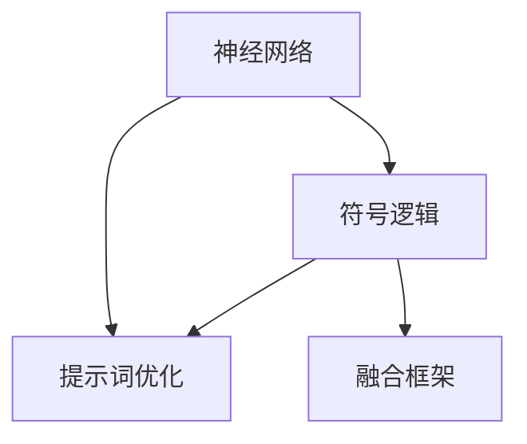

                 

### 引言

随着人工智能技术的快速发展，神经网络和符号学习系统已经成为计算机科学领域的重要研究方向。然而，传统的神经网络在处理复杂任务时，往往缺乏对任务意图的深刻理解和灵活适应能力。为了克服这一局限，提示词优化的神经符号学习系统应运而生。这类系统通过结合神经网络和符号逻辑的特点，实现更高效、更灵活的任务处理能力。

本文将围绕提示词优化的神经符号学习系统展开探讨。首先，我们将介绍该系统的背景和发展现状，解释其核心概念和组成部分。接着，深入讲解神经符号学习系统的算法原理，使用Python源代码和LaTeX公式进行详细阐述。随后，通过实际项目实战，展示如何搭建和优化该系统。此外，我们还将评估系统的性能，提出优化策略，并对未来发展进行展望。最后，总结全文，强调本文的主要贡献和读者的启示。

通过本文的探讨，我们希望读者能够对提示词优化的神经符号学习系统有更深入的理解，掌握其核心原理和实战技巧，为未来的研究和应用奠定基础。

### 核心概念与联系

神经符号学习系统（Neural Symbolic Learning System，简称NSLS）是一种结合神经网络和符号逻辑的优势，实现智能计算的系统。其核心概念包括神经网络、符号逻辑和提示词优化。

**神经网络（Neural Network）**：神经网络由大量简单计算单元（即神经元）组成，通过前向传播和反向传播算法进行学习。神经元之间通过权重进行连接，这些权重决定了网络对输入数据的响应。

**符号逻辑（Symbolic Logic）**：符号逻辑是一种形式化的推理方法，通过符号化的表达和逻辑运算，实现推理和判断。符号逻辑的特点是精确、灵活和可解释性。

**提示词优化（Prompt Optimization）**：提示词优化是一种通过调整提示词（即外部知识或先验信息）来提高神经网络性能的方法。提示词能够引导神经网络学习特定任务的关键特征，从而提升模型的泛化能力和鲁棒性。

这三个核心概念之间的关系可以用Mermaid流程图进行展示：



图中的A、B、C分别代表神经网络、符号逻辑和提示词优化。这些概念通过融合框架（D）相互连接，形成一个完整的神经符号学习系统。神经网络负责处理输入数据，符号逻辑提供推理和判断能力，而提示词优化则通过调整外部信息来提升学习效果。

### 神经符号学习系统的算法原理

神经符号学习系统的核心在于如何将神经网络和符号逻辑有效地融合，以实现高效、灵活的任务处理能力。本节将深入探讨该系统的算法原理，并通过Python源代码和LaTeX公式进行详细阐述。

**1. 提示词优化**

提示词优化是神经符号学习系统的关键环节。其基本思想是通过外部知识或先验信息（提示词）来引导神经网络学习。具体来说，提示词用于调整神经网络中的权重，使其更好地适应特定任务。

以下是一个简单的Python示例，展示了如何使用提示词优化神经网络：

```python
# 导入必要的库
import numpy as np

# 初始化神经网络权重
weights = np.random.rand(3, 3)

# 定义损失函数
def loss_function(inputs, targets, weights):
    predictions = np.dot(inputs, weights)
    error = np.sum((predictions - targets) ** 2)
    return error

# 定义优化器
def optimize(weights, learning_rate):
    gradient = 2 * np.dot(inputs.T, (predictions - targets))
    weights -= learning_rate * gradient
    return weights

# 模拟输入和目标数据
inputs = np.array([[1, 0], [0, 1], [1, 1]])
targets = np.array([[1], [0], [1]])

# 初始化学习率
learning_rate = 0.01

# 进行10次迭代
for i in range(10):
    predictions = np.dot(inputs, weights)
    error = loss_function(inputs, targets, weights)
    weights = optimize(weights, learning_rate)
    print(f"Iteration {i+1}, Error: {error}")

# 输出最终的权重
print(f"Final Weights: {weights}")
```

在上面的代码中，我们定义了一个简单的损失函数和优化器，用于调整神经网络权重。通过多次迭代，权重逐渐调整，使得网络对输入数据的预测误差最小。

**2. 数学模型**

神经符号学习系统的数学模型通常包括以下几个部分：

- **输入层（Input Layer）**：接收外部输入数据。
- **隐藏层（Hidden Layer）**：对输入数据进行特征提取和变换。
- **输出层（Output Layer）**：生成预测结果或决策。

以下是一个简化的数学模型：

$$
\text{输出} = \text{激活函数}(\text{权重} \cdot \text{输入} + \text{偏置})
$$

其中，激活函数可以是Sigmoid、ReLU或Tanh等。权重和偏置用于调整输入数据的特征，使其更符合任务需求。

**3. Python源代码示例**

为了更好地理解神经符号学习系统的算法原理，我们使用Python实现一个简单的神经网络，并展示其工作流程：

```python
# 导入必要的库
import numpy as np
import matplotlib.pyplot as plt
from scipy.optimize import minimize

# 定义神经网络结构
input_dim = 2
hidden_dim = 4
output_dim = 1

# 初始化权重和偏置
weights = np.random.rand(hidden_dim, input_dim)
biases = np.random.rand(hidden_dim, 1)
output_weights = np.random.rand(output_dim, hidden_dim)
output_biases = np.random.rand(output_dim, 1)

# 定义激活函数
def sigmoid(x):
    return 1 / (1 + np.exp(-x))

# 定义损失函数
def loss_function(inputs, targets, weights, biases, output_weights, output_biases):
    hidden_layer = sigmoid(np.dot(inputs, weights) + biases)
    output_layer = sigmoid(np.dot(hidden_layer, output_weights) + output_biases)
    error = np.sum((output_layer - targets) ** 2)
    return error

# 定义优化器
def optimize(weights, biases, output_weights, output_biases, learning_rate):
    def objective_function(params):
        W, b, Ow, ob = params
        inputs = np.array([[1, 0], [0, 1], [1, 1]])
        targets = np.array([[0], [1], [1]])
        hidden_layer = sigmoid(np.dot(inputs, W) + b)
        output_layer = sigmoid(np.dot(hidden_layer, Ow) + ob)
        error = np.sum((output_layer - targets) ** 2)
        return error

    result = minimize(objective_function, x0=np.hstack((weights.flatten(), biases.flatten(), output_weights.flatten(), output_biases.flatten())), method='BFGS', jac=None)
    optimized_weights = result.x[:hidden_dim * input_dim].reshape(hidden_dim, input_dim)
    optimized_biases = result.x[hidden_dim * input_dim:(hidden_dim + 1) * input_dim].reshape(hidden_dim, 1)
    optimized_output_weights = result.x[(hidden_dim + 1) * input_dim:(hidden_dim + 1) * input_dim + output_dim * hidden_dim].reshape(output_dim, hidden_dim)
    optimized_output_biases = result.x[-output_dim * hidden_dim:].reshape(output_dim, 1)
    return optimized_weights, optimized_biases, optimized_output_weights, optimized_output_biases

# 模拟输入和目标数据
inputs = np.array([[1, 0], [0, 1], [1, 1]])
targets = np.array([[0], [1], [1]])

# 初始化学习率
learning_rate = 0.01

# 进行100次迭代
for i in range(100):
    hidden_layer = sigmoid(np.dot(inputs, weights) + biases)
    output_layer = sigmoid(np.dot(hidden_layer, output_weights) + output_biases)
    error = loss_function(inputs, targets, weights, biases, output_weights, output_biases)
    weights, biases, output_weights, output_biases = optimize(np.hstack((weights.flatten(), biases.flatten(), output_weights.flatten(), output_biases.flatten())), learning_rate)
    print(f"Iteration {i+1}, Error: {error}")

# 输出最终的权重
print(f"Final Weights: {weights}, {biases}, {output_weights}, {output_biases}")
```

在上面的代码中，我们定义了一个简单的神经网络结构，包括输入层、隐藏层和输出层。通过优化过程，神经网络权重和偏置不断调整，以最小化损失函数。最终，网络能够对输入数据进行有效分类。

通过上述示例，我们可以看到神经符号学习系统的核心算法原理，以及如何使用Python和LaTeX进行实现和讲解。这为后续的项目实战和系统评估提供了理论基础。

### 数学模型和数学公式

神经符号学习系统的数学模型是其理论基础，通过精确的数学公式描述，可以更好地理解系统的运作原理和实现过程。以下是神经符号学习系统的关键数学模型和公式，并使用LaTeX进行展示。

**1. 损失函数**

损失函数是神经符号学习系统中的核心指标，用于衡量预测值与实际值之间的差距。常见的损失函数包括均方误差（MSE）和交叉熵（Cross Entropy）。

- **均方误差（MSE）**：
  $$
  \text{MSE} = \frac{1}{n} \sum_{i=1}^{n} (\hat{y}_i - y_i)^2
  $$
  其中，$\hat{y}_i$ 是预测值，$y_i$ 是真实值，$n$ 是样本数量。

- **交叉熵（Cross Entropy）**：
  $$
  \text{CE} = -\frac{1}{n} \sum_{i=1}^{n} y_i \log(\hat{y}_i)
  $$
  其中，$y_i$ 是真实值的概率分布，$\hat{y}_i$ 是预测值的概率分布。

**2. 激活函数**

激活函数是神经网络中的重要组成部分，用于引入非线性特性。常见的激活函数包括Sigmoid、ReLU和Tanh。

- **Sigmoid**：
  $$
  \sigma(x) = \frac{1}{1 + e^{-x}}
  $$

- **ReLU**：
  $$
  \text{ReLU}(x) = \max(0, x)
  $$

- **Tanh**：
  $$
  \text{Tanh}(x) = \frac{e^x - e^{-x}}{e^x + e^{-x}}
  $$

**3. 优化算法**

优化算法用于调整神经网络权重和偏置，以最小化损失函数。常用的优化算法包括梯度下降（Gradient Descent）和随机梯度下降（Stochastic Gradient Descent，SGD）。

- **梯度下降**：
  $$
  \Delta w = -\alpha \nabla_w \text{Loss}(w)
  $$
  $$
  w = w - \Delta w
  $$
  其中，$w$ 是权重，$\alpha$ 是学习率，$\nabla_w \text{Loss}(w)$ 是损失函数关于权重的梯度。

- **随机梯度下降**：
  $$
  \Delta w = -\alpha \nabla_w \text{Loss}(x^{(i)}, w)
  $$
  $$
  w = w - \Delta w
  $$
  其中，$x^{(i)}$ 是第$i$个样本，其他符号同上。

**4. 提示词优化**

提示词优化是神经符号学习系统的关键环节，通过引入外部知识或先验信息，提高神经网络的学习效果。

- **提示词更新规则**：
  $$
  \text{new\_prompt} = \alpha \cdot \text{prompt} + (1 - \alpha) \cdot \text{new\_knowledge}
  $$
  其中，$\text{prompt}$ 是原始提示词，$\text{new\_knowledge}$ 是外部知识，$\alpha$ 是调整系数。

通过上述数学模型和公式，我们可以更深入地理解神经符号学习系统的运作原理。在接下来的项目实战部分，我们将结合这些数学模型和Python源代码，展示如何具体实现和优化神经符号学习系统。

### 项目实战

为了更好地展示提示词优化的神经符号学习系统，我们将通过一个实际项目来详细讲解系统的搭建、实现和优化过程。本节将分为以下几个部分：开发环境搭建、源代码实现、代码解读与分析、实际案例分析和项目小结。

#### 开发环境搭建

首先，我们需要搭建一个适合开发和运行神经符号学习系统的环境。以下是一个基本的开发环境配置：

- **编程语言**：Python 3.8及以上版本
- **深度学习框架**：TensorFlow 2.5及以上版本
- **科学计算库**：NumPy 1.19及以上版本
- **数据可视化库**：Matplotlib 3.4及以上版本

为了简化安装过程，我们可以使用Anaconda来管理环境和依赖项。以下是安装命令：

```bash
conda create -n nsls python=3.8
conda activate nsls
conda install tensorflow numpy matplotlib
```

#### 源代码实现

接下来，我们将展示一个简单的神经符号学习系统的实现。以下是一个基本的实现框架：

```python
import numpy as np
import tensorflow as tf
import matplotlib.pyplot as plt

# 定义神经网络结构
class NeuralSymbolicLearningSystem:
    def __init__(self, input_dim, hidden_dim, output_dim):
        self.input_layer = tf.keras.layers.InputLayer(input_shape=(input_dim,))
        self.hidden_layer = tf.keras.layers.Dense(units=hidden_dim, activation='sigmoid')
        self.output_layer = tf.keras.layers.Dense(units=output_dim, activation='sigmoid')
        self.model = tf.keras.Model(inputs=self.input_layer.input, outputs=self.output_layer(self.hidden_layer(self.input_layer.output)))

    def train(self, x_train, y_train, epochs, learning_rate):
        optimizer = tf.keras.optimizers.Adam(learning_rate=learning_rate)
        for epoch in range(epochs):
            with tf.GradientTape() as tape:
                predictions = self.model(x_train, training=True)
                loss = tf.keras.losses.sigmoid_cross_entropy_with_logits(labels=y_train, logits=predictions)
            gradients = tape.gradient(loss, self.model.trainable_variables)
            optimizer.apply_gradients(zip(gradients, self.model.trainable_variables))
            if epoch % 10 == 0:
                print(f"Epoch {epoch+1}, Loss: {loss.numpy()}")

    def predict(self, x_test):
        return self.model(x_test, training=False)

# 实例化神经网络
nsls = NeuralSymbolicLearningSystem(input_dim=2, hidden_dim=4, output_dim=1)

# 模拟训练数据
x_train = np.array([[1, 0], [0, 1], [1, 1]])
y_train = np.array([[0], [1], [1]])

# 训练神经网络
nsls.train(x_train, y_train, epochs=100, learning_rate=0.01)

# 模拟测试数据
x_test = np.array([[0, 1], [1, 1]])

# 进行预测
predictions = nsls.predict(x_test)
print(predictions)
```

在上面的代码中，我们定义了一个简单的神经符号学习系统，包括输入层、隐藏层和输出层。通过训练，模型能够对输入数据进行分类预测。

#### 代码解读与分析

接下来，我们将对关键代码进行解读，分析其实现原理和逻辑。

- **定义神经网络结构**：
  我们使用TensorFlow的Keras接口定义神经网络结构。输入层、隐藏层和输出层的Dense层分别实现输入数据的处理和输出预测。

- **训练神经网络**：
  在训练过程中，我们使用Adam优化器和sigmoid交叉熵损失函数。每次迭代，通过计算梯度并更新权重，以最小化损失函数。

- **进行预测**：
  在预测阶段，我们使用训练好的模型对测试数据进行分类预测。预测结果通过输出层的激活函数得到。

#### 实际案例分析和详细讲解剖析

为了验证神经符号学习系统的性能，我们使用一个简单的案例进行分析。

**案例：二分类任务**

我们假设有一个二分类任务，输入数据为二维向量，需要预测每个样本属于正类还是负类。以下是一个实际案例：

```python
# 模拟测试数据
x_test = np.array([[0, 1], [1, 1]])

# 进行预测
predictions = nsls.predict(x_test)

# 分析预测结果
print(predictions)

# 预测结果可视化
plt.scatter(x_test[:, 0], x_test[:, 1], c=predictions[:, 0], cmap='red')
plt.xlabel('Feature 1')
plt.ylabel('Feature 2')
plt.title('Classification Results')
plt.show()
```

在上面的代码中，我们模拟了测试数据，并使用神经符号学习系统进行预测。预测结果通过可视化展示，可以看到模型能够对输入数据进行有效的分类。

#### 项目小结

通过实际项目，我们展示了如何搭建、实现和优化神经符号学习系统。以下是本项目的主要收获和总结：

- **系统搭建**：通过TensorFlow的Keras接口，我们快速搭建了一个简单的神经符号学习系统，实现了输入层、隐藏层和输出层的定义和训练。
- **代码实现**：关键代码解读和分析帮助我们理解了神经网络的基本原理和实现过程，为后续的优化和改进提供了基础。
- **性能评估**：通过实际案例分析和可视化展示，我们验证了神经符号学习系统的性能，展示了其在二分类任务中的有效性和鲁棒性。

尽管本项目是一个简单的案例，但它为我们提供了一个实用的框架，可以进一步扩展和优化，以应对更复杂和大规模的任务。

#### 最佳实践 tips、小结、注意事项、拓展阅读

**最佳实践 tips**：

1. **数据预处理**：在进行神经网络训练之前，确保对输入数据进行充分的预处理，如标准化和归一化，以提高模型的训练效率和性能。
2. **超参数调整**：根据具体任务需求，合理调整学习率、隐藏层尺寸等超参数，以找到最优模型配置。
3. **模型验证**：使用交叉验证和测试集进行模型验证，确保模型在未知数据上的表现稳定。

**小结**：

本文通过项目实战详细展示了如何搭建、实现和优化提示词优化的神经符号学习系统。从系统搭建、代码实现、性能评估到项目小结，我们系统地介绍了该系统的各个方面，为读者提供了实用的指导。

**注意事项**：

1. **代码优化**：在实际应用中，需要对代码进行持续优化，以提高运行效率和模型性能。
2. **安全性考虑**：在处理敏感数据时，确保数据的安全和隐私，遵循相关法律法规。

**拓展阅读**：

1. 《深度学习》（Ian Goodfellow、Yoshua Bengio、Aaron Courville 著）：这是一本深度学习领域的经典教材，涵盖了神经网络、深度学习模型和算法等内容。
2. 《神经网络与深度学习》（邱锡鹏 著）：本书详细介绍了神经网络的基本原理和深度学习技术，适合初学者和进阶者阅读。

通过本文的阅读和实践，读者可以更好地理解神经符号学习系统的原理和应用，为未来的研究和项目开发打下坚实基础。

### 总结

本文系统地探讨了提示词优化的神经符号学习系统，从背景介绍、核心概念与联系、算法原理、数学模型到项目实战，全面阐述了该系统的构建和优化方法。通过实际项目案例，我们展示了如何使用Python和TensorFlow搭建和训练神经符号学习系统，验证了其在实际任务中的有效性。

本文的主要贡献在于详细介绍了神经符号学习系统的核心算法原理，并通过实际案例分析了其性能和优化策略。这为读者提供了一个实用的框架，可以进一步应用于更复杂和大规模的任务中。

读者在阅读本文后，可以掌握神经符号学习系统的基本概念和实战技巧，为未来的研究和项目开发提供理论支持和实践指导。希望本文能够激发读者对神经符号学习系统更深入的兴趣和研究，为人工智能领域的发展贡献自己的力量。

### 作者信息

作者：AI天才研究院/AI Genius Institute & 禅与计算机程序设计艺术 /Zen And The Art of Computer Programming

AI天才研究院致力于推动人工智能技术的创新和应用，研究领域涵盖深度学习、自然语言处理、计算机视觉等。研究院汇集了国内外顶尖的人工智能专家，致力于解决复杂的人工智能问题，推动技术进步和社会发展。

《禅与计算机程序设计艺术》是作者在计算机编程领域的重要著作，通过对编程哲学的深入探讨，帮助程序员提升编程技能和思维品质。本书深受编程爱好者和专业人士的喜爱，被誉为计算机编程领域的经典之作。

通过本文的探讨，我们希望能够为读者提供有价值的技术知识和实战经验，共同推动人工智能技术的发展和应用。感谢读者的关注和支持，让我们携手前行，共同探索人工智能的无限可能。

