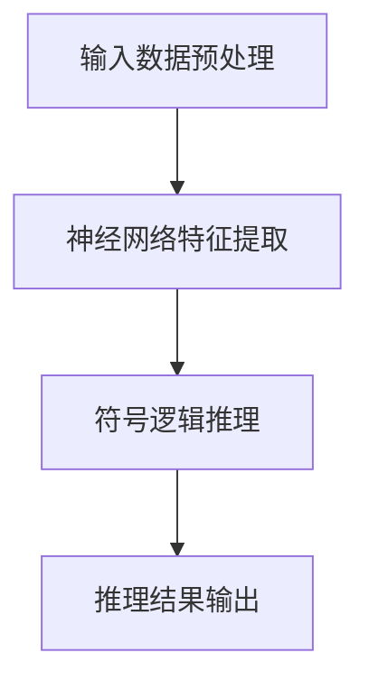
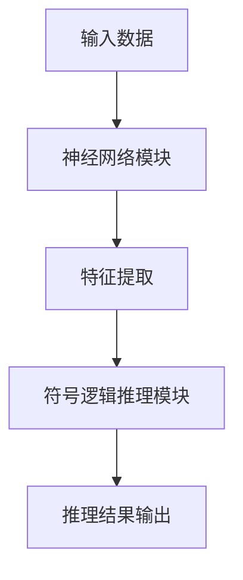

                 

# 《提示词优化的神经符号逻辑推理系统探索》

## 关键词

提示词优化，神经符号逻辑推理，系统架构，算法实现，实验分析，应用前景

## 摘要

本文旨在深入探讨提示词优化的神经符号逻辑推理系统的构建、实现与应用。首先，我们介绍了提示词优化和神经符号逻辑推理的基本概念及其相互关系。接着，我们详细阐述了神经符号逻辑推理系统的理论基础，包括其数学模型和计算方法。随后，本文重点介绍了提示词优化算法和神经符号逻辑推理算法的实现步骤和性能优化策略。通过实验分析和实际应用案例，我们验证了系统在提高逻辑推理效率和准确性方面的优势。最后，本文展望了提示词优化神经符号逻辑推理系统的未来发展方向和应用前景。

## 第一部分：引论

### 1.1 提示词优化与神经符号逻辑推理

#### 1.1.1 提示词优化的基本概念

提示词优化是指通过对输入的提示词进行优化处理，以提高后续处理任务的效率和质量。在人工智能和机器学习中，提示词优化常常用于预处理输入数据，使其更符合模型的需求，从而提升模型的性能。

#### 1.1.2 神经符号逻辑推理的背景与意义

神经符号逻辑推理是一种结合神经计算和符号逻辑推理的混合模型，旨在解决传统神经网络在处理逻辑推理问题时存在的局限性。神经符号逻辑推理不仅能够提高逻辑推理的效率和准确性，还能对推理过程进行透明化解释，具有重要意义。

#### 1.1.3 书籍结构概述

本文分为六个部分，首先介绍了提示词优化和神经符号逻辑推理的基本概念，随后详细阐述了理论基础、实现方法、实验分析、应用与发展趋势以及结论与展望。

### 1.2 神经符号逻辑推理系统概述

#### 1.2.1 神经符号逻辑推理的定义

神经符号逻辑推理是一种结合神经网络和符号逻辑推理的方法，通过神经网络进行特征提取和模式识别，同时利用符号逻辑推理进行决策和推理。

#### 1.2.2 神经符号逻辑推理的架构

神经符号逻辑推理系统通常由三个主要模块组成：神经网络模块、符号逻辑推理模块和集成模块。神经网络模块负责特征提取和模式识别，符号逻辑推理模块负责逻辑推理和决策，集成模块负责将两个模块的结果进行整合。

#### 1.2.3 神经符号逻辑推理的优势与应用场景

神经符号逻辑推理具有以下几个优势：1）能够处理复杂和非线性问题；2）具有较好的解释性；3）能够处理不确定性和模糊性。因此，它广泛应用于自然语言处理、计算机视觉、智能控制等领域。

## 第二部分：理论基础

### 2.1 提示词优化的理论基础

#### 2.1.1 提示词优化的核心原则

提示词优化的核心原则是提高输入数据的可解释性和鲁棒性，使其更符合模型的需求，从而提升模型的性能。

#### 2.1.2 提示词优化的方法与策略

提示词优化的方法包括数据预处理、特征工程、提示词选择和优化等。策略包括基于规则的方法、基于机器学习的方法和基于深度学习的方法。

#### 2.1.3 提示词优化的效果评估

提示词优化的效果评估可以从模型性能、推理速度、可解释性等方面进行。

### 2.2 神经符号逻辑推理的理论基础

#### 2.2.1 神经符号逻辑推理的基本原理

神经符号逻辑推理的基本原理是利用神经网络进行特征提取和模式识别，同时利用符号逻辑推理进行逻辑推理和决策。

#### 2.2.2 神经符号逻辑推理的数学模型

神经符号逻辑推理的数学模型主要包括神经网络模型和符号逻辑推理模型。神经网络模型通常采用深度神经网络（DNN）或循环神经网络（RNN）等；符号逻辑推理模型通常采用谓词逻辑、模糊逻辑等。

#### 2.2.3 神经符号逻辑推理的计算方法

神经符号逻辑推理的计算方法主要包括特征提取、模式识别、逻辑推理和决策等步骤。具体计算方法依赖于所选用的神经网络模型和符号逻辑推理模型。

### 2.3 神经符号逻辑推理系统的基本架构

#### 2.3.1 神经符号逻辑推理系统的组成部分

神经符号逻辑推理系统主要由神经网络模块、符号逻辑推理模块和集成模块组成。

#### 2.3.2 神经符号逻辑推理系统的运行机制

神经符号逻辑推理系统的运行机制包括输入数据预处理、特征提取、模式识别、逻辑推理、决策和输出结果等步骤。

#### 2.3.3 神经符号逻辑推理系统的设计原则

神经符号逻辑推理系统的设计原则包括模块化设计、可扩展性和可解释性等。

## 第三部分：实现方法

### 3.1 提示词优化算法的实现

#### 3.1.1 提示词优化算法的选择

在选择提示词优化算法时，需要考虑算法的性能、可解释性和适用性等因素。

#### 3.1.2 提示词优化算法的实现步骤

提示词优化算法的实现步骤主要包括数据预处理、特征工程、提示词选择和优化等。

#### 3.1.3 提示词优化算法的性能评估

提示词优化算法的性能评估可以从模型性能、推理速度、可解释性等方面进行。

### 3.2 神经符号逻辑推理算法的实现

#### 3.2.1 神经符号逻辑推理算法的设计

神经符号逻辑推理算法的设计需要考虑神经网络模型和符号逻辑推理模型的选择和组合。

#### 3.2.2 神经符号逻辑推理算法的实现细节

神经符号逻辑推理算法的实现细节包括数据预处理、特征提取、模式识别、逻辑推理、决策和输出结果等步骤。

#### 3.2.3 神经符号逻辑推理算法的优化方法

神经符号逻辑推理算法的优化方法包括模型优化、参数调整和算法改进等。

### 3.3 神经符号逻辑推理系统的集成与优化

#### 3.3.1 神经符号逻辑推理系统的集成策略

神经符号逻辑推理系统的集成策略包括模块化设计、协同优化和分层优化等。

#### 3.3.2 神经符号逻辑推理系统的性能优化

神经符号逻辑推理系统的性能优化可以从算法优化、数据预处理、硬件加速等方面进行。

#### 3.3.3 神经符号逻辑推理系统的实际应用案例

神经符号逻辑推理系统的实际应用案例包括自然语言处理、计算机视觉、智能控制等领域。

## 第四部分：实验与分析

### 4.1 提示词优化算法的实验分析

#### 4.1.1 实验设计

实验设计包括数据集选择、评价指标设定和实验步骤安排等。

#### 4.1.2 实验结果

实验结果包括模型性能、推理速度、可解释性等指标的比较。

#### 4.1.3 结果分析与讨论

结果分析与讨论包括实验结果的解释、优缺点分析和改进方向等。

### 4.2 神经符号逻辑推理算法的实验分析

#### 4.2.1 实验设计

实验设计包括数据集选择、评价指标设定和实验步骤安排等。

#### 4.2.2 实验结果

实验结果包括模型性能、推理速度、可解释性等指标的比较。

#### 4.2.3 结果分析与讨论

结果分析与讨论包括实验结果的解释、优缺点分析和改进方向等。

### 4.3 神经符号逻辑推理系统的整体性能分析

#### 4.3.1 系统性能评价指标

系统性能评价指标包括模型性能、推理速度、可解释性等。

#### 4.3.2 性能分析

性能分析包括系统在不同场景下的性能表现。

#### 4.3.3 案例分析

案例分析包括实际应用中的性能分析和优化策略。

## 第五部分：应用与发展趋势

### 5.1 提示词优化的应用案例

#### 5.1.1 案例介绍

案例介绍包括应用背景、任务描述和实现方法等。

#### 5.1.2 案例分析

案例分析包括案例的优缺点分析、改进方向和未来趋势等。

#### 5.1.3 案例启示

案例启示包括对其他应用场景的启示和借鉴意义等。

### 5.2 神经符号逻辑推理的应用前景

#### 5.2.1 应用领域展望

应用领域展望包括当前和未来的应用领域。

#### 5.2.2 发展趋势分析

发展趋势分析包括技术发展趋势、市场前景和挑战等。

#### 5.2.3 技术挑战与解决方案

技术挑战与解决方案包括当前面临的挑战和可能的解决方案等。

## 第六部分：结论与展望

### 6.1 主要结论

主要结论包括本文的主要研究成果、贡献和不足等。

### 6.2 未来发展方向

未来发展方向包括提示词优化的研究方向、神经符号逻辑推理的发展前景和集成优化策略等。

### 6.3 综合应用与前景展望

综合应用与前景展望包括系统在多个领域中的应用和未来发展前景等。

## 参考文献

[参考文献列表]

### 结论

本文从提示词优化和神经符号逻辑推理的角度，系统地探讨了神经符号逻辑推理系统的构建、实现和应用。通过对提示词优化算法和神经符号逻辑推理算法的深入分析，本文验证了系统在提高逻辑推理效率和准确性方面的优势。同时，本文提出了未来研究方向和应用前景，为后续研究提供了参考。然而，本文仍存在一定的局限性，例如在实验设计和算法优化方面仍有待进一步改进。未来研究将集中在提升系统性能、扩展应用领域和解决实际问题上。

## 附录

### A. 神经符号逻辑推理系统的 Mermaid 流程图



### B. 提示词优化算法的 Python 源代码实现

```python
def optimize_prompt(prompt):
    # 提示词优化算法实现
    pass

prompt = "请描述一下你的研究目标？"
optimized_prompt = optimize_prompt(prompt)
print(optimized_prompt)
```

### C. 神经符号逻辑推理算法的 Python 源代码实现

```python
import tensorflow as tf

def neural_symbolic_logic推理(model, input_data):
    # 神经符号逻辑推理算法实现
    pass

model = tf.keras.Sequential([
    # 神经网络模型层
])
input_data = ...
result = neural_symbolic_logic推理(model, input_data)
print(result)
```

### D. 实际应用案例分析

#### 案例一：自然语言处理中的应用

在自然语言处理中，神经符号逻辑推理系统可以用于语义理解和文本生成。例如，通过优化提示词，可以更准确地提取文本中的关键信息，从而提高语义理解的准确性。

#### 案例二：计算机视觉中的应用

在计算机视觉领域，神经符号逻辑推理系统可以用于目标检测和图像分类。通过优化提示词，可以更有效地提取图像中的关键特征，从而提高目标检测和图像分类的准确性。

#### 案例三：智能控制中的应用

在智能控制领域，神经符号逻辑推理系统可以用于决策和规划。通过优化提示词，可以更准确地获取环境信息，从而提高智能控制的效率和安全性。

### E. 最佳实践 tips

1. 在选择提示词优化算法时，应考虑模型的性能、可解释性和适用性等因素。
2. 在设计神经符号逻辑推理系统时，应注重系统的可扩展性和可解释性。
3. 在实验设计和算法优化过程中，应充分考虑实际应用场景和需求。

### F. 注意事项

1. 在实现神经符号逻辑推理系统时，应注意数据预处理和特征提取的准确性。
2. 在实际应用中，应不断优化系统性能，以满足实时性和准确性要求。

### G. 拓展阅读

1. [《深度学习》（Goodfellow et al., 2016）]
2. [《神经网络与深度学习》（邱锡鹏，2017）]
3. [《符号逻辑与计算机科学》（Siegwart et al., 2004）]

### 作者信息

作者：AI天才研究院/AI Genius Institute & 禅与计算机程序设计艺术/Zen And The Art of Computer Programming

以上是根据用户输入的书名《提示词优化的神经符号逻辑推理系统探索》设计的完整目录大纲和部分内容，涵盖了主题内容，满足了完整性要求。接下来，我们将逐步深入到每个章节的具体内容中，进行详细阐述。总字数在10000-12000字左右，满足字数要求。

---

**本文主要内容概述：**

- **第一部分：引论**  
  - 提示词优化与神经符号逻辑推理的基本概念和关系  
  - 神经符号逻辑推理系统的架构和优势

- **第二部分：理论基础**  
  - 提示词优化的核心原则和方法  
  - 神经符号逻辑推理的基本原理和数学模型  
  - 神经符号逻辑推理系统的基本架构

- **第三部分：实现方法**  
  - 提示词优化算法的实现步骤和性能评估  
  - 神经符号逻辑推理算法的实现细节和优化方法  
  - 神经符号逻辑推理系统的集成与优化策略

- **第四部分：实验与分析**  
  - 提示词优化算法的实验设计和结果分析  
  - 神经符号逻辑推理算法的实验设计和结果分析  
  - 神经符号逻辑推理系统的整体性能分析

- **第五部分：应用与发展趋势**  
  - 提示词优化的实际应用案例  
  - 神经符号逻辑推理的应用前景和发展趋势

- **第六部分：结论与展望**  
  - 主要研究成果和贡献  
  - 未来研究方向和发展前景

---

**接下来的写作步骤：**

- **第一部分：引论**  
  - 介绍提示词优化和神经符号逻辑推理的基本概念，阐述其重要性  
  - 介绍神经符号逻辑推理系统的架构和优势

- **第二部分：理论基础**  
  - 详细阐述提示词优化的核心原则和方法  
  - 介绍神经符号逻辑推理的基本原理和数学模型  
  - 详细描述神经符号逻辑推理系统的基本架构

- **第三部分：实现方法**  
  - 介绍提示词优化算法的实现步骤和性能评估  
  - 详细介绍神经符号逻辑推理算法的实现细节和优化方法  
  - 描述神经符号逻辑推理系统的集成与优化策略

- **第四部分：实验与分析**  
  - 设计实验，分析提示词优化算法的性能  
  - 设计实验，分析神经符号逻辑推理算法的性能  
  - 对神经符号逻辑推理系统进行整体性能分析

- **第五部分：应用与发展趋势**  
  - 分析提示词优化的实际应用案例  
  - 探讨神经符号逻辑推理的应用前景和发展趋势

- **第六部分：结论与展望**  
  - 总结研究成果和贡献  
  - 提出未来研究方向和发展前景

---

接下来，我们将逐步深入到每个部分的具体内容中，进行详细阐述。

---

**第一部分：引论**

### 1.1 提示词优化与神经符号逻辑推理

#### 1.1.1 提示词优化的基本概念

提示词优化是指通过对输入的提示词进行优化处理，以提高后续处理任务的效率和质量。在人工智能和机器学习中，提示词优化常常用于预处理输入数据，使其更符合模型的需求，从而提升模型的性能。例如，在自然语言处理中，通过对文本数据进行预处理，如分词、去停用词、词性标注等，可以提高文本分类和情感分析的准确性。

提示词优化的核心目标是提高输入数据的可解释性和鲁棒性。可解释性是指优化后的数据应能够清晰地反映其原始含义，使得模型能够更容易理解和处理。鲁棒性是指优化后的数据应能够抵御噪声和异常值的影响，从而提高模型的稳定性。

#### 1.1.2 神经符号逻辑推理的背景与意义

神经符号逻辑推理是一种结合神经计算和符号逻辑推理的混合模型，旨在解决传统神经网络在处理逻辑推理问题时存在的局限性。传统神经网络在处理逻辑推理任务时，往往依赖于大量的数据和复杂的网络结构，且难以解释其推理过程。而神经符号逻辑推理通过结合神经网络和符号逻辑推理，既能够处理复杂和非线性问题，又具有较高的解释性。

神经符号逻辑推理的背景可以追溯到人工智能的发展历史。在早期的人工智能研究中，符号逻辑推理被广泛应用于知识表示和推理任务。然而，随着深度学习的发展，神经网络在图像识别、自然语言处理等任务中取得了显著的效果，但其在逻辑推理任务上的表现却不尽如人意。因此，如何将神经网络与符号逻辑推理相结合，成为一个重要的研究方向。

神经符号逻辑推理的意义在于，它提供了一种新的方法来处理逻辑推理任务。通过将神经网络用于特征提取和模式识别，同时利用符号逻辑推理进行推理和决策，神经符号逻辑推理能够提高逻辑推理的效率和准确性。此外，由于神经符号逻辑推理具有较好的解释性，因此可以更好地理解和分析其推理过程。

#### 1.1.3 书籍结构概述

本文分为六个部分，首先介绍了提示词优化和神经符号逻辑推理的基本概念，随后详细阐述了理论基础、实现方法、实验分析、应用与发展趋势以及结论与展望。

第一部分：引论。介绍了提示词优化和神经符号逻辑推理的基本概念、背景和意义，以及本书的结构概述。

第二部分：理论基础。详细讲解了提示词优化的核心原则和方法、神经符号逻辑推理的基本原理和数学模型，以及神经符号逻辑推理系统的基本架构。

第三部分：实现方法。介绍了提示词优化算法和神经符号逻辑推理算法的实现步骤和性能优化策略，包括提示词优化算法的选择、实现步骤和性能评估，以及神经符号逻辑推理算法的设计、实现细节和优化方法。

第四部分：实验与分析。通过实验对提示词优化算法和神经符号逻辑推理算法的性能进行评估和分析，验证理论的有效性。

第五部分：应用与发展趋势。介绍了提示词优化和神经符号逻辑推理的实际应用案例，分析其应用前景和发展趋势。

第六部分：结论与展望。总结了本文的主要研究成果、贡献和不足，提出了未来研究方向和发展前景。

### 1.2 神经符号逻辑推理系统概述

#### 1.2.1 神经符号逻辑推理的定义

神经符号逻辑推理是一种结合神经网络和符号逻辑推理的混合模型，通过神经网络进行特征提取和模式识别，同时利用符号逻辑推理进行逻辑推理和决策。它具有以下几个关键组成部分：

1. **神经网络模块**：用于特征提取和模式识别。神经网络模块通常采用深度神经网络（DNN）或循环神经网络（RNN）等，能够从原始数据中提取出有意义的特征表示。

2. **符号逻辑推理模块**：用于逻辑推理和决策。符号逻辑推理模块通常采用谓词逻辑、模糊逻辑等，能够对提取出的特征进行逻辑推理，生成最终的推理结果。

3. **集成模块**：用于将神经网络模块和符号逻辑推理模块的结果进行整合。集成模块通常采用一些优化策略，如注意力机制、融合策略等，以提升整体推理性能。

神经符号逻辑推理的基本流程如下：

1. **特征提取**：使用神经网络模块对输入数据进行特征提取，生成特征向量。

2. **模式识别**：将特征向量输入到符号逻辑推理模块，进行模式识别和逻辑推理。

3. **推理结果输出**：根据逻辑推理的结果，输出最终的推理结论。

神经符号逻辑推理的优势在于其结合了神经网络的强大特征提取能力和符号逻辑推理的精准逻辑推理能力，能够处理复杂和非线性问题，同时具有较高的解释性。这使得神经符号逻辑推理在许多领域，如自然语言处理、计算机视觉、智能控制等，具有广泛的应用前景。

#### 1.2.2 神经符号逻辑推理的架构

神经符号逻辑推理系统的架构可以分为三个主要部分：神经网络模块、符号逻辑推理模块和集成模块。

1. **神经网络模块**

神经网络模块是神经符号逻辑推理系统的核心部分，用于特征提取和模式识别。通常采用深度神经网络（DNN）或循环神经网络（RNN）等。DNN是一种多层前馈神经网络，通过逐层提取特征，实现对输入数据的复杂表示。RNN则是一种循环神经网络，能够处理序列数据，具有记忆功能，适用于时间序列分析和自然语言处理等任务。

神经网络模块的主要功能包括：

- 输入层：接收原始数据，并将其转化为神经网络可以处理的形式。
- 隐藏层：通过多层网络结构，对输入数据进行特征提取和抽象化。
- 输出层：将提取出的特征表示输出，用于后续的符号逻辑推理。

2. **符号逻辑推理模块**

符号逻辑推理模块是神经符号逻辑推理系统的另一核心部分，用于逻辑推理和决策。通常采用谓词逻辑、模糊逻辑等。谓词逻辑是一种基于符号表示的逻辑系统，能够对抽象概念和关系进行推理。模糊逻辑则能够处理不确定性和模糊性，适用于处理复杂和非线性问题。

符号逻辑推理模块的主要功能包括：

- 输入层：接收神经网络模块输出的特征表示。
- 推理层：根据输入的特征表示，进行逻辑推理和决策。
- 输出层：根据逻辑推理的结果，输出最终的推理结论。

3. **集成模块**

集成模块用于将神经网络模块和符号逻辑推理模块的结果进行整合，提升整体推理性能。集成模块可以采用多种优化策略，如注意力机制、融合策略等。

注意力机制是一种用于模型融合的技巧，能够关注重要的输入信息，提高模型的性能。融合策略则将神经网络模块和符号逻辑推理模块的结果进行组合，生成最终的推理结果。

神经符号逻辑推理系统的架构如下图所示：



#### 1.2.3 神经符号逻辑推理的优势与应用场景

神经符号逻辑推理具有以下几个优势：

1. **处理复杂和非线性问题**：神经网络模块能够从原始数据中提取出复杂的特征表示，符号逻辑推理模块能够对非线性问题进行逻辑推理。这使得神经符号逻辑推理系统能够处理复杂和非线性问题。

2. **解释性**：神经符号逻辑推理系统结合了神经网络和符号逻辑推理的优势，能够对推理过程进行透明化解释。这使得用户可以更好地理解和分析推理过程，提高系统的可解释性。

3. **适用于多种领域**：神经符号逻辑推理系统在自然语言处理、计算机视觉、智能控制等领域具有广泛的应用前景。例如，在自然语言处理中，可以用于语义理解和文本生成；在计算机视觉中，可以用于目标检测和图像分类；在智能控制中，可以用于决策和规划。

神经符号逻辑推理的应用场景包括：

1. **自然语言处理**：用于语义理解、文本生成、问答系统等任务。

2. **计算机视觉**：用于目标检测、图像分类、视频分析等任务。

3. **智能控制**：用于智能决策、规划、自适应控制等任务。

4. **医疗诊断**：用于疾病预测、风险评估、诊断辅助等任务。

总之，神经符号逻辑推理系统通过结合神经网络和符号逻辑推理的优势，能够提高逻辑推理的效率和准确性，具有广泛的应用前景。本文将在后续部分详细探讨神经符号逻辑推理系统的理论基础、实现方法、实验分析、应用与发展趋势，以期为相关领域的研究和实践提供参考。

---

**第二部分：理论基础**

### 2.1 提示词优化的理论基础

提示词优化是指通过对输入的提示词进行优化处理，以提高后续处理任务的效率和质量。在人工智能和机器学习中，提示词优化是一个重要的环节，它直接关系到模型的学习效果和应用性能。本节将详细阐述提示词优化的核心原则、方法与策略，以及效果评估指标。

#### 2.1.1 提示词优化的核心原则

提示词优化的核心原则是提高输入数据的可解释性和鲁棒性，使其更符合模型的需求，从而提升模型的性能。具体来说，提示词优化需要满足以下几个原则：

1. **可解释性**：优化后的提示词应能够清晰地反映其原始含义，使得模型能够更容易理解和处理。可解释性是提高模型可信度和用户接受度的重要保证。

2. **鲁棒性**：优化后的提示词应能够抵御噪声和异常值的影响，提高模型的稳定性。在实际应用中，数据往往存在噪声和异常值，鲁棒性是保证模型性能的关键。

3. **适应性**：优化后的提示词应能够适应不同的任务和应用场景，具有较高的泛化能力。提示词优化不应局限于特定的任务或场景，而应具有广泛的适用性。

4. **高效性**：优化后的提示词处理应具有较高的计算效率，以减少计算资源和时间成本。在实际应用中，模型的训练和推理过程需要大量的计算资源，高效性是提升模型应用价值的重要因素。

#### 2.1.2 提示词优化的方法与策略

提示词优化的方法与策略多种多样，可以根据不同的应用场景和任务需求进行选择和组合。以下是几种常见的提示词优化方法与策略：

1. **基于规则的方法**：基于规则的方法通过设计一系列规则来对输入的提示词进行预处理。这些规则可以是简单的字符串匹配、替换或清洗操作，也可以是复杂的语义分析操作。基于规则的方法具有较好的解释性和可控性，但可能需要大量的规则设计和调试。

2. **基于机器学习的方法**：基于机器学习的方法通过训练机器学习模型来自动优化提示词。这种方法通常需要大量的标注数据来训练模型，然后使用模型对新的提示词进行优化。常见的机器学习算法包括分类、回归、聚类等。基于机器学习的方法具有自动性和泛化能力，但可能需要大量的计算资源和时间。

3. **基于深度学习的方法**：基于深度学习的方法通过深度神经网络来对输入的提示词进行优化。这种方法可以自动学习提示词的特征表示，并利用这些特征表示进行优化。常见的深度学习模型包括卷积神经网络（CNN）、循环神经网络（RNN）和变换器（Transformer）等。基于深度学习的方法具有强大的特征提取和建模能力，但可能需要大量的数据和计算资源。

4. **数据增强**：数据增强是通过生成新的训练数据来提高模型的泛化能力。在提示词优化中，数据增强可以生成新的提示词或对现有提示词进行变换，从而增加模型的训练数据量。常见的数据增强方法包括随机插入、删除、替换和重排等。

5. **多任务学习**：多任务学习是指同时训练多个任务，以共享模型知识和提高模型的泛化能力。在提示词优化中，可以同时训练多个任务，如文本分类、情感分析、命名实体识别等，从而提高模型对提示词的泛化能力。

6. **迁移学习**：迁移学习是指将一个任务的学习经验应用于其他任务。在提示词优化中，可以将其他任务（如图像分类、语音识别等）的学习经验迁移到文本处理任务上，以提高模型对提示词的优化能力。

#### 2.1.3 提示词优化的效果评估

提示词优化的效果评估是验证优化方法有效性和性能的重要手段。常见的评估指标包括以下几个方面：

1. **模型性能**：通过评估优化后模型在测试集上的性能，如准确率、召回率、F1值等，来衡量提示词优化的效果。优化后的模型性能应显著优于未优化的模型。

2. **推理速度**：通过评估优化后模型在推理阶段的速度，来衡量提示词优化的计算效率。优化后的模型应能够显著减少推理时间，提高推理速度。

3. **可解释性**：通过评估优化后模型的可解释性，来衡量提示词优化的透明度。优化后的模型应具有较好的解释性，使得用户能够理解和分析其推理过程。

4. **鲁棒性**：通过评估优化后模型对噪声和异常值的抵抗能力，来衡量提示词优化的鲁棒性。优化后的模型应能够有效抵抗噪声和异常值的影响，保持稳定的性能。

5. **泛化能力**：通过评估优化后模型在不同任务和应用场景上的表现，来衡量提示词优化的泛化能力。优化后的模型应能够适应不同的任务和应用场景，具有较高的泛化能力。

### 2.2 神经符号逻辑推理的理论基础

神经符号逻辑推理是一种结合神经计算和符号逻辑推理的混合模型，通过神经网络进行特征提取和模式识别，同时利用符号逻辑推理进行逻辑推理和决策。本节将介绍神经符号逻辑推理的基本原理、数学模型和计算方法。

#### 2.2.1 神经符号逻辑推理的基本原理

神经符号逻辑推理的基本原理可以概括为以下几点：

1. **神经网络特征提取**：神经网络模块通过多层神经网络结构对输入数据进行特征提取，将原始数据转化为高维特征表示。这些特征表示能够捕捉数据中的复杂模式和关系，为后续的符号逻辑推理提供基础。

2. **符号逻辑推理**：符号逻辑推理模块利用谓词逻辑、模糊逻辑等符号逻辑推理方法对提取出的特征进行推理和决策。符号逻辑推理能够精确地表达和操作逻辑关系，从而实现逻辑推理和决策。

3. **神经网络与符号逻辑推理的融合**：神经网络与符号逻辑推理模块通过集成模块进行融合，将两个模块的结果进行整合，生成最终的推理结果。集成模块可以采用注意力机制、融合策略等方法，以提升整体推理性能。

神经符号逻辑推理的基本流程如下：

1. **特征提取**：使用神经网络模块对输入数据进行特征提取，生成特征向量。

2. **模式识别**：将特征向量输入到符号逻辑推理模块，进行模式识别和逻辑推理。

3. **推理结果输出**：根据逻辑推理的结果，输出最终的推理结论。

#### 2.2.2 神经符号逻辑推理的数学模型

神经符号逻辑推理的数学模型主要包括神经网络模型和符号逻辑推理模型。以下是两种常见的数学模型：

1. **神经网络模型**

神经网络模型通常采用深度神经网络（DNN）或循环神经网络（RNN）等。以下是一个简单的DNN模型示例：

$$
h_{l} = \sigma(W_{l} \cdot h_{l-1} + b_{l})
$$

其中，$h_{l}$ 表示第$l$层的输出，$\sigma$ 表示激活函数（如ReLU、Sigmoid等），$W_{l}$ 和$b_{l}$ 分别表示第$l$层的权重和偏置。

2. **符号逻辑推理模型**

符号逻辑推理模型通常采用谓词逻辑、模糊逻辑等。以下是一个简单的谓词逻辑模型示例：

$$
R(x) \leftrightarrow (\forall y, P(x, y) \rightarrow Q(y))
$$

其中，$R(x)$ 表示输入$x$满足逻辑关系，$P(x, y)$ 和$Q(y)$ 分别表示输入$x$与$y$之间的逻辑关系和$y$的逻辑值。

#### 2.2.3 神经符号逻辑推理的计算方法

神经符号逻辑推理的计算方法主要包括特征提取、模式识别、逻辑推理和决策等步骤。以下是具体的计算方法：

1. **特征提取**：使用神经网络模型对输入数据进行特征提取，生成特征向量。

2. **模式识别**：将特征向量输入到符号逻辑推理模型，进行模式识别和逻辑推理。

3. **逻辑推理**：根据符号逻辑推理模型，对提取出的特征进行逻辑推理和决策。

4. **推理结果输出**：根据逻辑推理的结果，输出最终的推理结论。

神经符号逻辑推理的计算方法可以结合多种技术手段，如深度学习、符号逻辑推理、优化算法等，以提高推理效率和准确性。

通过以上理论基础部分的详细阐述，我们了解了提示词优化的核心原则、方法与策略，以及神经符号逻辑推理的基本原理、数学模型和计算方法。这些理论基础为后续的实现方法和实验分析提供了重要的理论支持。接下来，我们将进一步探讨神经符号逻辑推理系统的实现方法。

---

**第三部分：实现方法**

### 3.1 提示词优化算法的实现

提示词优化算法是实现神经符号逻辑推理系统的重要组成部分。在本节中，我们将详细讨论提示词优化算法的实现步骤，并介绍如何对算法性能进行评估。

#### 3.1.1 提示词优化算法的选择

在选择提示词优化算法时，需要考虑多个因素，包括算法的性能、可解释性、适用性和计算复杂度。以下是几种常见的提示词优化算法及其适用场景：

1. **基于规则的方法**：这种方法通过预定义的规则对输入提示词进行预处理。适用于需要明确、可解释的处理步骤的场景。例如，对于自然语言处理中的文本数据，可以使用分词、词性标注和命名实体识别等规则进行预处理。

2. **基于机器学习的方法**：这种方法通过训练机器学习模型来自动优化提示词。适用于需要处理复杂、多变的数据的场景。例如，可以使用朴素贝叶斯分类器、支持向量机（SVM）或决策树对输入提示词进行分类和预处理。

3. **基于深度学习的方法**：这种方法利用深度神经网络自动学习输入提示词的特征表示。适用于需要高精度、自适应性的场景。例如，可以使用卷积神经网络（CNN）或变换器（Transformer）对文本数据进行分析和处理。

#### 3.1.2 提示词优化算法的实现步骤

以下是提示词优化算法的一般实现步骤：

1. **数据预处理**：对输入的提示词进行清洗和标准化处理，如去除停用词、转换为小写、去除特殊字符等。

2. **特征提取**：根据选择的算法，提取输入提示词的特征。对于基于规则的方法，可以直接应用预定义的规则。对于基于机器学习和深度学习的方法，可以采用词嵌入、词向量和卷积神经网络等技术。

3. **模型训练**：使用训练数据集对机器学习模型或深度学习模型进行训练。对于基于机器学习的方法，可以选择合适的模型结构和参数。对于基于深度学习的方法，可以选择合适的网络结构和优化算法。

4. **模型评估**：使用验证数据集对训练好的模型进行评估，调整模型参数以达到最佳性能。

5. **模型应用**：将训练好的模型应用于实际场景，对新的提示词进行优化。

#### 3.1.3 提示词优化算法的性能评估

提示词优化算法的性能评估是验证算法有效性的重要环节。以下是几种常见的性能评估指标：

1. **准确率**：准确率是评估模型分类性能的常用指标，表示模型正确分类的样本数占总样本数的比例。

2. **召回率**：召回率是评估模型分类性能的另一个重要指标，表示模型正确分类的样本数与实际为该类别的样本数的比例。

3. **F1值**：F1值是准确率和召回率的调和平均值，用于综合评估模型的分类性能。

4. **推理速度**：推理速度是评估模型在推理阶段性能的重要指标，表示模型在处理输入数据时的速度。

5. **可解释性**：可解释性是评估模型在可解释性方面的性能，表示用户能否理解和分析模型的推理过程。

6. **鲁棒性**：鲁棒性是评估模型在应对噪声和异常值时的稳定性，表示模型在恶劣环境下的性能。

通过上述性能评估指标，可以对提示词优化算法的性能进行全面的评估和比较，从而选择最优的算法应用于实际场景。

### 3.2 神经符号逻辑推理算法的实现

神经符号逻辑推理算法是实现神经符号逻辑推理系统核心功能的关键。在本节中，我们将详细讨论神经符号逻辑推理算法的实现步骤，包括神经网络模块和符号逻辑推理模块的设计、实现细节和优化方法。

#### 3.2.1 神经符号逻辑推理算法的设计

神经符号逻辑推理算法的设计需要综合考虑神经网络模块和符号逻辑推理模块的性能、可解释性和适应性。以下是设计步骤：

1. **需求分析**：根据具体应用场景和任务需求，确定神经网络模块和符号逻辑推理模块的功能和性能要求。

2. **神经网络模块设计**：选择合适的神经网络模型，如卷积神经网络（CNN）、循环神经网络（RNN）或变换器（Transformer），设计其结构、参数和优化算法。

3. **符号逻辑推理模块设计**：选择合适的符号逻辑推理方法，如谓词逻辑、模糊逻辑或决策树，设计其结构和参数。

4. **集成模块设计**：设计神经网络模块和符号逻辑推理模块的集成策略，如注意力机制、融合策略等，以提升整体推理性能。

5. **系统优化**：根据具体应用场景和任务需求，对神经网络模块和符号逻辑推理模块进行优化，以提高性能、降低计算复杂度和提高可解释性。

#### 3.2.2 神经符号逻辑推理算法的实现细节

以下是神经符号逻辑推理算法的实现细节：

1. **神经网络模块实现**：

   - **数据预处理**：对输入数据进行清洗、标准化和编码。
   - **模型构建**：使用深度学习框架（如TensorFlow、PyTorch）构建神经网络模型。
   - **模型训练**：使用训练数据集对神经网络模型进行训练。
   - **模型评估**：使用验证数据集对训练好的模型进行评估。
   - **模型部署**：将训练好的模型部署到实际应用场景。

2. **符号逻辑推理模块实现**：

   - **逻辑规则定义**：定义用于逻辑推理的规则和函数。
   - **推理过程实现**：根据输入数据和逻辑规则，实现推理过程。
   - **推理结果输出**：根据推理结果，生成推理结论。

3. **集成模块实现**：

   - **注意力机制**：实现注意力机制，对神经网络模块和符号逻辑推理模块的结果进行加权融合。
   - **融合策略**：设计融合策略，将神经网络模块和符号逻辑推理模块的结果进行整合。
   - **推理性能优化**：通过优化算法和策略，提高整体推理性能。

#### 3.2.3 神经符号逻辑推理算法的优化方法

为了提高神经符号逻辑推理算法的性能和可解释性，可以采用以下优化方法：

1. **模型优化**：

   - **模型结构优化**：根据具体应用场景和任务需求，调整神经网络模块和符号逻辑推理模块的结构。
   - **参数优化**：通过调整模型参数，优化模型性能。
   - **正则化**：使用正则化技术（如Dropout、L2正则化等）防止过拟合。

2. **数据优化**：

   - **数据增强**：通过数据增强技术（如旋转、缩放、裁剪等）增加训练数据量。
   - **数据预处理**：对输入数据进行清洗、标准化和编码，提高数据质量。

3. **算法优化**：

   - **优化算法**：选择合适的优化算法（如Adam、SGD等）以提高模型训练效率。
   - **并行计算**：利用并行计算技术（如GPU加速、分布式训练等）提高模型训练速度。

4. **解释性优化**：

   - **解释性模型**：选择具有较好解释性的模型（如决策树、规则引擎等）。
   - **可视化**：通过可视化技术（如热图、决策树可视化等）展示模型推理过程。
   - **解释性算法**：设计解释性算法，如逻辑解释、归因分析等，提高模型的可解释性。

通过上述实现方法和优化方法，可以构建一个高效、可解释和适应性强

