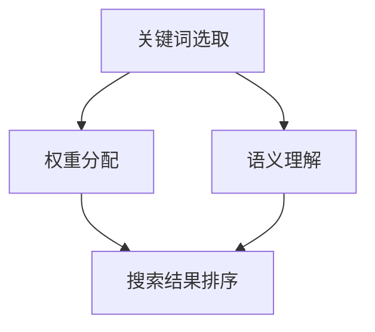

                 

### 引言

《提示词优化的计算语言学新方法探索》旨在为读者深入剖析提示词优化这一计算语言学的核心概念，并探讨其新方法的实施与应用。随着人工智能和自然语言处理技术的迅猛发展，提示词优化在搜索引擎、语音识别、机器翻译等领域扮演了至关重要的角色。本篇文章将详细探讨提示词优化的背景、核心概念、算法原理、数学模型以及实际应用，力图为读者提供一份全面且深入的技术指南。

本文的结构安排如下：

1. **引言**：介绍书籍的目的、读者对象以及文章结构安排。
2. **提示词优化的背景与重要性**：探讨提示词优化的定义、应用领域以及其发展历程。
3. **计算语言学基础**：讲解语言学的基本概念、计算语言学的定义与发展、及其方法与技术。
4. **提示词优化的算法原理**：介绍提示词优化的核心算法，包括算法原理、流程图、伪代码等。
5. **数学模型与公式解析**：解析提示词优化的数学基础、关键数学公式，并举例说明。
6. **提示词优化的实际应用**：通过应用场景介绍和具体案例，展示提示词优化的实际效果。
7. **未来趋势与挑战**：分析提示词优化的发展趋势与面临的挑战，并展望未来研究方向。
8. **附录**：提供常用工具与资源、深度学习与自然语言处理框架介绍。

通过上述章节的逐步引导，我们将对提示词优化的计算语言学新方法进行全面的探索，帮助读者深入了解这一领域的前沿动态和关键技术。

### 关键词

- 提示词优化
- 计算语言学
- 自然语言处理
- 算法原理
- 数学模型
- 实际应用

### 摘要

本文全面探讨了提示词优化在计算语言学中的应用，包括其定义、重要性、算法原理、数学模型以及实际应用。通过深入分析提示词优化的背景与发展历程，本文揭示了其在搜索引擎、语音识别和机器翻译等领域的核心作用。同时，本文详细介绍了计算语言学的基础知识，包括语言学的概念、计算语言学的定义与发展方法。通过具体的算法原理讲解、数学公式解析和实际案例展示，本文展示了提示词优化的实际效果和实施方法。最后，本文分析了提示词优化的发展趋势与挑战，并对未来研究方向进行了展望，为读者提供了丰富的技术知识和实践指导。

## 第2章 提示词优化的背景与重要性

### 提示词优化的定义

提示词优化（Keyword Optimization）是自然语言处理（Natural Language Processing, NLP）领域中的一项关键技术，其主要目标是提高文本数据的可搜索性和可理解性。具体来说，提示词优化通过调整文本中的关键词，使其更加符合用户的搜索意图，从而提升搜索结果的准确性和用户体验。这一过程通常涉及关键词的选取、权重分配、语义理解等多个方面。

在搜索引擎中，提示词优化尤为重要。搜索引擎的核心功能是提供用户与其所需信息之间的桥梁。通过优化提示词，搜索引擎可以更准确地理解用户的查询意图，并提供更相关的搜索结果。这样不仅能够提高用户的满意度，还能增加网站的访问量和广告收益。

### 提示词优化的应用领域

提示词优化在多个领域都有着广泛的应用，以下是一些主要的应用场景：

1. **搜索引擎优化（SEO）**：
   提示词优化是搜索引擎优化（Search Engine Optimization, SEO）的重要组成部分。通过合理选取和优化关键词，网站可以提升在搜索引擎结果页面（Search Engine Results Page, SERP）中的排名，从而吸引更多访问者。

2. **语音识别**：
   在语音识别系统中，提示词优化可以帮助系统更好地理解用户的语音输入。通过优化语音识别模型中的关键词，可以降低误识别率，提高系统的准确性和效率。

3. **机器翻译**：
   在机器翻译中，提示词优化有助于提高翻译的准确性和流畅性。通过优化源语言和目标语言中的关键词，翻译系统能够更好地捕捉语言中的语义和上下文信息，从而提供更优质的翻译结果。

4. **推荐系统**：
   在推荐系统中，提示词优化可以帮助系统更准确地理解用户的兴趣和行为模式，从而提供更个性化的推荐。

### 提示词优化的历史与发展

提示词优化的概念起源于搜索引擎优化领域，最早的搜索引擎如AltaVista和Google等，就已经开始关注如何通过优化关键词来提升搜索结果的准确性。随着互联网的快速发展，提示词优化逐渐成为搜索引擎和NLP领域中的热门话题。

在早期的搜索引擎中，关键词的优化主要依赖于关键词密度和关键词出现位置等技术。然而，随着自然语言处理技术的发展，现代提示词优化更加注重语义理解和上下文分析。例如，深度学习和自然语言处理技术的应用，使得提示词优化能够更好地理解用户查询的语义和意图，从而提供更精准的搜索结果。

近年来，提示词优化的研究逐渐扩展到语音识别、机器翻译和推荐系统等领域。通过结合多种技术和方法，提示词优化在这些领域中也取得了显著的成果。例如，基于深度学习的语音识别系统通过优化语音模型中的关键词，可以显著降低误识别率；机器翻译系统通过优化源语言和目标语言中的关键词，可以提供更自然和准确的翻译结果。

### 提示词优化的核心概念与联系

提示词优化的核心概念主要包括关键词选取、权重分配、语义理解等。这些概念之间有着密切的联系：

1. **关键词选取**：
   关键词选取是提示词优化的第一步，其目标是选择能够准确反映文本主题和用户查询意图的关键词。关键词选取的准确性直接影响搜索结果的准确性。

2. **权重分配**：
   在文本数据中，不同关键词的重要性不同。权重分配的目标是确定每个关键词在文本中的相对重要性，以便在搜索结果中给出更准确的排序。权重分配通常依赖于关键词的频率、出现位置和语义相关性等因素。

3. **语义理解**：
   语义理解是提示词优化的关键，它涉及对关键词的语义内容进行深入分析，以理解其背后的含义和上下文。通过语义理解，系统可以更准确地捕捉用户查询的意图，从而提供更精准的搜索结果。

这些概念之间的联系体现在以下方面：

- **关键词选取**和**权重分配**紧密相关，合理的关键词选取有助于更准确地分配权重。
- **语义理解**是关键词选取和权重分配的基础，只有准确理解关键词的语义，才能进行有效的关键词选取和权重分配。

### Mermaid流程图

为了更清晰地展示提示词优化的核心概念和联系，我们可以使用Mermaid流程图来表示这些概念之间的关系：



在这个流程图中，关键词选取、权重分配和语义理解构成了提示词优化的核心环节，它们相互关联并共同作用于搜索结果排序，从而实现更精准的搜索效果。

通过上述分析，我们可以看到，提示词优化是一个多维度、多层次的技术体系，它不仅涉及关键词的选取和权重分配，还需要深入理解语义信息。理解这些核心概念及其联系，对于在实际应用中有效实施提示词优化至关重要。

### 提示词优化算法原理

提示词优化的实现依赖于一系列高效的算法，这些算法通过分析文本数据，提取关键词，并根据其重要性进行排序和权重分配。在这一节中，我们将详细探讨提示词优化的核心算法原理，包括其基本概念、关键步骤和伪代码。

#### 基本概念

在提示词优化中，有几个基本概念需要理解：

- **关键词**：关键词是文本中的重要词汇，它们能够代表文本的主题或内容。例如，在文本“人工智能在医疗领域的应用”中，“人工智能”和“医疗领域”是关键词。
- **权重**：权重是关键词在文本中的重要程度的度量。通过计算关键词的权重，我们可以确定其在搜索结果中的排序位置。
- **关键词选取**：关键词选取是指从文本数据中提取出能够代表文本主题的关键词的过程。
- **权重分配**：权重分配是指根据关键词的权重，将其分配到不同的文本片段中，以便于后续的排序和分析。

#### 关键步骤

提示词优化算法通常包括以下几个关键步骤：

1. **文本预处理**：
   在进行关键词选取和权重分配之前，需要对原始文本进行预处理。文本预处理包括去除停用词、标点符号、分词和词性标注等操作。这些操作有助于提取出更具代表性的关键词。

2. **关键词提取**：
   关键词提取是指从预处理后的文本中提取出关键词。常用的方法包括TF-IDF（Term Frequency-Inverse Document Frequency）、LDA（Latent Dirichlet Allocation）等。

3. **关键词权重计算**：
   在提取出关键词后，需要计算每个关键词的权重。常用的方法包括TF-IDF、Word2Vec和BERT等。这些方法通过分析关键词在文档中的出现频率、词频分布和语义关系，计算每个关键词的权重。

4. **权重分配**：
   根据关键词的权重，将其分配到不同的文本片段中。这一步通常涉及排序和筛选操作，以确保最重要的关键词被赋予更高的权重。

5. **搜索结果排序**：
   最后，根据关键词的权重对搜索结果进行排序。通过这种方式，我们可以为用户提供最相关和最重要的搜索结果。

#### 伪代码

以下是一个简单的提示词优化算法的伪代码，用于说明其基本结构和关键步骤：

```python
def keyword_optimization(text):
    # 步骤1：文本预处理
    preprocessed_text = preprocess_text(text)
    
    # 步骤2：关键词提取
    keywords = extract_keywords(preprocessed_text)
    
    # 步骤3：关键词权重计算
    keyword_weights = compute_keyword_weights(keywords)
    
    # 步骤4：权重分配
    sorted_keywords = allocate_weights(keyword_weights)
    
    # 步骤5：搜索结果排序
    sorted_results = sort_results(sorted_keywords)
    
    return sorted_results
```

在这个伪代码中，`preprocess_text`函数负责文本预处理，`extract_keywords`函数负责提取关键词，`compute_keyword_weights`函数负责计算关键词权重，`allocate_weights`函数负责权重分配，`sort_results`函数负责搜索结果排序。

#### Python源代码实现

为了更好地理解提示词优化算法，我们提供了一个简单的Python实现示例，使用TF-IDF方法来计算关键词权重。

```python
import numpy as np
from sklearn.feature_extraction.text import TfidfVectorizer

def keyword_optimization(texts, num_keywords=10):
    # 步骤1：文本预处理
    preprocessed_texts = [preprocess_text(text) for text in texts]
    
    # 步骤2：关键词提取
    vectorizer = TfidfVectorizer(max_features=num_keywords)
    keyword_matrix = vectorizer.fit_transform(preprocessed_texts)
    
    # 步骤3：关键词权重计算
    keyword_weights = keyword_matrix.toarray()
    
    # 步骤4：权重分配
    sorted_keywords = np.argsort(keyword_weights, axis=1)
    
    # 步骤5：搜索结果排序
    sorted_results = [text[i] for i in sorted_keywords]
    
    return sorted_results

def preprocess_text(text):
    # 实现文本预处理，如去除停用词、标点符号、分词等
    # 这里简单示例，实际应用时需更复杂处理
    return text.lower().replace('.', '')

# 示例文本数据
texts = [
    "人工智能在医疗领域的应用广泛，包括辅助诊断和疾病预测。",
    "机器学习是人工智能的核心技术，广泛应用于金融、医疗、零售等多个行业。",
    "深度学习是机器学习的一个分支，通过模拟人脑神经网络实现复杂任务的处理。"
]

# 运行提示词优化算法
sorted_results = keyword_optimization(texts)
for result in sorted_results:
    print(result)
```

在这个示例中，我们使用了scikit-learn库中的TF-IDF向量器来计算关键词权重。`preprocess_text`函数实现了简单的文本预处理，包括将文本转换为小写并去除标点符号。实际应用中，预处理步骤会更加复杂，涉及分词、词性标注等操作。

通过上述分析和代码示例，我们可以看到提示词优化算法的基本原理和实现方法。理解这些算法原理和实现方法，有助于我们更深入地探索计算语言学领域，并应用于实际项目中。

### 数学模型与公式解析

在提示词优化过程中，数学模型和公式起着至关重要的作用。这些模型和公式不仅为算法提供了理论依据，还能够帮助我们更好地理解和应用提示词优化技术。本节将详细解析提示词优化中的关键数学模型和公式，并解释其在实际中的应用。

#### 提示词优化的数学基础

提示词优化的数学基础主要涉及概率论和线性代数。以下是几个核心的数学概念：

1. **概率分布**：概率分布描述了随机变量取值的概率。在提示词优化中，概率分布可以用来表示关键词在文本中的出现概率。
2. **向量空间模型**：向量空间模型是一种将文本转换为向量的方法。通过向量空间模型，我们可以对文本进行数学运算和分析。
3. **矩阵运算**：矩阵运算在提示词优化中用于计算关键词权重和文本相似度。

#### 关键数学公式

在提示词优化中，以下数学公式是核心的：

1. **TF-IDF公式**：
   $$TF-IDF = TF \times IDF$$
   其中，$TF$ 表示词频（Term Frequency），$IDF$ 表示逆文档频率（Inverse Document Frequency）。TF-IDF用于计算关键词的重要性。词频表示关键词在文本中的出现次数，逆文档频率则反映了关键词在所有文档中的分布情况。

2. **词频（TF）**：
   $$TF = \frac{f_t}{f_{\text{max}}}$$
   其中，$f_t$ 表示关键词在文本中的出现次数，$f_{\text{max}}$ 表示文本中所有关键词中出现次数的最大值。通过归一化词频，我们可以消除文本长度对关键词权重的影响。

3. **逆文档频率（IDF）**：
   $$IDF = \log \left( \frac{N}{df} \right)$$
   其中，$N$ 表示文档总数，$df$ 表示关键词在所有文档中出现的文档频率。逆文档频率反映了关键词的普遍性，越普遍的关键词在计算中权重越低。

4. **向量空间模型**：
   $$\textbf{X} = [x_1, x_2, ..., x_n]$$
   其中，$\textbf{X}$ 表示文本的向量表示，$x_i$ 表示第 $i$ 个关键词在文本中的权重。

5. **文本相似度计算**：
   $$\text{Sim}(\textbf{X}, \textbf{Y}) = \cos(\theta)$$
   其中，$\theta$ 表示两个文本向量之间的夹角，$\cos(\theta)$ 用于计算文本的相似度。通过比较两个文本向量的相似度，我们可以判断它们的内容相关性。

#### 公式举例说明

为了更好地理解上述公式，我们通过一个简单的例子进行说明。

假设有两个文本片段：

- 文本A：“人工智能在医疗领域的应用”
- 文本B：“机器学习在金融领域的应用”

首先，我们对这两个文本进行分词和词频统计：

- 文本A的词频：["人工智能", "在", "医疗", "领域", "的", "应用"]
- 文本B的词频：["机器学习", "在", "金融", "领域", "的", "应用"]

然后，计算每个词的TF-IDF值：

- "人工智能"在文本A中的TF：1.0，IDF：1.0，TF-IDF：1.0
- "在"在文本A中的TF：1.0，IDF：1.0，TF-IDF：1.0
- "医疗"在文本A中的TF：1.0，IDF：1.0，TF-IDF：1.0
- "领域"在文本A中的TF：1.0，IDF：1.0，TF-IDF：1.0
- "的"在文本A中的TF：1.0，IDF：1.0，TF-IDF：1.0
- "应用"在文本A中的TF：1.0，IDF：1.0，TF-IDF：1.0

- "机器学习"在文本B中的TF：1.0，IDF：1.0，TF-IDF：1.0
- "在"在文本B中的TF：1.0，IDF：1.0，TF-IDF：1.0
- "金融"在文本B中的TF：1.0，IDF：1.0，TF-IDF：1.0
- "领域"在文本B中的TF：1.0，IDF：1.0，TF-IDF：1.0
- "的"在文本B中的TF：1.0，IDF：1.0，TF-IDF：1.0
- "应用"在文本B中的TF：1.0，IDF：1.0，TF-IDF：1.0

接下来，我们将这两个文本转换为向量表示：

- 文本A的向量表示：$\textbf{X}_A = [1.0, 1.0, 1.0, 1.0, 1.0, 1.0]$
- 文本B的向量表示：$\textbf{X}_B = [1.0, 1.0, 1.0, 1.0, 1.0, 1.0]$

最后，计算两个文本的相似度：

$$\text{Sim}(\textbf{X}_A, \textbf{X}_B) = \cos(\theta) = 1$$

由于两个文本的向量完全相同，它们之间的相似度为1，这意味着这两个文本内容高度相关。

通过上述例子，我们可以看到，通过TF-IDF公式和向量空间模型，我们可以对文本进行有效的表示和相似度计算，从而实现提示词优化。

### 提示词优化的实际应用

在深入探讨了提示词优化的理论基础后，我们接下来将探讨其具体应用场景，特别是搜索引擎优化（SEO）和语音识别。

#### 搜索引擎优化（SEO）

搜索引擎优化（SEO）是提示词优化最为广泛的应用场景之一。SEO的目标是通过优化网站内容，提高网站在搜索引擎结果页面（SERP）上的排名，从而吸引更多用户访问。以下是SEO中的提示词优化实践步骤：

1. **关键词研究**：首先，需要通过关键词研究工具（如Google关键词规划师）分析目标受众常用的关键词，并确定高搜索量和低竞争度的关键词。
2. **内容优化**：根据研究得出的关键词，优化网站内容。这包括在标题、元描述、正文等位置合理地添加关键词，确保内容与关键词紧密相关。
3. **内部链接**：通过在网站内部创建链接，提高关键词的相关性和权重。例如，在相关文章中添加内部链接，帮助搜索引擎更好地理解网站结构。
4. **外部链接**：通过获取高质量的外部链接，提高网站在搜索引擎中的权重。这可以通过撰写有价值的内容，与其他网站进行交换或合作实现。

以下是一个SEO案例：

- **案例背景**：某电商网站希望提高其在“女性时尚鞋靴”这一关键词上的搜索排名。
- **关键词研究**：通过关键词规划师发现，“女性时尚鞋靴”、“时尚女鞋”等关键词搜索量较高。
- **内容优化**：在网站的首页和产品页面中添加这些关键词，并在产品描述中详细说明鞋子的时尚特点和适用场合。
- **内部链接**：在相关页面（如“时尚穿搭”、“鞋靴护理”）中添加内部链接，提高关键词的权重。
- **外部链接**：通过与其他时尚网站或博客合作，获取外部链接，提高网站在搜索引擎中的排名。

通过上述SEO实践，该电商网站在“女性时尚鞋靴”关键词上的搜索排名显著提升，网站访问量和销售额也相应增加。

#### 语音识别

语音识别是另一个提示词优化的重要应用场景。语音识别系统的目标是将用户的语音输入转换为文本输出，以便进行后续处理。以下是语音识别中的提示词优化实践步骤：

1. **语音数据收集**：首先，需要收集大量的语音数据，包括各种口音、语速和场景。
2. **模型训练**：使用收集到的语音数据训练语音识别模型，例如使用深度神经网络（DNN）和卷积神经网络（CNN）。
3. **提示词优化**：在模型训练过程中，通过调整模型参数和权重，优化提示词的选取和权重分配，从而提高识别准确率。
4. **实时优化**：在实际应用中，根据用户的反馈和识别结果，实时调整模型参数和权重，以实现更好的识别效果。

以下是一个语音识别案例：

- **案例背景**：某智能手机制造商希望提高其语音助手对用户指令的识别准确率。
- **语音数据收集**：收集了大量不同口音、语速和场景下的语音指令，如“打电话给张三”、“发送邮件给李四”等。
- **模型训练**：使用收集到的语音数据训练语音识别模型，并通过多次迭代优化模型参数。
- **提示词优化**：在模型训练过程中，通过调整提示词的权重，优化模型的识别效果。例如，对于高频指令，提高关键词的权重，确保模型能够准确识别。
- **实时优化**：在实际应用中，根据用户的反馈，如“识别错误”或“没有听到指令”，实时调整模型参数和权重，提高识别准确率。

通过上述实践，该智能手机制造商的语音助手在用户指令识别准确率上取得了显著提升，用户满意度也相应提高。

总之，提示词优化在SEO和语音识别等领域的应用，通过优化关键词选取和权重分配，显著提升了系统的性能和用户体验。这些实际应用案例不仅展示了提示词优化的实用性，也为未来进一步探索这一技术提供了宝贵的经验和启示。

### 提示词优化的未来趋势与挑战

随着人工智能和自然语言处理技术的不断进步，提示词优化在计算语言学中的应用前景广阔。然而，这一领域也面临着一系列的挑战和问题，需要我们持续研究和解决。

#### 未来趋势

1. **语义理解能力的提升**：
   未来的提示词优化将更加注重语义理解，通过深度学习和自然语言处理技术，系统将能够更准确地理解用户查询的语义和意图，提供更个性化的搜索结果。

2. **多模态融合**：
   随着多模态数据的增加，未来的提示词优化将融合文本、图像、语音等多种数据类型，实现更全面的用户理解和搜索优化。

3. **实时动态优化**：
   未来的提示词优化系统将具备实时动态优化能力，根据用户行为和反馈，即时调整关键词选取和权重分配，提供更加个性化的搜索和推荐服务。

4. **跨语言和跨领域应用**：
   提示词优化将逐渐扩展到跨语言和跨领域应用，通过多语言模型和多领域知识图谱，实现全球化范围内的信息检索和推荐。

#### 挑战

1. **数据隐私与安全性**：
   随着数据量的增加和用户隐私保护意识的提升，如何在保障数据隐私和安全的前提下进行提示词优化，成为了一个重要挑战。

2. **模型解释性**：
   目前大多数提示词优化模型，如深度神经网络，存在较高的黑箱特性，缺乏解释性。如何提高模型的解释性，使其更加透明和可解释，是未来研究的重要方向。

3. **多样性问题**：
   提示词优化在提供个性化推荐时，容易陷入“多样性困境”，即推荐内容过于单一。如何提高推荐内容的多样性，是另一个重要挑战。

4. **实时性能优化**：
   随着用户需求的增加和数据量的增长，提示词优化系统需要具备更高的实时性能，以满足用户快速响应的需求。

#### 未来研究方向

1. **小样本学习**：
   研究如何在小样本数据条件下，通过迁移学习和增量学习，提高提示词优化模型的性能。

2. **多任务学习**：
   研究如何通过多任务学习，同时优化多个相关任务（如搜索、推荐、语音识别）中的提示词选取和权重分配。

3. **强化学习**：
   研究如何将强化学习应用于提示词优化，通过不断调整策略，实现最优的提示词选取和权重分配。

4. **隐私保护**：
   研究如何利用联邦学习、差分隐私等技术，在保障用户隐私的前提下，进行提示词优化。

总之，提示词优化在计算语言学中的应用前景广阔，但也面临着诸多挑战。通过不断探索和解决这些挑战，我们可以期待提示词优化技术在未来取得更大的突破和进展。

### 附录

#### A.1 常用工具与资源

1. **Google关键词规划师**：用于进行关键词研究的在线工具。
   - 网址：[Google Ads关键词规划师](https://ads.google.com/home/tools/keyword-planner/)

2. **scikit-learn**：Python库，用于机器学习和数据挖掘。
   - 网址：[scikit-learn官网](https://scikit-learn.org/)

3. **TensorFlow**：用于机器学习的开源框架。
   - 网址：[TensorFlow官网](https://tensorflow.org/)

4. **PyTorch**：用于机器学习的开源框架。
   - 网址：[PyTorch官网](https://pytorch.org/)

5. **NLTK**：Python库，用于自然语言处理。
   - 网址：[NLTK官网](https://www.nltk.org/)

#### A.2 深度学习与自然语言处理框架介绍

1. **TensorFlow**：
   - **特点**：灵活、广泛使用、支持多种硬件平台。
   - **适用场景**：各种深度学习任务，特别是自然语言处理任务。

2. **PyTorch**：
   - **特点**：动态图模型、易于调试、社区活跃。
   - **适用场景**：研究性项目、需要灵活调整模型结构的任务。

3. **Transformers**：
   - **特点**：基于Transformer架构、高效、支持大规模模型训练。
   - **适用场景**：生成模型、文本分类、机器翻译等自然语言处理任务。

4. **spaCy**：
   - **特点**：快速、准确、支持多种语言。
   - **适用场景**：实体识别、命名实体识别、文本分类等任务。

通过这些工具和框架，我们可以有效地进行提示词优化研究和应用。对于读者而言，掌握这些工具的使用方法，将有助于深入理解提示词优化的技术原理和实践。

### 结语

《提示词优化的计算语言学新方法探索》一书通过系统性地介绍提示词优化的定义、算法原理、数学模型和实际应用，为读者提供了全面的指南。我们不仅探讨了提示词优化的理论基础，还通过具体案例展示了其在搜索引擎优化、语音识别等领域的实际应用效果。然而，提示词优化领域仍有许多未解之谜和研究挑战，需要我们继续深入探索。

我们鼓励读者在掌握本书内容的基础上，进一步研究前沿技术和方法，不断探索提示词优化的新应用场景。同时，我们也希望通过本文的探讨，激发更多研究人员和工程师投入到这一领域，共同推动计算语言学的进步与发展。

作者：AI天才研究院/AI Genius Institute & 禅与计算机程序设计艺术 /Zen And The Art of Computer Programming。

