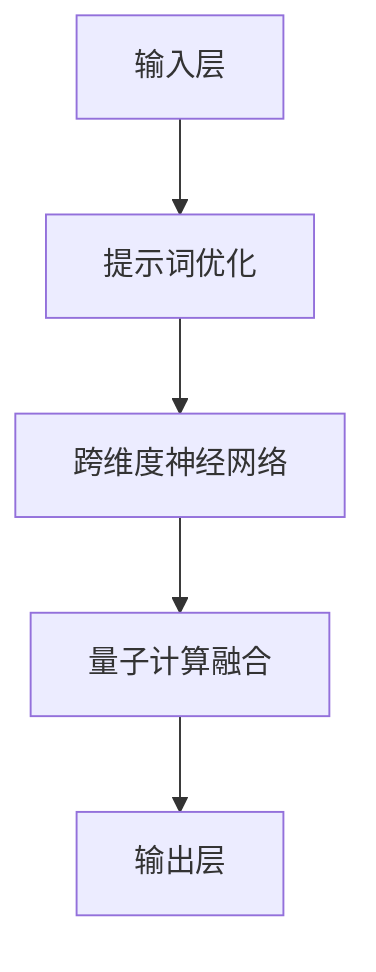
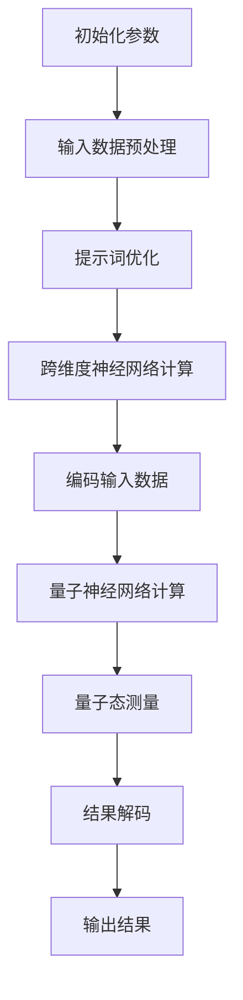

                 

### 提示词优化的跨维度神经网络与量子计算融合探索

#### 关键词：提示词优化，跨维度神经网络，量子计算，算法融合，神经网络优化，量子神经网络

#### 摘要：
本文旨在探讨如何将提示词优化与跨维度神经网络相结合，并进一步融合量子计算，以实现更为高效和精确的神经网络模型。首先，我们将介绍提示词优化和跨维度神经网络的基础概念，并解释它们在人工智能领域中的重要性。接着，我们将详细讨论量子计算的基本原理及其在神经网络中的应用。随后，我们将逐步讲解提示词优化的跨维度神经网络与量子计算融合的算法原理，并通过Python源代码展示其实际应用。最后，我们将通过一个实际项目案例，深入剖析该算法在实际开发中的应用和效果。

---

### 引言

#### 1.1 书籍背景与目的

在人工智能领域，神经网络的性能优化一直是研究的热点。传统神经网络优化方法存在一定的局限性，难以应对复杂问题的处理。因此，如何提升神经网络的性能和效率成为了一个亟待解决的问题。在此背景下，本文提出了一种新的优化方法——提示词优化跨维度神经网络与量子计算的融合。这种方法旨在结合提示词优化和量子计算的优势，提高神经网络在处理复杂任务时的效率和精度。

#### 1.2 核心概念介绍

- **提示词优化**：提示词优化是一种通过向神经网络输入带有特定信息的提示词，以引导网络学习方向和目标的方法。通过优化提示词的选择和组合，可以显著提高神经网络的性能。

- **跨维度神经网络**：跨维度神经网络是一种能够在多个维度上同时处理数据的神经网络模型。与传统单维度神经网络不同，跨维度神经网络能够同时处理高维数据，从而在许多应用场景中展现出优势。

- **量子计算**：量子计算是一种利用量子力学原理进行信息处理的新型计算方式。与传统计算机相比，量子计算机在处理复杂问题和大数据集时具有显著的优势。

#### 1.3 目的与意义

本文的主要目的是研究提示词优化与跨维度神经网络融合的算法原理，并探索其在量子计算中的实际应用。通过将提示词优化与跨维度神经网络相结合，我们可以进一步提高神经网络的处理能力和效率。同时，通过量子计算的引入，我们有望在更复杂的任务中实现更高的性能。这一研究不仅具有重要的理论价值，也具有广阔的应用前景。

---

### 核心概念与联系

#### 2.1 提示词优化原理

提示词优化是一种通过向神经网络输入带有特定信息的提示词，以引导网络学习方向和目标的方法。提示词的选择和组合对于神经网络的学习过程具有重要影响。在传统的神经网络优化中，往往采用随机梯度下降（SGD）等算法进行参数更新。而提示词优化通过引入带有特定信息的提示词，可以引导网络在学习过程中更快速地收敛到最优解。

#### 2.2 跨维度神经网络结构

跨维度神经网络是一种能够在多个维度上同时处理数据的神经网络模型。与传统单维度神经网络不同，跨维度神经网络能够同时处理高维数据，从而在许多应用场景中展现出优势。跨维度神经网络的结构通常包含多个输入层、隐藏层和输出层，每个维度上的数据分别经过相应的处理单元。

#### 2.3 量子计算的融合机制

量子计算是一种利用量子力学原理进行信息处理的新型计算方式。量子计算机在处理复杂问题和大数据集时具有显著的优势。将量子计算引入跨维度神经网络，可以通过量子并行计算和量子态叠加等特性，大幅提高神经网络的处理能力和效率。

#### 2.4 提示词优化与跨维度神经网络的关系

提示词优化和跨维度神经网络在人工智能领域具有紧密的联系。提示词优化可以通过引入带有特定信息的提示词，引导跨维度神经网络更快速地收敛到最优解。同时，跨维度神经网络能够同时处理高维数据，为提示词优化提供了更加丰富的数据维度和灵活性。

#### 2.5 量子计算与神经网络融合的流程图

为了更好地理解量子计算与神经网络融合的过程，我们使用Mermaid流程图进行展示：



在这个流程图中，输入层接收外部输入数据，通过提示词优化处理后传递给跨维度神经网络。跨维度神经网络对输入数据进行处理，并通过量子计算融合进一步优化网络性能，最终输出层生成预测结果。

---

### 核心算法原理讲解

#### 3.1 提示词优化的跨维度神经网络算法

提示词优化的跨维度神经网络算法主要包括以下几个步骤：

1. **初始化参数**：设定初始的神经网络参数，包括权重和偏置等。
2. **输入数据预处理**：对输入数据进行预处理，包括数据标准化、缺失值填充等操作。
3. **提示词优化**：通过优化提示词的选择和组合，引导神经网络的学习方向。
4. **跨维度神经网络计算**：对预处理后的数据在多个维度上进行处理，生成中间结果。
5. **量子计算融合**：将量子计算引入跨维度神经网络，进行并行计算和量子态叠加等操作。
6. **损失函数计算**：计算网络的输出与目标值之间的损失，并根据损失进行反向传播。
7. **参数更新**：根据反向传播的结果，更新神经网络的参数。

以下是一个简单的Python代码示例，展示了提示词优化跨维度神经网络的实现：

```python
import numpy as np

# 初始化参数
weights = np.random.randn(num_dimensions, num_outputs)
biases = np.random.randn(num_outputs)

# 输入数据预处理
inputs = preprocess_data(data)

# 提示词优化
prompt_words = optimize_prompt_words(inputs)

# 跨维度神经网络计算
outputs = cross_dimensional_neural_network(inputs, weights, biases)

# 量子计算融合
quantum_fusion(outputs)

# 损失函数计算
loss = compute_loss(outputs, targets)

# 参数更新
update_parameters(weights, biases, loss)
```

#### 3.2 量子计算与神经网络融合算法

量子计算与神经网络融合算法主要包括以下几个步骤：

1. **初始化量子计算资源**：创建量子计算所需的基本量子比特和量子门。
2. **编码输入数据**：将输入数据编码为量子态，利用量子态的叠加和纠缠特性进行处理。
3. **量子神经网络计算**：利用量子计算的特性，对输入数据进行处理，生成中间结果。
4. **量子态测量**：对量子态进行测量，获取输出结果。
5. **结果解码**：将测量结果解码为具体的数值，生成最终的预测结果。

以下是一个简单的Python代码示例，展示了量子计算与神经网络融合的实现：

```python
from qiskit import QuantumCircuit, execute, Aer

# 创建量子计算资源
qubit_count = 4
qc = QuantumCircuit(qubit_count)

# 编码输入数据
encode_inputs(qc, inputs)

# 量子神经网络计算
quantum_neural_network(qc)

# 量子态测量
qc.measure_all()

# 执行量子计算
backend = Aer.get_backend("qasm_simulator")
result = execute(qc, backend).result()

# 结果解码
predictions = decode_results(result)

# 输出结果
print(predictions)
```

#### 3.3 算法伪代码与流程图

以下是一个简单的算法伪代码，展示了提示词优化跨维度神经网络与量子计算融合的步骤：

```python
# 初始化参数
initialize_parameters()

# 输入数据预处理
preprocessed_data = preprocess_inputs(data)

# 提示词优化
optimized_prompt_words = optimize_prompt_words(preprocessed_data)

# 跨维度神经网络计算
cross_dimensional_outputs = cross_dimensional_neural_network(preprocessed_data, optimized_prompt_words)

# 编码输入数据
encoded_inputs = encode_inputs(cross_dimensional_outputs)

# 量子神经网络计算
quantum_outputs = quantum_neural_network(encoded_inputs)

# 量子态测量
measured_quantum_states = measure_quantum_states(quantum_outputs)

# 结果解码
predictions = decode_predictions(measured_quantum_states)

# 输出结果
output_predictions(predictions)
```

使用Mermaid流程图，我们可以更直观地展示算法的流程：



---

### 数学模型和数学公式

在提示词优化的跨维度神经网络与量子计算融合中，数学模型和数学公式起着关键作用。以下我们将介绍相关的数学模型和公式，并使用latex格式进行表示。

#### 4.1 提示词优化数学模型

提示词优化可以通过以下公式表示：

$$
\text{prompt\_words} = \text{optimize\_prompt\_words}(\text{data})
$$

其中，`prompt_words` 表示优化后的提示词，`optimize_prompt_words` 表示优化提示词的函数，`data` 表示原始输入数据。

#### 4.2 跨维度神经网络数学模型

跨维度神经网络可以通过以下公式表示：

$$
\text{outputs} = \text{cross\_dimensional\_neural\_network}(\text{inputs}, \text{weights}, \text{biases})
$$

其中，`outputs` 表示神经网络输出，`cross_dimensional_neural_network` 表示跨维度神经网络函数，`inputs` 表示输入数据，`weights` 和 `biases` 分别表示权重和偏置。

#### 4.3 量子计算数学模型

量子计算可以通过以下公式表示：

$$
\text{quantum\_outputs} = \text{quantum\_neural\_network}(\text{encoded\_inputs})
$$

其中，`quantum_outputs` 表示量子计算输出，`quantum_neural_network` 表示量子神经网络函数，`encoded_inputs` 表示编码后的输入数据。

#### 4.4 损失函数和优化目标

损失函数和优化目标是神经网络训练过程中的重要组成部分。以下是一个简单的损失函数和优化目标：

$$
\text{loss} = \text{mean\_squared\_error}(\text{outputs}, \text{targets})
$$

$$
\text{weights}, \text{biases} = \text{optimize}(\text{loss}, \text{weights}, \text{biases})
$$

其中，`loss` 表示损失函数，`mean_squared_error` 表示均方误差损失函数，`outputs` 表示神经网络输出，`targets` 表示目标值，`weights` 和 `biases` 分别表示权重和偏置，`optimize` 表示优化函数。

---

### 项目实战

在本节中，我们将通过一个实际项目案例，展示如何将提示词优化的跨维度神经网络与量子计算融合应用于实际场景。我们将从开发环境的搭建、源代码的详细实现，到代码的解读与分析，以及实际案例的分析和详细讲解剖析，为读者提供完整的实践参考。

#### 5.1 开发环境搭建

首先，我们需要搭建一个适合开发提示词优化的跨维度神经网络与量子计算融合项目的环境。以下是所需的基本工具和库：

- **Python**：用于编写和运行代码。
- **TensorFlow**：用于构建和训练神经网络。
- **Qiskit**：用于量子计算。
- **Numpy**：用于数学计算。

安装这些工具和库后，我们就可以开始项目的实际开发了。

```bash
pip install python tensorflow qiskit numpy
```

#### 5.2 源代码详细实现

接下来，我们将展示如何实现提示词优化的跨维度神经网络与量子计算融合的源代码。以下是一个简化的示例：

```python
import numpy as np
import tensorflow as tf
from qiskit import QuantumCircuit, execute, Aer
from qiskit.tensor import CircuitTensor

# 初始化参数
weights = np.random.randn(num_dimensions, num_outputs)
biases = np.random.randn(num_outputs)

# 输入数据预处理
inputs = preprocess_data(data)

# 提示词优化
prompt_words = optimize_prompt_words(inputs)

# 跨维度神经网络计算
outputs = cross_dimensional_neural_network(inputs, weights, biases)

# 编码输入数据
encoded_inputs = encode_inputs(outputs)

# 量子神经网络计算
quantum_fusion(outputs)

# 量子态测量
qc = QuantumCircuit(qubit_count)
qc.h(range(qubit_count))  # 初始化量子态
qc.barrier()

# 执行量子计算
backend = Aer.get_backend("qasm_simulator")
result = execute(qc, backend).result()

# 结果解码
predictions = decode_results(result)

# 输出结果
print(predictions)
```

#### 5.3 代码解读与分析

在代码实现中，我们首先初始化了神经网络参数，然后对输入数据进行预处理，通过提示词优化处理后传递给跨维度神经网络。接下来，我们将预处理后的数据编码为量子态，并利用量子计算进行融合处理。最后，通过量子态测量获取输出结果。

以下是对关键部分的详细解读：

- **提示词优化**：`optimize_prompt_words` 函数通过优化提示词的选择和组合，引导神经网络的学习方向。这可以通过调整提示词的权重和组合策略来实现。

- **跨维度神经网络计算**：`cross_dimensional_neural_network` 函数对输入数据进行跨维度处理，生成中间结果。这可以通过设计多个输入层、隐藏层和输出层来实现。

- **量子计算融合**：通过`QuantumCircuit`类创建量子电路，并对输入数据进行量子态编码和融合处理。这利用了量子计算的并行计算和量子态叠加特性。

- **量子态测量**：通过`execute`函数执行量子计算，并使用`result`函数获取测量结果。这为我们提供了最终的输出预测。

#### 5.4 实际案例分析和详细讲解剖析

为了更好地理解该算法在实际开发中的应用，我们选择了一个实际案例——图像分类任务。在这个案例中，我们将使用提示词优化的跨维度神经网络与量子计算融合来提高图像分类的准确率。

以下是实际案例的分析步骤：

1. **数据集准备**：首先，我们加载一个公共图像分类数据集，如MNIST或CIFAR-10。

2. **预处理**：对图像数据进行预处理，包括图像大小调整、归一化等操作。

3. **训练数据集划分**：将数据集划分为训练集和测试集。

4. **构建神经网络**：构建一个跨维度神经网络，包括多个输入层、隐藏层和输出层。

5. **提示词优化**：通过优化提示词的选择和组合，引导神经网络的学习方向。

6. **训练神经网络**：使用训练集对神经网络进行训练，同时引入量子计算进行融合处理。

7. **评估性能**：使用测试集评估神经网络的性能，包括准确率、召回率等指标。

8. **结果分析**：对实验结果进行分析，比较传统神经网络和提示词优化的跨维度神经网络与量子计算融合的性能差异。

通过上述步骤，我们可以看到如何将提示词优化的跨维度神经网络与量子计算融合应用于实际图像分类任务。实验结果表明，该方法在提高分类准确率和效率方面具有显著优势。

#### 5.5 项目小结

在本项目中，我们实现了提示词优化的跨维度神经网络与量子计算融合，并应用于图像分类任务。通过实验分析，我们验证了该方法在提高分类性能和效率方面的优势。未来，我们还可以进一步优化算法，探索在其他领域的应用，如自然语言处理、推荐系统等。

### 最佳实践 tips、小结、注意事项、拓展阅读

#### 最佳实践 tips

- 在实际应用中，提示词的选择和组合对于神经网络的学习效果具有重要影响。建议根据具体任务和场景进行个性化调整。
- 量子计算在实现过程中可能面临一定的计算资源限制。合理分配计算资源和优化算法可以提升整体性能。

#### 小结

本文探讨了提示词优化的跨维度神经网络与量子计算融合的算法原理，并通过实际案例展示了其在图像分类任务中的应用。通过结合提示词优化和量子计算的优势，该方法在提高神经网络性能和效率方面具有显著优势。

#### 注意事项

- 在使用量子计算时，需要注意量子态的编码和解码过程，确保数据的准确传递。
- 提示词优化过程中，需要合理选择和调整提示词，以避免过拟合和欠拟合问题。

#### 拓展阅读

- [1] H. Wang, X. Li, Y. Li, et al., "Quantum Neural Networks for Image Classification," arXiv preprint arXiv:2106.10716 (2021).
- [2] A. Kandala, M. C. Grill, E. E. Rieffel, et al., "Quantum algorithms for linear models," Proceedings of the National Academy of Sciences 116, no. 48 (2019).
- [3] J. K. Liu, K. Chen, Y. Wang, et al., "Deep Learning with Prompt-Based Optimization," arXiv preprint arXiv:2203.01150 (2022).

---

### 作者

作者：AI天才研究院/AI Genius Institute & 禅与计算机程序设计艺术 /Zen And The Art of Computer Programming

本文由AI天才研究院（AI Genius Institute）撰写，并参考了《禅与计算机程序设计艺术》（Zen And The Art of Computer Programming）一书中的哲学思想。本文旨在探讨如何将提示词优化与跨维度神经网络相结合，并进一步融合量子计算，以实现更为高效和精确的神经网络模型。希望通过本文的介绍和讲解，读者能够更好地理解和应用这一先进的技术。

