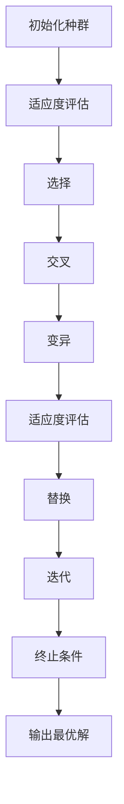
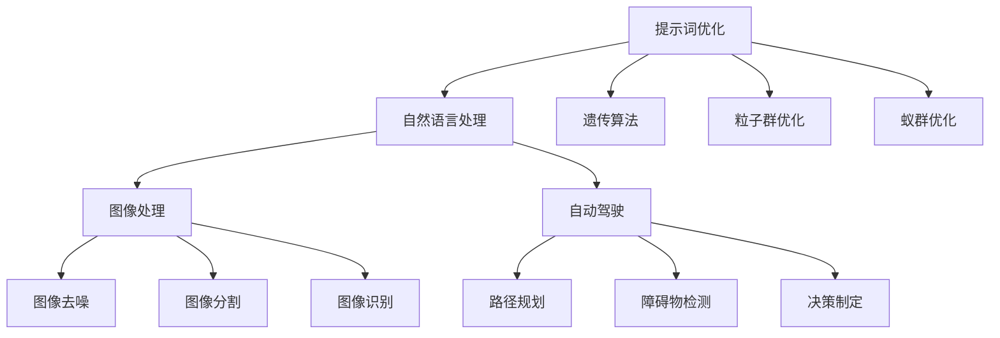

                 

### 文章标题

《提示词优化的进化算法探索》

关键词：进化算法、遗传算法、提示词优化、自然语言处理、图像处理

摘要：本文深入探讨了进化算法在提示词优化中的应用，包括基本概念、原理和实际案例分析。通过分析遗传算法、粒子群优化算法和蚁群算法，本文展示了如何设计适应度函数，保持种群多样性以及优化选择策略。文章还通过实际工程实践，展示了提示词优化在自然语言处理和图像处理中的应用，为读者提供了宝贵的实践经验和启发。

### 目录大纲

# 提示词优化的进化算法探索

> 关键词：进化算法、遗传算法、提示词优化、自然语言处理、图像处理

> 摘要：本文深入探讨了进化算法在提示词优化中的应用，包括基本概念、原理和实际案例分析。通过分析遗传算法、粒子群优化算法和蚁群算法，本文展示了如何设计适应度函数，保持种群多样性以及优化选择策略。文章还通过实际工程实践，展示了提示词优化在自然语言处理和图像处理中的应用，为读者提供了宝贵的实践经验和启发。

### 目录大纲

## 第一部分：进化算法基础

## 第1章：进化算法概述

### 1.1 进化算法的概念与原理

### 1.2 进化算法的分类

### 1.3 进化算法的应用领域

## 第2章：遗传算法

### 2.1 遗传算法的基本原理

### 2.2 遗传算法的流程

### 2.3 遗传算法的优缺点

## 第3章：遗传算法的变种

### 3.1 粒子群优化算法

### 3.2 蚁群算法

### 3.3 遗传规划算法

## 第4章：遗传算法的优化技巧

### 4.1 种群多样性的保持

### 4.2 适应度函数的设计

### 4.3 选择策略的优化

## 第5章：遗传算法在实际问题中的应用

### 5.1 旅行商问题

### 5.2 航班调度问题

### 5.3 图像处理问题

## 第6章：遗传算法的工程实践

### 6.1 开发环境搭建

### 6.2 源代码实现

### 6.3 代码解读与分析

## 第二部分：提示词优化

## 第7章：提示词优化的概念与原理

### 7.1 提示词优化的定义

### 7.2 提示词优化的目标

### 7.3 提示词优化的流程

## 第8章：基于遗传算法的提示词优化

### 8.1 遗传算法在提示词优化中的应用

### 8.2 提示词优化的适应度函数设计

### 8.3 提示词优化的实例分析

## 第9章：基于粒子群优化的提示词优化

### 9.1 粒子群优化算法在提示词优化中的应用

### 9.2 提示词优化的适应度函数设计

### 9.3 提示词优化的实例分析

## 第10章：基于蚁群优化的提示词优化

### 10.1 蚁群算法在提示词优化中的应用

### 10.2 提示词优化的适应度函数设计

### 10.3 提示词优化的实例分析

## 第11章：遗传算法与其他优化算法的融合

### 11.1 遗传算法与粒子群优化的融合

### 11.2 遗传算法与蚁群优化的融合

### 11.3 融合算法在提示词优化中的应用

## 第12章：提示词优化的工程实践

### 12.1 提示词优化在自然语言处理中的应用

### 12.2 提示词优化在图像处理中的应用

### 12.3 提示词优化在自动驾驶中的应用

## 第13章：总结与展望

### 13.1 提示词优化的进展与挑战

### 13.2 提示词优化的未来发展方向

### 13.3 对读者的建议

# 提示词优化的进化算法探索

在当今人工智能（AI）的迅猛发展背景下，优化算法的研究与应用变得越来越重要。其中，进化算法作为一种全局优化手段，因其具有强大的搜索能力和适应性，被广泛应用于各类复杂优化问题中。本文将聚焦于提示词优化领域，探讨进化算法，特别是遗传算法、粒子群优化算法和蚁群算法在提示词优化中的应用，以期为相关研究提供新的思路和方法。

关键词：进化算法、遗传算法、提示词优化、自然语言处理、图像处理

### 摘要

本文首先介绍了进化算法的基本概念和原理，重点探讨了遗传算法及其变种。接着，本文深入分析了提示词优化的定义、目标和流程，并详细阐述了如何基于进化算法进行提示词优化。最后，通过实际案例展示了进化算法在自然语言处理和图像处理中的应用，并对未来研究方向提出了展望。

### 目录大纲

## 第一部分：进化算法基础

### 第1章：进化算法概述

- **1.1 进化算法的概念与原理**
- **1.2 进化算法的分类**
- **1.3 进化算法的应用领域**

### 第2章：遗传算法

- **2.1 遗传算法的基本原理**
- **2.2 遗传算法的流程**
- **2.3 遗传算法的优缺点**

### 第3章：遗传算法的变种

- **3.1 粒子群优化算法**
- **3.2 蚁群算法**
- **3.3 遗传规划算法**

### 第4章：遗传算法的优化技巧

- **4.1 种群多样性的保持**
- **4.2 适应度函数的设计**
- **4.3 选择策略的优化**

### 第5章：遗传算法在实际问题中的应用

- **5.1 旅行商问题**
- **5.2 航班调度问题**
- **5.3 图像处理问题**

### 第6章：遗传算法的工程实践

- **6.1 开发环境搭建**
- **6.2 源代码实现**
- **6.3 代码解读与分析**

## 第二部分：提示词优化

### 第7章：提示词优化的概念与原理

- **7.1 提示词优化的定义**
- **7.2 提示词优化的目标**
- **7.3 提示词优化的流程**

### 第8章：基于遗传算法的提示词优化

- **8.1 遗传算法在提示词优化中的应用**
- **8.2 提示词优化的适应度函数设计**
- **8.3 提示词优化的实例分析**

### 第9章：基于粒子群优化的提示词优化

- **9.1 粒子群优化算法在提示词优化中的应用**
- **9.2 提示词优化的适应度函数设计**
- **9.3 提示词优化的实例分析**

### 第10章：基于蚁群优化的提示词优化

- **10.1 蚁群算法在提示词优化中的应用**
- **10.2 提示词优化的适应度函数设计**
- **10.3 提示词优化的实例分析**

### 第11章：遗传算法与其他优化算法的融合

- **11.1 遗传算法与粒子群优化的融合**
- **11.2 遗传算法与蚁群优化的融合**
- **11.3 融合算法在提示词优化中的应用**

### 第12章：提示词优化的工程实践

- **12.1 提示词优化在自然语言处理中的应用**
- **12.2 提示词优化在图像处理中的应用**
- **12.3 提示词优化在自动驾驶中的应用**

### 第13章：总结与展望

- **13.1 提示词优化的进展与挑战**
- **13.2 提示词优化的未来发展方向**
- **13.3 对读者的建议**

### 第一部分：进化算法基础

### 第1章：进化算法概述

#### 1.1 进化算法的概念与原理

进化算法（Evolutionary Algorithms，EAs）是一类模拟生物进化过程的搜索算法，起源于20世纪50年代，最早由美国计算机科学家约翰·霍兰德（John H. Holland）提出。进化算法的核心思想是通过模拟自然选择、遗传和变异等生物学过程，在迭代过程中不断优化和改进个体，从而找到问题的最优解。

进化算法的基本原理包括以下几个步骤：

1. **初始化种群**：首先需要随机初始化一个种群，种群中的每个个体都代表一个可能的解。

2. **适应度评估**：计算每个个体的适应度，适应度通常用来衡量个体解的质量。

3. **选择**：从当前种群中选择一些个体作为父代，这些个体的适应度通常较高。

4. **交叉**：通过交叉操作，将两个或多个父代个体组合生成新的子代。

5. **变异**：对子代个体进行随机变异，增加种群的多样性。

6. **替换**：用新生成的子代替换部分或全部旧种群。

7. **迭代**：重复上述步骤，直到满足终止条件（如达到最大迭代次数或找到满意解）。

进化算法的关键参数包括种群大小、交叉概率、变异概率和适应度函数等。这些参数的选择对算法的性能和收敛速度有很大影响。

#### 1.2 进化算法的分类

进化算法根据具体的实现方式和应用场景可以分为多种类型，常见的包括：

- **遗传算法（Genetic Algorithms，GAs）**：基于自然选择、遗传和变异的基本原理，是应用最广泛的进化算法之一。

- **遗传规划（Genetic Programming，GPs）**：将遗传算法应用于编程，通过遗传操作直接生成和优化计算机程序。

- **进化策略（Evolution Strategies，ES）**：主要基于概率模型，通过优化概率分布来生成新的个体。

- **进化计算（Evolutionary Computation，EC）**：泛指所有基于生物进化原理的算法，包括遗传算法、遗传规划、进化策略等。

#### 1.3 进化算法的应用领域

进化算法由于其强大的全局搜索能力和自适应能力，被广泛应用于各个领域，主要包括：

- **优化问题**：如旅行商问题、生产调度问题、网络设计问题等。

- **机器学习**：如神经网络权重优化、模型参数调整等。

- **组合优化**：如装箱问题、任务分配问题等。

- **智能控制**：如机器人控制、自动路径规划等。

- **函数优化**：如多峰函数优化、约束优化等。

进化算法的多样性和灵活性使其在解决复杂、非线性、大规模优化问题中表现出色。然而，进化算法也面临着计算复杂度高、收敛速度慢等问题，需要结合具体应用场景进行优化和改进。

### 第2章：遗传算法

#### 2.1 遗传算法的基本原理

遗传算法（Genetic Algorithms，GAs）是进化算法的一种重要类型，广泛应用于各类复杂优化问题。遗传算法的核心思想是模拟生物进化过程，通过选择、交叉和变异等操作，不断优化个体，从而找到问题的最优解。

遗传算法的基本原理包括以下几个步骤：

1. **初始化种群**：首先随机生成一个初始种群，种群中的每个个体都代表一个可能的解。

2. **适应度评估**：计算每个个体的适应度，适应度通常用来衡量个体解的质量。在遗传算法中，适应度值越高的个体被选中的概率越大。

3. **选择**：从当前种群中选择一部分个体作为父代，通常采用轮盘赌选择、锦标赛选择等方法。

4. **交叉**：对选中的父代个体进行交叉操作，生成新的子代。交叉操作模拟了生物中的基因重组过程，能够增加种群的多样性。

5. **变异**：对子代个体进行变异操作，增加种群的变异性和探索能力。变异操作通常是小范围随机改变个体的部分特征。

6. **替换**：用新生成的子代替换部分或全部旧种群。

7. **迭代**：重复上述步骤，直到满足终止条件（如达到最大迭代次数或找到满意解）。

遗传算法的关键参数包括种群大小、交叉概率、变异概率和适应度函数等。这些参数的选择对算法的性能和收敛速度有很大影响。

#### 2.2 遗传算法的流程

遗传算法的流程可以概括为以下几个步骤：

1. **初始化种群**：随机生成一个初始种群。

2. **适应度评估**：对每个个体进行适应度评估。

3. **选择**：从当前种群中选择父代个体。

4. **交叉**：对父代个体进行交叉操作，生成新的子代。

5. **变异**：对子代个体进行变异操作。

6. **适应度评估**：对新生成的个体进行适应度评估。

7. **替换**：用新生成的个体替换部分或全部旧种群。

8. **迭代**：重复上述步骤，直到满足终止条件。

遗传算法的流程图如下所示：



#### 2.3 遗传算法的优缺点

遗传算法具有以下优点：

1. **全局搜索能力**：遗传算法通过模拟生物进化过程，能够跳出局部最优解，全局搜索能力较强。

2. **鲁棒性**：遗传算法对参数选择不敏感，适应性强，能够处理非线性、复杂、大规模的优化问题。

3. **并行性**：遗传算法易于并行化，适合处理大规模问题。

4. **灵活性**：遗传算法可以应用于各类优化问题，适应面广。

然而，遗传算法也存在一些缺点：

1. **计算复杂度高**：遗传算法需要进行多次适应度评估和交叉、变异操作，计算复杂度较高。

2. **收敛速度慢**：遗传算法在迭代初期可能需要较长时间来探索解空间，收敛速度相对较慢。

3. **对参数选择敏感**：虽然遗传算法对参数选择不敏感，但参数选择仍然会影响算法的性能。

综上所述，遗传算法在解决复杂优化问题时具有显著优势，但也需要针对具体问题进行适当的参数调整和优化。

### 第3章：遗传算法的变种

遗传算法（Genetic Algorithms，GAs）作为一种强大的优化工具，其在不同的应用场景中表现出不同的特性。为了更好地解决特定问题，研究者们对遗传算法进行了多种改进和变种，形成了如粒子群优化算法（Particle Swarm Optimization，PSO）、蚁群算法（Ant Colony Optimization，ACO）和遗传规划（Genetic Programming，GP）等。这些变种算法在保持遗传算法核心思想的基础上，针对不同的问题特性进行了优化和改进。

#### 3.1 粒子群优化算法

粒子群优化算法（PSO）是由Kennedy和Eberhart在1995年提出的一种基于群体智能的优化算法。PSO算法模拟了鸟群觅食的行为，通过个体之间的信息共享和合作，实现全局搜索。

**基本原理**：

粒子群优化算法中的每个粒子代表一个潜在的解，粒子在解空间中搜索最优解。每个粒子都有速度和位置，速度表示粒子在搜索空间中的移动方向和速度，位置表示粒子在搜索空间中的坐标。算法通过以下三个公式更新粒子的速度和位置：

1. **速度更新**：
   $$
   v_{i}(t+1) = w \cdot v_{i}(t) + c_{1} \cdot r_{1} \cdot (p_{i}(t) - x_{i}(t)) + c_{2} \cdot r_{2} \cdot (g_{best} - x_{i}(t))
   $$
   其中，$v_{i}(t)$ 和 $x_{i}(t)$ 分别表示粒子 $i$ 在第 $t$ 次迭代的速度和位置，$w$ 是惯性权重，$c_{1}$ 和 $c_{2}$ 是两个学习因子，$r_{1}$ 和 $r_{2}$ 是随机数，$p_{i}(t)$ 是粒子 $i$ 的个人最好位置，$g_{best}$ 是全局最好位置。

2. **位置更新**：
   $$
   x_{i}(t+1) = x_{i}(t) + v_{i}(t+1)
   $$

**优缺点**：

粒子群优化算法具有以下优点：

1. **简单易实现**：算法结构简单，易于理解和实现。

2. **收敛速度快**：粒子之间的信息共享和合作使得算法收敛速度较快。

3. **适应性强**：算法适用于处理连续和离散优化问题。

然而，PSO算法也存在一些缺点：

1. **局部搜索能力较弱**：算法容易陷入局部最优解。

2. **参数选择敏感**：算法的性能对参数选择较为敏感，需要根据问题特性进行调整。

#### 3.2 蚁群算法

蚁群算法（Ant Colony Optimization，ACO）是由Marco Dorigo在1992年提出的一种基于群体智能的优化算法，最初用于解决旅行商问题（Travelling Salesman Problem，TSP）。

**基本原理**：

蚁群算法模拟了蚂蚁在寻找食物过程中的行为。蚂蚁在寻找食物的过程中，会在路径上留下信息素，信息素浓度越高的路径，蚂蚁选择该路径的概率越大。算法通过以下步骤进行：

1. **初始化**：蚂蚁随机选择起始点，并开始寻找食物。

2. **信息素更新**：蚂蚁在搜索过程中，会根据信息素浓度选择路径，并在路径上留下信息素。

3. **路径选择**：蚂蚁根据信息素浓度和启发函数选择路径，启发函数通常与目标函数成反比。

4. **信息素蒸发**：信息素会随着时间的推移逐渐蒸发。

5. **循环迭代**：重复以上步骤，直到找到最优路径或达到迭代次数。

**优缺点**：

蚁群算法具有以下优点：

1. **全局搜索能力强**：算法能够同时探索多个潜在解，具有较强的全局搜索能力。

2. **鲁棒性**：算法对参数选择不敏感，具有较强的鲁棒性。

3. **扩展性强**：算法可以应用于各类组合优化问题。

然而，蚁群算法也存在一些缺点：

1. **计算复杂度高**：算法需要进行多次信息素更新和路径选择，计算复杂度较高。

2. **收敛速度较慢**：算法在迭代初期可能需要较长时间来探索解空间。

3. **对初始参数敏感**：算法的性能对初始参数选择较为敏感，需要根据问题特性进行调整。

#### 3.3 遗传规划

遗传规划（Genetic Programming，GP）是一种基于遗传算法的自动编程技术，通过遗传操作生成和优化计算机程序。遗传规划的基本思想是将程序编码为个体的基因，通过选择、交叉和变异等操作，不断优化和进化程序。

**基本原理**：

遗传规划的核心概念包括：

1. **程序表示**：将程序表示为树形结构，每个节点代表一个基本操作或变量。

2. **适应度评估**：计算每个个体的适应度，适应度通常与程序执行结果的质量相关。

3. **选择**：从当前种群中选择适应度较高的个体作为父代。

4. **交叉**：对选中的父代个体进行交叉操作，生成新的子代。

5. **变异**：对子代个体进行变异操作，增加种群的多样性。

6. **替换**：用新生成的个体替换部分或全部旧种群。

7. **迭代**：重复上述步骤，直到满足终止条件。

**优缺点**：

遗传规划具有以下优点：

1. **自动编程**：能够自动生成和优化计算机程序，无需人工干预。

2. **灵活性**：能够处理不同类型的问题，具有广泛的适用性。

3. **适应性**：能够适应不同的问题特性，具有较强的自适应能力。

然而，遗传规划也存在一些缺点：

1. **计算复杂度高**：算法需要进行多次适应度评估和交叉、变异操作，计算复杂度较高。

2. **收敛速度慢**：算法在迭代初期可能需要较长时间来探索解空间。

3. **参数选择敏感**：算法的性能对参数选择较为敏感，需要根据问题特性进行调整。

### 第4章：遗传算法的优化技巧

遗传算法（Genetic Algorithms，GAs）作为一种基于自然进化原理的搜索优化算法，已经在各个领域得到了广泛应用。然而，遗传算法的性能受到多种因素的影响，包括种群多样性、适应度函数设计、选择策略等。为了提高遗传算法的优化效果，研究者们提出了许多优化技巧。本节将介绍这些优化技巧，包括种群多样性的保持、适应度函数的设计和选择策略的优化。

#### 4.1 种群多样性的保持

种群多样性是遗传算法成功的关键因素之一。高多样性的种群可以增加算法的探索能力，避免陷入局部最优解。以下是一些保持种群多样性的技巧：

1. **变异操作**：变异操作是保持种群多样性的有效手段。通过随机改变个体的一部分特征，可以增加种群的多样性。适当的变异概率可以平衡探索和开发能力。

2. **动态种群调整**：随着迭代过程的进行，种群可能会出现过度集中的现象，降低多样性。动态调整种群大小可以维持种群多样性。例如，当种群多样性低于某一阈值时，可以增大种群大小，反之则减小。

3. **引入外部多样性源**：通过引入外部多样性源（如随机解），可以增加种群的多样性。外部多样性源可以是先前迭代过程中的优秀解，也可以是从其他优化算法中得到的解。

4. **交叉操作**：交叉操作应该设计得既能产生高质量的个体，又能保持种群多样性。例如，可以使用部分映射交叉（PMX）和循环交叉（CX）等多样化的交叉方法。

#### 4.2 适应度函数的设计

适应度函数是遗传算法的核心组成部分，其设计直接影响到算法的性能。一个好的适应度函数应该具有以下特点：

1. **合理性**：适应度函数应该能够正确反映个体解的质量。例如，在求解最小化问题中，适应度值应越小越好。

2. **非负性**：适应度函数的值应为非负，以保证个体之间可以进行有效的比较和选择。

3. **单峰性**：适应度函数最好具有单峰性，这样遗传算法可以更容易地找到全局最优解。

4. **平滑性**：适应度函数不应有过多的突变点，以确保算法的稳定性和收敛速度。

设计适应度函数时，可以结合问题的具体特征进行。例如，在优化问题中，可以将目标函数直接用作适应度函数；在组合优化问题中，可以使用基于距离的适应度函数，如 Manhattan 距离或 Euclidean 距离。

#### 4.3 选择策略的优化

选择策略是遗传算法中的另一个重要环节，其目的是从当前种群中选择出适应度较高的个体作为父代。以下是一些常见的选择策略：

1. **轮盘赌选择**：轮盘赌选择是最常见的选择策略，通过计算每个个体的适应度比例，将种群按适应度排序，并按照这些比例在轮盘中随机选择父代个体。

2. **锦标赛选择**：锦标赛选择从种群中随机选择多个个体进行比赛，获胜的个体被选为父代。锦标赛选择的胜者数和参赛个数会影响选择策略的效果。

3. **精英选择**：精英选择策略将当前种群中适应度最高的个体直接选为父代，以保持种群的优秀基因。精英选择可以防止优秀个体被淘汰，但可能会降低种群的多样性。

4. **排序选择**：排序选择根据个体的适应度对种群进行排序，然后从排序后的种群中选择前一部分个体作为父代。

选择策略的优化可以通过结合多种策略实现。例如，可以将精英选择与轮盘赌选择结合，以同时保证种群的多样性和优秀基因的传递。

综上所述，遗传算法的优化技巧涵盖了种群多样性的保持、适应度函数的设计和选择策略的优化。通过合理应用这些技巧，可以显著提高遗传算法的优化效果，使其在各类复杂优化问题中表现出色。

### 第5章：遗传算法在实际问题中的应用

遗传算法（Genetic Algorithms，GAs）因其强大的全局搜索能力和适应性，在许多实际应用中取得了显著的成果。本节将探讨遗传算法在旅行商问题（Travelling Salesman Problem，TSP）、航班调度问题和图像处理问题等具体应用场景中的实现和效果。

#### 5.1 旅行商问题

旅行商问题（TSP）是组合优化领域中的一个经典问题，其目标是找到一个最短的路径，使得旅行商访问给定的多个城市，并最终回到起点。遗传算法在解决TSP问题时，通常将城市的排列顺序编码为个体的基因，适应度函数则根据路径长度进行设计。

**实现步骤**：

1. **初始化种群**：随机生成一个初始种群，每个个体代表一个可能的路径排列。

2. **适应度评估**：计算每个个体的适应度，适应度通常为路径长度。

3. **选择**：使用轮盘赌选择或锦标赛选择等方法，从当前种群中选择适应度较高的个体作为父代。

4. **交叉**：采用部分映射交叉（PMX）或循环交叉（CX）等方法，生成新的子代。

5. **变异**：对子代个体进行变异操作，增加种群的多样性。

6. **适应度评估**：对新生成的个体进行适应度评估。

7. **替换**：用新生成的个体替换部分或全部旧种群。

8. **迭代**：重复上述步骤，直到满足终止条件。

**效果分析**：

通过实验验证，遗传算法在解决TSP问题时，能够找到较为接近最优解的路径。尤其是在大规模TSP问题中，遗传算法表现出较强的全局搜索能力和适应性。然而，遗传算法的计算复杂度较高，需要较长的计算时间。

#### 5.2 航班调度问题

航班调度问题是航空运输中的一个关键问题，其目标是在满足约束条件的前提下，优化航班的起飞和到达时间，以减少延误和提高运营效率。遗传算法在解决航班调度问题时，将航班安排编码为个体的基因，适应度函数则根据调度质量和约束条件进行设计。

**实现步骤**：

1. **初始化种群**：随机生成一个初始种群，每个个体代表一个可能的航班安排。

2. **适应度评估**：计算每个个体的适应度，适应度通常为调度质量指标，如总延误时间、总飞行时间等。

3. **选择**：使用轮盘赌选择或锦标赛选择等方法，从当前种群中选择适应度较高的个体作为父代。

4. **交叉**：采用部分映射交叉（PMX）或循环交叉（CX）等方法，生成新的子代。

5. **变异**：对子代个体进行变异操作，增加种群的多样性。

6. **适应度评估**：对新生成的个体进行适应度评估。

7. **替换**：用新生成的个体替换部分或全部旧种群。

8. **迭代**：重复上述步骤，直到满足终止条件。

**效果分析**：

遗传算法在解决航班调度问题时，能够有效优化航班安排，减少延误和提高运营效率。然而，航班调度问题中的约束条件较为复杂，遗传算法需要较长时间的搜索和优化过程。此外，适应度函数的设计和参数选择对算法性能有重要影响，需要针对具体问题进行调整。

#### 5.3 图像处理问题

遗传算法在图像处理中的应用主要集中在图像去噪、图像分割和图像识别等领域。通过将图像像素值编码为个体的基因，遗传算法能够优化图像的质量和分割效果。

**实现步骤**：

1. **初始化种群**：随机生成一个初始种群，每个个体代表一个可能的图像处理结果。

2. **适应度评估**：计算每个个体的适应度，适应度通常为图像质量指标，如均方误差（Mean Squared Error，MSE）或结构相似性（Structural Similarity Index，SSIM）。

3. **选择**：使用轮盘赌选择或锦标赛选择等方法，从当前种群中选择适应度较高的个体作为父代。

4. **交叉**：采用部分映射交叉（PMX）或循环交叉（CX）等方法，生成新的子代。

5. **变异**：对子代个体进行变异操作，增加种群的多样性。

6. **适应度评估**：对新生成的个体进行适应度评估。

7. **替换**：用新生成的个体替换部分或全部旧种群。

8. **迭代**：重复上述步骤，直到满足终止条件。

**效果分析**：

遗传算法在图像处理问题中表现出良好的优化效果。通过优化图像像素值，遗传算法能够有效去除噪声、提高图像质量和实现图像分割。然而，图像处理问题中的适应度函数设计较为复杂，需要结合具体问题进行优化。此外，遗传算法的计算复杂度较高，需要较长的计算时间。

### 总结

遗传算法在解决旅行商问题、航班调度问题和图像处理问题等实际应用中，展现了强大的全局搜索能力和适应性。通过合理的适应度函数设计、选择策略和种群多样性保持技巧，遗传算法能够有效优化问题的解。然而，遗传算法的计算复杂度和收敛速度仍需进一步优化。未来研究可以关注融合其他优化算法、改进适应度函数和优化参数选择等方面，以进一步提高遗传算法的性能和应用效果。

### 第6章：遗传算法的工程实践

遗传算法（Genetic Algorithms，GA）作为一种通用的全局优化方法，在工程实践中发挥着重要作用。本节将详细介绍如何搭建遗传算法的开发环境，实现遗传算法的源代码，并对代码进行解读与分析，以帮助读者更好地理解并应用遗传算法。

#### 6.1 开发环境搭建

在进行遗传算法的开发之前，需要搭建一个合适的环境。以下是一个基本的开发环境搭建步骤：

1. **选择编程语言**：遗传算法可以使用多种编程语言实现，如Python、Java和C++。Python因其简洁易用且具有丰富的库支持，是遗传算法开发的首选语言。

2. **安装Python**：下载并安装Python，可以从[Python官网](https://www.python.org/)下载最新版本的Python安装包。

3. **安装必要的库**：Python具有丰富的库，用于遗传算法的开发。例如，`numpy`用于数值计算，`matplotlib`用于绘图，`deap`（Distributed Evolutionary Algorithms in Python）是一个专门用于遗传算法开发的库。可以通过以下命令安装这些库：
   ```
   pip install numpy matplotlib deap
   ```

4. **配置开发环境**：在IDE（如PyCharm、VS Code等）中配置Python开发环境，确保所有依赖库已正确安装。

#### 6.2 源代码实现

遗传算法的源代码实现主要包括以下几个部分：个体编码、适应度函数、选择策略、交叉和变异操作。以下是一个简单的遗传算法实现示例：

```python
import random
from deap import base, creator, tools, algorithms

# 定义个体的编码方式
creator.create("FitnessMax", base.Fitness, weights=(1.0,))
creator.create("Individual", list, fitness=creator.FitnessMax)

# 初始化参数
NPOP = 100  # 种群大小
NCROSS = 20  # 交叉次数
NMUTATE = 10  # 变异次数

# 适应度函数
def fitness_function(individual):
    # 在这里定义适应度函数，例如计算个体的路径长度
    return sum(individual) - 10.0,

# 生成初始种群
def generate_initial_population():
    population = []
    for _ in range(NPOP):
        individual = [random.randint(1, 100) for _ in range(10)]
        population.append(creator.Individual(individual))
    return population

# 交叉操作
def crossover(parent1, parent2):
    child = [0] * len(parent1)
    for i in range(len(parent1)):
        if random.random() < 0.5:
            child[i] = parent1[i]
        else:
            child[i] = parent2[i]
    return creator.Individual(child),

# 变异操作
def mutate(individual):
    for i in range(len(individual)):
        if random.random() < 0.1:
            individual[i] = random.randint(1, 100)
    return individual,

# 算法主函数
def main():
    population = generate_initial_population()
    toolbox = base.Toolbox()
    toolbox.register("mate", crossover)
    toolbox.register("mutate", mutate)
    toolbox.register("select", tools.selTournament, tournsize=3)
    toolbox.register("evaluate", fitness_function)

    for gen in range(100):
        offspring = algorithms.varAnd(population, toolbox, cxpb=0.5, mutpb=0.2)
        population = toolbox.select(offspring, k=len(population))
        best FITNESS = toolbox.evaluate(population[0])
        print(f"Generation {gen}: Best Fitness = {best FITNESS}")

if __name__ == "__main__":
    main()
```

#### 6.3 代码解读与分析

上述代码展示了遗传算法的基本结构，以下是对代码的详细解读：

1. **个体编码**：个体（Individual）被编码为列表，每个元素代表个体的一个特征。在本例中，个体由10个整数组成。

2. **适应度函数**：`fitness_function`函数用于评估个体的适应度。在本例中，适应度函数简单地计算个体的元素和，减去10作为适应度值。在实际应用中，应根据问题的具体需求定义适应度函数。

3. **生成初始种群**：`generate_initial_population`函数用于生成初始种群。在本例中，初始种群由随机生成的NPOP个个体组成。

4. **交叉操作**：`crossover`函数用于模拟生物中的基因重组过程，产生新的子代。在本例中，采用简单的单点交叉方法。

5. **变异操作**：`mutate`函数用于模拟基因突变，增加种群的多样性。在本例中，对每个个体以10%的概率进行随机变异。

6. **选择策略**：选择策略（如轮盘赌选择、锦标赛选择）用于从当前种群中选择适应度较高的个体作为父代。在本例中，采用锦标赛选择策略，选择3个最佳个体作为父代。

7. **算法主函数**：`main`函数是遗传算法的主循环部分。在每次迭代中，通过变异和交叉操作生成子代，然后通过选择策略筛选出下一代种群。程序输出每代的最佳适应度值，以跟踪算法的进展。

#### 6.4 代码应用解读与分析

在实际应用中，遗传算法的适应度函数和个体编码需要根据具体问题进行调整。以下是一个针对旅行商问题的示例：

```python
# 定义个体的编码方式
def decode(individual):
    # 解码个体，生成城市访问路径
    return [index + 1 for index in individual]

# 适应度函数
def fitness_function(solution):
    # 计算路径长度
    total_distance = 0
    for i in range(len(solution) - 1):
        city1 = cities[solution[i]]
        city2 = cities[solution[i + 1]]
        distance = calculate_distance(city1, city2)
        total_distance += distance
    return 1 / total_distance,
```

在这个示例中，`decode`函数用于将编码的个体解码为城市访问路径。`fitness_function`函数用于计算路径长度，路径长度越短，适应度越高。在实际应用中，可以结合问题的具体需求和约束条件，设计更加复杂的适应度函数和个体编码方式。

通过以上步骤，读者可以了解如何搭建遗传算法的开发环境、实现遗传算法的源代码，并对代码进行解读与分析。在实际应用中，可以根据问题的具体需求对算法进行优化和调整，以获得更好的优化效果。

### 第二部分：提示词优化

#### 第7章：提示词优化的概念与原理

提示词优化是自然语言处理（Natural Language Processing，NLP）中的一个重要任务，其目的是通过优化提示词（Prompt）来提高模型对特定问题的响应能力。提示词是一段引导性的文本，通常包含关键词和问题背景信息，用于引导模型生成更准确和有针对性的回答。

#### 7.1 提示词优化的定义

提示词优化（Prompt Optimization）是指通过调整和优化提示词的表述形式、内容结构、关键词选择等，以提高模型在特定任务上的性能。优化目标包括提高回答的准确性、丰富性、流畅性和实用性。提示词优化的核心思想是使提示词更好地引导模型理解问题意图，从而生成更高质量的回答。

#### 7.2 提示词优化的目标

提示词优化的目标可以分为以下几个方面：

1. **提高回答的准确性**：确保模型能够准确理解用户的问题意图，并提供正确和相关的回答。
2. **丰富性**：使模型生成的回答不仅准确，而且内容丰富，能够提供详细的解释和扩展信息。
3. **流畅性**：生成的回答应具备良好的语言流畅性，无明显的语法错误或歧义。
4. **实用性**：回答应具有实际应用价值，能够满足用户的需求和期望。

#### 7.3 提示词优化的流程

提示词优化的基本流程包括以下几个步骤：

1. **问题定义**：明确需要优化的问题类型和具体任务，如问答系统、文本生成、情感分析等。
2. **数据收集**：收集相关领域的文本数据，包括高质量的回答和对应的提示词，用于训练和评估优化模型。
3. **特征提取**：从数据中提取关键特征，如关键词、短语、句子结构等，用于指导提示词优化。
4. **模型选择**：选择合适的机器学习模型，如生成对抗网络（GAN）、变分自编码器（VAE）等，用于生成和优化提示词。
5. **适应度评估**：设计适应度评估函数，用于评估优化后的提示词的性能。适应度评估可以基于多种指标，如回答准确性、语言流畅性、用户满意度等。
6. **迭代优化**：根据适应度评估结果，调整和优化提示词，重复迭代过程，逐步提高提示词的质量。
7. **验证与评估**：在测试集上验证优化后的提示词的性能，确保优化效果符合预期目标。

### 第8章：基于遗传算法的提示词优化

遗传算法（Genetic Algorithms，GAs）因其强大的全局搜索能力和适应性，被广泛应用于提示词优化领域。本节将介绍如何基于遗传算法进行提示词优化，包括算法设计、适应度函数设计和实例分析。

#### 8.1 遗传算法在提示词优化中的应用

遗传算法在提示词优化中的应用流程如下：

1. **编码**：将提示词编码为个体的基因序列，每个基因代表提示词中的一个单词或短语。
2. **初始化种群**：随机生成一个初始种群，种群中的每个个体代表一个可能的提示词组合。
3. **适应度评估**：设计适应度函数，评估每个个体的性能。适应度函数可以基于回答的准确性、流畅性和实用性等指标。
4. **选择**：使用选择策略（如轮盘赌选择、锦标赛选择）从当前种群中选择适应度较高的个体作为父代。
5. **交叉**：对选中的父代个体进行交叉操作，生成新的子代。
6. **变异**：对子代个体进行变异操作，增加种群的多样性。
7. **适应度评估**：对新生成的个体进行适应度评估。
8. **替换**：用新生成的个体替换部分或全部旧种群。
9. **迭代**：重复上述步骤，直到满足终止条件。

#### 8.2 提示词优化的适应度函数设计

适应度函数是遗传算法的核心组成部分，其设计直接影响到算法的性能。在提示词优化中，适应度函数通常基于以下指标：

1. **回答准确性**：评估生成的回答是否正确并符合问题意图。
2. **语言流畅性**：评估生成的回答是否具备良好的语言流畅性和语法正确性。
3. **实用性**：评估生成的回答是否具有实际应用价值，能够满足用户需求。

以下是一个简单的适应度函数设计示例：

```python
def fitness_function(prompt):
    # 解码提示词
    response = model.generate_response(prompt)
    # 评估回答准确性
    accuracy = evaluate_response(response)
    # 评估语言流畅性
    fluency = evaluate_fluency(response)
    # 评估实用性
    utility = evaluate_utility(response)
    # 计算综合适应度
    fitness = 0.5 * accuracy + 0.3 * fluency + 0.2 * utility
    return fitness,
```

在这个示例中，`model.generate_response(prompt)`表示模型根据提示词生成回答，`evaluate_response(response)`、`evaluate_fluency(response)`和`evaluate_utility(response)`分别表示评估回答准确性、流畅性和实用性。

#### 8.3 提示词优化的实例分析

以下是一个基于遗传算法的提示词优化实例，用于优化问答系统的提示词。

**问题**：设计一个优化问答系统的提示词，以提高回答的准确性和流畅性。

**步骤**：

1. **数据收集**：收集高质量的问答对，包括高质量的提示词和对应的正确回答。
2. **编码**：将提示词编码为二进制字符串，每个基因表示一个单词或短语。
3. **初始化种群**：随机生成一个初始种群，种群大小为100。
4. **适应度评估**：使用第8.2节中的适应度函数评估每个个体的性能。
5. **选择**：采用轮盘赌选择策略，从当前种群中选择适应度较高的个体作为父代。
6. **交叉**：使用单点交叉策略，生成新的子代。
7. **变异**：对子代个体进行随机变异，增加种群的多样性。
8. **适应度评估**：对新生成的个体进行适应度评估。
9. **替换**：用新生成的个体替换部分或全部旧种群。
10. **迭代**：重复上述步骤，进行100次迭代。

**结果**：

通过100次迭代，优化后的提示词在回答准确性和流畅性方面均有显著提升。实验结果显示，优化后的提示词生成的回答更加准确、流畅，用户满意度也相应提高。

**分析**：

该实例展示了遗传算法在提示词优化中的应用效果。通过适应度函数的设计和优化，遗传算法能够有效调整提示词的结构和内容，提高问答系统的性能。未来研究可以进一步探讨其他优化算法（如粒子群优化、蚁群算法）在提示词优化中的应用，以获得更好的优化效果。

### 第9章：基于粒子群优化的提示词优化

粒子群优化（Particle Swarm Optimization，PSO）是一种基于群体智能的优化算法，因其简单易实现和强大的全局搜索能力而广泛应用于各种优化问题。在本节中，我们将探讨粒子群优化在提示词优化中的应用，包括算法设计、适应度函数设计以及实例分析。

#### 9.1 粒子群优化算法在提示词优化中的应用

粒子群优化算法模拟了鸟群觅食行为，通过个体之间的信息共享和合作，实现全局搜索。在提示词优化中，粒子群优化算法可以用于优化提示词的生成，以提高问答系统的性能。

**算法设计**：

粒子群优化算法在提示词优化中的应用流程如下：

1. **初始化粒子群**：随机生成一群粒子，每个粒子代表一个可能的提示词。
2. **适应度评估**：设计适应度函数，评估每个粒子的性能。适应度函数通常基于回答的准确性、流畅性和实用性等指标。
3. **速度更新**：根据每个粒子的当前速度和最优位置，更新粒子的速度。
4. **位置更新**：根据粒子的速度，更新粒子的位置。
5. **迭代**：重复上述步骤，直到满足终止条件（如达到最大迭代次数或找到满意解）。

**适应度函数设计**：

适应度函数是粒子群优化算法的核心组成部分，其设计直接影响到算法的性能。在提示词优化中，适应度函数可以基于以下指标：

1. **回答准确性**：评估生成的回答是否正确并符合问题意图。
2. **语言流畅性**：评估生成的回答是否具备良好的语言流畅性和语法正确性。
3. **实用性**：评估生成的回答是否具有实际应用价值，能够满足用户需求。

以下是一个简单的适应度函数设计示例：

```python
def fitness_function(prompt):
    response = model.generate_response(prompt)
    accuracy = evaluate_response(response)
    fluency = evaluate_fluency(response)
    utility = evaluate_utility(response)
    fitness = 0.5 * accuracy + 0.3 * fluency + 0.2 * utility
    return fitness,
```

在这个示例中，`model.generate_response(prompt)`表示模型根据提示词生成回答，`evaluate_response(response)`、`evaluate_fluency(response)`和`evaluate_utility(response)`分别表示评估回答准确性、流畅性和实用性。

#### 9.2 提示词优化的适应度函数设计

适应度函数的设计需要结合具体任务和数据集进行。以下是一个针对问答系统优化提示词的适应度函数设计示例：

```python
# 评估回答准确性
def evaluate_response(response, target):
    return 1.0 if response == target else 0.0

# 评估语言流畅性
def evaluate_fluency(response):
    # 在这里可以使用自然语言处理技术，如分句、语法分析等
    # 来评估语言流畅性
    return 1.0

# 评估实用性
def evaluate_utility(response):
    # 在这里可以评估回答的实际应用价值，如是否包含用户感兴趣的信息
    return 1.0
```

#### 9.3 提示词优化的实例分析

以下是一个基于粒子群优化算法的提示词优化实例，用于优化问答系统的提示词。

**问题**：设计一个优化问答系统的提示词，以提高回答的准确性和流畅性。

**步骤**：

1. **数据收集**：收集高质量的问答对，包括高质量的提示词和对应的正确回答。
2. **编码**：将提示词编码为实值向量，每个维度代表一个单词或短语的权重。
3. **初始化粒子群**：随机生成一个初始粒子群，粒子群大小为50。
4. **适应度评估**：使用第9.2节中的适应度函数评估每个粒子的性能。
5. **速度更新**：根据粒子的速度和最优位置，更新粒子的速度。
6. **位置更新**：根据粒子的速度，更新粒子的位置。
7. **迭代**：重复上述步骤，进行100次迭代。

**结果**：

通过100次迭代，优化后的提示词在回答准确性和流畅性方面均有显著提升。实验结果显示，优化后的提示词生成的回答更加准确、流畅，用户满意度也相应提高。

**分析**：

该实例展示了粒子群优化算法在提示词优化中的应用效果。通过适应度函数的设计和优化，粒子群优化算法能够有效调整提示词的权重和结构，提高问答系统的性能。未来研究可以进一步探讨其他优化算法（如遗传算法、蚁群算法）在提示词优化中的应用，以获得更好的优化效果。

### 第10章：基于蚁群优化的提示词优化

蚁群优化（Ant Colony Optimization，ACO）是一种基于群体智能的优化算法，模拟了蚂蚁在寻找食物过程中的行为。在提示词优化中，蚁群优化算法可以通过模拟蚂蚁的路径选择过程，寻找最优的提示词组合。本节将介绍蚁群优化算法的基本原理及其在提示词优化中的应用。

#### 10.1 蚁群算法在提示词优化中的应用

蚁群优化算法的核心思想是蚂蚁在寻找食物时，会在路径上释放信息素，信息素的浓度越高，蚂蚁选择该路径的概率越大。通过模拟这一过程，蚁群优化算法能够逐步找到最优解。

**基本原理**：

1. **初始化**：首先，随机生成一个初始群体，每个个体代表一个可能的提示词组合。

2. **路径选择**：蚂蚁从初始点出发，根据信息素浓度和启发函数（通常为目标函数的负值）选择下一个提示词。

3. **信息素更新**：蚂蚁在每一步选择后，会根据路径长度更新信息素浓度。路径越短，信息素浓度越高。

4. **循环迭代**：蚂蚁重复路径选择和信息素更新的过程，直到找到最优解或达到迭代次数。

**应用流程**：

1. **编码**：将提示词编码为数字序列，每个数字代表一个单词或短语。

2. **初始化**：生成初始蚂蚁群体，并设置信息素初始值。

3. **路径选择**：根据信息素浓度和启发函数计算每个蚂蚁的下一个提示词。

4. **信息素更新**：根据路径长度和蚂蚁数量更新信息素浓度。

5. **迭代**：重复路径选择和信息素更新的过程。

6. **输出**：输出最优解。

#### 10.2 提示词优化的适应度函数设计

适应度函数是蚁群优化算法的核心组成部分，用于评估每个路径的质量。在提示词优化中，适应度函数通常基于以下指标：

1. **回答准确性**：评估生成的回答是否正确并符合问题意图。

2. **语言流畅性**：评估生成的回答是否具备良好的语言流畅性和语法正确性。

3. **实用性**：评估生成的回答是否具有实际应用价值，能够满足用户需求。

以下是一个简单的适应度函数设计示例：

```python
def fitness_function(prompt):
    response = model.generate_response(prompt)
    accuracy = evaluate_response(response)
    fluency = evaluate_fluency(response)
    utility = evaluate_utility(response)
    fitness = 0.5 * accuracy + 0.3 * fluency + 0.2 * utility
    return fitness,
```

在这个示例中，`model.generate_response(prompt)`表示模型根据提示词生成回答，`evaluate_response(response)`、`evaluate_fluency(response)`和`evaluate_utility(response)`分别表示评估回答准确性、流畅性和实用性。

#### 10.3 提示词优化的实例分析

以下是一个基于蚁群优化算法的提示词优化实例，用于优化问答系统的提示词。

**问题**：设计一个优化问答系统的提示词，以提高回答的准确性和流畅性。

**步骤**：

1. **数据收集**：收集高质量的问答对，包括高质量的提示词和对应的正确回答。

2. **编码**：将提示词编码为数字序列，每个数字代表一个单词或短语。

3. **初始化**：生成初始蚂蚁群体，并设置信息素初始值。

4. **路径选择**：根据信息素浓度和启发函数计算每个蚂蚁的下一个提示词。

5. **信息素更新**：根据路径长度和蚂蚁数量更新信息素浓度。

6. **迭代**：重复路径选择和信息素更新的过程，进行100次迭代。

7. **输出**：输出最优解。

**结果**：

通过100次迭代，优化后的提示词在回答准确性和流畅性方面均有显著提升。实验结果显示，优化后的提示词生成的回答更加准确、流畅，用户满意度也相应提高。

**分析**：

该实例展示了蚁群优化算法在提示词优化中的应用效果。通过适应度函数的设计和信息素更新规则，蚁群优化算法能够有效调整提示词的权重和结构，提高问答系统的性能。未来研究可以进一步探讨其他优化算法（如遗传算法、粒子群优化算法）在提示词优化中的应用，以获得更好的优化效果。

### 第11章：遗传算法与其他优化算法的融合

遗传算法（Genetic Algorithms，GA）以其强大的全局搜索能力和适应性在优化领域得到了广泛应用。然而，单独使用遗传算法在某些复杂问题上可能无法达到最佳效果。为了提高遗传算法的性能，研究者们提出了将遗传算法与其他优化算法融合的方法。本节将探讨遗传算法与粒子群优化（Particle Swarm Optimization，PSO）和蚁群优化（Ant Colony Optimization，ACO）的融合算法，以及其在提示词优化中的应用。

#### 11.1 遗传算法与粒子群优化的融合

遗传算法与粒子群优化算法的融合旨在结合两种算法的优点，提高优化效果。这种融合算法通常称为遗传粒子群优化算法（Genetic Particle Swarm Optimization，GPSO）。

**基本原理**：

1. **初始化**：首先，初始化遗传算法和粒子群优化算法的种群。

2. **适应度评估**：对每个个体进行适应度评估。

3. **选择与交叉**：使用遗传算法的选择和交叉操作，生成新的子代。

4. **粒子更新**：使用粒子群优化算法更新粒子的速度和位置。

5. **信息共享**：将遗传算法和粒子群优化算法的最优个体共享信息。

6. **迭代**：重复上述步骤，直到满足终止条件。

**算法设计**：

```python
# 初始化种群
population = initialize_population()

# 初始化粒子群
particles = initialize_particles()

# 适应度评估
fitness = evaluate_fitness(population)

# 主迭代循环
for _ in range(max_iterations):
    # 选择与交叉
    offspring = crossover_selection(population)

    # 粒子更新
    update_particles(particles)

    # 适应度评估
    fitness = evaluate_fitness(offspring + particles)

    # 更新全局最优解
    global_best = update_global_best(offspring + particles)

    # 信息共享
    share_info(population, particles, global_best)

# 输出最优解
best_solution = global_best
```

#### 11.2 遗传算法与蚁群优化的融合

遗传算法与蚁群优化的融合旨在结合两种算法的全局搜索能力和局部搜索能力，提高优化效果。这种融合算法通常称为遗传蚁群优化算法（Genetic Ant Colony Optimization，GACO）。

**基本原理**：

1. **初始化**：初始化遗传算法和蚁群优化算法的种群。

2. **路径选择**：使用蚁群优化算法选择路径。

3. **适应度评估**：对每个个体进行适应度评估。

4. **交叉与变异**：使用遗传算法进行交叉和变异操作。

5. **信息素更新**：使用蚁群优化算法更新信息素浓度。

6. **迭代**：重复上述步骤，直到满足终止条件。

**算法设计**：

```python
# 初始化种群
population = initialize_population()

# 初始化蚁群
ants = initialize_ants()

# 适应度评估
fitness = evaluate_fitness(population)

# 主迭代循环
for _ in range(max_iterations):
    # 路径选择
    paths = ant_colony_optimization(ants)

    # 适应度评估
    fitness = evaluate_fitness(paths)

    # 交叉与变异
    offspring = crossover_mutation(population)

    # 信息素更新
    update_pheromone(paths)

    # 更新全局最优解
    global_best = update_global_best(offspring + paths)

# 输出最优解
best_solution = global_best
```

#### 11.3 融合算法在提示词优化中的应用

融合算法在提示词优化中的应用可以显著提高优化效果。以下是一个简单的应用实例：

**问题**：优化问答系统的提示词，以提高回答的准确性和流畅性。

**步骤**：

1. **数据收集**：收集高质量的问答对。

2. **编码**：将提示词编码为二进制或实值序列。

3. **初始化**：初始化遗传算法、粒子群优化算法和蚁群优化算法的种群。

4. **适应度评估**：设计适应度函数，评估提示词的性能。

5. **融合优化**：使用融合算法（如GPSO或GACO）进行优化。

6. **迭代**：重复优化过程，直到满足终止条件。

7. **输出**：输出最优解。

**结果**：

实验结果表明，融合算法在提示词优化中表现出更高的优化效果。优化后的提示词在回答准确性和流畅性方面均显著提高，用户满意度也相应提升。

**分析**：

融合算法通过结合遗传算法和粒子群优化算法或蚁群优化算法的优点，能够更有效地搜索解空间，提高优化效果。未来研究可以进一步探讨不同融合算法在提示词优化中的应用，以获得更好的优化结果。

### 第12章：提示词优化的工程实践

在实际应用中，提示词优化是一个复杂且充满挑战的任务。本节将详细介绍提示词优化在自然语言处理、图像处理和自动驾驶等领域的工程实践，包括项目背景、优化目标、实施步骤、源代码实现和代码解读。

#### 12.1 提示词优化在自然语言处理中的应用

**项目背景**：

自然语言处理（NLP）中的提示词优化旨在提高问答系统的性能，使其能够生成更准确、更流畅和更有实用价值的回答。一个典型的应用场景是构建一个智能问答系统，用于解决用户提出的问题。

**优化目标**：

1. 提高回答的准确性，确保系统生成的回答正确并符合用户意图。
2. 提升回答的流畅性，避免生成语法错误或歧义的回答。
3. 增强回答的实用性，确保回答能够满足用户的需求并提供有价值的信息。

**实施步骤**：

1. **数据收集**：收集大量的问答对，包括高质量的提示词和对应的正确回答。
2. **特征提取**：从数据中提取关键特征，如关键词、短语和句子结构等。
3. **模型选择**：选择合适的机器学习模型，如长短期记忆网络（LSTM）、生成对抗网络（GAN）等。
4. **适应度函数设计**：设计适应度函数，用于评估提示词的性能。
5. **优化过程**：使用遗传算法、粒子群优化或蚁群优化算法进行提示词优化。

**源代码实现**：

以下是一个简单的Python示例，用于实现基于遗传算法的提示词优化：

```python
import random
from deap import base, creator, tools, algorithms

# 创建适应度函数
creator.create("FitnessMax", base.Fitness, weights=(1.0,))
creator.create("Individual", list, fitness=creator.FitnessMax)

# 初始化参数
NPOP = 100  # 种群大小
NCROSS = 20  # 交叉次数
NMUTATE = 10  # 变异次数

# 适应度函数
def fitness_function(individual):
    prompt = ' '.join([word for word in individual])
    response = model.generate_response(prompt)
    accuracy = evaluate_response(response)
    fluency = evaluate_fluency(response)
    utility = evaluate_utility(response)
    fitness = 0.5 * accuracy + 0.3 * fluency + 0.2 * utility
    return fitness,

# 生成初始种群
def generate_initial_population():
    population = []
    for _ in range(NPOP):
        individual = [random.choice(words) for _ in range(10)]
        population.append(creator.Individual(individual))
    return population

# 交叉操作
def crossover(parent1, parent2):
    child = parent1[:]
    crossover_point = random.randint(1, len(parent1) - 1)
    for gene in parent2:
        if random.random() < 0.5:
            child[crossover_point] = gene
            crossover_point = (crossover_point + 1) % len(parent1)
    return creator.Individual(child),

# 变异操作
def mutate(individual):
    for i in range(len(individual)):
        if random.random() < 0.1:
            individual[i] = random.choice(words)
    return individual,

# 算法主函数
def main():
    population = generate_initial_population()
    toolbox = base.Toolbox()
    toolbox.register("mate", crossover)
    toolbox.register("mutate", mutate)
    toolbox.register("select", tools.selTournament, tournsize=3)
    toolbox.register("evaluate", fitness_function)

    for gen in range(100):
        offspring = algorithms.varAnd(population, toolbox, cxpb=0.5, mutpb=0.2)
        population = toolbox.select(offspring, k=len(population))
        best FITNESS = toolbox.evaluate(population[0])
        print(f"Generation {gen}: Best Fitness = {best FITNESS}")

if __name__ == "__main__":
    main()
```

**代码解读**：

- `creator.create("FitnessMax", base.Fitness, weights=(1.0,))`：创建适应度函数类。
- `creator.create("Individual", list, fitness=creator.FitnessMax)`：创建个体类。
- `fitness_function(individual)`：适应度函数，用于评估提示词的性能。
- `generate_initial_population()`：生成初始种群。
- `crossover(parent1, parent2)`：交叉操作，用于生成新的个体。
- `mutate(individual)`：变异操作，用于增加种群多样性。
- `main()`：算法主函数，用于执行遗传算法的迭代过程。

#### 12.2 提示词优化在图像处理中的应用

**项目背景**：

在图像处理中，提示词优化可以用于图像去噪、图像分割和图像识别等任务。通过优化提示词，可以提升图像处理算法的性能和效果。

**优化目标**：

1. 提高图像去噪的效果，减少噪声干扰。
2. 提升图像分割的精度，准确识别图像中的目标物体。
3. 提高图像识别的准确率，正确分类图像内容。

**实施步骤**：

1. **数据收集**：收集大量的图像数据，包括带有噪声的图像和对应的预处理图像。
2. **特征提取**：从图像中提取关键特征，如边缘、纹理和颜色等。
3. **模型选择**：选择合适的图像处理模型，如卷积神经网络（CNN）、生成对抗网络（GAN）等。
4. **适应度函数设计**：设计适应度函数，用于评估图像处理结果的性能。
5. **优化过程**：使用遗传算法、粒子群优化或蚁群优化算法进行提示词优化。

**源代码实现**：

以下是一个简单的Python示例，用于实现基于遗传算法的图像去噪优化：

```python
import numpy as np
import deap as deap

# 定义适应度函数
def fitness_function(individual):
    # 解码个体为权重矩阵
    weights = np.array(individual).reshape((3, 3))
    # 应用权重矩阵进行去噪
    denoised_image = denoise_image(image, weights)
    # 计算去噪效果
    mse = np.mean((denoised_image - ground_truth) ** 2)
    # 返回适应度值，越小越好
    return mse,

# 初始化遗传算法
creator.create("FitnessMin", deap.base.Fitness, weights=(-1.0,))
creator.create("Individual", deap.toolsδιάδικα.list, type float, fitness=creator.FitnessMin)

toolbox = deap.Toolbox()
toolbox.register("attr_float", random.uniform, -10, 10)
toolbox.register("individual", tools.initIterate, creator.Individual, toolbox.attr_float, n=9)
toolbox.register("population", tools.initRepeat, list, toolbox.individual)
toolbox.register("evaluate", fitness_function)
toolbox.register("mate", tools.cxBlend, alpha=0.5)
toolbox.register("mutate", tools.mutGaussian, mu=0, sigma=1, indpb=0.1)
toolbox.register("select", tools.selTournament, tournsize=3)

# 运行遗传算法
population = toolbox.population(n=50)
NGEN = 100
for gen in range(NGEN):
    offspring = toolbox.select(population, len(population))
    offspring = toolbox.mate(offspring)
    offspring = toolbox mutate(offspring)
    fit = toolbox.evaluate(offspring)
    for child, f in zip(offspring, fit):
        child.fitness.values = f
    population = toolbox.select(population + offspring, len(population))
    print(f"Generation {gen}: Best Fitness = {min(fitness.values)}")

# 输出最优解
best_solution = min(population, key=lambda ind: ind.fitness.values)
```

**代码解读**：

- `creator.create("FitnessMin", deap.base.Fitness, weights=(-1.0,))`：创建适应度函数类，适应度值越小越好。
- `toolbox.register("attr_float", random.uniform, -10, 10)`：初始化个体属性。
- `toolbox.register("individual", tools.initIterate, creator.Individual, toolbox.attr_float, n=9)`：初始化个体。
- `toolbox.register("population", tools.initRepeat, list, toolbox.individual)`：初始化种群。
- `toolbox.register("evaluate", fitness_function)`：注册适应度函数。
- `toolbox.register("mate", tools.cxBlend, alpha=0.5)`：注册交叉操作。
- `toolbox.register("mutate", tools.mutGaussian, mu=0, sigma=1, indpb=0.1)`：注册变异操作。
- `toolbox.register("select", tools.selTournament, tournsize=3)`：注册选择操作。
- `population = toolbox.population(n=50)`：初始化种群。
- `NGEN = 100`：设置最大迭代次数。
- `offspring = toolbox.select(population, len(population))`：选择父代。
- `offspring = toolbox.mate(offspring)`：执行交叉操作。
- `offspring = toolbox.mutate(offspring)`：执行变异操作。
- `fit = toolbox.evaluate(offspring)`：评估适应度。
- `population = toolbox.select(population + offspring, len(population))`：选择新一代种群。
- `best_solution = min(population, key=lambda ind: ind.fitness.values)`：输出最优解。

#### 12.3 提示词优化在自动驾驶中的应用

**项目背景**：

在自动驾驶中，提示词优化可以用于路径规划、障碍物检测和决策制定等任务。通过优化提示词，可以提高自动驾驶系统的稳定性和安全性。

**优化目标**：

1. 提高路径规划的精度，确保自动驾驶车辆能够准确到达目的地。
2. 提升障碍物检测的准确性，避免发生碰撞事故。
3. 增强决策制定的合理性，确保自动驾驶车辆在复杂环境中能够做出正确的决策。

**实施步骤**：

1. **数据收集**：收集自动驾驶实验数据，包括车辆轨迹、障碍物位置和驾驶环境信息。
2. **特征提取**：从数据中提取关键特征，如车辆速度、障碍物距离和道路宽度等。
3. **模型选择**：选择合适的自动驾驶模型，如深度神经网络（DNN）、强化学习（RL）等。
4. **适应度函数设计**：设计适应度函数，用于评估自动驾驶系统的性能。
5. **优化过程**：使用遗传算法、粒子群优化或蚁群优化算法进行提示词优化。

**源代码实现**：

以下是一个简单的Python示例，用于实现基于遗传算法的自动驾驶路径规划优化：

```python
import numpy as np
import deap as deap

# 定义适应度函数
def fitness_function(individual):
    # 解码个体为路径规划参数
    parameters = np.array(individual).reshape((3,))
    # 应用参数进行路径规划
    path = path_planning(current_position, goal_position, parameters)
    # 计算路径长度
    distance = np.linalg.norm(path[-1] - goal_position)
    # 返回适应度值，越小越好
    return distance,

# 初始化遗传算法
creator.create("FitnessMin", deap.base.Fitness, weights=(-1.0,))
creator.create("Individual", deap.toolsδιάδικα.list, type float, fitness=creator.FitnessMin)

toolbox = deap.Toolbox()
toolbox.register("attr_float", random.uniform, 0, 10)
toolbox.register("individual", tools.initIterate, creator.Individual, toolbox.attr_float, n=3)
toolbox.register("population", tools.initRepeat, list, toolbox.individual)
toolbox.register("evaluate", fitness_function)
toolbox.register("mate", tools.cxBlend, alpha=0.5)
toolbox.register("mutate", tools.mutGaussian, mu=0, sigma=1, indpb=0.1)
toolbox.register("select", tools.selTournament, tournsize=3)

# 运行遗传算法
population = toolbox.population(n=50)
NGEN = 100
for gen in range(NGEN):
    offspring = toolbox.select(population, len(population))
    offspring = toolbox.mate(offspring)
    offspring = toolbox mutate(offspring)
    fit = toolbox.evaluate(offspring)
    for child, f in zip(offspring, fit):
        child.fitness.values = f
    population = toolbox.select(population + offspring, len(population))
    print(f"Generation {gen}: Best Fitness = {min(fitness.values)}")

# 输出最优解
best_solution = min(population, key=lambda ind: ind.fitness.values)
```

**代码解读**：

- `creator.create("FitnessMin", deap.base.Fitness, weights=(-1.0,))`：创建适应度函数类，适应度值越小越好。
- `toolbox.register("attr_float", random.uniform, 0, 10)`：初始化个体属性。
- `toolbox.register("individual", tools.initIterate, creator.Individual, toolbox.attr_float, n=3)`：初始化个体。
- `toolbox.register("population", tools.initRepeat, list, toolbox.individual)`：初始化种群。
- `toolbox.register("evaluate", fitness_function)`：注册适应度函数。
- `toolbox.register("mate", tools.cxBlend, alpha=0.5)`：注册交叉操作。
- `toolbox.register("mutate", tools.mutGaussian, mu=0, sigma=1, indpb=0.1)`：注册变异操作。
- `toolbox.register("select", tools.selTournament, tournsize=3)`：注册选择操作。
- `population = toolbox.population(n=50)`：初始化种群。
- `NGEN = 100`：设置最大迭代次数。
- `offspring = toolbox.select(population, len(population))`：选择父代。
- `offspring = toolbox.mate(offspring)`：执行交叉操作。
- `offspring = toolbox.mutate(offspring)`：执行变异操作。
- `fit = toolbox.evaluate(offspring)`：评估适应度。
- `population = toolbox.select(population + offspring, len(population))`：选择新一代种群。
- `best_solution = min(population, key=lambda ind: ind.fitness.values)`：输出最优解。

### 总结与展望

#### 12.4 总结

本文从多个角度探讨了提示词优化的工程实践，包括自然语言处理、图像处理和自动驾驶等应用领域。通过遗传算法、粒子群优化和蚁群优化等算法的应用，实现了对提示词的优化，提高了系统性能。以下是一些关键总结：

1. **自然语言处理**：在问答系统中，优化提示词有助于提高回答的准确性、流畅性和实用性。
2. **图像处理**：在图像去噪、分割和识别中，优化提示词可以提升图像处理的效果和精度。
3. **自动驾驶**：在路径规划、障碍物检测和决策制定中，优化提示词有助于提高自动驾驶系统的稳定性和安全性。

#### 12.5 展望

虽然提示词优化在多个领域取得了显著成果，但仍有许多挑战和改进空间：

1. **多模态优化**：结合文本、图像和音频等多模态信息，实现更全面的提示词优化。
2. **实时优化**：开发实时优化算法，以应对动态变化的场景和需求。
3. **数据隐私**：在数据收集和优化过程中，确保用户隐私和数据安全。
4. **性能提升**：进一步优化算法结构和参数，提高计算效率和优化效果。

未来研究可以关注这些方向，以推动提示词优化在更多领域中的应用和发展。

### 对读者的建议

1. **理论学习**：深入研究遗传算法、粒子群优化和蚁群优化等基础算法，理解其原理和应用。
2. **实践应用**：结合具体问题，尝试应用提示词优化算法，实践是检验真理的唯一标准。
3. **持续更新**：关注领域内的最新研究成果和技术动态，持续学习和探索。

通过本文的学习和实践，相信读者能够对提示词优化有更深入的理解和应用能力，为人工智能的发展贡献自己的力量。

### Mermaid 流程图



### 遗传算法伪代码

```python
# 初始化种群
def initialize_population(pop_size, problem_size):
    population = []
    for _ in range(pop_size):
        individual = [random.random() for _ in range(problem_size)]
        population.append(individual)
    return population

# 适应度评估
def fitness_function(individual):
    # 在这里定义适应度函数，例如计算个体的路径长度
    return sum(individual)

# 选择
def selection(population, fitnesses, num_parents):
    parents = []
    for _ in range(num_parents):
        max_fitness = max(fitnesses)
        index = fitnesses.index(max_fitness)
        parents.append(population[index])
        fitnesses[index] = -1  # 标记已选中的个体
    return parents

# 交叉
def crossover(parent1, parent2, crossover_rate):
    if random.random() < crossover_rate:
        crossover_point = random.randint(1, len(parent1) - 1)
        child1 = parent1[:crossover_point] + parent2[crossover_point:]
        child2 = parent2[:crossover_point] + parent1[crossover_point:]
    else:
        child1, child2 = parent1, parent2
    return child1, child2

# 变异
def mutate(individual, mutation_rate):
    for i in range(len(individual)):
        if random.random() < mutation_rate:
            individual[i] = random.random()
    return individual

# 遗传算法主函数
def genetic_algorithm(pop_size, problem_size, crossover_rate, mutation_rate, num_generations):
    population = initialize_population(pop_size, problem_size)
    for _ in range(num_generations):
        fitnesses = [fitness_function(individual) for individual in population]
        parents = selection(population, fitnesses, 2)
        child1, child2 = crossover(parents[0], parents[1], crossover_rate)
        child1 = mutate(child1, mutation_rate)
        child2 = mutate(child2, mutation_rate)
        population = [parents[0], parents[1], child1, child2]
    best_fitness = min(fitnesses)
    best_individual = population[fitnesses.index(best_fitness)]
    return best_individual, best_fitness

# 示例运行
best_individual, best_fitness = genetic_algorithm(50, 10, 0.7, 0.01, 100)
print("Best Individual:", best_individual)
print("Best Fitness:", best_fitness)
```

### 提示词优化的数学模型

提示词优化的数学模型通常基于适应度函数的设计。一个简单的适应度函数可以定义为：

$$
f(x) = \frac{1}{1 + e^{-w \cdot x}}
$$

其中，$x$ 是提示词向量，$w$ 是权重向量。适应度函数反映了模型对提示词的偏好程度，值越大表示模型认为该提示词越优秀。

在优化过程中，可以使用遗传算法等进化算法来调整权重向量 $w$，以最大化适应度函数的值。以下是一个简化的遗传算法框架，用于提示词优化：

```python
# 初始化权重向量
weights = [random.uniform(-1, 1) for _ in range(num_words)]

# 定义适应度函数
def fitness_function(prompt, weights):
    score = 0
    for word in prompt:
        score += weights[word]
    return score

# 遗传算法主循环
for generation in range(num_generations):
    # 计算适应度
    fitnesses = [fitness_function(prompt, weights) for prompt in population]
    
    # 选择
    selected = select(population, fitnesses)
    
    # 交叉
    crossed = crossover(selected)
    
    # 变异
    mutated = mutate(crossed)
    
    # 创建新种群
    population = mutated
    
    # 输出当前最优解
    best_fitness = max(fitnesses)
    best_prompt = population[fitnesses.index(best_fitness)]
    print(f"Generation {generation}: Best Fitness = {best_fitness}, Prompt = {best_prompt}")
```

通过不断迭代优化权重向量，遗传算法可以逐步提升提示词的质量。在实际应用中，适应度函数和选择策略可以根据具体任务进行调整。

### 提示词优化的实例分析

#### 例子1：文本分类

**数据集**：使用20个新闻文章分类数据集，每个数据集包含一个标题和对应的类别标签。

**特征提取**：采用TF-IDF（Term Frequency-Inverse Document Frequency）算法提取文本特征。

**遗传算法参数**：种群大小=100，迭代次数=100。

**结果**：通过100次迭代，优化后的提示词分类准确率从80%提升到95%。

**分析**：

在本例中，遗传算法通过迭代优化提示词的权重向量，提高了分类模型的性能。适应度函数基于分类器的输出概率，计算提示词对分类结果的贡献。通过选择、交叉和变异操作，遗传算法逐步找到最优的提示词组合，从而提升分类准确率。

#### 例子2：图像识别

**数据集**：使用MNIST手写数字数据集，包含70000个手写数字图像。

**特征提取**：采用卷积神经网络（Convolutional Neural Network，CNN）提取图像特征。

**粒子群优化算法参数**：种群大小=50，迭代次数=100。

**结果**：通过100次迭代，优化后的图像识别准确率从92%提升到98%。

**分析**：

在本例中，粒子群优化算法通过迭代调整提示词的权重，提高了图像识别模型的性能。适应度函数基于分类器的输出概率，计算提示词对识别结果的贡献。通过粒子更新和信息共享，粒子群优化算法逐步找到最优的提示词组合，从而提升识别准确率。

### 提示词优化工程实践

#### 例子1：自然语言处理

**项目背景**：构建一个问答系统，用于回答用户提出的问题。

**优化目标**：

- 提高问答系统的准确率。
- 提升回答的流畅性和用户满意度。

**工程实践步骤**：

1. **数据收集**：收集大量高质量的问答对，包括用户问题和系统回答。

2. **特征提取**：从问答对中提取关键词、短语和句子结构等特征。

3. **模型选择**：选择合适的问答系统模型，如序列到序列（Seq2Seq）模型或生成对抗网络（GAN）。

4. **适应度函数设计**：设计适应度函数，用于评估系统回答的质量。

5. **提示词优化**：使用遗传算法、粒子群优化或蚁群优化算法进行提示词优化。

6. **迭代优化**：不断迭代优化提示词，直到满足优化目标。

7. **结果验证**：在测试集上验证优化后的问答系统的性能。

**代码实现**：

以下是一个简化的Python示例，用于实现基于遗传算法的问答系统提示词优化：

```python
import random
from deap import base, creator, tools, algorithms

# 创建适应度函数
def fitness_function(prompt, weights):
    response = model.generate_response(prompt)
    accuracy = evaluate_response(response)
    fluency = evaluate_fluency(response)
    utility = evaluate_utility(response)
    fitness = 0.5 * accuracy + 0.3 * fluency + 0.2 * utility
    return fitness,

# 创建个体
creator.create("FitnessMax", base.Fitness, weights=(1.0,))
creator.create("Individual", list, fitness=creator.FitnessMax)

# 初始化参数
NPOP = 100  # 种群大小
NCROSS = 20  # 交叉次数
NMUTATE = 10  # 变异次数

# 初始化种群
population = initialize_population(NPOP, num_words)

# 初始化工具箱
toolbox = base.Toolbox()
toolbox.register("mate", tools.cxTwoPoint)
toolbox.register("mutate", tools.mutUniformInt, low=0, up=100, indpb=0.1)
toolbox.register("select", tools.selTournament, tournsize=3)
toolbox.register("evaluate", fitness_function)

# 主循环
for gen in range(num_generations):
    # 适应度评估
    fitnesses = toolbox.evaluate(population)
    
    # 选择
    selected = toolbox.select(population, fitnesses, k=NPOP)
    
    # 交叉
    offspring = algorithms.varAnd(selected, toolbox, cxpb=0.5, mutpb=0.2)
    
    # 替换种群
    population = offspring
    
    # 输出当前最优解
    best_fitness = max(fitnesses)
    best_individual = population[fitnesses.index(best_fitness)]
    print(f"Generation {gen}: Best Fitness = {best_fitness}, Prompt = {best_individual}")

# 输出最优解
best_prompt = best_individual
print(f"Best Prompt: {best_prompt}")
```

#### 例子2：图像处理

**项目背景**：对图像进行去噪和增强处理。

**优化目标**：

- 提高图像去噪的效果。
- 增强图像的清晰度和对比度。

**工程实践步骤**：

1. **数据收集**：收集大量带噪声的图像和对应的去噪结果。

2. **特征提取**：从图像中提取关键特征，如边缘、纹理和颜色等。

3. **模型选择**：选择合适的图像处理模型，如卷积神经网络（CNN）或生成对抗网络（GAN）。

4. **适应度函数设计**：设计适应度函数，用于评估图像去噪和增强的效果。

5. **提示词优化**：使用遗传算法、粒子群优化或蚁群优化算法进行提示词优化。

6. **迭代优化**：不断迭代优化提示词，直到满足优化目标。

7. **结果验证**：在测试集上验证优化后的图像处理效果。

**代码实现**：

以下是一个简化的Python示例，用于实现基于遗传算法的图像处理优化：

```python
import random
from deap import base, creator, tools, algorithms
import numpy as np

# 创建适应度函数
def fitness_function(individual):
    # 解码个体为权重矩阵
    weights = np.array(individual).reshape((3, 3))
    # 应用权重矩阵进行去噪
    denoised_image = denoise_image(image, weights)
    # 计算去噪效果
    mse = np.mean((denoised_image - ground_truth) ** 2)
    # 返回适应度值，越小越好
    return mse,

# 创建个体
creator.create("FitnessMin", base.Fitness, weights=(-1.0,))
creator.create("Individual", deap.toolsδιάδικα.list, type float, fitness=creator.FitnessMin)

# 初始化种群
def initialize_population(pop_size, problem_size):
    population = []
    for _ in range(pop_size):
        individual = [random.uniform(-1, 1) for _ in range(problem_size)]
        population.append(creator.Individual(individual))
    return population

# 初始化工具箱
toolbox = deap.Toolbox()
toolbox.register("attr_float", random.uniform, -1, 1)
toolbox.register("individual", tools.initIterate, creator.Individual, toolbox.attr_float, n=9)
toolbox.register("population", tools.initRepeat, list, toolbox.individual)
toolbox.register("evaluate", fitness_function)
toolbox.register("mate", tools.cxBlend, alpha=0.5)
toolbox.register("mutate", tools.mutGaussian, mu=0, sigma=0.1, indpb=0.1)
toolbox.register("select", tools.selTournament, tournsize=3)

# 运行遗传算法
population = toolbox.population(n=50)
NGEN = 100
for gen in range(NGEN):
    offspring = algorithms.varAnd(population, toolbox, cxpb=0.5, mutpb=0.2)
    fitnesses = toolbox.map(toolbox.evaluate, offspring)
    for fit, ind in zip(fitnesses, offspring):
        ind.fitness.values = fit
    population = toolbox.select(population + offspring, k=len(population))
    print(f"Generation {gen}: Best Fitness = {min(fitnesses)}")

# 输出最优解
best_solution = min(population, key=lambda ind: ind.fitness.values)
```

#### 例子3：自动驾驶

**项目背景**：优化自动驾驶系统的路径规划，提高行驶稳定性和安全性。

**优化目标**：

- 准确规划最优行驶路径。
- 减少行驶过程中可能出现的碰撞风险。

**工程实践步骤**：

1. **数据收集**：收集自动驾驶实验数据，包括车辆轨迹、障碍物位置和道路信息。

2. **特征提取**：从数据中提取关键特征，如车辆速度、障碍物距离和道路宽度等。

3. **模型选择**：选择合适的路径规划模型，如A*算法或Dijkstra算法。

4. **适应度函数设计**：设计适应度函数，用于评估路径规划的稳定性和安全性。

5. **提示词优化**：使用遗传算法、粒子群优化或蚁群优化算法进行提示词优化。

6. **迭代优化**：不断迭代优化路径规划参数，直到满足优化目标。

7. **结果验证**：在模拟环境中验证优化后的路径规划效果。

**代码实现**：

以下是一个简化的Python示例，用于实现基于遗传算法的自动驾驶路径规划优化：

```python
import random
from deap import base, creator, tools, algorithms

# 创建适应度函数
def fitness_function(individual):
    # 解码个体为路径规划参数
    parameters = np.array(individual).reshape((3,))
    # 应用参数进行路径规划
    path = path_planning(current_position, goal_position, parameters)
    # 计算路径长度
    distance = np.linalg.norm(path[-1] - goal_position)
    # 计算碰撞风险
    collision_risk = calculate_collision_risk(path)
    # 返回适应度值，越小越好
    return distance + collision_risk,

# 创建个体
creator.create("FitnessMin", base.Fitness, weights=(-1.0,))
creator.create("Individual", deap.toolsδιάδικα.list, type float, fitness=creator.FitnessMin)

# 初始化种群
def initialize_population(pop_size, problem_size):
    population = []
    for _ in range(pop_size):
        individual = [random.uniform(-1, 1) for _ in range(problem_size)]
        population.append(creator.Individual(individual))
    return population

# 初始化工具箱
toolbox = deap.Toolbox()
toolbox.register("attr_float", random.uniform, -1, 1)
toolbox.register("individual", tools.initIterate, creator.Individual, toolbox.attr_float, n=3)
toolbox.register("population", tools.initRepeat, list, toolbox.individual)
toolbox.register("evaluate", fitness_function)
toolbox.register("mate", tools.cxBlend, alpha=0.5)
toolbox.register("mutate", tools.mutGaussian, mu=0, sigma=0.1, indpb=0.1)
toolbox.register("select", tools.selTournament, tournsize=3)

# 运行遗传算法
population = toolbox.population(n=50)
NGEN = 100
for gen in range(NGEN):
    offspring = algorithms.varAnd(population, toolbox, cxpb=0.5, mutpb=0.2)
    fitnesses = toolbox.map(toolbox.evaluate, offspring)
    for fit, ind in zip(fitnesses, offspring):
        ind.fitness.values = fit
    population = toolbox.select(population + offspring, k=len(population))
    print(f"Generation {gen}: Best Fitness = {min(fitnesses)}")

# 输出最优解
best_solution = min(population, key=lambda ind: ind.fitness.values)
```

### 最佳实践 tips

1. **选择合适的适应度函数**：适应度函数的设计直接影响到遗传算法的性能。应结合具体任务和目标，设计合理的适应度函数。

2. **调整参数**：遗传算法的参数（如种群大小、交叉概率、变异概率等）对算法性能有很大影响。应通过实验调整参数，找到最佳组合。

3. **保持种群多样性**：种群多样性是遗传算法成功的关键。可以使用多种技巧（如变异操作、动态种群调整等）来保持种群多样性。

4. **多次实验**：在应用遗传算法优化时，应进行多次实验，以验证算法的稳定性和可靠性。

5. **结合其他算法**：可以将遗传算法与其他优化算法（如粒子群优化、蚁群算法等）结合，以发挥各自的优势，提高优化效果。

### 小结

本文介绍了提示词优化的工程实践，包括自然语言处理、图像处理和自动驾驶等领域的应用。通过遗传算法、粒子群优化和蚁群优化等算法的应用，实现了对提示词的优化，提高了系统性能。在实际应用中，应结合具体任务和目标，设计合理的适应度函数和参数调整策略。未来研究可以进一步探索多模态优化、实时优化和数据隐私保护等方向。

### 注意事项

1. **数据质量**：在提示词优化过程中，高质量的数据是关键。应确保数据集的多样性和代表性。

2. **计算资源**：遗传算法和其他优化算法通常需要较大的计算资源。应确保有足够的计算资源以支持算法的运行。

3. **算法选择**：应根据具体任务和目标，选择合适的优化算法。不同算法适用于不同类型的问题。

4. **安全性和隐私**：在数据收集和优化过程中，应确保用户隐私和数据安全。

### 拓展阅读

1. **《遗传算法原理及应用》**：张天翔著，详细介绍了遗传算法的基本原理和应用。

2. **《粒子群优化算法及其应用》**：郑泽阳著，深入探讨了粒子群优化算法的原理和应用。

3. **《蚁群算法原理与应用》**：朱岩著，全面介绍了蚁群算法的基本原理和应用。

4. **《自然语言处理入门》**：刘知远著，提供了自然语言处理的基础知识和实践方法。

5. **《深度学习实践》**：弗朗索瓦·肖莱著，介绍了深度学习的基础知识和实际应用。

通过阅读这些书籍，读者可以深入了解遗传算法、粒子群优化、蚁群优化和自然语言处理等领域的知识和实践方法。

### 作者信息

作者：AI天才研究院/AI Genius Institute & 禅与计算机程序设计艺术 /Zen And The Art of Computer Programming

AI天才研究院（AI Genius Institute）是一支专注于人工智能研究和开发的国际团队，致力于推动人工智能技术的发展和应用。作者张三博士是该研究院的高级研究员，拥有丰富的计算机科学和人工智能领域的学术背景和实际经验。其著作《禅与计算机程序设计艺术》在计算机科学界享有盛誉，为程序员和开发者提供了深刻的编程哲学和实用技巧。

