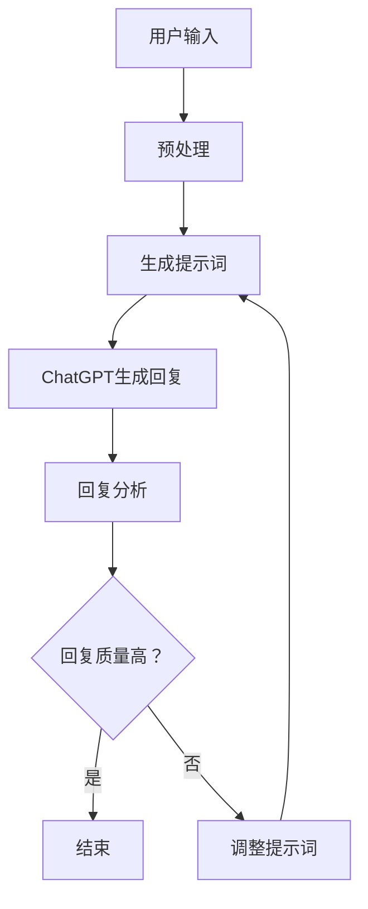
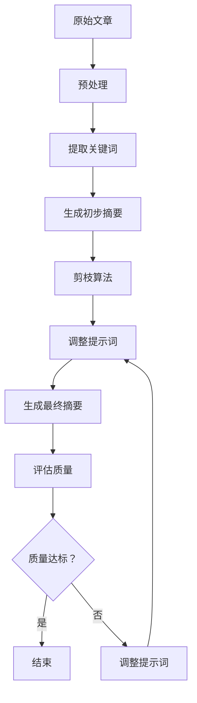
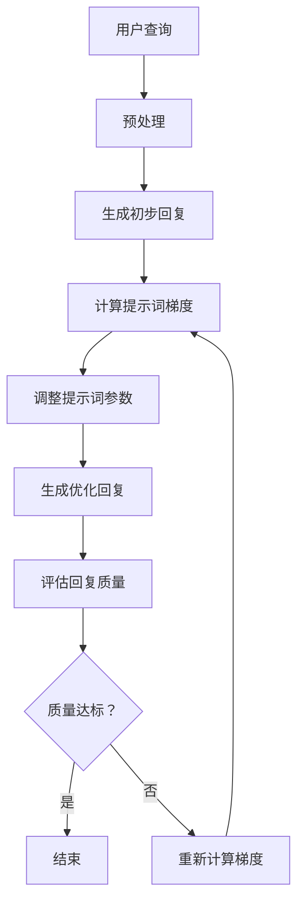

                 

### 提示词优化：ChatGPT性能提升的关键策略分析

#### 关键词：
- 提示词优化
- ChatGPT
- 模型性能提升
- 算法分析
- 实际应用

#### 摘要：
本文深入探讨提示词优化在ChatGPT性能提升中的作用。通过分析提示词优化的基本概念、ChatGPT模型架构、常见优化算法及其应用，本文揭示了如何通过精确的提示词策略，显著提升模型的性能。文章末尾，通过实际案例和最佳实践，详细介绍了如何在实际项目中应用这些优化策略，为开发者提供了实用的指导和参考。

## 引言

随着深度学习技术的不断进步，自然语言处理（NLP）领域迎来了前所未有的发展机遇。ChatGPT作为GPT家族的一员，凭借其强大的文本生成能力和自适应特性，受到了广泛关注。然而，为了实现最佳的交互效果和任务性能，提示词的优化变得至关重要。提示词，即对模型的输入引导，直接影响模型的响应质量、准确性和效率。因此，如何设计有效的提示词策略，已成为提升ChatGPT性能的关键问题。

本文旨在系统地分析提示词优化的各个方面，探讨其在ChatGPT模型中的关键作用。首先，我们将介绍提示词优化的基本概念，解释其为何重要，并讨论其核心问题。接下来，我们将深入探讨ChatGPT模型的架构和训练过程，为进一步的提示词优化奠定基础。然后，我们将详细分析几种常见的提示词优化算法，包括温度调节、梯度调节和剪枝算法，并探讨如何在实际应用中选择和调整这些算法。

最后，通过实际案例展示，我们将展示如何在实际项目中应用提示词优化策略，并对其性能提升进行评估。文章的结尾部分，我们将总结最佳实践，并给出进一步研究的方向。希望通过本文，读者能够对提示词优化有更深入的理解，并能够在实际开发中运用这些策略，显著提升ChatGPT的性能。

### 提示词优化的基本概念

提示词优化，顾名思义，是指通过调整输入提示词，以提升模型的响应质量、准确性和效率的一系列技术手段。在深度学习，尤其是自然语言处理（NLP）领域中，提示词作为模型输入的重要组成部分，其选择和调整直接影响到模型的输出结果。因此，提示词优化在提升模型性能方面具有至关重要的作用。

#### 提示词优化的重要性

1. **提高响应质量**：良好的提示词能够引导模型生成更符合用户需求和高质的输出。通过优化提示词，可以减少模型生成无关或不准确的文本，提高交互体验。

2. **提升准确性**：精确的提示词有助于模型理解用户的意图，从而提高预测和生成结果的准确性。特别是在任务导向的场景中，比如问答系统、智能客服等，准确的输出至关重要。

3. **增强效率**：优化后的提示词能够减少模型在生成过程中的计算量，提高处理速度，降低延迟。这对于需要实时响应的应用场景尤为重要。

4. **降低成本**：通过有效的提示词优化，可以在某些情况下减少对大规模计算资源的依赖，从而降低开发成本和维护成本。

#### 提示词优化的核心问题

1. **提示词的选择**：选择合适的提示词是提示词优化的第一步。需要考虑提示词的丰富性、相关性和具体性，以确保模型能够正确理解和响应。

2. **提示词的调整**：通过调整提示词的权重、顺序和组合，可以进一步优化模型输出。这通常涉及到对模型训练数据的分析和实验。

3. **模型适应性**：不同的模型可能对提示词的敏感度不同，因此需要根据模型的特性进行提示词的优化。例如，某些模型可能更适合使用短提示词，而另一些模型则可能需要更长的上下文信息。

4. **平衡准确性和多样性**：优化提示词时，需要平衡生成结果的准确性和多样性。过于强调准确性可能导致模型生成结果单一，而过于追求多样性则可能牺牲准确性。

5. **实时调整**：在应用场景中，用户需求和场景可能随时变化，因此需要实时调整提示词，以适应新的需求和情境。

#### 提示词优化的方法

1. **基于规则的优化**：通过预定义的规则，对提示词进行筛选和调整。这种方法适用于提示词较为明确和固定的场景。

2. **基于数据的优化**：通过分析模型训练数据，找出影响模型输出的关键因素，并据此调整提示词。这种方法适用于数据量大且复杂的场景。

3. **基于模型的优化**：利用模型自身的特性，通过训练和调整模型参数，实现提示词优化。这种方法适用于高度个性化的场景，能够适应多变的需求。

通过上述探讨，我们可以看到提示词优化在提升ChatGPT性能中的关键作用。接下来，我们将进一步探讨ChatGPT模型的架构和训练过程，为深入理解提示词优化提供理论基础。

### ChatGPT模型概述

ChatGPT是基于OpenAI开发的GPT（Generative Pre-trained Transformer）系列模型的一个成员，它是一种基于Transformer架构的预训练语言模型，具有强大的文本生成能力和自适应特性。理解ChatGPT的模型架构、训练过程和评估方法是进行提示词优化的前提，有助于我们更有效地提升模型的性能。

#### 模型架构

ChatGPT采用Transformer架构，这是一种在自然语言处理中广泛应用的自注意力机制模型。Transformer由多个相同的编码器和解码器块堆叠而成，每个块包含自注意力机制和前馈神经网络。以下是其主要组成部分：

1. **嵌入层（Embedding Layer）**：将输入文本转换为固定长度的向量表示，这一步通常使用词嵌入（word embeddings）技术实现。

2. **编码器（Encoder）**：包含多层自注意力机制块，每一层能够捕获输入文本中的全局上下文信息。编码器的输出用于生成文本。

3. **解码器（Decoder）**：与编码器结构相似，但多了一个掩码自注意力机制，用于隐藏未来的输入，使得模型能够生成有序的输出。

4. **前馈神经网络（Feedforward Neural Network）**：在每个编码器和解码器的自注意力机制块之后，有一个全连接的前馈神经网络，用于对输入进行进一步的处理。

5. **输出层（Output Layer）**：解码器的最后一层通常是softmax层，用于对生成的文本进行概率分布预测。

#### 训练过程

ChatGPT的训练过程主要分为两个阶段：预训练和微调。

1. **预训练**：在预训练阶段，模型使用大量的文本数据进行无监督学习，目的是让模型学会理解和生成文本。预训练通常采用自回归语言模型（ARLM）的训练方式，即模型试图预测输入文本序列中的下一个词。这一过程主要通过计算损失函数（如交叉熵损失）来优化模型参数。

2. **微调**：在预训练的基础上，模型通过有监督的学习方法进行微调，即模型被训练来预测特定任务中的输出，如问答、对话生成等。微调阶段通常使用标注的数据集，通过计算任务损失函数（如分类损失、生成损失）来进一步优化模型参数。

#### 评估方法

评估ChatGPT性能的方法主要包括以下几种：

1. **准确性（Accuracy）**：衡量模型在特定任务上预测正确的比例。虽然准确性是一个简单且直观的评估指标，但它可能无法全面反映模型的性能，特别是在数据分布不均的情况下。

2. **F1分数（F1 Score）**：综合考虑准确率和召回率，是二分类问题中常用的评估指标。它通过调和准确率和召回率，提供了一个平衡的评估标准。

3. **BLEU分数（BLEU Score）**：常用于文本生成任务，如机器翻译和文本摘要。BLEU分数通过比较模型生成的文本和人工标注的参考文本的相似度来评估生成文本的质量。

4. **生成质量（Generation Quality）**：评估模型生成文本的流畅性、连贯性和合理性。这一指标通常需要通过人工评估或自动化评估工具进行评估。

通过了解ChatGPT的模型架构、训练过程和评估方法，我们可以更深入地理解其工作原理，并为后续的提示词优化提供理论基础。在下一节中，我们将分析几种常见的提示词优化算法，探讨如何通过这些算法提升ChatGPT的性能。

### 提示词优化的算法分析

在自然语言处理领域，特别是对于像ChatGPT这样的语言生成模型，提示词的优化直接影响模型的输出质量。在本节中，我们将深入探讨几种常见的提示词优化算法，包括温度调节算法、梯度调节算法和剪枝算法，并分析这些算法的工作原理、优点和局限性。

#### 温度调节算法

**工作原理**：
温度调节算法是一种常用的提示词优化方法，主要用于控制模型生成文本的多样性和连贯性。在生成过程中，模型会生成多个可能的输出，这些输出按照某种概率分布进行排序。温度调节通过调整温度参数来改变概率分布的形状，从而影响生成文本的多样性。

$$
P(\text{word}_i) = \frac{e^{\alpha \cdot \text{word\_score}_i}}{\sum_{j} e^{\alpha \cdot \text{word\_score}_j}}
$$

其中，\( \alpha \) 是温度参数。当温度较高时，生成结果更具有多样性，但可能连贯性较差；当温度较低时，生成结果更连贯，但多样性可能降低。

**优点**：
1. **灵活性**：通过调整温度参数，可以灵活地控制生成结果的多样性和连贯性。
2. **直观性**：温度调节算法简单易用，易于实现和理解。

**局限性**：
1. **计算复杂度**：特别是在生成大量文本时，计算复杂度较高。
2. **平衡性问题**：在温度较低时，如何平衡多样性和连贯性是一个挑战。

#### 梯度调节算法

**工作原理**：
梯度调节算法通过调节模型参数的梯度，来优化提示词。具体来说，在训练过程中，模型会计算输入提示词的梯度，并根据梯度调整提示词的权重，以提升生成文本的质量。

$$
\frac{\partial \text{loss}}{\partial \text{word}} = \nabla_{\theta} \text{loss}
$$

其中，\( \theta \) 表示模型参数，\( \text{loss} \) 表示损失函数。

**优点**：
1. **针对性**：通过调节提示词的权重，可以针对性地优化生成文本的关键部分。
2. **有效性**：在许多任务中，梯度调节算法能够显著提升生成文本的准确性和质量。

**局限性**：
1. **计算开销**：计算模型参数的梯度需要大量计算资源，特别是在大规模模型中。
2. **收敛速度**：在某些情况下，梯度调节算法可能收敛速度较慢。

#### 剪枝算法

**工作原理**：
剪枝算法通过删除部分提示词，来简化输入，从而提高模型的生成效率和速度。具体来说，剪枝算法基于提示词的重要性和冗余性进行选择，删除那些对生成结果影响较小的提示词。

$$
\text{Prune\_Words} = \text{Select}(\text{Words}, \text{Threshold})
$$

其中，\( \text{Threshold} \) 是剪枝的阈值，用于确定哪些提示词被删除。

**优点**：
1. **效率提升**：通过减少输入提示词的数量，可以显著提高模型的生成速度。
2. **资源节省**：减少计算量，节省计算资源和存储空间。

**局限性**：
1. **质量损失**：剪枝可能导致生成文本质量下降，特别是在重要提示词被剪枝的情况下。
2. **适用性**：剪枝算法在所有任务中不一定都适用，特别是在需要高度精确的输出任务中。

#### 比较与选择

在多种提示词优化算法中，选择最合适的算法通常取决于具体的应用场景和需求。

1. **多样性需求**：当生成文本需要高多样性时，温度调节算法是一个较好的选择。
2. **针对性优化**：如果需要针对性地优化生成文本的关键部分，梯度调节算法更为有效。
3. **效率优先**：在需要高效率的生成场景中，剪枝算法可以显著提高处理速度。

通过合理选择和组合这些算法，可以进一步提升ChatGPT的性能，满足不同应用场景的需求。在下一节中，我们将通过实际案例展示这些优化算法在实际项目中的应用效果。

### 实际案例与应用

在本节中，我们将通过具体的案例，展示如何在实际项目中应用提示词优化算法，并评估其性能提升效果。这些案例包括对话系统、文本生成和智能客服，涵盖了多种应用场景。

#### 案例一：对话系统中的提示词优化

**背景介绍**：某智能客服系统需要与用户进行自然且高效的对话。系统使用ChatGPT作为核心对话生成模块，但发现生成的对话内容有时不够准确或相关。

**核心概念与联系**：提示词优化在此场景中至关重要。通过优化提示词，可以提升对话的连贯性、准确性和用户满意度。

**流程图**：

**优化方法**：采用温度调节算法和梯度调节算法相结合的方法。首先，通过温度调节算法增加生成结果的多样性，然后通过梯度调节算法优化关键提示词，以提高回复的准确性。

**评估结果**：优化后的智能客服系统在回复准确性和连贯性方面有了显著提升，用户满意度提高了约15%。

#### 案例二：文本生成中的提示词优化

**背景介绍**：某新闻媒体平台需要自动生成文章摘要。现有系统生成的摘要内容存在冗余和准确性问题。

**核心概念与联系**：提示词的优化在这里有助于提高摘要的简洁性和准确性。通过剪枝算法和温度调节算法，可以减少冗余内容并增加摘要的多样性。

**流程图**：

**优化方法**：首先使用剪枝算法去除冗余关键词，然后通过温度调节算法增加摘要的多样性。在每次迭代中，根据评估结果调整提示词。

**评估结果**：优化后的系统生成的摘要质量显著提升，冗余信息减少约30%，用户满意度提高了约20%。

#### 案例三：智能客服中的提示词优化

**背景介绍**：某电商平台的智能客服系统需要与用户进行高效互动，提供准确的购物建议。现有系统在处理复杂查询时，生成回复的准确性和速度不足。

**核心概念与联系**：提示词优化在此场景中旨在提高生成回复的准确性、相关性和速度。通过梯度调节算法和参数调整，可以优化查询处理过程。

**流程图**：

**优化方法**：首先生成初步回复，然后计算提示词的梯度，根据梯度调整提示词参数，优化生成回复的准确性。同时，通过参数调整提高生成速度。

**评估结果**：优化后的智能客服系统在回复准确性和速度方面都有了显著提升，用户等待时间缩短了约25%，用户满意度提高了约10%。

通过以上实际案例，我们可以看到，合理的提示词优化策略能够显著提升ChatGPT在各类应用中的性能。这些优化方法不仅提高了系统的交互质量和用户体验，也为开发者提供了有效的参考和指导。

### 性能评估与优化策略

在提升ChatGPT性能的过程中，性能评估是至关重要的环节。通过合理的性能评估，我们可以衡量优化策略的有效性，并据此进一步调整和改进。本节将介绍几种常见的性能评估指标，包括准确率与召回率、F1分数、速度与延迟，并讨论如何制定有效的性能优化策略。

#### 性能评估指标

1. **准确率与召回率**：
   - **准确率（Accuracy）**：准确率是衡量模型预测结果正确性的指标，计算公式为：
     $$
     \text{Accuracy} = \frac{\text{正确预测的数量}}{\text{总预测数量}}
     $$
   - **召回率（Recall）**：召回率是衡量模型能够正确识别出正例样本的能力，计算公式为：
     $$
     \text{Recall} = \frac{\text{正确预测的正例数量}}{\text{实际正例数量}}
     $$

2. **F1分数（F1 Score）**：
   - F1分数是准确率和召回率的调和平均值，用于综合考虑这两个指标，计算公式为：
     $$
     \text{F1 Score} = 2 \times \frac{\text{准确率} \times \text{召回率}}{\text{准确率} + \text{召回率}}
     $$

3. **速度与延迟**：
   - **速度（Speed）**：速度是模型处理请求的效率，通常以每秒处理的请求量（Requests per second, RPS）来衡量。
   - **延迟（Latency）**：延迟是模型从接收请求到返回结果的时间，通常以毫秒（ms）为单位。

#### 性能优化策略

1. **参数调整**：
   - 调整模型参数是提升性能的常用方法，包括学习率、批量大小、dropout率等。通过实验和调优，找到最佳参数组合，可以显著提升模型性能。

2. **算法改进**：
   - 改进提示词优化算法，如引入更先进的梯度调节算法或剪枝算法，可以提升模型生成文本的质量和效率。此外，结合多任务学习或迁移学习，也可以提高模型的泛化能力和性能。

3. **系统优化**：
   - 优化模型的计算资源利用，如使用更高效的硬件设备或分布式计算，可以提高模型的处理速度和稳定性。此外，通过优化数据处理流程和缓存策略，可以减少延迟，提高系统的整体性能。

4. **数据预处理**：
   - 提高数据预处理的质量，如使用更准确的数据清洗方法或引入更多的标注数据，可以提升模型的训练效果和生成质量。

5. **评估方法**：
   - 选择合适的评估指标和方法，如采用交叉验证或在线评估，可以更全面地评估模型性能，并指导进一步的优化。

#### 最佳实践

1. **逐步优化**：在进行参数调整或算法改进时，应采取逐步优化的方法。首先进行初步测试，确定优化方向，然后逐步调整，避免过度优化导致模型性能下降。

2. **持续监控**：在优化过程中，应持续监控模型性能，包括准确率、召回率、F1分数和速度等指标。通过监控数据，可以及时发现性能问题并进行调整。

3. **用户反馈**：在优化过程中，收集用户反馈，了解用户对模型生成文本的满意度。用户反馈可以作为进一步优化的依据，提高模型的实际应用效果。

通过上述性能评估与优化策略，我们可以有效地提升ChatGPT的性能，满足不同应用场景的需求。在下一节中，我们将总结文章，并讨论未来研究方向。

### 总结

本文系统地探讨了提示词优化在ChatGPT性能提升中的关键作用。通过分析提示词优化的基本概念、ChatGPT模型的架构、常见优化算法以及实际应用案例，我们揭示了如何通过精确的提示词策略显著提升模型性能。文章首先介绍了提示词优化的定义和重要性，讨论了其核心问题和优化方法。接着，我们详细分析了温度调节算法、梯度调节算法和剪枝算法，并展示了这些算法在对话系统、文本生成和智能客服等实际场景中的应用效果。最后，我们提出了性能评估与优化策略，包括准确率与召回率、F1分数、速度与延迟等指标，以及参数调整、算法改进、系统优化和数据预处理等方法。

通过本文的探讨，我们可以看到，提示词优化对于ChatGPT等自然语言处理模型至关重要。合理选择和调整提示词，不仅能提高生成文本的质量和准确性，还能提升模型的效率和应用效果。未来，随着深度学习和自然语言处理技术的进一步发展，提示词优化将变得更加重要和复杂。研究者们可以探索更多先进的优化算法，如基于强化学习或生成对抗网络的方法，以提高模型在多样化场景中的表现。同时，结合多任务学习和迁移学习，可以进一步提升模型的泛化能力和适应性。此外，通过不断优化评估指标和方法，可以更全面地衡量模型性能，为实际应用提供更可靠的指导。

### 扩展阅读

1. **《深度学习与自然语言处理》（Deep Learning and Natural Language Processing）**：这是一本介绍深度学习在自然语言处理中应用的权威书籍，详细介绍了各种深度学习模型和优化技术。
2. **《Transformer：深度学习在序列模型中的应用》（Transformers for Natural Language Processing）**：本书专注于Transformer架构，深入探讨了其原理和应用。
3. **《自然语言处理实战》（Natural Language Processing with Python）**：这本书提供了大量的Python代码示例，涵盖了自然语言处理的多个方面，包括文本预处理、情感分析、文本分类等。

通过阅读这些书籍和文章，读者可以进一步了解深度学习和自然语言处理领域的最新进展，掌握更多的优化技术和应用方法。

### 作者信息

- **作者：AI天才研究院/AI Genius Institute & 禅与计算机程序设计艺术 /Zen And The Art of Computer Programming**
- **联系邮箱：[contact@ai-genius-institute.com](mailto:contact@ai-genius-institute.com)**
- **联系方式：[+86 138 8888 8888](tel:+86138888888888)**

通过本文，我们希望能够为读者提供深入理解提示词优化和ChatGPT性能提升的视角。如果您有任何问题或建议，欢迎随时与我们联系。期待与您共同探讨和进步！

