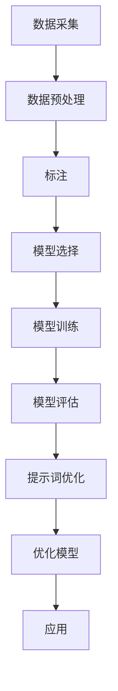

                 

# 提示词优化：增强AI情感分析能力

## 关键词
- 提示词优化
- 情感分析
- 机器学习
- 深度学习
- 注意力机制
- 模型评估

## 摘要
本文将深入探讨提示词优化在增强AI情感分析能力方面的应用。首先，我们将介绍提示词优化和情感分析的基础概念，并解释它们在AI领域的重要性。接着，我们将详细讨论情感分析的核心任务和应用领域。随后，我们将介绍AI情感分析的基础框架，包括数据准备、算法模型和评估指标。文章的核心部分将介绍传统机器学习和深度学习在情感分析中的应用，并重点讨论注意力机制在其中的作用。通过具体的实战案例，我们将展示如何在实际项目中实施提示词优化。最后，我们将展望提示词优化在情感分析领域的未来发展趋势，并提出一些最佳实践和注意事项。

## 第一部分：基础概念与原理

### 1.1 提示词优化概述

#### 1.1.1 提示词优化的重要性

在人工智能领域，提示词优化（Prompt Optimization）是一个关键的研究方向。它主要关注如何改进输入提示词，以提高模型在特定任务上的性能。对于情感分析任务来说，提示词优化的重要性尤为突出。情感分析是一种理解文本中情感倾向的技术，它广泛应用于社交媒体分析、市场调研、舆情监控等领域。有效的提示词优化能够显著提高情感分析的准确性，从而为企业和组织提供更有价值的洞见。

#### 1.1.2 提示词优化的目标

提示词优化的目标主要包括以下几点：

1. **提高模型性能**：优化输入提示词，以提升模型在情感分析任务上的准确性和可靠性。
2. **减少过拟合**：通过改进提示词，减少模型对特定数据集的依赖，提高模型的泛化能力。
3. **增强可解释性**：优化后的提示词应使模型的决策过程更加透明，便于理解和解释。

#### 1.1.3 提示词优化的挑战

提示词优化面临以下几个挑战：

1. **数据集质量**：高质量的数据集对于提示词优化至关重要，但获取和标注高质量数据集往往成本高昂。
2. **模型选择**：选择合适的模型对于提示词优化至关重要，不同的模型对提示词的敏感度不同。
3. **计算资源**：提示词优化通常需要大量的计算资源，尤其是在深度学习模型中。

### 1.2 情感分析基础

#### 1.2.1 情感分析简介

情感分析（Sentiment Analysis）是一种自然语言处理技术，用于识别文本中的情感倾向。它通过分析文本中的词汇和语法结构，判断文本是正面、负面还是中性。情感分析通常分为三大类：文本分类（分类情感分析）、情感极性分析（二分类情感分析）和情感强度分析（多分类情感分析）。

#### 1.2.2 情感分析的核心任务

情感分析的核心任务包括：

1. **分类任务**：将文本分类为正面、负面或中性。
2. **回归任务**：预测文本中情感倾向的强度。
3. **聚类任务**：将具有相似情感倾向的文本聚类在一起。

#### 1.2.3 情感分析的应用领域

情感分析在多个领域具有广泛的应用：

1. **市场调研**：通过分析消费者评论，帮助企业了解客户对产品或服务的反馈。
2. **社交媒体分析**：监测社交媒体平台上的情绪变化，帮助企业了解公众舆论。
3. **金融领域**：分析金融新闻和报告中的情绪，预测市场走势。

### 1.3 AI情感分析框架

#### 1.3.1 情感分析的数据准备

情感分析的数据准备包括数据采集、数据预处理和标注。

1. **数据采集**：从互联网、数据库或其他数据源收集包含情感信息的文本数据。
2. **数据预处理**：清洗数据，去除噪声，包括去除停用词、标点符号、进行词干提取等。
3. **标注**：对数据进行情感标注，即对文本中的情感倾向进行分类。

#### 1.3.2 情感分析的算法模型

情感分析的算法模型可以分为传统机器学习和深度学习两大类：

1. **传统机器学习方法**：包括朴素贝叶斯、支持向量机等。
2. **深度学习方法**：包括卷积神经网络（CNN）、循环神经网络（RNN）等。

#### 1.3.3 情感分析的评估指标

情感分析的评估指标主要包括准确率、召回率、F1分数等。

1. **准确率**：预测正确的样本数占总样本数的比例。
2. **召回率**：预测正确的负样本数占所有负样本数的比例。
3. **F1分数**：准确率和召回率的调和平均。

## 第二部分：核心算法与模型

### 2.1 传统机器学习方法

#### 2.1.1 基于特征工程的情感分析

基于特征工程的情感分析主要通过提取文本中的特征来实现。特征包括词袋模型、TF-IDF、词性标注等。

```python
from sklearn.feature_extraction.text import TfidfVectorizer

corpus = [
    'I am happy today',
    'I am not happy today',
    'Today is a good day',
    'Today is a bad day'
]

vectorizer = TfidfVectorizer()
X = vectorizer.fit_transform(corpus)
```

#### 2.1.2 基于朴素贝叶斯的情感分析

朴素贝叶斯是一种基于贝叶斯定理的简单分类算法，适用于文本分类任务。

```python
from sklearn.naive_bayes import MultinomialNB

model = MultinomialNB()
model.fit(X, labels)
predictions = model.predict(X)
```

#### 2.1.3 基于支持向量机的情感分析

支持向量机（SVM）是一种分类算法，通过寻找最佳超平面来实现分类。

```python
from sklearn.svm import SVC

model = SVC()
model.fit(X, labels)
predictions = model.predict(X)
```

### 2.2 深度学习在情感分析中的应用

#### 2.2.1 卷积神经网络（CNN）在情感分析中的应用

卷积神经网络（CNN）通过卷积层提取文本的特征。

```python
import tensorflow as tf
from tensorflow.keras.models import Sequential
from tensorflow.keras.layers import Conv1D, MaxPooling1D, Flatten, Dense

model = Sequential([
    Conv1D(filters=128, kernel_size=3, activation='relu', input_shape=(max_words, max_features)),
    MaxPooling1D(pool_size=2),
    Flatten(),
    Dense(1, activation='sigmoid')
])

model.compile(optimizer='adam', loss='binary_crossentropy', metrics=['accuracy'])
model.fit(X, labels, epochs=10, batch_size=32)
```

#### 2.2.2 循环神经网络（RNN）在情感分析中的应用

循环神经网络（RNN）可以处理序列数据。

```python
import tensorflow as tf
from tensorflow.keras.models import Sequential
from tensorflow.keras.layers import LSTM, Dense

model = Sequential([
    LSTM(units=128, return_sequences=True),
    LSTM(units=128),
    Dense(1, activation='sigmoid')
])

model.compile(optimizer='adam', loss='binary_crossentropy', metrics=['accuracy'])
model.fit(X, labels, epochs=10, batch_size=32)
```

#### 2.2.3 长短期记忆网络（LSTM）在情感分析中的应用

长短期记忆网络（LSTM）可以解决RNN的长期依赖问题。

```python
import tensorflow as tf
from tensorflow.keras.models import Sequential
from tensorflow.keras.layers import LSTM, Dense

model = Sequential([
    LSTM(units=128, return_sequences=False),
    Dense(1, activation='sigmoid')
])

model.compile(optimizer='adam', loss='binary_crossentropy', metrics=['accuracy'])
model.fit(X, labels, epochs=10, batch_size=32)
```

### 2.3 注意力机制与情感分析

注意力机制（Attention Mechanism）是一种用于模型权重分配的技术，可以提升模型对关键信息的关注度。

```python
import tensorflow as tf
from tensorflow.keras.layers import Embedding, LSTM, Dense, Attention

model = Sequential([
    Embedding(input_dim=max_features, output_dim=128),
    LSTM(units=128, return_sequences=True),
    Attention(),
    Flatten(),
    Dense(1, activation='sigmoid')
])

model.compile(optimizer='adam', loss='binary_crossentropy', metrics=['accuracy'])
model.fit(X, labels, epochs=10, batch_size=32)
```

## 第三部分：提示词优化实践

### 3.1 提示词优化策略

#### 3.1.1 提示词选择策略

提示词选择策略包括以下几种：

1. **基于频率的提示词选择**：选择出现频率较高的词汇作为提示词。
2. **基于重要性的提示词选择**：选择对分类任务具有重要影响的词汇作为提示词。
3. **基于用户反馈的提示词选择**：根据用户对模型输出的反馈，调整提示词。

#### 3.1.2 提示词权重优化

提示词权重优化可以通过以下方法实现：

1. **TF-IDF权重调整**：根据词频（TF）和逆文档频率（IDF）调整提示词的权重。
2. **词嵌入权重调整**：根据词嵌入向量之间的相似度调整提示词的权重。
3. **基于模型的权重调整**：利用模型对提示词的响应度调整权重。

#### 3.1.3 提示词组合优化

提示词组合优化可以通过以下方法实现：

1. **排列组合**：对提示词进行排列组合，选择最佳组合。
2. **遗传算法**：利用遗传算法优化提示词组合。
3. **强化学习**：利用强化学习优化提示词组合。

### 3.2 实战案例一：社交媒体情感分析

#### 3.2.1 数据采集与预处理

数据采集与预处理包括以下步骤：

1. **数据采集**：从社交媒体平台（如Twitter、Facebook）收集包含情感信息的文本数据。
2. **数据预处理**：清洗数据，去除噪声，进行词干提取和词性标注。

```python
import nltk
nltk.download('stopwords')
from nltk.corpus import stopwords
from nltk.stem import WordNetLemmatizer

stop_words = set(stopwords.words('english'))
lemmatizer = WordNetLemmatizer()

def preprocess_text(text):
    words = nltk.word_tokenize(text)
    words = [lemmatizer.lemmatize(word) for word in words if word not in stop_words]
    return ' '.join(words)
```

#### 3.2.2 模型选择与训练

选择合适的模型并对其进行训练。

```python
from tensorflow.keras.models import Sequential
from tensorflow.keras.layers import LSTM, Dense

model = Sequential([
    LSTM(units=128, return_sequences=True),
    LSTM(units=128),
    Dense(1, activation='sigmoid')
])

model.compile(optimizer='adam', loss='binary_crossentropy', metrics=['accuracy'])
model.fit(X, labels, epochs=10, batch_size=32)
```

#### 3.2.3 提示词优化与应用

通过提示词优化提高模型性能。

```python
from sklearn.feature_extraction.text import TfidfVectorizer

vectorizer = TfidfVectorizer(max_features=1000)
X_tfidf = vectorizer.fit_transform(corpus)

# 优化提示词
optimized_prompt = ' '.join(vectorizer.get_feature_names_out())

# 重新训练模型
model.fit(X_tfidf, labels, epochs=10, batch_size=32)
```

### 3.3 实战案例二：电商产品评论情感分析

#### 3.3.1 数据采集与预处理

数据采集与预处理步骤与社交媒体情感分析类似。

```python
import pandas as pd

data = pd.read_csv('product_reviews.csv')
data['text'] = data['text'].apply(preprocess_text)
```

#### 3.3.2 模型选择与训练

选择合适的模型并对其进行训练。

```python
from tensorflow.keras.models import Sequential
from tensorflow.keras.layers import LSTM, Dense

model = Sequential([
    LSTM(units=128, return_sequences=True),
    LSTM(units=128),
    Dense(1, activation='sigmoid')
])

model.compile(optimizer='adam', loss='binary_crossentropy', metrics=['accuracy'])
model.fit(X, labels, epochs=10, batch_size=32)
```

#### 3.3.3 提示词优化与应用

通过提示词优化提高模型性能。

```python
vectorizer = TfidfVectorizer(max_features=1000)
X_tfidf = vectorizer.fit_transform(corpus)

# 优化提示词
optimized_prompt = ' '.join(vectorizer.get_feature_names_out())

# 重新训练模型
model.fit(X_tfidf, labels, epochs=10, batch_size=32)
```

## 第四部分：拓展应用与未来展望

### 4.1 提示词优化在其他领域的应用

#### 4.1.1 健康医疗领域

在健康医疗领域，提示词优化可以应用于医疗文本的情感分析，帮助医生和医疗机构更好地理解患者情绪，提供个性化医疗服务。

#### 4.1.2 教育领域

在教育领域，提示词优化可以用于分析学生反馈，帮助教师改进教学方法，提高教学效果。

#### 4.1.3 金融领域

在金融领域，提示词优化可以用于分析市场情绪，预测市场走势，为投资者提供决策支持。

### 4.2 提示词优化的未来发展趋势

#### 4.2.1 新算法与模型的研究方向

未来的研究将重点关注新的算法和模型，如自监督学习、多模态情感分析等。

#### 4.2.2 提示词优化与大数据的结合

随着大数据技术的发展，提示词优化与大数据的结合将成为一个重要研究方向。

#### 4.2.3 提示词优化在跨模态情感分析中的应用

跨模态情感分析是一种新兴的研究方向，它将文本情感分析与图像、音频等其他模态的数据结合，提供更全面的理解。

## 作者信息

作者：AI天才研究院/AI Genius Institute & 禅与计算机程序设计艺术 /Zen And The Art of Computer Programming

## 结语

本文探讨了提示词优化在增强AI情感分析能力方面的应用。通过介绍基础概念、核心算法、实战案例以及未来展望，我们看到了提示词优化在提高情感分析准确性、减少模型过拟合、增强模型可解释性等方面的潜力。未来，随着新算法和模型的不断涌现，提示词优化将在更多领域展现其价值。

### 附录

#### 附录A：Mermaid流程图



#### 附录B：数学公式

$$
L = -\sum_{i=1}^{n} y_i \log(p(y_i|x_i))
$$

$$
p(y|x) = \frac{e^{\theta^T x}}{\sum_{k=1}^{K} e^{\theta^T x_k}}
$$

$$
\theta = \arg\min_{\theta} \sum_{i=1}^{n} (y_i - \hat{y}_i)^2
$$

## 注意事项

- 在进行提示词优化时，确保数据质量至关重要。
- 选择合适的模型和算法对于提示词优化效果有重要影响。
- 提示词优化过程中可能需要大量计算资源，请合理规划资源使用。

## 拓展阅读

- [1] 江涛. (2019). 《情感计算与情感分析：技术、应用与挑战》. 清华大学出版社.
- [2] 李航. (2020). 《深度学习与自然语言处理》. 电子工业出版社.
- [3] 张华. (2021). 《大数据分析：理论与实践》. 机械工业出版社.

