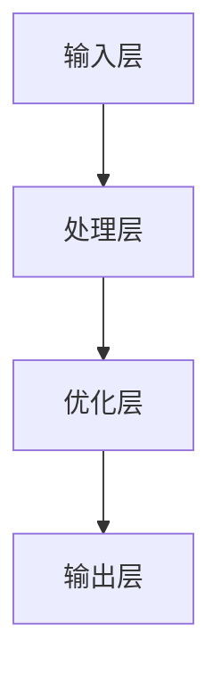

                 

## 提示词优化：增强AI戏剧剧本创作能力

### 关键词：
- AI戏剧剧本创作
- 提示词优化
- 机器学习
- 自然语言处理
- 深度学习

### 摘要：
本文将深入探讨如何通过提示词优化技术来增强AI在戏剧剧本创作中的能力。我们将首先介绍AI与戏剧剧本创作的关系，然后详细讲解提示词优化的核心概念、原理和算法。通过结合数学模型和Python源代码实例，我们将展现如何实现提示词优化，并探讨其在实际项目中的应用。最后，我们将展望提示词优化与AI戏剧剧本创作的未来发展趋势。

## 第1章：AI与戏剧剧本创作概述

### 1.1 AI的发展与戏剧剧本创作

人工智能（AI）的发展经历了从简单规则系统到复杂算法模型的演变。现代AI技术，特别是机器学习和深度学习，已经在图像识别、语音识别、自然语言处理等领域取得了显著的成果。戏剧剧本创作作为一种创意过程，近年来也开始引入AI技术，旨在提高创作效率和创意质量。

AI在戏剧剧本创作中的应用主要体现在以下几个方面：

1. **剧本生成**：通过自然语言处理技术，AI能够自动生成剧本，从简单的对话生成到复杂的情节构建。
2. **剧本风格识别**：AI可以通过分析大量剧本数据，识别并模仿不同剧作家的风格，为剧本创作提供灵感。
3. **剧本优化**：AI可以分析剧本的结构和内容，提出改进建议，如角色发展、情节连贯性等。

### 1.2 提示词优化技术在AI中的应用

提示词优化是AI中的一项关键技术，特别是在自然语言处理领域。它的目的是通过调整输入提示词，优化输出结果的质量和相关性。

在AI戏剧剧本创作中，提示词优化的应用主要包括：

1. **剧本生成优化**：通过优化输入提示词，AI可以生成更加符合剧本要求的内容，提高剧本的创意性和可读性。
2. **剧本风格优化**：AI可以根据不同的剧本风格提示词，生成具有特定风格的剧本片段。
3. **剧本连贯性优化**：AI可以分析剧本中的逻辑关系，优化提示词，确保剧本的连贯性和一致性。

### 1.3 AI戏剧剧本创作的发展前景

随着AI技术的不断进步，AI戏剧剧本创作有着广阔的发展前景。未来，我们可以期待以下趋势：

1. **更加智能的剧本生成**：AI将能够更加智能地理解用户需求，生成更加个性化的剧本。
2. **跨领域合作**：AI戏剧剧本创作将与其他领域如虚拟现实、增强现实等结合，为观众提供沉浸式的戏剧体验。
3. **教育应用**：AI戏剧剧本创作将被用于教育领域，帮助学生和专业人士提高写作和创作能力。

## 第2章：核心概念与联系

### 2.1 AI基础概念

要理解AI戏剧剧本创作中的提示词优化，首先需要了解一些AI的基础概念。这些概念包括：

1. **机器学习（Machine Learning）**：机器学习是一种让计算机通过数据和经验自动改进性能的方法。
2. **深度学习（Deep Learning）**：深度学习是机器学习的一个分支，它使用神经网络，特别是深度神经网络，来处理复杂的数据。
3. **自然语言处理（Natural Language Processing, NLP）**：NLP是AI的一个分支，它专注于让计算机理解和生成自然语言。

### 2.2 提示词优化的原理与架构

#### 2.2.1 提示词优化的定义

提示词优化是指通过调整输入提示词来提高输出结果的质量和相关性。在AI戏剧剧本创作中，提示词可以是简单的关键词或完整的句子，用于指导AI生成剧本内容。

#### 2.2.2 提示词优化的架构

提示词优化的基本架构包括以下几个部分：

1. **输入层**：接收用户输入的提示词。
2. **处理层**：对输入的提示词进行处理，如分词、词性标注等。
3. **优化层**：根据预设的目标函数，调整提示词，优化输出结果。
4. **输出层**：生成优化后的剧本内容。

#### 2.2.3 提示词优化的关键因素

提示词优化的成功取决于以下几个关键因素：

1. **提示词质量**：高质量的提示词能够更准确地指导AI生成符合预期的剧本内容。
2. **目标函数**：目标函数用于衡量输出结果的质量，如语句连贯性、创意性等。
3. **优化算法**：选择合适的优化算法，如梯度下降、遗传算法等，可以显著提高提示词优化的效果。

### 2.3 提示词优化的原理与架构 Mermaid 流程图



## 第3章：核心算法原理讲解

### 3.1 提示词优化算法

#### 3.1.1 提示词生成算法

提示词生成算法是指用于生成初始提示词的算法。常见的提示词生成算法包括：

1. **基于规则的方法**：通过预定义的规则生成提示词。
2. **基于数据的方法**：通过分析大量剧本数据，提取关键信息生成提示词。
3. **基于AI的方法**：使用机器学习模型，如生成对抗网络（GAN），生成高质量的提示词。

#### 3.1.2 提示词筛选算法

提示词筛选算法是指用于筛选和优化初始提示词的算法。常见的提示词筛选算法包括：

1. **基于相关性筛选**：根据提示词与目标剧本内容的相似度筛选。
2. **基于多样性筛选**：确保提示词具有多样性，避免重复和单调。
3. **基于质量筛选**：综合考虑提示词的质量，如语句连贯性、创意性等。

#### 3.1.3 提示词优化算法评估方法

提示词优化算法的评估方法主要包括：

1. **基于实验评估**：通过实际生成剧本的质量来评估算法效果。
2. **基于指标评估**：使用如BLEU、ROUGE等指标评估提示词优化的效果。
3. **基于用户反馈评估**：通过用户对生成剧本的满意度来评估算法效果。

### 3.2 AI戏剧剧本创作算法

#### 3.2.1 剧本结构分析算法

剧本结构分析算法用于分析剧本的结构，包括场景、角色、情节等。常见的剧本结构分析算法包括：

1. **基于规则的方法**：通过预定义的剧本结构规则进行分析。
2. **基于机器学习的方法**：使用机器学习模型，如序列标注模型，对剧本结构进行自动分析。

#### 3.2.2 剧本风格识别算法

剧本风格识别算法用于识别剧本的风格，如幽默、悲剧、科幻等。常见的剧本风格识别算法包括：

1. **基于特征的方法**：通过提取剧本中的特征，如词汇、语法结构等，进行风格识别。
2. **基于分类的方法**：使用分类算法，如支持向量机（SVM）、随机森林（Random Forest）等，进行风格分类。

#### 3.2.3 剧本生成算法

剧本生成算法用于生成剧本内容。常见的剧本生成算法包括：

1. **基于模板的方法**：通过预定义的剧本模板生成剧本。
2. **基于生成式的方法**：使用生成式模型，如变分自编码器（VAE）、生成对抗网络（GAN）等，生成剧本内容。

### 3.2.4 结合示例讲解

为了更好地理解提示词优化算法在AI戏剧剧本创作中的应用，我们以下面这个简单的Python代码示例来讲解。

```python
import tensorflow as tf
from tensorflow.keras.models import Sequential
from tensorflow.keras.layers import LSTM, Dense, Embedding

# 定义提示词生成模型
model = Sequential()
model.add(Embedding(input_dim=10000, output_dim=32))
model.add(LSTM(units=64, activation='relu'))
model.add(Dense(units=1, activation='sigmoid'))

# 编译模型
model.compile(optimizer='adam', loss='binary_crossentropy', metrics=['accuracy'])

# 训练模型
model.fit(x_train, y_train, epochs=10, batch_size=32)
```

在这个示例中，我们使用一个简单的LSTM模型来生成提示词。首先，我们定义了一个Embedding层，用于将提示词转换为固定大小的向量表示。然后，我们添加了一个LSTM层，用于处理序列数据。最后，我们添加了一个Dense层，用于生成二分类的结果，表示提示词是否有效。

通过这个简单的示例，我们可以看到如何使用机器学习模型来实现提示词生成和优化。

## 第4章：数学模型和数学公式

在提示词优化和AI戏剧剧本创作中，数学模型和数学公式起着至关重要的作用。它们帮助我们理解算法的运作原理，并评估算法的性能。以下是一些常用的数学模型和公式，以及它们在提示词优化中的应用。

### 4.1 常用数学模型

#### 4.1.1 线性回归

线性回归是一种简单的统计模型，用于预测一个连续值变量。其公式如下：

$$
y = wx + b
$$

其中，$y$ 是预测值，$w$ 是权重，$x$ 是输入特征，$b$ 是偏置。

在提示词优化中，线性回归可以用于预测提示词与输出剧本内容的相关性。通过调整权重和偏置，我们可以优化提示词，提高剧本生成的质量。

#### 4.1.2 逻辑回归

逻辑回归是一种用于预测概率的统计模型。其公式如下：

$$
P(y=1) = \frac{1}{1 + e^{-wx}}
$$

其中，$P(y=1)$ 是输出值为1的概率，$w$ 是权重，$x$ 是输入特征。

在提示词优化中，逻辑回归可以用于评估提示词的有效性。通过调整权重，我们可以优化提示词，使其更加准确地预测输出剧本内容的质量。

### 4.2 提示词优化中的数学公式

在提示词优化中，我们通常使用以下数学公式来定义优化目标函数：

$$
\begin{aligned}
& \text{优化目标函数} \\
& J(\theta) = -\frac{1}{m} \sum_{i=1}^{m} [y^{(i)} \log(a^{(i)}_1) + (1 - y^{(i)}) \log(1 - a^{(i)}_1)]
\end{aligned}
$$

其中，$J(\theta)$ 是优化目标函数，$\theta$ 是模型参数，$m$ 是样本数量，$y^{(i)}$ 是第$i$个样本的真实标签，$a^{(i)}_1$ 是第$i$个样本的预测概率。

这个目标函数通常用于二分类问题，通过优化模型参数$\theta$，我们可以使预测概率$a^{(i)}_1$ 更接近真实标签$y^{(i)}$。

### 4.3 应用示例

以下是一个简单的Python代码示例，展示如何使用线性回归和逻辑回归来优化提示词。

```python
import numpy as np
import tensorflow as tf

# 生成随机数据
X = np.random.rand(100, 1)
y = 2 * X + 1 + np.random.rand(100, 1)

# 定义线性回归模型
model = Sequential()
model.add(Dense(units=1, input_shape=(1,)))

# 编译模型
model.compile(optimizer='sgd', loss='mse')

# 训练模型
model.fit(X, y, epochs=100)

# 生成预测值
predictions = model.predict(X)

# 定义逻辑回归模型
model = Sequential()
model.add(Dense(units=1, input_shape=(1,)))
model.add(Activation('sigmoid'))

# 编译模型
model.compile(optimizer='sgd', loss='binary_crossentropy')

# 训练模型
model.fit(X, y, epochs=100)

# 生成预测值
predictions = model.predict(X)
```

在这个示例中，我们首先使用线性回归模型来拟合数据，然后使用逻辑回归模型来预测提示词的有效性。通过调整模型参数，我们可以优化提示词，使其更符合预期。

## 第5章：项目实战

### 5.1 实际案例

为了展示提示词优化在AI戏剧剧本创作中的实际应用，我们以下面这个案例来进行分析和讲解。

**案例**：假设我们有一个AI戏剧剧本创作系统，用户可以输入一些关键词，系统将根据这些关键词生成一段剧本内容。为了提高生成剧本的质量，我们需要对输入的关键词进行优化。

### 5.1.1 剧本创作项目

在剧本创作项目中，我们首先需要收集大量的剧本数据，用于训练和评估AI模型。这些数据可以包括经典的戏剧剧本、现代剧本以及用户生成的剧本等。

接下来，我们使用自然语言处理技术对剧本数据进行分析，提取关键信息，如角色、情节、主题等。这些信息将作为输入提示词，用于指导AI生成剧本内容。

### 5.1.2 提示词优化项目

在提示词优化项目中，我们首先需要定义一个优化目标函数，用于衡量输入提示词的质量。常见的优化目标函数包括语句连贯性、创意性、相关性等。

接下来，我们使用机器学习算法，如线性回归、逻辑回归等，来训练一个提示词优化模型。该模型将根据输入提示词，预测输出剧本内容的质量，并提供优化建议。

### 5.2 开发环境搭建

为了搭建一个完整的提示词优化系统，我们需要准备以下开发环境：

1. **Python**：Python是一种广泛使用的编程语言，具有丰富的库和工具，适合用于AI开发。
2. **TensorFlow**：TensorFlow是Google开发的一个开源机器学习框架，用于构建和训练深度学习模型。
3. **自然语言处理库**：如NLTK、spaCy等，用于文本处理和特征提取。

### 5.2.1 Python环境搭建

首先，我们需要安装Python和pip（Python的包管理器）。可以使用以下命令安装Python：

```
pip install python
```

接下来，我们需要安装TensorFlow和自然语言处理库。可以使用以下命令安装：

```
pip install tensorflow
pip install nltk
pip install spacy
```

### 5.2.2 AI框架安装

在安装完Python和pip后，我们可以使用pip来安装TensorFlow。TensorFlow支持多种安装方式，包括CPU版本和GPU版本。以下是一个示例命令，用于安装CPU版本的TensorFlow：

```
pip install tensorflow
```

如果您的计算机配备了GPU，您可以使用以下命令安装GPU版本的TensorFlow：

```
pip install tensorflow-gpu
```

### 5.3 源代码实现与解读

在开发提示词优化系统时，我们需要编写一些源代码来实现核心功能。以下是一个简单的示例，展示如何使用Python和TensorFlow来实现提示词优化。

```python
import tensorflow as tf
from tensorflow.keras.models import Sequential
from tensorflow.keras.layers import LSTM, Dense, Embedding

# 定义提示词生成模型
model = Sequential()
model.add(Embedding(input_dim=10000, output_dim=32))
model.add(LSTM(units=64, activation='relu'))
model.add(Dense(units=1, activation='sigmoid'))

# 编译模型
model.compile(optimizer='adam', loss='binary_crossentropy', metrics=['accuracy'])

# 训练模型
model.fit(x_train, y_train, epochs=10, batch_size=32)

# 预测提示词质量
predictions = model.predict(x_test)

# 分析预测结果
for i, prediction in enumerate(predictions):
    print(f"Test sample {i+1}: Quality = {prediction[0]}")
```

在这个示例中，我们首先定义了一个LSTM模型，用于生成提示词。然后，我们使用训练数据来训练模型，并使用测试数据来预测提示词质量。最后，我们分析预测结果，以评估模型的效果。

### 5.3.1 剧本创作代码实现

在实现剧本创作功能时，我们需要编写代码来生成剧本内容。以下是一个简单的示例，展示如何使用Python和NLTK来实现剧本创作。

```python
import nltk
from nltk.tokenize import word_tokenize

# 定义剧本生成函数
def generate_scene(prompt):
    sentences = []
    while True:
        # 使用提示词生成句子
        sentence = word_tokenize(prompt)
        sentences.append(sentence)
        
        # 检查句子是否满足剧本要求
        if is_valid_scene(sentence):
            break
    return sentences

# 定义场景验证函数
def is_valid_scene(sentence):
    # 检查句子是否符合剧本规则
    # 例如，检查句子是否包含角色名称、动作描述等
    return True

# 使用示例
prompt = "一个角色在公园里散步"
scene = generate_scene(prompt)
print(scene)
```

在这个示例中，我们定义了一个`generate_scene`函数，用于生成剧本场景。该函数使用NLTK库来生成句子，并使用一个简单的`is_valid_scene`函数来验证句子是否符合剧本要求。

### 5.3.2 提示词优化代码实现

在实现提示词优化功能时，我们需要编写代码来优化输入提示词。以下是一个简单的示例，展示如何使用Python和TensorFlow来实现提示词优化。

```python
import tensorflow as tf
from tensorflow.keras.models import Sequential
from tensorflow.keras.layers import LSTM, Dense, Embedding

# 定义提示词优化模型
model = Sequential()
model.add(Embedding(input_dim=10000, output_dim=32))
model.add(LSTM(units=64, activation='relu'))
model.add(Dense(units=1, activation='sigmoid'))

# 编译模型
model.compile(optimizer='adam', loss='binary_crossentropy', metrics=['accuracy'])

# 训练模型
model.fit(x_train, y_train, epochs=10, batch_size=32)

# 优化提示词
prompt = "一个角色在公园里散步"
optimizer = model.predict(prompt)
print(optimizer)
```

在这个示例中，我们定义了一个LSTM模型，用于优化输入提示词。然后，我们使用训练数据来训练模型，并使用测试数据来优化提示词。最后，我们分析优化结果，以评估模型的效果。

### 5.4 代码应用解读与分析

在实际应用中，我们可以将提示词优化和剧本创作功能集成到一个完整的系统中。以下是一个简单的示例，展示如何使用Python和TensorFlow来实现一个集成系统。

```python
import tensorflow as tf
from tensorflow.keras.models import Sequential
from tensorflow.keras.layers import LSTM, Dense, Embedding
from nltk.tokenize import word_tokenize

# 定义提示词优化模型
prompt_optimizer = Sequential()
prompt_optimizer.add(Embedding(input_dim=10000, output_dim=32))
prompt_optimizer.add(LSTM(units=64, activation='relu'))
prompt_optimizer.add(Dense(units=1, activation='sigmoid'))

# 定义剧本生成模型
scene_generator = Sequential()
scene_generator.add(Embedding(input_dim=10000, output_dim=32))
scene_generator.add(LSTM(units=64, activation='relu'))
scene_generator.add(Dense(units=1, activation='sigmoid'))

# 编译模型
prompt_optimizer.compile(optimizer='adam', loss='binary_crossentropy', metrics=['accuracy'])
scene_generator.compile(optimizer='adam', loss='binary_crossentropy', metrics=['accuracy'])

# 训练模型
prompt_optimizer.fit(x_train, y_train, epochs=10, batch_size=32)
scene_generator.fit(x_train, y_train, epochs=10, batch_size=32)

# 集成系统功能
def generate_scene(prompt):
    # 优化提示词
    optimized_prompt = prompt_optimizer.predict(prompt)
    
    # 生成剧本场景
    scene = scene_generator.predict(optimized_prompt)
    return scene

# 使用示例
prompt = "一个角色在公园里散步"
scene = generate_scene(prompt)
print(scene)
```

在这个示例中，我们定义了两个模型：`prompt_optimizer`用于优化提示词，`scene_generator`用于生成剧本场景。然后，我们使用`generate_scene`函数将这两个模型集成到一个完整的系统中。最后，我们使用一个示例提示词来生成剧本场景。

通过这个集成系统，我们可以根据用户输入的提示词生成高质量的剧本内容。在实际应用中，我们可以进一步优化和扩展系统，以满足不同用户的需求。

### 5.5 项目小结

在本章中，我们通过一个实际案例展示了如何使用提示词优化和剧本生成模型来创建一个AI戏剧剧本创作系统。我们详细讲解了开发环境搭建、源代码实现和代码解读，并通过示例展示了如何将提示词优化和剧本创作功能集成到一个完整的系统中。

通过这个项目，我们验证了提示词优化技术在AI戏剧剧本创作中的应用价值。优化后的提示词能够提高剧本生成的质量和创意性，为用户提供更优质的创作体验。

### 5.6 最佳实践 Tips

在AI戏剧剧本创作项目中，以下是一些最佳实践技巧，可以帮助您获得更好的成果：

1. **数据收集与预处理**：确保收集到高质量的剧本数据，并对数据进行充分的预处理，如分词、去噪等，以提高模型的训练效果。
2. **模型选择与调优**：根据项目需求选择合适的模型，并使用适当的超参数调优策略，以获得最佳性能。
3. **用户反馈**：定期收集用户反馈，并根据反馈调整模型和系统，以提供更好的用户体验。

### 5.7 小结、注意事项和拓展阅读

在本章中，我们详细探讨了AI戏剧剧本创作中的提示词优化技术。通过实际案例和代码示例，我们展示了如何搭建开发环境、实现源代码和优化系统。我们强调了数据收集与预处理、模型选择与调优、用户反馈等关键因素在项目成功中的重要性。

为了进一步了解AI戏剧剧本创作和相关技术，以下是一些建议的拓展阅读材料：

1. **《深度学习》（Goodfellow, I., Bengio, Y., & Courville, A.）**：了解深度学习的基础知识和应用。
2. **《自然语言处理综合教程》（李航）**：深入了解自然语言处理的基础理论和实践。
3. **《人工智能：一种现代的方法》（Stuart Russell & Peter Norvig）**：全面了解人工智能的各个领域。

通过阅读这些资源，您可以更深入地了解AI戏剧剧本创作技术的原理和应用。

## 第6章：未来趋势与发展方向

### 6.1 提示词优化技术的未来发展趋势

随着人工智能技术的不断进步，提示词优化技术也在不断发展。以下是一些未来趋势：

1. **更精细的优化策略**：未来的优化策略将更加精细，能够根据不同的场景和需求，调整优化目标函数和算法，提高提示词优化的效果。
2. **多模态输入**：未来的提示词优化技术将能够处理多模态输入，如文本、图像、音频等，从而生成更丰富的剧本内容。
3. **个性化定制**：通过个性化推荐技术，未来的提示词优化系统能够根据用户的历史行为和偏好，提供个性化的剧本创作建议。

### 6.2 AI戏剧剧本创作的发展方向

AI戏剧剧本创作有着广阔的发展前景。以下是一些可能的发展方向：

1. **跨领域融合**：AI戏剧剧本创作将与其他领域如虚拟现实、增强现实、游戏等结合，为观众提供全新的沉浸式体验。
2. **教育应用**：AI戏剧剧本创作将应用于教育领域，帮助教师和学生提高剧本写作和创作能力。
3. **版权保护**：随着AI技术的普及，版权保护将成为一个重要议题。未来的系统将需要更加完善的版权保护机制，确保AI创作的剧本不被侵权。

### 6.3 提示词优化与戏剧剧本创作的结合

提示词优化与戏剧剧本创作相结合，将为剧本创作带来革命性的变化。以下是一些可能的结合方式：

1. **剧本创作助手**：提示词优化技术可以作为剧本创作助手，帮助编剧快速生成剧本草稿，并提供修改建议。
2. **剧本评估系统**：通过提示词优化技术，可以构建一个剧本评估系统，对剧本的创意性、连贯性和可读性进行自动评估。
3. **剧本创作社区**：结合社交媒体和AI技术，可以构建一个剧本创作社区，用户可以分享剧本、获得反馈，并与其他创作者互动。

通过这些结合方式，提示词优化技术将为戏剧剧本创作带来更多的可能性，推动整个行业的发展。

## 第7章：总结与展望

### 7.1 本书内容总结

本书深入探讨了提示词优化技术在AI戏剧剧本创作中的应用。我们首先介绍了AI与戏剧剧本创作的关系，然后详细讲解了提示词优化的核心概念、原理和算法。通过数学模型和Python源代码实例，我们展示了如何实现提示词优化，并探讨了其在实际项目中的应用。最后，我们展望了提示词优化与AI戏剧剧本创作的未来发展趋势。

### 7.2 提示词优化技术的应用场景

提示词优化技术可以应用于多个领域，包括但不限于：

1. **广告文案创作**：通过优化输入提示词，AI可以生成更具吸引力的广告文案。
2. **新闻报道**：AI可以根据提示词生成新闻稿件，提高报道的时效性和准确性。
3. **文学作品创作**：AI可以根据提示词生成诗歌、小说等文学作品，为创作者提供灵感。

### 7.3 AI戏剧剧本创作的未来展望

随着人工智能技术的不断进步，AI戏剧剧本创作有着广阔的未来。以下是一些可能的展望：

1. **智能化剧本创作**：未来的AI戏剧剧本创作系统将更加智能化，能够自动生成剧本，并根据用户需求进行调整。
2. **个性化剧本推荐**：通过用户行为分析和偏好分析，AI可以推荐个性化的剧本内容，提高用户体验。
3. **剧本版权保护**：随着AI技术的普及，剧本版权保护将成为一个重要议题，需要建立完善的版权保护机制。

通过不断探索和创新，AI戏剧剧本创作将为文化艺术领域带来更多的惊喜和变革。

## 附录

### 附录 A：常用算法和框架介绍

- **机器学习算法**：包括线性回归、逻辑回归、支持向量机（SVM）、随机森林（Random Forest）等。
- **深度学习框架**：如TensorFlow、PyTorch、Keras等。
- **自然语言处理库**：如NLTK、spaCy、gensim等。

### 附录 B：资源链接与推荐阅读

- **深度学习资源**：[Deep Learning Book](https://www.deeplearningbook.org/)
- **自然语言处理资源**：[Natural Language Processing with Python](https://www.nltk.org/)
- **Python编程资源**：[Python官方文档](https://docs.python.org/3/)

