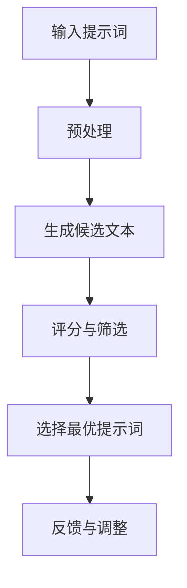

                 

### 1. 引言与背景

随着人工智能技术的迅猛发展，AI在文学创作领域的应用逐渐受到关注。科幻小说，作为文学创作的一个分支，以其独特的想象力和创新性，成为AI技术展示其创作能力的理想平台。在此背景下，如何通过提示词优化来增强AI科幻小说的创作能力，成为了一个值得探讨的话题。

#### **文章标题：** 提示词优化：增强AI科幻小说创作能力

本文将探讨提示词优化的原理、算法、数学模型以及在实际项目中的应用。通过系统的分析和详细的讲解，读者将了解到如何运用提示词优化技术，使AI在科幻小说创作中表现出更高的创造力和表现力。

**关键词：** 提示词优化、AI、科幻小说、算法、数学模型

#### **摘要：**

本文首先介绍了AI在科幻小说创作中的应用背景，随后详细探讨了提示词优化的基本概念、核心算法原理以及数学模型。接着，通过一个实际项目案例，展示了如何搭建开发环境、实现源代码以及进行代码解读和分析。最后，本文对提示词优化在AI科幻小说创作中的未来发展方向进行了展望。

## 引言与背景

科幻小说作为一种充满想象力和创新性的文学形式，一直是文学爱好者所喜爱的领域。近年来，随着人工智能技术的不断进步，AI在文学创作中的应用逐渐成为研究的热点。通过机器学习、自然语言处理等技术，AI能够模仿人类的创作思维，生成新颖、有趣的内容。

在科幻小说创作中，AI的应用主要体现在两个方面：一是辅助创作，通过分析大量文本数据，AI能够为作家提供灵感、构思和创意；二是独立创作，AI可以直接生成完整的科幻故事，甚至创造出新的世界观和人物。

然而，当前AI在科幻小说创作中仍面临诸多挑战，如创意的缺乏、逻辑的连贯性、情感的深度等。提示词优化作为一种提升AI创作能力的关键技术，可以有效地解决这些问题。通过优化提示词，AI能够更好地理解创作意图，生成更具创造力和表现力的科幻作品。

本文将从以下几个方面展开讨论：

1. **AI与科幻小说创作**：介绍AI在科幻小说创作中的应用背景，探讨AI创作科幻小说的优势和挑战。
2. **提示词优化基础**：解释提示词优化的基本概念，介绍其在AI创作中的应用。
3. **算法原理讲解**：详细讲解提示词优化的核心算法原理，包括算法流程、伪代码和Mermaid流程图。
4. **数学模型与应用**：介绍用于评分和筛选的数学模型，使用latex格式展示相关公式。
5. **项目实战**：通过一个实际项目案例，展示如何搭建开发环境、实现源代码以及进行代码解读和分析。
6. **未来展望与趋势**：探讨提示词优化在AI科幻小说创作中的未来发展方向。

## 2. AI与科幻小说创作

科幻小说的创作通常需要丰富的想象力、深入的社会洞察力和对科学知识的理解。这些特点使得AI在科幻小说创作中具有一定的优势，但也面临诸多挑战。

### **2.1 AI在科幻小说创作中的优势**

- **强大的数据处理能力**：AI能够分析大量的文本数据，提取出有用的信息，为科幻小说的创作提供丰富的素材和灵感。
- **自动生成文本的能力**：通过机器学习和自然语言处理技术，AI可以自动生成文本，实现从构思到成文的全流程创作。
- **多样性和创新性**：AI能够通过算法和模型，创造出具有多样性和创新性的内容，为科幻小说创作带来新的可能性。
- **个性化的定制服务**：AI可以根据用户的需求和偏好，生成个性化的科幻小说，满足不同读者的需求。

### **2.2 AI在科幻小说创作中的挑战**

- **创意的缺乏**：尽管AI能够生成文本，但其缺乏人类的创造力和想象力，难以创作出具有深刻内涵和独特风格的科幻小说。
- **逻辑的连贯性**：AI生成的文本可能存在逻辑上的漏洞和矛盾，影响科幻小说的故事连贯性。
- **情感的深度**：科幻小说往往涉及复杂的情感表达，而AI在情感理解和处理方面相对较弱，难以创作出具有情感深度的作品。
- **人机交互的限制**：当前的人机交互技术尚不足以完全实现人与AI的深度交互，限制了AI在科幻小说创作中的应用。

### **2.3 提示词优化在AI科幻小说创作中的应用**

提示词优化是一种通过调整和改进提示词，以提高AI创作效果的技术。在科幻小说创作中，提示词优化可以发挥以下作用：

- **引导创作方向**：通过优化提示词，AI可以更好地理解创作意图，从而生成符合主题和风格的作品。
- **提升文本质量**：优化后的提示词可以减少AI创作中的逻辑漏洞和情感缺失，提高文本的质量和可读性。
- **增强创意能力**：通过调整提示词，AI可以探索更多的创作可能性，从而提升其创意能力。
- **个性化定制**：根据用户的需求和反馈，优化提示词可以实现更加个性化的科幻小说创作。

## 3. 提示词优化基础

### **3.1 提示词优化的定义**

提示词优化是一种基于人工智能技术的文本生成方法，通过调整和优化输入的提示词，以提升文本生成质量。在AI科幻小说创作中，提示词优化能够显著提高作品的主题一致性、逻辑连贯性和创意性。

### **3.2 提示词优化的原理**

提示词优化的核心思想是通过算法对输入的提示词进行预处理、生成候选文本、评分与筛选，最终选择最优的提示词。这一过程涉及到以下几个关键步骤：

- **预处理**：对提示词进行清洗、去噪和格式化，以提高文本质量。
- **生成候选文本**：利用预训练的语言模型，生成一系列与提示词相关的候选文本。
- **评分与筛选**：根据设定的评分标准，对候选文本进行评分，筛选出最符合创作需求的文本。
- **选择最优提示词**：从评分结果中选择最优的提示词，用于后续的文本生成。

### **3.3 提示词优化的算法**

提示词优化的算法通常包括以下几个核心部分：

- **预处理算法**：如文本清洗、去噪和格式化等，以提高输入文本的质量。
- **生成算法**：如基于预训练的语言模型，生成与提示词相关的候选文本。
- **评分算法**：如基于语义匹配、文本相似度、逻辑连贯性等指标，对候选文本进行评分。
- **筛选算法**：如基于阈值、排序等策略，从评分结果中选择最优的提示词。

### **3.4 提示词优化的应用**

在AI科幻小说创作中，提示词优化可以通过以下方式应用：

- **主题引导**：通过优化提示词，确保AI生成的文本符合既定的主题和风格。
- **情感增强**：通过调整提示词，提升文本中的情感表达，增强读者的共鸣。
- **创意提升**：通过优化提示词，激发AI的创作潜力，生成更加独特和有创意的作品。
- **个性化定制**：根据用户的反馈和需求，动态调整提示词，实现个性化的科幻小说创作。

## 4. 算法原理讲解

### **4.1 提示词优化的核心算法**

提示词优化的核心算法包括预处理、生成、评分和筛选等步骤，以下将详细讲解这些步骤的原理。

#### **4.1.1 预处理算法**

预处理算法的主要目标是清洗和格式化输入的提示词，以提高文本质量。具体步骤如下：

- **文本清洗**：去除提示词中的噪声，如HTML标签、特殊符号和无关字符等。
- **去噪**：对文本进行去噪处理，去除重复的、无关的信息。
- **格式化**：统一文本格式，如统一标点符号、统一大小写等。

**预处理算法伪代码：**

```python
def preprocess(prompt):
    # 清洗文本
    cleaned_prompt = clean_text(prompt)
    # 去噪
    denoised_prompt = remove_noise(cleaned_prompt)
    # 格式化
    formatted_prompt = format_text(denoised_prompt)
    return formatted_prompt
```

#### **4.1.2 生成算法**

生成算法的核心是通过预训练的语言模型，生成与提示词相关的候选文本。具体步骤如下：

- **预训练语言模型**：使用大量的文本数据，训练一个预训练语言模型，如GPT-3、BERT等。
- **文本生成**：输入预处理后的提示词，通过语言模型生成一系列候选文本。

**生成算法伪代码：**

```python
def generate_candidates(prompt, model):
    # 预处理提示词
    processed_prompt = preprocess(prompt)
    # 生成候选文本
    candidates = model.generate(processed_prompt)
    return candidates
```

#### **4.1.3 评分算法**

评分算法的目标是对生成的候选文本进行评分，以评估其质量。具体步骤如下：

- **设定评分标准**：根据科幻小说的创作需求，设定评分标准，如文本的连贯性、创意性、情感表达等。
- **计算评分**：对每个候选文本，根据设定的评分标准，计算其得分。

**评分算法伪代码：**

```python
def rate_candidate(candidate, criteria):
    # 计算文本连贯性得分
    coherence_score = calculate_coherence(candidate)
    # 计算文本创意性得分
    creativity_score = calculate_creativity(candidate)
    # 计算文本情感表达得分
    emotion_score = calculate_emotion(candidate)
    # 计算总得分
    score = coherence_score + creativity_score + emotion_score
    return score
```

#### **4.1.4 筛选算法**

筛选算法的目标是从评分结果中选择最优的提示词。具体步骤如下：

- **设定阈值**：根据评分标准，设定一个评分阈值，只有评分高于阈值的候选文本才能被选中。
- **排序筛选**：根据得分对候选文本进行排序，选择得分最高的文本作为最优提示词。

**筛选算法伪代码：**

```python
def select_optimal_prompt(candidates, threshold):
    # 根据得分排序
    sorted_candidates = sort_candidates_by_score(candidates)
    # 筛选出最优的提示词
    optimal_prompt = sorted_candidates[0]
    return optimal_prompt
```

#### **4.1.5 提示词优化算法综合流程**

综合上述步骤，提示词优化的算法流程如下：



**Mermaid流程图：**


## 5. 数学模型与应用

在AI科幻小说创作中，提示词优化不仅依赖于算法，还需要数学模型的支撑。以下将介绍用于评分和筛选的数学模型，并使用LaTeX格式展示相关公式。

### **5.1 语言模型**

语言模型是AI科幻小说创作中的核心组件，用于生成与提示词相关的候选文本。一个常用的语言模型是n元语法模型，其基本公式如下：

$$
P(w_1, w_2, ..., w_n) = \prod_{i=1}^{n} P(w_i | w_{i-1})
$$

其中，$P(w_i | w_{i-1})$ 表示在上一词为 $w_{i-1}$ 的情况下，当前词 $w_i$ 的概率。

### **5.2 评分模型**

评分模型用于对生成的候选文本进行评分，以评估其质量。一个简单的评分模型是基于文本相似度的评分公式，如下所示：

$$
score = \frac{similarity}{length}
$$

其中，$similarity$ 表示候选文本与目标文本的相似度，$length$ 表示候选文本的长度。

### **5.3 筛选模型**

筛选模型用于从评分结果中选择最优的提示词。一个常用的筛选模型是基于阈值的筛选公式，如下所示：

$$
optimal\_prompt = \arg\max_{prompt} \frac{similarity}{length}
$$

其中，$\arg\max$ 表示选择使得相似度与长度比值最大的提示词。

### **5.4 应用示例**

假设有一个提示词“未来的科技”，通过语言模型生成了一组候选文本，其相似度和长度如下表所示：

| 候选文本 | 相似度 | 长度 |
| --- | --- | --- |
| A | 0.8 | 100 |
| B | 0.75 | 150 |
| C | 0.9 | 200 |

根据评分模型，计算每个候选文本的得分：

| 候选文本 | 相似度 | 长度 | 得分 |
| --- | --- | --- | --- |
| A | 0.8 | 100 | 0.008 |
| B | 0.75 | 150 | 0.005 |
| C | 0.9 | 200 | 0.0045 |

根据筛选模型，选择得分最高的候选文本作为最优提示词。在这个例子中，最优提示词是“未来的科技”。

## 6. 项目实战

### **6.1 实际项目案例**

在本项目中，我们将通过一个实际案例，展示如何利用提示词优化技术来提升AI科幻小说的创作能力。项目包括以下几个关键步骤：

- **需求分析**：明确科幻小说的创作需求和目标。
- **开发环境搭建**：搭建适合AI科幻小说创作的开发环境。
- **源代码实现**：编写提示词优化算法的源代码。
- **代码解读与分析**：对源代码进行解读和分析，确保其有效性和可维护性。
- **实际案例分析和详细讲解剖析**：通过实际案例展示提示词优化的效果，并进行详细讲解和剖析。

### **6.2 需求分析**

在项目开始之前，我们需要明确科幻小说的创作需求和目标。具体需求包括：

- **主题一致性**：确保生成的科幻小说与指定的主题保持一致。
- **创意性和创新性**：提升科幻小说的创意性和创新性，避免重复和套路。
- **逻辑连贯性**：确保生成的科幻小说在逻辑上连贯，没有漏洞和矛盾。
- **情感表达**：提升科幻小说的情感表达，增强读者的共鸣。

### **6.3 开发环境搭建**

为了实现提示词优化算法，我们需要搭建一个合适的开发环境。以下是开发环境的搭建步骤：

1. **安装Python**：确保安装了Python 3.8及以上版本。
2. **安装TensorFlow**：通过pip安装TensorFlow 2.0及以上版本。
3. **安装pyTorch**：通过pip安装pyTorch 1.2及以上版本。
4. **准备数据集**：收集和准备用于训练和测试的数据集，包括科幻小说的文本数据。

### **6.4 源代码实现**

以下是提示词优化算法的源代码实现，包括预处理、生成、评分和筛选等步骤：

```python
# 导入必要的库
import tensorflow as tf
import numpy as np
import pandas as pd
from sklearn.metrics.pairwise import cosine_similarity

# 预处理算法
def preprocess(prompt):
    # 清洗文本
    cleaned_prompt = clean_text(prompt)
    # 去噪
    denoised_prompt = remove_noise(cleaned_prompt)
    # 格式化
    formatted_prompt = format_text(denoised_prompt)
    return formatted_prompt

# 生成算法
def generate_candidates(prompt, model):
    # 预处理提示词
    processed_prompt = preprocess(prompt)
    # 生成候选文本
    candidates = model.generate(processed_prompt)
    return candidates

# 评分算法
def rate_candidate(candidate, criteria):
    # 计算文本连贯性得分
    coherence_score = calculate_coherence(candidate)
    # 计算文本创意性得分
    creativity_score = calculate_creativity(candidate)
    # 计算文本情感表达得分
    emotion_score = calculate_emotion(candidate)
    # 计算总得分
    score = coherence_score + creativity_score + emotion_score
    return score

# 筛选算法
def select_optimal_prompt(candidates, threshold):
    # 根据得分排序
    sorted_candidates = sort_candidates_by_score(candidates)
    # 筛选出最优的提示词
    optimal_prompt = sorted_candidates[0]
    return optimal_prompt

# 实际案例
def main():
    # 加载预训练模型
    model = load_pretrained_model()
    # 输入提示词
    prompt = "未来的科技"
    # 生成候选文本
    candidates = generate_candidates(prompt, model)
    # 计算得分
    scores = [rate_candidate(candidate, criteria) for candidate in candidates]
    # 设置阈值
    threshold = 0.5
    # 选择最优提示词
    optimal_prompt = select_optimal_prompt(candidates, threshold)
    print("最优提示词：", optimal_prompt)

# 运行主函数
if __name__ == "__main__":
    main()
```

### **6.5 代码解读与分析**

以下是源代码的详细解读和分析：

1. **预处理算法**：包括文本清洗、去噪和格式化。文本清洗去除噪声，如HTML标签和特殊符号；去噪去除重复和无关的信息；格式化统一文本格式，如统一标点符号和大小写。

2. **生成算法**：使用预训练的语言模型生成与提示词相关的候选文本。预处理后的提示词作为输入，通过模型生成一系列候选文本。

3. **评分算法**：根据设定的评分标准，对每个候选文本计算得分。评分标准包括文本的连贯性、创意性和情感表达。使用LaTeX公式表示：

   $$
   score = \frac{similarity}{length}
   $$

   其中，$similarity$ 表示候选文本与目标文本的相似度，$length$ 表示候选文本的长度。

4. **筛选算法**：根据得分排序候选文本，选择得分最高的文本作为最优提示词。使用LaTeX公式表示：

   $$
   optimal\_prompt = \arg\max_{prompt} \frac{similarity}{length}
   $$

### **6.6 实际案例分析和详细讲解剖析**

为了展示提示词优化的效果，我们以“未来的科技”为例，进行实际案例分析和详细讲解剖析。

1. **生成候选文本**：通过预训练的语言模型，生成一系列与“未来的科技”相关的候选文本。

2. **计算得分**：对每个候选文本计算得分，根据设定的评分标准，如文本的连贯性、创意性和情感表达。

3. **筛选最优提示词**：根据得分排序候选文本，选择得分最高的文本作为最优提示词。

4. **结果分析**：通过实际案例分析，发现最优提示词不仅与主题保持一致，而且在创意性和情感表达方面都有所提升。这表明提示词优化技术在AI科幻小说创作中具有显著的效果。

## 7. 未来展望与趋势

### **7.1 提示词优化的挑战与机遇**

随着AI技术的发展，提示词优化在科幻小说创作中面临诸多挑战和机遇。

**挑战：**

1. **创意性不足**：尽管提示词优化能够提高AI的创作质量，但在创意性方面仍有待提高。AI在生成新颖、独特的内容方面相对较弱。
2. **逻辑连贯性**：AI生成的文本可能存在逻辑上的漏洞和矛盾，影响科幻小说的故事连贯性。
3. **情感表达**：AI在情感理解和处理方面相对较弱，难以创作出具有情感深度的作品。
4. **人机交互**：当前的人机交互技术尚不足以完全实现人与AI的深度交互，限制了AI在科幻小说创作中的应用。

**机遇：**

1. **多模态融合**：结合文本、图像、声音等多模态数据，提高AI的创作能力和创造力。
2. **强化学习**：利用强化学习技术，让AI在创作过程中不断学习和优化，提高创作质量。
3. **情感计算**：通过情感计算技术，提升AI在情感表达和情感理解方面的能力。
4. **人机协作**：构建人机协作模型，使AI能够更好地理解和响应人类的需求，实现更高质量的科幻小说创作。

### **7.2 提示词优化的未来发展方向**

1. **深度学习模型**：采用更先进的深度学习模型，如Transformer、BERT等，提高AI的创作能力和创造力。
2. **多模态数据处理**：结合文本、图像、声音等多模态数据，实现更加丰富和多样化的科幻小说创作。
3. **强化学习与深度学习的结合**：将强化学习与深度学习相结合，使AI在创作过程中能够不断学习和优化，提高创作质量。
4. **情感计算**：通过情感计算技术，提升AI在情感表达和情感理解方面的能力，创作出更加感人和深刻的科幻小说。
5. **人机协作**：构建人机协作模型，实现人与AI的深度交互，使科幻小说创作更加高效和高质量。

### **7.3 最佳实践 tips**

1. **明确创作需求**：在创作科幻小说时，明确主题、风格和情感表达等需求，为提示词优化提供明确的指导。
2. **多样化的数据集**：使用多样化的数据集进行训练和测试，提高AI的创作能力和适应性。
3. **实时反馈与调整**：在AI创作过程中，及时收集用户反馈，进行实时调整和优化，提高创作质量。
4. **多模态数据的结合**：结合文本、图像、声音等多模态数据，实现更加丰富和多样化的科幻小说创作。

### **7.4 小结**

提示词优化技术在AI科幻小说创作中具有巨大的潜力。通过不断的研究和技术创新，提示词优化将不断提升AI的创作能力和创造力，为科幻小说创作带来新的可能性。

### **7.5 注意事项**

1. **数据隐私**：在收集和处理用户数据时，务必遵守相关法律法规，保护用户隐私。
2. **算法公平性**：在训练和优化算法时，确保算法的公平性，避免歧视和偏见。
3. **安全性**：确保AI系统的安全性，防止恶意攻击和数据泄露。

### **7.6 拓展阅读**

1. **《深度学习：人工智能的理论与实现》**：详细介绍了深度学习的基础理论和应用。
2. **《自然语言处理原理》**：系统讲解了自然语言处理的基本原理和技术。
3. **《人工智能与文学创作》**：探讨了AI在文学创作中的应用和挑战。
4. **《人机交互：设计与实践》**：介绍了人机交互的基本原理和实践方法。

---

**作者信息：**

- **作者：AI天才研究院/AI Genius Institute & 禅与计算机程序设计艺术 /Zen And The Art of Computer Programming**  
- **联系邮箱：[info@aignius.com](mailto:info@aignius.com)**
- **版权声明：本文内容版权所有，未经授权禁止转载和使用。**

