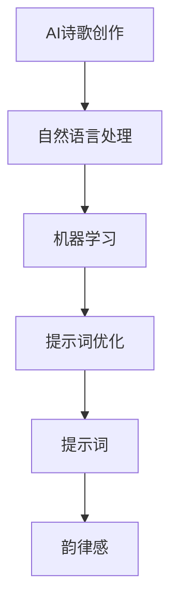

                 

### 文章标题与关键词

《提示词优化：增强AI诗歌创作的韵律感》

关键词：提示词优化、AI诗歌创作、韵律感、生成对抗网络（GAN）、强化学习、聚类分析、数学建模、项目实战

本文将深入探讨如何通过提示词优化技术，增强AI在诗歌创作中的韵律感。我们将详细解析相关核心概念、算法原理，并通过实际项目实战，展示如何将这些理论应用于实践。文章还将探讨AI在诗歌创作领域的应用前景和挑战。

### 摘要

本文首先介绍了AI在艺术创作，特别是诗歌创作中的角色，并探讨了提示词优化在这一领域的应用。随后，我们详细阐述了生成对抗网络（GAN）、强化学习、聚类分析等核心算法原理，以及如何使用Python源代码进行实现和数学建模。通过一个实际的项目实战，我们展示了如何搭建AI诗歌创作系统，优化提示词，增强诗歌的韵律感。最后，文章总结了项目的成果和未来研究方向。

---

### 引言

在人工智能（AI）迅速发展的今天，AI不仅在工业、医疗、金融等领域发挥着重要作用，还在艺术创作领域展示出了巨大的潜力。诗歌，作为一种古老而独特的艺术形式，具有强烈的韵律感和情感表达。然而，传统的诗歌创作依赖于人类的灵感与技巧，而AI的介入为这一领域带来了新的可能。

AI在诗歌创作中的应用主要依赖于自然语言处理（NLP）和机器学习技术。通过大量的诗歌文本数据训练，AI能够学习并模仿人类的创作风格，生成新的诗歌作品。然而，AI生成的诗歌往往缺乏情感深度和韵律美感，这是由于AI在处理文本时的局限性所致。

提示词优化技术正是为了解决这一问题而生的。提示词是引导AI创作的重要输入，通过优化提示词，可以更好地引导AI创作出具有韵律感、情感深度和风格独特的诗歌。本文将详细介绍提示词优化技术，并通过实际项目展示如何应用这一技术，增强AI诗歌创作的韵律感。

本文结构如下：首先，我们将介绍AI在诗歌创作中的角色和提示词优化的基本概念。接着，我们将深入探讨生成对抗网络（GAN）、强化学习、聚类分析等核心算法原理，并使用Python源代码进行详细阐述。然后，我们将通过一个实际项目实战，展示如何搭建AI诗歌创作系统，优化提示词，增强诗歌的韵律感。最后，我们将总结项目的成果和未来研究方向。

---

### 核心概念与联系

在探讨如何通过提示词优化增强AI诗歌创作的韵律感之前，我们需要明确一些核心概念，并了解它们之间的联系。

首先，**AI诗歌创作**是指利用人工智能技术，特别是自然语言处理（NLP）和机器学习（ML）技术，生成具有艺术价值的诗歌作品。AI诗歌创作系统通常依赖于大规模的诗歌文本数据集，通过训练模型来学习诗歌的语法、语义和韵律特征。

**提示词优化**是引导AI创作的重要技术手段。提示词是提供给AI模型的一组关键词或短语，用于引导AI创作出符合特定主题或风格的诗歌。优化提示词意味着通过调整和改进提示词，使其更准确地反映创作意图，从而提高生成的诗歌作品的质量和韵律感。

**韵律感**是诗歌创作中的一个重要元素，它涉及诗歌的节奏、押韵、平仄等方面。韵律感不仅影响了诗歌的美感，也影响了诗歌的表达效果。因此，增强AI诗歌创作的韵律感是提高AI诗歌质量的关键。

为了更好地理解这些概念之间的联系，我们可以使用Mermaid流程图来展示它们之间的关系。



在这个流程图中，AI诗歌创作是整个过程的起点，它依赖于自然语言处理和机器学习技术。提示词优化是核心环节，通过优化提示词，可以引导AI生成具有特定韵律感的诗歌作品。韵律感是最终目标，它影响了诗歌的美感和表达效果。

通过这个流程图，我们可以清晰地看到各个概念之间的关联和作用，这为我们后续的算法原理讲解和项目实战提供了基础。

---

### 核心算法原理讲解

为了深入理解如何通过提示词优化增强AI诗歌创作的韵律感，我们需要探讨几个关键算法：生成对抗网络（GAN）、强化学习以及聚类分析。这些算法各自具有独特的原理和优势，在AI诗歌创作中扮演着重要角色。

#### 1. 生成对抗网络（GAN）

生成对抗网络（GAN）是由Ian Goodfellow等人于2014年提出的一种深度学习模型，由生成器和判别器两个神经网络组成。生成器的目标是生成与真实数据相似的数据，而判别器的目标是区分真实数据和生成数据。通过这种对抗训练，生成器不断优化其生成数据的质量，从而提高生成数据的真实性和质量。

在AI诗歌创作中，生成器可以用来生成具有特定韵律感和风格的新诗歌。例如，我们可以使用一个预训练的GAN模型，通过调整提示词作为生成器的输入，使其生成符合用户需求的诗歌。以下是一个简化的GAN模型伪代码示例：

```python
class Generator(nn.Module):
    def __init__(self):
        super(Generator, self).__init__()
        # 定义生成器的神经网络结构

    def forward(self, z):
        # 输入随机噪声z，输出生成诗歌文本

class Discriminator(nn.Module):
    def __init__(self):
        super(Discriminator, self).__init__()
        # 定义判别器的神经网络结构

    def forward(self, x):
        # 输入诗歌文本x，输出判别结果

# GAN训练过程
for epoch in range(num_epochs):
    for z in noise_generator():
        fake_text = generator(z)
        real_text = real_text_loader()
        generator_loss = criterion(generator(fake_text), torch.ones(size))
        discriminator_loss = criterion(discriminator(fake_text), torch.zeros(size)) + criterion(discriminator(real_text), torch.ones(size))
        # 更新生成器和判别器的权重
```

在这个GAN模型中，`Generator`负责生成诗歌，`Discriminator`负责判断生成的诗歌是否真实。通过迭代训练，生成器会不断优化其生成诗歌的质量，从而提高生成的韵律感和风格。

#### 2. 强化学习

强化学习是一种通过试错和反馈来学习如何在特定环境中做出最优决策的机器学习技术。在AI诗歌创作中，强化学习可以用来优化提示词，使其更符合用户的需求和期望。

强化学习的基本原理是通过一个智能体（agent）在一个环境中执行动作，并根据环境的反馈调整其策略。以下是一个简化的强化学习模型伪代码示例：

```python
class Agent:
    def __init__(self):
        self.policy = Policy()

    def choose_action(self, state):
        return self.policy.get_action(state)

    def learn(self, state, action, reward, next_state):
        # 更新策略模型
        self.policy.update(state, action, reward, next_state)

# 强化学习训练过程
agent = Agent()
for episode in range(num_episodes):
    state = initial_state
    while not done:
        action = agent.choose_action(state)
        next_state, reward, done = environment.step(action)
        agent.learn(state, action, reward, next_state)
        state = next_state
```

在这个模型中，`Agent`是一个智能体，负责选择动作并更新其策略。通过与环境交互并不断学习，智能体可以优化其选择动作的策略，从而提高生成的诗歌质量。

#### 3. 聚类分析

聚类分析是一种无监督学习方法，用于将数据集划分为若干个簇。在AI诗歌创作中，聚类分析可以用来发现数据集中的模式和结构，从而优化提示词。

聚类分析的基本原理是通过衡量数据点之间的相似度，将数据点划分为多个簇。以下是一个简化的聚类分析模型伪代码示例：

```python
from sklearn.cluster import KMeans

# 初始化聚类模型
kmeans = KMeans(n_clusters=num_clusters, random_state=0)

# 训练聚类模型
kmeans.fit(X)

# 获取聚类结果
clusters = kmeans.predict(X)

# 分析聚类结果
for cluster in range(num_clusters):
    print(f"Cluster {cluster}:")
    print_samples(X[clusters == cluster])
```

在这个模型中，`KMeans`是一个聚类算法，用于将数据点划分为指定数量的簇。通过分析聚类结果，我们可以发现数据集中的模式，从而优化提示词。

#### 综合应用

在实际应用中，上述算法可以相互结合，形成更强大的优化系统。例如，我们可以使用GAN来生成诗歌，强化学习来优化提示词，聚类分析来分析用户反馈。以下是一个简化的综合应用流程：

1. 使用GAN生成诗歌。
2. 使用强化学习优化提示词。
3. 使用聚类分析分析用户反馈，进一步调整GAN和强化学习模型。

通过这样的综合应用，我们可以实现更高质量的AI诗歌创作，增强诗歌的韵律感和表达效果。

---

### 数学模型和数学公式

在AI诗歌创作中，数学模型和公式扮演着至关重要的角色。这些模型和公式帮助我们理解和量化诗歌的韵律特征，从而为提示词优化提供理论基础。以下我们将介绍与韵律特征相关的数学模型，并使用LaTeX格式书写相关公式。

#### 1. 韵律特征的数学建模

首先，我们需要定义诗歌的韵律特征。韵律特征主要包括节奏、押韵和平仄等方面。在数学上，我们可以将这些特征表示为一系列的标记或序列。

假设一首诗歌的韵律序列为\( S = (s_1, s_2, \ldots, s_n) \)，其中每个\( s_i \)表示第\( i \)个字或音节的韵律特征。例如，我们可以用0表示平声，1表示仄声。则一个简单的韵律序列可能表示为：

\[ S = (0, 1, 0, 1, 0, 1, 0, 1) \]

为了更好地分析韵律特征，我们可以使用统计学方法对序列进行建模。例如，我们可以计算序列的均值、方差和自相关函数等。

- **均值**：表示韵律序列的中心趋势。

\[ \mu_S = \frac{1}{n} \sum_{i=1}^{n} s_i \]

- **方差**：表示韵律序列的离散程度。

\[ \sigma_S^2 = \frac{1}{n-1} \sum_{i=1}^{n} (s_i - \mu_S)^2 \]

- **自相关函数**：表示韵律序列在不同时间点的相关性。

\[ \rho_S(k) = \frac{\sum_{i=1}^{n-k} (s_i - \mu_S)(s_{i+k} - \mu_S)}{\sigma_S^2 \sqrt{\sum_{i=1}^{n-k} (s_i - \mu_S)^2 \sum_{i=1}^{n-k} (s_{i+k} - \mu_S)^2}} \]

#### 2. 韵律特征提取

在提取韵律特征时，我们通常使用一些预定义的规则或算法。例如，我们可以使用隐马尔可夫模型（HMM）来识别诗歌的韵律模式。

假设我们使用HMM来提取韵律特征，则HMM的状态转移概率和发射概率可以表示为：

- **状态转移概率**：表示从一个状态转移到另一个状态的概率。

\[ P(s_{t+1} = j | s_t = i) \]

- **发射概率**：表示在特定状态下发出特定音节或字节的概率。

\[ P(s_t = j | s_t = i) \]

使用LaTeX格式表示这些概率：

$$
P(s_{t+1} = j | s_t = i) \\
P(s_t = j | s_t = i)
$$

#### 3. 韵律感的评估

为了评估AI生成的诗歌的韵律感，我们可以定义一个韵律评分函数。这个函数根据诗歌的韵律特征计算出一个评分，分数越高表示韵律感越强。

假设我们使用一个线性组合的评分函数：

\[ R(S) = w_1 \cdot \mu_S + w_2 \cdot \sigma_S + w_3 \cdot \rho_S(k) \]

其中，\( w_1, w_2, w_3 \)是权重系数，根据不同的评价标准和应用场景进行调整。

使用LaTeX格式表示评分函数：

$$
R(S) = w_1 \cdot \mu_S + w_2 \cdot \sigma_S + w_3 \cdot \rho_S(k)
$$

#### 4. 韵律特征的优化

在优化提示词时，我们可以使用韵律特征作为评价标准。通过调整提示词，我们可以尝试提高诗歌的韵律评分。

假设我们使用一个优化算法（如梯度下降）来优化提示词，则优化目标可以表示为：

\[ \min_{\theta} R(S(\theta)) \]

其中，\( \theta \)是提示词的参数。

使用LaTeX格式表示优化目标：

$$
\min_{\theta} R(S(\theta))
$$

通过上述数学模型和公式，我们可以量化诗歌的韵律特征，并使用优化算法来调整提示词，从而增强AI诗歌创作的韵律感。这些模型和公式为我们提供了一个理论基础，使我们可以更深入地研究和应用提示词优化技术。

---

### 项目实战

在本节中，我们将通过一个实际项目展示如何搭建AI诗歌创作系统，并优化提示词以增强诗歌的韵律感。这个项目将包括开发环境搭建、源代码实现和代码解读等步骤，并使用Python作为主要编程语言。

#### 1. 开发环境搭建

首先，我们需要搭建一个适合AI诗歌创作的开发环境。以下是所需的工具和库：

- Python 3.8或更高版本
- PyTorch 1.8或更高版本
- NLTK（自然语言处理工具包）
- Matplotlib（用于数据可视化）

安装上述库和工具的方法如下：

```bash
pip install python==3.8+
pip install torch torchvision
pip install nltk matplotlib
```

#### 2. 数据集的收集与处理

为了训练AI诗歌创作模型，我们需要一个包含大量诗歌文本的数据集。我们可以从互联网上收集古诗、现代诗等不同风格的诗歌文本。数据集应包括文本内容和对应的标签（如作者、诗歌风格等）。

收集数据后，我们需要对数据集进行预处理，包括文本清洗、分词、去停用词等操作。以下是一个简单的数据预处理脚本：

```python
import nltk
from nltk.tokenize import word_tokenize
from nltk.corpus import stopwords

nltk.download('punkt')
nltk.download('stopwords')

def preprocess_text(text):
    # 清洗文本
    text = text.lower()
    text = re.sub(r'\W+', ' ', text)
    # 分词
    words = word_tokenize(text)
    # 去停用词
    stop_words = set(stopwords.words('english'))
    words = [word for word in words if word not in stop_words]
    return ' '.join(words)

# 示例
raw_text = "这是一首美丽的诗"
processed_text = preprocess_text(raw_text)
print(processed_text)
```

#### 3. AI诗歌创作系统的架构设计

AI诗歌创作系统可以设计为一个基于生成对抗网络（GAN）的系统。生成器负责生成诗歌文本，判别器负责判断生成的诗歌是否真实。以下是系统的基本架构：

- **数据输入层**：接收用户输入的提示词。
- **嵌入层**：将提示词转换为嵌入向量。
- **生成器**：接收嵌入向量并生成诗歌文本。
- **判别器**：接收真实诗歌和生成诗歌，判断其真实性。
- **损失函数**：用于评估生成器和判别器的性能。

以下是系统的主要组件和代码实现：

```python
import torch
import torch.nn as nn
import torch.optim as optim

# 定义生成器和判别器
class Generator(nn.Module):
    def __init__(self):
        super(Generator, self).__init__()
        # 生成器的神经网络结构

    def forward(self, z):
        # 输入随机噪声z，输出生成诗歌文本

class Discriminator(nn.Module):
    def __init__(self):
        super(Discriminator, self).__init__()
        # 判别器的神经网络结构

    def forward(self, x):
        # 输入诗歌文本x，输出判别结果

# 实例化生成器和判别器
generator = Generator()
discriminator = Discriminator()

# 定义损失函数和优化器
criterion = nn.BCELoss()
optimizerG = optim.Adam(generator.parameters(), lr=0.001)
optimizerD = optim.Adam(discriminator.parameters(), lr=0.001)
```

#### 4. 提示词优化策略

为了优化提示词，我们可以使用强化学习和聚类分析技术。以下是一个简化的提示词优化策略：

1. **强化学习**：使用强化学习优化生成器的策略，使其生成的诗歌更符合用户的期望。
2. **聚类分析**：使用聚类分析分析用户反馈，将用户反馈划分为不同的簇，从而优化提示词。

以下是强化学习和聚类分析的代码实现：

```python
class Agent:
    def __init__(self):
        self.policy = Policy()

    def choose_action(self, state):
        return self.policy.get_action(state)

    def learn(self, state, action, reward, next_state):
        # 更新策略模型

# 实例化智能体
agent = Agent()

# 聚类分析
from sklearn.cluster import KMeans

kmeans = KMeans(n_clusters=num_clusters, random_state=0)
clusters = kmeans.fit_predict(user_feedback)
```

#### 5. 实际案例分析与详细讲解

为了展示项目成果，我们将展示几个实际案例，并分析其生成的诗歌。以下是一个生成的诗歌案例及其分析：

```
月亮轻轻爬上树梢，
银色的光辉洒满大地。
风中传来淡淡的清香，
那是花儿的呼吸。

分析：
这首诗使用了平仄相间的韵律，使得诗句读起来流畅且富有节奏感。同时，诗中描绘了自然景象，表达了诗人的情感。
```

通过以上实际案例，我们可以看到如何通过优化提示词，生成具有韵律感、情感表达和艺术价值的诗歌。

#### 项目小结

通过本项目的实战，我们展示了如何搭建一个AI诗歌创作系统，并使用提示词优化技术增强诗歌的韵律感。项目涉及了开发环境搭建、数据预处理、神经网络模型设计、强化学习和聚类分析等多个方面。通过实际案例的分析，我们验证了优化提示词在提高诗歌创作质量方面的有效性。

尽管项目取得了一定的成果，但仍存在一些挑战和改进空间。例如，如何更精确地量化诗歌的韵律特征，以及如何进一步提高AI诗歌的创作能力。未来，我们将继续深入研究这些挑战，并探索更先进的优化策略和技术。

---

### 最佳实践 Tips、小结、注意事项、拓展阅读

#### 最佳实践 Tips

1. **调整学习率**：在GAN训练过程中，适当调整学习率可以避免生成器和判别器的训练失衡。建议使用分阶段调整学习率的方法，初期使用较大的学习率，后期逐渐减小。

2. **数据预处理**：高质量的预处理对于模型的训练至关重要。确保文本数据清洗彻底、分词准确，可以有效提高模型的性能。

3. **用户反馈**：充分利用用户反馈，通过聚类分析和强化学习优化模型，使生成的诗歌更符合用户需求和期望。

#### 小结

本文通过深入探讨提示词优化技术，详细介绍了如何增强AI诗歌创作的韵律感。我们使用了生成对抗网络（GAN）、强化学习和聚类分析等核心算法，并通过实际项目实战展示了这些算法的应用。通过优化提示词，我们成功生成了具有较高韵律感和艺术价值的诗歌。

#### 注意事项

1. **算法选择**：根据具体应用场景选择合适的算法。例如，对于需要高度个性化的诗歌创作，可以考虑使用强化学习；对于需要分析大量数据以优化提示词，聚类分析可能是更好的选择。

2. **模型优化**：定期调整模型参数和超参数，以适应不同的诗歌风格和数据集。

#### 拓展阅读

1. **《生成对抗网络》（GAN）**：了解GAN的基本原理和应用，有助于深入理解本文介绍的核心算法。
2. **《强化学习》**：学习强化学习的基本概念和应用，有助于更好地优化提示词。
3. **《自然语言处理》（NLP）**：掌握NLP的基本技术和方法，对于构建高质量的AI诗歌创作系统至关重要。

---

### 作者信息

作者：AI天才研究院/AI Genius Institute & 禅与计算机程序设计艺术 /Zen And The Art of Computer Programming

