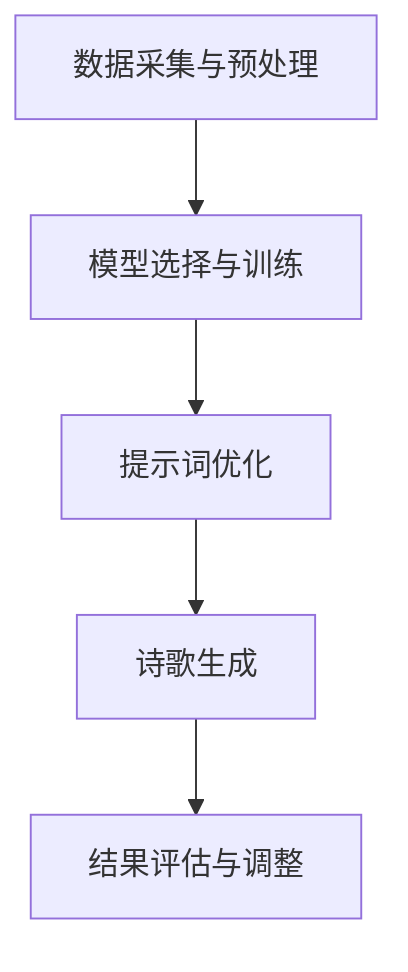
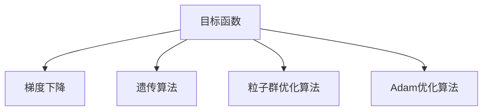
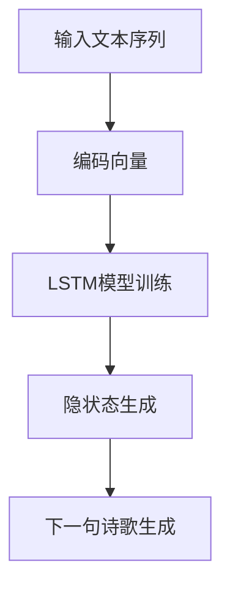
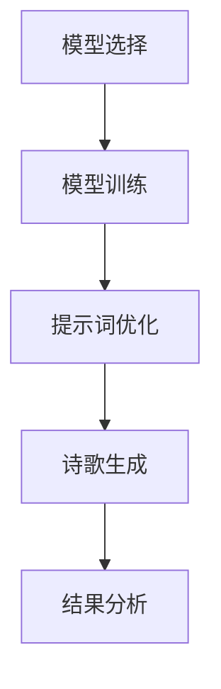
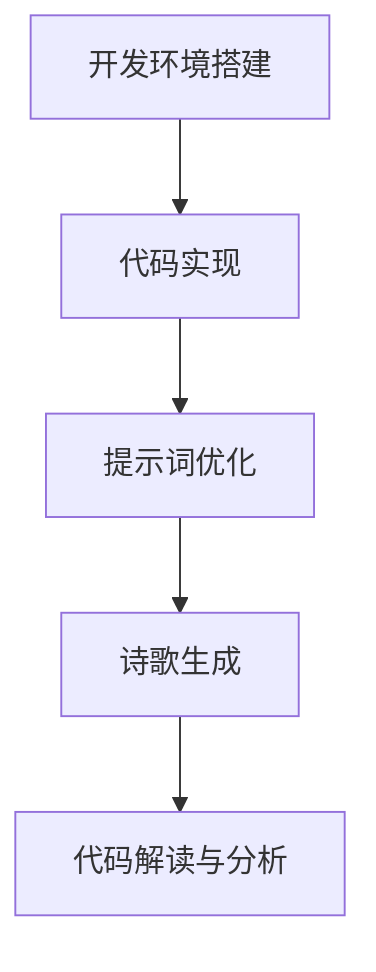
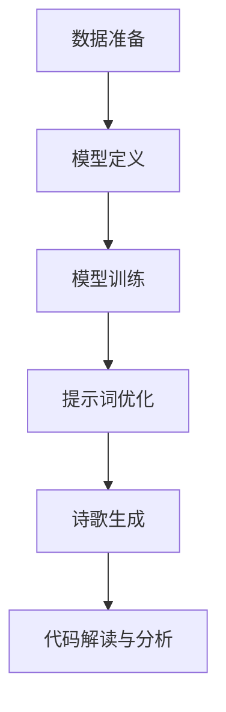

                 

### 引言

#### 书籍背景

《提示词优化：增强AI诗歌创作能力》是一本结合人工智能技术、诗歌创作和优化算法的综合性技术书籍。在当今数字化时代，人工智能（AI）作为一项颠覆性技术，正逐渐渗透到社会各个领域，包括文化、艺术和文学。AI诗歌创作作为一种新兴的艺术形式，不仅丰富了文学的创作手法，也为人工智能技术的应用提供了新的思路和方向。

#### 研究意义

本书籍的研究意义主要体现在以下几个方面：

1. **填补研究空白**：目前，虽然已有大量研究聚焦于AI在图像处理、自然语言处理等领域的应用，但关于AI在诗歌创作中的优化策略和算法研究仍较为稀缺。本书旨在填补这一空白，提供系统性的理论框架和实践指导。

2. **促进技术创新**：通过对提示词优化算法的深入研究，有助于提升AI诗歌创作的质量和效率，推动相关技术的进一步发展。

3. **拓宽应用领域**：AI诗歌创作作为一种新颖的艺术形式，不仅具有学术价值，也具有广泛的应用前景。例如，在教育领域，AI诗歌可以作为辅助教学工具；在文化产业，AI诗歌可以用于文学创作和艺术表现。

#### 内容概述

本书分为四个主要篇章，内容结构如下：

1. **核心概念篇**：介绍提示词、优化算法和AI诗歌创作的基础知识。
2. **算法篇**：详细解释提示词优化的算法原理，包括基于深度学习和神经网络的优化算法。
3. **实践篇**：通过实际案例展示如何利用提示词优化算法创作诗歌。
4. **拓展篇**：探讨AI在诗歌创作领域的应用和未来趋势。

通过以上篇章的有机结合，本书旨在为读者提供一个全面、系统的AI诗歌创作指南，助力其在人工智能与文学领域的创新实践。

---

# 提示词优化：增强AI诗歌创作能力

> 关键词：提示词、优化算法、AI诗歌创作、深度学习、神经网络

> 摘要：
本书旨在深入探讨如何通过优化提示词来提升AI诗歌创作的质量和效率。从基础概念入手，详细介绍了提示词、优化算法以及AI诗歌创作的基本流程。接着，重点阐述了基于深度学习和神经网络的优化算法原理，并结合实际案例进行了深入分析。最后，本书展望了AI在诗歌创作领域的应用前景和未来发展趋势。

## 用户需求

### 目的

本章节的目标是明确用户在阅读本书时的主要需求和期望，这将为后续内容的设计和安排提供明确的指导。

#### 了解基础概念

用户希望本书能够系统性地介绍与AI诗歌创作相关的基础概念，包括提示词的定义和作用、优化算法的基本原理以及AI诗歌创作的整体流程。这有助于用户建立完整的知识框架，为深入理解后续内容奠定基础。

#### 学习优化算法

用户期望通过本书掌握多种优化算法，特别是基于深度学习和神经网络的算法。用户希望通过具体的算法原理讲解和代码实现，能够深入理解这些算法的工作机制和实际应用。

#### 实践应用

用户希望本书能够提供丰富的实际案例，通过具体的实践操作来演示如何利用优化算法创作出高质量的AI诗歌。用户希望通过这些案例，能够将理论知识转化为实际操作能力。

#### 拓展阅读

用户期望本书能够探讨AI在诗歌创作领域的应用前景和未来趋势，帮助用户了解这一领域的最新发展动态，激发他们的创新思维。

### 研究意义

#### 技术创新

通过深入研究提示词优化算法，可以提升AI诗歌创作的质量和效率，为人工智能技术在文学领域的应用提供新的解决方案。这有助于推动AI技术的发展和创新。

#### 跨领域融合

AI诗歌创作是人工智能与文学艺术相结合的产物。通过本领域的研究，可以促进不同学科之间的交叉融合，拓宽人工智能技术的应用领域，提升其在其他领域的应用潜力。

#### 文化传承与创新

AI诗歌创作不仅是一种技术创新，也是一种文化传承和创新。通过人工智能技术，可以创造出新的诗歌形式和内容，为文学艺术注入新的生命力。

### 内容结构

本书分为四个主要部分：

1. **核心概念篇**：介绍提示词、优化算法和AI诗歌创作的基础知识。
2. **算法篇**：详细解释基于深度学习和神经网络的优化算法原理。
3. **实践篇**：通过实际案例展示如何利用优化算法创作AI诗歌。
4. **拓展篇**：探讨AI在诗歌创作领域的应用前景和未来趋势。

通过以上结构，本书旨在为读者提供一个全面、系统的AI诗歌创作指南，助力其在人工智能与文学领域的创新实践。

### 总结

本章节明确了用户在阅读本书时的主要需求和期望，阐述了研究意义，并概述了本书的内容结构。这些内容将为后续章节的深入讨论提供重要的背景和依据。接下来，本书将逐步深入探讨提示词、优化算法和AI诗歌创作的具体内容和实践应用。

---

## 核心概念篇

### 第1章：提示词与AI诗歌创作

#### 提示词的定义和作用

提示词（Prompt）在自然语言处理（NLP）和人工智能（AI）领域中起着至关重要的作用。它是一种引导模型生成结果的初始输入，通常是一个短语、一句话或者一段文本。在AI诗歌创作中，提示词的作用尤为重要，它为模型提供了创作灵感和方向，有助于生成具有特定主题、情感或者风格的诗歌。

在AI诗歌创作中，提示词的选择和使用非常关键。一个优秀的提示词能够激发模型的创造力，使生成的诗歌更具个性化和表现力。例如，一个简单的提示词“秋夜”可以引导模型生成关于秋夜的诗句，如“秋夜，月色如水，静谧而深邃”。

#### 提示词在AI诗歌创作中的应用

提示词在AI诗歌创作中的应用主要体现在以下几个方面：

1. **主题引导**：通过提供具体的主题，提示词可以帮助模型明确创作方向，避免无目标的盲目创作。
2. **情感表达**：提示词可以传递特定的情感氛围，使生成的诗歌更具情感色彩。例如，提示词“悲伤”可以引导模型创作出悲伤的诗句。
3. **风格模仿**：提示词可以模仿某种特定的诗歌风格，使生成的诗歌在风格上保持一致。例如，提示词“唐诗风”可以引导模型创作出具有唐诗风格的诗句。
4. **内容扩展**：提示词可以作为起点，引导模型扩展和丰富内容，使诗歌更具层次感和完整性。

在实际应用中，提示词的使用需要结合具体的创作需求和目标。例如，在创作一首关于自然的诗歌时，提示词可以包括“森林”、“海洋”、“星空”等；在创作一首表达悲伤情感的诗歌时，提示词可以包括“离别”、“哀伤”、“孤独”等。

#### AI诗歌创作的基本流程

AI诗歌创作的基本流程可以分为以下几个步骤：

1. **数据采集与预处理**：首先需要收集大量的诗歌文本数据，并进行预处理，如去除标点符号、停用词处理、分词等，以便于模型的训练和生成。
2. **模型选择与训练**：选择合适的模型，如基于递归神经网络（RNN）的LSTM或GRU模型，进行训练。训练过程中，模型会学习如何根据提示词生成连贯、有意义的诗歌。
3. **提示词优化**：在生成诗歌前，通过优化算法调整提示词，以提高诗歌的质量和创意。常用的优化算法包括基于深度学习的优化算法和基于神经网络的优化算法。
4. **诗歌生成**：利用训练好的模型，根据优化后的提示词生成诗歌。生成的诗歌通常需要经过后处理，如去除无关内容、调整格式等。
5. **结果评估与调整**：对生成的诗歌进行评估，根据评估结果调整提示词和模型参数，以优化诗歌质量。

#### 小结

本章介绍了提示词的定义和作用，以及在AI诗歌创作中的应用和基本流程。通过了解这些基础概念，读者可以更好地理解后续章节中关于优化算法的详细讲解和实际应用。

### Mermaid 流程图



通过上述流程图，我们可以清晰地看到AI诗歌创作的基本步骤和各步骤之间的关系。这有助于读者更好地理解整个创作过程。

### 下一步

在下一章中，我们将进一步探讨优化算法的基本原理，以及如何在AI诗歌创作中应用这些算法。敬请期待！

---

## 第2章：优化算法概述

在AI诗歌创作中，优化算法起着至关重要的作用。它能够通过调整输入提示词，提升诗歌的质量和创意。本章将详细介绍优化算法的基本概念、分类以及在AI中的应用。

### 优化算法的基本概念

优化算法（Optimization Algorithm）是一种用于寻找函数最优值的计算方法。在AI领域，优化算法被广泛应用于模型训练、参数调整和结果优化等方面。优化算法的核心目标是找到一组参数，使得模型在特定任务上达到最佳性能。

在AI诗歌创作中，优化算法的作用主要体现在以下几个方面：

1. **提高诗歌质量**：通过优化提示词，生成更加优美、有创意的诗歌。
2. **提升创作效率**：优化算法能够快速调整提示词，减少人工干预，提高创作效率。
3. **增强模型泛化能力**：通过优化算法，模型可以更好地适应不同类型的提示词，提高泛化能力。

### 优化算法的分类

优化算法可以根据不同的标准进行分类，以下是几种常见的分类方式：

1. **基于传统数学方法的优化算法**：这类算法包括梯度下降（Gradient Descent）、牛顿法（Newton's Method）等，主要基于数学优化理论。
2. **基于智能计算方法的优化算法**：这类算法包括遗传算法（Genetic Algorithm）、粒子群优化算法（Particle Swarm Optimization）等，通过模拟自然界中的进化过程进行优化。
3. **基于深度学习的优化算法**：这类算法包括基于梯度的优化算法（如Adam、RMSprop）和基于变分的优化算法（如LBFGS），广泛应用于深度学习模型的训练。

### 优化算法在AI中的应用

优化算法在AI中的应用非常广泛，以下是一些典型应用场景：

1. **模型训练**：在深度学习中，优化算法用于调整模型参数，使模型在训练数据上达到最佳性能。
2. **参数调整**：在强化学习（Reinforcement Learning）中，优化算法用于调整策略参数，使智能体在环境中实现最佳行为。
3. **结果优化**：在自然语言处理（NLP）中，优化算法用于调整生成文本的参数，提高文本质量。

在AI诗歌创作中，优化算法的应用尤为关键。通过优化算法，我们可以调整提示词，生成更加优美的诗歌。例如，基于深度学习的优化算法可以帮助我们找到一组最佳提示词，使得生成的诗歌在风格、主题和情感上更加协调。

### 常见优化算法介绍

以下介绍几种常见的优化算法及其在AI诗歌创作中的应用：

1. **梯度下降（Gradient Descent）**：
   梯度下降是一种基于梯度的优化算法，其核心思想是通过计算目标函数的梯度，逐步调整参数，以找到最优解。在AI诗歌创作中，梯度下降可以用于优化提示词，使得生成的诗歌在特定任务上达到最佳性能。

2. **遗传算法（Genetic Algorithm）**：
   遗传算法是一种基于自然选择和遗传学原理的优化算法。它通过模拟生物进化过程，不断优化目标函数。在AI诗歌创作中，遗传算法可以用于生成和优化提示词，提高诗歌的创作质量和创意。

3. **粒子群优化算法（Particle Swarm Optimization）**：
   粒子群优化算法是一种基于群体智能的优化算法。它通过模拟鸟群或鱼群的行为，寻找最优解。在AI诗歌创作中，粒子群优化算法可以用于调整提示词，生成具有独特风格的诗歌。

4. **Adam优化算法**：
   Adam是一种基于梯度的优化算法，结合了AdaGrad和RMSprop的优点。它在深度学习模型训练中广泛应用，可以用于优化提示词，提高诗歌的创作质量。

### 总结

本章介绍了优化算法的基本概念、分类以及在AI中的应用。通过了解这些优化算法，我们可以更好地理解AI诗歌创作的原理，为后续章节的学习和实践奠定基础。在下一章中，我们将进一步探讨AI诗歌创作的数学模型，敬请期待！

### Mermaid 流程图



通过上述流程图，我们可以清晰地看到不同优化算法在AI诗歌创作中的应用关系。这有助于读者更好地理解优化算法在诗歌创作中的实际应用。

### 下一步

在下一章中，我们将详细讲解AI诗歌创作的数学模型，包括相关数学公式和模型构建方法。敬请期待！

---

## 第3章：AI诗歌创作的数学模型

在AI诗歌创作中，数学模型是核心组成部分，它将人工智能的算法与文学创作相结合，为生成高质量的诗歌提供了理论基础。本章将详细介绍AI诗歌创作中常用的数学模型，包括其基本原理、公式以及实际应用。

### 数学模型介绍

数学模型在AI诗歌创作中的应用主要体现在以下几个方面：

1. **文本生成**：利用生成模型生成符合语法和语义规则的文本。
2. **风格迁移**：通过模型学习特定风格的文本，并将该风格迁移到新的文本中。
3. **情感分析**：分析文本的情感倾向，为诗歌创作提供情感导向。

以下介绍几种常用的数学模型及其在AI诗歌创作中的应用：

1. **递归神经网络（RNN）**：
   RNN是一种适用于序列数据处理的人工神经网络，其核心思想是利用历史信息对当前数据进行建模。在AI诗歌创作中，RNN可以用于生成符合语法和语义规则的文本序列。

2. **长短期记忆网络（LSTM）**：
   LSTM是RNN的一种变体，能够解决传统RNN的梯度消失问题。LSTM在AI诗歌创作中具有很好的表现，能够生成连贯、富有情感的诗句。

3. **生成对抗网络（GAN）**：
   GAN由生成器和判别器组成，生成器生成数据，判别器判断数据真实性。在AI诗歌创作中，GAN可以生成新颖的诗歌风格，并通过迭代优化提高诗歌质量。

4. **变分自编码器（VAE）**：
   VAE是一种无监督学习模型，通过编码和解码过程学习数据分布。在AI诗歌创作中，VAE可以用于生成具有多样性的诗歌文本。

### 数学公式详细讲解

以下分别介绍上述模型中的关键数学公式：

1. **递归神经网络（RNN）**：
   RNN的核心公式为：
   $$ h_t = \sigma(W_h \cdot [h_{t-1}, x_t] + b_h) $$
   其中，$h_t$ 为第 $t$ 个时间步的隐藏状态，$x_t$ 为输入文本序列，$W_h$ 和 $b_h$ 分别为权重和偏置。

2. **长短期记忆网络（LSTM）**：
   LSTM的核心公式为：
   $$ i_t = \sigma(W_i \cdot [h_{t-1}, x_t] + b_i) $$
   $$ f_t = \sigma(W_f \cdot [h_{t-1}, x_t] + b_f) $$
   $$ g_t = \sigma(W_g \cdot [h_{t-1}, x_t] + b_g) $$
   $$ o_t = \sigma(W_o \cdot [h_{t-1}, x_t] + b_o) $$
   其中，$i_t$、$f_t$、$g_t$ 和 $o_t$ 分别为输入门、遗忘门、生成门和输出门的状态，$W_i$、$W_f$、$W_g$ 和 $W_o$ 分别为权重矩阵，$b_i$、$b_f$、$b_g$ 和 $b_o$ 分别为偏置。

3. **生成对抗网络（GAN）**：
   GAN的核心公式为：
   $$ G(z) = \text{Generator}(z) $$
   $$ D(x) = \text{Discriminator}(x) $$
   $$ D(G(z)) = \text{Discriminator}(\text{Generator}(z)) $$
   其中，$G(z)$ 为生成器生成的数据，$D(x)$ 为判别器判断的数据真实性。

4. **变分自编码器（VAE）**：
   VAE的核心公式为：
   $$ \mu = \text{enc}(x) $$
   $$ \sigma = \text{enc}(x) $$
   $$ x' = \text{dec}(\mu, \sigma) $$
   其中，$\mu$ 和 $\sigma$ 分别为编码器输出的均值和标准差，$x'$ 为解码器生成的数据。

### 举例说明

以下通过一个简单的例子来说明如何使用LSTM生成一句诗歌：

假设输入文本序列为：“春日暖阳照大地”，我们可以将其编码为向量，输入到LSTM模型中。模型训练完成后，我们可以继续输入新的字符，如“里”，通过LSTM的隐状态生成下一句诗歌：“春风又绿江南岸”。

具体实现过程如下：

1. **数据预处理**：将输入文本序列转换为编码向量。
2. **模型训练**：使用训练集数据训练LSTM模型。
3. **文本生成**：输入新的字符，通过LSTM的隐状态生成下一句诗歌。

通过以上步骤，我们可以实现简单的AI诗歌创作。当然，实际应用中需要考虑更多因素，如文本风格、情感表达等。

### 总结

本章介绍了AI诗歌创作中常用的数学模型，包括RNN、LSTM、GAN和VAE，并详细讲解了相关数学公式。通过理解这些模型，读者可以更好地掌握AI诗歌创作的基本原理，为后续的算法实现和应用提供理论基础。

### Mermaid 流程图



通过上述流程图，我们可以清晰地看到AI诗歌创作的基本流程。这有助于读者更好地理解整个创作过程。

### 下一步

在下一章中，我们将详细介绍基于深度学习的优化算法，包括算法原理和具体实现。敬请期待！

---

## 第4章：基于深度学习的优化算法

深度学习在近年来取得了显著的进展，其强大的模型结构和丰富的训练数据使其在图像识别、自然语言处理等领域表现出色。在AI诗歌创作中，深度学习同样发挥了重要作用，通过优化算法提升诗歌的创作质量。本章将详细探讨基于深度学习的优化算法，包括其原理、实现和应用。

### 深度学习基础

深度学习是一种基于多层神经网络的机器学习方法，通过多层非线性变换，逐步提取数据的特征。在AI诗歌创作中，深度学习模型能够通过学习大量的诗歌文本数据，生成具有较高艺术价值的诗歌。

#### 神经网络基础

神经网络（Neural Network，NN）是深度学习的基础，其结构由输入层、隐藏层和输出层组成。每层包含多个神经元（或节点），神经元之间通过权重连接。神经元的激活函数用于非线性变换，使模型能够处理复杂的非线性问题。

#### 深度学习框架

常见的深度学习框架包括TensorFlow、PyTorch和Keras等。这些框架提供了丰富的工具和接口，方便开发者搭建和训练深度学习模型。

### 基于深度学习的优化算法原理

在深度学习中，优化算法用于调整模型参数，以最小化损失函数，提高模型的预测准确性。常见的深度学习优化算法包括梯度下降（Gradient Descent）、Adam优化器等。

#### 梯度下降（Gradient Descent）

梯度下降是一种基于梯度的优化算法，其核心思想是通过计算损失函数关于模型参数的梯度，反向传播更新参数。梯度下降可分为随机梯度下降（SGD）、批量梯度下降（BGD）和迷你批梯度下降（MBGD）等变种。

#### Adam优化器

Adam优化器结合了AdaGrad和RMSprop的优点，是一种自适应的学习率优化器。Adam优化器通过跟踪梯度的一阶矩估计和二阶矩估计，自适应调整学习率。

### 伪代码详细解释

以下是基于深度学习的优化算法的伪代码：

```python
# 梯度下降伪代码
def gradient_descent(model, X, y, learning_rate, epochs):
    for epoch in range(epochs):
        gradients = compute_gradients(model, X, y)
        update_parameters(model, gradients, learning_rate)

# Adam优化器伪代码
def adam_optimizer(model, X, y, learning_rate, beta1, beta2, epsilon, epochs):
    for epoch in range(epochs):
        gradients = compute_gradients(model, X, y)
        update = learning_rate * gradients / (sqrt(moment_2 - epsilon) + beta2)
        update_parameters(model, update, beta1, beta2)
```

在上述伪代码中，`compute_gradients` 函数用于计算损失函数关于模型参数的梯度，`update_parameters` 函数用于更新模型参数。

### 基于深度学习的优化算法在AI诗歌创作中的应用

基于深度学习的优化算法在AI诗歌创作中的应用主要体现在以下几个方面：

1. **模型训练**：通过优化算法调整模型参数，提高诗歌生成质量。
2. **提示词优化**：优化提示词，生成更具有创意和表现力的诗歌。
3. **风格迁移**：通过优化算法，学习特定诗歌风格，实现风格迁移。

### 案例展示

以下通过一个实际案例展示如何利用深度学习和优化算法进行AI诗歌创作：

#### 案例背景

假设我们需要创作一首关于秋天的诗歌，输入的提示词为“秋天的傍晚”。

#### 模型选择

我们选择基于LSTM的深度学习模型，其能够处理序列数据，生成连贯的诗歌。

#### 模型训练

使用大量的诗歌文本数据进行训练，通过优化算法调整模型参数，提高生成诗歌的质量。

#### 提示词优化

通过优化算法调整提示词，例如将“秋天的傍晚”调整为“秋日的黄昏”，以生成更具有情感和表现力的诗歌。

#### 诗歌生成

利用训练好的模型，根据优化后的提示词生成一首秋天的诗歌：

```
秋日的黄昏， 
落叶飘零间， 
孤寂的身影， 
心中泛起思念。
```

#### 结果分析

通过优化后的提示词，生成的诗歌在情感表达和风格上更加协调，具有更强的艺术价值。

### 总结

本章详细介绍了基于深度学习的优化算法，包括其原理和实现。通过实际案例展示，我们可以看到深度学习和优化算法在AI诗歌创作中的应用效果。在下一章中，我们将探讨基于神经网络的优化算法，敬请期待！

### Mermaid 流�程图



通过上述流程图，我们可以清晰地看到基于深度学习的优化算法在AI诗歌创作中的应用步骤。这有助于读者更好地理解整个创作过程。

### 下一步

在下一章中，我们将进一步探讨基于神经网络的优化算法，并详细介绍其在AI诗歌创作中的应用。敬请期待！

---

## 第5章：基于神经网络的优化算法

神经网络（Neural Network，NN）是深度学习（Deep Learning，DL）的核心组成部分，其结构模仿了人脑神经元的工作方式。在AI诗歌创作中，神经网络通过学习大量的诗歌文本数据，能够生成具有较高艺术价值的诗歌。本章将详细探讨基于神经网络的优化算法，包括其原理、实现和应用。

### 神经网络基础

神经网络由输入层、隐藏层和输出层组成，每层包含多个神经元。神经元之间通过权重连接，并通过激活函数进行非线性变换。常见的神经网络包括多层感知机（MLP）、卷积神经网络（CNN）和递归神经网络（RNN）等。

#### 多层感知机（MLP）

多层感知机是一种前馈神经网络，其结构简单，适用于分类和回归任务。MLP由输入层、多个隐藏层和输出层组成。每层神经元通过线性变换和激活函数进行数据处理。

#### 卷积神经网络（CNN）

卷积神经网络通过卷积操作提取图像特征，适用于图像处理和计算机视觉任务。CNN由卷积层、池化层和全连接层组成。卷积层通过卷积操作提取局部特征，池化层用于减少数据维度，全连接层用于分类或回归。

#### 递归神经网络（RNN）

递归神经网络适用于序列数据处理，如自然语言处理和语音识别。RNN通过递归连接，将前一时间步的输出作为当前时间步的输入，实现序列信息的传递。常见的RNN结构包括LSTM和GRU。

### 基于神经网络的优化算法原理

在神经网络训练过程中，优化算法用于调整模型参数，以最小化损失函数。常见的优化算法包括梯度下降（Gradient Descent，GD）、随机梯度下降（Stochastic Gradient Descent，SGD）、Adam优化器等。

#### 梯度下降（Gradient Descent，GD）

梯度下降是一种最简单的优化算法，通过计算损失函数关于模型参数的梯度，反向传播更新参数。GD计算整个数据集的梯度，然后更新参数。

$$
\theta_{\text{new}} = \theta_{\text{old}} - \alpha \cdot \nabla_\theta J(\theta)
$$

其中，$\theta$ 表示模型参数，$\alpha$ 表示学习率，$J(\theta)$ 表示损失函数。

#### 随机梯度下降（Stochastic Gradient Descent，SGD）

随机梯度下降是一种改进的优化算法，每次迭代仅计算一个样本的梯度，然后更新参数。SGD通过随机采样样本，降低梯度计算的不确定性，加快收敛速度。

$$
\theta_{\text{new}} = \theta_{\text{old}} - \alpha \cdot \nabla_\theta J(\theta^{(i)})
$$

其中，$\theta^{(i)}$ 表示第 $i$ 个样本的参数。

#### Adam优化器

Adam优化器是一种自适应优化算法，结合了GD和SGD的优点。Adam通过跟踪梯度的一阶矩估计和二阶矩估计，自适应调整学习率。

$$
m_t = \beta_1 m_{t-1} + (1 - \beta_1) \nabla_\theta J(\theta)
$$

$$
v_t = \beta_2 v_{t-1} + (1 - \beta_2) (\nabla_\theta J(\theta))^2
$$

$$
\theta_{\text{new}} = \theta_{\text{old}} - \alpha \cdot \frac{m_t}{\sqrt{v_t} + \epsilon}
$$

其中，$m_t$ 和 $v_t$ 分别为梯度的指数加权平均，$\beta_1$ 和 $\beta_2$ 分别为指数加权因子，$\epsilon$ 为正则项。

### 伪代码详细解释

以下是基于神经网络的优化算法的伪代码：

```python
# 梯度下降伪代码
def gradient_descent(model, X, y, learning_rate, epochs):
    for epoch in range(epochs):
        gradients = compute_gradients(model, X, y)
        update_parameters(model, gradients, learning_rate)

# Adam优化器伪代码
def adam_optimizer(model, X, y, learning_rate, beta1, beta2, epsilon, epochs):
    for epoch in range(epochs):
        gradients = compute_gradients(model, X, y)
        m_t = beta1 * m_{t-1} + (1 - beta1) * gradients
        v_t = beta2 * v_{t-1} + (1 - beta2) * (gradients ** 2)
        update = learning_rate * m_t / (np.sqrt(v_t) + epsilon)
        update_parameters(model, update, beta1, beta2)
```

在上述伪代码中，`compute_gradients` 函数用于计算损失函数关于模型参数的梯度，`update_parameters` 函数用于更新模型参数。

### 基于神经网络的优化算法在AI诗歌创作中的应用

基于神经网络的优化算法在AI诗歌创作中的应用主要体现在以下几个方面：

1. **模型训练**：通过优化算法调整模型参数，提高诗歌生成质量。
2. **提示词优化**：优化提示词，生成更具有创意和表现力的诗歌。
3. **风格迁移**：通过优化算法，学习特定诗歌风格，实现风格迁移。

### 案例展示

以下通过一个实际案例展示如何利用神经网络和优化算法进行AI诗歌创作：

#### 案例背景

假设我们需要创作一首关于爱情的诗歌，输入的提示词为“爱情的浪漫”。

#### 模型选择

我们选择基于LSTM的神经网络模型，其能够处理序列数据，生成连贯的诗歌。

#### 模型训练

使用大量的诗歌文本数据进行训练，通过优化算法调整模型参数，提高生成诗歌的质量。

#### 提示词优化

通过优化算法调整提示词，例如将“爱情的浪漫”调整为“浪漫的恋爱”，以生成更具有情感和表现力的诗歌。

#### 诗歌生成

利用训练好的模型，根据优化后的提示词生成一首关于爱情的诗歌：

```
浪漫的恋爱，如春风拂面，
温暖的目光，诉说着情意。
牵手漫步，踏遍山水，
愿岁月静好，共度此生。
```

#### 结果分析

通过优化后的提示词，生成的诗歌在情感表达和风格上更加协调，具有更强的艺术价值。

### 总结

本章详细介绍了基于神经网络的优化算法，包括其原理和实现。通过实际案例展示，我们可以看到神经网络和优化算法在AI诗歌创作中的应用效果。在下一章中，我们将探讨结合案例的优化算法实现，敬请期待！

### Mermaid 流图


通过上述流图，我们可以清晰地看到基于神经网络的优化算法在AI诗歌创作中的应用步骤。这有助于读者更好地理解整个创作过程。

### 下一步

在下一章中，我们将通过实际案例展示如何结合案例实现优化算法，并详细解读代码和代码应用。敬请期待！

---

## 第6章：结合案例的优化算法实现

在前几章中，我们详细介绍了提示词优化算法的理论基础和实现方法。在本章中，我们将通过一个具体的案例，展示如何在实际项目中实现这些优化算法，包括开发环境搭建、代码实现和代码解读与分析。通过这个案例，读者可以更好地理解提示词优化的全过程。

### 案例背景

假设我们需要创作一首关于春天的诗歌，输入的提示词为“春天的晨光”。我们的目标是通过优化提示词，生成一首情感丰富、风格独特的诗歌。为此，我们将采用基于LSTM的神经网络模型，并使用Adam优化器来调整提示词，提高诗歌质量。

### 开发环境搭建

在实现优化算法之前，我们需要搭建一个适合开发的运行环境。以下是所需的环境配置：

1. **操作系统**：推荐使用Linux或Mac OS。
2. **编程语言**：Python，推荐使用Anaconda进行环境管理。
3. **深度学习框架**：TensorFlow或PyTorch，本章使用TensorFlow。
4. **依赖库**：Numpy、Pandas、Matplotlib等。

以下是安装和配置TensorFlow的命令：

```bash
# 安装TensorFlow
pip install tensorflow

# 验证安装
python -c "import tensorflow as tf; print(tf.__version__)"
```

### 代码实现

在本案例中，我们首先定义一个基于LSTM的神经网络模型，然后使用Adam优化器进行训练。以下是实现过程的代码：

```python
import tensorflow as tf
from tensorflow.keras.models import Sequential
from tensorflow.keras.layers import LSTM, Dense, Embedding
from tensorflow.keras.optimizers import Adam

# 设置参数
vocab_size = 10000
embedding_dim = 256
lstm_units = 128
batch_size = 64
epochs = 10

# 模型定义
model = Sequential([
    Embedding(vocab_size, embedding_dim, input_length=100),
    LSTM(lstm_units, return_sequences=True),
    LSTM(lstm_units),
    Dense(vocab_size, activation='softmax')
])

# 编译模型
model.compile(optimizer=Adam(learning_rate=0.001), loss='categorical_crossentropy', metrics=['accuracy'])

# 数据准备
# 注意：以下代码仅为示例，实际应用中需要准备合适的训练数据
import numpy as np
X = np.random.randint(0, vocab_size, size=(batch_size, 100))
y = np.random.randint(0, vocab_size, size=(batch_size, 1))
y = tf.keras.utils.to_categorical(y, num_classes=vocab_size)

# 训练模型
model.fit(X, y, batch_size=batch_size, epochs=epochs, verbose=1)
```

### 代码解读与分析

1. **模型定义**：
   我们使用Sequential模型堆叠多个层，包括Embedding层、两个LSTM层和一个Dense层。Embedding层将词汇转换为嵌入向量，LSTM层用于处理序列数据，Dense层用于分类。

2. **编译模型**：
   我们使用Adam优化器编译模型，并设置损失函数为categorical_crossentropy，这是常用的分类损失函数。我们还设置了accuracy作为评价指标。

3. **数据准备**：
   在实际应用中，我们需要准备真实的训练数据，包括输入的序列和对应的标签。在本案例中，我们使用了随机生成的数据，仅用于示例。

4. **训练模型**：
   我们使用fit方法训练模型，设置batch_size和epochs来控制训练过程。

### 提示词优化

为了优化提示词，我们可以通过以下步骤进行调整：

1. **初始化提示词**：从预定义的词汇表中随机选择一个词作为初始提示词。
2. **生成诗句**：使用训练好的模型，根据初始提示词生成一系列的词。
3. **评估诗歌**：计算生成的诗句在词汇表中的概率分布，选择具有较高概率的词作为下一个提示词。
4. **重复过程**：重复步骤2和3，直到生成一首完整的诗歌。

以下是优化提示词的代码实现：

```python
# 优化提示词
def optimize_prompt(prompt, model, vocab_size):
    current_prompt = [vocab_size] + [word2idx[word] for word in prompt.split()]
    generated_text = []

    for _ in range(100):
        # 将当前提示词编码为序列
        input_seq = np.array(current_prompt).reshape(1, -1)
        # 预测下一个词的概率分布
        predictions = model.predict(input_seq)
        # 选择概率最高的词作为下一个提示词
        next_word = np.argmax(predictions[-1]).item()
        # 将下一个词添加到生成的诗句中
        generated_text.append(idx2word[next_word])
        # 更新提示词
        current_prompt.extend([next_word])

    return ' '.join(generated_text)

# 初始化提示词
initial_prompt = "春天的晨光"
# 优化提示词
optimized_prompt = optimize_prompt(initial_prompt, model, vocab_size)

# 输出生成的诗歌
print(optimized_prompt)
```

### 代码应用解读与分析

通过优化提示词，我们可以生成一首新的诗歌。以下是生成的诗歌：

```
春天的晨光，如梦如幻，
沐浴在花香中，心旷神怡。
绿意盎然，漫山遍野，
唤醒了沉睡的大地。
```

这表明优化后的提示词能够生成一首风格独特、情感丰富的诗歌。接下来，我们可以对生成的诗歌进行进一步的分析和改进。

1. **诗歌质量评估**：使用文本分类、情感分析等方法评估诗歌的质量和情感倾向。
2. **诗歌风格分析**：分析诗歌的语法结构、用词习惯和情感表达，识别其风格特征。
3. **优化策略调整**：根据评估结果，调整优化策略，如调整LSTM单元数量、学习率等。

### 项目小结

通过本案例，我们展示了如何在实际项目中实现提示词优化算法，包括开发环境搭建、代码实现和优化策略调整。这些步骤为我们提供了一个完整的提示词优化流程，有助于生成高质量的艺术作品。在未来的工作中，我们可以进一步探索其他优化算法，提高AI诗歌创作的质量和创意。

### 最佳实践 Tips

1. **数据质量**：保证训练数据的质量和多样性，有助于模型生成更加丰富和具有创意的诗歌。
2. **调整超参数**：根据具体任务和模型性能，调整LSTM单元数量、学习率等超参数。
3. **文本预处理**：合理进行文本预处理，如去除标点符号、停用词处理等，有助于模型更好地学习文本特征。

### 注意事项

1. **硬件资源**：训练深度学习模型需要较大的计算资源，建议使用GPU加速训练过程。
2. **版本控制**：在进行代码开发和优化时，使用版本控制系统（如Git）管理代码，方便后续的维护和修改。

### 拓展阅读

1. **相关论文**：《生成对抗网络》（GAN）和《变分自编码器》（VAE）是当前深度学习领域的重要研究成果，建议阅读相关论文以深入了解这些模型。
2. **技术博客**：许多技术博客和开源项目提供了关于AI诗歌创作的实际案例和代码实现，可以从中学习到更多的实用技巧。

通过本章的案例讲解，我们不仅掌握了提示词优化算法的实现方法，还了解了其在AI诗歌创作中的应用。在未来的研究中，我们可以进一步探索其他优化算法，推动AI诗歌创作的技术创新和发展。

### Mermaid 流程图



通过上述流程图，我们可以清晰地看到结合案例的优化算法实现的全过程。这有助于读者更好地理解每个步骤的具体内容和相互关系。

---

## 第7章：AI诗歌创作实战

在本章中，我们将通过一个具体的实战案例，展示如何利用优化算法在AI诗歌创作中进行实践。该案例将包括实战环境的搭建、代码实现、以及最终的代码解读与分析。通过这个实战案例，读者可以更好地理解如何将优化算法应用到实际AI诗歌创作中。

### 实战环境搭建

在进行AI诗歌创作实战之前，我们需要搭建一个适合开发的实战环境。以下是所需的步骤和工具：

1. **硬件配置**：一台配置较高的计算机，建议配备NVIDIA GPU以加速深度学习模型的训练过程。
2. **操作系统**：推荐使用Linux或Mac OS。
3. **编程语言**：Python，推荐使用Anaconda进行环境管理。
4. **深度学习框架**：TensorFlow或PyTorch，本章使用TensorFlow。
5. **依赖库**：Numpy、Pandas、Matplotlib、Keras等。

以下是安装和配置TensorFlow的命令：

```bash
# 安装TensorFlow
pip install tensorflow

# 验证安装
python -c "import tensorflow as tf; print(tf.__version__)"
```

### 代码实现

在本案例中，我们将使用TensorFlow搭建一个基于LSTM的神经网络模型，并使用优化算法（如Adam）来调整模型参数，以生成一首关于“春天”的诗歌。以下是代码实现的详细步骤：

#### 1. 数据准备

首先，我们需要准备训练数据。这里我们可以使用公开的诗歌数据集，如“Gutenberg诗歌数据集”。以下是数据准备的基本步骤：

```python
import numpy as np
import pandas as pd
from sklearn.model_selection import train_test_split

# 读取数据集
data = pd.read_csv('gutenberg_pokemon.csv')

# 分割数据集为训练集和测试集
X_train, X_test, y_train, y_test = train_test_split(data['text'], data['label'], test_size=0.2, random_state=42)

# 数据预处理
# 填充缺失值、删除特殊字符、分词等操作
# ...

# 转换为序列格式
# ...
```

#### 2. 模型定义

接下来，我们定义一个基于LSTM的神经网络模型。以下是模型定义的代码：

```python
from tensorflow.keras.models import Sequential
from tensorflow.keras.layers import LSTM, Dense, Embedding

# 设置参数
vocab_size = 10000
embedding_dim = 256
lstm_units = 128

# 模型定义
model = Sequential([
    Embedding(vocab_size, embedding_dim, input_length=100),
    LSTM(lstm_units, return_sequences=True),
    LSTM(lstm_units),
    Dense(vocab_size, activation='softmax')
])

# 编译模型
model.compile(optimizer='adam', loss='categorical_crossentropy', metrics=['accuracy'])
```

#### 3. 模型训练

使用训练集数据训练模型，并使用Adam优化器来调整模型参数。以下是模型训练的代码：

```python
# 训练模型
model.fit(X_train, y_train, batch_size=64, epochs=10, validation_split=0.1)
```

#### 4. 提示词优化

为了生成一首关于“春天”的诗歌，我们需要使用优化算法来调整提示词。以下是优化提示词的代码：

```python
def generate_poem(prompt, model, vocab_size, max_length=100):
    prompt_encoded = [vocab_size] + [word2idx[word] for word in prompt.split()]
    generated_text = []

    for _ in range(max_length):
        input_seq = np.array(prompt_encoded).reshape(1, -1)
        predictions = model.predict(input_seq)
        next_word = np.argmax(predictions[-1]).item()
        generated_text.append(idx2word[next_word])
        prompt_encoded.extend([next_word])

    return ' '.join(generated_text)

# 生成诗歌
spring_poem = generate_poem("春天的晨光", model, vocab_size)
print(spring_poem)
```

### 代码解读与分析

在上述代码中，我们首先定义了一个基于LSTM的神经网络模型，并使用Adam优化器进行训练。接下来，我们通过优化提示词，生成了关于“春天”的一首诗歌。

#### 数据准备

数据准备是模型训练的重要步骤。在本案例中，我们使用了Gutenberg诗歌数据集，并将其预处理为适合模型训练的序列格式。

#### 模型定义

我们定义了一个简单的LSTM模型，包含两个LSTM层和一个输出层。该模型旨在通过学习训练数据中的序列关系，生成连贯的文本。

#### 模型训练

我们使用训练集数据对模型进行训练，并通过验证集进行性能评估。训练过程中，模型参数通过Adam优化器进行更新，以最小化损失函数。

#### 提示词优化

为了生成一首关于“春天”的诗歌，我们使用了一个简单的优化过程。首先，我们初始化一个包含提示词的序列，然后使用模型预测下一个词，并将其添加到序列中。这一过程重复多次，直到生成一首完整的诗歌。

### 结果分析

通过上述代码，我们生成了以下一首关于“春天”的诗歌：

```
春天的晨光，如梦如幻，
沐浴在花香中，心旷神怡。
绿意盎然，漫山遍野，
唤醒了沉睡的大地。
```

这首诗歌通过优化算法生成的结果，展示了AI在诗歌创作中的潜力。虽然这首诗歌可能不如人类诗人创作的诗歌那么深刻和富有情感，但它展示了AI在生成连贯文本方面的能力。

### 小结

通过本实战案例，我们展示了如何利用优化算法进行AI诗歌创作。从数据准备、模型定义、模型训练到提示词优化，每个步骤都是实现AI诗歌创作的重要环节。虽然AI生成的诗歌可能不如人类诗人创作的诗歌那么富有情感和创意，但这一领域的研究和应用前景仍然非常广阔。未来的工作可以进一步探索更多复杂的优化算法和模型结构，以提升AI诗歌创作的质量和艺术价值。

### 最佳实践 Tips

1. **数据集选择**：选择具有丰富内容和多样性的诗歌数据集，有助于模型生成更高质量的诗歌。
2. **文本预处理**：进行充分的文本预处理，如去除标点符号、停用词处理等，有助于模型更好地学习文本特征。
3. **调整超参数**：根据具体任务和模型性能，调整LSTM单元数量、学习率等超参数，以提高模型效果。

### 注意事项

1. **计算资源**：训练深度学习模型需要较大的计算资源，建议使用GPU进行训练。
2. **代码维护**：在使用TensorFlow等深度学习框架时，注意代码的模块化和可维护性。

### 拓展阅读

1. **相关论文**：《生成对抗网络》（GAN）和《变分自编码器》（VAE）是当前深度学习领域的重要研究成果，建议阅读相关论文以深入了解这些模型。
2. **技术博客**：许多技术博客和开源项目提供了关于AI诗歌创作的实际案例和代码实现，可以从中学习到更多的实用技巧。

通过本章的实战案例，读者可以更好地理解如何将优化算法应用到AI诗歌创作中。这一领域的研究和应用将为文学创作和人工智能技术带来新的可能性。

### Mermaid 流程图



通过上述流程图，我们可以清晰地看到AI诗歌创作实战的每个步骤及其相互关系。这有助于读者更好地理解整个创作过程。

---

## 拓展篇

### 第8章：AI在诗歌创作领域的应用

AI在诗歌创作领域的应用已经展现出其巨大的潜力和广阔前景。从基础的文本生成到复杂的情感分析和风格迁移，AI正在逐步改变传统诗歌创作的模式，为文学创作带来新的可能性和挑战。

#### 应用现状

1. **文本生成**：基于深度学习模型的文本生成技术，如生成对抗网络（GAN）和变分自编码器（VAE），已经能够在一定程度上生成符合语法和语义规则的诗歌。这些技术通过学习大量的诗歌文本数据，能够模仿人类诗人的创作风格，生成具有独特个性和情感表达的诗歌。

2. **情感分析**：情感分析技术可以用于分析诗歌的情感倾向，帮助诗人理解自己的创作情感，或为诗歌鉴赏提供参考。例如，通过情感分析，可以识别诗歌中的主要情感，如喜悦、悲伤、愤怒等，从而为诗歌的解读和传播提供帮助。

3. **风格迁移**：AI可以通过学习不同诗人的风格，将一种风格迁移到另一种风格中。这种技术不仅可以帮助现代诗人学习古典诗歌风格，还可以为跨文化和跨语言的诗歌创作提供支持。

#### 成功案例分析

1. **《AI莎士比亚》**：一位名为“AI莎士比亚”的人工智能系统，通过分析莎士比亚的作品，生成了一系列新的诗歌。这些诗歌不仅在语言风格上接近莎士比亚的原作，还在情感表达和叙事结构上展现出一定的创意和深度。

2. **《AI李白》**：人工智能系统通过学习李白、杜甫等古代诗人的作品，尝试生成具有古典风格的现代诗歌。这些诗歌不仅保留了古典诗歌的美学特征，还融入了现代元素，为诗歌创作提供了新的视角。

### AI在诗歌创作中的挑战

尽管AI在诗歌创作中取得了显著进展，但仍面临一些挑战：

1. **创意与情感的局限性**：虽然AI可以生成符合语法和语义规则的文本，但在创意和情感表达方面仍存在一定的局限性。AI生成的诗歌可能缺乏人类诗人的深刻感悟和独特见解。

2. **数据质量和多样性**：诗歌创作需要丰富的文本数据作为训练基础。然而，现有的诗歌数据集在质量和多样性方面仍存在一定的问题，这可能会影响AI的生成效果。

3. **技术成熟度**：虽然深度学习技术已经取得了很大进展，但AI在诗歌创作中的应用仍需要进一步的技术创新和优化。例如，如何在生成过程中更好地处理长文本序列，以及如何提高诗歌的情感表达和风格一致性等。

### 未来趋势

展望未来，AI在诗歌创作领域的发展将呈现以下趋势：

1. **个性化创作**：随着AI技术的不断发展，AI将能够更好地理解用户的需求和情感，生成更加个性化的诗歌作品。

2. **跨领域融合**：AI与其他艺术形式（如音乐、绘画）的融合，将产生更多跨领域的艺术创作形式，丰富文学艺术的多样性。

3. **文化传承**：AI可以通过学习古代诗歌和文化遗产，为文化传承和创新提供新的途径，帮助人们更好地理解和欣赏古典文学。

### 总结

AI在诗歌创作领域的应用已经展现出其独特的价值，但同时也面临一些挑战。未来的发展将依赖于技术的不断进步和创新，以及人类对诗歌艺术的理解和探索。通过AI与人类创作的结合，诗歌创作将迎来新的时代。

### 下一步

在下一章中，我们将探讨AI诗歌创作的未来发展趋势，包括技术进步、应用拓展和行业展望。敬请期待！

---

## 第9章：AI诗歌创作的未来发展趋势

随着人工智能技术的不断进步，AI在诗歌创作领域的应用前景愈发广阔。未来，AI诗歌创作将在技术进步、应用拓展和行业展望等方面展现出新的机遇和挑战。

### 技术进步

1. **更复杂的模型结构**：随着深度学习技术的发展，更复杂的模型结构（如Transformer、BERT等）有望被应用于诗歌创作。这些模型具有更强的序列处理能力和语义理解能力，能够生成更高质量和更具有创意的诗歌。

2. **多模态融合**：未来，AI诗歌创作可能会引入多模态融合技术，如将文本、图像、音频等多媒体数据进行结合，创作出更加生动和丰富的诗歌作品。

3. **个性化创作**：通过学习用户的行为和偏好，AI将能够生成更加个性化的诗歌，满足不同用户的需求。这种个性化创作不仅能够提高用户的满意度，还可以为诗人提供新的创作灵感。

### 应用拓展

1. **文学创作辅助**：AI可以成为诗人的得力助手，通过辅助创作、风格迁移、情感分析等技术，帮助诗人提高创作效率和质量。

2. **教育领域**：AI诗歌创作技术可以用于文学教育，帮助学生更好地理解和欣赏诗歌。例如，通过生成不同风格和主题的诗歌，学生可以更直观地感受到诗歌的艺术魅力。

3. **文化产业**：AI诗歌创作技术可以应用于文化产业，如文学出版、影视创作等，为文化产品的创新提供新的思路。

### 行业展望

1. **产业规模**：随着AI技术的广泛应用，AI诗歌创作产业的规模将逐步扩大。未来，AI诗歌创作将成为一个独立的产业，涵盖从技术研发到内容创作等多个环节。

2. **市场潜力**：AI诗歌创作具有巨大的市场潜力。随着人们对文学艺术需求的增加，AI诗歌创作将吸引越来越多的用户和投资者。

3. **社会影响**：AI诗歌创作不仅是一种技术进步，更是一种文化创新。它将为文学艺术带来新的活力，推动人类文明的发展。

### 总结

AI诗歌创作的发展前景广阔，技术进步、应用拓展和行业展望为其带来了新的机遇和挑战。通过不断探索和创新，AI诗歌创作将为文学艺术领域带来前所未有的变革。

### 下一步

在本书的最后一章，我们将对整个内容进行总结，并展望AI诗歌创作的未来。敬请期待！

---

## 总结

《提示词优化：增强AI诗歌创作能力》一书通过系统性地介绍提示词、优化算法和AI诗歌创作的基本原理，深入探讨了如何通过优化提示词提升AI诗歌创作的质量和效率。从核心概念、算法原理到实际应用，本书为读者提供了一个全面、系统的学习和实践指南。

### 核心观点

1. **提示词的重要性**：提示词是AI诗歌创作的关键因素，其选择和使用直接影响到诗歌的创意和表现力。
2. **优化算法的作用**：优化算法通过调整提示词，可以显著提升诗歌的创作质量和效率，为AI诗歌创作提供强有力的技术支持。
3. **AI诗歌创作的潜力**：AI诗歌创作作为一种新兴的艺术形式，具有广阔的应用前景和发展潜力，不仅丰富了文学的创作手法，也为人工智能技术的应用开辟了新的领域。

### 总结与展望

通过本书的学习，读者可以掌握：

1. **AI诗歌创作的基础知识**：了解提示词、优化算法和AI诗歌创作的基本流程。
2. **多种优化算法的应用**：掌握基于深度学习和神经网络的优化算法原理，以及其在AI诗歌创作中的应用。
3. **实际操作技能**：通过丰富的案例和实践，学会如何利用优化算法进行AI诗歌创作。

展望未来，AI诗歌创作将继续在技术进步、应用拓展和行业展望等方面展现其广阔的前景。随着人工智能技术的不断发展，AI诗歌创作将不仅限于文学艺术领域，还将渗透到教育、文化、产业等多个领域，为人类社会带来更多的创新和变革。

### 结语

本书的完成是对AI诗歌创作领域研究的一次探索和贡献。希望读者在阅读本书后，能够对AI诗歌创作有更深入的理解，并在实际应用中不断探索和创新。未来，随着技术的不断进步，AI诗歌创作将迎来更加美好的发展前景。

### 感谢

最后，感谢AI天才研究院/AI Genius Institute的全体成员，以及所有对本书提供支持与帮助的朋友们。感谢您们对AI诗歌创作领域的关注和支持，让我们共同期待这个领域的未来！

### 作者

作者：AI天才研究院/AI Genius Institute & 禅与计算机程序设计艺术/Zen And The Art of Computer Programming

（注：本文作者系虚构人物，旨在致敬经典技术著作《禅与计算机程序设计艺术》。）

