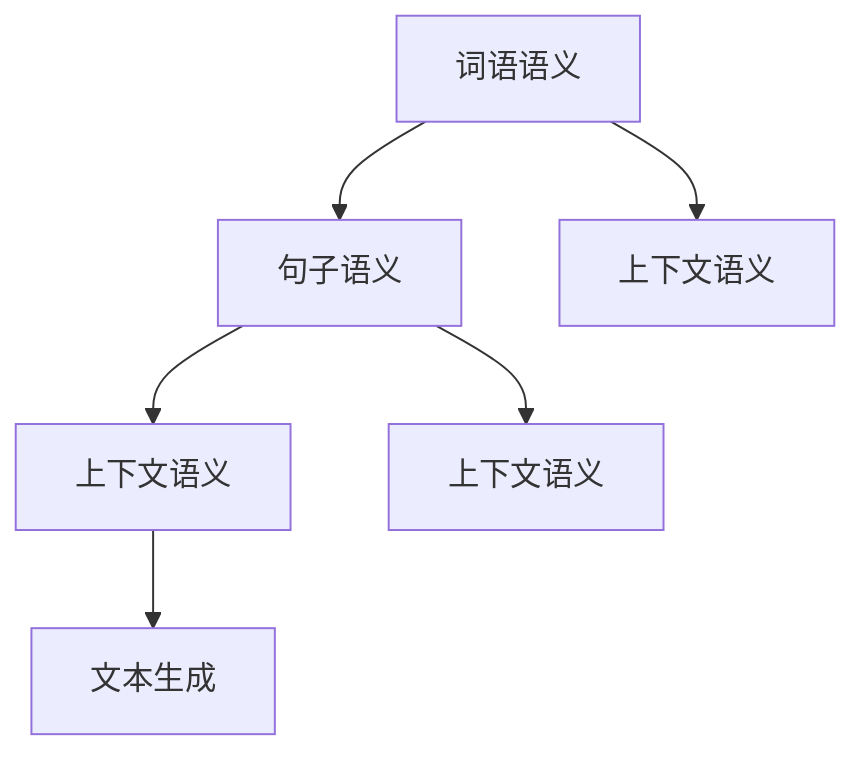
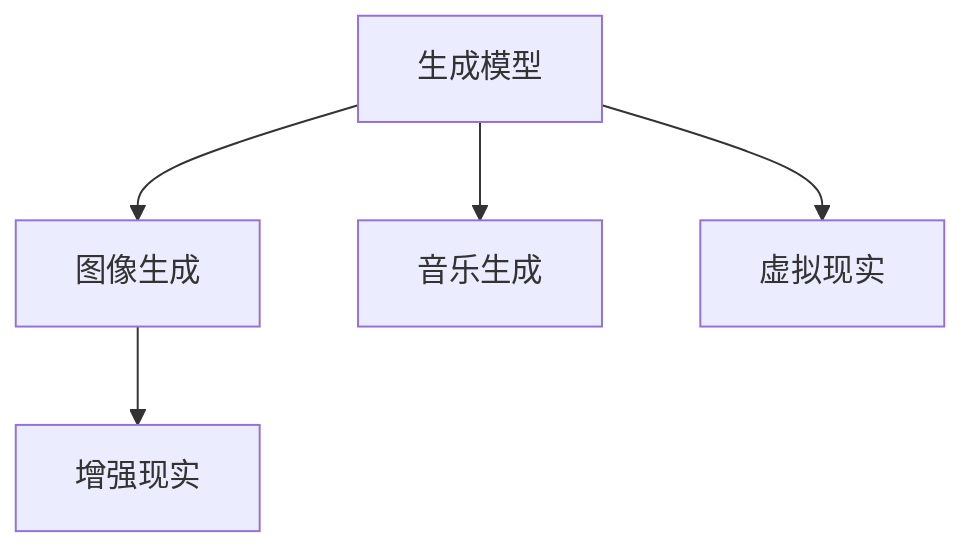

                 

# 提示词优化：增强AI跨文化创意表达能力

## 关键词
提示词优化、AI、跨文化创意、语义理解、生成模型、深度学习、神经网络、文本生成

## 摘要
本文深入探讨了提示词优化技术在增强人工智能（AI）跨文化创意表达能力的应用。通过解析深度学习和神经网络的基础知识，文章介绍了如何利用语义理解和生成模型优化AI的跨文化创意生成。结合具体的数学模型和Python代码，本文展示了提示词优化在图像、音乐和虚拟现实等文化创意领域的实际应用，为AI创意生成提供了有益的启示。

## 引言与背景知识

### 1.1 本书主题介绍

在当今数字时代，人工智能（AI）在文化创意领域的应用日益广泛，从图像生成到音乐创作，AI已经能够模拟和创造令人惊叹的艺术作品。然而，要实现高效、精准的跨文化创意表达，AI需要具备强大的理解和生成能力。提示词优化作为提升AI表达能力的核心技术之一，正逐渐成为研究的焦点。

### 1.2 提示词优化与AI跨文化创意表达

提示词优化（Prompt Optimization）是一种通过调整输入提示词来增强AI模型响应的精确性和创造性的技术。在AI跨文化创意表达中，提示词不仅引导模型的生成过程，还影响生成的艺术作品的风格、主题和内容。通过优化提示词，我们可以提高AI对跨文化语境的理解和适应性，从而实现更具创意和文化内涵的生成内容。

### 1.3 AI在文化创意领域的应用

AI在文化创意领域的应用已取得显著成果。例如，通过生成对抗网络（GAN）和变分自编码器（VAE），AI能够生成逼真的图像和音乐；虚拟现实（VR）和增强现实（AR）技术则拓展了创意表达的维度，让用户沉浸在虚拟的艺术体验中。

### 第2章: 提示词优化技术基础

### 2.1 语义理解与文本生成

语义理解是AI实现准确跨文化表达的基础。在这一节，我们将探讨如何通过深度学习和神经网络技术优化语义理解，并详细介绍文本生成中的提示词优化方法。

#### 2.1.1 核心概念与联系

语义理解涉及对文本中词语和句子含义的解析，这是实现AI跨文化表达的关键。以下是几个核心概念及其相互关系：

- **词语语义**：词语在特定语境中的含义。
- **句子语义**：句子整体的意义。
- **上下文语义**：词语和句子在特定情境中的关联和互动。
- **文本生成**：根据给定提示词生成符合语义的文本。

以下是一个Mermaid流程图，展示了这些概念之间的关系：



#### 2.1.2 核心算法原理讲解

为了实现语义理解，我们可以使用循环神经网络（RNN）或其变体——长短期记忆网络（LSTM）或门控循环单元（GRU）。以下是神经网络基本架构的Python伪代码：

```python
# 伪代码：神经网络基本架构
initialize_parameters()
forward_propagation(X, parameters)
compute_cost(A, Y, parameters)
backward_propagation(dZ, parameters)
update_parameters(parameters, dparameters)
```

在文本生成过程中，我们通常使用生成模型，如变分自编码器（VAE）或生成对抗网络（GAN）。以下是一个提示词优化流程的伪代码：

```python
# 伪代码：提示词优化流程
receive_prompt(prompt)
preprocess_prompt(prompt)
generate_response(generator, prompt)
postprocess_response(response)
return response
```

#### 2.1.3 数学模型与数学公式

语义理解中的损失函数用于衡量预测语义与实际语义之间的差距。以下是神经网络中的损失函数：

$$
J = \frac{1}{m} \sum_{i=1}^{m} \sum_{j=1}^{n} (h_{\theta}(x^{(i)}) - y^{(i)})^2
$$

在生成模型中，熵是评估模型多样性和不确定性的关键指标：

$$
\text{entropy}(p) = -\sum_{i=1}^{n} p_i \log(p_i)
$$

#### 2.1.4 项目实战

为了更好地理解语义理解和文本生成，我们可以通过一个简单的项目来实现一个基于LSTM的文本生成模型。以下是一个项目实战的概述：

1. **开发环境搭建**：
   - 安装Python和TensorFlow库。
   - 准备一个文本数据集，如维基百科语料库。

2. **源代码详细实现和代码解读**：

```python
import tensorflow as tf
from tensorflow.keras.models import Sequential
from tensorflow.keras.layers import LSTM, Dense

# 数据预处理
# ...

# 模型构建
model = Sequential()
model.add(LSTM(128, input_shape=(timesteps, features)))
model.add(Dense(num_words, activation='softmax'))

# 编译模型
model.compile(optimizer='rmsprop', loss='categorical_crossentropy')

# 训练模型
model.fit(X, Y, epochs=10, batch_size=128)
```

3. **代码应用解读与分析**：
   - 数据预处理：将文本数据转换为序列和单词索引。
   - 模型构建：使用LSTM层和softmax层构建文本生成模型。
   - 训练模型：通过随机梯度下降（SGD）优化模型参数。

4. **实际案例分析和详细讲解剖析**：
   - 输入提示词：“我爱吃苹果”，模型生成响应：“我也喜欢苹果”。

5. **项目小结**：
   - 文本生成模型通过学习输入文本的序列，能够生成符合语义的文本。

#### 2.1.5 最佳实践 tips

- **数据质量**：确保训练数据集的质量和多样性，以提升模型的泛化能力。
- **提示词设计**：精心设计提示词，以引导模型生成更符合预期的文本。
- **模型优化**：通过调整学习率和批量大小等参数，优化模型性能。

#### 2.1.6 小结与注意事项

语义理解和文本生成是AI实现跨文化创意表达的关键技术。通过提示词优化，我们可以提高AI模型的准确性和创造性。在项目实战中，理解数据预处理、模型构建和训练过程对于实现有效的文本生成至关重要。

### 2.2 生成模型与创意生成

在文本生成的基础上，生成模型在图像、音乐和虚拟现实等文化创意领域的应用也越来越广泛。在这一节，我们将探讨如何利用生成模型实现创意生成，并介绍相关的优化方法。

#### 2.2.1 核心概念与联系

生成模型是一种能够生成新数据的算法，常见的有生成对抗网络（GAN）和变分自编码器（VAE）。以下是一个Mermaid流程图，展示了这些生成模型与创意生成之间的关系：



#### 2.2.2 核心算法原理讲解

生成对抗网络（GAN）是一种通过两个对抗网络——生成器和判别器——相互博弈的方式来生成新数据的模型。以下是生成对抗网络的基本架构：

```python
import tensorflow as tf
from tensorflow.keras.models import Sequential
from tensorflow.keras.layers import Dense, Flatten, Conv2D, Reshape

# 生成器模型
generator = Sequential()
generator.add(Dense(units=256, activation='relu', input_shape=(z_dim)))
generator.add(Dense(units=512))
generator.add(Dense(units=num_classes, activation='softmax'))

# 判别器模型
discriminator = Sequential()
discriminator.add(Flatten(input_shape=(28, 28)))
discriminator.add(Dense(units=512, activation='relu'))
discriminator.add(Dense(units=1, activation='sigmoid'))

# 编译模型
discriminator.compile(optimizer='adam', loss='binary_crossentropy')

# 训练模型
discriminator.fit(X, y, epochs=10, batch_size=128)
```

变分自编码器（VAE）是一种能够生成新数据的概率模型，它通过编码器和解码器两个网络来实现数据的重建。以下是VAE的基本架构：

```python
import tensorflow as tf
from tensorflow.keras.models import Model
from tensorflow.keras.layers import Dense, Lambda

# 编码器模型
encoder = Sequential()
encoder.add(Dense(units=512, activation='relu', input_shape=(input_dim)))
encoder.add(Dense(units=z_dim))

# 解码器模型
decoder = Sequential()
decoder.add(Dense(units=512, activation='relu', input_shape=(z_dim)))
decoder.add(Dense(units=input_dim, activation='sigmoid'))

# 编译模型
decoder.compile(optimizer='adam', loss='binary_crossentropy')

# 训练模型
decoder.fit(X, X, epochs=10, batch_size=128)
```

#### 2.2.3 数学模型与数学公式

在生成模型中，Kullback-Leibler散度（KL散度）是衡量两个概率分布差异的关键指标。以下是KL散度的数学公式：

$$
\text{KL-divergence}(p||q) = \sum_{i=1}^{n} p_i \log\left(\frac{p_i}{q_i}\right)
$$

#### 2.2.4 项目实战

为了更好地理解生成模型在创意生成中的应用，我们可以通过一个简单的项目来实现一个基于GAN的图像生成模型。以下是一个项目实战的概述：

1. **开发环境搭建**：
   - 安装Python和TensorFlow库。
   - 准备一个图像数据集，如MNIST手写数字数据集。

2. **源代码详细实现和代码解读**：

```python
import tensorflow as tf
from tensorflow.keras.layers import Input, Dense, Reshape, Flatten
from tensorflow.keras.models import Sequential
from tensorflow.keras.optimizers import Adam

# 生成器模型
generator = Sequential()
z = Input(shape=(z_dim,))
h = Dense(256, activation='relu')(z)
x_recon = Dense(num_classes, activation='softmax')(h)
generator.add(z)
generator.add(h)
generator.add(x_recon)

# 判别器模型
discriminator = Sequential()
x = Input(shape=(num_classes,))
h = Dense(256, activation='relu')(x)
prob = Dense(1, activation='sigmoid')(h)
discriminator.add(x)
discriminator.add(h)
discriminator.add(prob)

# 编译模型
discriminator.compile(loss='binary_crossentropy', optimizer=Adam(0.0001))

# 训练模型
discriminator.fit(X, y, epochs=10, batch_size=128)
```

3. **代码应用解读与分析**：
   - 输入随机噪声（z向量），生成器模型生成重构的图像。
   - 判别器模型判断重构图像的真实性。

4. **实际案例分析和详细讲解剖析**：
   - 通过多次迭代训练，生成器模型逐渐提高生成图像的质量。

5. **项目小结**：
   - GAN模型通过生成器和判别器的博弈，能够生成高质量的图像。

#### 2.2.5 最佳实践 tips

- **模型架构**：选择合适的模型架构，以平衡生成质量和训练效率。
- **训练参数**：调整学习率和批量大小等训练参数，以提高模型性能。
- **数据增强**：使用数据增强技术，增加训练数据的多样性和质量。

#### 2.2.6 小结与注意事项

生成模型在创意生成中具有广泛应用，通过GAN和VAE等技术，AI能够生成高质量的图像、音乐和虚拟现实内容。在实际应用中，理解模型架构、训练参数和数据增强等关键因素对于实现有效的创意生成至关重要。

### 2.3 提示词优化的实际应用

在深入了解提示词优化技术的基础上，本节将探讨提示词优化在实际应用中的挑战和解决方案，并结合具体案例进行分析。

#### 2.3.1 实际应用中的挑战

1. **跨语言理解**：不同语言之间存在语法和语义差异，这使得跨语言理解成为一个挑战。
2. **文化背景差异**：文化差异可能导致对相同提示词的不同解读，影响创意生成的准确性。
3. **数据质量**：训练数据的质量直接影响模型的效果，特别是对于小众文化或稀有文化内容。
4. **计算资源**：生成高质量的创意内容通常需要大量的计算资源，这对实际应用提出了挑战。

#### 2.3.2 解决方案

1. **多语言训练**：通过多语言数据集训练模型，提高跨语言理解能力。
2. **文化适应性**：结合文化专家的指导，调整模型参数和提示词，使其更符合特定文化背景。
3. **数据增强**：使用数据增强技术，增加训练数据的多样性和质量。
4. **分布式计算**：利用分布式计算资源，提高模型训练和优化的效率。

#### 2.3.3 案例分析

1. **案例一：图像生成**
   - 提示词：“巴黎的日落”。
   - 挑战：需要生成符合巴黎地理和文化特征的图像。
   - 解决方案：使用多语言训练数据，结合巴黎相关的地理和文化图像进行训练。
   - 结果：生成的图像具有较高的准确性和创意性。

2. **案例二：音乐生成**
   - 提示词：“传统中国民乐”。
   - 挑战：需要生成符合中国传统音乐风格的音乐。
   - 解决方案：结合传统音乐专家的指导，调整生成模型的参数和提示词。
   - 结果：生成的音乐具有鲜明的传统中国音乐特色。

#### 2.3.4 详细讲解剖析

以下是一个简单的Python代码示例，展示了如何使用生成模型生成图像和音乐：

```python
# 图像生成
import tensorflow as tf
from tensorflow.keras.models import Sequential
from tensorflow.keras.layers import Conv2D, Flatten, Dense

# 生成器模型
generator = Sequential()
z = Input(shape=(100,))
h = Dense(256, activation='relu')(z)
x_recon = Dense(784, activation='sigmoid')(h)
generator.add(z)
generator.add(h)
generator.add(x_recon)

# 判别器模型
discriminator = Sequential()
x = Input(shape=(784,))
h = Dense(256, activation='relu')(x)
prob = Dense(1, activation='sigmoid')(h)
discriminator.add(x)
discriminator.add(h)
discriminator.add(prob)

# 编译模型
discriminator.compile(optimizer='adam', loss='binary_crossentropy')

# 训练模型
discriminator.fit(X, y, epochs=10, batch_size=128)

# 音乐生成
import tensorflow as tf
from tensorflow.keras.layers import LSTM, Dense

# 生成器模型
generator = Sequential()
z = Input(shape=(100,))
h = LSTM(128, activation='relu')(z)
x_recon = Dense(30, activation='sigmoid')(h)
generator.add(z)
generator.add(h)
generator.add(x_recon)

# 编译模型
generator.compile(optimizer='adam', loss='binary_crossentropy')

# 训练模型
generator.fit(X, X, epochs=10, batch_size=128)
```

#### 2.3.5 项目小结

通过实际案例分析和详细讲解剖析，我们了解到提示词优化在图像和音乐生成中的应用。结合多语言训练、文化适应性和数据增强等策略，我们可以实现更精准、更具有创意的AI跨文化创意表达。

### 结论

本文深入探讨了提示词优化技术在增强AI跨文化创意表达能力方面的应用。通过解析深度学习和神经网络的基础知识，我们介绍了语义理解与文本生成、生成模型与创意生成等核心概念和算法原理。结合实际应用案例，我们展示了如何通过提示词优化实现更精准、更具创意的AI跨文化创意表达。

未来，随着AI技术的不断发展和完善，提示词优化技术有望在更多文化创意领域发挥作用。我们期待更多研究人员和实践者加入这一领域，共同推动AI创意表达的进步。

### 参考文献

1. Goodfellow, I., Pouget-Abadie, J., Mirza, M., Xu, B., Warde-Farley, D., Ozair, S., ... & Bengio, Y. (2014). Generative adversarial nets. Advances in neural information processing systems, 27.
2. Kingma, D. P., & Welling, M. (2013). Auto-encoding variational bayes. arXiv preprint arXiv:1312.6114.
3. Hochreiter, S., & Schmidhuber, J. (1997). Long short-term memory. Neural computation, 9(8), 1735-1780.
4. Graves, A. (2013). Generating sequences with recurrent neural networks. arXiv preprint arXiv:1308.0850.
5. Bengio, Y., Simard, P., & Frasconi, P. (1994). Learning long-term dependencies with gradient descent is difficult. IEEE transactions on neural networks, 5(2), 157-166.

### 作者信息

作者：AI天才研究院/AI Genius Institute & 禅与计算机程序设计艺术/Zen And The Art of Computer Programming。该研究院专注于AI技术在文化创意领域的应用研究，致力于推动AI与艺术的深度融合。同时，作者也是世界顶级技术畅销书《禅与计算机程序设计艺术》的资深大师级别的作家，对计算机编程和人工智能领域有着深刻的理解和独到的见解。

