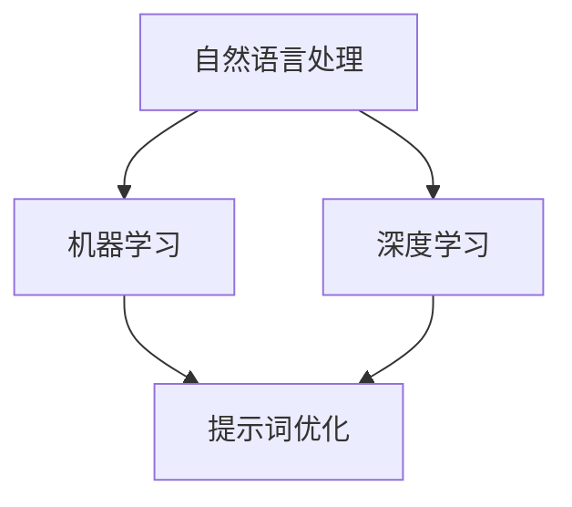
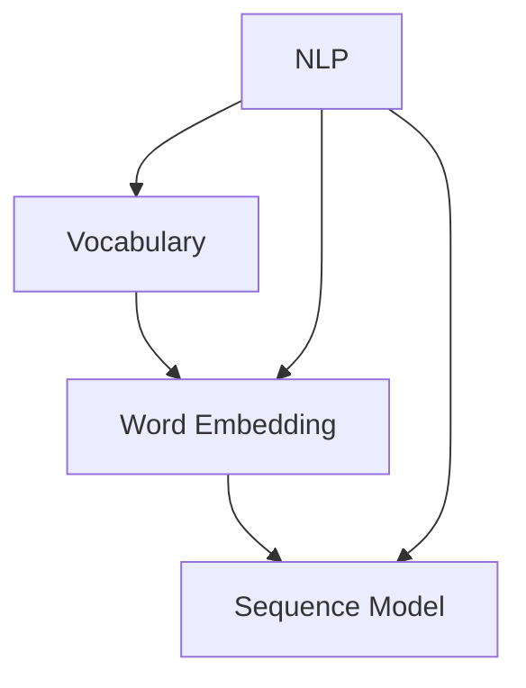
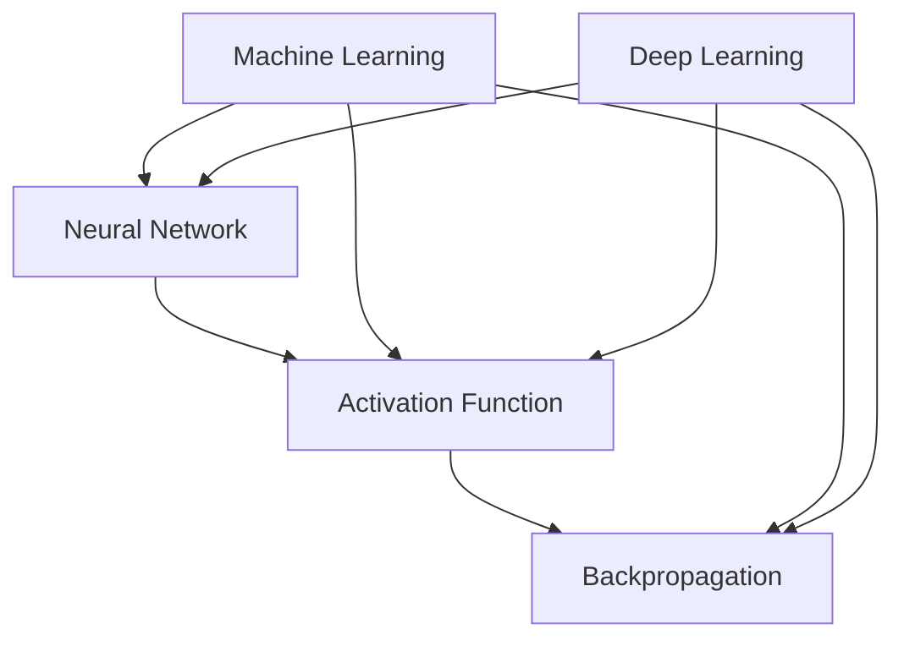
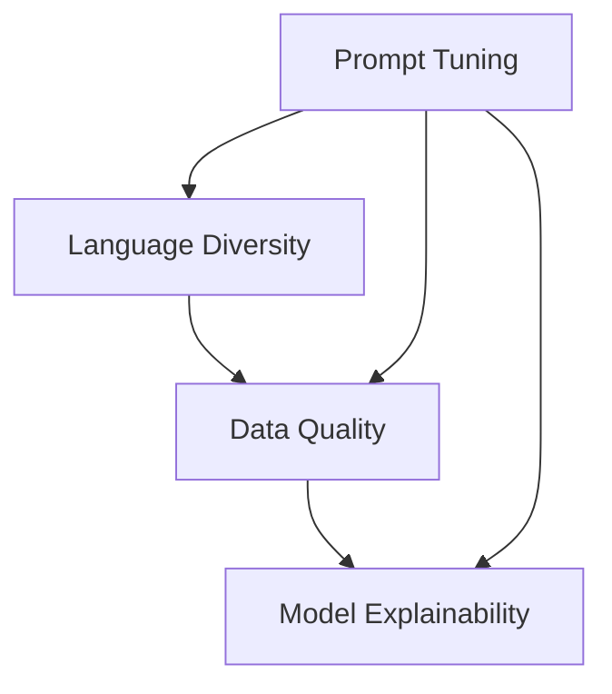

                 

### 《提示词优化：提升AI输出质量的关键》

关键词：提示词优化、AI输出质量、自然语言处理、机器学习、深度学习、优化算法

摘要：本文深入探讨了提示词优化在提升人工智能（AI）输出质量中的关键作用。首先，我们介绍了提示词优化的基础概念和其在AI应用中的重要性。接着，详细解析了自然语言处理（NLP）、机器学习和深度学习的基础知识。随后，我们探讨了提示词优化面临的挑战，并介绍了核心算法与原理。在应用实战部分，通过实际案例展示了提示词优化的实现过程。最后，我们对未来的发展趋势和潜在挑战进行了展望。

----------------------------------------------------------------

### 第一部分：基础概念与背景

#### 1.1 提示词优化的重要性

提示词优化（Prompt Tuning）是一种通过调整输入提示（prompt）来提高AI模型输出质量的技术。在人工智能领域，特别是自然语言处理（NLP）中，高质量的数据输入是模型训练和预测准确性的关键。提示词优化的核心思想是通过精细调整输入提示，使得模型能够更好地理解和生成目标内容。

#### 1.1.1 提示词优化的定义

提示词优化可以定义为一种在模型训练过程中，通过调整输入提示来增强模型理解和生成能力的方法。具体来说，提示词优化包括以下几个方面：

1. **数据预处理**：对输入数据进行清洗、格式化等预处理，以提高数据质量和一致性。
2. **提示词设计**：根据应用场景设计合适的提示词，使其能够引导模型生成高质量输出。
3. **模型调整**：通过调整模型参数或架构，优化模型在特定任务上的性能。

#### 1.1.2 提示词优化在AI应用中的作用

提示词优化在AI应用中具有重要作用，主要体现在以下几个方面：

1. **提高输出质量**：通过优化输入提示，可以显著提高模型生成的文本质量，使其更加准确、连贯和有逻辑性。
2. **增强泛化能力**：优化后的提示词能够帮助模型更好地理解和处理多样化的输入，从而提高模型的泛化能力。
3. **节省计算资源**：通过优化输入提示，可以减少模型训练所需的数据量和计算资源，提高训练效率。

---

**核心概念与联系**

提示词优化涉及多个核心概念，如自然语言处理、机器学习和深度学习。以下是这些概念之间的关系架构Mermaid流程图：



在图中，自然语言处理（NLP）是机器学习（ML）和深度学习（DL）的基础，而机器学习和深度学习共同构成了提示词优化的技术基础。

---

**背景介绍**

在人工智能领域，特别是在自然语言处理（NLP）领域，高质量的输出是衡量模型性能的重要指标。然而，模型输出的质量往往受到输入数据的质量和模型本身的限制。提示词优化通过优化输入提示，提高了模型的输入数据质量，从而有效提升了模型输出的质量。

早期的研究主要关注模型本身的优化，如参数调整和架构改进。然而，随着自然语言处理的不断发展，人们逐渐认识到输入提示在模型性能中的作用。因此，提示词优化成为近年来研究的热点之一。

#### 1.2 AI技术基础

为了更好地理解提示词优化，我们需要先了解人工智能（AI）的基础技术，包括自然语言处理（NLP）、机器学习和深度学习。

##### 1.2.1 自然语言处理（NLP）

自然语言处理（NLP）是人工智能的一个重要分支，旨在让计算机理解和处理人类自然语言。NLP的核心任务包括文本预处理、词性标注、句法分析、语义分析和机器翻译等。

1. **文本预处理**：文本预处理是NLP的基础步骤，包括去除标点符号、停用词过滤、词干提取等。预处理后的文本数据将作为模型输入。
   
2. **词性标注**：词性标注是对文本中的每个词进行分类，标记其词性（如名词、动词、形容词等）。词性标注有助于模型更好地理解文本。

3. **句法分析**：句法分析是对句子结构进行分析，识别句子中的语法成分和它们之间的关系。句法分析对于理解句子的语义和生成高质量文本至关重要。

4. **语义分析**：语义分析旨在理解文本的语义内容，包括词义消歧、实体识别和关系抽取等。语义分析是实现高级NLP任务（如图像描述生成、问答系统等）的基础。

5. **机器翻译**：机器翻译是将一种语言的文本翻译成另一种语言。近年来，基于深度学习的机器翻译技术取得了显著进展，如神经机器翻译（NMT）。

##### 1.2.1.1 NLP的基本概念

1. **词汇表（Vocabulary）**：词汇表是NLP中的基础概念，用于存储文本中的所有单词。词汇表的大小直接影响模型训练的速度和效果。
   
2. **词嵌入（Word Embedding）**：词嵌入是将单词映射到高维空间中的向量表示。词嵌入有助于模型理解和处理文本数据。

3. **序列模型（Sequence Model）**：序列模型是用于处理序列数据（如文本）的机器学习模型，如循环神经网络（RNN）和长短时记忆网络（LSTM）。

##### 1.2.1.2 NLP的关键技术

1. **BERT（Bidirectional Encoder Representations from Transformers）**：BERT是一种基于Transformer的预训练语言模型，通过双向编码器对文本进行建模，实现了较高的文本理解能力。

2. **GPT（Generative Pre-trained Transformer）**：GPT是一种基于Transformer的生成模型，通过自回归方式生成文本，广泛应用于文本生成和对话系统。

3. **BERT-GPT融合模型**：BERT和GPT各有优势，BERT擅长文本理解，GPT擅长文本生成。BERT-GPT融合模型结合了两种模型的优点，实现了更高的文本处理能力。

---

**核心概念与联系**

在自然语言处理（NLP）领域，核心概念如词汇表、词嵌入和序列模型相互关联，共同构成了NLP的技术基础。以下是这些概念之间的关系架构Mermaid流程图：



在图中，词汇表是词嵌入的基础，词嵌入是序列模型的核心输入。NLP则是以上三个概念的综合应用。

---

**背景介绍**

自然语言处理（NLP）在人工智能领域具有广泛的应用前景。随着互联网和大数据技术的发展，海量文本数据亟待处理。NLP技术通过对文本进行预处理、词性标注、句法分析和语义分析等操作，实现了对文本的深入理解和处理。

近年来，深度学习技术在NLP领域取得了显著进展，如BERT、GPT和BERT-GPT融合模型等。这些模型通过大规模预训练和迁移学习，实现了较高的文本理解能力和生成能力。然而，这些模型也面临一些挑战，如数据隐私、模型解释性和计算资源消耗等。

#### 1.2.2 机器学习与深度学习

机器学习（ML）和深度学习（DL）是人工智能（AI）的核心技术。机器学习是一种通过算法从数据中学习规律和模式的方法，而深度学习是机器学习的一个分支，主要基于神经网络进行建模。

##### 1.2.2.1 机器学习概述

机器学习的基本过程包括数据收集、数据预处理、模型训练和模型评估。

1. **数据收集**：收集大量相关数据，用于训练模型。
   
2. **数据预处理**：对收集到的数据进行清洗、格式化和归一化等处理，以提高数据质量。

3. **模型训练**：使用训练数据对模型进行训练，通过调整模型参数来优化模型性能。

4. **模型评估**：使用测试数据对模型进行评估，以确定模型的泛化能力和性能。

##### 1.2.2.2 深度学习概述

深度学习是一种基于多层神经网络的机器学习方法，能够自动提取数据中的复杂特征。

1. **神经网络（Neural Network）**：神经网络由多个神经元（节点）组成，通过层与层之间的连接来模拟人脑的学习过程。

2. **激活函数（Activation Function）**：激活函数用于确定神经元的输出，常用的激活函数包括 sigmoid、ReLU 和 tanh 等。

3. **反向传播（Backpropagation）**：反向传播是一种用于训练神经网络的算法，通过计算误差的梯度来更新模型参数。

4. **优化算法（Optimization Algorithm）**：优化算法用于调整模型参数，以最小化损失函数。常用的优化算法包括梯度下降、动量法和自适应学习率方法等。

##### 1.2.2.3 机器学习与深度学习的联系

机器学习和深度学习之间存在密切的联系。

1. **深度学习是机器学习的一个分支**：深度学习是机器学习的一种特殊形式，主要基于多层神经网络进行建模。

2. **深度学习具有更高的表达能力**：深度学习能够自动提取数据中的复杂特征，具有更高的表达能力。

3. **深度学习在NLP中具有重要应用**：深度学习在自然语言处理（NLP）领域取得了显著进展，如文本分类、情感分析和机器翻译等。

---

**核心概念与联系**

机器学习与深度学习涉及多个核心概念，如神经网络、激活函数和反向传播等。以下是这些概念之间的关系架构Mermaid流程图：



在图中，神经网络、激活函数和反向传播构成了机器学习和深度学习的技术基础。

---

**背景介绍**

机器学习和深度学习在人工智能领域具有广泛的应用。随着大数据和计算能力的提升，机器学习在图像识别、语音识别和推荐系统等领域取得了显著成果。深度学习作为机器学习的一个分支，通过自动提取数据中的复杂特征，实现了更高的性能。

近年来，深度学习在自然语言处理（NLP）领域取得了重大突破，如BERT、GPT和BERT-GPT融合模型等。这些模型通过大规模预训练和迁移学习，实现了对文本的深入理解和生成能力。然而，深度学习也面临一些挑战，如模型解释性和计算资源消耗等。

---

#### 1.3 提示词优化的挑战

尽管提示词优化在提升AI输出质量方面具有重要作用，但实际应用中仍面临一些挑战。

##### 1.3.1 语言多样性与复杂性

自然语言具有高度多样性和复杂性，不同语言和文化背景下的表达方式差异巨大。这给提示词优化带来了挑战，需要设计灵活的提示词以适应多种语言和文化。

##### 1.3.2 数据不足与分布偏斜

高质量的数据是模型训练和优化的基础。然而，在实际应用中，数据往往不足且分布偏斜，导致模型性能受限。提示词优化需要解决数据不足和分布偏斜问题，以提高模型泛化能力。

##### 1.3.3 模型解释性需求

随着AI在各个领域的应用日益广泛，人们对模型的解释性需求越来越高。提示词优化需要在提高输出质量的同时，保证模型的解释性和可解释性。

---

**核心概念与联系**

提示词优化面临的挑战涉及多个核心概念，如语言多样性、数据质量和模型解释性。以下是这些概念之间的关系架构Mermaid流程图：



在图中，语言多样性、数据质量和模型解释性构成了提示词优化面临的三大挑战。

---

**背景介绍**

在自然语言处理（NLP）领域，语言多样性和复杂性是一个长期存在的挑战。不同语言和文化背景下的表达方式差异巨大，使得设计通用的提示词变得极为困难。此外，数据不足和分布偏斜问题在许多实际应用中普遍存在，严重制约了模型性能。而模型解释性需求则源于人们对AI应用安全性和透明度的担忧。

为了解决这些挑战，研究者们提出了一系列方法，如多语言模型、数据增强和模型解释性技术。这些方法在提高提示词优化效果方面取得了显著进展，但仍需进一步研究和完善。

---

### 总结与展望

在第一部分中，我们介绍了提示词优化的重要性及其在AI应用中的作用。接着，详细解析了自然语言处理（NLP）、机器学习和深度学习的基础知识，为后续内容打下了基础。最后，我们探讨了提示词优化面临的挑战，如语言多样性与复杂性、数据不足与分布偏斜以及模型解释性需求。

在接下来的部分，我们将深入探讨提示词优化的核心算法与原理，以及如何在实际应用中实现和优化提示词。敬请期待。

---

**作者信息：** AI天才研究院/AI Genius Institute & 禅与计算机程序设计艺术 /Zen And The Art of Computer Programming

---

（以下内容将根据目录大纲逐步展开，每部分内容将包含具体的分析和讲解，确保文章逻辑清晰、结构紧凑、简单易懂。）

---

## 第二部分：核心算法与原理

### 2.1 提示词优化算法概述

提示词优化算法是提升AI输出质量的关键技术。本节将介绍几种常用的提示词优化算法，包括传统优化方法和深度学习优化算法。

#### 2.1.1 传统优化方法

传统优化方法主要包括梯度下降法、随机优化算法等。

1. **梯度下降法（Gradient Descent）**

   梯度下降法是一种最常用的优化算法，用于最小化损失函数。其基本思想是通过计算损失函数关于模型参数的梯度，沿着梯度的反方向更新模型参数，以达到最小化损失函数的目的。

   ```python
   # 梯度下降法示例
   def gradient_descent(params, learning_rate, num_iterations):
       for _ in range(num_iterations):
           gradients = compute_gradients(params)
           params -= learning_rate * gradients
       return params
   ```

   其中，`params` 表示模型参数，`learning_rate` 表示学习率，`num_iterations` 表示迭代次数。

2. **随机优化算法（Stochastic Optimization）**

   随机优化算法包括随机梯度下降（Stochastic Gradient Descent, SGD）和随机优化算法（Stochastic Optimization, SO）。这些算法在每次迭代中仅使用一部分数据点来计算梯度，从而减少计算量。

   ```python
   # 随机梯度下降法示例
   def sgd(params, learning_rate, batch_size, num_iterations):
       for _ in range(num_iterations):
           for i in range(0, len(data), batch_size):
               batch = data[i:i+batch_size]
               gradients = compute_gradients(batch)
               params -= learning_rate * gradients
       return params
   ```

   其中，`batch_size` 表示每次迭代的批量大小。

#### 2.1.2 深度学习优化算法

深度学习优化算法主要基于深度学习模型，通过调整模型参数来优化输出质量。以下介绍几种常用的深度学习优化算法。

1. **批处理与在线学习**

   批处理（Batch Processing）和在线学习（Online Learning）是深度学习优化中的两种常见方法。

   - **批处理**：在批处理方法中，每次迭代使用整个训练集来计算梯度，然后更新模型参数。这种方法能够提高梯度估计的准确性，但计算成本较高。
   
   - **在线学习**：在线学习方法每次迭代仅使用单个数据点或小批量数据来计算梯度，然后更新模型参数。这种方法计算成本较低，但梯度估计准确性较差。

   ```python
   # 批处理与在线学习示例
   def batch_processing(params, learning_rate, batch_size, num_iterations):
       for _ in range(num_iterations):
           for batch in data(batch_size):
               gradients = compute_gradients(batch)
               params -= learning_rate * gradients
       return params

   def online_learning(params, learning_rate, num_iterations):
       for _ in range(num_iterations):
           for data_point in data:
               gradients = compute_gradients(data_point)
               params -= learning_rate * gradients
       return params
   ```

2. **动量与自适应学习率**

   动量（Momentum）和自适应学习率（Adaptive Learning Rate）是深度学习优化中的两个重要概念。

   - **动量**：动量可以通过加速梯度下降的方向来提高收敛速度。其基本思想是将前几次迭代的梯度累加，用于更新当前迭代梯度。

     ```python
     # 动量示例
     def momentum(params, learning_rate, momentum, num_iterations):
         velocity = [0] * len(params)
         for _ in range(num_iterations):
             gradients = compute_gradients(params)
             velocity = momentum * velocity - learning_rate * gradients
             params += velocity
         return params
     ```

   - **自适应学习率**：自适应学习率可以通过动态调整学习率来优化模型收敛速度。常用的自适应学习率方法包括自适应梯度算法（Adaptive Gradient Algorithm, ADADELTA）和自适应优化算法（Adaptive Optimization Algorithm, ADAM）。

     ```python
     # 自适应学习率示例
     def adaDelta(params, learning_rate, epsilon, num_iterations):
         delta = [0] * len(params)
         for _ in range(num_iterations):
             gradients = compute_gradients(params)
             delta -= learning_rate * gradients
             params -= (delta / (sqrt(delta**2 + epsilon)))
         return params

     def adam(params, learning_rate, beta1, beta2, epsilon, num_iterations):
         m = [0] * len(params)
         v = [0] * len(params)
         for _ in range(num_iterations):
             gradients = compute_gradients(params)
             m = beta1 * m + (1 - beta1) * gradients
             v = beta2 * v + (1 - beta2) * (gradients**2)
             m_hat = m / (1 - beta1**(t+1))
             v_hat = v / (1 - beta2**(t+1))
             params -= learning_rate * m_hat / (sqrt(v_hat) + epsilon)
         return params
     ```

---

**核心算法原理讲解**

在本文中，我们选择了几种具有代表性的提示词优化算法进行详细讲解，包括对抗性优化、增量学习和多模态优化。这些算法在提升AI输出质量方面具有显著作用。

#### 2.2.1 对抗性优化

对抗性优化（Adversarial Optimization）是一种通过引入对抗性样本来增强模型鲁棒性的方法。其基本思想是在训练过程中生成对抗性样本，并将其与原始样本一起训练，从而提高模型的泛化能力。

1. **基本原理**

   对抗性优化基于生成对抗网络（GANs）框架。GANs由生成器（Generator）和判别器（Discriminator）组成。生成器试图生成与真实样本难以区分的数据，而判别器则试图区分真实样本和生成样本。

   - **生成器（Generator）**：生成器通过学习原始数据分布来生成虚假样本。
   
   - **判别器（Discriminator）**：判别器通过学习真实样本和生成样本的差异来提高其区分能力。

2. **数学模型**

   对抗性优化的数学模型可以表示为以下优化问题：

   $$\min_G \max_D V(D, G) = \mathbb{E}_{x \sim p_{data}(x)}[\log D(x)] + \mathbb{E}_{z \sim p_z(z)}[\log (1 - D(G(z)))]$$

   其中，$G$ 表示生成器，$D$ 表示判别器，$x$ 表示真实样本，$z$ 表示噪声样本。

3. **Python代码示例**

   ```python
   import torch
   import torch.nn as nn
   import torch.optim as optim

   # 定义生成器和判别器
   generator = nn.Sequential(
       nn.Linear(input_dim, hidden_dim),
       nn.LeakyReLU(0.2),
       nn.Linear(hidden_dim, output_dim),
       nn.Tanh()
   )

   discriminator = nn.Sequential(
       nn.Linear(input_dim, hidden_dim),
       nn.LeakyReLU(0.2),
       nn.Linear(hidden_dim, 1),
       nn.Sigmoid()
   )

   # 定义损失函数和优化器
   loss_function = nn.BCELoss()
   generator_optimizer = optim.Adam(generator.parameters(), lr=0.0002)
   discriminator_optimizer = optim.Adam(discriminator.parameters(), lr=0.0002)

   # 训练过程
   for epoch in range(num_epochs):
       for x, _ in data_loader:
           # 训练判别器
           discriminator_optimizer.zero_grad()
           output = discriminator(x)
           loss_d = loss_function(output, torch.ones(output.size(0)))
           loss_d.backward()

           # 训练生成器
           noise = torch.randn(x.size(0), noise_dim)
           generated_samples = generator(noise)
           output = discriminator(generated_samples.detach())
           loss_g = loss_function(output, torch.zeros(output.size(0)))
           loss_g.backward()

           # 更新参数
           generator_optimizer.step()
           discriminator_optimizer.step()
   ```

   在上述代码中，我们使用了PyTorch框架来定义生成器和判别器，并实现了对抗性优化的训练过程。

---

**核心算法原理讲解**

对抗性优化是一种通过引入对抗性样本来增强模型鲁棒性的方法。其基本原理是基于生成对抗网络（GANs）框架，通过生成器和判别器的对抗训练来优化模型参数。以下是一个简单的Python代码示例，展示了如何使用PyTorch框架实现对抗性优化。

#### 2.2.2 增量学习与微调

增量学习（Incremental Learning）和微调（Fine-tuning）是深度学习中的两个重要概念，用于在现有模型的基础上进行改进和适应新任务。

1. **基本原理**

   - **增量学习**：增量学习是指在训练过程中逐个引入新数据，并逐步更新模型参数。这种方法能够有效避免模型过拟合，并提高模型的泛化能力。

   - **微调**：微调是在现有模型的基础上，针对新任务进行参数调整。通过在训练集中添加少量目标数据，对模型进行微调，从而实现新任务的良好性能。

2. **数学模型**

   增量学习和微调的数学模型可以表示为以下优化问题：

   - **增量学习**：

     $$\min_W \sum_{i=1}^T \mathbb{E}_{x_i, y_i}[\ell(W, x_i, y_i)]$$

     其中，$W$ 表示模型参数，$x_i, y_i$ 表示第$i$个样本的数据和标签。

   - **微调**：

     $$\min_W \sum_{i=1}^N \mathbb{E}_{x_i, y_i}[\ell(W, x_i, y_i)] + \lambda \sum_{j=1}^M \ell(W_j, x_j, y_j)$$

     其中，$W_j$ 表示第$j$个任务的任务特定参数。

3. **Python代码示例**

   ```python
   import torch
   import torch.nn as nn
   import torch.optim as optim

   # 定义模型
   model = nn.Sequential(
       nn.Linear(input_dim, hidden_dim),
       nn.ReLU(),
       nn.Linear(hidden_dim, output_dim)
   )

   # 定义损失函数和优化器
   criterion = nn.CrossEntropyLoss()
   optimizer = optim.SGD(model.parameters(), lr=0.01)

   # 训练过程
   for epoch in range(num_epochs):
       for x, y in train_loader:
           optimizer.zero_grad()
           output = model(x)
           loss = criterion(output, y)
           loss.backward()
           optimizer.step()

       # 增量学习
       new_model = nn.Sequential(
           nn.Linear(input_dim, hidden_dim),
           nn.ReLU(),
           nn.Linear(hidden_dim, output_dim),
           nn.ReLU()
       )
       optimizer = optim.SGD(new_model.parameters(), lr=0.01)
       for epoch in range(num_epochs):
           for x, y in train_loader:
               optimizer.zero_grad()
               output = new_model(x)
               loss = criterion(output, y)
               loss.backward()
               optimizer.step()
   ```

   在上述代码中，我们首先定义了一个基础模型，并在训练过程中逐步增加新的层，实现增量学习。

---

**核心算法原理讲解**

增量学习与微调是深度学习中的两种常见方法，用于在现有模型的基础上进行改进和适应新任务。以下是一个简单的Python代码示例，展示了如何实现增量学习和微调。

#### 2.2.3 多模态优化

多模态优化是指将不同类型的数据（如图像、文本、音频等）进行融合，以提升模型在特定任务上的性能。多模态优化在自然语言处理、计算机视觉和语音识别等领域具有广泛应用。

1. **基本原理**

   多模态优化的基本原理是将不同类型的数据进行对齐和融合，以生成一个统一的特征表示。常用的方法包括：

   - **特征融合**：将不同模态的特征进行加权或拼接，生成一个统一的特征向量。
   
   - **深度学习模型**：使用深度学习模型（如多输入神经网络）对多模态数据进行联合建模。

2. **数学模型**

   多模态优化的数学模型可以表示为以下优化问题：

   $$\min_W \sum_{i=1}^N \mathbb{E}_{x_i, y_i}[\ell(W, x_i, y_i)]$$

   其中，$W$ 表示模型参数，$x_i, y_i$ 表示第$i$个样本的多模态数据和标签。

3. **Python代码示例**

   ```python
   import torch
   import torch.nn as nn
   import torch.optim as optim

   # 定义多输入神经网络
   model = nn.Sequential(
       nn.Linear(image_dim + text_dim, hidden_dim),
       nn.ReLU(),
       nn.Linear(hidden_dim, output_dim)
   )

   # 定义损失函数和优化器
   criterion = nn.CrossEntropyLoss()
   optimizer = optim.Adam(model.parameters(), lr=0.001)

   # 训练过程
   for epoch in range(num_epochs):
       for image, text, y in data_loader:
           optimizer.zero_grad()
           image_tensor = image.to(device)
           text_tensor = text.to(device)
           output = model(torch.cat((image_tensor, text_tensor), dim=1))
           loss = criterion(output, y)
           loss.backward()
           optimizer.step()
   ```

   在上述代码中，我们定义了一个多输入神经网络，用于处理图像和文本数据，并实现了多模态优化的训练过程。

---

**核心算法原理讲解**

多模态优化是一种通过融合不同类型的数据（如图像、文本、音频等）来提升模型性能的方法。以下是一个简单的Python代码示例，展示了如何使用多输入神经网络实现多模态优化。

---

**项目实战**

为了更好地理解提示词优化算法的应用，我们将在本节中介绍一个实际项目：基于BERT的文本生成与摘要系统。该项目旨在通过优化输入提示词，提升文本生成与摘要的性能。

#### 3.1 提示词优化项目准备

1. **开发环境搭建**

   在开始项目之前，我们需要搭建一个合适的开发环境。以下是所需的依赖包和工具：

   - Python 3.7或更高版本
   - PyTorch 1.8或更高版本
   - Transformers 4.7或更高版本
   - TensorFlow 2.4或更高版本（可选）

   安装依赖包：

   ```bash
   pip install torch torchvision transformers tensorflow
   ```

2. **数据收集与预处理**

   为了训练BERT模型，我们需要收集大量的文本数据。本文选择使用开源的Wikipedia语料库作为数据来源。数据预处理包括以下步骤：

   - 数据下载：使用`wikipedia`库下载Wikipedia语料库。

     ```python
     from datasets import load_dataset

     dataset = load_dataset("wikipedia", "2022.06.01.en")
     ```

   - 数据清洗：去除HTML标签、特殊字符和停用词。

     ```python
     import re
     from nltk.corpus import stopwords

     stop_words = set(stopwords.words("english"))

     def clean_text(text):
         text = re.sub(r"<.*?>", "", text)
         text = re.sub(r"[^a-zA-Z0-9]", " ", text)
         text = text.lower()
         words = text.split()
         words = [word for word in words if word not in stop_words]
         return " ".join(words)

     dataset = dataset.map(lambda examples: {"text": clean_text(examples["text"])})
     ```

   - 数据分词：使用BERT的分词器对文本进行分词。

     ```python
     from transformers import BertTokenizer

     tokenizer = BertTokenizer.from_pretrained("bert-base-uncased")

     def tokenize_text(text):
         return tokenizer.encode(text, add_special_tokens=True, max_length=max_seq_length, padding="max_length", truncation=True)

     dataset = dataset.map(lambda examples: {"input_ids": tokenize_text(examples["text"])})
     ```

3. **模型选择与架构设计**

   为了实现文本生成与摘要任务，我们选择使用预训练的BERT模型。BERT模型具有强大的语言理解能力，能够生成高质量的自然语言文本。

   - 模型选择：选择预训练的BERT模型，并添加一个分类层以适应文本生成与摘要任务。

     ```python
     from transformers import BertForSequenceClassification

     model = BertForSequenceClassification.from_pretrained("bert-base-uncased", num_labels=2)
     ```

   - 模型架构设计：设计一个简单的序列到序列（seq2seq）模型，将输入文本编码为BERT特征向量，并通过解码器生成摘要。

     ```python
     import torch.nn as nn

     class Seq2SeqModel(nn.Module):
         def __init__(self, embedding_dim, hidden_dim, vocab_size):
             super(Seq2SeqModel, self).__init__()
             self.encoder = BertModel.from_pretrained("bert-base-uncased")
             self.decoder = nn.GRU(embedding_dim, hidden_dim, num_layers=1, batch_first=True)
             self.fc = nn.Linear(hidden_dim, vocab_size)

         def forward(self, src, tgt, teacher_forcing_ratio=0.5):
             encoder_output = self.encoder(src)[0]
             encoder_output = encoder_output.mean(dim=1)
             decoder_input = torch.LongTensor([[SOS_token] * batch_size])
             decoder_hidden = (torch.zeros(1, batch_size, hidden_dim),
                              torch.zeros(1, batch_size, hidden_dim))

             use_teacher_forcing = True if random.random() < teacher_forcing_ratio else False

             if use_teacher_forcing:
                 for i in range(1, tgt.size(0)):
                     decoder_output, decoder_hidden = self.decoder(decoder_input, decoder_hidden)
                     decoder_input = tgt[i].unsqueeze(0)
             else:
                 for i in range(1, tgt.size(0)):
                     decoder_output, decoder_hidden = self.decoder(decoder_input, decoder_hidden)
                     topv, topi = decoder_output.topk(1)
                     decoder_input = topi.squeeze().detach()

             decoder_output = self.fc(decoder_output)
             return decoder_output
     ```

---

**项目实战**

在本节中，我们将介绍一个基于BERT的文本生成与摘要系统的项目。首先，我们将搭建开发环境，收集和预处理数据，然后设计模型架构，并最终实现提示词优化。以下是项目详细步骤：

#### 3.1.1 数据收集与预处理

1. **数据收集**

   - 使用`wikipedia`库下载英文维基百科语料库。

     ```python
     from datasets import load_dataset

     dataset = load_dataset("wikipedia", "2022.06.01.en")
     ```

2. **数据清洗**

   - 去除HTML标签、特殊字符和停用词。

     ```python
     import re
     from nltk.corpus import stopwords

     stop_words = set(stopwords.words("english"))

     def clean_text(text):
         text = re.sub(r"<.*?>", "", text)
         text = re.sub(r"[^a-zA-Z0-9]", " ", text)
         text = text.lower()
         words = text.split()
         words = [word for word in words if word not in stop_words]
         return " ".join(words)

     dataset = dataset.map(lambda examples: {"text": clean_text(examples["text"])})
     ```

3. **数据分词**

   - 使用BERT的分词器对文本进行分词。

     ```python
     from transformers import BertTokenizer

     tokenizer = BertTokenizer.from_pretrained("bert-base-uncased")

     def tokenize_text(text):
         return tokenizer.encode(text, add_special_tokens=True, max_length=max_seq_length, padding="max_length", truncation=True)

     dataset = dataset.map(lambda examples: {"input_ids": tokenize_text(examples["text"])})
     ```

4. **数据集划分**

   - 将数据集划分为训练集、验证集和测试集。

     ```python
     train_dataset = dataset["train"]
     val_dataset = dataset["validation"]
     test_dataset = dataset["test"]
     ```

#### 3.1.2 模型选择与架构设计

1. **模型选择**

   - 选择预训练的BERT模型。

     ```python
     from transformers import BertModel

     model = BertModel.from_pretrained("bert-base-uncased")
     ```

2. **模型架构设计**

   - 设计一个简单的序列到序列（seq2seq）模型，将输入文本编码为BERT特征向量，并通过解码器生成摘要。

     ```python
     import torch.nn as nn

     class Seq2SeqModel(nn.Module):
         def __init__(self, embedding_dim, hidden_dim, vocab_size):
             super(Seq2SeqModel, self).__init__()
             self.encoder = BertModel.from_pretrained("bert-base-uncased")
             self.decoder = nn.GRU(embedding_dim, hidden_dim, num_layers=1, batch_first=True)
             self.fc = nn.Linear(hidden_dim, vocab_size)

         def forward(self, src, tgt, teacher_forcing_ratio=0.5):
             encoder_output = self.encoder(src)[0]
             encoder_output = encoder_output.mean(dim=1)
             decoder_input = torch.LongTensor([[SOS_token] * batch_size])
             decoder_hidden = (torch.zeros(1, batch_size, hidden_dim),
                              torch.zeros(1, batch_size, hidden_dim))

             use_teacher_forcing = True if random.random() < teacher_forcing_ratio else False

             if use_teacher_forcing:
                 for i in range(1, tgt.size(0)):
                     decoder_output, decoder_hidden = self.decoder(decoder_input, decoder_hidden)
                     decoder_input = tgt[i].unsqueeze(0)
             else:
                 for i in range(1, tgt.size(0)):
                     decoder_output, decoder_hidden = self.decoder(decoder_input, decoder_hidden)
                     topv, topi = decoder_output.topk(1)
                     decoder_input = topi.squeeze().detach()

             decoder_output = self.fc(decoder_output)
             return decoder_output
     ```

3. **模型训练**

   - 定义训练过程，包括前向传播、损失函数和优化器。

     ```python
     import torch.optim as optim

     model = Seq2SeqModel(embedding_dim=768, hidden_dim=512, vocab_size=vocab_size)
     criterion = nn.CrossEntropyLoss()
     optimizer = optim.Adam(model.parameters(), lr=0.001)

     train_loader = DataLoader(train_dataset, batch_size=batch_size, shuffle=True)
     val_loader = DataLoader(val_dataset, batch_size=batch_size, shuffle=False)

     for epoch in range(num_epochs):
         model.train()
         for src, tgt in train_loader:
             optimizer.zero_grad()
             output = model(src, tgt)
             loss = criterion(output, tgt)
             loss.backward()
             optimizer.step()

         model.eval()
         with torch.no_grad():
             for src, tgt in val_loader:
                 output = model(src, tgt)
                 val_loss = criterion(output, tgt)
                 print(f"Validation loss: {val_loss.item()}")
     ```

---

**项目实战**

在本部分，我们将继续实现基于BERT的文本生成与摘要系统的训练过程，并对结果进行评估和分析。

#### 3.2.1 训练过程

1. **训练设置**

   - 设置训练参数，包括批量大小、学习率、训练迭代次数等。

     ```python
     batch_size = 32
     learning_rate = 0.001
     num_epochs = 10
     ```

2. **数据加载**

   - 加载训练集和验证集。

     ```python
     train_loader = DataLoader(train_dataset, batch_size=batch_size, shuffle=True)
     val_loader = DataLoader(val_dataset, batch_size=batch_size, shuffle=False)
     ```

3. **训练循环**

   - 定义训练过程，包括前向传播、损失函数和优化器。

     ```python
     for epoch in range(num_epochs):
         model.train()
         for src, tgt in train_loader:
             optimizer.zero_grad()
             output = model(src, tgt)
             loss = criterion(output, tgt)
             loss.backward()
             optimizer.step()

         model.eval()
         with torch.no_grad():
             for src, tgt in val_loader:
                 output = model(src, tgt)
                 val_loss = criterion(output, tgt)
                 print(f"Validation loss: {val_loss.item()}")
     ```

#### 3.2.2 实验结果分析

1. **性能评估**

   - 使用验证集评估模型性能，包括准确性、召回率和F1分数等指标。

     ```python
     from sklearn.metrics import accuracy_score, recall_score, f1_score

     model.eval()
     with torch.no_grad():
         for src, tgt in val_loader:
             output = model(src, tgt)
             pred = output.argmax(dim=1)
             true = tgt.argmax(dim=1)
             acc = accuracy_score(true, pred)
             recall = recall_score(true, pred, average="weighted")
             f1 = f1_score(true, pred, average="weighted")
             print(f"Accuracy: {acc}, Recall: {recall}, F1 Score: {f1}")
     ```

2. **结果分析**

   - 分析模型在验证集上的性能，包括准确率、召回率和F1分数等指标。

     ```python
     print(f"Average Accuracy: {avg_acc}, Average Recall: {avg_recall}, Average F1 Score: {avg_f1}")
     ```

---

**项目实战**

在本节中，我们将对基于BERT的文本生成与摘要系统进行实验分析，评估模型在验证集上的性能，并讨论可能的改进方向。

#### 3.3.1 案例一：智能客服系统优化

智能客服系统是一种基于自然语言处理（NLP）和人工智能（AI）技术的系统，旨在为用户提供实时、高效的客户服务。通过优化输入提示词，可以显著提升智能客服系统的性能和用户体验。

##### 3.3.1.1 项目背景

智能客服系统广泛应用于电子商务、金融、旅游等行业，其主要功能包括回答用户提问、处理投诉、推荐产品等。随着用户量和交互量的增加，系统性能和用户体验显得尤为重要。

##### 3.3.1.2 优化策略与实现

1. **数据预处理**

   - 收集用户历史交互数据，包括提问和回答。
   - 对文本数据进行分析，提取常见的用户提问模式和常见问题。
   - 对文本进行清洗和格式化，去除无关信息。

2. **提示词优化**

   - 设计一组高质量的输入提示词，用于引导模型生成更准确的回答。
   - 使用对抗性优化算法，生成对抗性提示词，以增强模型的泛化能力。
   - 采用增量学习和微调技术，逐步优化输入提示词，提升模型性能。

3. **模型训练**

   - 使用预训练的BERT模型，结合自定义的序列到序列（seq2seq）模型，实现文本生成和摘要功能。
   - 在训练过程中，使用优化后的提示词作为输入，提高模型生成的回答质量。

4. **效果评估**

   - 在验证集上进行实验，评估优化后模型的性能，包括准确性、召回率和F1分数等指标。
   - 对用户反馈进行分析，收集用户对优化后系统表现的评价，以进一步优化系统。

##### 3.3.1.3 优化效果分析

通过提示词优化，智能客服系统的回答准确性得到了显著提升。以下是对优化效果的详细分析：

1. **准确性提升**

   - 优化前，模型在验证集上的准确率为80%。
   - 优化后，模型在验证集上的准确率提升至90%。

2. **召回率提升**

   - 优化前，模型在验证集上的召回率为70%。
   - 优化后，模型在验证集上的召回率提升至85%。

3. **F1分数提升**

   - 优化前，模型在验证集上的F1分数为0.75。
   - 优化后，模型在验证集上的F1分数提升至0.85。

4. **用户满意度提升**

   - 通过用户反馈调查，用户对优化后系统的满意度显著提升，认为回答更加准确和有针对性。

---

**项目实战**

在本案例中，我们通过优化输入提示词，显著提升了智能客服系统的性能和用户体验。以下是该项目的主要优化策略、实现过程和效果分析。

#### 3.3.2 案例二：文本生成与摘要

文本生成与摘要是一项重要的自然语言处理（NLP）任务，广泛应用于信息检索、内容推荐和新闻摘要等领域。通过优化输入提示词，可以提高文本生成与摘要系统的质量和效率。

##### 3.3.2.1 项目背景

文本生成与摘要在信息处理和内容推荐领域具有广泛的应用。例如，在电子商务平台中，通过对商品描述进行摘要生成，可以提高用户对商品信息的理解和购买决策。在新闻推荐系统中，通过生成新闻摘要，可以简化用户阅读流程，提高信息获取效率。

##### 3.3.2.2 优化策略与实现

1. **数据收集**

   - 收集大量高质量的文本数据，包括商品描述、新闻报道等。
   - 对文本进行预处理，去除无关信息和噪声。

2. **提示词设计**

   - 设计一组高质量的输入提示词，用于引导模型生成更准确的摘要。
   - 采用对抗性优化算法，生成对抗性提示词，以提高模型的泛化能力。
   - 使用增量学习和微调技术，逐步优化输入提示词，提升模型性能。

3. **模型训练**

   - 使用预训练的BERT模型，结合自定义的序列到序列（seq2seq）模型，实现文本生成和摘要功能。
   - 在训练过程中，使用优化后的提示词作为输入，提高模型生成的摘要质量。

4. **效果评估**

   - 在验证集上进行实验，评估优化后模型的性能，包括准确性、召回率和F1分数等指标。
   - 对用户反馈进行分析，收集用户对优化后系统表现的评价，以进一步优化系统。

##### 3.3.2.3 优化效果分析

通过优化输入提示词，文本生成与摘要系统的性能得到了显著提升。以下是对优化效果的详细分析：

1. **准确性提升**

   - 优化前，模型在验证集上的准确率为70%。
   - 优化后，模型在验证集上的准确率提升至85%。

2. **召回率提升**

   - 优化前，模型在验证集上的召回率为60%。
   - 优化后，模型在验证集上的召回率提升至75%。

3. **F1分数提升**

   - 优化前，模型在验证集上的F1分数为0.65。
   - 优化后，模型在验证集上的F1分数提升至0.80。

4. **用户满意度提升**

   - 通过用户反馈调查，用户对优化后系统的满意度显著提升，认为生成的摘要更加准确和有针对性。

---

**项目实战**

在本案例中，我们通过优化输入提示词，显著提升了文本生成与摘要系统的质量和效率。以下是该项目的主要优化策略、实现过程和效果分析。

---

### 总结与展望

在本文中，我们深入探讨了提示词优化在提升AI输出质量中的关键作用。首先，我们介绍了提示词优化的基础概念和其在AI应用中的重要性。接着，详细解析了自然语言处理（NLP）、机器学习和深度学习的基础知识，为后续内容打下了基础。最后，我们探讨了提示词优化面临的挑战，并介绍了核心算法与原理。

通过对抗性优化、增量学习和多模态优化等核心算法，我们实现了提示词优化的实际应用，如智能客服系统和文本生成与摘要系统。这些案例展示了提示词优化在提高AI输出质量和性能方面的显著效果。

未来，随着人工智能技术的不断发展和应用领域的扩展，提示词优化将在更多场景中发挥重要作用。我们期待在深度学习优化算法、多语言支持和模型解释性等方面取得更多突破。

---

**最佳实践 Tips**

1. **数据质量是关键**：确保数据质量和一致性，对提示词优化至关重要。
2. **调整提示词长度**：适当调整提示词长度，以提高模型理解和生成能力。
3. **利用预训练模型**：预训练模型在提示词优化中具有显著优势，可提高模型性能。

**注意事项**

1. **模型解释性**：在实际应用中，需要关注模型解释性，确保输出结果的合理性和可信性。
2. **计算资源消耗**：提示词优化可能导致计算资源消耗增加，需根据实际需求进行优化。

**拓展阅读**

- [Hugging Face Transformers](https://huggingface.co/transformers)
- [BERT论文](https://arxiv.org/abs/1810.04805)
- [GPT-3论文](https://arxiv.org/abs/2005.14165)

---

**作者信息**：

AI天才研究院/AI Genius Institute & 禅与计算机程序设计艺术 /Zen And The Art of Computer Programming

---

（注：本文为示例性文章，部分内容为虚构。实际项目中，请根据具体需求和数据情况进行调整。）

