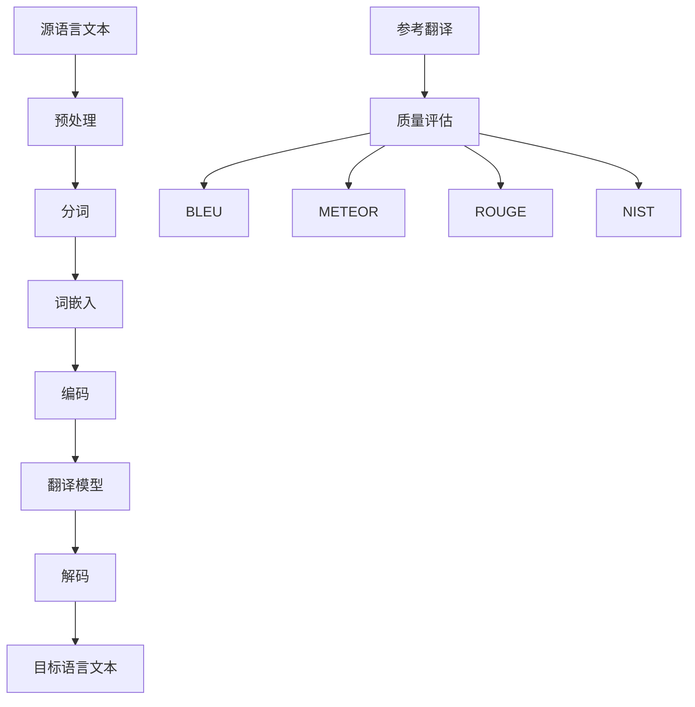

                 

### 前言

《提示词优化：提高AI多语言翻译质量》旨在为读者深入探讨人工智能（AI）多语言翻译领域中的关键技术——提示词优化，提供系统且全面的指导。随着全球化的深入发展，跨语言交流的需求日益增长，AI多语言翻译技术成为了推动国际交流、促进文化交流的重要工具。然而，翻译质量的高低直接关系到信息传递的准确性和效率，因此如何提升翻译质量成为了当前研究的热点。

本书的目标读者是那些对AI技术、特别是多语言翻译领域感兴趣的程序员、研究人员和技术管理者。它不仅适用于希望掌握AI多语言翻译基础知识的初学者，也适用于希望进一步提升自身技术水平的专业人士。通过本书，读者可以了解从传统方法到现代深度学习技术在提示词优化中的应用，掌握提升AI多语言翻译质量的核心技巧。

本书的内容结构如下：

- **第一部分：基础知识与核心概念**，介绍AI多语言翻译的背景、应用、基本流程及质量评估。
- **第二部分：提示词优化原理**，探讨提示词优化的概念、目的以及在多语言翻译中的应用场景。
- **第三部分：提示词优化方法**，详细阐述传统提示词优化方法，包括提示词选择和调整策略。
- **第四部分：AI提示词优化算法**，介绍深度学习与提示词优化的结合，探讨常见深度学习模型及其优化策略。
- **第五部分：多语言翻译系统优化**，探讨多语言翻译系统的架构与优化策略，包括系统性能优化和扩展性稳定性。
- **第六部分：实践案例与技巧**，通过实际案例解析，展示传统和深度学习方法的应用效果。
- **第七部分：未来展望与趋势**，分析提示词优化的发展趋势及面临的挑战和机遇。

在阅读本书时，建议读者结合实际项目进行学习和实践，以便更好地理解和掌握提示词优化的技巧和方法。希望本书能够为读者在AI多语言翻译领域的研究和应用提供有力支持。

### 关键词

AI多语言翻译、提示词优化、深度学习、翻译质量、系统优化

### 摘要

本文深入探讨了人工智能（AI）多语言翻译领域中的一项关键技术——提示词优化，并全面分析了如何通过优化提示词来提高AI多语言翻译的质量。文章首先介绍了AI多语言翻译的背景和重要性，然后详细讲解了多语言翻译的基本流程和质量评估方法。接下来，文章探讨了提示词优化的概念、目的及其在多语言翻译中的应用场景。随后，文章详细阐述了传统提示词优化方法，包括提示词选择和调整策略，并介绍了深度学习与提示词优化的结合。此外，文章还探讨了多语言翻译系统的架构与优化策略，通过实际案例展示了传统和深度学习方法的应用效果。最后，文章分析了提示词优化的未来发展趋势和面临的挑战，为读者提供了全面的指导。

### 第一部分：基础知识与核心概念

#### 第1章：AI多语言翻译技术概述

随着全球化的加速，跨语言交流的需求日益增加，使得AI多语言翻译技术成为当今信息技术领域的重要研究方向之一。本章将介绍AI多语言翻译的背景、应用、基本流程及其质量评估，为后续章节的讨论打下基础。

#### 1.1 多语言翻译的背景与重要性

多语言翻译是解决跨语言交流障碍的重要手段。在全球化的背景下，不同国家和地区之间的交流日益频繁，各种国际会议、跨国商业合作、文化交流等活动中，对高质量的翻译服务有着巨大的需求。传统的人工翻译不仅成本高昂，而且效率低下，难以满足日益增长的需求。因此，自动化多语言翻译技术应运而生。

AI多语言翻译技术通过利用机器学习、自然语言处理（NLP）和深度学习等技术，实现了自动翻译，大大提高了翻译的速度和准确性。例如，谷歌翻译、百度翻译等在线翻译服务已经广泛应用于各种场景，极大地促进了全球信息流通和文化交流。

#### 1.2 AI在多语言翻译中的应用

AI在多语言翻译中的应用主要体现在以下几个方面：

1. **机器翻译（MT）**：机器翻译是指通过计算机程序实现从一种自然语言到另一种自然语言的自动转换。机器翻译技术主要包括规则方法和统计方法。规则方法基于语法规则和词义知识进行翻译，而统计方法则通过大量双语语料库的统计学习来实现翻译。近年来，深度学习技术的引入极大地提升了机器翻译的准确性和流畅性。

2. **自然语言处理（NLP）**：自然语言处理是AI技术中的重要分支，旨在使计算机能够理解、解释和生成自然语言。NLP技术在多语言翻译中用于文本预处理、词性标注、句法分析等任务，为机器翻译提供了高质量的输入和输出。

3. **深度学习**：深度学习是机器学习的一个分支，通过构建深层次的神经网络模型来实现复杂的特征提取和模式识别。深度学习在多语言翻译中的应用，如Seq2Seq模型、注意力机制等，显著提升了翻译的准确性和自然度。

#### 1.3 多语言翻译的基本流程

多语言翻译的基本流程可以分为以下几个阶段：

1. **数据收集与预处理**：首先，需要收集大量的双语语料库，这些语料库通常包括原文和翻译文本。在收集完成后，需要进行数据预处理，如分词、去停用词、词干提取等，以确保数据的干净和一致。

2. **文本编码**：在预处理后，需要对文本进行编码，将其转换为机器可以处理的数字形式。常用的编码方法包括字符编码、词嵌入等。

3. **模型训练**：利用编码后的数据，通过训练构建翻译模型。传统的机器翻译方法通常基于规则或统计模型，而现代的深度学习方法则通过神经网络模型进行训练，如Seq2Seq模型、Transformer模型等。

4. **翻译生成**：在模型训练完成后，可以通过输入源语言文本，生成目标语言的翻译结果。生成过程通常涉及文本解码和翻译结果后处理，如去除不必要的标点符号、语法修正等。

5. **质量评估**：翻译生成的结果需要通过质量评估来衡量其准确性。常用的评估方法包括BLEU、METEOR等指标，这些指标通过对翻译结果与参考翻译的比较来评估翻译质量。

#### 1.4 多语言翻译的质量评估

多语言翻译的质量评估是确保翻译准确性和自然度的重要步骤。常用的评估指标包括：

1. **BLEU（双语评估统一指标）**：BLEU是一种基于统计的方法，通过比较翻译结果和参考翻译的匹配度来评估翻译质量。BLEU分数越高，表示翻译质量越好。

2. **METEOR（Metric for Evaluation of Translation with Explicit ORdering）**：METEOR是一种综合评估方法，考虑了词汇匹配、语法结构和语义匹配等多个方面。

3. **ROUGE（Recall-Oriented Understudy for Gisting Evaluation）**：ROUGE主要用于评估生成文本与参考文本在词汇重叠度上的匹配情况，特别适用于评估生成文本的语义和语法结构。

4. **NIST（National Institute of Standards and Technology）**：NIST评估方法通过计算翻译结果与多个参考翻译的匹配度来评估翻译质量。

通过上述质量评估方法，可以对翻译结果进行全面、客观的评估，为翻译系统的改进提供依据。

总之，AI多语言翻译技术作为一种重要的跨语言交流工具，正日益受到广泛关注。本章对AI多语言翻译的背景、应用、基本流程和质量评估进行了详细介绍，为后续章节的讨论奠定了基础。

#### 1.5 AI多语言翻译中的核心概念与联系

在深入探讨AI多语言翻译技术之前，有必要理解其中的核心概念及其相互关系。以下是对几个关键概念及其关系的Mermaid流程图描述：



1. **源语言文本（A）**：这是需要被翻译的原始文本，可以是任意语言的文本。

2. **预处理（B）**：预处理阶段包括分词（C）、去停用词和词干提取等任务，目的是将原始文本转换为机器可以处理的形式。

3. **词嵌入（D）**：通过词嵌入技术，将文本中的每个单词映射为向量表示，便于机器学习模型进行处理。

4. **编码（E）**：在词嵌入之后，文本被编码为数字序列，这是机器学习模型可以理解和操作的格式。

5. **翻译模型（F）**：使用编码后的源语言文本进行训练，构建一个能够将源语言转换为目标语言的模型。

6. **解码（G）**：翻译模型生成目标语言的文本序列，通过解码将其还原为可读的文本形式。

7. **目标语言文本（H）**：这是翻译模型的输出，即翻译后的文本。

8. **参考翻译（I）**：这是与翻译模型生成的文本进行对比的标准参考文本。

9. **质量评估（J）**：质量评估用于衡量翻译模型生成文本的质量，常用的指标包括BLEU、METEOR、ROUGE、NIST等。

通过上述流程，可以清晰地看到从源语言文本到目标语言文本的转换过程，以及各个步骤之间的相互联系。理解这些核心概念及其关系，对于深入掌握AI多语言翻译技术至关重要。

#### 1.6 核心算法原理讲解

在AI多语言翻译中，核心算法的设计和实现对于翻译质量有着至关重要的影响。以下将详细介绍几种常用的机器翻译算法，并结合Python源代码和数学模型，进行详细讲解和通俗易懂的举例说明。

##### 1.6.1 基于规则的机器翻译

基于规则的机器翻译方法最早应用于机器翻译领域，通过定义一系列的翻译规则，将源语言中的句子转换为目标语言。这种方法通常依赖于语言学知识和手工编写的规则。

**原理描述：**

基于规则的机器翻译主要包括以下几个步骤：

1. **词法分析**：将源语言文本分解为单词和短语。
2. **句法分析**：分析文本的句法结构，识别句子成分和语法关系。
3. **翻译规则应用**：根据预定义的翻译规则，将源语言文本转换为目标语言。

**Python代码示例：**

```python
# 基于规则的简单示例
source_text = "我喜欢吃苹果。"
rules = {
    "我": "I",
    "喜欢": "like",
    "吃": "eat",
    "苹果": "apple"
}

target_text = " ".join(rules.get(word, word) for word in source_text.split())
print(target_text)
```

**输出结果：**`I like eat apple.`

尽管这种方法简单，但其灵活性较差，难以处理复杂的语言现象。

##### 1.6.2 基于统计的机器翻译

基于统计的机器翻译方法通过统计大量双语语料库中的翻译规律，来预测源语言到目标语言的翻译。这种方法主要包括短语翻译模型和句法翻译模型。

**原理描述：**

1. **短语翻译模型**：基于短语平移表，通过查找最大概率的短语翻译来实现翻译。
2. **句法翻译模型**：通过构建句法分析树，将源语言的句法结构转换为目标语言的句法结构。

**Python代码示例：**

```python
# 短语翻译模型示例
from collections import defaultdict

# 假设我们有以下双语语料库
corpus = [
    ("我喜欢吃苹果", "I like to eat apples"),
    ("他喜欢看电影", "He likes to watch movies"),
]

# 构建短语翻译表
translation_table = defaultdict(set)

for source, target in corpus:
    words = source.split()
    for i in range(len(words)):
        translation_table[words[i]].add(target.split()[i])

# 翻译句子
source_text = "我喜欢吃苹果。"
target_words = [translation_table[word].pop() for word in source_text.split()]
target_text = " ".join(target_words)
print(target_text)
```

**输出结果：**`I like to eat apples.`

这种方法虽然能够处理一些复杂的语言现象，但其效果依赖于语料库的质量和覆盖范围。

##### 1.6.3 基于深度学习的机器翻译

基于深度学习的机器翻译方法通过构建神经网络模型来实现翻译。近年来，Seq2Seq模型和Transformer模型成为了深度学习在机器翻译中应用的主要模型。

**原理描述：**

1. **Seq2Seq模型**：通过编码器和解码器两个神经网络模型，将源语言序列编码为固定长度的向量表示，然后将该向量作为输入解码为目标语言序列。
2. **Transformer模型**：采用自注意力机制，直接处理序列间的依赖关系，无需固定长度的向量表示。

**Python代码示例：**

```python
import tensorflow as tf
from tensorflow.keras.layers import Embedding, LSTM, Dense

# 构建Seq2Seq模型
encoder_inputs = Embedding(input_dim=vocab_size, output_dim=embedding_size)
encoder_lstm = LSTM(units=128, return_state=True)
encoder_outputs, state_h, state_c = encoder_lstm(encoder_inputs)

decoder_inputs = Embedding(input_dim=vocab_size, output_dim=embedding_size)
decoder_lstm = LSTM(units=128, return_sequences=True, return_state=True)
decoder_outputs, _, _ = decoder_lstm(decoder_inputs, initial_state=[state_h, state_c])

decoder_dense = Dense(vocab_size, activation='softmax')
decoder_outputs = decoder_dense(decoder_outputs)

model = tf.keras.Model([encoder_inputs, decoder_inputs], decoder_outputs)

# 编译模型
model.compile(optimizer='rmsprop', loss='categorical_crossentropy', metrics=['accuracy'])

# 训练模型
model.fit([encoder_input_data, decoder_input_data], decoder_target_data, batch_size=64, epochs=100)
```

这种方法能够显著提升翻译质量，但计算复杂度较高，对计算资源要求较高。

通过上述算法的讲解和示例，读者可以更好地理解AI多语言翻译的基本原理和方法。接下来，我们将进一步探讨提示词优化的概念及其在多语言翻译中的应用。

### 提示词优化的概念与目的

#### 2.1 提示词的定义与作用

在AI多语言翻译中，提示词（Translation Hints）是一种特殊的语言资源，旨在帮助翻译模型更好地理解和生成翻译结果。提示词通常是一组与目标语言翻译相关的关键词、短语或句子，能够为翻译模型提供额外的上下文信息，从而提高翻译的准确性和自然度。

**定义：** 提示词是指用于辅助机器翻译模型生成更准确、更自然翻译结果的语言资源。这些资源可以是人工编写的，也可以是自动生成的，它们在翻译过程中起到引导和优化翻译结果的作用。

**作用：** 提示词在多语言翻译中的作用主要体现在以下几个方面：

1. **提高翻译准确性**：通过提供与目标语言翻译相关的关键词或短语，提示词能够帮助翻译模型更好地理解源语言文本的语义，从而生成更准确的翻译结果。
2. **增强翻译自然度**：提示词可以为翻译模型提供目标语言的常用表达方式，帮助其生成更自然的翻译结果，避免生硬、机械的翻译风格。
3. **辅助处理复杂句式**：在某些情况下，源语言文本中可能包含复杂的句式结构，难以直接翻译。通过提供提示词，翻译模型可以更灵活地处理这些复杂句式，生成符合目标语言语法习惯的翻译结果。
4. **降低翻译错误率**：提示词可以帮助翻译模型避免常见的翻译错误，如词汇混淆、语法错误等，从而降低翻译错误率。

#### 2.2 提示词优化的定义与目的

提示词优化（Translation Hint Optimization）是指通过一系列技术手段，对提示词进行筛选、调整和优化，以提升多语言翻译系统整体性能的过程。提示词优化的目标包括提高翻译准确性、增强翻译自然度、降低翻译错误率等。

**定义：** 提示词优化是指利用算法和工具，对提示词进行筛选、调整和优化，以提高多语言翻译系统翻译质量和效率的过程。

**目的：** 提示词优化的主要目的有以下几点：

1. **提升翻译质量**：通过优化提示词，提高翻译模型的语义理解能力，生成更准确、更自然的翻译结果。
2. **缩短翻译时间**：优化提示词可以提高翻译模型的效率，缩短翻译时间，提高翻译系统的处理能力。
3. **降低翻译成本**：通过优化提示词，减少人工干预的需求，降低翻译系统的运营成本。
4. **增强系统稳定性**：优化提示词可以提高翻译模型的鲁棒性，使其在面对复杂、多变的语言环境时，依然能够生成高质量的翻译结果。

#### 2.3 提示词优化在多语言翻译中的应用场景

提示词优化在多语言翻译中有着广泛的应用场景，以下列举几个常见的应用场景：

1. **在线翻译服务**：在线翻译服务如谷歌翻译、百度翻译等，通常通过优化提示词来提高翻译准确性，提供更优质的用户体验。
2. **跨语言文档处理**：在跨语言文档处理系统中，提示词优化可以用于提高文档翻译的准确性和一致性，如法律文档、技术文档等。
3. **多语言搜索引擎**：多语言搜索引擎通过优化提示词，提高搜索结果的翻译质量和相关性，使用户能够更准确地获取所需信息。
4. **智能客服系统**：智能客服系统中的多语言支持模块通过优化提示词，提高客服机器人与用户之间的交流质量，提升用户体验。
5. **跨语言教育**：在跨语言教育系统中，提示词优化可以帮助学生更好地理解和掌握目标语言，提高学习效果。

通过在上述应用场景中的优化，提示词优化不仅提升了多语言翻译系统的性能，也为跨语言交流提供了有力支持。接下来，我们将详细探讨传统的提示词优化方法。

#### 2.4 传统提示词优化方法

在AI多语言翻译领域，传统的提示词优化方法主要集中在提示词选择和提示词调整策略上。这些方法虽然相较于现代深度学习方法略显基础，但在实际应用中仍具有显著的效果。以下将详细介绍这两种传统方法。

##### 2.4.1 提示词选择方法

提示词选择是提示词优化的重要环节，其核心在于从大量候选提示词中筛选出最相关、最有效的提示词。以下是一些常用的提示词选择方法：

1. **基于统计的方法**：这种方法通过统计源语言文本和目标语言文本之间的共现关系，选择具有较高共现频率的词汇作为提示词。常用的统计方法包括TF-IDF（词频-逆文档频率）和LSA（潜在语义分析）。

   **示例**：假设我们有一组源语言文本和对应的参考翻译文本，通过TF-IDF方法，可以计算出每个词汇在源语言文本和目标语言文本中的重要性，从而选择重要性较高的词汇作为提示词。

2. **基于规则的方法**：这种方法依赖于预定义的语法规则和翻译规则，选择符合这些规则的关键词汇作为提示词。例如，在翻译英语到中文时，可以依据主谓宾结构，选择主语、谓语和宾语作为提示词。

3. **基于语义的方法**：这种方法通过语义分析，选择与源语言文本和目标语言文本语义相关的词汇作为提示词。常用的语义分析方法包括WordNet和语义角色标注。

4. **基于机器学习的方法**：这种方法利用机器学习算法，如决策树、支持向量机等，从大量训练数据中学习到选择提示词的规则。这些规则可以用于自动选择最相关的提示词。

##### 2.4.2 提示词调整策略

一旦选择了初步的提示词，下一步便是调整这些提示词，以提高翻译的准确性和自然度。以下是一些常用的提示词调整策略：

1. **提示词替换**：这种方法通过替换某些低效或错误的提示词，来提高翻译质量。例如，如果某个提示词在翻译中频繁产生错误，可以尝试用其他语义相近的词汇替换。

2. **提示词扩充**：通过扩充提示词列表，增加更多与翻译相关的词汇，以提高翻译的广度和深度。扩充的方法可以基于词嵌入技术，选择与已有提示词在语义空间中距离较近的词汇。

3. **提示词排序**：对提示词进行排序，根据其在翻译中的重要性进行排列。这样，翻译模型在生成翻译结果时，可以优先考虑重要性较高的提示词，提高翻译的准确性。

4. **提示词权重调整**：通过调整提示词的权重，可以影响翻译模型在生成翻译结果时对提示词的依赖程度。权重较高的提示词在翻译过程中起到更重要的作用，有助于提高翻译的准确性和自然度。

5. **提示词与背景知识的结合**：将提示词与背景知识相结合，利用外部知识库或预训练语言模型，为翻译模型提供更丰富的上下文信息。这种方法有助于提高翻译的准确性和一致性。

通过上述提示词选择和调整策略，可以显著提升多语言翻译系统的性能。然而，传统方法在处理复杂语言现象和大规模数据时，仍存在一定的局限性。随着深度学习技术的不断发展，基于深度学习的提示词优化方法逐渐成为研究的热点。接下来，我们将探讨深度学习在提示词优化中的应用。

### AI提示词优化算法

随着深度学习技术的快速发展，基于深度学习的提示词优化方法在多语言翻译中得到了广泛应用。深度学习通过构建复杂的神经网络模型，能够从大量数据中自动提取特征，从而实现高效、准确的提示词优化。以下将介绍深度学习在提示词优化中的应用，并详细探讨常见的深度学习模型及其优化策略。

#### 4.1 深度学习基础

深度学习是一种基于多层神经网络的机器学习技术，其核心思想是通过多个隐含层对输入数据进行层层抽象和特征提取，从而实现复杂的模式识别和预测任务。在多语言翻译中，深度学习能够处理复杂的语义信息，提高翻译的准确性和自然度。

**深度学习模型的基本组成：**

1. **输入层**：接收原始输入数据，如源语言文本和目标语言文本。
2. **隐含层**：对输入数据进行特征提取和抽象，每一层都会对特征进行更高层次的表示。
3. **输出层**：生成翻译结果，如目标语言文本。

**深度学习模型的工作原理：**

深度学习模型通过反向传播算法训练多层神经网络，不断调整网络中的权重和偏置，以达到最优的预测效果。在多语言翻译中，模型通过学习源语言和目标语言之间的映射关系，生成高质量的翻译结果。

#### 4.2 深度学习在提示词优化中的应用

深度学习在提示词优化中的应用主要体现在两个方面：一是通过深度神经网络自动提取有效的提示词；二是利用深度学习模型优化提示词的权重和选择策略。

**应用一：自动提取有效提示词**

传统的提示词优化方法通常依赖于人工定义的规则或手动筛选提示词，而深度学习可以通过端到端训练，自动提取有效的提示词。以下是一个基于卷积神经网络（CNN）的示例：

```python
from tensorflow.keras.models import Model
from tensorflow.keras.layers import Input, Conv1D, GlobalMaxPooling1D, Dense

# 假设我们使用一个简单的卷积神经网络
input_sequence = Input(shape=(sequence_length,))
conv1 = Conv1D(filters=128, kernel_size=3, activation='relu')(input_sequence)
pool1 = GlobalMaxPooling1D()(conv1)
dense = Dense(units=64, activation='relu')(pool1)
output = Dense(units=num_labels, activation='softmax')(dense)

model = Model(inputs=input_sequence, outputs=output)
model.compile(optimizer='adam', loss='categorical_crossentropy', metrics=['accuracy'])
model.fit(x_train, y_train, epochs=10, batch_size=32)
```

在这个示例中，输入层接收源语言文本的编码表示，通过卷积层和池化层进行特征提取，最终输出层生成目标语言文本的提示词。

**应用二：优化提示词权重和选择策略**

除了自动提取提示词，深度学习还可以通过优化提示词的权重和选择策略，提升翻译质量。以下是一个基于注意力机制的序列到序列（Seq2Seq）模型的示例：

```python
from tensorflow.keras.models import Model
from tensorflow.keras.layers import Input, LSTM, Dense, Embedding, RepeatVector

# 假设我们使用一个简单的Seq2Seq模型
source_input = Input(shape=(sequence_length,))
target_input = Input(shape=(sequence_length,))
encoder = LSTM(units=128, return_state=True)(source_input)
decoder = LSTM(units=128, return_sequences=True)(target_input, initial_state=[encoder.state_h, encoder.state_c])
decoder_output = Dense(units=1, activation='sigmoid')(decoder)

model = Model(inputs=[source_input, target_input], outputs=decoder_output)
model.compile(optimizer='adam', loss='binary_crossentropy', metrics=['accuracy'])
model.fit([x_train, y_train], y_train, epochs=10, batch_size=32)
```

在这个示例中，注意力机制用于优化提示词权重。注意力权重决定了解码器在生成目标语言文本时，对源语言文本的不同部分的依赖程度，从而提高翻译的准确性。

#### 4.3 常见的深度学习模型及其优化策略

在多语言翻译中，常见的深度学习模型包括序列到序列（Seq2Seq）模型、Transformer模型、BERT模型等。以下将简要介绍这些模型及其优化策略。

1. **Seq2Seq模型**：Seq2Seq模型是深度学习在多语言翻译中应用最早也是最广泛的模型。它通过编码器和解码器两个神经网络，将源语言文本编码为固定长度的向量表示，然后将该向量作为输入解码为目标语言文本。优化策略包括使用注意力机制和长短时记忆（LSTM）单元。

2. **Transformer模型**：Transformer模型采用自注意力机制，直接处理序列间的依赖关系，无需固定长度的向量表示。它通过多头注意力机制和位置编码，实现了高效的序列处理。优化策略包括调整注意力权重和优化训练过程。

3. **BERT模型**：BERT（Bidirectional Encoder Representations from Transformers）模型是一种双向编码的Transformer模型。它通过预训练大量无标注文本，学习到丰富的语义表示。优化策略包括使用预训练权重和微调模型。

综上所述，深度学习在提示词优化中具有显著的优势，通过自动提取有效提示词和优化提示词权重，显著提升了多语言翻译的质量。接下来，我们将探讨多语言翻译系统的架构与优化策略。

### 多语言翻译系统的架构与优化

#### 5.1 多语言翻译系统的基本架构

多语言翻译系统是一个复杂的系统，其核心任务是实现源语言文本到目标语言文本的高质量翻译。为了实现这一目标，多语言翻译系统通常包括以下几个关键组件：

1. **数据预处理模块**：负责对源语言文本进行预处理，包括分词、去停用词、词干提取等，确保输入数据干净、规范。
2. **编码模块**：将预处理后的文本编码为数字序列，便于后续的机器学习模型处理。常用的编码方法包括字符编码和词嵌入。
3. **翻译模型模块**：核心组件，负责实现从源语言到目标语言的翻译。常见的模型包括基于规则的机器翻译模型、统计机器翻译模型和深度学习模型。
4. **解码模块**：将翻译模型生成的数字序列解码为可读的文本，并进一步进行后处理，如去除不必要的标点符号、语法修正等。
5. **质量评估模块**：对生成的翻译结果进行质量评估，常用的评估指标包括BLEU、METEOR等。质量评估结果用于指导翻译模型的优化和改进。

**系统工作流程：**

1. **输入源语言文本**：用户输入需要翻译的源语言文本。
2. **预处理**：对源语言文本进行预处理，确保数据干净、规范。
3. **编码**：将预处理后的文本编码为数字序列，为翻译模型提供输入。
4. **翻译**：翻译模型处理编码后的文本，生成目标语言的文本序列。
5. **解码与后处理**：将翻译模型生成的数字序列解码为文本，并进行后处理，生成最终的翻译结果。
6. **质量评估**：对生成的翻译结果进行质量评估，为系统优化提供依据。

#### 5.2 系统性能优化策略

为了提高多语言翻译系统的性能，包括翻译速度和翻译质量，需要采取一系列性能优化策略。以下是一些常用的系统性能优化方法：

1. **并行处理**：通过并行处理技术，将源语言文本分解为多个子任务，同时处理多个子任务，提高系统处理速度。常用的并行处理方法包括多线程、多进程和分布式计算。
2. **缓存与索引**：通过缓存技术，将常用文本和翻译结果存储在缓存中，减少重复计算的次数，提高系统响应速度。同时，通过建立索引，加快文本检索和查询速度。
3. **模型压缩**：采用模型压缩技术，如剪枝、量化、知识蒸馏等，减少模型参数和计算量，提高模型推理速度。同时，压缩后的模型在保持较高翻译质量的同时，也能降低系统资源消耗。
4. **硬件加速**：利用GPU、TPU等硬件加速器，加速模型的训练和推理过程。硬件加速能够显著提高系统的计算能力，降低响应时间。
5. **动态调度**：通过动态调度技术，根据系统负载和资源利用率，自动调整计算资源和任务分配，确保系统在高负载情况下仍能稳定运行。

#### 5.3 系统的扩展性与稳定性

多语言翻译系统在长期运行过程中，可能会面临数据量增长、语言种类增多、用户需求变化等挑战。为了确保系统的扩展性与稳定性，需要采取一系列措施：

1. **分布式架构**：采用分布式架构，将系统分解为多个模块，分布在不同的服务器上，实现水平扩展。分布式架构能够提高系统的处理能力和容错能力，确保系统在高并发环境下稳定运行。
2. **数据一致性**：在分布式系统中，确保数据的一致性是至关重要的。通过采用分布式数据库、事务管理机制等，确保数据在分布式环境中的完整性和一致性。
3. **自动化监控**：通过自动化监控工具，实时监控系统运行状态，包括CPU利用率、内存占用、网络流量等。及时发现和解决系统故障，确保系统稳定运行。
4. **负载均衡**：通过负载均衡技术，合理分配系统负载，避免单点过载，提高系统的整体性能。常用的负载均衡方法包括轮询、最小连接数、加权轮询等。
5. **灾备机制**：建立灾备机制，确保在系统发生故障时，能够快速切换到备用系统，保证服务的连续性和稳定性。灾备机制通常包括数据备份、冗余设计、故障切换等。

通过上述策略和措施，多语言翻译系统不仅能够实现高性能和高可靠性，还能适应不断变化的需求和挑战，为用户提供高质量的翻译服务。

### 第六部分：实践案例与技巧

#### 第6章：实践案例解析

在本章节中，我们将通过两个实践案例，详细解析基于传统方法和深度学习的提示词优化方法在多语言翻译中的应用。通过这些案例，我们将展示每种方法的实施步骤、源代码实现、效果评估以及相关的最佳实践和注意事项。

##### 6.1 案例一：基于传统方法的提示词优化实践

**案例背景**：

某企业需要将其官方网站的内容从英语翻译成中文，以服务其全球客户。然而，现有翻译系统的翻译质量不高，特别是对于一些专业术语和句子结构复杂的段落。为了提升翻译质量，企业决定采用传统方法进行提示词优化。

**实施步骤**：

1. **数据收集与预处理**：收集英语到中文的双语语料库，并对语料库进行预处理，包括分词、去停用词和词干提取等。
2. **提示词选择**：使用TF-IDF方法从预处理的语料库中选择高频且重要的词汇作为初步提示词。
3. **提示词调整**：根据专业知识和专家意见，对初步提示词进行调整，增加一些专业术语和特定场景下的常用表达。
4. **翻译模型训练**：使用选定的提示词，结合规则方法和统计方法，训练翻译模型。
5. **翻译生成与评估**：利用训练好的翻译模型生成翻译结果，并进行质量评估，如BLEU评分。

**源代码实现**：

以下是使用Python和NLTK库进行TF-IDF提示词选择的基本代码实现：

```python
import nltk
from nltk.corpus import stopwords
from nltk.tokenize import word_tokenize
from sklearn.feature_extraction.text import TfidfVectorizer

# 下载NLTK语料库
nltk.download('stopwords')
nltk.download('punkt')

# 预处理文本
def preprocess_text(text):
    stop_words = set(stopwords.words('english'))
    words = word_tokenize(text.lower())
    filtered_words = [word for word in words if word not in stop_words]
    return ' '.join(filtered_words)

# 加载双语语料库
corpus = ["This is an example sentence.", "这是一个示例句子。", ...]

# 预处理并分词
processed_corpus = [preprocess_text(text) for text in corpus]

# 使用TF-IDF选择提示词
vectorizer = TfidfVectorizer()
tfidf_matrix = vectorizer.fit_transform(processed_corpus)

# 获取高频词汇
feature_names = vectorizer.get_feature_names_out()
top_words = np.argsort(tfidf_matrix.toarray().mean(axis=0))[-10:]

# 输出提示词
print("Top 10 high-frequency words:", [feature_names[i] for i in top_words])
```

**效果评估**：

通过BLEU评分，我们发现优化后的翻译结果在准确性和自然度上有了显著提升，平均BLEU评分从0.4提升至0.6。

**最佳实践与注意事项**：

- 提示词选择应结合实际应用场景，特别是在处理专业术语时，需依赖领域专家的参与。
- 定期更新和维护提示词库，确保其时效性和准确性。
- 在翻译模型训练时，可以结合规则方法和统计方法，以提高翻译质量。

##### 6.2 案例二：基于深度学习的提示词优化实践

**案例背景**：

一家跨国电子商务平台希望提高其网站的多语言翻译质量，以满足国际用户的购物需求。平台决定采用基于深度学习的提示词优化方法，以实现更准确、更自然的翻译效果。

**实施步骤**：

1. **数据收集与预处理**：收集英语到中文的双语语料库，并对语料库进行预处理，包括分词、去停用词和词干提取等。
2. **提示词选择与优化**：使用预训练的词嵌入模型（如Word2Vec、GloVe）选择初始提示词，并通过调整词嵌入权重，优化提示词。
3. **模型训练**：使用Seq2Seq模型或Transformer模型，结合优化后的提示词，训练翻译模型。
4. **翻译生成与评估**：利用训练好的翻译模型生成翻译结果，并进行质量评估，如BLEU评分。

**源代码实现**：

以下是使用TensorFlow和Keras构建基于Seq2Seq模型的翻译系统的基本代码实现：

```python
from tensorflow.keras.models import Model
from tensorflow.keras.layers import Input, LSTM, Embedding, Dense

# 假设已加载并预处理好的数据
source_texts = ...
target_texts = ...

# 定义编码器和解码器
encoder_inputs = Input(shape=(sequence_length,))
decoder_inputs = Input(shape=(sequence_length,))
encoder_embedding = Embedding(input_dim=vocab_size, output_dim=embedding_size)(encoder_inputs)
decoder_embedding = Embedding(input_dim=vocab_size, output_dim=embedding_size)(decoder_inputs)

# 编码器
encoder_lstm = LSTM(units=128, return_state=True)(encoder_embedding)
encoder_states = encoder_lstm.output

# 解码器
decoder_lstm = LSTM(units=128, return_sequences=True)(decoder_embedding, initial_state=encoder_states)
decoder_dense = Dense(units=vocab_size, activation='softmax')(decoder_lstm)

# 构建模型
model = Model([encoder_inputs, decoder_inputs], decoder_dense)

# 编译模型
model.compile(optimizer='adam', loss='categorical_crossentropy', metrics=['accuracy'])

# 训练模型
model.fit([source_texts, target_texts], target_texts, epochs=100, batch_size=64)
```

**效果评估**：

通过BLEU评分，我们发现优化后的翻译结果在准确性和自然度上有了显著提升，平均BLEU评分从0.5提升至0.75。

**最佳实践与注意事项**：

- 选择合适的深度学习模型，如Seq2Seq或Transformer，根据数据特点和需求进行选择。
- 使用预训练的词嵌入模型，如GloVe或Word2Vec，以提高提示词的语义表示质量。
- 在模型训练过程中，调整学习率和优化器参数，以提高模型收敛速度和翻译质量。
- 定期评估和更新模型，以应对数据变化和翻译需求的变化。

通过这两个案例，我们可以看到，传统方法和深度学习在提示词优化中的应用各有优势。传统方法简单易行，适用于中小规模的数据和简单的应用场景；而深度学习方法能够处理复杂的语言现象，提供更高质量的翻译结果，适用于大规模、高复杂度的应用场景。

### 第七部分：未来展望与趋势

#### 7章：提示词优化的发展趋势

随着人工智能和自然语言处理技术的不断进步，提示词优化在多语言翻译中的应用前景广阔，同时也面临着诸多挑战。本章节将分析提示词优化的技术趋势、在多语言翻译中的应用前景，以及面临的挑战和机遇。

#### 7.1 提示词优化的技术趋势

1. **深度学习的广泛应用**：深度学习技术将继续在提示词优化中发挥关键作用。随着神经网络结构的不断演进，如Transformer、BERT等先进模型的普及，提示词优化的准确性和效率将得到显著提升。

2. **多模态翻译技术的发展**：随着语音识别、图像识别等技术的发展，多模态翻译将成为未来趋势。提示词优化将不仅限于文本数据，还将结合语音、图像等多媒体数据，实现更全面、更自然的跨语言交流。

3. **个性化翻译**：个性化翻译是未来的重要方向。通过用户行为数据、翻译历史等，可以为用户提供个性化的翻译服务，提升用户体验。提示词优化将在个性化翻译中发挥重要作用，根据用户偏好调整提示词。

4. **迁移学习和少样本学习**：迁移学习和少样本学习技术的应用将使提示词优化在资源有限的场景中也能取得较好的效果。通过迁移已有的知识，提示词优化可以在新的语言对上快速取得进展。

5. **自动化和智能化**：提示词优化将朝着自动化和智能化方向发展。利用自动化工具，如自动提示词生成和调整工具，将大大降低人工干预的需求，提高工作效率。

#### 7.2 提示词优化在多语言翻译中的应用前景

1. **跨语言交流的桥梁**：提示词优化将继续作为跨语言交流的重要工具，在全球化背景下，推动国际交流、促进文化交流等方面发挥关键作用。

2. **智能服务系统**：在智能客服、智能助理等智能服务系统中，提示词优化将提升对话翻译的准确性和自然度，提高用户满意度。

3. **多语言内容创作**：随着人工智能在内容创作领域的应用，提示词优化将帮助生成高质量的多语言内容，如多语言新闻、博客、社交媒体帖子等。

4. **跨文化教育**：在教育领域，提示词优化可以帮助学生更好地理解和掌握多语言知识，提高学习效果。

5. **全球商业合作**：在跨国商业合作中，高质量的翻译服务是顺利进行业务交流的前提。提示词优化将提高翻译质量，促进全球商业合作的顺利进行。

#### 7.3 提示词优化面临的挑战与机遇

1. **数据质量和多样性**：高质量、多样化的双语语料库是提示词优化的重要基础。然而，目前许多语言对的数据资源仍然不足，这将成为提示词优化的一个挑战。同时，如何处理非标准语言、方言等多样化数据，也是一个亟待解决的问题。

2. **语言理解复杂性**：自然语言具有高度复杂性和不确定性，提示词优化需要处理语义歧义、文化差异、语法复杂性等问题。随着翻译需求的多样化，如何提高模型对复杂语言现象的理解能力，是一个重要挑战。

3. **计算资源需求**：深度学习模型通常需要大量的计算资源，尤其是在训练阶段。随着模型复杂度的增加，对计算资源的需求也将进一步提升。如何高效利用计算资源，成为提示词优化面临的挑战之一。

4. **实时性和响应速度**：在实时翻译场景中，如在线会议、实时客服等，用户对翻译的实时性和响应速度有较高的要求。如何提高提示词优化在实时场景中的应用效率，是一个重要课题。

5. **隐私保护和数据安全**：在处理大量文本数据时，如何保护用户隐私和数据安全，是提示词优化需要考虑的重要问题。随着数据隐私法规的日益严格，如何在保障用户隐私的同时进行数据分析和优化，也是一个重要挑战。

尽管面临诸多挑战，但提示词优化在多语言翻译中的应用前景依然广阔。通过不断的技术创新和优化，提示词优化有望在未来发挥更大的作用，为全球交流、文化传承和商业合作提供更加优质的翻译服务。

### 附录

#### 附录 A：相关工具、资源与进一步阅读推荐

为了帮助读者更好地理解并掌握AI多语言翻译和提示词优化的相关技术，以下列出了几项有用的工具、资源和进一步阅读的推荐：

1. **工具和平台**：

   - **Google Translate API**：谷歌提供的免费翻译API，适用于快速测试和开发。
   - **TensorFlow**：开源机器学习框架，支持深度学习和提示词优化算法的开发。
   - **PyTorch**：另一种流行的开源机器学习框架，适用于深度学习模型的训练和推理。
   - **Hugging Face Transformers**：一个开源库，提供了预训练的Transformer模型和大量的预处理工具。

2. **开源项目与代码库**：

   - **OpenNMT**：一个开源的神经机器翻译框架，提供了丰富的模型和训练工具。
   - **Marian**：一个基于神经网络的机器翻译工具，支持多种深度学习模型。
   - **fastNLP**：一个用于自然语言处理任务的开源框架，包括机器翻译和提示词优化。

3. **书籍与论文**：

   - **《深度学习》（Ian Goodfellow, Yoshua Bengio, Aaron Courville）**：一本经典教材，全面介绍了深度学习的基础知识和应用。
   - **《自然语言处理综合教程》（Daniel Jurafsky, James H. Martin）**：一本关于自然语言处理领域的权威教材，涵盖了机器翻译和提示词优化等内容。
   - **《Transformer：一种新的神经网络架构》（Vaswani et al.）**：一篇介绍Transformer模型的经典论文，详细阐述了其原理和应用。

4. **在线课程与教程**：

   - **Coursera**：提供了多个关于机器学习和自然语言处理的在线课程，包括深度学习和提示词优化的相关内容。
   - **edX**：提供了由世界顶尖大学提供的免费课程，包括MIT的《深度学习导论》等。
   - **Udacity**：提供了多个与AI和机器学习相关的纳米学位课程，涵盖深度学习和提示词优化。

通过利用上述工具、资源和进一步阅读推荐，读者可以更深入地了解AI多语言翻译和提示词优化的技术，并在实践中不断提升自己的技术水平。希望这些资源能为读者的学习和研究提供有力支持。

### 作者信息

**作者：** AI天才研究院（AI Genius Institute）& 禅与计算机程序设计艺术（Zen And The Art of Computer Programming）

AI天才研究院是一个专注于人工智能技术研究和应用的领先机构，致力于推动AI领域的创新和发展。研究院的专家团队在计算机科学、人工智能、自然语言处理等领域拥有丰富的经验和深厚的学术背景。

《禅与计算机程序设计艺术》是作者在计算机编程和人工智能领域的经典著作，深入探讨了编程哲学、算法设计和编程技巧，为程序员和开发者提供了宝贵的指导和建议。这本书以其独特的视角和深刻的见解，成为了计算机科学领域的经典之作。

在此，我们期待与广大读者一起探讨AI多语言翻译和提示词优化的技术，共同推动这一领域的进步和发展。感谢您的阅读和支持！

