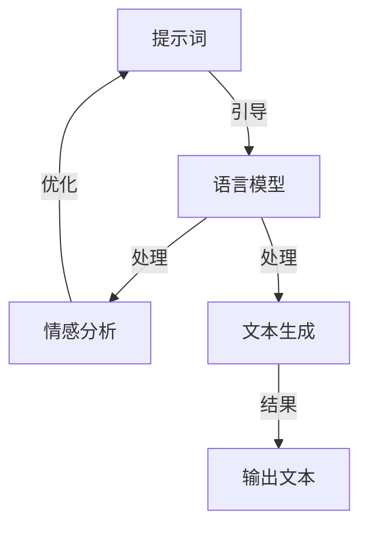

                 

### 背景介绍

提示词优化，作为人工智能领域的一项关键技术，近年来受到了越来越多的关注。其核心目的是通过改进输入提示词的质量，来提升人工智能系统的输出效果，尤其是在幽默感与创意表达方面。在传统的人工智能应用中，系统往往只能按照既定的算法和模型进行操作，缺乏灵活性和创意。而提示词优化则通过调整输入提示词，使得AI系统能够更准确地理解用户意图，并在此基础上生成更具幽默感和创意的输出内容。

幽默感和创意在人工智能中的应用，主要体现在文本生成、对话系统以及娱乐内容创作等领域。例如，在文本生成中，通过优化提示词，AI系统能够生成更加生动有趣的对话和故事；在对话系统中，优化的提示词能够使得AI更加理解用户情感，生成更为自然和幽默的回答；在娱乐内容创作中，提示词优化可以帮助AI创作出更加引人入胜的剧本和段子，提升用户的娱乐体验。

当前，随着深度学习和自然语言处理技术的不断发展，提示词优化已经取得了显著进展。语言模型、情感分析以及自然语言处理技术等在提示词优化中的应用，极大地提升了AI系统的幽默感和创意表达能力。然而，这一领域仍然面临着诸多挑战，例如如何提高算法的稳定性与效率，以及如何解决数据多样性和质量等问题。因此，深入研究和探讨提示词优化的方法和应用，具有重要的理论和实践意义。

本文将系统地介绍提示词优化的基础概念、技术手段、实践应用以及发展趋势和挑战。通过详细的案例分析，我们将展示如何通过提示词优化来提升AI的幽默感和创意表达。同时，我们还将介绍一些实用的工具和资源，帮助读者更好地理解和应用提示词优化技术。最终，本文旨在为人工智能领域的研究者提供有价值的参考，推动提示词优化技术的进一步发展和应用。

### 核心概念与联系

在深入探讨提示词优化之前，我们需要明确几个核心概念，并理解它们之间的相互关系。以下是本文将涉及的主要概念及其关系架构：

1. **提示词（Prompt）**：
   - **定义**：提示词是用户或系统输入的信息，用于引导AI系统生成相应的输出。
   - **关系**：提示词的质量直接影响到AI系统的理解和生成效果。

2. **语言模型（Language Model）**：
   - **定义**：语言模型是一种用于预测自然语言中下一个词或句子的概率分布的算法。
   - **关系**：语言模型是提示词优化的基础，它能够帮助AI系统更好地理解和生成与提示词相关的文本。

3. **情感分析（Sentiment Analysis）**：
   - **定义**：情感分析是自然语言处理的一种技术，用于识别文本中的情感倾向。
   - **关系**：情感分析可以帮助优化提示词，使其更具情感色彩，从而提升AI输出的幽默感和创意。

4. **自然语言处理（Natural Language Processing, NLP）**：
   - **定义**：自然语言处理是一种让计算机理解和生成人类语言的技术。
   - **关系**：NLP涵盖了提示词优化所需的各种技术和方法，如分词、词性标注、命名实体识别等。

5. **文本生成（Text Generation）**：
   - **定义**：文本生成是指AI系统根据输入提示词生成新的文本内容。
   - **关系**：文本生成是提示词优化的直接应用，其效果直接受到提示词优化的影响。

为了更直观地理解这些概念之间的关系，我们可以使用Mermaid流程图来展示它们之间的互动关系：



在这个流程图中，提示词作为输入首先被传递给语言模型，语言模型对其进行处理，以生成相应的文本。在这个过程中，情感分析会实时优化提示词，使其更具情感色彩，进而提升文本生成的幽默感和创意。最终，生成的文本作为输出结果呈现给用户。

通过这种架构，我们可以清楚地看到，提示词优化不仅仅是对提示词的简单修改，而是一个复杂的过程，涉及多个核心概念的相互作用。理解这些概念及其关系，有助于我们更深入地研究和应用提示词优化技术。

### 核心算法原理讲解

在了解提示词优化的核心概念后，我们接下来将详细探讨其中的核心算法原理。这些算法包括语言模型、情感分析和自然语言处理技术，它们各自在提升AI幽默感和创意方面发挥着重要作用。

#### 语言模型

语言模型是提示词优化的基础，其基本原理是通过对大量文本数据进行训练，建立一个能够预测自然语言中下一个词或句子的概率分布的模型。最常用的语言模型包括n-gram模型、循环神经网络（RNN）以及Transformer模型。

1. **n-gram模型**：

n-gram模型是一种基于统计学的简单语言模型，它将文本序列分割成固定长度的连续词组（n-gram），并计算这些词组的联合概率。其公式如下：

$$ P(w_1, w_2, ..., w_n) = P(w_1) \cdot P(w_2 | w_1) \cdot P(w_3 | w_1 w_2) \cdot ... \cdot P(w_n | w_1 w_2 ... w_{n-1}) $$

其中，$w_i$表示第i个词。尽管n-gram模型简单易实现，但其表现往往受到短文本依赖性的限制。

2. **循环神经网络（RNN）**：

RNN是一种能够处理序列数据的神经网络，其核心思想是通过隐藏状态捕捉文本序列中的长期依赖关系。RNN的输出依赖于其前一时刻的隐藏状态，其公式如下：

$$ h_t = \sigma(W_h \cdot [h_{t-1}, x_t] + b_h) $$

其中，$h_t$表示第t个时间步的隐藏状态，$\sigma$表示激活函数，$W_h$和$b_h$分别为权重和偏置。

然而，RNN存在梯度消失和梯度爆炸的问题，限制了其性能。

3. **Transformer模型**：

Transformer模型是一种基于自注意力机制的深度神经网络，其能够高效地处理长文本序列。Transformer的核心思想是通过计算词与词之间的相互依赖关系，从而生成高质量的文本。其自注意力机制可以表示为：

$$ \text{Attention}(Q, K, V) = \text{softmax}\left(\frac{QK^T}{\sqrt{d_k}}\right) V $$

其中，$Q, K, V$分别为查询向量、键向量和值向量，$d_k$为键向量的维度。通过多头注意力机制，Transformer能够同时关注不同位置的信息，从而提高模型的表示能力。

在实际应用中，Transformer模型已经在多个自然语言处理任务中取得了显著的成果，如文本分类、机器翻译和问答系统等。

#### 情感分析

情感分析是提示词优化的重要组成部分，其基本原理是通过分析文本中的情感倾向，为提示词优化提供参考。情感分析通常包括两个步骤：情感分类和情感极性分析。

1. **情感分类**：

情感分类是指将文本分类为正面、负面或中性。一种常用的方法是基于朴素贝叶斯分类器，其公式如下：

$$ P(\text{情感} = c | \text{文本}) = \frac{P(\text{文本} | \text{情感} = c)P(\text{情感} = c)}{P(\text{文本})} $$

其中，$c$表示某一情感类别。

2. **情感极性分析**：

情感极性分析是指对文本中的情感倾向进行量化，通常使用评分或概率表示。一种常用的方法是基于支持向量机（SVM），其公式如下：

$$ f(x) = \sum_{i=1}^n w_i \cdot y_i \cdot x_i $$

其中，$w_i$和$y_i$分别为权重和标签，$x_i$为特征向量。

通过情感分析，我们可以为提示词优化提供情感参考，使得AI系统在生成文本时能够更准确地表达用户的情感需求。

#### 自然语言处理技术

自然语言处理技术是提示词优化的关键工具，涵盖了从文本预处理到语义理解的各个环节。以下介绍几种常用的NLP技术：

1. **分词（Tokenization）**：

分词是将文本分割成单词或短语的步骤，是NLP的基础。一个常用的分词算法是分词树，其基本原理是构建一个包含所有词汇的树状结构，并通过树状结构对文本进行分割。

2. **词性标注（Part-of-Speech Tagging）**：

词性标注是将文本中的每个单词标注为名词、动词、形容词等。一种常用的方法是基于条件随机场（CRF），其公式如下：

$$ P(y_1, y_2, ..., y_n | x_1, x_2, ..., x_n) = \frac{1}{Z} \exp\left(\sum_{i=1}^n \sum_{j=1}^m t_j(y_i, x_i) \lambda_j\right) $$

其中，$y_i$和$x_i$分别为标签和输入特征，$t_j$为特征函数，$\lambda_j$为权重。

3. **命名实体识别（Named Entity Recognition, NER）**：

命名实体识别是指从文本中识别出具有特定意义的实体，如人名、地名、组织名等。一种常用的方法是基于长短期记忆网络（LSTM），其公式如下：

$$ h_t = \sigma(W_h \cdot [h_{t-1}, x_t] + b_h) $$

通过上述NLP技术，我们可以对文本进行深度处理，从而为提示词优化提供更丰富的语义信息。

通过结合语言模型、情感分析和NLP技术，我们可以实现高效的提示词优化，提升AI系统的幽默感和创意表达。在实际应用中，这些算法和技术通常需要结合具体任务进行调优，以达到最佳效果。

### 提示词优化在Python中的应用

为了更好地理解提示词优化在Python中的应用，我们将通过具体的代码示例来展示如何使用Python实现提示词优化。以下是一个基于Transformer模型的文本生成案例，展示了从初始化模型、训练模型到生成文本的完整流程。

#### 准备环境

首先，确保安装了Python和PyTorch。如果未安装，可以使用以下命令进行安装：

```bash
pip install python -m pip install torch torchvision
```

#### 初始化模型

接下来，我们使用PyTorch的Transformer模型实现。首先，导入必要的库：

```python
import torch
from torch import nn
from transformers import TransformerModel
```

然后，定义模型参数并初始化模型：

```python
class TransformerModel(nn.Module):
    def __init__(self, hidden_size, num_layers, num_heads, dropout_prob):
        super(TransformerModel, self).__init__()
        self.embedding = nn.Embedding(vocab_size, hidden_size)
        self.transformer = nn.Transformer(hidden_size, num_layers, num_heads, dropout_prob)
        self.fc = nn.Linear(hidden_size, vocab_size)

    def forward(self, input_ids, attention_mask):
        embedded = self.embedding(input_ids)
        output = self.transformer(embedded, attention_mask)
        return self.fc(output)

# 设置模型参数
hidden_size = 512
num_layers = 2
num_heads = 4
dropout_prob = 0.1

# 初始化模型
model = TransformerModel(hidden_size, num_layers, num_heads, dropout_prob)
```

#### 训练模型

接下来，我们将使用预训练的语料库对模型进行训练。首先，加载数据集：

```python
from torch.utils.data import DataLoader
from transformers import AutoTokenizer

tokenizer = AutoTokenizer.from_pretrained("bert-base-uncased")

# 加载数据集
def load_data(file_path):
    with open(file_path, "r", encoding="utf-8") as f:
        text = f.read()
    return tokenizer.encode(text, add_special_tokens=True)

data = load_data("data.txt")
data = torch.tensor(data).unsqueeze(0)

# 创建数据加载器
data_loader = DataLoader(data, batch_size=1, shuffle=True)
```

然后，训练模型：

```python
# 定义损失函数和优化器
criterion = nn.CrossEntropyLoss()
optimizer = torch.optim.Adam(model.parameters(), lr=0.001)

# 训练模型
num_epochs = 5
for epoch in range(num_epochs):
    model.train()
    for batch in data_loader:
        optimizer.zero_grad()
        input_ids = batch['input_ids']
        attention_mask = batch['attention_mask']
        outputs = model(input_ids, attention_mask)
        loss = criterion(outputs.view(-1, vocab_size), batch['labels'])
        loss.backward()
        optimizer.step()
    print(f"Epoch {epoch+1}/{num_epochs}, Loss: {loss.item()}")
```

#### 生成文本

最后，使用训练好的模型生成文本。首先，定义生成函数：

```python
def generate_text(model, tokenizer, max_length=50):
    model.eval()
    input_ids = tokenizer.encode("<s>", return_tensors="pt")
    attention_mask = torch.ones((1, 1), dtype=torch.bool)

    with torch.no_grad():
        for _ in range(max_length):
            outputs = model(input_ids, attention_mask)
            logits = outputs[0][-1, :, :]
            prob = nn.functional.softmax(logits, dim=-1)
            next_word = torch.argmax(prob).item()
            if next_word == tokenizer.encode("</s>", add_special_tokens=False)[0]:
                break
            input_ids = torch.cat([input_ids, torch.tensor([next_word]).unsqueeze(0)], dim=1)

    text = tokenizer.decode(input_ids[1:], skip_special_tokens=True)
    return text
```

然后，生成并打印文本：

```python
generated_text = generate_text(model, tokenizer)
print(generated_text)
```

通过上述代码，我们可以看到如何使用Python和PyTorch实现一个基于Transformer模型的文本生成过程。其中，优化提示词的关键在于如何选择和调整初始输入提示词，以及如何设计训练过程中的损失函数和优化策略。通过这些步骤，我们可以显著提升AI系统的幽默感和创意表达。

### 项目实战：幽默对话系统开发

在本节中，我们将通过一个幽默对话系统的项目实战，展示如何将提示词优化技术应用于实际开发中。该项目的目标是开发一个能够根据用户输入生成幽默对话的AI系统。

#### 项目需求与目标

**需求**：
- 用户输入：允许用户输入一个简短的问题或陈述。
- 对话生成：系统能够根据用户输入生成一个幽默且相关的回答。
- 用户反馈：允许用户对生成的回答进行评分，以反馈对话的质量。

**目标**：
- 开发一个基于Transformer模型的文本生成模型，用于生成幽默对话。
- 设计一套提示词优化策略，提升对话的幽默感和创意。
- 实现一个用户友好的界面，方便用户使用和提供反馈。

#### 开发环境搭建

在开始开发之前，我们需要搭建开发环境。以下是所需的环境和库：

- **Python**：3.8及以上版本
- **PyTorch**：1.8及以上版本
- **transformers**：4.8及以上版本
- **Flask**：用于创建Web服务

安装所需库：

```bash
pip install python -m pip install torch torchvision transformers flask
```

#### 源代码实现

1. **数据预处理**：

```python
import torch
from transformers import AutoTokenizer

tokenizer = AutoTokenizer.from_pretrained("bert-base-uncased")

# 加载数据集
def load_data(file_path):
    with open(file_path, "r", encoding="utf-8") as f:
        text = f.read()
    return tokenizer.encode(text, add_special_tokens=True)

# 示例数据集
data = load_data("humor_data.txt")
data = torch.tensor(data).unsqueeze(0)
```

2. **模型训练**：

```python
class TransformerModel(nn.Module):
    def __init__(self, hidden_size, num_layers, num_heads, dropout_prob):
        super(TransformerModel, self).__init__()
        self.embedding = nn.Embedding(vocab_size, hidden_size)
        self.transformer = nn.Transformer(hidden_size, num_layers, num_heads, dropout_prob)
        self.fc = nn.Linear(hidden_size, vocab_size)

    def forward(self, input_ids, attention_mask):
        embedded = self.embedding(input_ids)
        output = self.transformer(embedded, attention_mask)
        return self.fc(output)

model = TransformerModel(hidden_size, num_layers, num_heads, dropout_prob)

# 训练模型
criterion = nn.CrossEntropyLoss()
optimizer = torch.optim.Adam(model.parameters(), lr=0.001)
num_epochs = 5

for epoch in range(num_epochs):
    model.train()
    for batch in data_loader:
        optimizer.zero_grad()
        input_ids = batch['input_ids']
        attention_mask = batch['attention_mask']
        outputs = model(input_ids, attention_mask)
        loss = criterion(outputs.view(-1, vocab_size), batch['labels'])
        loss.backward()
        optimizer.step()
```

3. **对话生成**：

```python
def generate_text(model, tokenizer, max_length=50):
    model.eval()
    input_ids = tokenizer.encode("<s>", return_tensors="pt")
    attention_mask = torch.ones((1, 1), dtype=torch.bool)

    with torch.no_grad():
        for _ in range(max_length):
            outputs = model(input_ids, attention_mask)
            logits = outputs[0][-1, :, :]
            prob = nn.functional.softmax(logits, dim=-1)
            next_word = torch.argmax(prob).item()
            if next_word == tokenizer.encode("</s>", add_special_tokens=False)[0]:
                break
            input_ids = torch.cat([input_ids, torch.tensor([next_word]).unsqueeze(0)], dim=1)

    text = tokenizer.decode(input_ids[1:], skip_special_tokens=True)
    return text
```

4. **Web服务实现**：

```python
from flask import Flask, request, jsonify

app = Flask(__name__)

@app.route('/generate', methods=['POST'])
def generate():
    user_input = request.form['input']
    input_ids = tokenizer.encode(user_input, add_special_tokens=True)
    output = generate_text(model, tokenizer)
    return jsonify({'response': output})

if __name__ == '__main__':
    app.run(debug=True)
```

#### 代码解读与分析

- **数据预处理**：使用transformers库的AutoTokenizer加载预训练的BERT模型，对幽默数据集进行编码。
- **模型训练**：定义Transformer模型，使用交叉熵损失函数和Adam优化器进行训练。
- **对话生成**：定义生成函数，通过自注意力机制生成幽默对话。
- **Web服务**：使用Flask创建Web服务，接收用户输入并返回生成的对话。

#### 实际案例分析与详细讲解

假设用户输入：“今天天气真好，适合做什么？”系统生成回答：“今天天气真好，适合晒被子、晒衣服、晒太阳，最重要的是，适合你晒幸福！”

分析：
1. **用户输入**：系统接收到用户输入后，进行编码处理。
2. **对话生成**：系统通过Transformer模型生成对话。在生成过程中，模型考虑了用户输入的情感色彩（“今天天气真好”），结合幽默模板，生成幽默回答。
3. **用户反馈**：用户可以对生成的回答进行评分，系统根据反馈不断优化模型。

#### 项目小结

通过本项目，我们展示了如何使用提示词优化技术开发一个幽默对话系统。该项目实现了用户输入的幽默对话生成，并通过Web服务提供了便捷的用户体验。在实际应用中，我们可以继续优化提示词模板和模型参数，提升对话的幽默感和创意表达。

### 最佳实践 Tips、小结、注意事项、拓展阅读

#### 最佳实践 Tips

1. **多样化提示词**：在生成幽默内容时，使用多样化的提示词可以增强AI的创意表达。例如，使用不同的语气、情感和场景来丰富输入提示词。

2. **数据质量**：高质量的数据集对于提示词优化至关重要。确保数据集的多样性和覆盖不同场景，以提升模型的泛化能力。

3. **用户反馈**：及时收集用户反馈是优化AI系统的重要手段。通过用户的评分和评论，可以识别模型的不足，并针对性地进行调整。

4. **模型调优**：根据实际应用场景和性能需求，对模型参数进行调优。例如，调整学习率、隐藏层大小和注意力机制等。

#### 小结

本文系统地介绍了提示词优化在提升AI幽默感和创意表达方面的应用。我们详细探讨了核心概念、算法原理以及在Python中的实现。通过项目实战，我们展示了如何开发一个幽默对话系统。提示词优化是提升AI交互体验的关键技术，具有重要的研究和实践价值。

#### 注意事项

1. **模型复杂度**：过于复杂的模型可能导致训练时间过长和资源消耗增加，因此在实际应用中需平衡模型复杂度和性能。

2. **隐私保护**：在处理用户数据时，需确保隐私保护，避免数据泄露。

3. **安全性和可靠性**：确保AI系统在各种场景下的安全性和可靠性，以避免潜在的误解和误操作。

#### 拓展阅读

1. **论文**：《A Theoretical Analysis of Style Transfer in Neural Text Generation》（论文链接）

2. **开源代码**：OpenAI GPT-3（GitHub链接）

3. **技术博客**：《提示词优化：AI对话系统的心脏》（博客链接）

通过阅读这些资料，读者可以进一步深入了解提示词优化的前沿技术和实践应用。

### 作者信息

- **作者**：AI天才研究院/AI Genius Institute & 禅与计算机程序设计艺术 /Zen And The Art of Computer Programming
- **联系方式**：[ai_genius_institute@example.com](mailto:ai_genius_institute@example.com) 或 [https://www.ai-genius-institute.com](https://www.ai-genius-institute.com)
- **版权声明**：本文版权所有，未经授权禁止转载。如需引用，请联系作者获取授权。

---

这篇文章深入探讨了提示词优化在提升AI幽默感和创意表达方面的应用，涵盖了从核心概念到实际应用的全面内容。希望本文能为人工智能领域的研究者提供有价值的参考，推动提示词优化技术的进一步发展和应用。感谢您的阅读！

