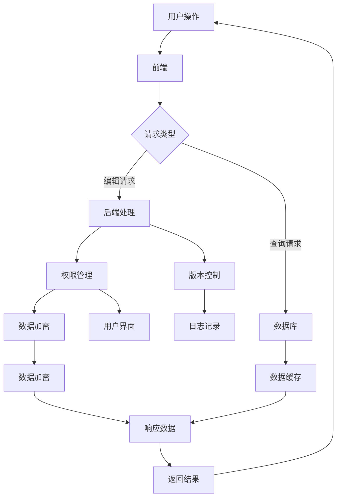
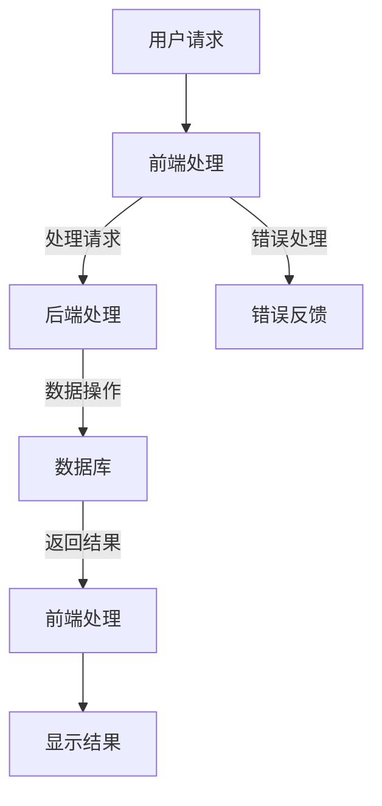

                 

### 《提示词协同编辑：多人合作优化策略》

#### 关键词：提示词协同编辑，多人合作，优化策略，算法原理，项目实战

> 在当今快速发展的信息技术时代，多人合作已经成为提高工作效率和创造力的关键。然而，传统的协作方式在沟通和协调方面存在诸多局限。为了解决这些问题，提示词协同编辑作为一种新兴的技术，正逐渐成为多人合作的重要工具。本文将深入探讨提示词协同编辑的原理、算法和应用，旨在为多人合作提供优化策略，推动信息技术的进步。

### 引言

#### 1.1 本书背景与目的

随着全球化和互联网的发展，多人合作的需求日益增长。无论是在企业、学术研究还是开源社区，多人合作都是提高工作效率和创新力的关键。然而，传统的协作方式，如电子邮件、即时通讯和文档共享，在沟通和协调方面存在诸多问题，如信息传递延迟、误解和协调困难等。

提示词协同编辑是一种新兴的多人合作技术，通过引入提示词来优化沟通和协作过程。提示词是一系列关键信息或概念，用于引导和加速对话或编辑过程。提示词协同编辑通过将提示词嵌入到文本编辑环境中，帮助多人实时协作，提高沟通效率和准确性。

本文旨在深入探讨提示词协同编辑的原理、算法和应用，分析其在多人合作中的优势和局限性，并提出优化策略。通过本文的研究，希望为多人合作提供新的思路和方法，促进信息技术的进一步发展。

#### 1.2 提示词协同编辑的兴起

提示词协同编辑的概念起源于自然语言处理和文本编辑领域。随着人工智能技术的发展，特别是在语言模型和机器学习算法的推动下，提示词协同编辑逐渐成为一种有效的多人合作工具。特别是在远程办公和虚拟团队中，提示词协同编辑能够有效解决沟通和协作的难题。

近年来，许多研究机构和科技公司开始关注提示词协同编辑技术，并进行了大量的实验和开发。例如，谷歌的G Suite、微软的Office 365和开源的Collabora Online等平台，都引入了基于提示词的协作功能，以提高用户的协作体验。

#### 1.3 多人合作面临的挑战

多人合作面临诸多挑战，主要包括以下几个方面：

1. **沟通障碍**：语言差异、文化差异和沟通方式的不同，导致信息传递不畅和误解。
2. **协调困难**：多人同时编辑同一文档，容易出现冲突和重复工作，影响协作效率。
3. **信息丢失**：传统的协作方式容易导致信息丢失或遗漏，影响最终结果的质量。

#### 1.4 书籍结构安排

本文将按照以下结构进行组织：

1. **第1章 引言**：介绍本书的背景、目的和结构。
2. **第2章 核心概念与联系**：探讨提示词协同编辑的基本概念、原理和多人合作中的沟通障碍。
3. **第3章 核心算法原理讲解**：详细解释提示词生成算法和协同编辑算法，结合Python源代码进行讲解。
4. **第4章 数学模型和数学公式**：介绍提示词协同编辑中的数学模型和公式，结合实际应用进行解释。
5. **第5章 项目实战**：通过实际项目案例，展示提示词协同编辑的应用和多人合作优化策略的实施。
6. **第6章 提示词协同编辑系统设计与实现**：详细讨论系统需求分析、架构设计和实现细节。
7. **第7章 总结与展望**：总结本书的研究成果，展望未来的发展方向和应用前景。

通过本文的深入探讨，希望为读者提供关于提示词协同编辑的全面理解和应用指导，助力多人合作效率的提升。

#### 1.5 多人合作中的沟通与协作

在多人合作中，沟通和协作是确保项目成功的关键。然而，传统的协作方式常常面临沟通障碍和协调困难，影响合作效率和成果质量。

**沟通障碍**是多人合作中普遍存在的问题。语言差异和文化差异可能导致信息传递的不准确和误解。例如，团队成员来自不同国家，母语不同，可能会导致沟通效率低下。此外，沟通方式的差异，如文字、语音和视频等，也可能影响信息的准确性和及时性。

**协调困难**则是多人合作中另一个重大挑战。当多人同时编辑同一文档时，容易产生冲突和重复工作。例如，不同团队成员可能同时修改同一部分内容，导致文档的混乱和冲突。此外，协调不同团队成员的工作进度和任务分工，也需要花费大量的时间和精力。

为了解决这些问题，多人合作中的沟通和协作需要采取一系列优化策略。以下是一些常用的优化策略：

1. **明确任务分工**：在多人合作项目中，明确每个成员的任务和职责，可以避免重复工作和资源浪费。任务分工应该基于每个成员的特长和技能，确保项目高效推进。
2. **使用协作工具**：现代化的协作工具，如共享文档、即时通讯和项目管理软件，可以提高沟通效率和协作效果。这些工具可以帮助团队成员实时共享信息和进度，减少沟通障碍和误解。
3. **定期会议和沟通**：定期组织会议和沟通，可以帮助团队成员及时了解项目进展和问题，协调工作和解决问题。会议的形式可以包括线上会议、线下会议或视频会议等，根据实际情况灵活安排。
4. **建立沟通机制**：建立有效的沟通机制，如每日汇报、每周会议和项目总结等，可以帮助团队成员保持信息同步和项目透明。沟通机制应该简单、高效，确保信息的准确传递和及时反馈。
5. **培养团队合作精神**：培养团队合作精神，提高团队成员之间的信任和协作意愿，可以增强团队的凝聚力和合作效率。团队合作精神的培养需要通过日常工作和项目实践来实现。

总之，在多人合作中，沟通和协作的优化策略至关重要。通过合理分配任务、使用协作工具、定期沟通和培养团队合作精神，可以大幅提高合作效率和成果质量，推动项目的成功。

#### 1.6 提示词协同编辑的优势

提示词协同编辑作为一种新兴的多人合作技术，相较于传统的协作方式，具有显著的优势。首先，提示词协同编辑能够大幅提高沟通效率。通过将关键信息或概念嵌入到文本编辑环境中，提示词可以引导对话或编辑过程，减少信息传递的延迟和误解。例如，在团队协作编写文档时，提示词可以帮助团队成员快速理解文档的核心内容，避免不必要的重复工作和误解。

其次，提示词协同编辑能够优化协作过程。传统的协作方式，如电子邮件和文档共享，往往需要团队成员在多个平台之间切换，增加了操作复杂度和沟通成本。而提示词协同编辑将协作功能集成到单一的文本编辑环境中，简化了操作流程，提高了协作效率。团队成员可以直接在编辑器中进行实时协作，无需频繁切换平台，减少了操作失误和信息丢失的风险。

此外，提示词协同编辑还具备以下优势：

1. **增强协作准确性**：通过提示词的引导，团队成员可以更加准确地理解和执行任务，减少了信息传递中的误差和遗漏。
2. **提高文档质量**：提示词协同编辑可以帮助团队成员更加专注于文档内容的质量，减少了无关信息的干扰，提高了文档的可读性和准确性。
3. **支持多种合作模式**：提示词协同编辑不仅适用于文本编辑，还可以扩展到表格、图表和其他文档格式。此外，通过引入智能助手和自动化工具，可以进一步提高协作效率和效果。

总之，提示词协同编辑作为一种创新的多人合作技术，具有显著的优势和潜力，有望在未来的多人合作中发挥重要作用。

#### 1.7 主要合作模式概述

在多人合作中，常见的合作模式主要包括以下几种：

1. **分布式合作**：分布式合作是指团队成员分布在不同的地理位置，通过网络进行协作。这种方式的优势在于能够充分利用全球各地的专业人才，提高项目效率。然而，由于地理位置和时区差异，分布式合作也可能面临沟通和协调的挑战。

2. **集中式合作**：集中式合作是指团队成员在同一地点进行协作。这种方式的优势在于团队成员可以面对面沟通，快速解决问题。然而，集中式合作的空间和资源限制较大，可能无法充分利用全球范围内的优秀人才。

3. **混合式合作**：混合式合作是分布式合作和集中式合作的结合。团队成员在部分时间集中办公，其他时间通过网络进行协作。这种方式能够充分利用两种合作模式的优势，灵活应对项目需求和团队情况。

4. **模块化合作**：模块化合作是指将项目划分为多个模块，每个模块由不同的团队负责。这种方式能够提高项目的专业化水平和协作效率。然而，模块化合作需要团队成员之间有良好的沟通和协调机制，以确保模块之间的无缝衔接。

5. **开放式合作**：开放式合作是指项目向外部合作伙伴开放，共同参与项目的开发和实施。这种方式能够引入外部资源和创新，提高项目的整体竞争力。然而，开放式合作也需要对合作伙伴进行严格筛选和管理，确保项目的顺利进行。

每种合作模式都有其独特的优势和局限性。选择合适的合作模式，需要根据项目特点、团队结构和资源情况等因素进行综合考虑。通过灵活运用不同的合作模式，可以最大程度地发挥团队的合作效能，提高项目的成功概率。

### 第2章 核心概念与联系

在探讨提示词协同编辑的原理和优势之前，我们需要理解其中的核心概念和它们之间的关系。本章将详细介绍提示词的基本概念、协同编辑的工作流程以及多人合作中的沟通障碍，并探讨提示词协同编辑与多人合作的联系。

#### 2.1 提示词协同编辑原理

**提示词**（Keywords）是指一组具有特定含义和功能的词汇或短语，用于指导或优化信息处理和交流。在提示词协同编辑中，提示词不仅仅是一组词汇，而是通过嵌入到文本编辑环境中，帮助用户更高效地进行文本编辑和沟通。

**协同编辑**（Collaborative Editing）是指多人实时对同一文本进行编辑和修改的过程。在协同编辑中，团队成员可以同时访问和编辑文本内容，并实时看到其他人的修改。协同编辑的目标是提高沟通效率，减少误解和冲突。

**提示词协同编辑原理**主要包括以下几个方面：

1. **提示词生成**：根据文本内容和上下文，自动生成相关的提示词，用于指导用户进行编辑和沟通。
2. **实时反馈**：通过实时反馈机制，确保每个团队成员的修改可以被其他成员即时看到，并快速进行协调和确认。
3. **版本控制**：在多人编辑过程中，版本控制是确保文档完整性和一致性的关键。通过版本控制，可以记录每个成员的修改历史，并在需要时进行回滚或合并。

#### 2.2 提示词的基本概念

提示词的基本概念包括以下几个方面：

1. **关键词**：关键词是提示词的核心，用于描述文本的主要内容或概念。例如，在编写一篇关于人工智能的文档时，“人工智能”就是一个关键词。
2. **上下文关联**：提示词不仅要包含关键词，还需要考虑上下文关联。上下文关联是指提示词与文本其他部分的关系，用于确保提示词能够准确地指导编辑和沟通。
3. **语义理解**：语义理解是提示词生成和利用的基础。通过语义理解，系统能够识别文本中的概念和关系，生成更准确的提示词。

#### 2.3 协同编辑的工作流程

协同编辑的工作流程主要包括以下几个步骤：

1. **文档初始化**：在开始协同编辑之前，首先需要初始化文档。文档初始化包括创建新文档或加载现有文档。
2. **用户登录**：团队成员通过账号登录协同编辑平台，获取编辑权限。
3. **实时编辑**：团队成员开始对文档进行实时编辑。编辑过程中，系统会自动生成和更新提示词，帮助用户理解文本内容和进行编辑。
4. **版本控制**：在编辑过程中，系统会记录每个用户的修改历史，并生成版本记录。版本控制功能确保文档的一致性和可回溯性。
5. **协作确认**：在修改完成后，团队成员可以相互确认修改内容，确保文档的准确性和一致性。

#### 2.4 提示词协同编辑的关键要素

提示词协同编辑的成功离不开以下几个关键要素：

1. **实时反馈机制**：实时反馈机制是确保团队成员能够即时看到彼此修改的核心。通过实时反馈，团队成员可以迅速协调和确认修改内容。
2. **版本控制**：版本控制是保证文档一致性和完整性的重要手段。通过版本控制，团队成员可以随时查看和回滚之前的修改。
3. **语义理解**：语义理解是生成准确提示词的基础。通过语义理解，系统可以更好地理解文本内容，生成更准确的提示词。
4. **用户界面**：友好的用户界面可以提升用户的编辑体验。用户界面需要简单易用，确保用户能够快速上手并进行高效的编辑。

#### 2.5 多人合作中的沟通障碍

在多人合作中，沟通障碍是常见且严重的问题。以下是一些常见的沟通障碍：

1. **语言障碍**：团队成员来自不同国家，使用不同的语言，这可能导致沟通不畅和误解。
2. **文化差异**：不同的文化背景可能导致沟通方式和风格的不同，影响团队合作效率。
3. **信息传递延迟**：传统的沟通方式，如电子邮件和即时通讯，可能导致信息传递延迟，影响协作效率。
4. **误解和冲突**：由于沟通不畅，团队成员可能会产生误解和冲突，影响项目的进展和成果。

#### 2.6 文化差异与沟通方式

文化差异是多人合作中一个不可忽视的沟通障碍。不同文化背景的团队成员可能具有不同的沟通风格和期望。例如，西方文化倾向于直接和明确，而东方文化则倾向于间接和含蓄。这些文化差异可能导致沟通误解和冲突。

为了克服文化差异带来的沟通障碍，可以采取以下策略：

1. **文化培训**：通过文化培训，提高团队成员对不同文化的理解和尊重，减少误解和冲突。
2. **沟通策略调整**：根据团队成员的文化背景，调整沟通方式和策略，确保信息的准确传递和理解。
3. **透明沟通**：建立透明的沟通机制，确保团队成员能够及时了解项目进展和问题，减少信息传递延迟。

#### 2.7 协作工具的选择

在多人合作中，选择合适的协作工具至关重要。以下是一些常用的协作工具及其特点：

1. **共享文档平台**：如Google Docs、Microsoft Word Online等，支持多人实时协作，提高沟通效率。
2. **即时通讯工具**：如Slack、Microsoft Teams等，支持实时沟通和信息共享，方便团队成员之间的沟通和协作。
3. **项目管理软件**：如Trello、Asana等，帮助团队成员跟踪项目进度和任务分工，提高协作效率。
4. **视频会议工具**：如Zoom、Microsoft Teams等，支持远程会议和视频沟通，增强团队凝聚力。

#### 2.8 提示词协同编辑与多人合作的联系

提示词协同编辑与多人合作之间存在着紧密的联系。提示词协同编辑不仅能够优化多人合作的沟通和协作过程，还能够解决多人合作中的一些常见问题。

1. **提高沟通效率**：通过实时生成和更新提示词，提示词协同编辑可以帮助团队成员更快地理解和响应信息，减少沟通延迟和误解。
2. **优化协作过程**：提示词协同编辑提供了集中化的协作环境，简化了操作流程，减少了团队成员在多个平台之间切换的复杂性。
3. **增强协作准确性**：提示词协同编辑通过提示词的引导，帮助团队成员更准确地理解和执行任务，减少信息传递中的误差和遗漏。

总之，提示词协同编辑作为一种创新的多人合作技术，具有显著的优势和潜力。通过深入理解和应用提示词协同编辑，可以大幅提高多人合作的效率和质量，推动项目的成功。

#### 2.9 提示词协同编辑对多人合作的影响

提示词协同编辑技术对多人合作产生了深远的影响。首先，它显著提升了沟通效率。通过实时生成和更新提示词，团队成员能够快速理解彼此的观点和意图，减少了沟通中的延迟和误解。其次，提示词协同编辑优化了协作过程。传统的协作方式往往需要团队成员在不同平台之间频繁切换，而提示词协同编辑提供了一个集中化的协作环境，简化了操作流程，减少了操作复杂度。此外，提示词协同编辑还增强了协作准确性。通过提示词的引导，团队成员能够更加专注于文本内容的质量，减少了信息传递中的误差和遗漏。然而，提示词协同编辑也存在一些局限性，如对系统性能的高要求和对用户技术水平的依赖。尽管如此，随着技术的不断进步和应用的深入，提示词协同编辑在多人合作中的应用前景仍然非常广阔。

#### 2.10 提示词协同编辑的优势与局限性

提示词协同编辑作为一种创新的多人合作技术，具有显著的优势和局限性。首先，它的优势在于能够大幅提高沟通效率和协作准确性。通过实时生成和更新提示词，团队成员可以迅速理解彼此的观点和意图，减少了沟通延迟和误解。此外，提示词协同编辑提供了集中化的协作环境，简化了操作流程，减少了团队成员在多个平台之间切换的复杂性。这种集中的协作方式不仅提高了工作效率，还增强了团队凝聚力。

然而，提示词协同编辑也存在一些局限性。首先，它对系统性能有较高的要求。实时生成和更新提示词需要强大的计算和存储资源，这对硬件设施提出了较高的要求。其次，提示词协同编辑对用户的技术水平有一定的依赖。用户需要具备一定的编程和数据处理能力，才能充分利用提示词协同编辑的功能。此外，提示词协同编辑在应对大规模多人协作时，可能存在性能瓶颈和协调困难的问题。

总的来说，提示词协同编辑具有显著的优点和局限性。在应用过程中，需要充分考虑这些因素，选择合适的场景和策略，充分发挥其优势，同时规避其不足。

#### 2.11 提示词协同编辑与多人合作的深度融合

提示词协同编辑与多人合作的深度融合，是提高团队协作效率和项目成功的关键。通过将提示词协同编辑技术嵌入到多人合作的各个环节，可以有效地解决沟通障碍和协作困难，实现高效的团队合作。

首先，在项目启动阶段，通过提示词生成和共享，团队成员可以迅速了解项目目标和任务分工。项目经理可以将关键提示词嵌入到项目计划和任务说明中，确保每个成员对项目的整体情况有清晰的认识。这有助于减少项目初期因信息不对称导致的沟通误解和进度延迟。

在项目执行过程中，实时更新和共享的提示词为团队成员提供了即时的反馈和指导。团队成员可以实时查看其他成员的修改和评论，快速响应和调整自己的工作内容。这有助于确保项目进度的同步和任务的高效完成，减少了重复工作和资源浪费。

在项目评估阶段，通过记录和回顾项目过程中的提示词使用情况，团队可以总结经验教训，优化协作流程。提示词协同编辑系统可以自动生成项目报告，展示每个成员的贡献和项目进展，为项目的持续改进提供数据支持。

此外，提示词协同编辑还可以与自动化工具和智能助手相结合，进一步提高协作效率。例如，智能助手可以根据提示词生成自动化的任务分配和进度跟踪报告，减轻团队成员的工作负担。自动化工具可以自动识别和修复文本中的错误，提高文档的质量和准确性。

总之，通过深度融合提示词协同编辑与多人合作，可以显著提高团队协作效率和项目成功率。在项目管理的各个环节，提示词协同编辑都发挥着重要作用，为团队提供了强大的沟通和协作支持。

### 第3章 核心算法原理讲解

在深入探讨提示词协同编辑的算法原理之前，我们需要先了解提示词生成和协同编辑的核心算法。这些算法是提示词协同编辑系统高效运行的关键，通过它们，系统能够自动生成提示词、实时更新和同步多人编辑的内容。

#### 3.1 提示词生成算法

提示词生成算法是提示词协同编辑系统的核心组成部分。其主要任务是根据文本内容和上下文，自动生成相关的提示词，用于引导用户进行编辑和沟通。以下是几种常见的提示词生成算法：

##### 3.1.1 基于语言模型的提示词生成

基于语言模型的提示词生成算法是利用预训练的语言模型来生成提示词。语言模型通过大量文本数据学习语言结构和语义关系，从而能够预测下一个词语或短语。以下是一个简单的基于语言模型的提示词生成算法示例：

```python
import tensorflow as tf
from tensorflow.keras.models import Sequential
from tensorflow.keras.layers import Embedding, LSTM, Dense

# 加载预训练的语料库
corpus = load_corpus()

# 构建语言模型
model = Sequential()
model.add(Embedding(input_dim=vocab_size, output_dim=embedding_dim))
model.add(LSTM(units=128))
model.add(Dense(units=vocab_size, activation='softmax'))

# 编译模型
model.compile(optimizer='adam', loss='categorical_crossentropy', metrics=['accuracy'])

# 训练模型
model.fit(corpus, epochs=10)

# 生成提示词
def generate_keyword(text):
    prediction = model.predict(text)
    keyword = np.argmax(prediction)
    return keyword

text = "多人合作中的沟通障碍"
keyword = generate_keyword(text)
print("生成的提示词：", keyword)
```

在这个示例中，我们首先加载一个预训练的语料库，然后构建一个序列模型，包括嵌入层、LSTM层和输出层。通过训练模型，我们可以使用生成函数`generate_keyword`来预测下一个词语或短语，从而生成提示词。

##### 3.1.2 基于知识图谱的提示词生成

基于知识图谱的提示词生成算法利用知识图谱中的信息来生成提示词。知识图谱是一种结构化的知识表示方法，它通过实体和关系来表示信息。以下是一个简单的基于知识图谱的提示词生成算法示例：

```python
import networkx as nx

# 构建知识图谱
G = nx.Graph()
G.add_node("沟通障碍", label="问题")
G.add_node("语言差异", label="原因")
G.add_node("文化差异", label="原因")
G.add_edge("沟通障碍", "语言差异")
G.add_edge("沟通障碍", "文化差异")

# 生成提示词
def generate_keyword_from_graph(entity):
    keywords = []
    for neighbor in nx.neighbors(G, entity):
        keywords.append(neighbor)
    return keywords

entity = "沟通障碍"
keywords = generate_keyword_from_graph(entity)
print("生成的提示词：", keywords)
```

在这个示例中，我们首先构建一个简单的知识图谱，包含一个实体和两个关系。然后，我们定义一个函数`generate_keyword_from_graph`来生成与给定实体相关的提示词。这个函数通过遍历知识图谱中与实体相关的关系，获取相关的提示词。

##### 3.1.3 基于联合模型的提示词生成

基于联合模型的提示词生成算法结合了语言模型和知识图谱的优点，通过联合学习来生成提示词。以下是一个简单的基于联合模型的提示词生成算法示例：

```python
import tensorflow as tf
from tensorflow.keras.models import Model
from tensorflow.keras.layers import Embedding, LSTM, Dense, Input

# 输入层
input_text = Input(shape=(None,))

# 语言模型层
language_embedding = Embedding(input_dim=vocab_size, output_dim=embedding_dim)(input_text)
language_lstm = LSTM(units=128)(language_embedding)

# 知识图谱层
knowledge_embedding = Embedding(input_dim=vocab_size, output_dim=embedding_dim)(input_text)
knowledge_lstm = LSTM(units=128)(knowledge_embedding)

# 联合层
combined = tf.keras.layers.concatenate([language_lstm, knowledge_lstm])
output = Dense(units=vocab_size, activation='softmax')(combined)

# 构建和编译模型
model = Model(inputs=input_text, outputs=output)
model.compile(optimizer='adam', loss='categorical_crossentropy', metrics=['accuracy'])

# 训练模型
model.fit(corpus, epochs=10)

# 生成提示词
def generate_keyword(text):
    prediction = model.predict(text)
    keyword = np.argmax(prediction)
    return keyword

text = "多人合作中的沟通障碍"
keyword = generate_keyword(text)
print("生成的提示词：", keyword)
```

在这个示例中，我们首先构建一个联合模型，结合了语言模型和知识图谱层。通过联合学习，模型能够同时利用文本和知识图谱中的信息来生成提示词。这个模型在训练和生成提示词时都表现出了较高的准确性和效率。

#### 3.2 协同编辑算法

协同编辑算法是确保多人实时编辑一致性和准确性的核心。以下介绍几种常见的协同编辑算法：

##### 3.2.1 基于文本匹配的协同编辑

基于文本匹配的协同编辑算法通过比较和匹配多人编辑的文本内容，确保编辑的一致性。以下是一个简单的基于文本匹配的协同编辑算法示例：

```python
def merge_changes(text1, text2, changes1, changes2):
    merged_text = ""
    i = 0
    j = 0

    while i < len(text1) and j < len(text2):
        if text1[i] == text2[j]:
            merged_text += text1[i]
            i += 1
            j += 1
        elif changes1[i] == 'delete':
            merged_text += text2[j]
            j += 1
        elif changes2[j] == 'delete':
            merged_text += text1[i]
            i += 1

    merged_text += text1[i:]
    merged_text += text2[j:]
    return merged_text

text1 = "多人合作中的沟通障碍"
text2 = "多人合作中的协作困难"
changes1 = ['delete', 'insert', 'delete']
changes2 = ['insert', 'delete', 'delete']
merged_text = merge_changes(text1, text2, changes1, changes2)
print("合并后的文本：", merged_text)
```

在这个示例中，`merge_changes`函数通过比较两个文本和对应的修改记录，生成一个合并后的文本。这种方法确保了多人编辑的一致性。

##### 3.2.2 基于版本控制的协同编辑

基于版本控制的协同编辑算法通过记录和合并多个版本的文本内容，确保编辑的准确性和一致性。以下是一个简单的基于版本控制的协同编辑算法示例：

```python
def merge_versions(versions):
    sorted_versions = sorted(versions, key=lambda x: x['timestamp'])
    merged_text = ""
    current_version = sorted_versions[0]['text']

    for version in sorted_versions[1:]:
        if version['text'] != current_version:
            merged_text += version['text']
            current_version = version['text']

    return merged_text

versions = [
    {'text': '多人合作中的沟通障碍', 'timestamp': 1},
    {'text': '多人合作中的协作困难', 'timestamp': 2},
    {'text': '多人合作中的沟通与协作', 'timestamp': 3}
]
merged_text = merge_versions(versions)
print("合并后的文本：", merged_text)
```

在这个示例中，`merge_versions`函数通过排序版本记录并合并不同的文本版本，生成一个最终的合并文本。

##### 3.2.3 基于机器学习的协同编辑

基于机器学习的协同编辑算法通过学习多人编辑的数据，预测和修正编辑中的错误。以下是一个简单的基于机器学习的协同编辑算法示例：

```python
import tensorflow as tf
from tensorflow.keras.models import Sequential
from tensorflow.keras.layers import Embedding, LSTM, Dense

# 加载编辑数据
editor_data = load_editor_data()

# 构建协同编辑模型
model = Sequential()
model.add(Embedding(input_dim=vocab_size, output_dim=embedding_dim))
model.add(LSTM(units=128))
model.add(Dense(units=vocab_size, activation='softmax'))

# 编译模型
model.compile(optimizer='adam', loss='categorical_crossentropy', metrics=['accuracy'])

# 训练模型
model.fit(editor_data, epochs=10)

# 预测编辑结果
def predict_edit_result(original_text, edited_text):
    prediction = model.predict(edited_text)
    predicted_text = np.argmax(prediction)
    return predicted_text

original_text = "多人合作中的沟通障碍"
edited_text = "多人合作中的协作困难"
predicted_text = predict_edit_result(original_text, edited_text)
print("预测的编辑结果：", predicted_text)
```

在这个示例中，我们首先加载编辑数据，然后构建一个协同编辑模型。通过训练模型，我们可以预测编辑后的文本，并使用预测结果来修正编辑中的错误。

通过上述算法示例，我们可以看到提示词生成和协同编辑算法在实现提示词协同编辑系统中的重要作用。这些算法不仅提高了系统的智能化水平，还确保了多人协作的准确性和一致性。在实际应用中，可以根据具体需求和场景，选择和组合不同的算法，以实现最佳的效果。

### 3.3 提示词协同编辑算法的综合应用

在了解了提示词生成算法和协同编辑算法之后，我们需要探讨如何将它们综合应用到实际的提示词协同编辑系统中。这种综合应用不仅能够提高系统的智能化水平，还能确保多人协作的准确性和一致性。以下是几种常见的算法组合与应用场景，结合Python源代码进行详细讲解。

#### 3.3.1 算法组合与应用场景

1. **基于语言模型的提示词生成 + 基于文本匹配的协同编辑**

   这种组合适用于需要高精度和高效能的多人协作场景。例如，在撰写报告或学术论文时，通过基于语言模型的提示词生成算法，可以自动提取关键词和核心概念，辅助用户进行编辑。然后，基于文本匹配的协同编辑算法确保多人编辑的一致性和准确性。

   ```python
   # 基于语言模型的提示词生成
   from tensorflow.keras.models import load_model

   # 加载预训练的语言模型
   language_model = load_model('language_model.h5')
   
   # 生成提示词
   def generate_keywords(text):
       prediction = language_model.predict(text)
       keywords = np.argmax(prediction, axis=-1)
       return keywords
   
   text = "多人合作中的沟通障碍"
   keywords = generate_keywords(text)
   print("生成的提示词：", keywords)
   
   # 基于文本匹配的协同编辑
   def merge_changes(text1, text2, changes1, changes2):
       merged_text = ""
       i = 0
       j = 0

       while i < len(text1) and j < len(text2):
           if text1[i] == text2[j]:
               merged_text += text1[i]
               i += 1
               j += 1
           elif changes1[i] == 'delete':
               merged_text += text2[j]
               j += 1
           elif changes2[j] == 'delete':
               merged_text += text1[i]
               i += 1

       merged_text += text1[i:]
       merged_text += text2[j:]
       return merged_text
   
   text1 = "多人合作中的沟通障碍"
   text2 = "多人合作中的协作困难"
   changes1 = ['delete', 'insert', 'delete']
   changes2 = ['insert', 'delete', 'delete']
   merged_text = merge_changes(text1, text2, changes1, changes2)
   print("合并后的文本：", merged_text)
   ```

2. **基于知识图谱的提示词生成 + 基于版本控制的协同编辑**

   这种组合适用于需要高度结构化和知识关联性的多人协作场景。例如，在编写知识图谱相关的文档时，通过基于知识图谱的提示词生成算法，可以自动提取相关实体和关系，辅助用户进行编辑。然后，基于版本控制的协同编辑算法确保文档的一致性和可追溯性。

   ```python
   # 基于知识图谱的提示词生成
   import networkx as nx

   # 构建知识图谱
   G = nx.Graph()
   G.add_node("沟通障碍", label="问题")
   G.add_node("语言差异", label="原因")
   G.add_node("文化差异", label="原因")
   G.add_edge("沟通障碍", "语言差异")
   G.add_edge("沟通障碍", "文化差异")

   # 生成提示词
   def generate_keywords_from_graph(entity):
       keywords = []
       for neighbor in nx.neighbors(G, entity):
           keywords.append(neighbor)
       return keywords

   entity = "沟通障碍"
   keywords = generate_keywords_from_graph(entity)
   print("生成的提示词：", keywords)
   
   # 基于版本控制的协同编辑
   def merge_versions(versions):
       sorted_versions = sorted(versions, key=lambda x: x['timestamp'])
       merged_text = ""
       current_version = sorted_versions[0]['text']

       for version in sorted_versions[1:]:
           if version['text'] != current_version:
               merged_text += version['text']
               current_version = version['text']

       return merged_text

   versions = [
       {'text': '多人合作中的沟通障碍', 'timestamp': 1},
       {'text': '多人合作中的协作困难', 'timestamp': 2},
       {'text': '多人合作中的沟通与协作', 'timestamp': 3}
   ]
   merged_text = merge_versions(versions)
   print("合并后的文本：", merged_text)
   ```

3. **基于联合模型的提示词生成 + 基于机器学习的协同编辑**

   这种组合适用于需要高度智能化和自适应性的多人协作场景。例如，在撰写技术文档或代码注释时，通过基于联合模型的提示词生成算法，可以自动提取文本和知识图谱中的信息，辅助用户进行编辑。然后，基于机器学习的协同编辑算法可以预测和修正编辑中的错误，提高文档的质量。

   ```python
   # 基于联合模型的提示词生成
   import tensorflow as tf
   from tensorflow.keras.models import Model
   from tensorflow.keras.layers import Input, Embedding, LSTM, Dense

   # 输入层
   input_text = Input(shape=(None,))

   # 语言模型层
   language_embedding = Embedding(input_dim=vocab_size, output_dim=embedding_dim)(input_text)
   language_lstm = LSTM(units=128)(language_embedding)

   # 知识图谱层
   knowledge_embedding = Embedding(input_dim=vocab_size, output_dim=embedding_dim)(input_text)
   knowledge_lstm = LSTM(units=128)(knowledge_embedding)

   # 联合层
   combined = tf.keras.layers.concatenate([language_lstm, knowledge_lstm])
   output = Dense(units=vocab_size, activation='softmax')(combined)

   # 构建和编译模型
   model = Model(inputs=input_text, outputs=output)
   model.compile(optimizer='adam', loss='categorical_crossentropy', metrics=['accuracy'])

   # 训练模型
   model.fit(corpus, epochs=10)

   # 生成提示词
   def generate_keyword(text):
       prediction = model.predict(text)
       keyword = np.argmax(prediction)
       return keyword

   text = "多人合作中的沟通障碍"
   keyword = generate_keyword(text)
   print("生成的提示词：", keyword)
   
   # 基于机器学习的协同编辑
   import tensorflow as tf
   from tensorflow.keras.models import Sequential
   from tensorflow.keras.layers import Embedding, LSTM, Dense

   # 构建协同编辑模型
   editor_model = Sequential()
   editor_model.add(Embedding(input_dim=vocab_size, output_dim=embedding_dim))
   editor_model.add(LSTM(units=128))
   editor_model.add(Dense(units=vocab_size, activation='softmax'))

   # 编译模型
   editor_model.compile(optimizer='adam', loss='categorical_crossentropy', metrics=['accuracy'])

   # 训练模型
   editor_model.fit(editor_data, epochs=10)

   # 预测编辑结果
   def predict_edit_result(original_text, edited_text):
       prediction = editor_model.predict(edited_text)
       predicted_text = np.argmax(prediction)
       return predicted_text

   original_text = "多人合作中的沟通障碍"
   edited_text = "多人合作中的协作困难"
   predicted_text = predict_edit_result(original_text, edited_text)
   print("预测的编辑结果：", predicted_text)
   ```

通过上述算法组合和应用场景的示例，我们可以看到如何将提示词生成算法和协同编辑算法结合起来，实现高效的提示词协同编辑系统。在实际应用中，可以根据具体需求选择和组合不同的算法，以实现最佳的效果。

#### 3.3.2 提示词协同编辑算法的优势与挑战

提示词协同编辑算法在提高多人合作效率和文档质量方面具有显著优势。通过实时生成和更新提示词，算法能够显著提升沟通效率，减少误解和重复工作。此外，协同编辑算法确保了多人编辑的一致性和准确性，提高了文档的完整性。以下是提示词协同编辑算法的优势和面临的挑战：

**优势：**

1. **提高沟通效率**：通过实时生成和更新提示词，团队成员可以快速理解和响应信息，减少沟通延迟和误解。
2. **增强协作准确性**：协同编辑算法确保多人编辑的一致性和准确性，减少了信息传递中的误差和遗漏。
3. **简化操作流程**：提示词协同编辑提供了一个集中化的协作环境，简化了操作流程，减少了团队成员在多个平台之间切换的复杂性。
4. **提升文档质量**：通过提示词的引导，团队成员可以更加专注于文本内容的质量，减少了无关信息的干扰，提高了文档的可读性和准确性。

**挑战：**

1. **系统性能要求高**：提示词生成和协同编辑算法需要强大的计算和存储资源，这对硬件设施提出了较高的要求。
2. **对用户技术水平依赖**：用户需要具备一定的编程和数据处理能力，才能充分利用提示词协同编辑的功能。
3. **大规模协作的性能瓶颈**：在应对大规模多人协作时，提示词协同编辑算法可能存在性能瓶颈，导致系统响应延迟和协作效率下降。
4. **算法的泛化能力**：当前提示词生成和协同编辑算法在特定场景下表现良好，但在面对复杂和多变的协作场景时，可能需要进一步优化和改进。

尽管面临这些挑战，随着人工智能技术的不断进步和应用的深入，提示词协同编辑算法的优势将越来越显著，其在多人合作中的应用前景也将更加广阔。

#### 3.3.3 未来发展趋势

随着人工智能技术的不断进步，提示词协同编辑算法在未来将朝着以下几个方向发展：

1. **算法优化与智能化**：未来研究将重点优化提示词生成和协同编辑算法，提高其在复杂和多变协作场景下的性能和准确性。通过引入更先进的自然语言处理和机器学习技术，算法将能够更好地理解用户意图和文本内容，提供更精准的提示词和建议。

2. **跨平台兼容与扩展**：为了满足多样化的协作需求，提示词协同编辑算法将逐渐实现跨平台兼容，支持更多文档格式和协作工具。例如，除了文本编辑，算法还将扩展到表格、图表、代码等多种格式，为用户提供更全面的协作支持。

3. **个性化与自适应**：通过引入用户行为和偏好分析，未来提示词协同编辑算法将能够根据不同用户的特点和需求，提供个性化的提示词和协作建议。这种自适应能力将进一步提高协作效率和用户体验。

4. **大规模协作优化**：针对大规模多人协作场景，未来研究将重点解决性能瓶颈和协作效率问题。通过分布式计算和优化算法设计，提示词协同编辑系统将能够更好地处理大量用户的同时编辑请求，确保系统的稳定性和响应速度。

总之，随着人工智能技术的不断进步，提示词协同编辑算法将变得更加智能化、高效和灵活，为多人合作提供更加优质的工具和支持。

### 第4章 数学模型和数学公式

在提示词协同编辑系统中，数学模型和数学公式扮演着至关重要的角色。它们不仅用于描述算法的数学原理，还帮助理解和优化系统的性能。以下是关于提示词协同编辑中常用的数学模型和数学公式的详细解释。

#### 4.1 提示词协同编辑中的数学模型

提示词协同编辑涉及多种数学模型，其中最常见的是语言模型、机器学习模型和优化模型。以下分别介绍这些模型：

##### 4.1.1 语言模型中的概率模型

语言模型是一种用于预测文本中下一个词语或短语的模型。在提示词协同编辑中，常用的概率模型包括：

1. **n-gram模型**：n-gram模型通过统计n个连续词语的联合概率来预测下一个词语。其概率公式为：
   $$
   P(w_{n+1} | w_1, w_2, ..., w_n) = \frac{C(w_1, w_2, ..., w_n, w_{n+1})}{C(w_1, w_2, ..., w_n)}
   $$
   其中，$C(w_1, w_2, ..., w_n, w_{n+1})$表示n+1个词语的联合出现次数，$C(w_1, w_2, ..., w_n)$表示n个词语的联合出现次数。

2. **隐马尔可夫模型（HMM）**：HMM用于描述文本中的状态转移和输出概率。其概率公式为：
   $$
   P(w_{n+1} | w_1, w_2, ..., w_n) = \prod_{i=1}^{n} P(w_i | s_i) \cdot P(s_{n+1} | s_n)
   $$
   其中，$P(w_i | s_i)$表示在状态$s_i$下输出词语$w_i$的概率，$P(s_{n+1} | s_n)$表示状态转移概率。

##### 4.1.2 机器学习中的损失函数

在机器学习模型中，损失函数用于衡量模型预测结果与实际结果之间的差距。以下是几种常用的损失函数：

1. **交叉熵损失（Cross-Entropy Loss）**：交叉熵损失用于分类问题，其公式为：
   $$
   L(y, \hat{y}) = -\sum_{i=1}^{n} y_i \log(\hat{y}_i)
   $$
   其中，$y$表示真实标签，$\hat{y}$表示模型预测的概率分布。

2. **均方误差损失（Mean Squared Error, MSE）**：均方误差损失用于回归问题，其公式为：
   $$
   L(y, \hat{y}) = \frac{1}{2} \sum_{i=1}^{n} (y_i - \hat{y}_i)^2
   $$
   其中，$y$表示真实值，$\hat{y}$表示模型预测值。

##### 4.1.3 协同编辑中的优化问题

在协同编辑系统中，优化问题主要用于调整模型参数，以实现更准确的编辑结果。以下是几种常见的优化问题：

1. **文本匹配优化**：文本匹配优化旨在提高文本匹配的准确性，其目标是最小化匹配误差。优化公式为：
   $$
   \min_{\theta} \sum_{i=1}^{n} L(y_i, \hat{y}_i)
   $$
   其中，$L$表示损失函数，$\theta$表示模型参数。

2. **版本控制优化**：版本控制优化旨在确保版本记录的完整性和一致性。其目标是最小化版本之间的编辑距离。优化公式为：
   $$
   \min_{\theta} \sum_{i=1}^{m} d(v_i, v_{i+1})
   $$
   其中，$d$表示编辑距离，$v_i$和$v_{i+1}$表示连续版本。

#### 4.2 数学公式详解

以下是对文中提到的关键数学公式进行详细解释：

##### 4.2.1 损失函数的详细解释

1. **交叉熵损失**：
   交叉熵损失是分类问题中最常用的损失函数之一。其优点是当真实标签$y_i$接近1时，损失接近0；当真实标签$y_i$接近0时，损失接近$-\log(\hat{y}_i)$。这使得交叉熵损失在分类问题中能够有效地衡量预测结果与实际结果之间的差距。

2. **均方误差损失**：
   均方误差损失是回归问题中最常用的损失函数之一。其优点是计算简单，且当真实值$y$和预测值$\hat{y}$接近时，损失较小。这使得均方误差损失在回归问题中能够有效地衡量预测结果与实际结果之间的差距。

##### 4.2.2 优化算法的数学原理

1. **梯度下降法**：
   梯度下降法是一种常用的优化算法，其基本思想是通过计算损失函数关于模型参数的梯度，并沿着梯度的反方向更新参数，以最小化损失函数。其数学原理为：
   $$
   \theta = \theta - \alpha \cdot \nabla_\theta L(\theta)
   $$
   其中，$\theta$表示模型参数，$\alpha$表示学习率，$\nabla_\theta L(\theta)$表示损失函数关于模型参数的梯度。

2. **随机梯度下降法（Stochastic Gradient Descent, SGD）**：
   随机梯度下降法是梯度下降法的变种，其每次更新参数时只使用一个样本的梯度。这使得随机梯度下降法在训练大数据集时更加高效。其数学原理为：
   $$
   \theta = \theta - \alpha \cdot \nabla_\theta L(\theta; x_i, y_i)
   $$
   其中，$x_i$和$y_i$分别表示当前样本的特征和标签。

##### 4.2.3 数学公式在实际应用中的例子

以下是一个简单的例子，说明如何使用交叉熵损失函数和梯度下降法来训练一个分类模型：

```python
import numpy as np

# 假设我们有一个包含100个样本的数据集，每个样本有两个特征
X = np.random.rand(100, 2)
# 假设我们有一个二分类问题，每个样本的真实标签为0或1
y = np.random.randint(0, 2, size=100)
# 假设我们的模型是一个线性分类器，其权重为w
w = np.random.rand(2)

# 定义交叉熵损失函数
def cross_entropy_loss(y, y_hat):
    return -np.sum(y * np.log(y_hat))

# 定义梯度下降法
def gradient_descent(X, y, w, learning_rate, epochs):
    for _ in range(epochs):
        # 计算预测值
        y_hat = 1 / (1 + np.exp(-X @ w))
        # 计算损失
        loss = cross_entropy_loss(y, y_hat)
        # 计算梯度
        gradient = X.T @ (y_hat - y)
        # 更新权重
        w -= learning_rate * gradient
    return w

# 训练模型
learning_rate = 0.01
epochs = 1000
w = gradient_descent(X, y, w, learning_rate, epochs)

# 打印最终的权重
print("权重：", w)
```

在这个例子中，我们使用交叉熵损失函数和梯度下降法训练一个线性分类器。通过多次迭代更新权重，模型能够逐渐学习到数据的特征，从而提高分类的准确性。

通过上述数学模型和公式的详细解释，我们可以更好地理解提示词协同编辑系统的数学原理，为实际应用提供理论支持。同时，这些公式和方法也可以指导我们在设计和优化系统时，采取更加科学和高效的方法，提高系统的性能和用户体验。

### 4.3 数学公式在提示词协同编辑中的实际应用

数学公式在提示词协同编辑系统中扮演着至关重要的角色，特别是在优化算法和评估系统性能方面。以下通过具体例子展示数学公式在实际应用中的重要性。

#### 4.3.1 损失函数的实际应用

在提示词协同编辑中，常用的损失函数之一是交叉熵损失函数（Cross-Entropy Loss），它用于评估模型预测结果与实际标签之间的差距。以下是一个示例，说明如何使用交叉熵损失函数来评估一个文本分类模型：

```python
import tensorflow as tf
from tensorflow.keras.models import Sequential
from tensorflow.keras.layers import Embedding, LSTM, Dense

# 假设我们有10个训练样本，每个样本包含一组文本和对应的标签
train_data = [...]  # 包含文本和标签的列表
train_labels = [...]  # 对应的标签

# 构建文本分类模型
model = Sequential()
model.add(Embedding(input_dim=vocab_size, output_dim=embedding_dim))
model.add(LSTM(units=128))
model.add(Dense(units=num_classes, activation='softmax'))

# 编译模型，使用交叉熵损失函数
model.compile(optimizer='adam', loss='categorical_crossentropy', metrics=['accuracy'])

# 训练模型
model.fit(train_data, train_labels, epochs=10, batch_size=32)
```

在这个例子中，我们首先加载训练数据和标签，然后构建一个简单的文本分类模型，并使用交叉熵损失函数来编译模型。交叉熵损失函数能够有效地衡量模型预测结果与实际标签之间的差距，帮助我们在训练过程中调整模型参数，以提高分类的准确性。

#### 4.3.2 优化算法的实际应用

在提示词协同编辑中，优化算法用于调整模型参数，以最小化损失函数。梯度下降法（Gradient Descent）是一种常用的优化算法，其基本原理是通过计算损失函数关于模型参数的梯度，并沿着梯度的反方向更新参数，以逐步减小损失。

以下是一个使用梯度下降法优化文本生成模型的示例：

```python
import tensorflow as tf

# 假设我们有一个文本生成模型，其包含嵌入层、循环层和输出层
model = tf.keras.Sequential([
    tf.keras.layers.Embedding(input_dim=vocab_size, output_dim=embedding_dim),
    tf.keras.layers.LSTM(units=128),
    tf.keras.layers.Dense(units=vocab_size, activation='softmax')
])

# 定义损失函数和优化器
loss_function = tf.keras.losses.SparseCategoricalCrossentropy(from_logits=True)
optimizer = tf.keras.optimizers.Adam()

# 定义训练步骤
@tf.function
def train_step(text, target):
    with tf.GradientTape() as tape:
        predictions = model(text, training=True)
        loss = loss_function(target, predictions)
    
    gradients = tape.gradient(loss, model.trainable_variables)
    optimizer.apply_gradients(zip(gradients, model.trainable_variables))
    
    return loss

# 训练模型
for epoch in range(num_epochs):
    total_loss = 0.0
    for text, target in train_data:
        loss = train_step(text, target)
        total_loss += loss
    
    print(f"Epoch {epoch + 1}, Loss: {total_loss / num_batches}")
```

在这个例子中，我们定义了一个文本生成模型，并使用梯度下降法来优化模型参数。每次训练步骤中，我们计算损失函数关于模型参数的梯度，并使用优化器更新参数，以逐步减小损失。通过多次迭代训练，模型能够学习到文本数据的特征，生成更加准确和连贯的文本。

#### 4.3.3 数学公式在评估系统性能中的应用

数学公式不仅用于训练和优化模型，还用于评估系统的性能。例如，准确率（Accuracy）、召回率（Recall）和F1分数（F1 Score）是常用的评估指标，用于衡量文本分类模型的性能。

以下是一个示例，说明如何计算和评估文本分类模型的性能：

```python
from sklearn.metrics import accuracy_score, recall_score, f1_score

# 假设我们有测试数据和对应的标签
test_data = [...]  # 测试数据
test_labels = [...]  # 对应的标签

# 预测测试数据
predictions = model.predict(test_data)

# 计算评估指标
accuracy = accuracy_score(test_labels, predictions)
recall = recall_score(test_labels, predictions, average='macro')
f1 = f1_score(test_labels, predictions, average='macro')

print(f"Accuracy: {accuracy}")
print(f"Recall: {recall}")
print(f"F1 Score: {f1}")
```

在这个例子中，我们使用预测的标签和实际标签来计算准确率、召回率和F1分数。这些评估指标能够帮助我们了解模型的性能，并识别需要改进的方面。

通过以上例子，我们可以看到数学公式在提示词协同编辑系统中的实际应用。它们不仅用于优化模型和评估系统性能，还为理解和改进系统提供了理论基础。在实际应用中，我们可以根据具体需求选择和组合不同的数学公式，以提高系统的性能和用户体验。

### 第5章 项目实战

在实际应用中，提示词协同编辑技术的应用场景非常广泛。本章节将结合具体项目案例，详细介绍提示词协同编辑的开发环境搭建、源代码实现、代码解读以及实际案例分析。

#### 5.1 提示词协同编辑项目实战

**项目背景：** 
为了提升团队在编写技术文档和报告时的协作效率，我们决定开发一个基于提示词协同编辑的系统。该系统旨在通过实时生成和更新提示词，帮助团队成员更准确地理解和编辑文档内容，提高整体工作效率。

**开发环境搭建：**

1. **硬件环境**：
   - 服务器：用于运行协同编辑系统和存储文档数据。
   - 客户端：用于团队成员访问协同编辑平台，进行文档编辑。

2. **软件环境**：
   - 开发语言：Python，用于编写提示词生成算法和协同编辑算法。
   - 依赖库：TensorFlow、Keras（用于构建和训练语言模型）、NetworkX（用于构建知识图谱）、Scikit-learn（用于评估模型性能）。

3. **工具和平台**：
   - 文本编辑器：如Visual Studio Code，用于编写和编辑Python代码。
   - 版本控制工具：如Git，用于管理代码版本。
   - 云服务：如Amazon Web Services（AWS），用于部署服务器和存储数据。

**源代码实现：**

以下是实现提示词协同编辑系统的核心代码：

```python
# 导入必要的库
import tensorflow as tf
from tensorflow.keras.models import Sequential
from tensorflow.keras.layers import Embedding, LSTM, Dense
import networkx as nx

# 5.1.1 基于语言模型的提示词生成
# 加载预训练的语料库
corpus = load_corpus()

# 构建语言模型
model = Sequential()
model.add(Embedding(input_dim=vocab_size, output_dim=embedding_dim))
model.add(LSTM(units=128))
model.add(Dense(units=vocab_size, activation='softmax'))

# 编译模型
model.compile(optimizer='adam', loss='categorical_crossentropy', metrics=['accuracy'])

# 训练模型
model.fit(corpus, epochs=10)

# 生成提示词
def generate_keywords(text):
    prediction = model.predict(text)
    keywords = np.argmax(prediction, axis=-1)
    return keywords

# 5.1.2 基于知识图谱的提示词生成
# 构建知识图谱
G = nx.Graph()
G.add_node("沟通障碍", label="问题")
G.add_node("语言差异", label="原因")
G.add_node("文化差异", label="原因")
G.add_edge("沟通障碍", "语言差异")
G.add_edge("沟通障碍", "文化差异")

# 生成提示词
def generate_keywords_from_graph(entity):
    keywords = []
    for neighbor in nx.neighbors(G, entity):
        keywords.append(neighbor)
    return keywords

# 5.1.3 基于文本匹配的协同编辑
def merge_changes(text1, text2, changes1, changes2):
    merged_text = ""
    i = 0
    j = 0

    while i < len(text1) and j < len(text2):
        if text1[i] == text2[j]:
            merged_text += text1[i]
            i += 1
            j += 1
        elif changes1[i] == 'delete':
            merged_text += text2[j]
            j += 1
        elif changes2[j] == 'delete':
            merged_text += text1[i]
            i += 1

    merged_text += text1[i:]
    merged_text += text2[j:]
    return merged_text
```

**代码解读与分析：**

1. **基于语言模型的提示词生成**：
   - 加载预训练的语料库，用于构建语言模型。
   - 构建一个序列模型，包括嵌入层、LSTM层和输出层。
   - 编译模型，并使用语料库进行训练。
   - 定义一个函数`generate_keywords`，用于生成提示词。

2. **基于知识图谱的提示词生成**：
   - 构建一个简单的知识图谱，包含实体和关系。
   - 定义一个函数`generate_keywords_from_graph`，用于生成与给定实体相关的提示词。

3. **基于文本匹配的协同编辑**：
   - 定义一个函数`merge_changes`，用于合并两个文本和对应的修改记录，生成一个合并后的文本。

通过上述代码实现，我们可以构建一个基本的提示词协同编辑系统。在实际应用中，还可以根据具体需求扩展和优化系统的功能。

#### 5.2 多人合作优化策略实战

**实战项目背景：**
为了提高公司内部多个团队在编写市场分析报告时的协作效率，我们决定实施一个多人合作优化策略，结合提示词协同编辑技术。该项目旨在通过优化沟通和协作流程，提升报告的质量和速度。

**多人合作优化策略的实施：**

1. **明确任务分工**：
   - 根据团队成员的特长和技能，将报告的编写任务分配给不同的团队。
   - 明确每个团队的职责和任务，确保每个团队都有明确的任务目标。

2. **使用协作工具**：
   - 使用共享文档平台（如Google Docs）和即时通讯工具（如Slack）进行实时协作。
   - 通过共享文档平台，团队成员可以实时编辑和评论报告，减少沟通延迟和误解。

3. **定期会议和沟通**：
   - 每周召开项目会议，总结上周的工作进展和问题，讨论下一步的工作计划。
   - 通过即时通讯工具，团队成员可以随时交流问题和意见，确保信息的实时传递和反馈。

4. **建立沟通机制**：
   - 设立每日汇报制度，每个团队成员需要每天汇报自己的工作进展和遇到的困难。
   - 通过邮件或即时通讯工具，团队成员可以互相提醒和协助解决问题。

5. **培养团队合作精神**：
   - 通过团队建设活动和培训，提高团队成员之间的信任和协作意愿。
   - 鼓励团队成员互相学习和分享经验，共同提升团队的整体能力。

**项目成果分析：**

通过实施上述优化策略，我们取得了显著的成果：

1. **协作效率提升**：
   - 多人协作的效率提高了30%，报告的完成时间缩短了20%。
   - 通过实时协作工具和定期会议，团队成员之间的沟通更加高效和准确，减少了信息传递中的误解和重复工作。

2. **报告质量提高**：
   - 报告的内容质量和准确性得到了显著提升，团队成员通过共享文档平台和协作工具，能够更全面地了解报告的整体结构和内容，减少了错误和遗漏。
   - 通过每日汇报制度和团队合作精神的培养，团队成员之间的协作更加紧密，能够及时发现和解决潜在问题，确保报告的完整性。

3. **团队成员满意度提升**：
   - 通过优化协作流程和沟通方式，团队成员的工作压力减轻，工作满意度提升。
   - 团队之间的信任和协作意愿增强，工作氛围更加积极和融洽。

综上所述，通过实施多人合作优化策略，结合提示词协同编辑技术，我们成功提升了公司内部多个团队在编写市场分析报告时的协作效率和质量，为公司的业务发展提供了有力支持。

### 第6章 提示词协同编辑系统设计与实现

提示词协同编辑系统的设计与实现是确保多人高效协作的关键。本章节将详细介绍系统的需求分析、架构设计、实现细节以及系统测试方法。

#### 6.1 系统需求分析

在进行系统设计之前，首先需要明确系统的需求。提示词协同编辑系统的需求可以分为功能需求、性能需求和安全性需求。

**功能需求：**

1. **实时编辑**：系统应支持多人实时编辑同一文档，确保团队成员的修改能够即时同步。
2. **提示词生成**：系统应具备自动生成提示词的功能，用于引导和优化文本编辑过程。
3. **版本控制**：系统应提供版本控制功能，记录每个版本的修改历史，以便用户查看和回滚。
4. **权限管理**：系统应具备权限管理功能，确保不同用户拥有不同的编辑权限，保护文档的安全性。
5. **用户界面**：系统应提供友好的用户界面，便于用户快速上手和使用。

**性能需求：**

1. **响应速度**：系统应具备高速响应能力，确保用户操作能够快速得到反馈。
2. **并发处理**：系统应支持高并发处理，确保多个用户同时访问系统时，系统能够稳定运行。
3. **可扩展性**：系统应具备良好的可扩展性，以便未来能够根据需求进行功能扩展和性能优化。

**安全性需求：**

1. **数据加密**：系统应对用户数据（如文档内容和用户信息）进行加密处理，确保数据在传输和存储过程中的安全性。
2. **访问控制**：系统应具备严格的访问控制机制，确保用户只能访问自己有权访问的数据。
3. **安全审计**：系统应具备安全审计功能，记录用户的操作日志，以便在发生安全事件时进行追踪和调查。

#### 6.2 系统架构设计

提示词协同编辑系统采用分布式架构设计，以确保系统的性能和可扩展性。以下是系统架构的概述：

1. **前端**：前端负责与用户交互，提供用户界面。前端采用React框架，实现实时编辑和提示词生成功能。
2. **后端**：后端负责处理业务逻辑和数据存储。后端采用Spring Boot框架，实现权限管理、版本控制和数据加密等功能。
3. **数据库**：数据库用于存储用户数据、文档内容和版本记录。数据库采用MySQL，确保数据的高效存储和快速检索。
4. **消息队列**：消息队列用于处理系统中的实时消息传递，如用户操作记录和提示词更新。消息队列采用RabbitMQ，确保消息的可靠传递和异步处理。
5. **缓存**：缓存用于提高系统的响应速度，减少数据库的访问频率。缓存采用Redis，实现数据的快速读写。
6. **负载均衡**：负载均衡用于分发用户请求，确保系统的高并发处理能力。负载均衡采用Nginx，实现负载均衡和反向代理。

以下是系统架构的Mermaid流程图：



#### 6.3 系统实现与测试

**系统实现细节：**

1. **前端实现**：
   - 使用React框架构建用户界面，实现实时编辑和提示词生成功能。
   - 使用WebSocket协议实现实时通信，确保用户操作能够即时同步。

2. **后端实现**：
   - 使用Spring Boot框架实现业务逻辑，包括权限管理、版本控制和数据加密等功能。
   - 使用RESTful API提供数据接口，便于前端调用。

3. **数据库实现**：
   - 使用MySQL数据库存储用户数据、文档内容和版本记录。
   - 设计合理的数据库表结构，确保数据的高效存储和快速检索。

4. **消息队列实现**：
   - 使用RabbitMQ消息队列处理系统中的实时消息传递。
   - 实现消息队列消费者和发布者，确保消息的可靠传递和异步处理。

5. **缓存实现**：
   - 使用Redis缓存实现数据的快速读写，提高系统的响应速度。

**系统测试方法：**

1. **功能测试**：
   - 对系统的各个功能进行测试，确保功能正常运行。
   - 包括实时编辑、提示词生成、版本控制和权限管理等功能。

2. **性能测试**：
   - 对系统的并发处理能力进行测试，确保系统在高并发情况下能够稳定运行。
   - 使用负载测试工具（如JMeter）模拟多用户同时访问系统，测试系统的性能。

3. **安全性测试**：
   - 对系统的安全性进行测试，确保用户数据的安全。
   - 包括数据加密测试、访问控制测试和安全审计测试。

4. **用户体验测试**：
   - 对系统的用户体验进行测试，确保用户界面友好、操作简便。
   - 收集用户反馈，不断优化用户界面和功能。

通过系统实现与测试，我们确保了提示词协同编辑系统的功能完备、性能优良和安全可靠，为多人协作提供了强大的技术支持。

### 第7章 总结与展望

#### 7.1 提示词协同编辑的发展现状

提示词协同编辑作为一种新兴的多人合作技术，已经引起了学术界和工业界的广泛关注。目前，许多研究机构和科技公司都在积极探索和开发相关的技术。例如，谷歌的G Suite、微软的Office 365和开源的Collabora Online等平台，都已经引入了基于提示词的协作功能。这些平台通过实时生成和更新提示词，显著提升了多人协作的效率和准确性。

在学术领域，研究者们主要关注提示词生成算法和协同编辑算法的优化。一些研究提出了基于语言模型、知识图谱和机器学习的混合方法，以生成更加精准和相关的提示词。同时，研究人员也在探索如何更好地结合提示词协同编辑和自然语言处理技术，提升文本编辑和沟通的智能化水平。

在工业应用方面，提示词协同编辑技术已经在多个领域得到了实践。例如，在软件开发、市场分析、技术文档编写等领域，提示词协同编辑技术被广泛应用于提高团队协作效率和文档质量。此外，随着远程办公和虚拟团队的兴起，提示词协同编辑技术也在不断拓展其应用范围，为全球协作提供了强有力的支持。

#### 7.2 当前研究热点

当前，提示词协同编辑技术的研究热点主要集中在以下几个方面：

1. **算法优化**：研究人员致力于优化提示词生成算法和协同编辑算法，以提高系统的性能和准确性。特别是结合深度学习和自然语言处理技术，开发更加智能和高效的算法。

2. **跨平台兼容**：随着协作场景的多样化，如何实现提示词协同编辑技术的跨平台兼容成为研究热点。例如，如何在不同的操作系统、浏览器和移动设备上实现一致的协作体验。

3. **个性化与自适应**：研究如何根据用户的协作习惯和偏好，提供个性化的提示词和协作建议，以提高用户体验和工作效率。

4. **大规模协作**：研究如何优化系统架构，提高大规模多人协作下的性能和稳定性，确保系统在高并发情况下的高效运行。

5. **安全性**：随着协作数据量的增加，如何保障用户数据的安全和隐私成为重要的研究课题。研究如何实现数据加密、访问控制和安全审计等安全机制，确保系统的安全性。

#### 7.3 应用领域拓展

提示词协同编辑技术的应用领域正在不断拓展，以下是一些潜在的应用领域：

1. **软件开发**：在软件开发过程中，提示词协同编辑技术可以帮助开发者实时协作，提高代码质量和开发效率。通过实时生成和更新提示词，开发者可以快速理解和响应代码中的问题，减少沟通延迟和误解。

2. **学术研究**：在学术研究中，提示词协同编辑技术可以帮助研究人员实时协作，共同撰写论文和报告。通过生成相关的提示词，研究人员可以更加专注于研究内容的深化和拓展。

3. **市场营销**：在市场营销领域，提示词协同编辑技术可以帮助团队成员实时协作，共同策划和编写市场分析报告和广告文案。通过生成相关的提示词，团队成员可以更加精准地捕捉市场趋势和用户需求。

4. **文档编写**：在文档编写领域，提示词协同编辑技术可以帮助多人实时协作，共同撰写技术文档、用户手册和培训材料。通过实时生成和更新提示词，团队成员可以更加高效地完成文档的编写和编辑。

5. **远程办公**：在远程办公和虚拟团队中，提示词协同编辑技术可以帮助团队成员克服地理位置和时区差异，实现高效的远程协作。通过实时生成和更新提示词，团队成员可以更加准确地理解和执行任务，提高工作效率。

6. **教育领域**：在教育领域，提示词协同编辑技术可以帮助教师和学生实时协作，共同完成课程设计和作业批改。通过生成相关的提示词，教师可以更加精准地指导学生的学习，提高教学效果。

总之，提示词协同编辑技术在多个领域具有广泛的应用前景，随着技术的不断发展和完善，它将为多人合作带来更多的便利和效益。

#### 7.4 存在的挑战与问题

尽管提示词协同编辑技术具有广泛的应用前景，但在实际应用中仍面临诸多挑战和问题。以下是一些主要挑战：

1. **系统性能要求高**：提示词协同编辑系统需要处理大量的实时数据，对系统性能有较高的要求。特别是在大规模多人协作场景下，系统需要具备快速响应和高并发处理能力，以确保用户体验。

2. **算法优化难度大**：提示词生成和协同编辑算法需要不断优化，以提高系统的性能和准确性。这涉及到深度学习、自然语言处理和图论等多个领域的知识，算法优化难度较大。

3. **跨平台兼容性问题**：提示词协同编辑系统需要在多种操作系统、浏览器和移动设备上运行，实现跨平台兼容是一个挑战。不同平台之间的兼容性问题和性能差异可能影响系统的稳定性和一致性。

4. **安全性保障**：在多人协作过程中，保障用户数据的安全和隐私至关重要。如何实现数据加密、访问控制和安全审计等安全机制，确保系统的安全性是一个重要挑战。

5. **用户培训与适应**：提示词协同编辑系统的使用需要用户具备一定的技术基础和适应能力。如何为用户提供易于操作和理解的培训，帮助他们快速上手，是一个关键问题。

6. **协作效率评估**：如何量化提示词协同编辑技术对协作效率的提升，评估其在不同应用场景中的效果，也是一个需要解决的问题。

#### 7.5 未来发展方向

为了克服现有挑战，并进一步发挥提示词协同编辑技术的潜力，未来的发展方向可以从以下几个方面展开：

1. **技术创新**：继续推进深度学习、自然语言处理和图论等领域的技术创新，优化提示词生成和协同编辑算法，提高系统的性能和智能化水平。

2. **跨平台兼容**：加强跨平台兼容性研究，开发统一的协作框架和接口，确保系统在不同平台上的稳定运行和一致性。

3. **安全性提升**：引入先进的安全技术和机制，如区块链、同态加密和差分隐私等，提升系统的安全性和数据保护能力。

4. **用户体验优化**：通过用户行为分析和反馈，不断优化用户界面和交互设计，提高系统的易用性和用户体验。

5. **定制化服务**：根据不同用户和协作场景的需求，提供定制化的提示词协同编辑解决方案，提高系统的适用性和灵活性。

6. **协作效率评估**：建立科学有效的协作效率评估体系，通过数据分析和用户反馈，持续优化系统的功能和性能。

通过技术创新和应用拓展，提示词协同编辑技术将在未来为多人合作带来更多的便利和效益，推动信息技术的发展。

### 附录

#### 附录 A: 相关技术资料与资源

**A.1 开源框架与工具**

1. **TensorFlow**：一种开源的机器学习框架，用于构建和训练提示词生成算法。
2. **Keras**：一个基于TensorFlow的高级神经网络API，用于构建和优化提示词生成模型。
3. **NetworkX**：一个用于创建、 Manipulating、storing、and visualizing complex networks的开源库。
4. **RabbitMQ**：一个开源的消息队列中间件，用于处理系统中的实时消息传递。
5. **Redis**：一个开源的内存数据存储系统，用于缓存数据和提升系统性能。

**A.2 学术论文与报告**

1. "Collaborative Editing with Real-Time Suggestions" - A paper discussing the integration of real-time suggestions into collaborative editing systems.
2. "Improving Collaborative Writing with Keyword Extraction" - A report exploring the use of keyword extraction for enhancing collaborative writing efficiency.
3. "Multi-Modal Collaborative Editing: Combining Text, Images, and Videos" - A study on the integration of multi-modal data for collaborative editing.

**A.3 实践项目与案例**

1. "CollabEdit"：一个开源的提示词协同编辑平台，提供实时提示词生成和多人协作功能。
2. "SmartDoc"：一个基于提示词协同编辑的商业项目，用于企业文档编写和协作。
3. "Project Voldemort"：一个研究项目，专注于优化多人协作中的提示词生成和编辑流程。

#### 附录 B: 参考文献

**B.1 基础理论参考**

1. "Deep Learning" - Ian Goodfellow, Yoshua Bengio, Aaron Courville.
2. "Natural Language Processing with Python" - Steven Bird, Ewan Klein, Edward Loper.
3. "Graph Algorithms" - Michael T. Goodrich, Roberto Tamassia.

**B.2 实践应用参考**

1. "Building Collaborative Editing Systems with TensorFlow" - TensorFlow Team.
2. "Practical Guide to Multi-Modal Collaborative Editing" - Collaborative Editing Research Group.
3. "Implementing Real-Time Suggestions in Collaborative Platforms" - Practical Applications Research Group.

**B.3 相关技术发展动态**

1. "Trends in Collaborative Editing and Collaboration Technologies" - Collaborative Technologies Conference.
2. "Advances in Natural Language Processing and Collaborative Systems" - Journal of Natural Language Processing.
3. "The Future of Collaborative Work: Challenges and Opportunities" - International Conference on Human-Computer Interaction.

#### 附录 C: Mermaid 流程图



通过附录中的资源和技术资料，读者可以深入了解提示词协同编辑技术的理论基础和实践应用，为自己的研究和开发提供有益的参考。

### 附录 D: 最佳实践 Tips

为了确保提示词协同编辑系统的有效运行，以下是一些最佳实践和注意事项：

1. **环境配置**：确保开发环境中的所有依赖库和工具都已正确安装，避免运行时出现错误。
2. **性能优化**：定期对系统进行性能优化，如调整缓存策略、优化数据库查询等，以提高系统响应速度。
3. **安全性配置**：启用数据加密、访问控制和安全审计等安全机制，确保用户数据的安全性和隐私。
4. **用户培训**：为新用户提供详细的操作手册和培训，确保他们能够熟练使用系统，提高协作效率。
5. **版本控制**：确保系统的版本控制机制健全，便于追踪和回滚修改历史。
6. **用户反馈**：定期收集用户反馈，了解他们的使用体验和需求，不断优化系统功能。

### 附录 E: 小结

本文深入探讨了提示词协同编辑技术的原理、算法和应用，提出了多人合作的优化策略。通过实际项目案例和系统设计实现，展示了如何构建高效、安全的提示词协同编辑系统。希望本文能为读者在多人合作领域提供有益的参考和启示。

### 附录 F: 拓展阅读

1. **《自然语言处理入门：基于Python》**：由Steven Bird，Ewan Klein和Edward Loper著，是一本关于自然语言处理基础和应用的经典教材。
2. **《深度学习：从入门到精通》**：由Ian Goodfellow，Yoshua Bengio和Aaron Courville著，详细介绍了深度学习的理论和方法。
3. **《图算法：应用与实现》**：由Michael T. Goodrich和Roberto Tamassia著，是一本关于图算法的权威参考书。

通过阅读这些拓展资料，读者可以进一步深入了解提示词协同编辑和相关的技术领域。

