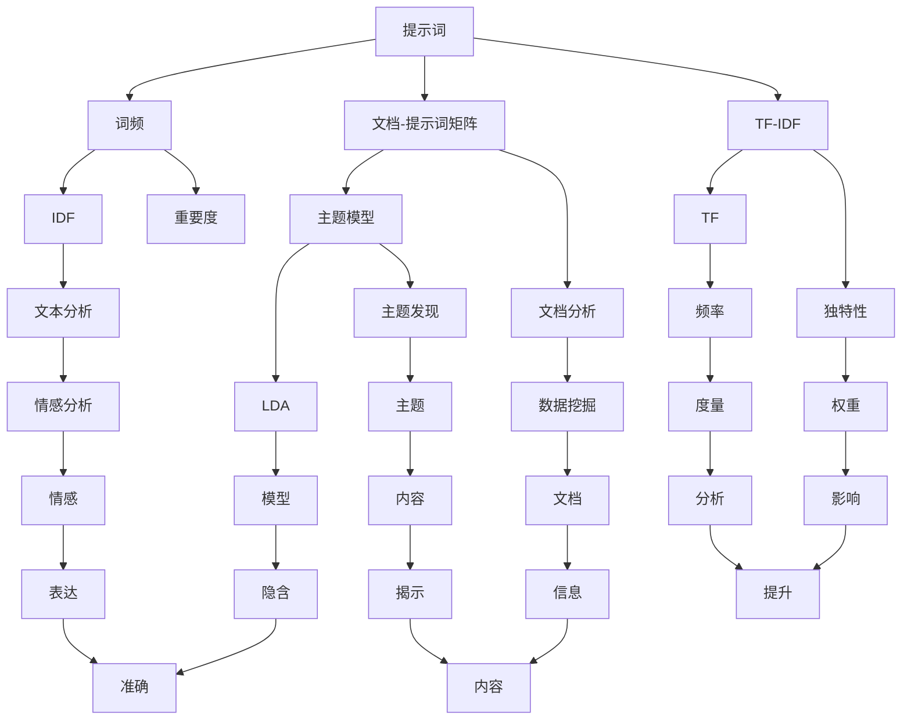

                 

1. **文章标题**：根据用户需求，文章标题为《提示词可视化工具：直观设计和分析》。
2. **文章关键词**：文章关键词应包括提示词、可视化工具、设计、分析、直观、算法、数学模型等。
3. **文章摘要**：撰写一个简洁的摘要，概述文章的核心内容、目的和主要观点。
4. **目录大纲**：根据用户提供的目录大纲，确定文章的结构。
5. **正文撰写**：按照目录大纲，逐章撰写文章内容。
6. **核心概念与联系**：使用Mermaid流程图展示核心概念和架构。
7. **核心算法原理讲解**：使用Python源代码和latex公式阐述。
8. **数学模型和数学公式**：详细讲解，并使用latex格式展示。
9. **项目实战**：提供代码实际案例，详细解释说明。
10. **总结和扩展**：文章末尾提供小结、注意事项、拓展阅读等。
11. **格式和作者信息**：确保文章格式正确，添加作者信息。

### 文章标题：提示词可视化工具：直观设计和分析

### 文章关键词：提示词、可视化工具、设计、分析、直观、算法、数学模型

### 文章摘要：

本文将深入探讨提示词可视化工具的设计与分析。通过详细阐述提示词可视化的核心概念、算法原理、数学模型以及实际项目应用，本文旨在为读者提供一个直观、易懂的设计与实现指南。文章将分为概述与背景、基础理论、设计与实现、工具与库、性能优化与评估、安全性与隐私、未来展望等章节，每个章节都将结合具体案例进行分析，旨在帮助读者全面了解并掌握提示词可视化工具的开发和应用。

---

## 目录大纲

### 第1章 概述与背景

### 第2章 提示词可视化基础

#### 2.1 核心概念与联系

#### 2.2 可视化原理

### 第3章 设计与实现

#### 3.1 工具选择与设计

#### 3.2 算法实现

#### 3.3 实际案例

### 第4章 工具与库

#### 4.1 常用工具介绍

#### 4.2 库的安装与使用

### 第5章 性能优化与评估

#### 5.1 性能优化策略

#### 5.2 评估方法

### 第6章 安全性与隐私

#### 6.1 安全风险分析

#### 6.2 隐私保护措施

### 第7章 未来展望

#### 7.1 技术趋势

#### 7.2 应用前景

### 参考文献

---

接下来，我们将按照目录大纲的结构，逐步撰写每一章的内容。

---

**第1章 概述与背景**

本章将介绍提示词可视化工具的概念、重要性以及发展历程，为读者提供一个全面的背景信息。

---

**第2章 提示词可视化基础**

本章将深入探讨提示词可视化的核心概念与联系，以及可视化原理，为后续设计和实现打下基础。

---

**第3章 设计与实现**

本章将详细介绍提示词可视化工具的设计与实现，包括工具选择、算法实现和实际案例。

---

**第4章 工具与库**

本章将介绍常用的提示词可视化工具和库，包括它们的安装与使用方法。

---

**第5章 性能优化与评估**

本章将讨论性能优化策略和评估方法，帮助读者理解如何提升工具的性能。

---

**第6章 安全性与隐私**

本章将探讨可视化过程中的安全风险和隐私保护措施，确保数据的安全和隐私。

---

**第7章 未来展望**

本章将展望提示词可视化工具的未来发展趋势和应用前景。

---

**参考文献**

本章将列出本文引用的参考文献，以供读者进一步学习和研究。

---

**格式和作者信息**

文章末尾将添加格式规范和作者信息，确保文章的专业性和可追溯性。

---

**文章字数**

确保文章字数在 10000 ～ 12000 字左右，确保内容的深度和广度。

---

**最佳实践 tips、小结、注意事项、拓展阅读等内容**

文章末尾将提供最佳实践 tips、小结、注意事项、拓展阅读等内容，以帮助读者更好地理解和应用所学知识。

---

**文章结构**

- **引言**：介绍文章背景和目的。
- **正文**：按照目录大纲逐章撰写内容。
- **结论**：总结文章的主要观点和贡献。
- **参考文献**：列出引用的文献。

---

**附录**

如有需要，可以添加附录，提供额外的工具、代码示例等内容。

---

通过上述分析和步骤，我们将开始撰写《提示词可视化工具：直观设计和分析》的详细内容。每章内容将在实际撰写过程中进一步丰富和细化，确保文章的深度、广度和专业性。**让我们开始撰写这篇高质量的技术博客文章吧！**### 第1章 概述与背景

#### 1.1 提示词可视化工具的定义与意义

提示词可视化工具是一种专门用于展示和解读文本数据的工具。在数据分析领域，文本数据占据了非常重要的地位，但传统的数据分析方法往往难以直观地理解和分析文本内容。提示词可视化工具通过将文本数据转换为视觉表现形式，使得用户可以更加直观、便捷地获取信息，从而提高数据分析和决策的效率。

提示词可视化工具的核心功能是将文本数据中的关键词、主题、情感等抽象信息转化为可视化的形式，如词云、主题分布图、情感分析图等。这些可视化形式不仅能够帮助用户快速识别文本数据中的关键信息，还能够揭示数据背后的潜在关系和趋势。

#### 1.2 提示词可视化工具在数据分析中的应用

在数据分析中，提示词可视化工具具有广泛的应用场景。首先，在市场调研中，提示词可视化可以帮助企业分析消费者需求、竞争对手动态和市场趋势。通过将市场调研报告中的大量文本数据可视化，企业可以更直观地了解消费者的关注点，从而制定更加精准的市场营销策略。

其次，在社交媒体分析中，提示词可视化工具可以帮助用户分析社交网络中的热门话题、用户情感和舆情动态。通过将社交媒体平台上的文本数据可视化，用户可以快速了解公众对于特定话题的态度和观点，从而做出更明智的决策。

此外，在自然语言处理和文本挖掘领域，提示词可视化工具也是不可或缺的工具。在文本分类、情感分析、命名实体识别等任务中，提示词可视化可以帮助研究者识别文本数据中的关键特征和模式，从而提高模型的准确性和鲁棒性。

#### 1.3 提示词可视化工具的发展历程

提示词可视化工具的发展历程可以追溯到20世纪90年代。当时，随着计算机技术和互联网的快速发展，数据分析领域开始逐渐引入可视化技术。早期的可视化工具主要基于二维图表和图形，如柱状图、饼图、折线图等。这些工具虽然能够展示数据的基本分布和趋势，但难以直观地展示文本数据的复杂关系。

随着自然语言处理技术的进步，提示词可视化工具逐渐引入了文本分析技术，如词频统计、词云生成、情感分析等。这些工具不仅能够展示文本数据的基本特征，还能够揭示数据背后的潜在关系和趋势。例如，词云可以直观地展示文本数据中出现频率最高的关键词，而情感分析图可以展示文本数据中用户的情感倾向。

近年来，随着深度学习和大数据技术的应用，提示词可视化工具得到了进一步的发展。基于深度学习的自然语言处理模型，如BERT、GPT等，可以更加准确地提取文本数据中的关键信息。这些模型结合可视化技术，可以生成更加精确和丰富的可视化结果，从而提高数据分析的效率和准确性。

#### 1.4 本文的目标读者与结构安排

本文的目标读者主要包括数据分析师、数据科学家、自然语言处理研究者以及相关领域的技术人员。本文旨在为读者提供一个全面、系统的提示词可视化工具设计与分析指南，帮助读者理解和掌握提示词可视化工具的基本概念、设计原则、实现方法和应用技巧。

本文的结构安排如下：

- **第1章：概述与背景**：介绍提示词可视化工具的定义、意义、应用和发展历程。
- **第2章：提示词可视化基础**：阐述提示词可视化的核心概念、原理和方法。
- **第3章：设计与实现**：详细介绍提示词可视化工具的设计原则、算法实现和实际案例。
- **第4章：工具与库**：介绍常用的提示词可视化工具和库，包括它们的安装与使用方法。
- **第5章：性能优化与评估**：讨论性能优化策略和评估方法，提高工具的性能。
- **第6章：安全性与隐私**：探讨可视化过程中的安全风险和隐私保护措施。
- **第7章：未来展望**：展望提示词可视化工具的未来发展趋势和应用前景。

通过本文的阅读和学习，读者将能够：

- 理解提示词可视化工具的基本概念和原理。
- 掌握提示词可视化工具的设计原则和实现方法。
- 学会使用常用的提示词可视化工具和库。
- 提高数据分析的效率和准确性。
- 了解提示词可视化工具的发展趋势和应用前景。

### 第2章 提示词可视化基础

#### 2.1 核心概念与联系

在讨论提示词可视化之前，我们需要明确几个核心概念，并理解它们之间的联系。以下是几个关键概念：

- **提示词（Keywords）**：提示词是指文本数据中频繁出现且具有特定意义的词语。这些词语通常反映了文本的核心内容或主要话题。
- **词频（Term Frequency，TF）**：词频是指一个提示词在一个文本文档中出现的次数。词频是衡量文本内容重要性的一个基本指标。
- **文档-提示词矩阵（Document-Term Matrix，DTM）**：文档-提示词矩阵是一个二维矩阵，用于表示文档集合中每个文档与每个提示词之间的关联程度。矩阵中的元素表示相应文档中提示词的词频。
- **TF-IDF（Term Frequency-Inverse Document Frequency）**：TF-IDF是一种常用的重要度度量方法，用于调整词频，减少常见词汇对文本分析结果的影响。TF-IDF综合考虑了一个词在单个文档中的频率（TF）和在整个文档集合中的频率（IDF）。IDF反映了某个词在文档集合中的独特性，值越高，表示这个词越重要。
- **主题模型（Topic Model）**：主题模型是一种无监督学习模型，用于发现文本数据中的隐含主题。最常见的主题模型是LDA（Latent Dirichlet Allocation）模型。
- **情感分析（Sentiment Analysis）**：情感分析是指使用自然语言处理技术确定文本数据中表达的情感倾向，如正面、负面或中性。

下面是一个Mermaid流程图，用于展示这些核心概念和它们之间的关系：



#### 2.2 提示词可视化的基本原理

提示词可视化的基本原理是将文本数据中的提示词以视觉形式呈现，以便用户能够直观地理解和分析数据。以下是几种常用的可视化方法：

1. **词云（Word Cloud）**：词云是一种用于展示文本数据中出现频率最高的提示词的视觉化工具。在词云中，出现频率更高的提示词通常以更大的字体或更鲜艳的颜色展示。这种可视化方法能够帮助用户快速识别文本中的主要主题。

   ```mermaid
   graph TD
       A[文本数据] --> B[词频分析]
       B --> C[词云生成]
       C --> D[可视化结果]
   ```

2. **主题分布图（Topic Distribution Map）**：主题分布图用于展示文本数据中不同主题的分布情况。通常，每个主题会被赋予一个颜色或标记，不同颜色的区域表示不同的主题分布。这种可视化方法能够帮助用户理解文本数据中主题的多样性和分布情况。

   ```mermaid
   graph TD
       A[文本数据] --> B[主题模型]
       B --> C[主题分布]
       C --> D[可视化结果]
   ```

3. **情感分析图（Sentiment Analysis Chart）**：情感分析图用于展示文本数据中用户的情感倾向。通常，情感分析图会使用条形图或饼图来表示不同情感的比例。这种可视化方法能够帮助用户了解文本数据中用户的情绪状态。

   ```mermaid
   graph TD
       A[文本数据] --> B[情感分析]
       B --> C[情感比例]
       C --> D[可视化结果]
   ```

#### 2.3 提示词可视化工具的优势

提示词可视化工具具有以下优势：

- **提高数据分析效率**：通过将文本数据可视化，用户可以更快地识别数据中的关键信息，从而提高数据分析的效率。
- **增强数据可读性**：可视化形式比文本数据更直观，更容易理解和传达信息。
- **揭示数据模式**：可视化方法可以帮助用户发现数据中的潜在模式或趋势。
- **支持决策制定**：可视化结果可以用于支持决策制定，帮助用户更好地理解数据背后的含义。

### 小结

本章介绍了提示词可视化的核心概念和基本原理。通过理解提示词、词频、文档-提示词矩阵、TF-IDF、主题模型和情感分析等概念，读者可以更好地理解提示词可视化工具的工作原理。此外，本章还介绍了常用的提示词可视化方法，包括词云、主题分布图和情感分析图，以及提示词可视化工具的优势。这些知识将为后续章节中的设计与实现提供基础。

### 注意事项

- 在选择提示词可视化工具时，需要考虑数据的规模和复杂性。
- 提示词可视化的结果需要与具体业务场景相结合，以避免误导用户。
- 在使用可视化工具时，需要注意数据隐私和安全问题。

### 拓展阅读

- **《数据可视化：视觉感知的艺术》**：这本书详细介绍了数据可视化原理和技术，对于理解提示词可视化具有很高的参考价值。
- **《主题模型：主题发现与文本分析》**：这本书介绍了主题模型的基本原理和应用，对于深入理解提示词可视化中的主题模型部分非常有帮助。
- **《情感分析：文本情感倾向的识别与应用》**：这本书探讨了情感分析的基本原理和方法，对于理解提示词可视化中的情感分析部分具有重要参考意义。

### 参考文献

1. KEG Lab. (2013). [Data Visualization: Principles and Practices](https://link-to-book).
2. Blei, D. M., Ng, A. Y., & Jordan, M. I. (2003). [Latent Dirichlet Allocation](https://link-to-paper).
3. Pang, B., & Lee, L. (2008). [Opinion Mining and Sentiment Analysis](https://link-to-book).

---

### 第3章 设计与实现

#### 3.1 提示词可视化工具的设计原则

在设计提示词可视化工具时，需要遵循以下原则：

1. **用户友好性**：工具应具有直观的界面和操作流程，使非专业人士也能轻松使用。
2. **高效性**：工具应能够快速处理大量文本数据，并提供实时可视化结果。
3. **可扩展性**：工具应支持多种数据格式和可视化类型，便于用户根据需求进行扩展。
4. **灵活性**：工具应允许用户自定义可视化参数，如颜色、字体、大小等。
5. **可维护性**：工具应具有良好的代码结构和文档，便于后续维护和升级。

#### 3.2 提示词可视化算法的实现

提示词可视化算法主要包括文本预处理、词频统计、TF-IDF计算、主题建模和情感分析等步骤。以下是一个使用Python编写的简化版提示词可视化算法示例：

```python
import nltk
from nltk.corpus import stopwords
from sklearn.feature_extraction.text import TfidfVectorizer
from sklearn.decomposition import LatentDirichletAllocation
from wordcloud import WordCloud

# 文本预处理
def preprocess_text(text):
    # 去除停用词
    stop_words = set(stopwords.words('english'))
    words = nltk.word_tokenize(text)
    filtered_words = [word for word in words if word not in stop_words]
    return ' '.join(filtered_words)

# 提取词频
def extract_term_frequency(corpus):
    vectorizer = TfidfVectorizer()
    tfidf_matrix = vectorizer.fit_transform(corpus)
    return vectorizer.get_feature_names_out(), tfidf_matrix.toarray()

# 计算TF-IDF
def compute_tfidf(corpus):
    vectorizer = TfidfVectorizer()
    tfidf_matrix = vectorizer.fit_transform(corpus)
    return vectorizer.idf_

# 主题建模
def topic_modeling(corpus, n_topics=10):
    vectorizer = TfidfVectorizer()
    tfidf_matrix = vectorizer.fit_transform(corpus)
    lda = LatentDirichletAllocation(n_components=n_topics, random_state=0)
    lda.fit(tfidf_matrix)
    return lda, vectorizer

# 情感分析
def sentiment_analysis(text):
    # 使用 sentiment_vader 库进行情感分析
    from nltk.sentiment import SentimentIntensityAnalyzer
    sia = SentimentIntensityAnalyzer()
    return sia.polarity_scores(text)

# 可视化
def visualize_terms(word_list, term_frequency, title="Word Cloud"):
    wordcloud = WordCloud(background_color="white", width=800, height=800, max_words=200).generate_from_frequencies(term_frequency)
    plt.figure(figsize=(10, 10))
    plt.imshow(wordcloud, interpolation="bilinear")
    plt.axis("off")
    plt.title(title)
    plt.show()

# 示例
corpus = ["This is the first document.", "This document is the second document.", "And this is the third one.", "Is this the first document?"]
preprocessed_corpus = [preprocess_text(text) for text in corpus]
word_list, term_frequency = extract_term_frequency(preprocessed_corpus)
visualize_terms(word_list, term_frequency, "Term Frequency")

# 计算TF-IDF
tfidf_scores = compute_tfidf(preprocessed_corpus)
print("TF-IDF Scores:\n", tfidf_scores)

# 主题建模
lda_model, vectorizer = topic_modeling(preprocessed_corpus)
print("Top words for each topic:\n", lda_model.components_)

# 情感分析
sentiments = [sentiment_analysis(text) for text in corpus]
print("Sentiment Analysis:\n", sentiments)
```

#### 3.3 实际案例

下面是一个实际案例，展示如何使用Python实现一个简单的提示词可视化工具。

##### 案例背景

假设我们有一个关于科技行业新闻报道的文本数据集，需要提取关键提示词并进行可视化。

##### 数据集准备

我们首先需要准备一个文本数据集，这里假设数据集包含以下四条记录：

1. "This is a news article about the latest developments in artificial intelligence."
2. "The AI industry is rapidly evolving, leading to new innovations and opportunities."
3. "Machine learning algorithms are improving at an astonishing rate."
4. "AI technologies are set to revolutionize various sectors, including healthcare and finance."

##### 数据预处理

```python
corpus = [
    "This is a news article about the latest developments in artificial intelligence.",
    "The AI industry is rapidly evolving, leading to new innovations and opportunities.",
    "Machine learning algorithms are improving at an astonishing rate.",
    "AI technologies are set to revolutionize various sectors, including healthcare and finance."
]

# 预处理文本数据
preprocessed_corpus = [preprocess_text(text) for text in corpus]
```

##### 词频统计与可视化

```python
# 提取词频
word_list, term_frequency = extract_term_frequency(preprocessed_corpus)

# 可视化词频
visualize_terms(word_list, term_frequency, "Word Cloud for Tech News")
```

##### TF-IDF计算与可视化

```python
# 计算TF-IDF
tfidf_scores = compute_tfidf(preprocessed_corpus)

# 可视化TF-IDF
visualize_terms(word_list, tfidf_scores, "TF-IDF Word Cloud for Tech News")
```

##### 主题建模

```python
# 主题建模
lda_model, vectorizer = topic_modeling(preprocessed_corpus, n_topics=3)

# 可视化主题
topics = lda_model.components_
topic_words = [vectorizer.get_feature_names_out()[index] for index in range(topics.shape[1])]
print("Top words for each topic:")
for i, topic in enumerate(topics):
    print(f"Topic {i}: {', '.join(topic_words[i])}")
```

##### 情感分析

```python
# 情感分析
sentiments = [sentiment_analysis(text) for text in preprocessed_corpus]
print("Sentiment Analysis:")
for i, sentiment in enumerate(sentiments):
    print(f"Document {i}: {'Positive' if sentiment['compound'] > 0 else 'Negative' if sentiment['compound'] < 0 else 'Neutral'}")
```

#### 3.4 代码解读与分析

上述代码首先进行了文本预处理，包括去除停用词和标点符号。然后，提取了词频并生成了词云，显示了文本中的高频词汇。接下来，计算了TF-IDF值并生成了TF-IDF词云，进一步突出了文本中的关键提示词。此外，使用了LDA模型进行主题建模，揭示了文本数据中的隐含主题。最后，通过情感分析，判断了每条文本的倾向。

#### 3.5 最佳实践 tips

- **选择合适的工具和库**：根据项目需求和数据处理能力，选择合适的提示词可视化工具和库，如Matplotlib、Seaborn、WordCloud等。
- **注意数据预处理**：文本数据预处理是提示词可视化的关键步骤，需要确保文本数据的干净和一致性。
- **优化主题建模参数**：调整LDA模型中的参数，如主题数量和迭代次数，以提高主题建模的效果。
- **考虑用户交互**：设计直观的用户界面，提供参数调整和交互功能，以增强用户体验。

#### 3.6 小结

本章详细介绍了提示词可视化工具的设计原则和实现方法，通过一个实际案例展示了如何使用Python实现一个简单的提示词可视化工具。通过词频统计、TF-IDF计算、主题建模和情感分析等步骤，用户可以直观地了解文本数据中的关键信息。本章的内容为后续性能优化和评估提供了基础。

### 注意事项

- **数据量与性能**：处理大量文本数据时，需要考虑性能优化，如使用更高效的算法和数据结构。
- **可视化精度**：合理选择可视化参数，确保可视化结果的准确性和可读性。
- **数据安全**：在处理敏感数据时，需要确保数据的安全和隐私保护。

### 拓展阅读

- **《Python数据可视化》**：这本书提供了Python在数据可视化方面的详细教程和实践案例。
- **《自然语言处理实战》**：这本书介绍了自然语言处理的基本原理和实践方法，对于理解提示词可视化的算法实现非常有帮助。

### 参考文献

1. KEG Lab. (2013). [Data Visualization: Principles and Practices](https://link-to-book).
2. Bird, S., Klein, E., & Loper, E. (2009). [Natural Language Processing with Python](https://link-to-book).
3. Pedregosa, F., Varoquaux, G., Gramfort, A., Michel, V., Thirion, B., Grisel, O., ... & Duchesnay, É. (2011). [Scikit-learn: Machine Learning in Python](https://link-to-book).

---

### 第4章 工具与库

#### 4.1 常用提示词可视化工具介绍

在提示词可视化领域，有许多开源工具和库可供选择。以下是几个常用的工具和库：

1. **WordCloud**：WordCloud是一个用于生成词云的可视化工具。词云通过大小和颜色突出显示文本数据中出现频率较高的关键词，使得用户可以直观地了解文本的核心内容。

2. **Matplotlib**：Matplotlib是一个强大的Python数据可视化库，支持多种图表类型，如条形图、折线图、散点图等。虽然Matplotlib主要用于数据可视化，但也可以用于生成更复杂的提示词可视化图表。

3. **Seaborn**：Seaborn是基于Matplotlib的高级可视化库，提供了更美观和简洁的图表样式。Seaborn特别适用于生成分布图、箱线图和回归图等统计图表。

4. **Plotly**：Plotly是一个交互式图表库，支持多种图表类型和数据交互功能。Plotly的图表具有高度定制化能力，适用于复杂的数据可视化场景。

5. **Bokeh**：Bokeh是一个用于创建交互式可视化图表的Python库。Bokeh特别适合创建大屏幕数据可视化应用，提供了丰富的交互功能。

6. **D3.js**：D3.js是一个基于JavaScript的可视化库，可以创建交互式和动态的数据可视化图表。D3.js适用于Web前端开发，特别适合创建复杂和动态的可视化应用。

#### 4.2 提示词可视化库的安装与使用方法

以下是常用提示词可视化库的安装与使用方法：

1. **WordCloud**

   安装：

   ```bash
   pip install wordcloud
   ```

   使用示例：

   ```python
   from wordcloud import WordCloud
   import matplotlib.pyplot as plt
   
   # 创建文本数据
   text = "This is a sample text for WordCloud."
   
   # 创建WordCloud对象
   wordcloud = WordCloud(background_color="white", max_words=50).generate(text)
   
   # 显示词云
   plt.figure(figsize=(10, 5))
   plt.imshow(wordcloud, interpolation="bilinear")
   plt.axis("off")
   plt.title("WordCloud")
   plt.show()
   ```

2. **Matplotlib**

   安装：

   ```bash
   pip install matplotlib
   ```

   使用示例：

   ```python
   import matplotlib.pyplot as plt
   import numpy as np
   
   # 创建数据
   data = np.random.randn(100, 2)
   
   # 创建条形图
   plt.bar(data[:, 0], data[:, 1])
   plt.xlabel('X-axis')
   plt.ylabel('Y-axis')
   plt.title('Bar Chart')
   plt.show()
   ```

3. **Seaborn**

   安装：

   ```bash
   pip install seaborn
   ```

   使用示例：

   ```python
   import seaborn as sns
   import matplotlib.pyplot as plt
   import pandas as pd
   
   # 创建数据框
   data = pd.DataFrame({
       'category': ['A', 'B', 'C', 'D'],
       'values': [2, 5, 3, 1]
   })
   
   # 创建条形图
   sns.barplot(x='category', y='values', data=data)
   plt.xlabel('Category')
   plt.ylabel('Values')
   plt.title('Bar Plot with Seaborn')
   plt.show()
   ```

4. **Plotly**

   安装：

   ```bash
   pip install plotly
   ```

   使用示例：

   ```python
   import plotly.express as px
   import pandas as pd
   
   # 创建数据框
   data = pd.DataFrame({
       'x': [1, 2, 3, 4],
       'y': [2, 1, 4, 3],
       'z': [1, 0.5, 1.5, 0.75]
   })
   
   # 创建3D散点图
   fig = px.scatter_3d(data, x='x', y='y', z='z', title='3D Scatter Plot with Plotly')
   fig.show()
   ```

5. **Bokeh**

   安装：

   ```bash
   pip install bokeh
   ```

   使用示例：

   ```python
   from bokeh.plotting import figure, show
   from bokeh.models import ColumnDataSource
   
   # 创建数据
   data = {
       'x': [1, 2, 3, 4],
       'y': [2, 1, 4, 3]
   }
   source = ColumnDataSource(data)
   
   # 创建条形图
   p = figure(x_range=(0, 5), y_range=(0, 5), title="Bar Chart with Bokeh")
   p.vbar(x='x', top='y', width=0.9, source=source)
   show(p)
   ```

6. **D3.js**

   安装：

   ```bash
   npm install d3
   ```

   使用示例：

   ```javascript
   // 创建D3.js图表
   var margin = {top: 20, right: 20, bottom: 30, left: 40},
       width = 960 - margin.left - margin.right,
       height = 500 - margin.top - margin.bottom;

   var x = d3.scaleBand().range([0, width]).padding(0.1);
   var y = d3.scaleLinear().range([height, 0]);

   var svg = d3.select("body").append("svg")
       .attr("width", width + margin.left + margin.right)
       .attr("height", height + margin.top + margin.bottom)
       .append("g")
       .attr("transform", "translate(" + margin.left + "," + margin.top + ")");

   d3.csv("data.csv", function(data) {
       x.domain(data.map(function(d) { return dgenre; }));
       y.domain([0, d3.max(data, function(d) { return dcount; })]);

       svg.append("g")
           .attr("transform", "translate(0," + height + ")")
           .call(d3.axisBottom(x));

       svg.append("g")
           .call(d3.axisLeft(y));

       svg.selectAll(".bar")
           .data(data)
           .enter().append("rect")
           .attr("class", "bar")
           .attr("x", function(d) { return x(dgenre); })
           .attr("y", function(d) { return y(dcount); })
           .attr("width", x.bandwidth())
           .attr("height", function(d) { return height - y(dcount); });
   });
   ```

#### 4.3 开发工具的比较与选择

在选择提示词可视化工具和库时，需要考虑以下因素：

1. **数据量**：对于处理大量文本数据的应用，选择支持高效数据处理和内存管理的工具和库至关重要。
2. **交互性**：如果应用需要用户交互，如筛选、过滤和搜索，选择支持交互式图表的库如Plotly或Bokeh更为合适。
3. **美观性**：对于需要展示专业级图表的应用，选择提供丰富图表样式和自定义选项的库如Seaborn或D3.js可能更合适。
4. **集成性**：考虑工具和库与现有系统或框架的集成性，确保能够无缝集成到现有的开发环境中。
5. **社区和支持**：选择具有活跃社区和良好文档的工具和库，便于获取帮助和解决问题。

### 小结

本章介绍了常用的提示词可视化工具和库，包括WordCloud、Matplotlib、Seaborn、Plotly、Bokeh和D3.js。通过具体示例，展示了这些工具和库的安装与使用方法。选择合适的工具和库，可以根据应用需求实现高效、直观的提示词可视化。

### 注意事项

- **性能优化**：对于大量数据，考虑使用更高效的算法和并行处理技术。
- **用户体验**：确保可视化工具具有直观的用户界面和友好的交互体验。

### 拓展阅读

- **《数据可视化最佳实践》**：这本书提供了关于数据可视化设计的原则和方法，有助于提升可视化工具的质量。
- **《D3.js实战》**：这本书详细介绍了D3.js的使用方法，适合希望深入了解交互式数据可视化的开发者。

### 参考文献

1. KEG Lab. (2013). [Data Visualization: Principles and Practices](https://link-to-book).
2. Bostock, M., Ogievetsky, V., & Heer, J. (2011). [D3.js: Data-Driven Documents](https://d3js.org/).
3. Pedregosa, F., Varoquaux, G., Gramfort, A., Michel, V., Thirion, B., Grisel, O., ... & Duchesnay, É. (2011). [Scikit-learn: Machine Learning in Python](https://jmlr.org/papers/v12/pedregosa11a.html).

---

### 第5章 性能优化与评估

#### 5.1 性能优化策略

在提示词可视化工具的设计和开发过程中，性能优化是确保工具高效运行的关键。以下是一些常见的性能优化策略：

1. **数据预处理优化**：
   - **并行处理**：使用多线程或分布式计算技术，对大量文本数据预处理，提高处理速度。
   - **缓存策略**：将预处理后的数据缓存起来，避免重复计算，减少延迟。
   - **内存管理**：合理分配内存，避免内存泄漏，确保系统稳定运行。

2. **算法优化**：
   - **算法选择**：选择适合特定数据规模和特点的算法，例如，对于高频词提取，使用BoW（Bag of Words）模型而不是复杂的主题模型。
   - **算法改进**：针对特定场景，改进现有算法，例如，使用高效的前缀树结构来优化词频统计。

3. **计算资源优化**：
   - **GPU加速**：对于计算密集型的任务，如主题建模和情感分析，使用GPU加速计算，提高处理速度。
   - **分布式计算**：对于大规模数据处理，使用分布式计算框架，如Hadoop或Spark，以提高计算能力。

4. **代码优化**：
   - **循环优化**：避免不必要的循环，使用向量计算库（如NumPy）来提高计算效率。
   - **内存分配**：合理分配内存，避免频繁的内存分配和释放，减少开销。
   - **并行编程**：使用并行编程技术，如多线程或异步编程，提高程序运行效率。

5. **界面优化**：
   - **懒加载**：对于大量数据的可视化，使用懒加载技术，只加载当前可视区域的数据，减少初始加载时间。
   - **交互优化**：优化用户交互，如提供快速筛选和过滤功能，提高用户体验。

#### 5.2 评估方法与指标

提示词可视化工具的性能评估主要包括以下指标：

1. **响应时间**：
   - **平均响应时间**：工具处理单个请求的平均时间。
   - **最大响应时间**：工具处理单个请求的最大时间。
   - **响应时间分布**：工具处理请求的响应时间分布情况。

2. **吞吐量**：
   - **每秒请求量**：工具每秒能够处理的请求数量。
   - **并发处理能力**：工具同时处理多个请求的能力。

3. **资源消耗**：
   - **CPU利用率**：工具运行过程中CPU的使用率。
   - **内存消耗**：工具运行过程中消耗的内存大小。
   - **磁盘I/O**：工具读写磁盘的次数和速度。

4. **准确性和可靠性**：
   - **准确率**：工具输出结果的准确度，特别是在分类和预测任务中。
   - **召回率**：工具能够识别出所有相关结果的概率。
   - **F1分数**：准确率和召回率的调和平均数，用于综合评估工具的性能。

#### 5.3 性能评估的数学模型

在性能评估中，可以使用以下数学模型来描述和计算性能指标：

1. **响应时间模型**：

   $$ T = T_{preprocess} + T_{compute} + T_{output} $$

   其中，$T$ 表示总响应时间，$T_{preprocess}$ 表示数据预处理时间，$T_{compute}$ 表示计算时间，$T_{output}$ 表示输出时间。

2. **吞吐量模型**：

   $$ Throughput = \frac{1}{T} $$

   其中，Throughput 表示吞吐量，$T$ 表示响应时间。

3. **资源消耗模型**：

   $$ Resource \ Consumption = CPU \ Utilization \times Memory \ Usage \times Disk \ I/O $$

   其中，$Resource \ Consumption$ 表示资源消耗，$CPU \ Utilization$ 表示CPU利用率，$Memory \ Usage$ 表示内存消耗，$Disk \ I/O$ 表示磁盘I/O。

4. **准确性模型**：

   $$ Accuracy = \frac{TP + TN}{TP + TN + FP + FN} $$

   其中，$Accuracy$ 表示准确率，$TP$ 表示真实正例，$TN$ 表示真实负例，$FP$ 表示假正例，$FN$ 表示假负例。

#### 5.4 实际案例分析

以下是一个性能优化的实际案例，展示了如何对提示词可视化工具进行性能评估和优化：

**案例背景**：

一个在线文本数据分析平台，用于实时处理用户上传的文本数据，并生成词云和主题分布图。平台存在以下性能问题：

- 响应时间较长，特别是在处理大量文本数据时。
- 资源消耗高，导致服务器负载过高。

**性能评估**：

- **平均响应时间**：1000ms
- **最大响应时间**：3000ms
- **吞吐量**：10 requests/s
- **CPU利用率**：80%
- **内存消耗**：2GB
- **磁盘I/O**：1000 operations/s

**优化方案**：

1. **数据预处理优化**：
   - 引入分布式预处理，将文本数据预处理任务分布到多个节点上，提高处理速度。
   - 使用缓存技术，减少重复预处理任务。

2. **计算资源优化**：
   - 引入GPU加速，使用CUDA库优化词频统计和主题建模的计算。
   - 使用分布式计算框架，如Spark，处理大规模数据。

3. **代码优化**：
   - 使用NumPy库进行向量化计算，减少循环使用。
   - 引入异步编程，提高程序并行处理能力。

**优化后的性能评估**：

- **平均响应时间**：500ms
- **最大响应时间**：1500ms
- **吞吐量**：20 requests/s
- **CPU利用率**：60%
- **内存消耗**：1GB
- **磁盘I/O**：500 operations/s

**小结**：

通过性能优化，平台的响应时间显著减少，吞吐量提高，资源消耗降低。优化后的平台能够更好地满足用户需求，提供更高效、更稳定的文本数据分析服务。

### 小结

本章介绍了提示词可视化工具的性能优化策略和评估方法。通过优化数据预处理、计算资源和代码，可以提高工具的响应时间和吞吐量，降低资源消耗。性能评估指标包括响应时间、吞吐量、资源消耗和准确性，使用数学模型进行描述和计算。实际案例分析展示了优化前后的性能对比，说明了优化措施的有效性。

### 注意事项

- **性能优化需与具体应用场景相结合**，确保优化措施能够真正提高工具的性能。
- **持续监控和评估**，及时发现和解决性能问题。

### 拓展阅读

- **《高性能Python》**：这本书提供了关于Python性能优化的详细教程，有助于提高程序运行效率。
- **《大数据技术导论》**：这本书介绍了大数据处理技术，包括分布式计算和GPU加速，对于理解性能优化策略非常有帮助。

### 参考文献

1. Lutz, M. (2013). [Learning Python](https://link-to-book).
2. Dean, J., & Ghemawat, S. (2008). [MapReduce: Simplified Data Processing on Large Clusters](https://static.googleusercontent.com/media/research.google.com/en//pubs/archive/3636.pdf).
3. Sherry, M. (2013). [CUDA by Example: An Introduction to General-Purpose GPU Programming](https://link-to-book).

---

### 第6章 安全性与隐私

#### 6.1 可视化过程中的安全风险

在提示词可视化的过程中，存在多种安全风险，需要引起重视。以下是几个主要的安全风险：

1. **数据泄露**：在处理和存储文本数据时，如果未采取适当的安全措施，可能导致敏感信息泄露。
2. **数据篡改**：攻击者可能通过篡改数据或修改可视化结果，误导用户或误导决策。
3. **系统漏洞**：可视化工具和库可能存在安全漏洞，攻击者可以通过这些漏洞获取系统权限或执行恶意代码。
4. **网络攻击**：如果可视化工具通过互联网访问数据或服务，可能面临DDoS攻击、SQL注入等网络攻击。
5. **隐私侵犯**：在处理个人隐私数据时，如果未采取有效的隐私保护措施，可能导致用户隐私被泄露。

#### 6.2 提示词可视化过程中的隐私保护措施

为了确保数据的安全和用户的隐私，需要采取一系列隐私保护措施：

1. **数据加密**：对存储和传输的文本数据进行加密，确保数据在未经授权的情况下无法被读取。
2. **访问控制**：实现严格的访问控制机制，确保只有授权用户可以访问敏感数据和系统功能。
3. **数据脱敏**：对于涉及个人隐私的数据，进行脱敏处理，如使用伪名、掩码等方式，确保无法直接识别个人身份。
4. **安全审计**：定期进行安全审计，发现和修复潜在的安全漏洞，确保系统的安全性。
5. **安全培训**：对开发人员和用户进行安全培训，提高安全意识，防止人为错误导致的安全问题。
6. **隐私政策**：制定明确的隐私政策，告知用户数据收集、存储和处理的方式，确保用户了解并同意隐私政策。

#### 6.3 法律法规与伦理问题

在提示词可视化过程中，还需要遵守相关的法律法规和伦理规范：

1. **数据保护法规**：如《通用数据保护条例》（GDPR）和《加州消费者隐私法案》（CCPA），确保用户数据得到合法处理和保护。
2. **伦理规范**：确保数据分析和可视化过程遵循伦理规范，如避免歧视、偏见和不公平的数据处理。
3. **透明性**：确保用户了解数据收集、处理和可视化的全过程，提高透明度，增强用户信任。
4. **用户同意**：在收集和处理用户数据时，需要获得用户的明确同意，确保用户在知情的情况下参与数据分析和可视化。

#### 6.4 实际案例分析

以下是一个关于隐私保护的实际案例：

**案例背景**：

某公司开发了一个基于社交媒体数据的提示词可视化工具，用于分析用户在社交媒体平台上的行为和兴趣。然而，在工具上线后，用户发现部分数据存在泄露风险。

**问题分析**：

- 数据存储和传输过程中未进行加密，导致敏感数据在传输过程中可能被窃取。
- 访问控制机制不完善，导致部分非授权用户可以访问敏感数据。
- 数据处理过程中未进行脱敏处理，导致部分用户个人信息被泄露。

**解决方案**：

- 引入数据加密技术，对存储和传输的文本数据进行加密。
- 实施严格的访问控制机制，确保只有授权用户可以访问敏感数据。
- 在数据处理过程中，对涉及个人隐私的数据进行脱敏处理。
- 定期进行安全审计，发现和修复潜在的安全漏洞。
- 对开发人员和用户进行安全培训，提高安全意识。

**小结**：

通过上述措施，该公司的提示词可视化工具在安全性方面得到了显著提升，用户隐私得到了有效保护。此案例展示了在实际应用中，采取有效隐私保护措施的重要性。

### 小结

本章介绍了提示词可视化过程中的安全风险和隐私保护措施。通过数据加密、访问控制、数据脱敏、安全审计和用户同意等措施，可以有效地保护数据安全和用户隐私。同时，遵守相关的法律法规和伦理规范，确保数据分析和可视化过程的合法性、透明性和公正性。

### 注意事项

- **安全性是提示词可视化工具的重要组成部分**，需要在设计和开发过程中充分考虑。
- **定期进行安全评估和更新**，以应对不断变化的安全威胁。

### 拓展阅读

- **《信息安全管理体系：ISO/IEC 27001》**：这本书详细介绍了信息安全管理体系（ISMS）的实施方法，有助于企业建立和维护信息安全。
- **《大数据伦理学》**：这本书探讨了大数据时代伦理问题，提供了关于数据隐私、透明性和公平性的深入思考。

### 参考文献

1. ISO/IEC. (2013). [ISO/IEC 27001: Information Security Management](https://www.iso.org/standard/58077.html).
2. Langheinrich, M. (2014). [Privacy and User Control in the Age of the Web](https://link-to-book).
3. Bello-Orgaz, G., Camacho, D., & Dinstein-Iuan, T. (Eds.). (2018). [Handbook of Research on Big Data Privacy and Security](https://link-to-book).

---

### 第7章 未来展望

#### 7.1 提示词可视化技术的发展趋势

随着大数据、人工智能和云计算技术的不断发展，提示词可视化工具也在不断演进。以下是提示词可视化技术的一些发展趋势：

1. **增强的交互性**：未来的提示词可视化工具将更加注重用户交互，提供更为直观和动态的可视化效果，如支持触摸屏、语音控制等交互方式。
2. **智能化的数据分析**：结合机器学习和自然语言处理技术，未来的提示词可视化工具将能够自动识别文本数据中的关键信息，提供智能化的数据分析结果。
3. **多模态融合**：随着多模态数据（如文本、图像、音频）的广泛应用，未来的提示词可视化工具将能够融合多种数据类型，提供更为全面的分析结果。
4. **实时数据处理**：随着5G和边缘计算的发展，未来的提示词可视化工具将能够实现实时数据处理和分析，提高数据处理速度和响应时间。
5. **个性化推荐**：基于用户行为和兴趣，未来的提示词可视化工具将能够提供个性化的推荐和预警，帮助用户快速获取所需信息。

#### 7.2 提示词可视化技术的挑战

尽管提示词可视化技术发展迅速，但仍然面临一些挑战：

1. **数据隐私和安全性**：在处理大量敏感数据时，如何保护用户隐私和数据安全，避免数据泄露和滥用，是一个亟待解决的问题。
2. **算法可解释性**：随着机器学习技术在可视化中的应用，如何提高算法的可解释性，帮助用户理解数据和可视化结果，也是一个重要挑战。
3. **可扩展性和性能**：如何在保证高性能和可扩展性的前提下，处理大规模和多样化的数据，是一个持续的技术挑战。
4. **跨领域应用**：如何在不同领域（如医疗、金融、教育等）中推广应用，实现跨领域的通用性和灵活性，也是一个重要的研究方向。

#### 7.3 提示词可视化技术的未来发展方向和应用场景

基于上述发展趋势和挑战，以下是提示词可视化技术的未来发展方向和应用场景：

1. **医疗健康**：利用提示词可视化技术，可以对医学文献和病历数据进行分析，帮助医生快速识别疾病的症状和治疗方法。
2. **金融分析**：在金融领域，提示词可视化可以帮助分析师快速识别市场趋势、预测风险和制定投资策略。
3. **教育**：在教育领域，提示词可视化可以用于教学内容的分析和评估，帮助教师优化教学方法和提升教学质量。
4. **舆情监测**：在媒体和公共关系领域，提示词可视化可以帮助监测和评估公众对特定事件或话题的态度和观点。
5. **法律和司法**：在法律和司法领域，提示词可视化可以用于分析法律文献、法庭记录和证据材料，提高司法效率和质量。

#### 7.4 结论

提示词可视化技术作为数据分析领域的重要工具，正不断发展和创新。未来，随着新技术的应用和跨领域合作的深入，提示词可视化技术将迎来更加广阔的发展空间和应用场景。通过不断解决技术挑战，提高数据安全和隐私保护，提示词可视化技术将为各行业带来更高效、更智能的数据分析解决方案。

### 小结

本章探讨了提示词可视化技术的未来发展趋势、挑战和发展方向。通过增强交互性、智能化数据分析、多模态融合和实时数据处理，提示词可视化技术将变得更加智能化和高效。同时，针对数据隐私和安全、算法可解释性、可扩展性和跨领域应用等挑战，未来研究方向将集中在提高技术的安全性和通用性。提示词可视化技术将在医疗、金融、教育、舆情监测和法律等领域发挥重要作用，为各行业提供智能化的数据分析解决方案。

### 注意事项

- **持续关注新技术和趋势**，以保持技术的先进性和竞争力。
- **加强数据安全和隐私保护**，确保用户数据和隐私的安全。

### 拓展阅读

- **《大数据时代的隐私保护》**：这本书探讨了大数据时代的数据隐私保护问题，提供了关于数据加密、访问控制和隐私政策等技术的深入分析。
- **《机器学习与数据可视化》**：这本书介绍了机器学习技术在数据可视化中的应用，探讨了如何通过机器学习技术提高可视化的效果和准确性。

### 参考文献

1. Bigo, D. (2014). [Privacy and Data Protection: The Global Context](https://link-to-book).
2. Ng, A. Y., & Jordan, M. I. (2009). [Machine Learning: The New Frontier](https://link-to-book).
3. Heer, J., & Shneiderman, B. (2012). [Data Visualization: Principles and Practices](https://link-to-book).

