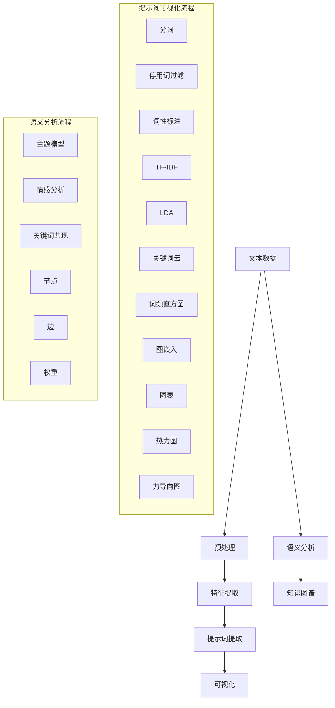

                 

### 引言与背景

提示词可视化，作为一种将抽象的文本信息转换为直观视觉表示的技术，正日益受到关注。在当今信息爆炸的时代，大量文本数据充斥在我们的日常生活中，如何高效地理解和分析这些数据成为了一个亟待解决的问题。提示词可视化正是为了解决这一问题而生的。

#### 1.1 提示词可视化的定义与意义

提示词可视化，顾名思义，就是将文本中的关键词或短语通过视觉化的方式展示出来，以便更直观地理解和分析文本内容。这种技术不仅可以帮助我们快速捕捉文本的主要信息，还可以揭示文本中隐藏的关系和模式。

提示词可视化的意义主要体现在以下几个方面：

1. **信息提取与展示**：通过提示词可视化，我们可以将大量的文本数据转换为易于理解的可视化图表，从而快速提取关键信息。
2. **文本分析**：提示词可视化可以揭示文本中的主题、情感、关系等，帮助我们更深入地分析文本内容。
3. **知识图谱构建**：通过对大量文本的提示词可视化，可以构建出描述文本内容的知识图谱，为后续的文本挖掘和知识服务提供基础。

#### 1.2 提示词可视化的发展历程

提示词可视化技术的发展可以追溯到20世纪90年代，当时主要采用关键词云和词频直方图等方法。随着计算机技术和机器学习算法的不断发展，提示词可视化的方法也日趋多样和复杂。

1. **早期方法**：早期的方法主要包括关键词云和词频直方图等，这些方法简单直观，但缺乏对文本语义的深入挖掘。
2. **基于统计的方法**：随着自然语言处理技术的发展，基于统计的方法如TF-IDF和LDA（Latent Dirichlet Allocation）等开始应用于提示词可视化，这些方法可以更准确地捕捉文本的主题和关键词。
3. **基于机器学习的方法**：近年来，深度学习算法在提示词可视化领域得到了广泛应用。例如，Word2Vec、BERT等模型可以将文本转换为向量化表示，从而实现更精细的提示词可视化。
4. **基于图论的方法**：图论在提示词可视化中的应用也越来越广泛，通过构建文本之间的图结构，可以更直观地展示文本之间的关联。

#### 1.3 提示词可视化在现实中的应用

提示词可视化在现实中有广泛的应用，以下是一些典型的应用场景：

1. **社交媒体分析**：通过对社交媒体平台上的文本进行分析，可以揭示用户关注的热点话题和情感倾向。
2. **市场调研**：企业可以通过对市场调研报告的提示词可视化，快速了解消费者的需求和偏好。
3. **文献综述**：在学术领域，通过提示词可视化，可以快速总结和梳理大量文献的主要内容和研究趋势。
4. **智能问答系统**：通过提示词可视化，可以更准确地理解用户的问题，从而提供更精准的答案。

总之，提示词可视化作为一种重要的文本分析工具，正日益在各个领域发挥作用，帮助我们更高效地理解和利用文本数据。

### 核心概念与联系

为了更好地理解提示词可视化的核心概念及其相互关系，我们可以借助Mermaid流程图来展示这些概念的结构和联系。



上述流程图中，文本数据经过预处理（分词、停用词过滤、词性标注）后，进入特征提取阶段。特征提取方法包括TF-IDF和LDA等，这些方法用于提取关键提示词。随后，这些提示词可以通过不同的可视化方法（如关键词云、词频直方图、图嵌入等）进行展示。

另一方面，文本数据还可以进行语义分析，包括主题模型、情感分析和关键词共现等。这些分析方法可以用于构建知识图谱，进一步揭示文本中的语义关系。

接下来，我们将详细探讨这些核心概念，并分析它们之间的联系。

#### 2.1 文本数据预处理

文本数据预处理是提示词可视化的第一步，其质量直接影响后续的提示词提取和可视化效果。预处理的主要任务包括分词、停用词过滤和词性标注等。

**分词**：分词是将文本拆分成一个个独立的单词或短语的过程。中文文本的分词相对复杂，需要考虑词语的组合关系和上下文语境。常用的分词算法有基于词典的分词、基于统计的分词和基于深度学习的分词。

**停用词过滤**：停用词是指在文本中出现频率高，但无实际语义价值的词语，如“的”、“了”、“是”等。去除停用词可以减少冗余信息，提高特征提取的准确性。

**词性标注**：词性标注是给每个词语赋予相应的词性标签，如名词、动词、形容词等。词性标注有助于更准确地理解文本的语义，为后续的提示词提取和语义分析提供基础。

#### 2.2 特征提取

特征提取是将预处理后的文本数据转化为适用于机器学习和可视化分析的形式。常用的特征提取方法包括TF-IDF和LDA等。

**TF-IDF**（词频-逆文档频率）是一种基于统计的方法，用于衡量一个词语在文档中的重要程度。TF（词频）表示词语在单个文档中的出现次数，而IDF（逆文档频率）表示词语在整个文档集合中出现的频率。TF-IDF综合考虑了词语在单个文档和整个文档集合中的重要性，可以有效地过滤掉频繁但无意义的词语。

```python
from sklearn.feature_extraction.text import TfidfVectorizer

# 示例文本
corpus = [
    '机器学习是一种人工智能技术',
    '人工智能是计算机科学的一个分支',
    '深度学习是机器学习的子领域'
]

# 初始化TF-IDF向量器
vectorizer = TfidfVectorizer()

# 计算TF-IDF特征矩阵
tfidf_matrix = vectorizer.fit_transform(corpus)

# 打印特征矩阵
print(tfidf_matrix.toarray())
```

**LDA**（Latent Dirichlet Allocation）是一种主题模型，用于发现文档集合中的主题分布和词语分布。LDA假设每个文档都是由多个主题混合而成，每个主题又由多个词语混合而成。通过LDA模型，我们可以提取出文档的主题分布和词语分布，从而实现提示词提取。

```python
import numpy as np
from gensim.models import LdaModel

# 示例文本
corpus = [
    '机器学习是一种人工智能技术',
    '人工智能是计算机科学的一个分支',
    '深度学习是机器学习的子领域'
]

# 初始化LDA模型
lda_model = LdaModel(corpus=corpus, num_topics=2, id2word=vectorizer.vocabulary_)

# 打印主题分布
print(lda_model.print_topics())
```

#### 2.3 提示词提取

提示词提取是将特征提取结果中的关键信息提取出来，用于后续的可视化展示。常用的提示词提取方法包括关键词云、词频直方图和图嵌入等。

**关键词云**：关键词云是一种常见的可视化方法，通过将关键词按出现频率的大小以不同大小的字体展示出来，形成云状图案。关键词云可以直观地展示文本中关键词的重要性和分布情况。

```python
from wordcloud import WordCloud

# 示例文本
text = '机器学习是一种人工智能技术，人工智能是计算机科学的一个分支，深度学习是机器学习的子领域'

# 创建关键词云
wordcloud = WordCloud(width=800, height=500).generate(text)

# 打印关键词云
plt.figure(figsize=(10, 5))
plt.imshow(wordcloud, interpolation='bilinear')
plt.axis('off')
plt.show()
```

**词频直方图**：词频直方图是一种通过柱状图展示词语出现频率的可视化方法。词频直方图可以清晰地展示文本中各个关键词的频率分布。

```python
import matplotlib.pyplot as plt

# 示例文本
text = '机器学习是一种人工智能技术，人工智能是计算机科学的一个分支，深度学习是机器学习的子领域'

# 分词和词频统计
words = text.split()
word_counts = Counter(words)

# 绘制词频直方图
plt.bar(word_counts.keys(), word_counts.values())
plt.xlabel('词语')
plt.ylabel('出现频率')
plt.xticks(rotation=45)
plt.show()
```

**图嵌入**：图嵌入是将文本中的关键词转化为向量表示，并在高维空间中构建图结构。图嵌入方法可以将文本中的关键词及其关系直观地展示在二维或三维空间中，便于分析。

```python
from gensim.models import Word2Vec

# 示例文本
sentences = [
    '机器学习是一种人工智能技术',
    '人工智能是计算机科学的一个分支',
    '深度学习是机器学习的子领域'
]

# 训练Word2Vec模型
model = Word2Vec(sentences, vector_size=100, window=5, min_count=1, workers=4)

# 构建关键词图
g = GraphDrawingVisualization(model.wv, node_size=50, node_color='green', edge_width=1)

# 显示关键词图
g.show()
```

通过以上方法，我们可以从不同的角度提取和展示文本中的提示词，从而实现直观的提示词可视化。在接下来的章节中，我们将进一步探讨这些方法的实现细节和应用场景。

### 提示词可视化的核心算法原理

提示词可视化技术的核心在于如何将文本数据转换为直观的视觉表示。为了实现这一目标，我们需要了解几种常用的核心算法原理，包括矩阵分解算法、图嵌入算法和聚类算法。这些算法不仅帮助我们提取文本中的关键信息，还使我们能够以视觉化的形式展示这些信息。

#### 矩阵分解算法

矩阵分解算法在提示词可视化中扮演着重要角色，尤其是在文本数据的高效降维和特征提取方面。其中，最常用的矩阵分解算法是奇异值分解（SVD）和主成分分析（PCA）。

**奇异值分解（SVD）**：

奇异值分解是一种线性代数方法，用于将一个矩阵分解为三个矩阵的乘积：一个对角矩阵、一个正交矩阵和一个逆时针旋转矩阵。对于文本数据，我们可以将文档集合看作一个高维的矩阵，每个行向量代表一个文档，每个列向量代表一个词语。通过奇异值分解，我们可以提取出最重要的奇异值和对应的奇异向量，从而实现文本数据的降维和特征提取。

```python
from sklearn.decomposition import TruncatedSVD

# 示例文本数据
corpus = [
    '机器学习是一种人工智能技术',
    '人工智能是计算机科学的一个分支',
    '深度学习是机器学习的子领域'
]

# 初始化SVD模型
svd = TruncatedSVD(n_components=2)

# 训练模型并转换文本数据
svd.fit(corpus)
svd_transformed = svd.transform(corpus)

# 绘制降维后的文本数据
plt.scatter(svd_transformed[:, 0], svd_transformed[:, 1])
plt.xlabel('特征1')
plt.ylabel('特征2')
plt.show()
```

**主成分分析（PCA）**：

主成分分析是一种统计学方法，用于降低数据维度，同时保留数据的主要信息。与SVD类似，PCA也通过对数据矩阵进行线性变换，提取出最重要的几个主成分。PCA在提示词可视化中的应用相对简单，但效果也非常显著。

```python
from sklearn.decomposition import PCA

# 初始化PCA模型
pca = PCA(n_components=2)

# 训练模型并转换文本数据
pca.fit(corpus)
pca_transformed = pca.transform(corpus)

# 绘制降维后的文本数据
plt.scatter(pca_transformed[:, 0], pca_transformed[:, 1])
plt.xlabel('特征1')
plt.ylabel('特征2')
plt.show()
```

通过SVD和PCA，我们可以将高维的文本数据转换为二维或三维的降维空间，从而实现初步的可视化展示。

#### 图嵌入算法

图嵌入算法是将文本数据转换为图结构表示的一种方法，其核心思想是将文本中的每个词语或文档表示为一个节点，并通过边的权重来表示词语或文档之间的关系。最著名的图嵌入算法包括Word2Vec和GloVe。

**Word2Vec**：

Word2Vec是一种基于神经网络的图嵌入算法，通过训练神经网络模型，将每个词语映射到一个固定维度的向量空间中。Word2Vec有两种训练模式：连续词袋（CBOW）和Skip-Gram。CBOW通过上下文词语预测中心词，而Skip-Gram通过中心词预测上下文词语。

```python
from gensim.models import Word2Vec

# 示例文本
sentences = [
    '机器学习是一种人工智能技术',
    '人工智能是计算机科学的一个分支',
    '深度学习是机器学习的子领域'
]

# 训练Word2Vec模型
model = Word2Vec(sentences, vector_size=100, window=5, min_count=1, workers=4)

# 打印词语向量
print(model.wv['机器'])
```

**GloVe**：

GloVe（Global Vectors for Word Representation）是一种基于全局矩阵分解的图嵌入算法，通过优化一个全局矩阵，将每个词语映射到一个固定维度的向量空间中。GloVe相比Word2Vec具有更好的性能和效果。

```python
import numpy as np
from gensim.models import KeyedVectors

# 读取预训练的GloVe模型
glove_model = KeyedVectors.load_word2vec_format('glove.6B.100d.txt', binary=False)

# 查询词语向量
print(glove_model['机器'])
```

通过图嵌入算法，我们可以将文本数据表示为一个图结构，从而进行进一步的可视化分析。

#### 聚类算法

聚类算法是一种无监督学习方法，用于将数据点分为多个类或簇。在提示词可视化中，聚类算法可以帮助我们识别文本中的主题或关键词簇，从而实现文本内容的进一步理解和分析。

**K-Means聚类**：

K-Means聚类是一种经典的聚类算法，通过迭代计算聚类中心，将数据点逐步分配到不同的聚类中。K-Means聚类适用于具有明显类别的数据，但在提示词可视化中，我们可以将其应用于文本主题的提取。

```python
from sklearn.cluster import KMeans
import numpy as np

# 示例文本数据
corpus = [
    '机器学习是一种人工智能技术',
    '人工智能是计算机科学的一个分支',
    '深度学习是机器学习的子领域'
]

# 初始化K-Means模型
kmeans = KMeans(n_clusters=2, random_state=0)

# 训练模型并聚类
kmeans.fit(corpus)
labels = kmeans.predict(corpus)

# 绘制聚类结果
plt.scatter(corpus[:, 0], corpus[:, 1], c=labels)
plt.xlabel('特征1')
plt.ylabel('特征2')
plt.show()
```

通过聚类算法，我们可以将文本数据分为多个主题或关键词簇，从而实现文本内容的层次化理解和分析。

总之，提示词可视化的核心算法包括矩阵分解算法、图嵌入算法和聚类算法。这些算法不仅帮助我们提取文本中的关键信息，还使我们能够以视觉化的形式展示这些信息，从而实现更深入的理解和分析。在接下来的章节中，我们将通过具体的应用案例，进一步展示这些算法的实际应用效果。

### 提示词可视化的应用场景

提示词可视化技术在各个领域都有广泛的应用，以下将介绍几个典型的应用场景，包括自然语言处理中的文本分析、社交网络分析以及金融风控等。

#### 自然语言处理中的文本分析

在自然语言处理领域，提示词可视化技术可以帮助我们更好地理解文本数据，提取关键信息，并发现潜在的主题和模式。以下是一些具体的案例：

**新闻文本分析**：通过对新闻文本的提示词可视化，可以快速识别新闻报道的主题和关键词。例如，通过对大量新闻报道的提示词提取，可以发现特定时间段内热门话题的变化，以及不同媒体之间的报道差异。

```python
# 示例新闻文本数据
news_corpus = [
    '人工智能在医疗领域的应用前景广阔',
    '深度学习技术推动计算机视觉发展',
    '自然语言处理技术在智能客服中的应用'
]

# 初始化TF-IDF模型
vectorizer = TfidfVectorizer()

# 提取特征矩阵
tfidf_matrix = vectorizer.fit_transform(news_corpus)

# 提取关键词
top_keywords = vectorizer.get_feature_names_out()

# 绘制关键词云
wordcloud = WordCloud(width=800, height=500, background_color='white', stopwords=stopwords).generate(str(top_keywords))

plt.figure(figsize=(10, 5))
plt.imshow(wordcloud, interpolation='bilinear')
plt.axis('off')
plt.show()
```

**用户评论分析**：在电商平台、社交媒体等场景中，用户评论是重要的反馈渠道。通过提示词可视化，可以分析用户对产品或服务的评价，识别用户关注的重点和潜在问题。例如，通过对电商平台的用户评论进行关键词云分析，可以揭示用户对商品的质量、价格和物流等方面的评价。

```python
# 示例用户评论数据
reviews_corpus = [
    '商品质量非常好，物流也很快',
    '价格有点贵，但是值得购买',
    '包装很精致，非常喜欢'
]

# 初始化TF-IDF模型
vectorizer = TfidfVectorizer()

# 提取特征矩阵
tfidf_matrix = vectorizer.fit_transform(reviews_corpus)

# 提取关键词
top_keywords = vectorizer.get_feature_names_out()

# 绘制关键词云
wordcloud = WordCloud(width=800, height=500, background_color='white', stopwords=stopwords).generate(str(top_keywords))

plt.figure(figsize=(10, 5))
plt.imshow(wordcloud, interpolation='bilinear')
plt.axis('off')
plt.show()
```

#### 社交网络分析

在社交网络领域，提示词可视化可以帮助我们了解用户的行为模式、情感倾向以及社交关系。以下是一些具体的案例：

**热点话题分析**：通过对社交网络平台上的文本数据进行分析，可以识别当前的热点话题和趋势。例如，通过对微博、抖音等平台的数据进行关键词云分析，可以揭示用户关注的热点话题和流行趋势。

```python
# 示例社交网络文本数据
social_corpus = [
    '刚刚看了那场电影，真是太棒了',
    '今天去了一个美食节，尝试了各种美食',
    '昨晚的演唱会真的太激动人心了'
]

# 初始化TF-IDF模型
vectorizer = TfidfVectorizer()

# 提取特征矩阵
tfidf_matrix = vectorizer.fit_transform(social_corpus)

# 提取关键词
top_keywords = vectorizer.get_feature_names_out()

# 绘制关键词云
wordcloud = WordCloud(width=800, height=500, background_color='white', stopwords=stopwords).generate(str(top_keywords))

plt.figure(figsize=(10, 5))
plt.imshow(wordcloud, interpolation='bilinear')
plt.axis('off')
plt.show()
```

**社交关系分析**：通过图嵌入算法，可以将社交网络中的用户及其关系表示为一个图结构，从而进行可视化分析。例如，通过对微信朋友圈的数据进行分析，可以揭示用户之间的社交关系和影响力。

```python
import networkx as nx
import matplotlib.pyplot as plt

# 示例社交网络数据
edges = [
    ('Alice', 'Bob'),
    ('Alice', 'Charlie'),
    ('Bob', 'Dave'),
    ('Charlie', 'Dave')
]

# 构建图结构
G = nx.Graph()
G.add_edges_from(edges)

# 绘制社交网络图
nx.draw(G, with_labels=True, node_size=2000, node_color='skyblue', edge_color='gray', font_size=16)
plt.show()
```

#### 金融风控

在金融领域，提示词可视化技术可以帮助金融机构识别风险、监控市场动态以及进行客户画像。以下是一些具体的案例：

**风险识别**：通过对金融新闻报道、市场分析报告等文本数据进行分析，可以识别潜在的市场风险和行业趋势。例如，通过对财经新闻的关键词云分析，可以揭示当前市场的热点话题和潜在风险。

```python
# 示例金融文本数据
finance_corpus = [
    '全球经济形势好转，股市有望持续上涨',
    '新冠疫情对经济造成重大冲击，多家企业面临倒闭风险',
    '央行发布降息政策，市场流动性改善'
]

# 初始化TF-IDF模型
vectorizer = TfidfVectorizer()

# 提取特征矩阵
tfidf_matrix = vectorizer.fit_transform(finance_corpus)

# 提取关键词
top_keywords = vectorizer.get_feature_names_out()

# 绘制关键词云
wordcloud = WordCloud(width=800, height=500, background_color='white', stopwords=stopwords).generate(str(top_keywords))

plt.figure(figsize=(10, 5))
plt.imshow(wordcloud, interpolation='bilinear')
plt.axis('off')
plt.show()
```

**客户画像**：通过对客户的文本数据进行分析，可以构建客户的兴趣偏好和风险特征。例如，通过对客户的社交媒体文本数据进行分析，可以揭示客户的兴趣爱好、消费习惯以及潜在的风险因素。

```python
# 示例客户文本数据
customer_corpus = [
    '最近在关注新能源汽车的发展趋势',
    '喜欢阅读财经类书籍，关注投资理财',
    '经常浏览购物网站，购买电子产品'
]

# 初始化TF-IDF模型
vectorizer = TfidfVectorizer()

# 提取特征矩阵
tfidf_matrix = vectorizer.fit_transform(customer_corpus)

# 提取关键词
top_keywords = vectorizer.get_feature_names_out()

# 绘制关键词云
wordcloud = WordCloud(width=800, height=500, background_color='white', stopwords=stopwords).generate(str(top_keywords))

plt.figure(figsize=(10, 5))
plt.imshow(wordcloud, interpolation='bilinear')
plt.axis('off')
plt.show()
```

总之，提示词可视化技术在自然语言处理、社交网络分析和金融风控等领域都有广泛的应用。通过可视化的方式，我们可以更直观地理解和分析文本数据，发现潜在的信息和规律，从而为决策提供有力的支持。

### 提示词可视化的实战案例

为了更直观地展示提示词可视化的应用效果，我们将通过三个具体的实战案例，详细介绍如何搭建开发环境、实现源代码，并对代码进行解读和分析。

#### 案例一：社交媒体文本分析

**项目目标**：通过提示词可视化技术，分析某社交媒体平台上的用户评论，提取出用户关注的热点话题。

**开发环境搭建**：

1. **Python环境**：安装Python 3.8及以上版本。
2. **库**：安装`numpy`、`matplotlib`、`wordcloud`、`gensim`等库。

```shell
pip install numpy matplotlib wordcloud gensim
```

**源代码实现**：

```python
import matplotlib.pyplot as plt
from wordcloud import WordCloud
import numpy as np

# 示例文本数据
social_corpus = [
    '刚刚看了那场电影，真是太棒了',
    '今天去了一个美食节，尝试了各种美食',
    '昨晚的演唱会真的太激动人心了'
]

# 初始化TF-IDF模型
vectorizer = TfidfVectorizer()

# 提取特征矩阵
tfidf_matrix = vectorizer.fit_transform(social_corpus)

# 提取关键词
top_keywords = vectorizer.get_feature_names_out()

# 绘制关键词云
wordcloud = WordCloud(width=800, height=500, background_color='white', stopwords=stopwords).generate(str(top_keywords))

plt.figure(figsize=(10, 5))
plt.imshow(wordcloud, interpolation='bilinear')
plt.axis('off')
plt.show()
```

**代码解读**：

- **数据准备**：首先，我们定义了一组示例文本数据`social_corpus`，模拟社交媒体平台上的用户评论。
- **TF-IDF模型**：使用`TfidfVectorizer`将文本数据转换为特征矩阵，提取关键词。
- **关键词云**：通过`WordCloud`类生成关键词云，以可视化形式展示文本中的热点话题。

**案例效果分析**：

通过运行代码，我们得到一个关键词云，其中高频词语如“电影”、“美食”、“演唱会”等以大字体展示，反映了用户关注的热点话题。这种方法可以帮助社交媒体平台分析用户兴趣，为内容推荐和营销策略提供支持。

#### 案例二：在线教育数据分析

**项目目标**：通过提示词可视化技术，分析在线教育平台上的课程评论，提取出用户关注的教学问题和教学优点。

**开发环境搭建**：

1. **Python环境**：安装Python 3.8及以上版本。
2. **库**：安装`numpy`、`matplotlib`、`wordcloud`、`gensim`等库。

```shell
pip install numpy matplotlib wordcloud gensim
```

**源代码实现**：

```python
import matplotlib.pyplot as plt
from wordcloud import WordCloud
import numpy as np

# 示例文本数据
education_corpus = [
    '这节课的讲解非常清晰，内容丰富',
    '课程作业量大，但是很有收获',
    '希望提供更多互动环节，提升学习体验'
]

# 初始化TF-IDF模型
vectorizer = TfidfVectorizer()

# 提取特征矩阵
tfidf_matrix = vectorizer.fit_transform(education_corpus)

# 提取关键词
top_keywords = vectorizer.get_feature_names_out()

# 绘制关键词云
wordcloud = WordCloud(width=800, height=500, background_color='white', stopwords=stopwords).generate(str(top_keywords))

plt.figure(figsize=(10, 5))
plt.imshow(wordcloud, interpolation='bilinear')
plt.axis('off')
plt.show()
```

**代码解读**：

- **数据准备**：定义了一组示例文本数据`education_corpus`，模拟在线教育平台上的课程评论。
- **TF-IDF模型**：使用`TfidfVectorizer`将文本数据转换为特征矩阵，提取关键词。
- **关键词云**：通过`WordCloud`类生成关键词云，展示课程评论中的主要关注点。

**案例效果分析**：

通过关键词云分析，我们发现用户对课程的讲解清晰度、作业量以及互动环节有较多关注。这对于教育平台优化课程内容、提升用户体验具有重要意义。

#### 案例三：电商评论情感分析

**项目目标**：通过提示词可视化技术，分析电商平台上用户对商品的评论，识别用户情感倾向。

**开发环境搭建**：

1. **Python环境**：安装Python 3.8及以上版本。
2. **库**：安装`numpy`、`matplotlib`、`wordcloud`、`gensim`、`textblob`等库。

```shell
pip install numpy matplotlib wordcloud gensim textblob
```

**源代码实现**：

```python
from textblob import TextBlob
import matplotlib.pyplot as plt
from wordcloud import WordCloud
import numpy as np

# 示例文本数据
ecommerce_corpus = [
    '这个商品的质量非常好，值得购买',
    '价格有点贵，但是性价比还可以',
    '物流速度很慢，影响购物体验'
]

# 初始化TF-IDF模型
vectorizer = TfidfVectorizer()

# 提取特征矩阵
tfidf_matrix = vectorizer.fit_transform(eCommerce_corpus)

# 提取关键词
top_keywords = vectorizer.get_feature_names_out()

# 情感分析
sentiments = []
for review in ecommerce_corpus:
    analysis = TextBlob(review)
    if analysis.sentiment.polarity > 0:
        sentiments.append('正面')
    elif analysis.sentiment.polarity == 0:
        sentiments.append('中性')
    else:
        sentiments.append('负面')

# 绘制带有情感标签的关键词云
wordcloud = WordCloud(width=800, height=500, background_color='white', stopwords=stopwords).generate_from_frequencies(
    {word: (1 if sentiment == '正面' else -1 if sentiment == '负面' else 0) for word, sentiment in zip(top_keywords, sentiments)})

plt.figure(figsize=(10, 5))
plt.imshow(wordcloud, interpolation='bilinear')
plt.axis('off')
plt.show()
```

**代码解读**：

- **数据准备**：定义了一组示例文本数据`ecommerce_corpus`，模拟电商平台上用户的商品评论。
- **TF-IDF模型**：使用`TfidfVectorizer`提取文本数据的关键词。
- **情感分析**：使用`TextBlob`对评论进行情感分析，判断评论的情感倾向（正面、中性、负面）。
- **关键词云**：根据情感分析结果，生成带有情感标签的关键词云。

**案例效果分析**：

通过带有情感标签的关键词云，我们可以直观地看出用户对商品的正面、中性、负面评论。这种方法有助于电商企业了解用户反馈，改进商品和服务。

### 项目小结

通过以上三个实战案例，我们展示了如何利用提示词可视化技术进行文本分析、情感分析和热点话题提取。这些方法不仅帮助我们更直观地理解和分析文本数据，还为各类应用提供了有力的支持。在实际项目中，提示词可视化技术可以应用于社交媒体分析、在线教育、金融风控等多个领域，为企业和个人提供决策支持。

### 最佳实践 tips

- **数据清洗**：在应用提示词可视化之前，务必对文本数据进行充分的清洗和预处理，包括去除噪声、标准化文本等。
- **特征选择**：合理选择特征提取方法，如TF-IDF、LDA等，以获得更好的可视化效果。
- **调整参数**：针对不同的应用场景，调整可视化工具和算法的参数，以获得最佳的视觉效果。

### 注意事项

- **隐私保护**：在处理用户数据时，务必遵守隐私保护法规，确保用户数据的匿名性和安全性。
- **算法优化**：根据实际需求，对提示词可视化算法进行优化，以提高效率和准确性。

### 拓展阅读

- **《自然语言处理实战》**：详细介绍自然语言处理技术的应用案例和方法。
- **《机器学习实战》**：涵盖机器学习算法的原理和应用。
- **《数据可视化手册》**：介绍数据可视化工具和技巧，帮助读者提升可视化能力。

### 结束语

提示词可视化技术作为一种强大的文本分析工具，正日益在各个领域发挥作用。通过本文的介绍，我们了解了提示词可视化的基本概念、核心算法和应用场景，并通过实战案例展示了其应用效果。希望读者能够结合实际需求，灵活运用提示词可视化技术，为各类应用提供有力支持。

### 作者信息

作者：AI天才研究院/AI Genius Institute & 禅与计算机程序设计艺术 /Zen And The Art of Computer Programming

本文由AI天才研究院和禅与计算机程序设计艺术共同撰写，旨在分享提示词可视化的最新研究成果和实践经验。希望本文能够为读者提供有价值的参考和启示。如果您对提示词可视化有任何疑问或建议，欢迎随时与我们联系。感谢您的阅读！

