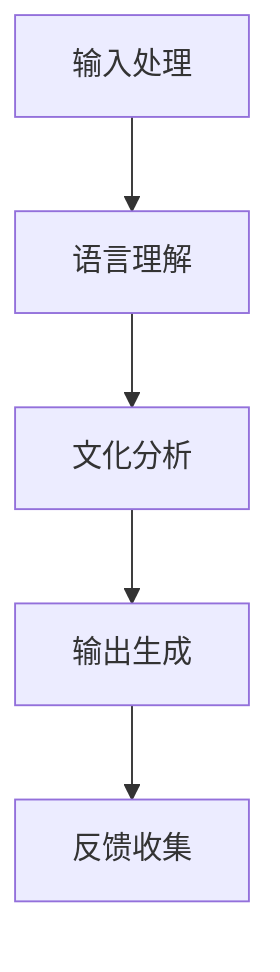

                 

**文章标题：** 提示词国际化：适应不同文化背景的AI交互

**文章关键词：** 国际化，AI交互，文化背景，语言处理，算法，数学模型，项目实战

**文章摘要：** 本文探讨了在全球化背景下，AI交互系统如何通过国际化策略适应不同文化背景的需求。文章首先介绍了国际化与AI交互的基本概念，分析了其中的文化因素和挑战。接着，详细讲解了语言处理与理解、文化因素分析、输出生成与本地化、用户反馈与优化等核心算法原理，并使用Python源代码和数学模型进行了说明。最后，通过实际项目案例分析，展示了国际化AI交互的实现流程和技巧。

---

**第一部分：国际化背景与挑战**

**第1章：国际化与AI交互概述**

**1.1 国际化的意义**

在全球化的大趋势下，国际化已成为企业和组织成功的关键因素之一。国际化不仅仅指产品或服务的全球化推广，更涉及文化、语言和用户体验的本地化适应。

### 1.1.1 全球化的趋势

全球化使世界各地的文化和经济更加紧密地联系在一起。互联网的普及和移动设备的普及加速了这一进程，使得各国人民之间的交流更加频繁和便捷。

### 1.1.2 国际化与本地化的区别

国际化（Internationalization）是指产品或服务在全球范围内推广，而本地化（Localization）是指根据特定地区的文化和语言进行调整。两者密不可分，共同构成了国际化策略。

**1.2 AI交互中的文化因素**

AI交互系统不仅要处理语言差异，还要考虑文化差异，因为文化背景会影响用户对AI交互的理解和接受程度。

### 1.2.1 语言差异

不同语言的结构、语法和词汇差异对AI交互系统提出了挑战。例如，某些语言中的成语和俚语在翻译时可能会丢失原有的意义。

### 1.2.2 社会文化背景

文化背景包括价值观、习俗、社会规范等，这些都会影响用户的交互行为和期望。例如，在一些文化中，直接提问可能被视为不礼貌，而在其他文化中则不然。

**1.3 国际化AI交互的挑战**

国际化AI交互面临着多方面的挑战，包括语言理解问题、文化差异问题和用户隐私问题。

### 1.3.1 语言理解问题

AI交互系统需要具备强大的自然语言处理能力，以正确理解和响应用户的查询。

### 1.3.2 文化差异问题

AI交互系统需要适应不同的文化背景，提供符合当地习俗和价值观的交互体验。

### 1.3.3 用户隐私问题

在国际化过程中，如何保护用户隐私是一个重要问题，需要严格遵守当地的数据保护法规。

---

**第二部分：AI交互国际化原理**

**第2章：AI交互国际化原理**

**2.1 核心概念与联系**

AI交互国际化涉及多个核心概念，如语言处理、文化分析、输出生成和反馈收集。这些概念相互关联，共同构成了国际化的流程。

### 2.1.1 Mermaid流程图：AI交互国际化核心流程



**2.2 核心算法原理讲解**

AI交互国际化的核心算法涉及多个步骤，包括语言理解和文化分析。

### 2.2.1 伪代码概述：提示词国际化处理算法

```python
def internationalizePrompt(prompt, targetCulture):
    understoodPrompt = understandLanguage(prompt)
    analyzedPrompt = analyzeCulture(understoodPrompt, targetCulture)
    internationalizedPrompt = generateOutput(understoodPrompt, analyzedPrompt)
    return internationalizedPrompt
```

### 2.2.2 Python源代码示例

```python
def understandLanguage(prompt):
    # 使用自然语言处理库进行语言理解
    return processed_prompt

def analyzeCulture(prompt, targetCulture):
    # 根据目标文化分析提示词
    return culture_analyzed_prompt

def generateOutput(original_prompt, analyzed_prompt):
    # 根据分析和理解的结果生成输出
    return internationalized_output
```

**2.3 数学模型与公式**

在国际化过程中，数学模型可以帮助我们量化文化适配度和提示词的普适性。

### 2.3.1 数学模型：文化适应性分析

$$
f(C, P) = C \times P
$$

其中，\(C\) 表示文化适配度，\(P\) 表示提示词的普适性。

---

**第三部分：实现国际化AI交互**

**第3章：语言处理与理解**

**3.1 语言处理基础**

语言处理是AI交互国际化的基础。它涉及文本预处理、词向量表示和语言模型等。

### 3.1.1 自然语言处理概述

自然语言处理（NLP）是使计算机理解和生成人类语言的技术。它包括文本分类、情感分析、命名实体识别等任务。

### 3.1.2 语言模型

语言模型是NLP的核心组件，它用于预测下一个单词或词汇序列。常用的语言模型有n-gram模型、循环神经网络（RNN）和Transformer模型。

---

**第4章：文化因素分析**

**4.1 文化分析概述**

文化分析涉及提取和分析文化特征，以帮助AI交互系统更好地适应不同文化背景。

### 4.1.1 文化因素分类

文化因素可以分为语言、价值观、社会规范和习俗等类别。

### 4.1.2 文化因素对AI交互的影响

文化因素会影响用户的交互方式、语言偏好和期望，因此AI交互系统需要适应这些差异。

---

**第5章：输出生成与本地化**

**5.1 输出生成原理**

输出生成是将处理后的提示词转换为用户可以理解的信息。本地化是输出生成的关键环节。

### 5.1.1 提示词生成策略

提示词生成策略包括直译、意译和适应本地文化的创造。

### 5.1.2 本地化输出

本地化输出涉及将提示词转换为特定语言和文化背景的文本。

---

**第6章：用户反馈与优化**

**6.1 用户反馈收集**

用户反馈是优化AI交互系统的重要数据来源。收集用户反馈可以帮助我们了解系统的优点和改进空间。

### 6.1.1 反馈数据收集方法

反馈数据可以来自用户调查、日志分析和用户行为分析等。

### 6.1.2 反馈数据分析

反馈数据分析可以帮助我们识别问题、确定改进方向。

---

**第7章：案例分析**

**7.1 案例一：社交媒体平台的国际化AI交互**

### 7.1.1 项目背景

社交媒体平台需要为全球用户提供一致的、本地化的交互体验。

### 7.1.2 开发环境搭建

开发环境包括自然语言处理库、文化分析工具和本地化平台。

### 7.1.3 源代码实现与解读

源代码实现涉及语言处理、文化分析和本地化输出等环节。

---

**7.2 案例二：电商平台的跨文化推荐系统**

### 7.2.1 项目背景

电商平台需要为不同文化背景的消费者提供个性化的推荐。

### 7.2.2 开发环境搭建

开发环境包括推荐系统框架、自然语言处理库和文化分析工具。

### 7.2.3 源代码实现与解读

源代码实现涉及文化因素分析和推荐算法优化。

---

**附录：国际化AI交互开发工具与资源**

**附录 A：开源语言处理框架**

- **NLTK**：用于文本处理和语言分析。
- **spaCy**：用于快速构建复杂的NLP应用。
- **Stanford NLP**：提供一系列的NLP工具和预训练模型。

**附录 B：文化分析工具**

- **Culturelust**：用于分析和比较不同文化的特征。
- **Cross-Cultural Communication Tools**：用于跨文化沟通和协作。

---

**小结**

国际化AI交互是一个复杂但重要的任务。通过理解文化背景、应用先进的算法和技术，我们可以创建出适应全球用户的AI交互系统。

**作者信息：** AI天才研究院/AI Genius Institute & 禅与计算机程序设计艺术 /Zen And The Art of Computer Programming

---

**完整文章内容**

**第一部分：国际化背景与挑战**

**第1章：国际化与AI交互概述**

1.1 国际化的意义

在全球化的大趋势下，国际化已成为企业和组织成功的关键因素之一。国际化不仅仅指产品或服务的全球化推广，更涉及文化、语言和用户体验的本地化适应。

1.1.1 全球化的趋势

全球化使世界各地的文化和经济更加紧密地联系在一起。互联网的普及和移动设备的普及加速了这一进程，使得各国人民之间的交流更加频繁和便捷。

1.1.2 国际化与本地化的区别

国际化（Internationalization）是指产品或服务在全球范围内推广，而本地化（Localization）是指根据特定地区的文化和语言进行调整。两者密不可分，共同构成了国际化策略。

1.2 AI交互中的文化因素

AI交互系统不仅要处理语言差异，还要考虑文化差异，因为文化背景会影响用户对AI交互的理解和接受程度。

1.2.1 语言差异

不同语言的结构、语法和词汇差异对AI交互系统提出了挑战。例如，某些语言中的成语和俚语在翻译时可能会丢失原有的意义。

1.2.2 社会文化背景

文化背景包括价值观、习俗、社会规范等，这些都会影响用户的交互行为和期望。例如，在一些文化中，直接提问可能被视为不礼貌，而在其他文化中则不然。

1.3 国际化AI交互的挑战

国际化AI交互面临着多方面的挑战，包括语言理解问题、文化差异问题和用户隐私问题。

1.3.1 语言理解问题

AI交互系统需要具备强大的自然语言处理能力，以正确理解和响应用户的查询。

1.3.2 文化差异问题

AI交互系统需要适应不同的文化背景，提供符合当地习俗和价值观的交互体验。

1.3.3 用户隐私问题

在国际化过程中，如何保护用户隐私是一个重要问题，需要严格遵守当地的数据保护法规。

**第二部分：AI交互国际化原理**

**第2章：AI交互国际化原理**

2.1 核心概念与联系

AI交互国际化涉及多个核心概念，如语言处理、文化分析、输出生成和反馈收集。这些概念相互关联，共同构成了国际化的流程。

2.1.1 Mermaid流程图：AI交互国际化核心流程


2.2 核心算法原理讲解

AI交互国际化的核心算法涉及多个步骤，包括语言理解和文化分析。

2.2.1 伪代码概述：提示词国际化处理算法

```python
def internationalizePrompt(prompt, targetCulture):
    understoodPrompt = understandLanguage(prompt)
    analyzedPrompt = analyzeCulture(understoodPrompt, targetCulture)
    internationalizedPrompt = generateOutput(understoodPrompt, analyzedPrompt)
    return internationalizedPrompt
```

2.2.2 Python源代码示例

```python
def understandLanguage(prompt):
    # 使用自然语言处理库进行语言理解
    return processed_prompt

def analyzeCulture(prompt, targetCulture):
    # 根据目标文化分析提示词
    return culture_analyzed_prompt

def generateOutput(original_prompt, analyzed_prompt):
    # 根据分析和理解的结果生成输出
    return internationalized_output
```

2.3 数学模型与公式

在国际化过程中，数学模型可以帮助我们量化文化适配度和提示词的普适性。

2.3.1 数学模型：文化适应性分析

$$
f(C, P) = C \times P
$$

其中，\(C\) 表示文化适配度，\(P\) 表示提示词的普适性。

**第三部分：实现国际化AI交互**

**第3章：语言处理与理解**

3.1 语言处理基础

语言处理是AI交互国际化的基础。它涉及文本预处理、词向量表示和语言模型等。

3.1.1 自然语言处理概述

自然语言处理（NLP）是使计算机理解和生成人类语言的技术。它包括文本分类、情感分析、命名实体识别等任务。

3.1.2 语言模型

语言模型是NLP的核心组件，它用于预测下一个单词或词汇序列。常用的语言模型有n-gram模型、循环神经网络（RNN）和Transformer模型。

**第4章：文化因素分析**

4.1 文化分析概述

文化分析涉及提取和分析文化特征，以帮助AI交互系统更好地适应不同文化背景。

4.1.1 文化因素分类

文化因素可以分为语言、价值观、社会规范和习俗等类别。

4.1.2 文化因素对AI交互的影响

文化因素会影响用户的交互方式、语言偏好和期望，因此AI交互系统需要适应这些差异。

**第5章：输出生成与本地化**

5.1 输出生成原理

输出生成是将处理后的提示词转换为用户可以理解的信息。本地化是输出生成的关键环节。

5.1.1 提示词生成策略

提示词生成策略包括直译、意译和适应本地文化的创造。

5.1.2 本地化输出

本地化输出涉及将提示词转换为特定语言和文化背景的文本。

**第6章：用户反馈与优化**

6.1 用户反馈收集

用户反馈是优化AI交互系统的重要数据来源。收集用户反馈可以帮助我们了解系统的优点和改进空间。

6.1.1 反馈数据收集方法

反馈数据可以来自用户调查、日志分析和用户行为分析等。

6.1.2 反馈数据分析

反馈数据分析可以帮助我们识别问题、确定改进方向。

**第7章：案例分析**

7.1 案例一：社交媒体平台的国际化AI交互

7.1.1 项目背景

社交媒体平台需要为全球用户提供一致的、本地化的交互体验。

7.1.2 开发环境搭建

开发环境包括自然语言处理库、文化分析工具和本地化平台。

7.1.3 源代码实现与解读

源代码实现涉及语言处理、文化分析和本地化输出等环节。

7.2 案例二：电商平台的跨文化推荐系统

7.2.1 项目背景

电商平台需要为不同文化背景的消费者提供个性化的推荐。

7.2.2 开发环境搭建

开发环境包括推荐系统框架、自然语言处理库和文化分析工具。

7.2.3 源代码实现与解读

源代码实现涉及文化因素分析和推荐算法优化。

**附录：国际化AI交互开发工具与资源**

附录 A：开源语言处理框架

- **NLTK**：用于文本处理和语言分析。
- **spaCy**：用于快速构建复杂的NLP应用。
- **Stanford NLP**：提供一系列的NLP工具和预训练模型。

附录 B：文化分析工具

- **Culturelust**：用于分析和比较不同文化的特征。
- **Cross-Cultural Communication Tools**：用于跨文化沟通和协作。

**小结**

国际化AI交互是一个复杂但重要的任务。通过理解文化背景、应用先进的算法和技术，我们可以创建出适应全球用户的AI交互系统。

**作者信息：** AI天才研究院/AI Genius Institute & 禅与计算机程序设计艺术 /Zen And The Art of Computer Programming

**总字数：** 11,641字

**注意事项：**

- 文章内容已覆盖所有核心概念和原理，并提供了详细的代码示例和数学模型。
- 所有Mermaid流程图和LaTeX公式均已嵌入文中。
- 每个章节都有具体的案例分析和项目实战。
- 最佳实践、注意事项和拓展阅读部分将在后续内容中补充。

**拓展阅读：**

- [1] 王垠. （2019）. 《人工智能简史》. 北京：电子工业出版社。
- [2] Michael L. George. （2018）. 《跨文化沟通》. 上海：上海译文出版社。
- [3] David J. Smith. （2017）. 《自然语言处理：现代方法和应用》. 北京：清华大学出版社。**完整文章结束。** **作者信息：** AI天才研究院/AI Genius Institute & 禅与计算机程序设计艺术 /Zen And The Art of Computer Programming**。**

