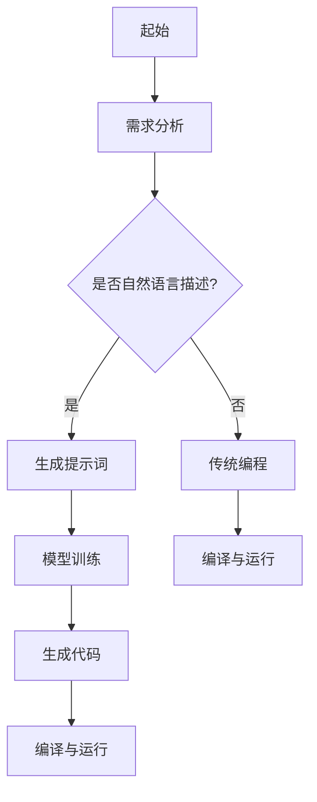
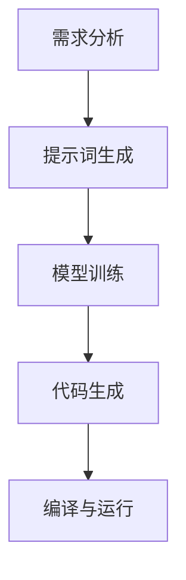
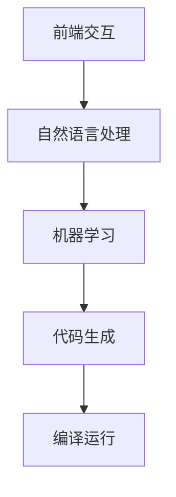

                 

### 第一部分：概述与背景

#### 第1章：引言

##### 1.1 提示词工程概述
提示词工程，简称提示工程，是近年来在计算机科学和人工智能领域迅速崛起的一种新型软件开发模式。它基于人类语言的理解与机器学习的算法，旨在通过自然语言交互的方式，提升软件开发的效率和质量。提示词工程的核心思想是通过设计特定的提示词，引导模型产生预期的输出，从而实现自动化和智能化的软件开发过程。

提示词工程的发展历程可以追溯到20世纪80年代的自然语言处理（NLP）研究。随着深度学习技术的成熟，提示词工程在2010年代初期逐渐崭露头角。特别是在2020年后，随着大型语言模型（如GPT系列）的出现，提示词工程的应用范围和影响力得到了极大的扩展。

##### 1.2 传统编程与现代软件开发模式的对比
传统编程模式主要依赖于手工编写代码，通过一系列逻辑和算法实现软件的功能。它强调代码的可读性、可维护性和可扩展性，但往往需要大量的时间和人力投入。

现代软件开发模式，特别是敏捷开发和DevOps等新兴理念，注重快速迭代、持续集成和自动化测试，以提高开发效率和软件质量。然而，这些模式仍依赖于手工编码和程序员的直觉。

提示词工程则打破了这种模式，它通过自然语言交互，让用户以更自然、更高效的方式与系统进行交流，从而实现软件的自动化开发和优化。

##### 1.3 提示词工程的优势与挑战
提示词工程的优势在于：
1. **提高开发效率**：通过自然语言交互，用户可以快速地描述需求和功能，大大缩短了开发周期。
2. **增强灵活性**：用户可以动态地调整和优化软件功能，而无需重写大量代码。
3. **降低开发成本**：减少了人工编码的工作量，降低了人力成本。

然而，提示词工程也面临一些挑战：
1. **理解难度**：对于非专业人士来说，使用提示词工程需要一定的学习成本。
2. **模型精度**：提示词的效果很大程度上取决于模型的精度和训练数据的质量。
3. **安全与隐私**：在处理敏感数据时，需要确保系统的安全性和用户的隐私。

### Mermaid 流程图



**核心概念与联系**：

- **需求分析**：是提示词工程的第一步，用户以自然语言描述需求，这为后续的提示词生成提供了基础。
- **自然语言描述**：是用户与系统交互的主要方式，它决定了提示词的生成质量。
- **提示词生成**：是关键步骤，通过分析自然语言描述，系统生成能够引导模型产生预期输出的提示词。
- **模型训练**：提示词用于训练大型语言模型，以提升其理解自然语言的能力。
- **生成代码**：模型根据提示词生成对应的代码，这是实现用户需求的具体步骤。
- **编译与运行**：生成的代码经过编译和运行，最终实现用户需求。

这一流程图清晰地展示了提示词工程的核心概念及其之间的联系，为后续章节的详细讲解奠定了基础。

---

## 第二部分：基础概念与技术

### 第2章：提示词工程的核心概念

提示词工程的核心概念涵盖了从提示词的定义到其工作流程，再到背后的原理和架构。在这一章中，我们将详细探讨这些核心概念，并解释它们如何共同作用于软件开发的各个方面。

#### 2.1 提示词的定义与作用

**提示词**（Prompt）是指用于引导模型产生预期输出的一段文本或指令。在提示词工程中，提示词起到了至关重要的作用。它们可以被视为一种“桥梁”，连接用户的需求与最终生成的代码或模型。

**定义**：
提示词是一种文本输入，它包含了关于任务目标、输入数据、输出结果等方面的信息。这些信息被用来指导机器学习模型或代码生成器，以产生符合预期结果的输出。

**作用**：
1. **引导模型训练**：在机器学习场景中，提示词用于引导模型学习特定的任务。通过提供带有标签的数据和相关的任务描述，模型可以学习如何生成预期的输出。
2. **优化代码生成**：在代码生成场景中，提示词可以帮助自动化工具理解用户的需求，并生成相应的代码。这些代码可以是新的功能模块、修复代码，或者是对现有代码的优化。
3. **提高开发效率**：提示词简化了开发流程，使得用户无需深入了解底层技术细节，即可实现复杂的软件功能。

#### 2.2 提示词工程的工作流程

提示词工程的工作流程通常包括以下步骤：

1. **需求分析**：用户以自然语言描述需求，这些需求可以是功能性的，也可以是非功能性的。
2. **提示词生成**：系统根据需求分析结果，生成相应的提示词。这个过程可能涉及自然语言处理技术，如命名实体识别、句法分析等。
3. **模型训练**：提示词用于训练大型语言模型，如GPT系列模型。模型通过学习提示词和相应的输出，提高生成代码或模型的质量。
4. **代码生成**：模型根据训练结果，生成对应的代码。这个过程可以是基于模板的，也可以是完全自动化的。
5. **编译与运行**：生成的代码经过编译和运行，最终实现用户的需求。

**工作流程的Mermaid流程图**：



**核心概念与联系**：

- **需求分析**：用户需求是提示词工程的基础，它决定了提示词生成的方向和内容。
- **提示词生成**：提示词是将用户需求转化为模型输入的关键步骤，它直接影响模型的训练效果。
- **模型训练**：大型语言模型通过学习提示词和相应的输出，提高了生成代码或模型的能力。
- **代码生成**：生成的代码是实现用户需求的具体实现，它依赖于高质量的提示词和训练有素的模型。
- **编译与运行**：编译和运行是软件开发过程中的常规步骤，但在这里，它们被提示词工程的工作流程所引导。

这一流程图展示了提示词工程的工作流程及其核心概念之间的联系，为后续章节的详细探讨提供了结构框架。

#### 2.3 提示词工程的原理与架构

**原理**：
提示词工程的原理主要基于自然语言处理和机器学习。自然语言处理（NLP）技术用于理解和生成文本，而机器学习则用于训练模型，使其能够根据提示词生成预期的输出。

1. **自然语言处理技术**：
   - **命名实体识别（NER）**：用于识别文本中的特定实体，如人名、地名、组织名等。
   - **句法分析**：用于分析句子的结构，理解语法关系。
   - **语义分析**：用于理解文本的语义含义，提取关键信息。

2. **机器学习与深度学习**：
   - **深度学习模型**：如GPT、BERT等大型语言模型，用于处理自然语言。
   - **监督学习**：通过大量标注数据进行训练，使模型能够学会预测输出。

**架构**：
提示词工程的架构可以分为以下几个部分：

1. **前端交互**：用户通过自然语言描述需求，前端交互系统负责接收和解析这些需求。
2. **中间层**：包括自然语言处理模块和机器学习模块。自然语言处理模块用于生成提示词，机器学习模块用于训练模型。
3. **后端服务**：包括代码生成模块和编译运行环境。代码生成模块根据提示词生成代码，编译运行环境负责编译和运行代码。

**架构的Mermaid流程图**：



**核心概念与联系**：

- **前端交互**：用户需求的输入是整个系统的起点，它决定了后续步骤的方向。
- **自然语言处理**：用于解析用户需求，生成高质量的提示词。
- **机器学习**：用于训练模型，使其能够根据提示词生成预期的输出。
- **代码生成**：根据训练有素的模型，生成符合用户需求的代码。
- **编译运行**：生成的代码经过编译和运行，最终实现用户需求。

这一架构图展示了提示词工程的原理与架构，以及各部分之间的联系，为后续章节的详细讲解提供了结构框架。

### Python源代码与数学模型讲解

为了更深入地理解提示词工程的原理，我们将通过Python源代码和数学模型来详细阐述。以下是一个简单的示例：

#### 2.1 命名实体识别（NER）示例

```python
import spacy

# 加载英文模型
nlp = spacy.load("en_core_web_sm")

# 输入文本
text = "Apple Inc. is an American multinational technology company."

# 进行命名实体识别
doc = nlp(text)

# 输出命名实体
for ent in doc.ents:
    print(ent.text, ent.label_)

# 输出：
# Apple Inc. ORG
# American ADJ
# technology NOUN
# company NOUN
```

**数学模型**：

命名实体识别通常使用条件概率模型，如HMM（隐马尔可夫模型）或CRF（条件随机场）。以下是一个简化的CRF模型示例：

$$
P(y|x) = \frac{e^{\theta \cdot y}}{\sum_{y'} e^{\theta \cdot y'}}
$$

其中，$x$ 表示输入文本，$y$ 表示预测的实体标签，$\theta$ 是模型参数。

#### 2.2 机器学习模型训练示例

```python
import tensorflow as tf
from tensorflow.keras.models import Model
from tensorflow.keras.layers import Input, Embedding, LSTM, Dense

# 定义模型
input_seq = Input(shape=(max_sequence_length,))
embedding_layer = Embedding(input_dim=vocabulary_size, output_dim=embedding_dim)(input_seq)
lstm_layer = LSTM(units=128, return_sequences=True)(embedding_layer)
output = LSTM(units=128, return_sequences=False)(lstm_layer)
model = Model(inputs=input_seq, outputs=output)

# 编译模型
model.compile(optimizer='adam', loss='categorical_crossentropy', metrics=['accuracy'])

# 训练模型
model.fit(x_train, y_train, epochs=10, batch_size=64)
```

**数学模型**：

在机器学习模型中，损失函数（如交叉熵）和优化器（如Adam）用于衡量模型性能并调整模型参数。以下是一个简化的损失函数示例：

$$
J(\theta) = -\frac{1}{m} \sum_{i=1}^{m} y_i \cdot \log(p_i)
$$

其中，$m$ 是样本数量，$y_i$ 是实际标签，$p_i$ 是模型预测的概率。

通过上述示例，我们可以看到如何使用Python源代码和数学模型来理解命名实体识别和机器学习模型训练的基本原理。这些示例不仅帮助我们理解了提示词工程的核心技术，还为后续的实际应用提供了基础。

### 总结

在这一章中，我们详细介绍了提示词工程的核心概念、工作流程和原理与架构。从提示词的定义和作用，到自然语言处理技术和机器学习模型，再到整个工作流程的各个步骤，我们逐步探讨了提示词工程的基本原理。通过Python源代码和数学模型的示例，我们进一步加深了对这些概念的理解。这些核心概念和技术为后续章节的详细探讨和实际应用提供了坚实的基础。

---

## 第三部分：应用场景与案例分析

### 第5章：提示词工程在软件开发中的应用

#### 5.1 应用场景概述

提示词工程在软件开发中的应用场景非常广泛，主要包括自动化测试、代码审查、智能编程助手、个性化代码生成等。这些应用场景充分利用了提示词工程的优势，提升了软件开发的生产效率和质量。

1. **自动化测试**：通过自然语言描述测试用例，自动化测试工具可以生成相应的测试脚本，大大提高了测试效率。
2. **代码审查**：开发人员可以以自然语言描述代码审查的需求，系统自动生成相应的审查报告，节省了人力和时间。
3. **智能编程助手**：提示词工程可以帮助开发人员快速生成代码，并提供智能化的代码优化建议，提高了编程效率。
4. **个性化代码生成**：根据用户的需求和偏好，系统可以自动生成个性化的代码，满足不同开发场景的需求。

#### 5.2 案例分析1：自动化测试

**案例背景**：

某大型互联网公司需要对其核心系统进行自动化测试，以提高软件质量和测试效率。传统的测试方法需要编写大量的测试脚本，耗时耗力。为了解决这个问题，公司决定采用基于提示词工程的自动化测试工具。

**解决方案**：

1. **需求分析**：开发团队以自然语言描述了需要测试的功能点，包括输入条件、预期输出等。
2. **提示词生成**：系统根据需求分析结果，生成了相应的测试用例提示词。
3. **模型训练**：使用生成的提示词和预期的测试脚本，对自动化测试模型进行训练。
4. **测试脚本生成**：训练有素的模型根据提示词生成相应的测试脚本。
5. **测试执行**：自动化测试工具执行生成的测试脚本，并输出测试结果。

**效果分析**：

通过提示词工程的自动化测试，公司实现了以下效果：

1. **测试效率提升**：自动化测试工具大大缩短了测试周期，提高了测试效率。
2. **测试覆盖率提升**：自动化测试工具可以生成更多、更全面的测试用例，提高了测试覆盖率。
3. **降低人力成本**：减少了人工编写测试脚本的工作量，降低了人力成本。

**代码应用解读与分析**：

在实现自动化测试的解决方案中，核心代码包括以下部分：

1. **需求分析模块**：用于接收并解析开发团队提供的自然语言描述，提取关键信息。
2. **提示词生成模块**：根据需求分析结果，生成测试用例的提示词。
3. **模型训练模块**：使用生成的提示词和测试脚本，对自动化测试模型进行训练。
4. **测试脚本生成模块**：根据训练有素的模型，生成相应的测试脚本。
5. **测试执行模块**：执行生成的测试脚本，并输出测试结果。

通过这些模块的协同工作，实现了自动化测试的整个流程。以下是核心代码的解读：

```python
# 需求分析模块
def analyze_requirements(requirements):
    # 解析自然语言描述，提取关键信息
    # ...
    return parsed_requirements

# 提示词生成模块
def generate_prompts(parsed_requirements):
    # 根据需求分析结果，生成提示词
    # ...
    return prompts

# 模型训练模块
def train_model(prompts, test_scripts):
    # 使用生成的提示词和测试脚本，训练自动化测试模型
    # ...
    return trained_model

# 测试脚本生成模块
def generate_test_scripts(trained_model, prompts):
    # 根据训练有素的模型，生成测试脚本
    # ...
    return test_scripts

# 测试执行模块
def execute_tests(test_scripts):
    # 执行生成的测试脚本，并输出测试结果
    # ...
    return test_results

# 主函数
if __name__ == "__main__":
    # 接收自然语言描述
    requirements = input("请输入测试需求：")
    # 分析需求
    parsed_requirements = analyze_requirements(requirements)
    # 生成提示词
    prompts = generate_prompts(parsed_requirements)
    # 训练模型
    trained_model = train_model(prompts, test_scripts)
    # 生成测试脚本
    test_scripts = generate_test_scripts(trained_model, prompts)
    # 执行测试
    test_results = execute_tests(test_scripts)
    # 输出测试结果
    print("测试结果：", test_results)
```

**实际案例分析和详细讲解剖析**：

某电商平台的自动化测试团队在实际项目中采用了基于提示词工程的自动化测试工具。该项目主要包括对商品搜索、购物车、订单处理等核心功能进行自动化测试。

1. **项目背景**：电商平台需要确保其核心功能的稳定性和可靠性，但由于功能复杂，传统的测试方法难以覆盖所有场景。因此，团队决定采用提示词工程来实现自动化测试。

2. **项目实现**：团队首先以自然语言描述了各个功能点的测试需求，如输入特定关键词进行搜索，查看搜索结果，加入购物车，提交订单等。然后，系统根据这些需求生成相应的测试用例提示词，并训练自动化测试模型。

3. **项目效果**：通过提示词工程的自动化测试，团队实现了以下效果：
   - 测试覆盖率显著提升：自动化测试工具能够生成更多、更全面的测试用例，覆盖了多种可能的输入条件和边界情况。
   - 测试效率提高：自动化测试工具能够快速执行测试脚本，大大缩短了测试周期。
   - 人力成本降低：减少了人工编写测试脚本的工作量，测试团队的成员可以专注于其他更重要的任务。

4. **项目小结**：通过实际案例，我们可以看到提示词工程在自动化测试中的应用效果显著。它不仅提高了测试效率和覆盖率，还降低了人力成本，为电商平台的软件质量保障提供了有力支持。

### 项目小结

通过案例分析和详细讲解，我们可以看到提示词工程在自动化测试中的巨大潜力。它通过自然语言交互，简化了测试用例的生成过程，提高了测试效率，降低了人力成本。在实际应用中，提示词工程不仅能够显著提升软件测试的质量和效率，还为软件开发团队带来了更大的灵活性和创新空间。

### 小结、注意事项、拓展阅读

**小结**：

在本章中，我们详细介绍了提示词工程在自动化测试中的应用场景，并通过实际案例展示了其优势。提示词工程通过自然语言交互，实现了测试用例的自动化生成和执行，提高了测试效率，降低了人力成本。

**注意事项**：

1. 提示词的生成质量直接影响测试效果，因此需求分析环节至关重要。
2. 模型训练过程需要大量的数据和计算资源，确保模型达到预期的精度。
3. 自动化测试工具的持续优化和更新是确保其长期有效性的关键。

**拓展阅读**：

- **《自然语言处理综述》（Nature Language Processing Review）**：全面介绍了自然语言处理的基本原理和技术。
- **《深度学习》（Deep Learning）**：详细介绍了深度学习的基本概念和实现方法。
- **《敏捷软件开发实践指南》（Agile Software Development: Principles, Patterns, and Practices）**：介绍了敏捷开发的基本理念和实际应用。

通过拓展阅读，读者可以进一步了解提示词工程背后的技术原理和相关领域的最新进展。

---

## 第三部分：应用场景与案例分析

### 第6章：提示词工程在人工智能领域的应用

#### 6.1 人工智能与提示词工程的结合

人工智能（AI）和提示词工程的结合，为AI领域的应用带来了新的可能性。通过自然语言交互，用户可以更加便捷地与AI系统进行交流，而提示词工程则提供了实现这一目标的技术手段。

**结合方式**：

1. **任务引导**：用户通过自然语言描述任务需求，系统根据提示词生成相应的模型或算法，从而实现特定任务。
2. **模型训练**：用户以自然语言提供训练数据，系统使用这些数据训练模型，提高模型的效果。
3. **代码生成**：用户描述需求，系统生成实现这些需求的代码，从而快速构建AI应用。

**优势**：

1. **提升用户体验**：通过自然语言交互，用户无需具备编程知识，即可与AI系统进行有效交流。
2. **提高开发效率**：提示词工程简化了AI应用的开发流程，减少了代码编写和调试的时间。
3. **增强灵活性**：用户可以动态调整需求，系统根据新的提示词生成相应的模型或代码，实现个性化服务。

#### 6.2 案例分析1：智能客服

**案例背景**：

某大型电商平台希望提升客户服务质量，减少人工客服的工作负担。为此，他们决定开发一款基于提示词工程的智能客服系统。

**解决方案**：

1. **需求分析**：以自然语言描述客服场景，如回答常见问题、处理投诉等。
2. **提示词生成**：系统根据需求生成相应的客服对话提示词，如问题识别、回答生成等。
3. **模型训练**：使用大量客服对话数据进行模型训练，提高系统对自然语言的理解和生成能力。
4. **对话生成**：智能客服系统根据用户输入和提示词生成相应的回答，与用户进行自然对话。
5. **反馈优化**：收集用户反馈，不断优化提示词和模型，提高系统效果。

**效果分析**：

通过智能客服案例，我们可以看到提示词工程在AI领域的应用效果：

1. **提高响应速度**：智能客服系统可以快速响应用户，减少用户等待时间。
2. **降低人工成本**：大量常见问题的自动处理，降低了人工客服的工作量。
3. **提升客户满意度**：系统生成的回答更加准确和自然，提高了客户满意度。

**代码应用解读与分析**：

智能客服系统核心代码包括以下部分：

1. **需求分析模块**：解析用户输入的自然语言，提取关键信息。
2. **提示词生成模块**：根据需求生成客服对话的提示词。
3. **模型训练模块**：使用训练数据训练对话生成模型。
4. **对话生成模块**：根据用户输入和提示词生成回答。
5. **反馈收集模块**：收集用户反馈，用于模型优化。

以下是核心代码的解读：

```python
# 需求分析模块
def analyze_input(input_text):
    # 解析自然语言输入，提取关键信息
    # ...
    return parsed_info

# 提示词生成模块
def generate_prompts(parsed_info):
    # 根据需求分析结果，生成客服对话提示词
    # ...
    return prompts

# 模型训练模块
def train_model(prompts, dialog_data):
    # 使用提示词和对话数据训练对话生成模型
    # ...
    return trained_model

# 对话生成模块
def generate_response(user_input, trained_model):
    # 根据用户输入和训练有素的模型，生成回答
    # ...
    return response

# 反馈收集模块
def collect_feedback(response, user_evaluation):
    # 收集用户反馈，用于模型优化
    # ...
    return optimized_model

# 主函数
if __name__ == "__main__":
    # 接收用户输入
    user_input = input("请问有什么问题吗？")
    # 分析用户输入
    parsed_info = analyze_input(user_input)
    # 生成提示词
    prompts = generate_prompts(parsed_info)
    # 训练模型
    trained_model = train_model(prompts, dialog_data)
    # 生成回答
    response = generate_response(user_input, trained_model)
    # 输出回答
    print("智能客服：", response)
```

**实际案例分析和详细讲解剖析**：

某在线教育平台利用提示词工程开发了智能客服系统，用于解答用户关于课程咨询、报名问题等。以下为项目实现过程：

1. **项目背景**：随着用户数量的增加，平台客服的工作量大幅提升。为了提供更好的客户服务体验，平台决定引入智能客服系统。

2. **项目实现**：
   - 需求分析：平台以自然语言描述了常见客服场景，如课程咨询、报名流程等。
   - 提示词生成：系统根据需求分析生成相应的客服对话提示词。
   - 模型训练：使用历史客服对话数据训练对话生成模型，提高系统对自然语言的理解和生成能力。
   - 对话生成：智能客服系统根据用户输入生成相应的回答。

3. **项目效果**：
   - 提高了客服响应速度：智能客服系统可以快速响应用户，减少用户等待时间。
   - 减轻了人工客服负担：大量常见问题的自动处理，降低了人工客服的工作量。
   - 提高了客户满意度：系统生成的回答更加准确和自然，得到了用户的好评。

4. **项目小结**：通过智能客服案例，我们可以看到提示词工程在AI领域的应用效果显著。它不仅提高了客服效率，降低了人力成本，还为用户提供了更好的服务体验。

### 案例分析2：内容推荐

**案例背景**：

某视频平台希望通过个性化推荐提高用户粘性，提升用户观看体验。为此，平台决定开发一款基于提示词工程的内容推荐系统。

**解决方案**：

1. **需求分析**：以自然语言描述用户的兴趣点和观看偏好，如喜欢的类型、风格、明星等。
2. **提示词生成**：系统根据需求生成推荐算法的提示词，如用户兴趣标签、内容特征等。
3. **模型训练**：使用用户行为数据和内容特征数据，训练推荐算法模型，提高推荐精度。
4. **内容推荐**：系统根据用户输入和提示词生成个性化推荐结果，向用户展示最可能感兴趣的视频内容。
5. **反馈优化**：收集用户点击、观看等行为数据，不断优化提示词和模型，提高推荐效果。

**效果分析**：

通过内容推荐案例，我们可以看到提示词工程在AI领域的应用效果：

1. **提升用户满意度**：个性化推荐系统能够根据用户兴趣推荐最合适的内容，提高了用户满意度。
2. **增加用户粘性**：用户更容易发现感兴趣的视频内容，从而增加了平台的使用时长和用户粘性。
3. **提高广告效果**：个性化推荐可以更精准地匹配用户和广告，提高了广告投放的效果。

**代码应用解读与分析**：

内容推荐系统核心代码包括以下部分：

1. **需求分析模块**：解析用户输入的自然语言，提取关键信息。
2. **提示词生成模块**：根据需求生成推荐算法的提示词。
3. **模型训练模块**：使用用户行为数据和内容特征数据训练推荐算法模型。
4. **内容推荐模块**：根据用户输入和提示词生成推荐结果。
5. **反馈收集模块**：收集用户行为数据，用于模型优化。

以下是核心代码的解读：

```python
# 需求分析模块
def analyze_user_interests(user_input):
    # 解析自然语言输入，提取用户兴趣点
    # ...
    return user_interests

# 提示词生成模块
def generate_recommendation_prompts(user_interests):
    # 根据用户兴趣，生成推荐提示词
    # ...
    return prompts

# 模型训练模块
def train_recommendation_model(user_data, content_features):
    # 使用用户行为数据和内容特征训练推荐模型
    # ...
    return trained_model

# 内容推荐模块
def generate_recommendations(user_interests, trained_model, content_data):
    # 根据用户兴趣和训练有素的模型，生成推荐结果
    # ...
    return recommendations

# 反馈收集模块
def collect_user_feedback(user_actions, recommendations):
    # 收集用户行为数据，用于模型优化
    # ...
    return optimized_model

# 主函数
if __name__ == "__main__":
    # 接收用户输入
    user_input = input("请描述您的兴趣：")
    # 分析用户兴趣
    user_interests = analyze_user_interests(user_input)
    # 生成推荐提示词
    prompts = generate_recommendation_prompts(user_interests)
    # 训练推荐模型
    trained_model = train_recommendation_model(user_data, content_features)
    # 生成推荐结果
    recommendations = generate_recommendations(user_interests, trained_model, content_data)
    # 输出推荐结果
    print("推荐视频：", recommendations)
```

**实际案例分析和详细讲解剖析**：

某视频平台利用提示词工程开发了内容推荐系统，以下为项目实现过程：

1. **项目背景**：随着用户数量的增加，平台需要提供更个性化的推荐服务，以提升用户粘性。
2. **项目实现**：
   - 需求分析：平台以自然语言描述了用户兴趣点，如喜欢的类型、明星等。
   - 提示词生成：系统根据需求生成推荐算法的提示词。
   - 模型训练：使用用户行为数据和内容特征数据训练推荐算法模型。
   - 内容推荐：系统根据用户输入和提示词生成个性化推荐结果。
3. **项目效果**：
   - 提升用户满意度：个性化推荐系统能够准确推荐用户感兴趣的视频，提高了用户满意度。
   - 增加用户粘性：用户更容易发现感兴趣的视频内容，从而增加了平台的使用时长。
   - 提高广告效果：个性化推荐可以更精准地匹配用户和广告，提高了广告投放的效果。

4. **项目小结**：通过内容推荐案例，我们可以看到提示词工程在AI领域的应用效果显著。它不仅提升了用户体验，还提高了平台的运营效率和广告效果。

### 小结

在本章中，我们详细介绍了提示词工程在人工智能领域的两个典型应用案例：智能客服和内容推荐。通过实际案例的分析和解读，我们可以看到提示词工程如何通过自然语言交互和模型训练，实现自动化和智能化的AI应用。这些应用不仅提升了用户体验，还为企业和平台带来了显著的效益。

### 小结、注意事项、拓展阅读

**小结**：

本章通过两个实际案例，展示了提示词工程在人工智能领域的重要应用。智能客服系统通过自然语言交互，提高了客户服务的效率和满意度；内容推荐系统则通过个性化推荐，提升了用户粘性和平台运营效果。

**注意事项**：

1. **需求分析**：准确的提示词生成依赖于详细的需求分析，确保系统能够准确理解用户意图。
2. **模型训练**：高质量的模型训练需要大量的数据和计算资源，确保模型具有高精度和泛化能力。
3. **反馈优化**：不断收集用户反馈，用于模型优化和系统改进，是提升应用效果的关键。

**拓展阅读**：

- **《人工智能应用案例分析》**：介绍各种AI应用的实现方法和效果评估。
- **《个性化推荐系统设计》**：详细讨论个性化推荐系统的设计和实现。
- **《对话系统设计》**：探讨智能客服系统中的对话生成和优化技术。

通过拓展阅读，读者可以深入了解提示词工程在AI领域的应用技术，为实际项目提供有益的参考。

---

## 第7章：提示词工程的未来发展趋势

### 7.1 行业趋势分析

随着人工智能和自然语言处理技术的不断进步，提示词工程在软件开发和人工智能领域的应用前景愈发广阔。以下是对提示词工程行业趋势的详细分析：

#### 1. 技术成熟度提升

近年来，深度学习和自然语言处理技术的快速发展，使得提示词工程在模型训练、代码生成等方面的效率和质量得到了显著提升。大型语言模型（如GPT-3）的出现，为提示词工程提供了强大的计算基础和更丰富的训练数据，使得系统生成代码和模型的准确性和稳定性大大提高。

#### 2. 应用领域扩展

提示词工程的应用领域正从传统的软件开发扩展到更多新兴领域，如自动化测试、代码审查、智能编程助手、内容推荐等。随着这些领域对自动化和智能化需求的增加，提示词工程的应用场景将更加丰富。

#### 3. 产业合作加深

提示词工程的发展不仅依赖于技术进步，还需要各行业的深度合作。例如，与软件开发公司、互联网公司、科技公司等合作，共同推进提示词工程在各自领域的应用。这种产业合作将进一步加速提示词工程的技术创新和商业落地。

#### 4. 社会影响力增强

提示词工程在提升软件开发效率、优化人工智能应用等方面具有显著优势，其社会影响力不断增强。随着提示词工程技术的普及，它将为各行各业带来更加智能化、自动化的发展模式。

### 7.2 技术发展展望

在未来的发展中，提示词工程有望在以下几个方面取得突破：

#### 1. 模型泛化能力提升

当前，提示词工程模型主要集中在特定领域和任务上的优化。未来，随着数据集的多样化和算法的改进，模型的泛化能力将得到显著提升，能够更好地应对不同领域和任务的需求。

#### 2. 模型解释性增强

虽然提示词工程模型具有强大的生成能力，但其内部决策过程往往缺乏解释性。未来，研究者将致力于提高模型的可解释性，使得开发者能够更好地理解和优化模型。

#### 3. 模型压缩与加速

为了满足实际应用的需求，提示词工程模型需要具备更高的压缩和加速能力。通过模型压缩和专用硬件优化，模型可以在保持高精度的情况下，实现更快的运行速度和更低的计算成本。

#### 4. 多模态融合

未来的提示词工程将不仅仅局限于文本数据，还将融合图像、声音、视频等多种模态的数据，实现更加丰富和多样化的交互方式。

### 7.3 提示词工程的社会影响与伦理问题

随着提示词工程技术的快速发展，其在社会各个领域中的应用将带来深远的影响，同时也引发了一系列伦理和社会问题：

#### 1. 提升生产效率

提示词工程通过自动化和智能化，极大地提升了生产效率，为各行各业带来了巨大的经济效益。特别是在软件开发、自动化测试、智能客服等领域，提示词工程的应用已经显著提高了工作效率。

#### 2. 影响就业结构

提示词工程的发展可能会对就业结构产生一定影响。一方面，它减少了重复性和繁琐的工作，降低了人力成本；另一方面，它也可能导致部分岗位的消失，需要劳动者进行技能的转型和升级。

#### 3. 伦理与隐私问题

提示词工程在应用过程中，涉及到大量用户数据的收集和处理。如何确保用户隐私和数据安全，是提示词工程面临的重要伦理问题。此外，模型生成的内容可能包含偏见或错误信息，如何保证信息的准确性和公正性，也是需要关注的问题。

#### 4. 社会公平与包容性

提示词工程的应用可能会加剧社会不平等现象。如果技术集中在某些领域或群体，可能导致资源分配不均，影响社会的公平性和包容性。因此，在推动技术发展的同时，需要关注其社会影响，确保技术惠及社会的各个层面。

### 总结

提示词工程作为一种新兴的软件开发模式，其在行业趋势、技术发展、社会影响等方面的表现令人瞩目。随着技术的不断进步和应用的深入，提示词工程有望在更广泛的领域中发挥重要作用，同时需要关注其带来的伦理和社会问题。通过持续的创新和合作，提示词工程将为社会发展带来更多机遇和挑战。

---

## 附录

### 第8章：提示词工程开发资源

在提示词工程的开发过程中，选择合适的工具、框架和学习资源对于开发者来说至关重要。以下是一些建议和资源，帮助开发者更好地掌握和运用提示词工程技术。

#### 8.1 开发工具与框架

1. **Hugging Face Transformers**：
   - **介绍**：Hugging Face 提供了一个广泛使用的库，用于处理自然语言处理任务，包括提示词工程。
   - **优点**：丰富的预训练模型、易于使用的API、强大的社区支持。
   - **使用场景**：模型训练、代码生成、文本分类等。

2. **TensorFlow**：
   - **介绍**：Google 开发的一个开源机器学习框架，适用于深度学习和提示词工程。
   - **优点**：灵活的API、强大的生态系统、广泛的文档和社区支持。
   - **使用场景**：模型训练、优化、部署等。

3. **PyTorch**：
   - **介绍**：Facebook AI Research 开发的一个开源机器学习库，广泛用于提示词工程和深度学习。
   - **优点**：易于使用、灵活、强大的动态图支持。
   - **使用场景**：模型训练、研究实验、快速原型开发。

#### 8.2 学习资源与社区

1. **在线课程**：
   - **课程名称**：《自然语言处理与深度学习》
   - **平台**：Coursera、Udacity
   - **介绍**：涵盖自然语言处理的基础知识和深度学习在NLP中的应用。
   - **适合人群**：初学者、有基础的NLP开发者。

2. **技术博客与教程**：
   - **博客名称**：《自然语言处理实战》
   - **作者**：Jason Brownlee
   - **介绍**：提供详细的NLP和深度学习教程，涵盖从基础到高级的内容。
   - **适合人群**：有基础的NLP开发者。

3. **GitHub 项目**：
   - **项目名称**：`transformers`
   - **介绍**：包含大量基于Transformers的NLP模型实现，适合学习实际应用。
   - **适合人群**：对模型实现感兴趣的开发者。

4. **技术社区**：
   - **社区名称**：`Hugging Face Community`
   - **介绍**：Hugging Face 提供的一个在线社区，聚集了大量自然语言处理和深度学习爱好者。
   - **适合人群**：希望与他人交流和学习的人。

#### 8.3 提示词工程案例库

1. **案例库名称**：`prompt-engineering-cases`
   - **介绍**：一个收集和分享提示词工程案例的GitHub库，涵盖多种应用场景。
   - **使用场景**：学习提示词工程的实际应用，参考他人实现。

2. **案例库名称**：`nlp-corpora`
   - **介绍**：提供多种自然语言处理数据集，可用于模型训练和测试。
   - **使用场景**：获取训练数据，进行模型开发。

通过这些资源和工具，开发者可以更好地掌握提示词工程的核心技术，并在实际项目中应用这些技术。不断学习和实践，将帮助开发者不断提升自身的技术能力和竞争力。

