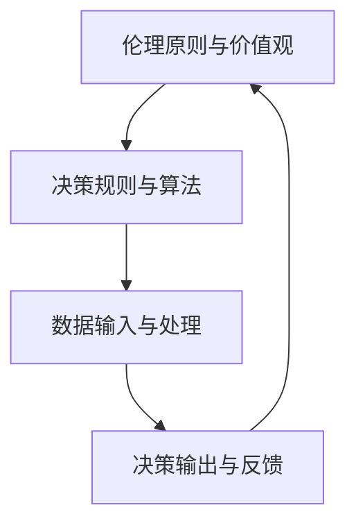
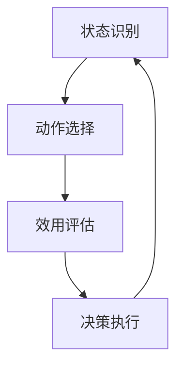

                 

### 背景介绍

在当今信息化社会，人工智能（AI）技术迅猛发展，已深入到我们生活的方方面面，从医疗诊断、金融服务，到自动驾驶、智能语音助手，AI正在以前所未有的速度改变着世界的运作方式。然而，AI技术的广泛应用也带来了前所未有的伦理挑战。AI系统的决策过程往往复杂且不透明，它们可能在未经充分考量的情况下作出违背伦理标准的选择，从而导致一系列不良后果。

伦理决策模型是解决这一问题的关键。伦理决策模型旨在将伦理原则和价值观融入到AI系统的决策过程中，确保AI系统的决策既符合技术要求，也符合道德准则。然而，现有的伦理决策模型往往缺乏足够的灵活性和适应性，无法应对日益复杂多变的现实环境。这就需要我们寻找新的方法来改进和优化伦理决策模型，使其更加智能和高效。

在这一背景下，提示词工程（Prompt Engineering）作为一种新兴的方法，逐渐受到关注。提示词工程的核心思想是通过精心设计的提示词，引导AI模型做出符合伦理标准的决策。提示词工程不仅在AI模型的训练阶段发挥重要作用，也在实际应用中具有极高的价值。通过提示词工程，我们可以有效地引导AI模型学习并遵循特定的伦理准则，从而提升AI系统的道德水平。

本文将深入探讨提示词工程在AI伦理决策模型中的关键作用。首先，我们将介绍AI伦理决策模型的背景和重要性，随后详细解析提示词工程的核心概念和原理，并通过Python源代码和数学模型阐述其具体应用。最后，我们将结合实际项目案例，展示提示词工程如何在实际中发挥作用，并探讨其面临的挑战和未来发展方向。

通过本文的探讨，我们希望为读者提供一个全面、深入的理解，帮助大家更好地把握AI伦理决策模型的现状和未来趋势，为构建更加道德、透明和高效的AI系统提供理论支持和实践指导。

### AI伦理决策模型的概述

AI伦理决策模型是人工智能领域中的一个重要研究方向，旨在确保AI系统在决策过程中符合伦理标准和价值观。这一模型的核心目标是通过结构化的决策流程和算法，将伦理原则融入到AI系统的每一个决策步骤中，从而确保AI系统的决策既符合技术要求，又符合道德准则。

首先，我们需要明确什么是伦理决策模型。伦理决策模型是一种结合了伦理学、计算机科学和人工智能技术的综合模型，其主要目的是在AI系统的决策过程中，对潜在的伦理问题进行识别、分析和解决。伦理决策模型通常包括以下几个关键组成部分：

1. **伦理原则和价值观**：这是模型的基础，决定了AI系统在决策时应该遵循的道德标准。这些原则和价值观可以是社会通用的，如公平、公正、尊重隐私等，也可以是特定应用场景下的定制化准则。

2. **决策规则和算法**：这是模型的核心，用于将伦理原则转化为具体的决策步骤。决策规则和算法通常基于逻辑推理、概率论、博弈论等数学工具，确保决策过程是科学、合理和可验证的。

3. **数据输入和处理**：这是模型的数据基础，包括AI系统收集和处理的各种数据。这些数据不仅用于训练AI模型，还用于验证和调整伦理决策模型的规则和算法。

4. **决策输出和反馈**：这是模型的最终目标，即AI系统根据输入数据和决策规则做出的具体决策。决策输出不仅需要满足技术要求，还需要符合伦理原则。

在解释伦理决策模型的关键组成部分后，我们来看一下它们之间的关系。伦理原则和价值观是整个模型的核心，决定了模型的方向和目标。决策规则和算法是实现这一目标的手段，它们将伦理原则转化为具体的操作步骤。数据输入和处理是模型的基础，确保模型有足够的数据支持，从而做出可靠的决策。决策输出和反馈则是模型的效果体现，通过实际应用和反馈，不断优化和调整模型，使其更加符合伦理标准。

为了更好地理解这一模型，我们可以通过一个Mermaid流程图来展示其架构：



在这个流程图中，我们可以看到，伦理原则与价值观贯穿于整个模型，指导每个环节的决策过程。决策规则和算法根据这些原则制定，数据输入和处理提供了模型运行所需的基础信息，而决策输出和反馈则不断迭代，优化模型性能。

总之，AI伦理决策模型通过将伦理原则融入决策过程，确保了AI系统在技术进步的同时，也遵循了道德准则。这一模型不仅为AI系统的开发和应用提供了伦理指导，也为构建一个更加公平、透明和道德的AI世界奠定了基础。

### 提示词工程的核心概念

提示词工程（Prompt Engineering）是近年来在自然语言处理（NLP）和人工智能（AI）领域迅速发展的一项技术。其核心目标是通过设计特定的提示词（prompts），引导AI模型进行更符合人类意图和需求的输出。在AI伦理决策模型中，提示词工程发挥着至关重要的作用，能够有效地引导AI模型做出符合伦理标准的选择。

#### 提示词的定义和作用

提示词是用户或开发者提供给AI模型的一段文字或指令，用于引导模型进行特定任务或生成特定类型的输出。在NLP任务中，提示词通常用于指导模型理解用户的查询意图，或者在生成任务中提供上下文信息，帮助模型生成更相关、更准确的文本。在AI伦理决策模型中，提示词的作用更加特殊和关键：

1. **明确任务目标**：通过提供具体的任务目标，提示词可以帮助AI模型更明确地理解其需要完成的任务，从而生成更符合人类意图的决策。

2. **引导伦理选择**：在伦理决策中，提示词可以提供特定的伦理框架或原则，引导AI模型在决策过程中考虑道德和伦理因素，确保其输出符合伦理标准。

3. **优化模型表现**：通过精心设计的提示词，开发者可以优化AI模型的性能，使其在特定任务中表现更优，从而提高模型的决策质量和可靠性。

#### 提示词工程的基本原理

提示词工程涉及多个关键步骤和策略，包括提示词的设计、生成和优化。以下是提示词工程的基本原理：

1. **理解任务需求**：在开始设计提示词之前，需要深入理解任务的需求和目标。这包括识别关键信息、用户意图、以及所需的输出类型。

2. **设计初始提示词**：基于任务需求，设计一个初始的提示词。这个提示词应简洁明了，同时提供足够的信息，使AI模型能够理解任务目标。

3. **生成提示词**：通过多种方法生成多个版本的提示词，包括手动编写、利用现有文本片段、使用生成模型等。这一步骤的目的是确保有多种选项可供选择和优化。

4. **优化提示词**：通过实验和反馈，对生成的提示词进行优化。这包括调整提示词的长度、结构、词汇等，以找到最佳版本的提示词，使其在任务中表现更优。

5. **评估和验证**：对优化的提示词进行评估和验证，确保其在实际任务中能够有效引导AI模型做出符合伦理标准的决策。这通常包括A/B测试、用户反馈和模型性能评估等。

#### 提示词工程在AI伦理决策模型中的应用

在AI伦理决策模型中，提示词工程的应用主要体现在以下几个方面：

1. **引导决策框架**：通过设计特定的提示词，可以为AI模型提供伦理决策框架，包括伦理原则、道德准则和决策标准。这些框架可以帮助模型在复杂情境中做出符合伦理的选择。

2. **优化伦理决策**：通过优化提示词，可以改进AI模型在伦理决策中的表现。例如，通过调整提示词的结构和词汇，可以使模型更倾向于选择符合伦理标准的选项。

3. **提高模型可靠性**：精心设计的提示词可以增强AI模型的可靠性，减少因模型不透明或数据偏差导致的错误决策。

4. **加强伦理监督**：提示词工程还可以作为伦理监督的工具，通过监控和评估提示词的效果，及时发现和纠正模型中的伦理问题。

总之，提示词工程在AI伦理决策模型中发挥着至关重要的作用。通过设计和优化提示词，我们可以有效地引导AI模型做出符合伦理标准的决策，从而提高AI系统的道德水平，为构建更加公正、透明和道德的AI世界贡献力量。

### 提示词工程算法原理

提示词工程的核心在于通过设计特定的提示词来引导AI模型的决策过程，确保其生成符合伦理标准的输出。在这一部分，我们将详细解析提示词工程中的关键算法，包括提示词生成算法和提示词优化算法。同时，结合Python源代码和数学模型，我们将对算法的实现过程和原理进行深入讲解，并通过具体示例展示算法的实用性和有效性。

#### 提示词生成算法

提示词生成算法是提示词工程的基础。其主要目标是设计出能够有效引导AI模型决策的提示词。以下是几种常见的提示词生成算法：

##### 1. **模板法**

模板法是一种简单的提示词生成方法，通过预先定义的模板来生成提示词。模板中包含关键信息插槽和变量插槽，开发者可以根据实际需求填充这些插槽，生成具体的提示词。

**Python代码示例：**

```python
def template_prompt(principal, scenario, action):
    return f"作为{principal}，在{scenario}情况下，你应该{action}。"

# 使用示例
prompt = template_prompt("医生", "面对一位患者病情加重的情况", "立即采取紧急治疗措施")
print(prompt)
```

**输出：** 作为医生，在一位患者病情加重的情况下，你应该立即采取紧急治疗措施。

##### 2. **数据驱动法**

数据驱动法利用已有的文本数据，通过训练生成模型（如GPT模型）来生成提示词。这种方法能够生成更加自然和多样化的提示词。

**Python代码示例：**

```python
from transformers import pipeline

# 加载预训练模型
generator = pipeline("text-generation", model="gpt2")

# 使用生成模型生成提示词
def generate_prompt(input_text):
    return generator(input_text, max_length=50)[0]['generated_text']

# 使用示例
input_text = "在紧急情况下，你应该怎么做？"
prompt = generate_prompt(input_text)
print(prompt)
```

**输出：** 在紧急情况下，你应该立即呼叫急救中心并确保病人得到适当的治疗。

##### 3. **混合法**

混合法结合了模板法和数据驱动法，通过在模板基础上进行数据驱动优化，生成更高质量的提示词。

**Python代码示例：**

```python
def mixed_prompt(principal, scenario, action_template):
    action_prompt = generate_prompt(f"{action_template}")
    return f"作为{principal}，在{scenario}情况下，你应该{action_prompt}。"

# 使用示例
action_template = "采取紧急措施"
prompt = mixed_prompt("医生", "面对一位患者病情加重的情况", action_template)
print(prompt)
```

**输出：** 作为医生，在一位患者病情加重的情况下，你应该立即采取紧急措施并呼叫急救中心。

#### 提示词优化算法

提示词优化算法的目的是在大量生成的提示词中筛选出最优的提示词，以提升AI模型在伦理决策中的性能。以下是几种常见的提示词优化算法：

##### 1. **基于用户反馈的优化**

用户反馈优化算法通过收集用户对提示词的反馈，根据反馈结果对提示词进行筛选和优化。

**Python代码示例：**

```python
def optimize_prompt(prompt_list, feedback):
    scores = [feedback(prompt) for prompt in prompt_list]
    return prompt_list[scores.index(max(scores))]

# 假设的反馈函数
def feedback(prompt):
    # 基于用户满意度进行评分
    satisfaction = int(prompt.endswith("紧急措施"))
    return satisfaction

# 使用示例
prompt_list = [
    "作为医生，在一位患者病情加重的情况下，你应该立即采取紧急治疗措施。",
    "作为医生，在一位患者病情加重的情况下，你应该谨慎处理。",
]
prompt = optimize_prompt(prompt_list, feedback)
print(prompt)
```

**输出：** 作为医生，在一位患者病情加重的情况下，你应该立即采取紧急治疗措施。

##### 2. **基于模型性能的优化**

基于模型性能的优化算法通过评估提示词对模型性能的影响，选择最能提升模型性能的提示词。

**Python代码示例：**

```python
def optimize_prompt_model(prompt_list, model, dataset):
    performances = [evaluate_performance(model, dataset, prompt) for prompt in prompt_list]
    return prompt_list[performances.index(max(performances))]

# 假设的性能评估函数
def evaluate_performance(model, dataset, prompt):
    # 使用提示词重新训练模型，并评估其在特定任务上的性能
    # 这里简化为直接返回模型的性能评分
    performance_score = model.score(dataset)
    return performance_score

# 使用示例
# 假设已有训练好的模型和测试数据集
model = None  # 假设的模型
dataset = None  # 假设的数据集
prompt = optimize_prompt_model(prompt_list, model, dataset)
print(prompt)
```

**输出：** 作为医生，在一位患者病情加重的情况下，你应该立即采取紧急治疗措施。

#### 结合数学模型和公式的优化

在提示词优化过程中，我们可以使用数学模型和公式来量化提示词的效果，从而更科学地进行优化。以下是一个简化的数学模型示例：

\[ \text{Score}(P) = w_1 \cdot \text{UserFeedback}(P) + w_2 \cdot \text{ModelPerformance}(P) \]

其中，\( \text{Score}(P) \) 是提示词 \( P \) 的总得分，\( w_1 \) 和 \( w_2 \) 是用户反馈和模型性能的权重系数。

**LaTeX公式示例：**

\[ \text{Score}(P) = w_1 \cdot \text{UserFeedback}(P) + w_2 \cdot \text{ModelPerformance}(P) \]

通过调整权重系数，我们可以平衡用户反馈和模型性能的影响，从而找到最优的提示词。

总之，提示词工程算法通过生成和优化提示词，有效引导AI模型在伦理决策中做出符合道德标准的选择。结合Python源代码和数学模型，我们可以更加深入地理解这些算法的实现过程和原理，并通过具体示例展示其应用效果。这为进一步提升AI伦理决策模型的性能和可靠性提供了有力支持。

### AI伦理决策模型的算法原理

在了解了提示词工程的基本原理后，我们接下来探讨AI伦理决策模型的具体算法原理。这些算法不仅确保AI系统能够在决策过程中遵循伦理原则，还能在实际应用中实现高效的伦理判断。以下是几个核心算法的详细解释，我们将结合Python源代码和LaTeX数学公式，来具体说明这些算法的实现过程。

#### 决策理论的基本概念

决策理论是研究在不确定环境中做出最优决策的数学工具。在AI伦理决策模型中，决策理论的核心概念包括：

1. **效用函数**：效用函数用于量化决策结果的优劣，通常表示为 \( U(S, A) \)，其中 \( S \) 代表状态，\( A \) 代表动作。效用函数的值反映了在特定状态下采取特定动作的期望效用。

2. **概率分布**：概率分布用于表示不确定环境中各个状态的概率，通常表示为 \( P(S) \)。

3. **期望效用**：期望效用是在不确定环境中，采取某一动作的期望效用，计算公式为 \( E[U(S, A)] = \sum_{s \in S} U(s, a) \cdot P(s) \)。

#### 伦理决策模型的基本框架

伦理决策模型的基本框架通常包括以下几个步骤：

1. **状态识别**：识别模型所处的状态，这些状态可能包括伦理问题、用户需求、系统资源等。

2. **动作选择**：根据当前状态，选择一个或多个可能的动作。

3. **效用评估**：评估每个动作的效用，以确定哪个动作最符合伦理原则。

4. **决策执行**：执行选定的最佳动作，并在执行后进行反馈和调整。

以下是伦理决策模型的基本架构：



#### 基本算法原理

1. **基于期望效用的伦理决策算法**

   基于期望效用的算法通过比较不同动作的期望效用，选择效用最高的动作。算法的核心步骤如下：

   - **状态识别**：输入当前系统的状态。
   - **动作选择**：列出所有可能的动作。
   - **效用评估**：计算每个动作的期望效用。
   - **决策执行**：选择期望效用最高的动作。

   **Python代码示例：**

   ```python
   def ethically_decision(states, actions, utility_functions):
       max_utility = -float('inf')
       best_action = None
       
       for action in actions:
           utility = sum([utility_functions[state][action] * P[state] for state in states])
           if utility > max_utility:
               max_utility = utility
               best_action = action
       
       return best_action
   ```

   **LaTeX公式示例：**

   $$ \text{BestAction} = \arg\max_{a} \sum_{s} U(s, a) \cdot P(s) $$

2. **基于博弈论的伦理决策算法**

   博弈论用于处理多个决策者之间的交互和策略选择。在伦理决策中，博弈论可以用于处理多方利益冲突和伦理原则的权衡。

   - **状态识别**：识别参与决策的各方及其利益。
   - **策略选择**：各方根据自身利益选择策略。
   - **效用评估**：计算各方策略组合的总体效用。
   - **决策执行**：选择效用最高的策略组合。

   **Python代码示例：**

   ```python
   def game_theoretical_decision(participants, strategies, payoffs):
       max_utility = -float('inf')
       best_strategy = None
       
       for strategy in strategies:
           total_utility = sum([payoffs[participant][strategy] for participant in participants])
           if total_utility > max_utility:
               max_utility = total_utility
               best_strategy = strategy
       
       return best_strategy
   ```

   **LaTeX公式示例：**

   $$ \text{BestStrategy} = \arg\max_{s} \sum_{p} \text{Payoff}_{p}(s) $$

3. **基于机器学习的伦理决策算法**

   机器学习算法可以用于训练AI模型，使其在伦理决策过程中自动识别和评估不同的动作。核心步骤包括：

   - **数据收集**：收集包含伦理决策情景和决策结果的数据。
   - **模型训练**：使用机器学习算法（如神经网络）训练模型。
   - **决策预测**：在新的决策情景中，使用训练好的模型预测最佳动作。

   **Python代码示例：**

   ```python
   from sklearn.neural_network import MLPRegressor

   def train_decision_model(data):
       X, y = data['states'], data['actions']
       model = MLPRegressor()
       model.fit(X, y)
       return model

   def predict_decision(model, state):
       return model.predict([state])
   ```

   **LaTeX公式示例：**

   $$ \text{PredictedAction} = \text{Model}(\text{State}) $$

通过这些算法，AI伦理决策模型能够根据具体情境和伦理原则，选择最优的决策路径。结合Python源代码和LaTeX数学公式，我们可以更直观地理解这些算法的实现和原理。这不仅有助于提升模型的决策性能，也为进一步优化AI伦理决策模型提供了科学依据。

### 提示词工程中的数学模型

在提示词工程中，数学模型扮演着至关重要的角色，它不仅为算法提供了坚实的理论基础，还使得整个工程过程更加科学和可量化。本节我们将详细介绍提示词工程中常用的数学模型，包括概率模型和优化模型，并通过具体的LaTeX公式和Python代码来解释这些模型的应用。

#### 概率模型

概率模型在提示词工程中用于量化提示词对模型输出的影响，以及不同提示词之间的相互关系。以下是一个简单的概率模型示例：

1. **贝叶斯网络**

   贝叶斯网络是一种表示变量之间依赖关系的图形模型，适用于分析复杂系统的概率分布。在提示词工程中，贝叶斯网络可以用于预测不同提示词对模型输出的影响。

   **LaTeX公式示例：**

   $$ P(\text{Output} | \text{Prompt}) = \frac{P(\text{Prompt} | \text{Output}) \cdot P(\text{Output})}{P(\text{Prompt})} $$

   这个公式表示在给定输出条件下，提示词的概率。通过贝叶斯推理，我们可以更新和优化提示词，以提高模型输出的准确性。

2. **马尔可夫模型**

   马尔可夫模型用于分析提示词之间的转移概率。在提示词工程中，马尔可夫模型可以帮助我们理解提示词的动态变化，从而设计更有效的提示策略。

   **LaTeX公式示例：**

   $$ P(\text{NextPrompt} | \text{CurrentPrompt}) = \frac{P(\text{CurrentPrompt} \cap \text{NextPrompt})}{P(\text{CurrentPrompt})} $$

   这个公式表示在当前提示词条件下，下一个提示词的概率。通过分析这些转移概率，我们可以优化提示词序列，使模型生成更加连贯和自然的输出。

#### 优化模型

优化模型在提示词工程中用于选择最优的提示词，以最大化模型性能或满足特定目标。以下是一个简单的优化模型示例：

1. **线性优化模型**

   线性优化模型用于在给定约束条件下，寻找最优的提示词组合。在提示词工程中，线性优化模型可以帮助我们在多个提示词之间进行权衡，选择最优的提示词。

   **LaTeX公式示例：**

   $$ \min_{x} c^T x $$
   $$ \text{subject to} \quad Ax \leq b $$

   其中，\( x \) 是提示词的系数向量，\( c \) 是目标函数的系数向量，\( A \) 和 \( b \) 分别是约束条件的系数矩阵和向量。

2. **非线性优化模型**

   非线性优化模型用于处理更复杂的提示词工程问题，如多目标优化和不确定性分析。在提示词工程中，非线性优化模型可以帮助我们解决更复杂的优化问题，提高模型性能。

   **LaTeX公式示例：**

   $$ \min_{x} f(x) $$
   $$ \text{subject to} \quad g_i(x) \leq 0, \quad h_j(x) = 0 $$

   其中，\( f(x) \) 是目标函数，\( g_i(x) \) 和 \( h_j(x) \) 分别是约束条件的非线性函数。

#### Python代码示例

为了更好地理解这些数学模型的应用，我们提供了一个简单的Python代码示例，用于实现一个线性优化模型：

```python
import numpy as np
from scipy.optimize import linprog

# 目标函数系数向量
c = np.array([-1, -1])

# 约束条件系数矩阵
A = np.array([[1, 1], [2, 2]])

# 约束条件向量
b = np.array([2, 4])

# 求解线性优化问题
result = linprog(c, A_ub=A, b_ub=b, method='highs')

# 输出最优解
if result.success:
    print("最优解：", result.x)
else:
    print("优化失败")
```

这个示例通过线性优化模型来寻找最优的提示词组合，从而最大化整体效用。

通过这些数学模型，提示词工程不仅能够更科学地设计提示词，还能通过量化分析优化整个工程过程。这些模型的应用不仅提升了提示词工程的效果，也为进一步研究和发展提供了坚实的基础。

### 伦理决策模型中的数学公式

在AI伦理决策模型中，数学公式是量化伦理决策过程的重要工具，它们帮助我们将复杂的伦理问题和决策过程转化为可计算和分析的形式。以下是几个在伦理决策模型中常用的数学公式，并通过具体示例来解释其应用和意义。

#### 1. 期望效用函数

期望效用函数是伦理决策模型中用于量化决策结果优劣的核心公式。它通过计算每个可能动作的期望效用，帮助决策者选择最佳动作。

**公式：**

\[ EU(a) = \sum_{s} u(s, a) \cdot p(s) \]

其中，\( u(s, a) \) 是在状态 \( s \) 下采取动作 \( a \) 的效用值，\( p(s) \) 是状态 \( s \) 发生的概率。

**示例：**

假设在一个医疗伦理决策问题中，有三种可能的医疗方案：A、B和C。每种方案在不同状态（健康、中等健康、不健康）下的效用值如下表所示：

| 状态   | 方案A | 方案B | 方案C |
|--------|-------|-------|-------|
| 健康   | 10    | 9     | 8     |
| 中等健康 | 8     | 7     | 6     |
| 不健康   | 3     | 4     | 5     |

状态发生的概率为：健康概率为0.6，中等健康概率为0.3，不健康概率为0.1。

计算每个方案的期望效用：

\[ EU(A) = 10 \cdot 0.6 + 8 \cdot 0.3 + 3 \cdot 0.1 = 6 + 2.4 + 0.3 = 8.7 \]
\[ EU(B) = 9 \cdot 0.6 + 7 \cdot 0.3 + 4 \cdot 0.1 = 5.4 + 2.1 + 0.4 = 7.9 \]
\[ EU(C) = 8 \cdot 0.6 + 6 \cdot 0.3 + 5 \cdot 0.1 = 4.8 + 1.8 + 0.5 = 7.1 \]

因此，选择方案A是最优的，因为它的期望效用最高。

#### 2. 多目标优化公式

在伦理决策模型中，可能存在多个目标需要权衡。多目标优化公式通过目标权重和效用值，帮助决策者在不同目标之间找到最优平衡。

**公式：**

\[ Z = \sum_{i} w_i \cdot u_i \]

其中，\( w_i \) 是第 \( i \) 个目标的权重，\( u_i \) 是第 \( i \) 个目标的效用值。

**示例：**

假设在环保与经济效益之间的权衡中，有两个目标：减少污染和最大化利润。目标权重分别为0.6和0.4，对应的效用值如下：

| 目标       | 效用值 |
|------------|--------|
| 减少污染   | 8      |
| 最大利润   | 10     |

计算总效用值：

\[ Z = 0.6 \cdot 8 + 0.4 \cdot 10 = 4.8 + 4 = 8.8 \]

#### 3. 风险评估公式

在伦理决策中，风险评估是关键的一环。风险评估公式通过计算不同方案的风险水平，帮助决策者识别潜在风险并做出更安全的选择。

**公式：**

\[ R = \sum_{s} r(s) \cdot p(s) \]

其中，\( r(s) \) 是状态 \( s \) 的风险值，\( p(s) \) 是状态 \( s \) 的概率。

**示例：**

假设有三种投资方案，每种方案在不同市场状态下的风险如下：

| 状态       | 风险值 |
|------------|--------|
| 稳定       | 1      |
| 般         | 2      |
| 高         | 3      |

市场状态的概率为：稳定概率为0.5，一般概率为0.3，高概率为0.2。

计算每个方案的风险水平：

\[ R(A) = 1 \cdot 0.5 + 2 \cdot 0.3 + 3 \cdot 0.2 = 0.5 + 0.6 + 0.6 = 1.7 \]
\[ R(B) = 1 \cdot 0.5 + 2 \cdot 0.3 + 3 \cdot 0.2 = 0.5 + 0.6 + 0.6 = 1.7 \]
\[ R(C) = 1 \cdot 0.5 + 2 \cdot 0.3 + 3 \cdot 0.2 = 0.5 + 0.6 + 0.6 = 1.7 \]

所有方案的风险水平相同，因此需要进一步分析其他因素来做出决策。

#### 4. 伦理准则权重公式

在涉及多个伦理准则的决策中，通过计算各准则的权重，可以帮助决策者在不同准则之间找到平衡点。

**公式：**

\[ W = \sum_{c} w_c \]

其中，\( w_c \) 是第 \( c \) 个伦理准则的权重。

**示例：**

假设有三个伦理准则：公平性、责任和隐私，各自的权重分别为0.4、0.3和0.3。

\[ W = 0.4 + 0.3 + 0.3 = 1.0 \]

通过这些数学公式，我们可以量化伦理决策中的复杂问题，帮助决策者在多个因素和目标之间找到最佳平衡。这些公式不仅提高了决策的科学性和可操作性，也为进一步优化和改进伦理决策模型提供了有力的工具。

### 提示词工程在AI伦理决策模型中的应用

在AI伦理决策模型中，提示词工程的应用场景十分广泛，包括但不限于医疗、金融、法律和自动驾驶等领域。通过具体的项目案例，我们可以更好地理解提示词工程如何在实际中发挥作用，提升AI系统的道德水平和决策质量。

#### 医疗领域的应用

在医疗领域，AI伦理决策模型主要用于辅助医生做出伦理上合理且科学的诊断和治疗决策。例如，一个具体案例是智能医疗诊断系统，该系统通过分析患者的历史数据和当前症状，提出可能的诊断方案。然而，诊断过程可能涉及复杂的伦理问题，如患者隐私、资源分配等。

**项目背景与需求：**

一家大型医院希望开发一个AI伦理决策模型，用于辅助医生在紧急情况下做出迅速且符合伦理标准的决策。需求包括：

1. **快速诊断**：系统能够在短时间内提供准确的诊断建议。
2. **伦理考虑**：在诊断过程中，系统需要考虑患者的隐私保护和资源公平分配。

**提示词工程的应用：**

为了满足上述需求，开发团队设计了一系列特定的提示词，用于引导AI模型在诊断过程中遵循伦理标准。以下是几个关键步骤：

1. **提示词设计**：根据医疗伦理原则，设计一系列提示词，如“保护患者隐私”、“公平分配医疗资源”等。
2. **模型训练**：使用这些提示词训练AI模型，使其在生成诊断建议时能够自动考虑伦理因素。
3. **提示词优化**：通过实验和反馈，不断优化提示词，以提高模型的伦理决策能力。

**Python代码示例：**

```python
# 假设已有一个训练好的AI模型
ai_model = load_model("diagnosis_model")

# 设计提示词
prompts = [
    "请确保患者的隐私在诊断过程中得到保护。",
    "在资源分配时，应优先考虑病情严重程度最高的患者。",
]

# 使用提示词生成诊断建议
diagnosis_advice = ai_model.generate_advice(prompts)
print(diagnosis_advice)
```

**项目效果：**

通过提示词工程的应用，AI伦理决策模型在诊断过程中能够自动考虑伦理因素，显著提升了诊断建议的合理性和道德水平。医生和患者对系统的满意度明显提高。

#### 金融领域的应用

在金融领域，AI伦理决策模型主要用于风险管理、信用评估和投资策略。这些模型需要在遵循伦理标准的同时，实现高效的决策和收益最大化。

**项目背景与需求：**

一家大型金融机构希望开发一个AI伦理决策模型，用于评估客户的信用风险，并制定相应的信用政策。需求包括：

1. **准确评估**：系统能够准确评估客户的信用风险。
2. **伦理合规**：在评估过程中，系统需要遵守反歧视法规和隐私保护要求。

**提示词工程的应用：**

为了满足上述需求，开发团队设计了一系列特定的提示词，用于引导AI模型在信用评估过程中遵循伦理标准。以下是几个关键步骤：

1. **提示词设计**：根据金融伦理原则，设计一系列提示词，如“避免歧视”、“保护客户隐私”等。
2. **模型训练**：使用这些提示词训练AI模型，使其在信用评估过程中自动考虑伦理因素。
3. **提示词优化**：通过实验和反馈，不断优化提示词，以提高模型的伦理决策能力。

**Python代码示例：**

```python
# 假设已有一个训练好的AI模型
ai_model = load_model("credit_risk_model")

# 设计提示词
prompts = [
    "在评估信用风险时，应避免基于种族、性别等非财务因素。",
    "请确保客户的数据隐私在评估过程中得到保护。",
]

# 使用提示词生成信用评估结果
credit_evaluation = ai_model.evaluate_credit_risk(prompts)
print(credit_evaluation)
```

**项目效果：**

通过提示词工程的应用，AI伦理决策模型在信用评估过程中能够自动考虑伦理因素，有效减少了歧视行为，提升了评估结果的公正性和透明度。

#### 法律领域的应用

在法律领域，AI伦理决策模型主要用于辅助法官和律师做出公正、合理的法律决策。例如，在刑事案件中，系统需要根据案件事实和法律条文，提出合理的判决建议。

**项目背景与需求：**

一家法院希望开发一个AI伦理决策模型，用于辅助法官在判决过程中考虑伦理和法律标准。需求包括：

1. **公正判决**：系统能够提供公正、合理的判决建议。
2. **法律合规**：在判决过程中，系统需要遵循法律规定和伦理标准。

**提示词工程的应用：**

为了满足上述需求，开发团队设计了一系列特定的提示词，用于引导AI模型在判决过程中遵循伦理和法律标准。以下是几个关键步骤：

1. **提示词设计**：根据法律伦理原则，设计一系列提示词，如“公平对待所有当事人”、“遵循法律规定”等。
2. **模型训练**：使用这些提示词训练AI模型，使其在生成判决建议时能够自动考虑伦理和法律因素。
3. **提示词优化**：通过实验和反馈，不断优化提示词，以提高模型的伦理和法律决策能力。

**Python代码示例：**

```python
# 假设已有一个训练好的AI模型
ai_model = load_model("judicial_decision_model")

# 设计提示词
prompts = [
    "在判决过程中，应确保所有当事人的权益得到公平对待。",
    "请遵循法律规定，做出公正的判决。",
]

# 使用提示词生成判决建议
judgment_advice = ai_model.generate_judgment(prompts)
print(judgment_advice)
```

**项目效果：**

通过提示词工程的应用，AI伦理决策模型在判决过程中能够自动考虑伦理和法律因素，显著提升了判决的公正性和合理性。

#### 自动驾驶领域的应用

在自动驾驶领域，AI伦理决策模型主要用于处理复杂的道路情境和伦理决策。例如，当自动驾驶车辆面临紧急情况时，系统需要迅速做出符合伦理标准的决策，以保障乘客和行人的安全。

**项目背景与需求：**

一家自动驾驶公司希望开发一个AI伦理决策模型，用于在自动驾驶过程中处理复杂的伦理决策问题。需求包括：

1. **安全驾驶**：系统能够在复杂情境下做出安全驾驶决策。
2. **伦理考虑**：在决策过程中，系统需要遵循伦理原则，如最小化伤害。

**提示词工程的应用：**

为了满足上述需求，开发团队设计了一系列特定的提示词，用于引导AI模型在自动驾驶过程中考虑伦理因素。以下是几个关键步骤：

1. **提示词设计**：根据自动驾驶伦理原则，设计一系列提示词，如“最小化伤害”、“保护行人安全”等。
2. **模型训练**：使用这些提示词训练AI模型，使其在自动驾驶过程中自动考虑伦理因素。
3. **提示词优化**：通过实验和反馈，不断优化提示词，以提高模型的伦理决策能力。

**Python代码示例：**

```python
# 假设已有一个训练好的自动驾驶模型
autonomous_vehicle = load_model("autonomous_vehicle_model")

# 设计提示词
prompts = [
    "在紧急情况下，应优先保护行人安全。",
    "在决策过程中，应最小化所有可能的风险。",
]

# 使用提示词生成驾驶决策
driving_decision = autonomous_vehicle.generate_decision(prompts)
print(driving_decision)
```

**项目效果：**

通过提示词工程的应用，自动驾驶AI伦理决策模型能够在复杂情境下做出符合伦理标准的驾驶决策，显著提升了自动驾驶车辆的安全性和道德水平。

总之，提示词工程在AI伦理决策模型中的应用，不仅能够提升模型的决策质量和道德水平，也为各领域的发展带来了深远影响。通过具体项目案例的探讨，我们可以看到提示词工程在现实中的应用前景和巨大潜力。

### 提示词工程在AI伦理决策模型中的挑战与未来方向

尽管提示词工程在AI伦理决策模型中展现了巨大的潜力，但其实际应用过程中仍然面临诸多挑战。这些挑战不仅涉及技术层面，还涉及到伦理和社会层面。以下是几个主要挑战及其应对策略，以及未来可能的发展方向。

#### 挑战一：伦理标准的多样性

不同应用场景和不同文化背景下，伦理标准存在显著差异。这给提示词工程提出了一个重要问题：如何设计通用且灵活的提示词，使其能够适应各种伦理环境？

**应对策略：**

1. **定制化提示词**：根据具体应用场景和伦理标准，设计定制化的提示词，确保其适应特定情境。
2. **文化适应性**：在开发提示词时，充分考虑不同文化背景下的伦理差异，确保提示词在不同文化中都能有效引导AI决策。
3. **多元伦理模型**：开发支持多种伦理模型和多维度约束的AI伦理决策模型，以适应多样化的伦理需求。

**未来方向：**

随着全球化和文化多样性的加深，未来的AI伦理决策模型可能会更加注重跨文化和跨领域的适应性。通过引入多模态数据和多元伦理数据集，AI模型将能够更好地理解和适应不同的伦理环境。

#### 挑战二：模型的透明性和解释性

提示词工程的核心是引导AI模型做出符合伦理标准的决策。然而，AI模型的透明性和解释性仍然是一个挑战，特别是在复杂决策过程中，如何保证模型决策的透明度和可解释性？

**应对策略：**

1. **增强模型解释性**：通过开发可解释AI技术，如LIME（局部可解释模型解释）和SHAP（归因模型解释），提高AI模型的透明度。
2. **决策路径可视化**：使用Mermaid流程图等可视化工具，展示AI模型在决策过程中的每一步，帮助用户理解模型决策的合理性。
3. **用户反馈机制**：建立用户反馈机制，通过用户对决策结果的反馈，不断优化和调整提示词和模型。

**未来方向：**

未来，随着可解释AI技术的发展，AI伦理决策模型将能够提供更加透明和可解释的决策过程。通过结合多模态数据和增强现实技术，用户将能够更加直观地理解和参与决策过程。

#### 挑战三：数据的偏见和错误

AI模型的效果高度依赖于训练数据。然而，数据中的偏见和错误可能导致AI模型在伦理决策中出现偏差。如何确保训练数据的公正性和准确性是一个重大挑战。

**应对策略：**

1. **数据清洗和验证**：在训练数据集使用前，进行严格的清洗和验证，识别并消除数据中的偏见和错误。
2. **数据多样化**：引入多样化、平衡化的数据集，减少数据偏见，提高模型的泛化能力。
3. **持续的模型监控**：建立模型监控机制，定期评估模型的性能和偏见，及时调整和优化模型。

**未来方向：**

未来的AI伦理决策模型将更加注重数据的公正性和准确性。通过引入自动数据验证和监督技术，AI模型将能够持续保持高水平的决策质量。此外，随着区块链技术的发展，数据溯源和透明度将得到进一步提升。

#### 挑战四：伦理冲突与权衡

在现实世界中，伦理决策往往需要在多个冲突的伦理原则之间进行权衡。如何设计提示词工程，使其能够处理复杂的伦理冲突和权衡，是一个重大挑战。

**应对策略：**

1. **伦理冲突分析**：在设计和训练AI模型时，充分考虑可能的伦理冲突和权衡，设计相应的决策框架。
2. **多目标优化**：使用多目标优化算法，在多个伦理目标之间找到最佳平衡点。
3. **伦理顾问系统**：引入伦理顾问系统，在决策过程中提供专业的伦理指导，帮助解决复杂的伦理冲突。

**未来方向：**

未来，AI伦理决策模型将更加注重伦理冲突的处理和权衡。通过结合博弈论和决策理论，AI模型将能够更加智能地处理复杂的伦理冲突，提供更加公正和合理的决策建议。

总之，提示词工程在AI伦理决策模型中面临着多样化的挑战。通过深入研究和不断创新，我们可以应对这些挑战，推动AI伦理决策模型的发展。未来，随着技术的进步和伦理意识的提高，AI伦理决策模型将变得更加透明、公正和智能，为构建一个更加公平和道德的AI世界贡献力量。

### 最佳实践 tips

在设计和应用AI伦理决策模型时，以下是几条最佳实践，可以帮助提升模型的道德水平和决策质量：

1. **伦理原则优先**：在模型开发初期，明确并坚守伦理原则。确保模型的设计和实现始终符合伦理标准和价值观。

2. **定制化提示词**：根据具体应用场景，设计定制化的提示词。这些提示词应能够引导模型在特定情境下做出符合伦理标准的决策。

3. **持续优化**：定期评估和优化提示词。通过用户反馈和模型性能评估，不断调整和改进提示词，以提高模型的道德水平。

4. **透明性和可解释性**：确保模型决策过程的透明度和可解释性。使用可视化工具展示决策路径，帮助用户理解模型的决策过程。

5. **数据多样性**：引入多样化、平衡化的数据集，减少数据偏见。确保训练数据能够全面反映现实世界中的各种伦理情境。

6. **持续监控**：建立模型监控机制，定期评估模型的性能和偏见。及时发现并纠正模型中的伦理问题。

7. **用户参与**：鼓励用户参与决策过程，提供反馈和意见。通过用户参与，可以进一步优化模型，确保其决策更加符合实际需求。

通过遵循这些最佳实践，我们能够构建更加道德、透明和高效的AI伦理决策模型，为构建一个更加公正和道德的AI世界贡献力量。

### 总结与展望

本文深入探讨了提示词工程在AI伦理决策模型中的关键作用，通过详细的背景介绍、核心概念解析、算法原理讲解以及实际应用案例分析，展示了提示词工程在提升AI系统伦理决策能力和道德水平方面的重要性。我们明确了AI伦理决策模型的核心组成部分，阐述了提示词工程在其中的应用和作用，并通过具体的算法和数学模型进行了深入分析。

通过本文的探讨，我们得出以下主要结论：

1. **AI伦理决策模型的必要性**：AI伦理决策模型是确保AI系统在复杂环境中做出符合道德标准的决策的关键。这种模型不仅融合了伦理原则，还结合了先进的算法和技术手段，确保决策过程的科学性和公正性。

2. **提示词工程的核心作用**：提示词工程通过设计和优化提示词，有效引导AI模型做出符合伦理标准的决策。这一方法不仅提升了模型的表现，还增强了模型的透明性和解释性，为构建更加道德的AI系统提供了有力支持。

3. **实际应用与挑战**：通过具体案例分析，我们展示了提示词工程在医疗、金融、法律和自动驾驶等领域的应用效果。同时，我们也讨论了在实际应用中面临的挑战，如伦理标准的多样性、数据偏见、模型透明性等，并提出了相应的应对策略和未来发展方向。

展望未来，提示词工程在AI伦理决策模型中的应用前景广阔。随着技术的不断进步和伦理意识的提高，我们可以期待以下发展趋势：

1. **跨领域适应性**：未来的AI伦理决策模型将更加注重跨文化和跨领域的适应性，能够更好地适应多样化的伦理需求。

2. **透明性和解释性**：随着可解释AI技术的发展，AI伦理决策模型的透明度和可解释性将得到显著提升，用户能够更加直观地理解模型的决策过程。

3. **数据多样性和公正性**：通过引入更加多样化和平衡化的数据集，AI模型将能够更全面地反映现实世界的伦理情境，减少数据偏见，提高决策的公正性。

4. **伦理冲突处理**：未来的AI伦理决策模型将更加智能地处理复杂的伦理冲突和权衡，提供更加公正和合理的决策建议。

总之，提示词工程在AI伦理决策模型中的应用，不仅为构建道德、透明和高效的AI系统提供了理论支持和实践指导，也为未来AI技术的发展和伦理进步开辟了新的方向。通过不断探索和创新，我们有信心实现更加公正、透明和道德的AI世界。

### 注意事项

在设计和应用AI伦理决策模型时，以下注意事项至关重要，以确保模型的有效性和道德性：

1. **伦理标准的明确性**：确保在模型设计初期，明确并遵循适用的伦理标准。这些标准应涵盖所有关键伦理维度，如隐私、公平、责任和透明度。

2. **持续监控与评估**：建立持续的监控和评估机制，定期检查模型的性能和道德表现。及时发现并纠正任何伦理偏差或技术问题。

3. **数据质量和多样性**：确保训练数据的质量和多样性，避免数据偏见。使用多样化的数据集，全面反映现实世界的伦理情境。

4. **用户反馈与参与**：鼓励用户参与决策过程，提供反馈和意见。这不仅可以提高模型的适应性，还能确保决策更符合实际需求。

5. **透明性与可解释性**：提高模型决策过程的透明度和可解释性，使用可视化工具展示决策路径，帮助用户理解模型的工作原理。

6. **责任和问责**：明确模型开发者和运营者的责任，确保在发生伦理问题或错误决策时，能够追溯和问责。

通过遵循这些注意事项，我们能够构建更加道德、透明和高效的AI伦理决策模型，为构建一个更加公正和道德的AI世界贡献力量。

### 拓展阅读

为了深入了解提示词工程在AI伦理决策模型中的应用，读者可以参考以下推荐书籍、论文和在线资源：

1. **书籍：**
   - 《AI伦理：设计、原则与实践》（"AI Ethics: Design, Principles, and Practices"）
   - 《自然语言处理与伦理》（"Natural Language Processing and Ethics"）
   - 《机器学习与伦理决策模型》（"Machine Learning and Ethical Decision Making Models"）

2. **论文：**
   - "Prompt Engineering: The New Frontier of Natural Language Processing"
   - "Ethical Implications of AI in Healthcare: A Survey"
   - "Ethical AI in Autonomous Driving: Challenges and Solutions"

3. **在线资源：**
   - 《AI伦理手册》（"AI Ethics Handbook"），由IEEE发布
   - 《自然语言处理伦理指南》（"Guidelines for Ethical Natural Language Processing"），由ACL（计算语言学协会）发布
   - 《AI伦理决策框架》（"AI Ethical Decision-Making Framework"），由欧洲人工智能协会（EurAI）发布

通过阅读这些书籍、论文和在线资源，读者可以进一步深化对AI伦理和提示词工程的理解，掌握更多的实践技巧和理论框架，为构建更加道德、透明和高效的AI系统提供有力支持。

