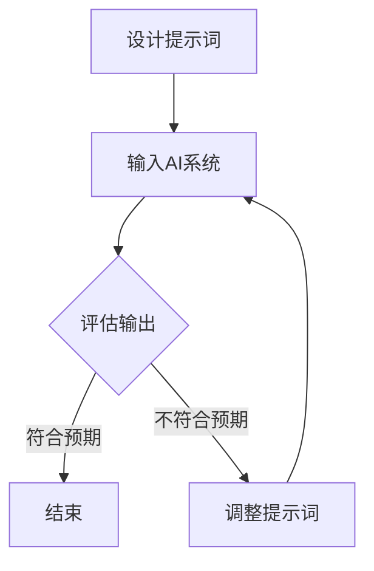

                 

# 《提示词工程在AI伦理委员会决策中的应用》

## 关键词
- 提示词工程
- AI伦理委员会
- 决策流程
- 伦理评估
- 语言模型
- 数据处理
- 优化算法

## 摘要
本文深入探讨了提示词工程在AI伦理委员会决策中的应用。首先，我们介绍了提示词工程的定义、核心概念和流程，并阐述了其在AI系统中的关键作用。接着，我们分析了AI伦理委员会的架构、职能和工作流程，揭示了提示词工程如何融入其中，发挥其在伦理决策中的作用。随后，通过具体案例和代码实现，我们展示了如何利用提示词工程进行伦理评估和监督，从而为AI伦理决策提供科学依据。最后，我们提出了提示词工程在AI伦理决策中的挑战和未来发展方向，为该领域的研究和实践提供了有益的启示。

## 第一部分：引论

### 第1章 提示词工程的定义与作用

#### 1.1 提示词工程的定义

提示词工程（Prompt Engineering）是指设计和优化用于引导人工智能（AI）系统行为和决策的提示词（prompts）的过程。这些提示词通常是文本或指令，旨在通过引导AI系统输入来影响其输出。提示词工程的核心目标是提高AI系统的性能、可解释性和可靠性。

#### 1.2 提示词工程的核心概念

提示词工程涉及几个核心概念：

- **提示词**：用于引导AI系统输入的文本或指令。一个良好的提示词应当清晰、明确，并能够激发AI系统的特定反应。
- **目标输出**：期望AI系统生成的输出结果。目标输出的明确性对于提示词的设计至关重要。
- **反馈循环**：通过观察AI系统的输出，评估其质量，并据此调整提示词，形成一个迭代过程。

#### 1.3 提示词工程的作用

在AI伦理委员会的决策过程中，提示词工程具有以下几个重要作用：

- **引导AI系统行为**：通过精心设计的提示词，可以引导AI系统进行特定的任务，例如伦理评估或决策支持。
- **提高可解释性**：提示词工程有助于提高AI系统的可解释性，使其决策过程更加透明，便于伦理委员会的理解和监督。
- **优化性能**：通过调整和优化提示词，可以提高AI系统的性能和准确性，从而提高决策质量。

#### 1.4 提示词工程的Mermaid流程图

以下是一个简单的Mermaid流程图，展示了提示词工程的基本流程：

### 第2章 提示词工程的发展历程

#### 2.1 提示词工程的早期发展

提示词工程的概念最早可以追溯到人工智能的早期研究。在20世纪50年代和60年代，研究者开始探索如何通过设计特定的输入来影响AI系统的行为。这一时期的提示词主要依赖于预定义的规则和模式匹配。

#### 2.2 提示词工程的发展趋势

随着深度学习和自然语言处理（NLP）技术的发展，提示词工程也得到了显著的发展。近年来，研究者开始利用大型预训练模型，如GPT和BERT，来生成和优化提示词。这一趋势使得提示词工程更加智能化和高效。

#### 2.3 提示词工程的关键技术

- **预训练模型**：通过在大量数据上进行预训练，预训练模型能够生成高质量的提示词。
- **生成对抗网络（GAN）**：GAN可以用于生成多样化的提示词，从而提高AI系统的泛化能力。
- **优化算法**：如梯度提升（Gradient Boosting）和强化学习（Reinforcement Learning）等优化算法，可以用于调整和优化提示词。

### 第3章 AI伦理委员会的架构与职能

#### 3.1 AI伦理委员会的架构设计

AI伦理委员会通常由来自不同领域的专家组成，包括计算机科学家、社会学家、伦理学家和法律专家等。这些专家共同协作，以制定和实施AI伦理准则和规范。

#### 3.2 AI伦理委员会的职能划分

AI伦理委员会的主要职能包括：

- **伦理评估**：对AI系统的设计、开发和部署进行伦理评估，确保其符合社会价值观和道德标准。
- **决策支持**：为涉及AI的决策提供伦理指导，帮助决策者做出符合伦理的决策。
- **监督与合规**：监督AI系统的运行，确保其遵守相关法规和伦理准则。

#### 3.3 AI伦理委员会的工作流程

AI伦理委员会的工作流程通常包括以下几个步骤：

1. **问题定义**：明确需要评估的AI系统或决策情境。
2. **数据收集**：收集与问题相关的数据和信息。
3. **伦理评估**：根据伦理准则和规范，对AI系统或决策情境进行评估。
4. **决策支持**：为决策者提供伦理指导和建议。
5. **监督与合规**：监督AI系统的运行，确保其符合伦理准则和法规。

## 第二部分：AI伦理委员会的决策流程

### 第4章 提示词工程在AI伦理决策中的应用

#### 4.1 提示词工程在AI伦理评估中的应用

提示词工程在AI伦理评估中的应用主要体现在以下几个方面：

- **引导伦理分析**：通过设计特定的提示词，可以引导AI系统进行伦理分析，从而识别潜在的风险和问题。
- **提高评估效率**：提示词工程可以帮助伦理委员会快速地评估AI系统的伦理影响，提高决策效率。
- **增强可解释性**：通过设计可解释的提示词，可以提高AI系统决策过程的透明度和可理解性。

#### 4.2 提示词工程在AI伦理监督中的作用

提示词工程在AI伦理监督中的应用主要包括：

- **监控AI行为**：通过设计特定的提示词，可以监控AI系统的行为，确保其符合伦理准则。
- **预警机制**：提示词工程可以帮助伦理委员会建立预警机制，及时发现和应对潜在的伦理问题。

#### 4.3 提示词工程在AI伦理决策中的价值

提示词工程在AI伦理决策中的价值体现在以下几个方面：

- **提高决策质量**：通过优化提示词，可以提高AI伦理决策的准确性和可靠性。
- **增强决策透明度**：提示词工程有助于提高AI伦理决策的透明度和可解释性，增强公众对AI系统的信任。
- **促进伦理发展**：提示词工程可以为伦理委员会提供新的工具和方法，促进AI伦理的发展和完善。

### 第5章 提示词工程的实践应用

#### 5.1 提示词工程在实际案例中的应用

以下是一些提示词工程在实际案例中的应用：

- **医疗伦理决策**：在医疗领域，提示词工程可以用于设计伦理决策支持系统，帮助医疗人员做出符合伦理的决策。
- **自动驾驶伦理**：在自动驾驶领域，提示词工程可以用于设计伦理评估系统，评估自动驾驶系统的伦理风险。
- **金融伦理**：在金融领域，提示词工程可以用于设计伦理风险评估系统，帮助金融机构识别和应对潜在的伦理问题。

#### 5.2 提示词工程在AI伦理决策中的案例分析

以下是一个提示词工程在AI伦理决策中的案例分析：

**案例背景**：某公司开发了一款用于招聘的AI系统，该系统通过分析简历和求职信来评估求职者的能力和匹配度。

**伦理问题**：公司担心AI系统可能会在招聘过程中引入性别、种族等偏见。

**解决方案**：通过设计特定的提示词，引导AI系统进行伦理分析，识别和消除潜在的偏见。例如，设计一个提示词：“请评估求职者的能力和匹配度，不考虑其性别、种族等因素。”

#### 5.3 提示词工程的改进与创新

为了提高提示词工程在AI伦理决策中的应用效果，研究者们不断进行改进和创新：

- **多模态提示词**：结合文本、图像、音频等多种模态，设计更复杂的提示词，提高AI系统的理解和分析能力。
- **自适应提示词**：根据AI系统的反馈和学习过程，动态调整提示词，实现更精细的伦理决策。
- **交互式提示词**：设计交互式提示词，使AI系统能够与伦理委员会进行实时沟通和协作，提高决策的透明度和参与度。

### 第6章 提示词工程的实现框架

#### 6.1 提示词工程的实现框架

提示词工程的实现框架通常包括以下几个部分：

- **数据预处理**：对输入数据进行清洗、转换和预处理，以适应AI系统的需求。
- **提示词生成**：利用自然语言生成（NLG）技术，生成高质量的提示词。
- **模型训练**：使用深度学习模型对提示词进行训练，以提高其生成质量和效率。
- **反馈机制**：通过评估AI系统的输出，收集反馈，并据此调整提示词。

#### 6.2 提示词工程的核心算法

提示词工程涉及多种核心算法，包括：

- **自然语言生成（NLG）**：用于生成高质量的自然语言提示词。
- **生成对抗网络（GAN）**：用于生成多样化的提示词。
- **优化算法**：如梯度提升（Gradient Boosting）和强化学习（Reinforcement Learning），用于调整和优化提示词。

#### 6.3 提示词工程的实现流程

提示词工程的实现流程通常包括以下几个步骤：

1. **需求分析**：明确AI系统的需求和目标，确定需要生成的提示词类型和特点。
2. **数据收集**：收集与需求相关的数据，包括文本、图像、音频等。
3. **数据预处理**：对收集的数据进行清洗、转换和预处理，以适应AI系统的需求。
4. **提示词生成**：利用NLG技术和GAN等算法，生成高质量的提示词。
5. **模型训练**：使用深度学习模型对生成的提示词进行训练，以提高其生成质量和效率。
6. **反馈机制**：通过评估AI系统的输出，收集反馈，并据此调整提示词。

### 第7章 提示词工程的技术细节

#### 7.1 提示词工程的数据处理

提示词工程中的数据处理主要包括以下任务：

- **文本预处理**：对文本进行分词、词性标注、实体识别等处理，以提高AI系统的理解能力。
- **图像处理**：对图像进行预处理，如尺寸调整、灰度化、滤波等，以适应AI系统的需求。
- **音频处理**：对音频进行预处理，如降噪、频谱分析等，以提取有用的信息。

#### 7.2 提示词工程的语言模型

提示词工程中的语言模型主要用于生成自然语言提示词。常用的语言模型包括：

- **预训练模型**：如GPT、BERT等，通过在大量数据上进行预训练，生成高质量的提示词。
- **微调模型**：在预训练模型的基础上，针对特定任务进行微调，以提高提示词的生成质量和效率。

#### 7.3 提示词工程的模型优化

提示词工程的模型优化主要包括以下几个方面：

- **参数调整**：通过调整模型的参数，提高其生成质量和效率。
- **算法改进**：改进生成算法，如GAN、变分自编码器（VAE）等，以提高提示词的生成质量和多样性。
- **反馈机制**：通过评估AI系统的输出，收集反馈，并据此调整模型，实现更精细的提示词生成。

### 第8章 提示词工程在AI伦理决策中的挑战与机遇

#### 8.1 提示词工程的挑战

提示词工程在AI伦理决策中面临以下挑战：

- **伦理争议**：不同领域的专家可能对伦理准则有不同的理解和看法，导致在提示词设计上出现争议。
- **数据隐私**：在处理敏感数据时，需要确保数据隐私得到保护。
- **技术复杂性**：提示词工程的实现涉及多种技术，如深度学习、自然语言处理等，对技术人员的专业能力要求较高。

#### 8.2 提示词工程的发展机遇

尽管面临挑战，提示词工程在AI伦理决策中仍具有巨大的发展机遇：

- **技术创新**：随着深度学习、自然语言处理等技术的不断进步，提示词工程将得到进一步发展。
- **伦理规范**：随着社会对AI伦理的关注度提高，将有助于推动伦理规范和准则的制定和完善。
- **跨学科合作**：提示词工程需要计算机科学、伦理学、社会学等多学科的合作，有助于解决复杂的伦理问题。

#### 8.3 提示词工程的未来趋势

提示词工程在AI伦理决策中的未来趋势包括：

- **智能化**：利用人工智能技术，实现更智能、更高效的提示词生成和优化。
- **标准化**：制定统一的伦理准则和提示词标准，提高提示词工程的应用效果和可重复性。
- **跨领域应用**：拓展提示词工程的应用领域，如医疗、金融、自动驾驶等，为各领域的伦理决策提供支持。

## 结语

提示词工程在AI伦理决策中具有重要作用，通过引导AI系统行为、提高可解释性和优化性能，可以为伦理委员会提供科学、透明的决策支持。然而，提示词工程仍面临伦理争议、数据隐私和技术复杂性等挑战。未来的发展需要技术创新、伦理规范和跨学科合作，以推动该领域的进一步发展。

### 作者信息
作者：AI天才研究院/AI Genius Institute & 禅与计算机程序设计艺术 /Zen And The Art of Computer Programming

