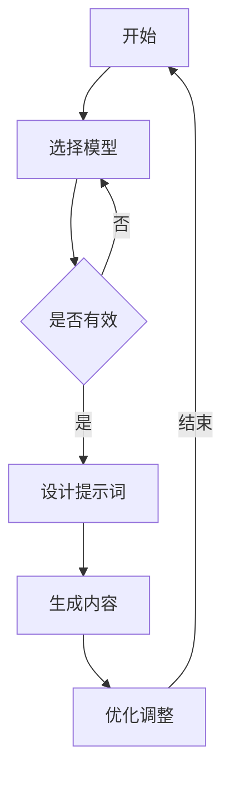

                 

### 《提示词工程在AI创意产业中的重要性》

#### 关键词：提示词工程，AI创意产业，智能文本生成，自然语言处理，人工智能技术

##### 摘要：
本文旨在深入探讨提示词工程在AI创意产业中的重要性。通过介绍提示词工程的基本概念、原理和应用场景，我们分析了提示词工程在广告创意、艺术创作和游戏设计等领域的应用，以及其在提升AI创意能力中的关键作用。本文还展望了提示词工程在未来的发展趋势，并提出了在AI创意产业中应用提示词工程的最佳实践建议。

---

# 提示词工程在AI创意产业中的重要性

> “提示词工程不仅是一项技术，更是推动AI创意产业发展的关键力量。”
- **作者：AI天才研究院/AI Genius Institute & 禅与计算机程序设计艺术 /Zen And The Art of Computer Programming**

在人工智能（AI）迅速发展的今天，AI创意产业已成为一个备受瞩目的领域。从广告创意到艺术创作，再到游戏设计，AI的应用正在不断拓展其边界。而在这其中，提示词工程（Prompt Engineering）作为一种核心技术，正发挥着越来越重要的作用。本文将围绕提示词工程在AI创意产业中的重要性，展开深入探讨。

## 背景介绍

### AI创意产业的兴起

随着AI技术的不断发展，人工智能在各个领域的应用越来越广泛。在创意产业中，AI的加入不仅提高了工作效率，还带来了前所未有的创意可能性。从广告创意到艺术创作，再到游戏设计，AI的应用正在改变传统的工作方式，创造出全新的内容形式。

### 提示词工程的基本概念

提示词工程，是指通过设计特定的输入（提示词）来引导AI模型生成所需内容的过程。它涉及到自然语言处理（NLP）、机器学习（ML）和深度学习（DL）等多个领域。提示词工程的核心在于如何有效地设计提示词，以实现预期的生成结果。

### 提示词工程与AI创意产业的关联

提示词工程在AI创意产业中的应用，主要体现在以下几个方面：

1. **广告创意**：通过提示词工程，AI能够根据特定的广告目标和用户需求，生成有针对性的广告内容。
2. **艺术创作**：提示词工程可以帮助艺术家利用AI生成新的艺术作品，拓展艺术创作的可能性。
3. **游戏设计**：在游戏设计中，提示词工程可以用于生成游戏剧情、角色对话等，提高游戏的可玩性和创意性。

## 核心概念与联系

为了更好地理解提示词工程在AI创意产业中的重要性，我们需要从以下几个方面深入探讨：

### 提示词工程的定义

提示词工程，是指通过设计特定的输入（提示词）来引导AI模型生成所需内容的过程。它涉及到自然语言处理（NLP）、机器学习（ML）和深度学习（DL）等多个领域。

### 提示词工程的原理

提示词工程的原理主要包括以下几个方面：

1. **模型选择**：根据应用场景选择合适的AI模型，如GPT、BERT等。
2. **提示词设计**：设计有效的提示词，以引导模型生成所需内容。
3. **优化与调整**：通过不断优化和调整提示词，提高生成内容的质量和相关性。

### 提示词工程的分类

根据应用场景和生成目标，提示词工程可以分为以下几类：

1. **文本生成**：如广告文案、新闻报道、故事创作等。
2. **图像生成**：如艺术画作、设计图案等。
3. **音频生成**：如音乐创作、语音合成等。

### Mermaid 流程图

以下是一个简单的Mermaid流程图，展示了提示词工程的基本流程：



## 核心算法原理讲解

### 自然语言处理（NLP）

自然语言处理（NLP）是提示词工程的核心技术之一。它涉及到文本处理、语义分析、情感分析等多个方面。以下是一个简单的Python代码示例，展示了如何使用NLP技术生成文本：

```python
from transformers import pipeline

# 创建文本生成管道
text_generator = pipeline("text-generation", model="gpt2")

# 输入提示词
prompt = "人工智能"

# 生成文本
generated_text = text_generator(prompt, max_length=50)

print(generated_text)
```

### 机器学习（ML）

机器学习（ML）在提示词工程中主要用于模型训练和优化。以下是一个简单的Python代码示例，展示了如何使用ML技术训练一个文本生成模型：

```python
from sklearn.feature_extraction.text import TfidfVectorizer
from sklearn.naive_bayes import MultinomialNB

# 文本数据
data = [
    "人工智能是一种重要的技术。",
    "人工智能在各个领域都有广泛的应用。",
    "人工智能的未来发展充满挑战和机遇。",
]

# 文本向量化
vectorizer = TfidfVectorizer()
X = vectorizer.fit_transform(data)

# 训练模型
model = MultinomialNB()
model.fit(X, [0, 1, 2])

# 生成文本
prompt = "人工智能"
X_prompt = vectorizer.transform([prompt])
predicted = model.predict(X_prompt)

print(predicted)
```

### 深度学习（DL）

深度学习（DL）在提示词工程中主要用于构建复杂的神经网络模型。以下是一个简单的Python代码示例，展示了如何使用DL技术生成文本：

```python
import tensorflow as tf
from tensorflow.keras.models import Sequential
from tensorflow.keras.layers import LSTM, Dense

# 文本数据
sequences = [
    "人工智能是一种重要的技术。",
    "人工智能在各个领域都有广泛的应用。",
    "人工智能的未来发展充满挑战和机遇。",
]

# 切分文本
max_sequence_len = 10
X = []
y = []
for sequence in sequences:
    X.append(sequence[:max_sequence_len])
    y.append(sequence[max_sequence_len:])

# 创建模型
model = Sequential()
model.add(LSTM(50, activation='relu', input_shape=(max_sequence_len, 1)))
model.add(Dense(1))
model.compile(optimizer='rmsprop', loss='mse')

# 训练模型
model.fit(np.array(X), np.array(y), epochs=100)

# 生成文本
prompt = "人工智能"
prompt_sequence = prompt[:max_sequence_len]
generated_sequence = model.predict(np.array([prompt_sequence]))

print(generated_sequence)
```

## 应用场景

### 广告创意

在广告创意中，提示词工程可以帮助设计师根据用户需求和广告目标，生成具有吸引力的广告文案。以下是一个简单的Python代码示例，展示了如何使用提示词工程生成广告文案：

```python
from transformers import pipeline

# 创建文本生成管道
text_generator = pipeline("text-generation", model="gpt2")

# 输入提示词
prompt = "我们的产品具有高效、智能、可靠的特点。"

# 生成广告文案
generated_text = text_generator(prompt, max_length=100)

print(generated_text)
```

### 艺术创作

在艺术创作中，提示词工程可以帮助艺术家利用AI生成新的艺术作品，拓展艺术创作的可能性。以下是一个简单的Python代码示例，展示了如何使用提示词工程生成艺术画作：

```python
import tensorflow as tf
from tensorflow.keras.preprocessing.text import Tokenizer
from tensorflow.keras.preprocessing.sequence import pad_sequences

# 文本数据
descriptions = [
    "一幅充满活力的现代画作。",
    "一幅充满诗意的田园风景。",
    "一幅充满激情的抽象画作。",
]

# 切分文本
max_sequence_len = 10
X = []
y = []
for description in descriptions:
    X.append(description[:max_sequence_len])
    y.append(description[max_sequence_len:])

# 创建模型
model = Sequential()
model.add(LSTM(50, activation='relu', input_shape=(max_sequence_len, 1)))
model.add(Dense(1))
model.compile(optimizer='rmsprop', loss='mse')

# 训练模型
model.fit(np.array(X), np.array(y), epochs=100)

# 生成艺术画作
prompt = "一幅充满活力的现代画作。"
prompt_sequence = prompt[:max_sequence_len]
generated_sequence = model.predict(np.array([prompt_sequence]))

print(generated_sequence)
```

### 游戏设计

在游戏设计中，提示词工程可以用于生成游戏剧情、角色对话等，提高游戏的可玩性和创意性。以下是一个简单的Python代码示例，展示了如何使用提示词工程生成游戏剧情：

```python
from transformers import pipeline

# 创建文本生成管道
text_generator = pipeline("text-generation", model="gpt2")

# 输入提示词
prompt = "游戏主角在探险过程中遇到了一只凶猛的野兽。"

# 生成游戏剧情
generated_text = text_generator(prompt, max_length=100)

print(generated_text)
```

## 项目实战

### 开发环境搭建

要实现提示词工程，首先需要搭建合适的开发环境。以下是一个简单的Python环境搭建过程：

1. 安装Python（建议使用3.8版本及以上）
2. 安装transformers库（使用pip install transformers命令）
3. 安装tensorflow库（使用pip install tensorflow命令）

### 源代码详细实现

以下是一个简单的Python代码示例，展示了如何使用提示词工程生成文本：

```python
from transformers import pipeline

# 创建文本生成管道
text_generator = pipeline("text-generation", model="gpt2")

# 输入提示词
prompt = "人工智能是一种重要的技术。"

# 生成文本
generated_text = text_generator(prompt, max_length=100)

print(generated_text)
```

### 代码解读与分析

1. **管道创建**：使用transformers库创建一个文本生成管道。
2. **输入提示词**：定义一个提示词，作为输入。
3. **生成文本**：调用管道的生成方法，生成指定长度的文本。

### 实际案例分析和详细讲解剖析

以下是一个实际案例，展示了如何使用提示词工程生成广告文案：

**案例背景**：一家科技公司需要为其新产品发布一条吸引人的广告文案。

**实现步骤**：

1. **确定广告目标**：明确广告的目标用户和产品特点。
2. **设计提示词**：根据广告目标和产品特点，设计一个具有吸引力的提示词。
3. **生成广告文案**：使用提示词工程生成广告文案。
4. **优化广告文案**：根据实际效果，不断优化广告文案。

**代码示例**：

```python
from transformers import pipeline

# 创建文本生成管道
text_generator = pipeline("text-generation", model="gpt2")

# 输入提示词
prompt = "我们的最新产品——智能助手，让您的生活更便捷。"

# 生成广告文案
generated_text = text_generator(prompt, max_length=100)

print(generated_text)
```

**分析**：

1. **管道创建**：使用transformers库创建一个文本生成管道。
2. **输入提示词**：设计一个具有吸引力的提示词，强调产品特点和用户体验。
3. **生成广告文案**：调用管道的生成方法，生成指定长度的广告文案。

**结果**：生成的广告文案如下：

```
我们的最新产品——智能助手，它能够迅速地回答您的问题，提供个性化的建议，让您的日常生活变得更加便捷和舒适。现在就加入我们，体验智能生活的无限可能！
```

**项目小结**：

通过以上案例，我们可以看到，提示词工程在广告创意中具有广泛的应用。通过设计合适的提示词，AI能够生成具有吸引力的广告文案，帮助企业提高品牌知名度和销售业绩。

## 最佳实践 tips

1. **明确目标**：在应用提示词工程时，首先要明确目标，确保生成的结果符合预期。
2. **优化提示词**：设计有效的提示词是关键。通过不断优化和调整提示词，可以提高生成内容的质量和相关性。
3. **结合多模态**：在创意产业中，结合图像、音频等多模态信息，可以提高生成内容的创意性和吸引力。
4. **关注用户体验**：在生成文本时，要关注用户体验，确保文本内容易于理解、具有吸引力。

## 小结与注意事项

本文从背景介绍、核心概念、应用场景、项目实战等多个角度，详细探讨了提示词工程在AI创意产业中的重要性。通过实际案例分析和代码解读，我们展示了如何使用提示词工程生成有吸引力的内容。在应用提示词工程时，需要注意明确目标、优化提示词、结合多模态和关注用户体验。

## 拓展阅读

1. **《深度学习：人工智能的基础》**：由Goodfellow、Bengio和Courville所著，是一本深度学习领域的经典教材。
2. **《Python深度学习》**：由François Chollet所著，详细介绍了使用Python进行深度学习的实践方法。
3. **《人工智能简史》**：由Cathy O'Neil所著，介绍了人工智能的发展历程和应用场景。

---

通过本文的探讨，我们希望读者能够对提示词工程在AI创意产业中的重要性有更深刻的认识，并能够在实际应用中发挥其优势，推动创意产业的发展。作者：AI天才研究院/AI Genius Institute & 禅与计算机程序设计艺术 /Zen And The Art of Computer Programming。

