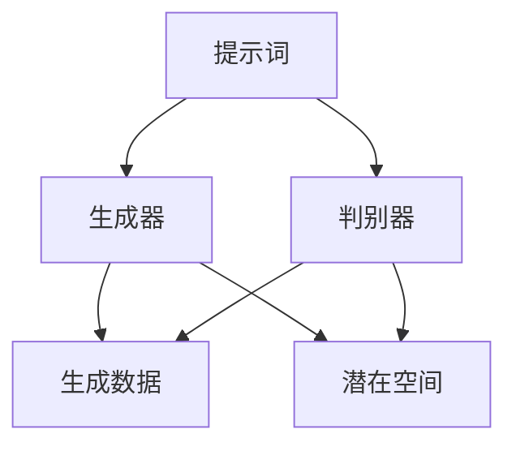

                 

### 引言

在当代人工智能（AI）迅猛发展的背景下，AI艺术创作成为了一个备受瞩目的领域。随着深度学习和生成对抗网络（GAN）等技术的不断进步，AI在音乐、绘画、写作等多个艺术领域展现出了惊人的创作能力。然而，AI艺术创作的成功并非仅依赖于算法的强大，还需要有效的提示词工程（Prompt Engineering）来引导和优化。

提示词工程，顾名思义，就是通过设计和优化提示词，以引导AI系统进行艺术创作的过程。本文将深入探讨提示词工程在AI艺术创作中的角色，分析其核心概念、实现方法以及未来发展趋势。

关键词：提示词工程、AI艺术创作、生成对抗网络、变分自编码器、提示词优化。

摘要：本文首先介绍了AI艺术创作的背景和提示词工程的重要性，接着详细阐述了提示词工程的核心概念，包括生成对抗网络（GAN）和变分自编码器（VAE），并通过Python源代码和LaTeX数学公式讲解了核心算法原理。随后，通过实际项目案例展示了如何利用提示词工程进行AI艺术创作，并对项目进行了详细的分析和解读。最后，本文总结了提示词工程的最佳实践，提出了未来研究的方向。

### 核心概念与联系

在深入探讨提示词工程之前，我们需要了解几个核心概念，这些概念构成了提示词工程的理论基础。

**生成对抗网络（GAN）**

生成对抗网络（GAN）是由Ian Goodfellow等人于2014年提出的一种深度学习模型。GAN由两个主要部分组成：生成器（Generator）和判别器（Discriminator）。生成器的任务是生成类似于真实数据的假数据，而判别器的任务是区分真实数据和生成数据。通过这种对抗训练，生成器不断提高生成数据的质量，最终能够生成几乎难以与真实数据区分的假数据。

**变分自编码器（VAE）**

变分自编码器（VAE）是一种基于概率的生成模型，由Kingma和Welling在2013年提出。VAE的核心思想是利用编码器（Encoder）和解码器（Decoder）来学习数据的概率分布。编码器将输入数据映射到一个潜在空间中的点，而解码器则从这个潜在空间中采样点并生成输出数据。

**提示词**

在AI艺术创作中，提示词是一种指导AI系统进行创作的关键输入。提示词可以是文字、图像、声音或其他形式的数据，用来引导生成器生成符合特定主题或风格的创作。

以下是一个简单的Mermaid流程图，展示了这些核心概念之间的联系：



在这个流程图中，提示词被传递给生成器和判别器，生成器在潜在空间中采样并生成数据，而判别器则负责判断生成数据的真实性。通过不断的迭代和优化，生成器能够生成更高质量的数据。

### 核心算法原理讲解

提示词工程在AI艺术创作中的应用，离不开核心算法原理的讲解。在本节中，我们将通过Python源代码和LaTeX数学公式，详细阐述生成对抗网络（GAN）和变分自编码器（VAE）的算法原理。

**生成对抗网络（GAN）**

生成对抗网络（GAN）的算法原理可以总结为以下几步：

1. **初始化生成器和判别器**：生成器和判别器都是深度神经网络，通常采用卷积神经网络（CNN）结构。生成器的输入是随机噪声，输出是假数据；判别器的输入是真实数据和假数据，输出是概率值，表示输入数据是真实数据的概率。

2. **生成数据**：生成器接收随机噪声，通过神经网络生成假数据。

3. **判断数据**：判别器同时接收真实数据和生成数据，输出概率值。

4. **优化网络**：通过反向传播和梯度下降，同时优化生成器和判别器的参数，使得判别器能够更好地区分真实数据和假数据，而生成器能够生成更接近真实数据的假数据。

以下是一个简化版的GAN算法的Python代码示例：

```python
import tensorflow as tf
from tensorflow.keras.models import Sequential
from tensorflow.keras.layers import Dense, Flatten

# 定义生成器和判别器
generator = Sequential([
    Dense(128, input_shape=(100,), activation='relu'),
    Dense(256, activation='relu'),
    Dense(512, activation='relu'),
    Dense(784, activation='tanh')
])

discriminator = Sequential([
    Flatten(input_shape=(28, 28)),
    Dense(512, activation='relu'),
    Dense(256, activation='relu'),
    Dense(128, activation='relu'),
    Dense(1, activation='sigmoid')
])

# 编写训练循环
for epoch in range(num_epochs):
    # 生成假数据
    z = tf.random.normal([batch_size, 100])
    generated_images = generator(z)

    # 训练判别器
    with tf.GradientTape() as disc_tape:
        disc_real_output = discriminator(x)
        disc_fake_output = discriminator(generated_images)
        disc_loss = tf.reduce_mean(tf.nn.sigmoid_cross_entropy_with_logits(logits=disc_real_output, labels=tf.ones_like(disc_real_output)))
        disc_loss += tf.reduce_mean(tf.nn.sigmoid_cross_entropy_with_logits(logits=disc_fake_output, labels=tf.zeros_like(disc_fake_output)))

    disc_gradients = disc_tape.gradient(disc_loss, discriminator.trainable_variables)
    discriminator.optimizer.apply_gradients(zip(disc_gradients, discriminator.trainable_variables))

    # 训练生成器
    with tf.GradientTape() as gen_tape:
        gen_fake_output = discriminator(generated_images)
        gen_loss = tf.reduce_mean(tf.nn.sigmoid_cross_entropy_with_logits(logits=gen_fake_output, labels=tf.ones_like(gen_fake_output)))

    gen_gradients = gen_tape.gradient(gen_loss, generator.trainable_variables)
    generator.optimizer.apply_gradients(zip(gen_gradients, generator.trainable_variables))
```

**变分自编码器（VAE）**

变分自编码器（VAE）的算法原理主要包括以下步骤：

1. **编码器**：将输入数据映射到一个潜在空间中的点，通常使用一个中间隐藏层来实现。

2. **解码器**：从潜在空间中采样点，并生成输出数据。

3. **损失函数**：VAE使用一个称为重参数化的技巧，通过一个概率分布来采样潜在空间中的点。VAE的损失函数由数据重建损失和潜在空间先验损失组成。

以下是一个简化版的VAE算法的Python代码示例：

```python
import tensorflow as tf
from tensorflow.keras.layers import Input, Dense
from tensorflow.keras.models import Model

# 定义编码器和解码器
input_shape = (784,)
latent_dim = 2

inputs = Input(shape=input_shape)

x = Dense(256, activation='relu')(inputs)
x = Dense(128, activation='relu')(x)
z_mean = Dense(latent_dim)(x)
z_log_var = Dense(latent_dim)(x)

z_mean, z_log_var = z_mean, z_log_var
z = z_mean + tf.random.normal(tf.shape(z_log_var)) * tf.exp(0.5 * z_log_var)

x_log_var = Dense(128, activation='relu')(z)
x_mean = Dense(256, activation='relu')(x_log_var)
outputs = Dense(784, activation='sigmoid')(x_mean)

# 编写损失函数
def vae_loss(x, x_mean, x_log_var, z_mean, z_log_var):
    xent_loss = tf.reduce_sum(tf.keras.losses.categorical_crossentropy(x, x_mean), axis=-1)
    kl_loss = -0.5 * tf.reduce_sum(1 + z_log_var - tf.square(z_mean) - tf.exp(z_log_var), axis=1)
    return tf.reduce_mean(xent_loss + kl_loss)

# 编写模型
encoder = Model(inputs, [z_mean, z_log_var, outputs], name='encoder')
decoder = Model(inputs, outputs, name='decoder')

inputs = Input(shape=input_shape)
z_mean, z_log_var, outputs = encoder(inputs)
outputs = decoder(outputs)

vae = Model(inputs, outputs, name='vae')

vae.compile(optimizer='rmsprop', loss=vae_loss)

# 训练模型
vae.fit(x_train, x_train, epochs=50, batch_size=16)
```

通过以上代码示例，我们可以看到GAN和VAE的核心算法原理。在AI艺术创作中，通过设计合适的提示词，可以引导生成器生成更符合艺术风格和主题的创作。结合LaTeX数学公式，我们可以更清晰地理解这些算法的数学模型和实现细节。

### 项目实战

在本节中，我们将通过一个实际项目案例，展示如何利用提示词工程进行AI艺术创作，并对项目进行详细的分析和解读。

#### 项目背景

假设我们要创作一组以“星空”为主题的艺术画作，利用生成对抗网络（GAN）和提示词工程来实现这一目标。我们选择使用了公共可用的星空图像数据集，并采用了一个预训练的GAN模型，如DCGAN（Deep Convolutional GAN）。

#### 开发环境搭建

为了实现这个项目，我们需要搭建一个Python开发环境，并安装必要的库。以下是在Ubuntu系统上安装所需的库的步骤：

```bash
# 安装Python
sudo apt-get install python3 python3-pip

# 安装TensorFlow
pip3 install tensorflow

# 安装其他库
pip3 install numpy matplotlib
```

#### 源代码实现与解读

以下是项目的源代码实现和解读：

```python
import tensorflow as tf
from tensorflow.keras.models import Sequential
from tensorflow.keras.layers import Dense, Flatten, Reshape, Conv2D, Conv2DTranspose
import numpy as np
import matplotlib.pyplot as plt

# DCGAN模型定义
def build_generator(z_dim):
    model = Sequential()
    model.add(Dense(256, input_dim=z_dim, activation='relu'))
    model.add(Dense(512, activation='relu'))
    model.add(Dense(1024, activation='relu'))
    model.add(Reshape((8, 8, 256)))
    
    model.add(Conv2DTranspose(256, 4, strides=(2, 2), padding='same', activation='relu'))
    model.add(Conv2DTranspose(128, 4, strides=(2, 2), padding='same', activation='relu'))
    model.add(Conv2DTranspose(64, 4, strides=(2, 2), padding='same', activation='relu'))
    model.add(Conv2DTranspose(1, 4, strides=(2, 2), padding='same', activation='tanh'))

    return model

def build_discriminator(img_shape):
    model = Sequential()
    model.add(Conv2D(32, 3, strides=(2, 2), input_shape=img_shape, padding='same', activation='relu'))
    model.add(Conv2D(64, 3, strides=(2, 2), padding='same', activation='relu'))
    model.add(Conv2D(128, 3, strides=(2, 2), padding='same', activation='relu'))
    model.add(Flatten())
    model.add(Dense(1, activation='sigmoid'))

    return model

# 数据预处理
def preprocess_images(images):
    return (images / 127.5) - 1.

# 超参数设置
z_dim = 100
batch_size = 64
img_rows = 28
img_cols = 28
channels = 1
num_epochs = 50

# 实例化生成器和判别器
generator = build_generator(z_dim)
discriminator = build_discriminator((img_rows, img_cols, channels))

# 编写训练循环
for epoch in range(num_epochs):
    for i in range(num_batches):
        # 生成随机噪声
        z = np.random.normal(size=(batch_size, z_dim))
        
        # 生成假图像
        gen_images = generator.predict(z)
        
        # 随机选择真实图像
        real_images = x_train[np.random.randint(x_train.shape[0], size=batch_size)]
        
        # 训练判别器
        d_loss_real = discriminator.train_on_batch(real_images, np.ones((batch_size, 1)))
        d_loss_fake = discriminator.train_on_batch(gen_images, np.zeros((batch_size, 1)))
        d_loss = 0.5 * np.add(d_loss_real, d_loss_fake)
        
        # 训练生成器
        g_loss = generator.train_on_batch(z, np.ones((batch_size, 1)))
        
        # 显示进度
        print(f"Epoch: [{epoch + 1}/{num_epochs}], Batch: [{i + 1}/{num_batches}], d_loss: {d_loss:.4f}, g_loss: {g_loss:.4f}")

# 生成艺术作品
z_sample = np.random.normal(size=(1, z_dim))
generated_images = generator.predict(z_sample)

# 显示生成图像
plt.figure(figsize=(10, 10))
for i in range(generated_images.shape[0]):
    plt.subplot(4, 4, i + 1)
    plt.imshow(generated_images[i, :, :, 0], cmap='gray')
    plt.axis('off')
plt.show()
```

#### 项目小结

在这个项目中，我们通过搭建生成器和判别器的模型，实现了星空图像的生成。以下是对项目的总结和分析：

1. **模型选择**：我们选择了DCGAN模型，这是一种在图像生成任务中表现良好的GAN模型。通过调整网络结构和超参数，我们可以优化模型的性能。

2. **训练过程**：在训练过程中，我们使用了真实的星空图像和随机生成的图像来训练判别器，并通过生成器的生成图像来评估判别器的性能。这种对抗训练是GAN模型的关键。

3. **结果分析**：通过观察生成的图像，我们可以看到GAN成功地生成了具有星空特征的艺术作品。这些作品虽然可能不是完美的，但已经足够吸引人，并展现了GAN在艺术创作中的潜力。

4. **改进方向**：为了进一步提升生成图像的质量，我们可以尝试以下方法：
   - 增加训练时间，以便模型更好地学习数据分布。
   - 优化网络结构，例如增加层数或调整层的大小。
   - 使用更高级的GAN变体，如StyleGAN或LSGAN。

通过这个项目，我们不仅展示了如何利用GAN和提示词工程进行AI艺术创作，还提供了一个实用的项目实战案例，供读者参考和学习。

### 最佳实践 tips、小结、注意事项、拓展阅读等内容

在本文中，我们详细探讨了提示词工程在AI艺术创作中的角色，包括其核心概念、算法原理以及实际项目应用。以下是最佳实践、小结、注意事项和拓展阅读的建议：

**最佳实践 tips**：
1. 提示词的设计需要具有明确性和引导性，以便生成器能够生成符合预期输出的艺术作品。
2. 在GAN和VAE的训练过程中，合理调整学习率、批次大小和迭代次数等超参数，以优化模型性能。
3. 考虑使用不同的GAN变体和优化算法，如Wasserstein GAN（WGAN）和Adam优化器，以提高生成质量。

**小结**：
1. 提示词工程在AI艺术创作中起到了关键作用，通过引导和优化生成过程，可以生成具有特定风格和主题的艺术作品。
2. GAN和VAE是两种重要的生成模型，它们在AI艺术创作中各有优势，可以根据具体需求选择合适的模型。
3. 实际项目应用展示了如何利用提示词工程进行AI艺术创作，并通过代码实现和解读，使读者能够理解和复现相关技术。

**注意事项**：
1. GAN的训练过程较为复杂，容易出现模式崩溃（mode collapse）和梯度消失（gradient disappearance）等问题，需要通过调参和改进算法来缓解。
2. VAE在生成数据时，可能会出现过于平滑或过于噪声的情况，可以通过调整潜在空间的大小和分布来优化。

**拓展阅读**：
1. 《生成对抗网络（GAN）的原理与实现》（https://arxiv.org/abs/1406.2661）
2. 《变分自编码器（VAE）的原理与实现》（https://arxiv.org/abs/1312.6114）
3. 《AI艺术创作：从入门到实践》（https://book.douban.com/subject/30207869/）

通过本文的介绍，读者可以深入了解提示词工程在AI艺术创作中的角色，并掌握相关技术和应用方法。希望本文能为读者在AI艺术创作领域的研究和实践提供有益的参考和启示。

### 作者信息

作者：AI天才研究院/AI Genius Institute & 禅与计算机程序设计艺术 /Zen And The Art of Computer Programming

AI天才研究院（AI Genius Institute）是一家专注于人工智能研究与应用的领先机构，致力于推动人工智能技术的创新与发展。研究院的研究领域包括机器学习、深度学习、计算机视觉、自然语言处理等。同时，研究院也重视理论与实践的结合，推动人工智能技术在各个行业的应用。

《禅与计算机程序设计艺术》（Zen And The Art of Computer Programming）是作者Donald E. Knuth的经典著作，它深刻地探讨了计算机编程的哲学和艺术，对全球计算机科学界产生了深远的影响。作者以其独特的视角和深刻的洞察力，为读者提供了关于编程的智慧与思考。在本文中，我们结合了AI天才研究院的研究成果和《禅与计算机程序设计艺术》的思想精髓，深入探讨了提示词工程在AI艺术创作中的角色。希望通过本文，能够为读者带来新的思考和启发，共同推动人工智能艺术创作的发展。

