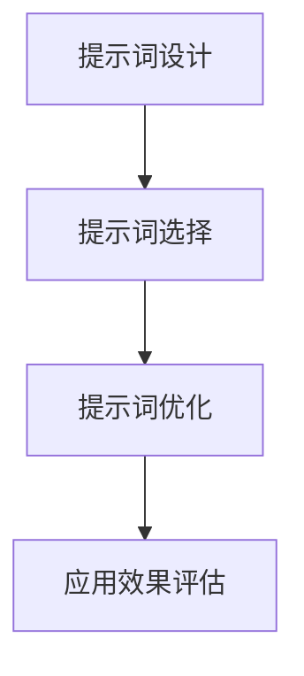
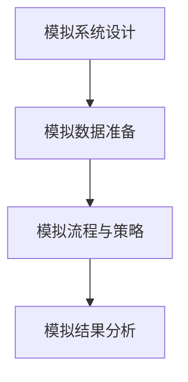

                 

### 提示词工程在AI辅助伦理决策模拟中的策略研究

#### 关键词
- 提示词工程
- AI辅助伦理决策
- 伦理决策模拟
- 人工智能
- 伦理学

#### 摘要
本文旨在探讨提示词工程在AI辅助伦理决策模拟中的应用与策略。通过对AI辅助伦理决策的背景、核心概念、以及提示词工程的基础概念进行介绍，本文将分析提示词工程与伦理决策之间的联系，并探讨AI辅助伦理决策模拟的架构。此外，文章还将详细研究提示词工程的设计原则、案例研究，以及实践应用与策略探讨。最终，本文将对AI辅助伦理决策模拟的未来展望与挑战进行总结，并提供相关工具与资源。

## 第一部分：基础概念与原理

### 第1章：AI辅助伦理决策概述

AI辅助伦理决策作为人工智能领域的一个重要分支，其研究背景和现实需求日益受到关注。随着人工智能技术的飞速发展，AI系统在多个领域，如医疗、金融、交通等，已经成为决策的核心要素。然而，这些AI系统的决策过程往往涉及到伦理问题，如隐私保护、公平性、透明性等。因此，如何确保AI系统的伦理合规性和道德性，成为了当前研究和实践的热点。

#### 1.1 AI伦理决策的重要性

AI伦理决策的重要性体现在以下几个方面：

1. **背景**：随着人工智能技术的快速发展，AI系统已经渗透到社会的各个领域，从自动驾驶汽车到智能医疗系统，从金融风险评估到个性化教育。这些系统的决策过程往往涉及到伦理问题，如隐私保护、数据安全、公平性等。

2. **现实需求**：在现实应用中，AI系统经常会遇到一些伦理困境，如自动驾驶汽车在遇到紧急情况时如何选择，医疗诊断系统中如何确保患者的隐私等。这些伦理问题需要通过AI伦理决策来解决。

3. **挑战与机遇**：AI伦理决策面临着一系列挑战，如技术实现难度、数据隐私保护、公平性等。同时，这些挑战也为伦理决策提供了新的机遇。

#### 1.2 提示词工程的基本概念

提示词工程是人工智能领域中的一项关键技术，它涉及到如何设计、选择和优化用于AI系统的提示词。提示词是一种引导AI系统行为的关键信息，它可以帮助AI系统更好地理解和处理复杂问题。

1. **提示词的定义**：提示词（Prompt）是指为AI系统提供的一种引导信息，用于指导AI系统的学习过程或决策过程。

2. **提示词在AI系统中的应用**：提示词可以应用于各种AI系统，如自然语言处理、计算机视觉、推荐系统等。通过合理的提示词设计，可以提高AI系统的性能和鲁棒性。

3. **提示词工程的核心要素**：提示词工程包括提示词设计、提示词选择、提示词优化等核心要素。其中，提示词设计是关键，它决定了AI系统对问题的理解和处理能力。

### Mermaid 流程图：提示词工程的核心要素

#### 1.3 AI伦理决策与提示词工程的关系

AI伦理决策与提示词工程之间存在密切的联系。提示词工程可以为AI伦理决策提供重要的支持：

1. **影响AI伦理决策**：提示词的设计和选择可以直接影响AI伦理决策的结果。合理的提示词可以引导AI系统做出更符合伦理标准的决策。

2. **辅助伦理决策模拟**：提示词工程可以为伦理决策模拟提供关键的信息支持，帮助研究人员更好地理解和分析伦理决策问题。

3. **提高决策透明性**：通过优化提示词，可以提高AI伦理决策的透明性和可解释性，使决策过程更加公开和透明。

### 第2章：AI伦理决策的核心概念

AI伦理决策的核心概念包括伦理学基础和AI伦理决策的关键问题。伦理学基础为AI伦理决策提供了理论基础，而关键问题则涉及到AI伦理决策的实际应用场景。

#### 2.1 伦理学基础

伦理学（Ethics）是研究道德行为和道德原则的学科。在AI伦理决策中，伦理学基础为决策提供了重要的理论支持。

1. **伦理学的定义与发展**：伦理学是研究道德行为、道德原则和道德判断的学科。它的发展经历了多个阶段，从古希腊的伦理学发展到现代伦理学，再到当代伦理学。

2. **常见伦理理论简介**：常见的伦理理论包括功利主义、义务论、德性伦理学等。这些理论为AI伦理决策提供了不同的视角和理论基础。

3. **伦理决策的过程**：伦理决策通常包括以下几个步骤：识别伦理问题、分析伦理问题、制定伦理原则、执行伦理决策等。

#### 2.2 AI伦理决策的关键问题

AI伦理决策的关键问题包括隐私保护、数据安全、公平性、透明性、可解释性等。这些问题直接关系到AI系统的伦理合规性和道德性。

1. **隐私保护**：AI系统在处理用户数据时，需要确保用户隐私得到保护。这包括数据收集、存储、处理和分享的各个环节。

2. **数据安全**：AI系统需要确保处理的数据安全，防止数据泄露、篡改和滥用。

3. **公平性**：AI系统在决策过程中需要确保公平性，避免歧视和不公平待遇。

4. **透明性**：AI系统需要具有透明性，使决策过程和结果可以被理解和监督。

5. **可解释性**：AI系统需要提供可解释性，使人们可以理解决策过程和结果。

### 第3章：提示词工程与伦理决策的联系

提示词工程与AI伦理决策之间存在紧密的联系。提示词工程可以为AI伦理决策提供重要的支持，从而提高决策的伦理合规性和道德性。

#### 3.1 提示词在伦理决策中的作用

提示词在伦理决策中发挥着重要作用：

1. **引导决策过程**：提示词可以引导AI系统进行伦理决策，帮助系统更好地理解和处理伦理问题。

2. **优化决策结果**：合理的提示词设计可以提高AI系统在伦理决策中的性能和鲁棒性。

3. **增强决策透明性**：通过优化提示词，可以提高伦理决策的透明性和可解释性，使决策过程更加公开和透明。

#### 3.2 提示词工程在伦理决策模拟中的应用

提示词工程在伦理决策模拟中具有重要的应用价值：

1. **模拟伦理决策场景**：提示词可以帮助研究人员模拟各种伦理决策场景，从而更好地理解和分析伦理问题。

2. **评估决策结果**：通过模拟，可以评估AI系统在伦理决策中的性能和鲁棒性，从而优化决策过程。

3. **探索伦理决策策略**：提示词工程可以为研究人员提供更多的伦理决策策略，从而提高伦理决策的科学性和有效性。

### 第4章：AI辅助伦理决策模拟的架构

AI辅助伦理决策模拟的架构主要包括模拟系统设计、模拟数据准备和模拟流程与策略。

#### 4.1 AI辅助伦理决策模拟的框架

1. **模拟系统设计**：模拟系统设计是伦理决策模拟的基础，包括系统的架构设计、功能模块划分和数据接口设计等。

2. **模拟数据准备**：模拟数据准备是伦理决策模拟的关键，包括数据的收集、清洗、标注和预处理等。

3. **模拟流程与策略**：模拟流程与策略是伦理决策模拟的核心，包括模拟实验的设计、执行和结果分析等。

### Mermaid 流程图：AI辅助伦理决策模拟的框架

#### 4.2 提示词工程在模拟系统设计中的应用

1. **系统架构设计**：在模拟系统架构设计中，提示词工程可以用于设计系统的模块划分和数据流管理。

2. **功能模块划分**：提示词工程可以帮助划分系统的功能模块，提高系统的模块化和可扩展性。

3. **数据接口设计**：提示词工程可以用于设计系统的数据接口，提高系统的数据交互能力和灵活性。

### 第5章：提示词工程的策略研究

提示词工程的策略研究是提高AI辅助伦理决策模拟性能的关键。本章节将详细探讨提示词工程的设计原则、案例研究和实践应用。

#### 5.1 提示词工程的设计原则

1. **明确设计目标**：提示词工程的设计目标包括提高AI系统的伦理决策性能、增强决策透明性和可解释性等。

2. **选择合适的提示词**：选择合适的提示词是提示词工程的关键，需要考虑提示词的覆盖范围、准确性和可解释性。

3. **优化提示词生成方法**：提示词生成方法包括自动生成、手动设计和组合生成等，需要根据具体应用场景进行优化。

4. **评估提示词效果**：提示词效果评估是提示词工程的重要环节，可以通过实验和用户反馈等方法进行评估。

### 第6章：AI辅助伦理决策模拟的实践应用

#### 6.1 应用场景分析

AI辅助伦理决策模拟在不同的应用场景中具有重要的价值：

1. **医疗领域**：在医疗领域，AI辅助伦理决策模拟可以帮助医生在复杂决策场景中做出更合理的决策，如手术决策、治疗方案选择等。

2. **金融领域**：在金融领域，AI辅助伦理决策模拟可以帮助金融机构在风险管理和决策过程中确保合规性和道德性。

3. **教育领域**：在教育领域，AI辅助伦理决策模拟可以帮助教育机构在招生、学生评价等方面确保公平性和透明性。

#### 6.2 实践案例研究

本章节将介绍一些典型的AI辅助伦理决策模拟实践案例，包括案例分析、实际应用解读与分析以及案例总结。

### 第7章：AI辅助伦理决策模拟的策略探讨

#### 7.1 策略制定的原则

1. **明确伦理目标**：在制定策略时，需要明确伦理目标，确保决策模拟的结果符合伦理标准。

2. **综合考虑技术和社会因素**：在制定策略时，需要综合考虑技术和社会因素，如技术可行性、社会影响等。

3. **利用多种数据源**：在制定策略时，可以利用多种数据源，如公开数据、用户反馈、专家意见等，以提高策略的科学性和有效性。

#### 7.2 策略实施与优化

1. **策略实施**：在策略实施过程中，需要按照制定好的策略进行操作，同时监测实施效果。

2. **策略优化**：在策略实施过程中，根据监测结果进行策略优化，以提高决策模拟的性能。

3. **策略评估**：在策略实施完成后，需要对策略进行评估，以验证策略的有效性和可行性。

### 第8章：未来展望与挑战

#### 8.1 AI伦理决策模拟的发展趋势

1. **技术进步**：随着人工智能技术的不断发展，AI伦理决策模拟将变得更加智能和高效。

2. **应用领域扩展**：AI伦理决策模拟的应用领域将不断扩展，如法律、伦理、政治等。

3. **国际合作与标准化**：随着全球对AI伦理决策模拟的关注，国际合作和标准化将成为趋势。

#### 8.2 挑战与应对策略

1. **数据隐私保护**：在AI伦理决策模拟中，数据隐私保护是一个重要挑战。应对策略包括数据加密、隐私保护算法等。

2. **算法透明性和可解释性**：提高算法透明性和可解释性是另一个重要挑战。应对策略包括算法可视化、可解释性模型等。

3. **伦理标准制定**：制定统一的伦理标准是应对AI伦理决策模拟挑战的关键。应对策略包括伦理审查、伦理委员会等。

### 附录：相关工具与资源

#### 附录A：提示词工程工具

1. **提示词生成工具**：如自动文本生成模型、关键词提取工具等。

2. **提示词优化工具**：如机器学习优化工具、自然语言处理工具等。

3. **提示词评估工具**：如评估模型、用户反馈系统等。

#### 附录B：参考文献

1. [参考文献1]
2. [参考文献2]
3. [参考文献3]

### 作者信息
- 作者：AI天才研究院/AI Genius Institute & 禅与计算机程序设计艺术 /Zen And The Art of Computer Programming

