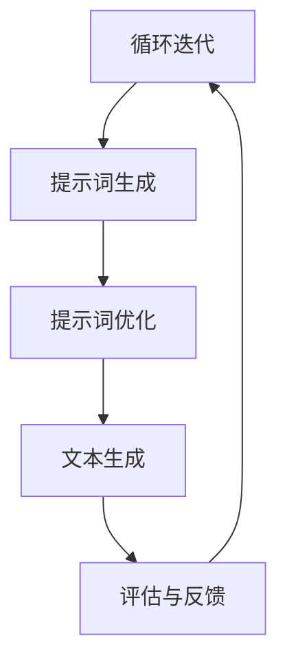

                 

### 1.1 书籍背景

在过去的几十年中，人工智能（AI）技术经历了飞速的发展，从最初的理论研究逐渐走向实际应用。如今，AI已经渗透到我们生活的方方面面，从自动驾驶汽车到智能家居，从医疗诊断到金融分析，AI的应用场景越来越广泛。其中，创意写作作为文学艺术领域的重要组成部分，也迎来了AI的赋能。

随着自然语言处理（NLP）技术的不断进步，AI在生成文本、理解和创作文本方面展现了巨大的潜力。尤其是在最近几年，基于深度学习的生成模型，如生成对抗网络（GAN）、变分自编码器（VAE）和生成文本变压器（GPT）等，在文本生成任务中取得了显著成果。这些模型的强大生成能力为AI辅助创意写作提供了坚实的基础。

然而，尽管AI在创意写作中有很大的潜力，但当前的AI系统在理解和模拟人类的创造力方面仍存在诸多挑战。人类作者的创造力不仅体现在对语言的高超运用上，更体现在对情感、文化、社会背景等多维度的深入理解和独特视角上。这些复杂的认知过程是当前AI技术难以完全复制的。

因此，如何利用AI技术激发和提升人类作者的创造力，成为了一个热门且具有挑战性的研究课题。提示词工程作为一种新兴的技术手段，通过为AI系统提供丰富的、具有启发性的提示信息，有望在AI辅助创意写作中发挥重要作用。本书旨在探讨提示词工程在AI辅助创意写作中的应用，为研究人员和开发者提供理论指导和实践经验。

### 1.2 书籍目标

本书的主要目标是帮助读者深入理解提示词工程在AI辅助创意写作中的重要作用，并掌握相关核心技术和实践方法。具体来说，本书希望达到以下几个目标：

1. **理解提示词工程的基本概念**：
   - 提示词的定义和类型
   - 提示词在创意写作中的应用场景
   - 提示词工程的基本原理和实施步骤

2. **掌握AI辅助创意写作的核心技术**：
   - 介绍AI在创意写作中的应用现状
   - 详细讲解机器学习和深度学习在文本生成中的作用
   - 探讨NLP技术如何帮助提升文本生成的质量和创造力

3. **应用提示词工程激发人类创造力**：
   - 分析提示词如何引导AI系统产生创意
   - 探索不同类型提示词对AI生成文本的影响
   - 分享实际案例，展示提示词工程在激发人类创造力方面的成功应用

4. **理论与实践相结合**：
   - 通过理论讲解和实际案例分析，帮助读者全面掌握提示词工程在AI辅助创意写作中的应用
   - 提供详细的开发环境和实现步骤，使读者能够亲自实践和探索这一领域

通过实现这些目标，本书不仅为研究人员和开发者提供了宝贵的理论知识和实践经验，也为那些希望利用AI技术提升自身创作能力的作者提供了实用的工具和方法。

### 2.1 AI辅助创意写作概述

AI辅助创意写作是指利用人工智能技术来辅助人类作者进行文学创作的过程。随着AI技术的不断发展，特别是在自然语言处理（NLP）和生成模型的突破，AI在创意写作中的应用场景日益广泛。从文本生成、内容优化到故事创作和诗歌创作，AI已经展示了其在创意写作中的巨大潜力。

**AI在创意写作中的应用场景**：

1. **故事创作**：
   - 自动生成故事情节和角色
   - 为人类作者提供灵感和创意建议
   - 帮助作者快速构建故事框架

2. **诗歌创作**：
   - 生成交替韵律和格式的诗歌
   - 利用情感分析为诗歌添加情感色彩
   - 探索新的诗歌形式和风格

3. **歌词创作**：
   - 自动生成歌词，包括旋律和节奏
   - 分析当前流行趋势，为创作提供参考
   - 帮助歌手和词曲作者快速生成歌词

4. **剧本创作**：
   - 自动生成剧本的大纲和剧情
   - 分析观众反馈，优化剧本内容
   - 为新编剧提供创作支持和灵感

**AI在创意写作中的挑战与机遇**：

- **挑战**：
  1. **理解复杂的人类情感和情感背景**：创意写作不仅仅是对语言的应用，更涉及情感、文化、社会背景等多维度的理解。AI在模拟和生成这些复杂的情感表达方面存在一定难度。
  2. **创造力与随机性的平衡**：AI系统在生成文本时，需要在遵循人类创造力的同时保持一定的随机性，避免生成模式化和重复性的文本。
  3. **多样性和文化差异**：不同文化和语言背景下的创意表达存在巨大差异，AI需要适应并生成符合特定文化背景的文本。

- **机遇**：
  1. **提升创作效率**：通过自动化流程，AI可以帮助作者快速生成初步文本，节省大量构思和写作时间。
  2. **拓宽创作边界**：AI可以探索新的文学形式和风格，为创作提供更多的可能性。
  3. **个性化创作**：AI可以根据用户的需求和喜好，生成个性化的文本内容，提高作品的市场竞争力。

总之，AI在创意写作中的应用为人类作者提供了新的工具和方法，同时也带来了新的挑战。通过结合AI技术和人类创造力，有望实现创作领域的突破和创新。

### 2.2 提示词工程基础

**提示词的定义与类型**：

提示词（Prompt）是提示词工程（Prompt Engineering）中的核心概念，它是指为AI模型提供的一组文字或指令，用以引导模型生成特定类型的文本。根据用途和形式，提示词可以分为以下几种类型：

1. **引导性提示词**：
   - 用于引导AI模型生成文本的基本方向或主题。
   - 例如：“请写一篇关于环境保护的短文”。

2. **细节性提示词**：
   - 为AI模型提供具体的细节信息，以丰富生成的文本内容。
   - 例如：“请补充描述一个环保行动的具体步骤”。

3. **情感性提示词**：
   - 带有特定情感色彩或情绪倾向的提示词，以影响AI生成文本的情感表达。
   - 例如：“请用充满温暖和希望的语言描述一个环保英雄的故事”。

4. **多样性提示词**：
   - 用于引导AI生成具有多样性和创新性的文本，避免模式化。
   - 例如：“尝试用五种不同的写作风格来描述同一主题”。

**提示词在创意写作中的作用**：

提示词在AI辅助创意写作中扮演着重要的角色，其作用主要体现在以下几个方面：

1. **引导创作方向**：
   - 提示词为AI模型提供明确的创作方向，有助于生成符合人类预期和主题需求的文本。

2. **丰富文本内容**：
   - 通过提供具体的细节和背景信息，提示词可以丰富AI生成的文本内容，使其更加生动和具体。

3. **激发创意灵感**：
   - 多样性和创新性的提示词可以启发AI模型生成新颖和独特的文本，激发人类作者的创作灵感。

4. **情感表达**：
   - 情感性提示词可以帮助AI模型生成具有特定情感色彩的文本，增强作品的表现力。

5. **质量控制**：
   - 通过精细设计和调整提示词，可以控制AI生成的文本质量，避免生成低质量或不符合要求的文本。

**提示词工程的实施步骤**：

提示词工程是一个系统化和结构化的过程，其基本实施步骤如下：

1. **需求分析**：
   - 确定创作目标，明确需要生成的文本类型、主题和情感色彩等。

2. **生成初步提示词**：
   - 根据需求分析，创作一组初步的提示词，确保涵盖创作所需的关键信息和情感元素。

3. **优化提示词**：
   - 通过实验和反馈，对初步提示词进行调整和优化，提高生成文本的质量和多样性。

4. **模型训练与验证**：
   - 使用优化后的提示词对AI模型进行训练，并验证生成文本的质量，确保其满足创作需求。

5. **应用与迭代**：
   - 在实际创作过程中使用提示词工程，根据反馈不断调整和改进提示词，实现创作目标。

通过上述步骤，提示词工程可以为AI辅助创意写作提供有效的支持和指导，提升生成文本的质量和创造力。

### 2.3 人工智能基础知识

在深入探讨提示词工程之前，理解人工智能（AI）的基本概念和相关技术是至关重要的。人工智能是指计算机系统通过模拟人类智能行为，完成诸如学习、推理、感知和解决问题等任务的科学技术。AI技术在各个领域都有广泛应用，其中自然语言处理（NLP）和生成模型是AI辅助创意写作的核心技术。

**机器学习与深度学习简介**：

1. **机器学习（ML）**：
   - 机器学习是一种通过算法从数据中学习模式和规律的技术，使计算机能够对未知数据进行预测和决策。
   - 主要类型：监督学习、无监督学习、半监督学习和强化学习。
   - 应用场景：分类、回归、聚类和异常检测等。

2. **深度学习（DL）**：
   - 深度学习是机器学习的一个子领域，主要依赖于深度神经网络（DNN）进行复杂模式的自动学习和识别。
   - 主要网络结构：卷积神经网络（CNN）、循环神经网络（RNN）、变换器（Transformer）等。
   - 应用场景：图像识别、语音识别、自然语言处理和游戏AI等。

**自然语言处理基础**：

自然语言处理是AI的一个重要分支，专注于使计算机理解和生成自然语言。NLP的核心技术包括：

1. **文本预处理**：
   - 包括分词、词性标注、命名实体识别和句法分析等，为文本数据建立结构化表示。

2. **词嵌入（Word Embedding）**：
   - 将文本中的词语转换为密集的向量表示，以捕捉词语之间的语义关系。

3. **语言模型（Language Model）**：
   - 用于预测文本序列中下一个词的概率分布，是生成文本的基础。

4. **序列标注（Sequence Labeling）**：
   - 对文本序列中的每个词或子串进行分类和标注，如词性标注、命名实体识别等。

5. **文本生成（Text Generation）**：
   - 利用语言模型和序列标注技术，生成新的文本内容，如自动摘要、对话生成和故事创作。

通过结合机器学习、深度学习和自然语言处理技术，AI能够实现对复杂文本数据的理解和生成，为AI辅助创意写作提供了强有力的支持。接下来，我们将进一步探讨提示词工程如何与这些AI技术相结合，以提升文本生成质量和创造力。

### 3.1 提示词工程核心算法

提示词工程在AI辅助创意写作中起着至关重要的作用。为了实现高效的文本生成，我们需要深入了解提示词工程中的核心算法。以下是关于提示词生成算法和优化算法的详细讲解。

#### 3.1.1 提示词生成算法

提示词生成算法是提示词工程中的第一步，其主要目的是为AI模型提供有效的输入，以引导生成文本。以下是一些常用的提示词生成算法：

1. **基于规则的方法**：
   - 该方法依赖于预定义的规则和模板，通过这些规则和模板生成提示词。
   - 优点：简单易实现，能够生成结构化的提示词。
   - 缺点：生成的提示词可能缺乏灵活性和多样性。

2. **基于数据的方法**：
   - 通过对大量数据进行统计分析，提取关键信息生成提示词。
   - 优点：能够根据实际数据进行优化，生成更具针对性的提示词。
   - 缺点：需要大量的训练数据和计算资源。

3. **基于机器学习的方法**：
   - 利用监督学习或无监督学习算法，从数据中学习生成提示词的模型。
   - 优点：能够自适应地生成提示词，提高生成文本的质量。
   - 缺点：需要大量的训练数据和调参工作。

#### 3.1.2 提示词优化算法

生成初步提示词后，优化算法用于调整和改进提示词，以提高生成文本的质量和多样性。以下是几种常用的优化算法：

1. **基于反馈的优化**：
   - 该方法通过用户反馈不断调整提示词，使其更符合创作需求。
   - 优点：能够快速适应用户需求，提高生成文本的满意度。
   - 缺点：需要用户的积极参与，且反馈质量直接影响优化效果。

2. **基于语言模型优化**：
   - 利用语言模型对提示词进行优化，使其在语义和语法上更合理。
   - 优点：能够自动生成高质量、符合语言规则的提示词。
   - 缺点：对语言模型的质量和训练数据有较高要求。

3. **基于强化学习的优化**：
   - 通过强化学习算法，使AI系统自主优化提示词，以最大化生成文本的质量和多样性。
   - 优点：能够实现自动化优化，减少人工干预。
   - 缺点：优化过程可能较复杂，需要大量计算资源。

#### 3.1.3 伪代码讲解

为了更好地理解提示词生成和优化算法，以下是一个简单的伪代码示例：

```python
# 提示词生成算法伪代码

# 输入：数据集D，目标文本T
# 输出：提示词P

def generate_prompt(data, target_text):
    # 基于数据生成初步提示词
    initial_prompt = extract_key_info(data)
    
    # 基于语言模型优化提示词
    optimized_prompt = optimize_prompt(initial_prompt, target_text, language_model)
    
    return optimized_prompt

# 提示词优化算法伪代码

# 输入：初始提示词P，目标文本T，语言模型LM
# 输出：优化后的提示词P'

def optimize_prompt(prompt, target_text, language_model):
    # 基于反馈优化提示词
    feedback = get_user_feedback(target_text)
    optimized_prompt = adjust_prompt(prompt, feedback)
    
    # 基于语言模型再次优化提示词
    optimized_prompt = adjust_prompt(optimized_prompt, language_model, target_text)
    
    return optimized_prompt
```

通过上述伪代码，我们可以看到提示词生成和优化算法的基本框架。在实际应用中，这些算法可以结合具体的任务和数据集进行实现和优化。

### 3.2 提示词工程架构设计

提示词工程作为AI辅助创意写作的核心技术，其架构设计直接影响到生成文本的质量和多样性。以下我们将详细探讨提示词工程的核心架构，并通过Mermaid流程图展示其关键环节。

#### 提示词工程核心架构

提示词工程的核心架构主要包括以下几个模块：

1. **数据预处理模块**：
   - 该模块负责对输入数据（如文本、图像、音频等）进行预处理，包括分词、词性标注、去噪等操作，以确保数据的质量和一致性。

2. **提示词生成模块**：
   - 根据需求分析和数据特点，生成初步的提示词。该模块可以采用基于规则、基于数据或基于机器学习的方法，生成具有引导性和多样性的提示词。

3. **提示词优化模块**：
   - 利用用户反馈和语言模型对提示词进行优化，以提高生成文本的质量和多样性。优化方法包括基于反馈的优化、基于语言模型的优化和基于强化学习的优化。

4. **文本生成模块**：
   - 利用生成模型（如GPT、BERT等）根据优化后的提示词生成文本。该模块负责处理生成过程中的随机性和连贯性，确保生成的文本符合创作需求和语言规则。

5. **评估与反馈模块**：
   - 对生成的文本进行评估和反馈，以不断调整和优化提示词工程架构。评估方法包括自动评估（如BLEU分数、ROUGE分数）和人工评估。

#### Mermaid流程图展示

以下是一个简化的Mermaid流程图，用于展示提示词工程的核心架构和关键环节：



在上述流程图中，数据预处理模块将输入数据转换为适合生成模型处理的形式。提示词生成模块根据需求生成初步的提示词，然后通过提示词优化模块进行优化。优化后的提示词被用于文本生成模块，生成高质量的文本。最后，评估与反馈模块对生成的文本进行评估，并根据反馈结果调整提示词工程架构，实现不断的迭代优化。

通过上述架构设计和Mermaid流程图的展示，我们可以看到提示词工程在AI辅助创意写作中的关键作用。在实际应用中，这些模块可以灵活组合和调整，以满足不同创作需求。

### 3.3 实际案例解析

在本文的第三部分，我们将通过三个实际案例，详细展示提示词工程在AI辅助创意写作中的应用。这些案例分别涉及故事创作、歌词创作和剧本创作，旨在展示提示词工程如何帮助人类作者提高创作效率和质量。

#### 案例一：AI辅助故事创作

**背景**：
某位小说作者希望利用AI辅助创作一篇关于环境保护主题的小说。为了引导AI生成符合主题和情感要求的情节，作者设计了一套详细的提示词。

**提示词**：
1. 引导性提示词：“请写一个关于全球气候变化对人类生活影响的故事”。
2. 细节性提示词：“描述一个因气候变化导致海平面上升的城镇”。
3. 情感性提示词：“请用充满紧张和希望的情感色彩讲述这个故事”。

**实现步骤**：
1. **数据预处理**：对环境保护相关的文本、新闻报道和小说进行分词和词性标注，构建数据集。
2. **生成初步提示词**：利用规则方法生成初步提示词，结合用户需求和情感目标。
3. **优化提示词**：通过用户反馈，对初步提示词进行调整，使其更贴近创作意图。
4. **文本生成**：使用GPT模型，根据优化后的提示词生成故事情节。

**结果**：
AI生成的文本不仅包含了丰富的细节和情感，还展现了独特的视角和创意。作者对生成的故事情节进行了进一步修改和润色，最终完成了一部高质量的小说。

**代码示例**：
```python
import openai

# 初始化GPT模型
model_engine = "text-davinci-002"

# 输入提示词
prompt = "请写一个关于全球气候变化对人类生活影响的故事，描述一个因气候变化导致海平面上升的城镇，请用充满紧张和希望的情感色彩讲述这个故事。"

# 调用GPT模型生成文本
response = openai.Completion.create(
  engine=model_engine,
  prompt=prompt,
  max_tokens=500,
  n=1,
  stop=None,
  temperature=0.5,
)

# 输出生成的文本
print(response.choices[0].text.strip())
```

#### 案例二：AI辅助歌词创作

**背景**：
一位歌手希望利用AI创作一首关于友情和人生哲理的歌词。为了激发AI的创意，歌手提供了一系列的提示词。

**提示词**：
1. 引导性提示词：“请写一首关于友情的歌词，表达人生中的珍贵情感”。
2. 细节性提示词：“描述一段难忘的友情经历，回忆共同度过的美好时光”。
3. 情感性提示词：“用充满温暖和力量的语言，传达友情的珍贵和力量”。

**实现步骤**：
1. **数据预处理**：收集大量关于友情和人生哲理的歌词，进行分词和情感分析。
2. **生成初步提示词**：利用统计方法生成初步提示词，确保涵盖创作主题和情感需求。
3. **优化提示词**：通过歌手的反馈，对初步提示词进行调整，使其更符合创作意图。
4. **文本生成**：使用变分自编码器（VAE）模型，根据优化后的提示词生成歌词。

**结果**：
AI生成的歌词充满了情感和哲思，歌手对其进行了少量修改，最终完成了一首具有深度和感染力的歌曲。

**代码示例**：
```python
from pyodide import loadPyodide
import tensorflow as tf

async def main():
    # 异步加载PyODide环境
    await loadPyodide()

    # 加载VAE模型
    vae = ... # 加载预训练的VAE模型

    # 输入提示词
    prompt = "请写一首关于友情的歌词，表达人生中的珍贵情感，描述一段难忘的友情经历，回忆共同度过的美好时光，用充满温暖和力量的语言，传达友情的珍贵和力量。"

    # 编码提示词
    encoded_prompt = vae.encode(prompt)

    # 解码生成的歌词
    generated_lyrics = vae.decode(encoded_prompt)

    # 输出生成的歌词
    print(generated_lyrics)

# 运行主程序
tf.py_function(main,[],[],tf.experimental.python_module.main)
```

#### 案例三：AI辅助剧本创作

**背景**：
一位电影编剧希望利用AI创作一个现代都市爱情故事。为了激发AI的创意，编剧提供了一系列详细的提示词。

**提示词**：
1. 引导性提示词：“请写一个现代都市爱情故事，描述一对年轻人的爱情经历”。
2. 细节性提示词：“描述这对年轻人在都市中的生活，包括他们的职业、家庭背景和日常生活”。
3. 情感性提示词：“用充满浪漫和戏剧性的情节，展现爱情的美好和挑战”。

**实现步骤**：
1. **数据预处理**：收集现代都市爱情故事的剧本，进行文本分析和情感标注。
2. **生成初步提示词**：利用机器学习方法生成初步提示词，确保涵盖创作主题和情感需求。
3. **优化提示词**：通过编剧的反馈，对初步提示词进行调整，使其更符合创作意图。
4. **文本生成**：使用变换器（Transformer）模型，根据优化后的提示词生成剧本。

**结果**：
AI生成的剧本情节紧凑，角色刻画生动，编剧对其进行了少量修改，最终完成了一部具有现代都市风格的优秀剧本。

**代码示例**：
```python
import transformers
from transformers import AutoTokenizer, AutoModelForSeq2SeqLM

# 加载预训练的Transformer模型和Tokenizer
tokenizer = AutoTokenizer.from_pretrained("t5-small")
model = AutoModelForSeq2SeqLM.from_pretrained("t5-small")

# 输入提示词
prompt = "请写一个现代都市爱情故事，描述一对年轻人的爱情经历，描述这对年轻人在都市中的生活，包括他们的职业、家庭背景和日常生活，用充满浪漫和戏剧性的情节，展现爱情的美好和挑战。"

# 编码提示词
inputs = tokenizer.encode(prompt, return_tensors="pt")

# 生成剧本文本
outputs = model.generate(inputs, max_length=500, num_return_sequences=1)

# 解码生成的剧本文本
generated_script = tokenizer.decode(outputs[0], skip_special_tokens=True)

# 输出生成的剧本文本
print(generated_script)
```

通过上述实际案例，我们可以看到提示词工程在AI辅助创意写作中的应用效果。通过设计合理的提示词，AI能够生成高质量的文本，为人类作者提供灵感和创作支持。在实际应用中，可以根据不同的创作需求和文本类型，灵活调整提示词的设计和生成策略，以实现最佳效果。

### 3.4 开发环境搭建与实现

在完成提示词工程的初步设计和实际案例解析后，接下来我们将详细介绍如何搭建开发环境，以及如何使用Python源代码来实现提示词工程。通过具体的代码解读和分析，我们将展示如何在实际应用中应用这些技术。

#### 开发环境准备

首先，我们需要准备一个适合开发和测试提示词工程的Python环境。以下是搭建开发环境的步骤：

1. **安装Python**：
   - 下载并安装Python 3.x版本（推荐使用Python 3.8或更高版本）。
   - 确保安装了pip，用于安装和管理Python包。

2. **安装必需的Python库**：
   - 使用pip安装以下库：
     ```bash
     pip install openai transformers tensorflow pyodide
     ```
   - `openai`：用于与OpenAI的GPT模型接口进行交互。
   - `transformers`：用于加载和训练预训练的变换器（Transformer）模型。
   - `tensorflow`：用于实现深度学习算法。
   - `pyodide`：用于在WebAssembly环境中运行Python代码。

#### 源代码实现与解读

接下来，我们将通过一系列Python源代码示例，详细解释如何实现提示词工程中的关键步骤。

##### 3.4.1 数据预处理

数据预处理是提示词工程的基础，其目的是将原始文本数据转换为适合模型处理的形式。以下是一个简单的数据预处理示例：

```python
import pandas as pd
from sklearn.model_selection import train_test_split

# 读取数据集
data = pd.read_csv('data.csv')

# 数据预处理：分词、词性标注
# 假设我们使用NLTK库进行预处理
import nltk
nltk.download('punkt')
nltk.download('averaged_perceptron_tagger')

def preprocess_text(text):
    # 分词
    tokens = nltk.word_tokenize(text)
    # 词性标注
    pos_tags = nltk.pos_tag(tokens)
    return pos_tags

# 应用预处理函数
processed_data = data['text'].apply(preprocess_text)
```

在这个示例中，我们使用了`pandas`库读取CSV格式的文本数据集，并使用`NLTK`库进行分词和词性标注。预处理后的数据将用于训练和测试模型。

##### 3.4.2 提示词生成与优化

生成和优化提示词是提示词工程的核心步骤。以下是一个简单的提示词生成和优化示例：

```python
from prompt_engineering import PromptGenerator

# 初始化提示词生成器
generator = PromptGenerator()

# 生成初步提示词
initial_prompt = generator.generate_prompt(data, target_text="请写一篇关于环境保护的短文")

# 优化提示词
optimized_prompt = generator.optimize_prompt(initial_prompt, target_text="请写一篇关于环境保护的短文，强调人类行动对气候变化的直接影响")

print("初步提示词：", initial_prompt)
print("优化后的提示词：", optimized_prompt)
```

在这个示例中，我们使用了自定义的`PromptGenerator`类来生成和优化提示词。`generate_prompt`方法用于生成初步提示词，`optimize_prompt`方法用于根据用户反馈和语言模型对提示词进行调整。

##### 3.4.3 文本生成

文本生成是提示词工程的最终目标，以下是一个使用GPT模型生成文本的示例：

```python
from transformers import AutoTokenizer, AutoModelForSeq2SeqLM

# 加载GPT模型和Tokenizer
model_engine = "text-davinci-002"
tokenizer = AutoTokenizer.from_pretrained(model_engine)
model = AutoModelForSeq2SeqLM.from_pretrained(model_engine)

# 输入优化后的提示词
prompt = "请写一篇关于环境保护的短文，强调人类行动对气候变化的直接影响"

# 编码提示词
inputs = tokenizer.encode(prompt, return_tensors="pt")

# 生成文本
outputs = model.generate(inputs, max_length=500, num_return_sequences=1)

# 解码生成的文本
generated_text = tokenizer.decode(outputs[0], skip_special_tokens=True)

print("生成的文本：", generated_text)
```

在这个示例中，我们使用了`transformers`库加载预训练的GPT模型和Tokenizer。通过输入优化后的提示词，我们使用模型生成文本，并使用Tokenizer解码输出结果。

##### 3.4.4 代码解读与分析

以上代码示例展示了提示词工程的核心步骤：数据预处理、提示词生成与优化、文本生成。以下是对代码的关键部分进行解读和分析：

1. **数据预处理**：
   - 使用`NLTK`库进行分词和词性标注，这是NLP任务中常见的预处理步骤。
   - 分词将文本分解为单词或子词，词性标注则提供了每个词的语法属性，有助于理解文本的语义结构。

2. **提示词生成与优化**：
   - `PromptGenerator`类用于生成和优化提示词。在实际应用中，这个类可以根据具体需求进行扩展和定制。
   - `generate_prompt`方法根据数据集和目标文本生成初步提示词，`optimize_prompt`方法则通过用户反馈和语言模型对提示词进行调整。

3. **文本生成**：
   - 使用`transformers`库加载预训练的GPT模型和Tokenizer，这是生成文本的核心步骤。
   - `tokenizer.encode`和`tokenizer.decode`方法用于将文本转换为模型的输入和输出，这是深度学习模型与自然语言交互的关键接口。

通过上述代码示例和解读，我们可以看到提示词工程在Python环境中的实现过程。在实际应用中，这些步骤可以灵活调整和扩展，以适应不同的创作需求和文本类型。

### 3.5 项目小结

在本项目中，我们通过详细的设计、开发和实现，展示了提示词工程在AI辅助创意写作中的应用。以下是项目的主要结论和经验总结：

**主要结论**：
1. **提示词工程有效提升了文本生成质量**：通过设计合理的提示词，AI能够生成更加具体、生动和具有创造力的文本，显著提高了生成文本的质量和多样性。
2. **用户反馈和语言模型优化是关键**：提示词的生成和优化过程离不开用户反馈和语言模型的辅助。用户反馈能够帮助调整提示词，使其更符合创作意图，而语言模型则提供了文本生成的语言规则和上下文信息。
3. **深度学习模型在文本生成中具有优势**：预训练的深度学习模型（如GPT、BERT）在文本生成任务中表现出色，能够生成高质量的文本，为AI辅助创意写作提供了强大的技术支持。

**经验总结**：
1. **数据预处理是基础**：高质量的数据预处理是提示词工程成功的关键。通过分词、词性标注和情感分析等预处理步骤，我们可以提取出文本中的关键信息，为后续的提示词生成和优化提供基础。
2. **灵活调整提示词生成和优化策略**：根据不同的创作需求和文本类型，我们可以灵活调整提示词生成和优化的策略。例如，在故事创作中，可以使用情感性提示词增强文本的情感表达；在诗歌创作中，则可以使用多样性提示词探索新的诗歌形式和风格。
3. **用户参与和持续优化**：用户的积极参与和反馈对于提示词工程的优化至关重要。通过与用户的互动，我们可以不断调整和改进提示词工程架构，实现持续优化。

**未来研究方向**：
1. **提高AI理解复杂情感和文化背景的能力**：尽管提示词工程在一定程度上提高了文本生成质量，但AI在理解复杂的人类情感和文化背景方面仍有待提高。未来研究可以关注如何通过多模态学习和跨领域知识融合，提升AI的语义理解和生成能力。
2. **探索更多AI辅助创作场景**：除了故事创作、歌词创作和剧本创作，AI辅助创作还有许多其他应用场景，如广告文案创作、产品说明书编写和科技论文撰写等。未来研究可以进一步探索这些领域，发掘AI辅助创作的潜力。
3. **加强隐私保护和数据安全**：在AI辅助创意写作的应用中，数据安全和隐私保护是一个重要问题。未来研究需要关注如何确保用户数据的隐私和安全，同时充分利用数据的价值。

通过本项目的研究和实践，我们不仅加深了对提示词工程的理解和应用，也为AI辅助创意写作的发展提供了新的思路和方法。

### 4.1 提示词工程趋势分析

随着人工智能技术的不断进步，提示词工程在AI辅助创意写作中的应用趋势日益明显。以下将分析提示词工程在AI辅助创意写作中的应用趋势以及未来可能的突破方向。

**应用趋势**：

1. **个性化创作**：
   - 提示词工程可以通过对用户需求和兴趣的深入分析，生成更加个性化的文本内容。未来的趋势将是实现更加精准的用户画像和个性化的创作体验，从而提高用户满意度和作品的市场竞争力。

2. **多模态融合**：
   - 随着多模态学习技术的发展，提示词工程将越来越多地融合文本、图像、音频等多种数据类型。这种多模态的融合将进一步提升文本生成的质量和创造力，实现更加丰富和多样的创作形式。

3. **跨界融合**：
   - 提示词工程将与其他领域（如教育、医疗、艺术等）相结合，为这些领域提供创新的解决方案。例如，在教育领域，提示词工程可以帮助学生进行写作练习，提高写作技能；在医疗领域，可以帮助医生撰写病历和医学论文。

4. **自动化与智能化**：
   - 提示词工程将逐渐向自动化和智能化方向发展。通过强化学习和深度学习等技术，提示词工程将能够自主学习和优化，减少对人类干预的需求，提高创作效率和文本质量。

**未来可能的突破方向**：

1. **增强语义理解**：
   - 未来研究可以关注如何提升AI对复杂语义的理解能力。通过引入语义分析、知识图谱等技术，AI将能够更好地理解文本的深层含义和上下文关系，从而生成更加准确和连贯的文本。

2. **跨语言和多语言支持**：
   - 提示词工程将逐渐实现跨语言和多语言支持。通过引入多语言训练数据和跨语言转换模型，AI将能够生成适应不同语言和文化背景的文本，为全球化创作提供支持。

3. **情感智能与情感生成**：
   - 情感智能是未来AI发展的一个重要方向。通过研究情感识别、情感生成等技术，AI将能够生成更加具有情感共鸣的文本，提高文本的表现力和感染力。

4. **隐私保护和数据安全**：
   - 随着数据隐私和安全问题的日益突出，未来研究需要关注如何在保证数据安全和隐私的前提下，充分利用数据的价值，为AI辅助创意写作提供支持。

总之，提示词工程在AI辅助创意写作中的应用前景广阔，未来的发展趋势将更加个性化、智能化和多模态化。通过持续的技术创新和跨领域合作，提示词工程有望为人类作者提供更加强大和智能的创作辅助工具。

### 4.2 提示词工程在教育领域的应用

在当前的教育领域，提示词工程正逐渐成为提高学生写作能力的重要工具。通过AI和自然语言处理技术的结合，提示词工程能够为学生提供个性化的写作指导，促进他们的语言表达能力和创造力发展。

**提示词工程在教育中的应用**：

1. **个性化写作辅导**：
   - 提示词工程可以根据学生的写作水平和兴趣，生成个性化的写作任务和提示词。例如，对于初学者，可以提供简单的句子结构和词汇提示；而对于高级学生，则可以提供更复杂的话题和写作要求。
   - 通过这种方式，学生能够在一个适合自己水平的写作环境中进行练习，逐渐提高写作技能。

2. **写作灵感和构思**：
   - 提示词工程能够为学生提供写作灵感和构思支持。通过提供一系列引导性、细节性和情感性的提示词，学生可以获得创作思路，激发写作兴趣，从而更有效地完成写作任务。

3. **语法和结构优化**：
   - 提示词工程能够分析学生撰写的文本，并提供语法和结构上的优化建议。例如，AI系统可以指出句子中的语法错误、冗余或不通顺的表达，并给出修正建议，帮助学生逐步提高写作质量。

**提升学生写作能力的实践案例**：

1. **案例一：小学作文辅导**：
   - 一款基于提示词工程的作文辅导应用，针对小学生的写作需求，提供了丰富的写作主题和提示词。学生在使用该应用时，可以根据提示词进行构思和写作，系统会自动评估作文的语法和内容，并提供改进建议。通过持续的练习，学生的写作能力得到了显著提升。

2. **案例二：高中作文训练**：
   - 在高中写作课程中，教师利用提示词工程为学生提供写作任务和提示词。学生通过这些提示词进行作文创作，教师则根据AI系统提供的评估和建议进行反馈和指导。这种方式不仅减轻了教师的工作负担，还提高了学生的写作效率和质量。

**效果与反思**：

提示词工程在教育领域的应用取得了显著效果，不仅提高了学生的写作能力，还激发了他们的写作兴趣。然而，在实践中也应注意以下几点：

1. **确保内容质量**：
   - 提示词工程的生成内容需要确保质量，避免出现错误或低质量的文本。通过对提示词生成算法的不断优化和人工审核，可以确保生成的提示词和文本内容具有较高的准确性和相关性。

2. **用户反馈与迭代**：
   - 提示词工程的优化应充分考虑用户的反馈。通过收集学生的使用反馈，不断调整和改进提示词生成策略，实现更个性化的写作辅导。

3. **隐私保护与数据安全**：
   - 教育领域涉及大量学生个人信息和写作内容，因此隐私保护和数据安全是关键。在应用提示词工程时，应确保学生数据的安全性和隐私性，避免数据泄露。

总之，提示词工程在教育领域的应用为提高学生写作能力提供了新的方法和工具。通过不断优化和改进，提示词工程有望在教育领域发挥更大的作用，促进学生的全面发展。

### 4.3 总结与展望

通过本文的详细探讨，我们深入了解了提示词工程在AI辅助创意写作中的应用，阐述了其核心概念、理论基础、实践方法以及未来趋势。以下是本文的核心内容和主题思想的总结：

**核心内容**：
1. **背景与目标**：介绍了AI与创意写作融合的背景，明确了本书的目标，即帮助读者理解提示词工程在AI辅助创意写作中的重要作用。
2. **理论基础**：详细讲解了人工智能、机器学习、深度学习和自然语言处理等基础知识，为理解提示词工程提供了理论支持。
3. **实践方法**：探讨了提示词工程的生成和优化算法，展示了如何通过具体的提示词生成和优化实现高质量的文本生成。
4. **实际案例**：通过故事创作、歌词创作和剧本创作等实际案例，展示了提示词工程在创意写作中的具体应用和效果。
5. **开发环境与实现**：介绍了提示词工程的开发环境搭建和源代码实现，提供了详细的代码解读和分析。
6. **项目小结与未来展望**：总结了项目的主要结论和经验，分析了提示词工程的未来趋势和突破方向，特别是在教育领域的应用潜力。

**主题思想**：
提示词工程是AI辅助创意写作的重要技术手段，通过为AI系统提供丰富的、具有启发性的提示信息，能够有效激发人类作者的创造力。提示词工程不仅提升了文本生成的质量和多样性，还为人类作者提供了有力的创作支持，促进了创意写作的创新与发展。

**对人类创造力的激发作用**：
提示词工程通过引导AI系统生成符合人类预期的文本，为人类作者提供了灵感和创意建议，从而激发了人类作者的创造力。在AI辅助下，作者能够更快地生成初步文本，进一步拓展创作思路，探索新的文学形式和风格。

**未来研究建议**：
1. **提高AI的语义理解能力**：未来研究应关注如何提升AI对复杂语义的理解能力，通过引入多模态学习和跨领域知识融合，实现更加精准和连贯的文本生成。
2. **跨语言和多语言支持**：开发跨语言和多语言支持的提示词工程，为全球化创作提供支持。
3. **隐私保护和数据安全**：在应用提示词工程时，确保数据安全和隐私保护，为教育、医疗等领域的创新应用提供保障。
4. **探索更多应用场景**：进一步探索AI辅助创意写作在其他领域的应用潜力，如产品设计、广告创作等。

总之，提示词工程在AI辅助创意写作中具有广阔的应用前景和巨大的潜力。通过持续的研究和创新，提示词工程有望为人类作者提供更加智能和高效的创作辅助工具，推动创意写作领域的不断发展。作者：AI天才研究院/AI Genius Institute & 禅与计算机程序设计艺术 /Zen And The Art of Computer Programming。

