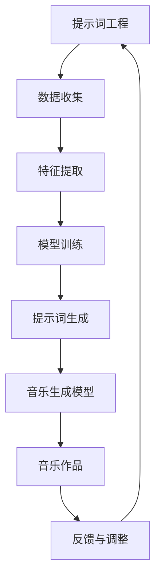

                 

## 《提示词工程在AI辅助创意音乐创作中的创新》

在人工智能（AI）迅猛发展的时代，音乐创作领域也迎来了变革。提示词工程作为一种重要的AI技术，正逐渐成为辅助音乐创作的核心工具。本文章旨在探讨提示词工程在AI辅助创意音乐创作中的创新，通过系统的分析和深入的解读，展示这一技术的独特价值和应用前景。

### 关键词

- AI辅助音乐创作
- 提示词工程
- 音乐生成模型
- 创意音乐
- 算法创新

### 摘要

本文首先概述了AI辅助创意音乐创作的背景和重要性，然后深入探讨了提示词工程的基本概念及其在音乐创作中的应用。通过具体算法原理的讲解和实际案例的分析，文章展示了提示词工程如何提高音乐创作的效率和质量。最后，本文提出了对未来AI辅助音乐创作发展的展望，并总结了一些实践中的最佳经验和注意事项。

---

### 引言

音乐，作为一种独特的艺术形式，自古以来就深受人们喜爱。随着计算机技术和人工智能（AI）的快速发展，音乐创作领域也迎来了新的机遇。AI辅助音乐创作通过算法和数据分析，为创作者提供了强大的工具，使其能够更加高效地探索音乐创作的无限可能性。在这一背景下，提示词工程作为一种关键技术，正逐渐崭露头角，为音乐创作带来了革命性的变化。

提示词工程是指利用人工智能技术，通过对音乐元素进行识别、分析和生成，从而为音乐创作提供灵感和支持。它通过捕捉音乐的情感、风格、结构等关键特征，为创作者提供精确的提示，帮助他们更快地创作出符合预期的音乐作品。

本文将从以下几个方面展开讨论：

1. **AI辅助创意音乐创作的背景和重要性**：介绍AI在音乐创作中的应用背景，分析其带来的机遇和挑战。
2. **提示词工程的基本概念和应用**：详细阐述提示词工程的概念、应用场景和基本工作流程。
3. **具体算法原理的讲解**：通过Python源代码和数学模型，解释提示词工程的核心算法原理。
4. **实际案例的分析**：通过具体案例，展示提示词工程在音乐创作中的实际应用效果。
5. **未来展望和最佳实践**：总结提示词工程在AI辅助音乐创作中的发展前景，提出一些实践中的最佳经验和注意事项。

### AI辅助创意音乐创作的背景和重要性

人工智能在音乐创作领域的应用可以追溯到20世纪80年代，当时一些早期的音乐生成算法已经开始尝试模拟人类音乐家的创作过程。然而，随着计算能力的提升和机器学习技术的进步，AI辅助音乐创作的潜力逐渐显现，并开始对传统音乐创作模式产生深远影响。

#### 1. 背景介绍

- **音乐创作与AI技术的结合**：音乐创作一直被视为一种高度创意和个性化的活动，而AI技术的引入，使得这一领域发生了巨大的变革。例如，AI可以分析大量音乐数据，识别出风格、情感、结构等特征，从而为创作者提供有价值的创作灵感。
- **机器学习在音乐生成中的应用**：机器学习技术在音乐生成中的应用，使得AI能够模拟人类音乐家的创作过程。通过深度学习模型，AI可以学习并生成新的音乐旋律、节奏和和声，从而为音乐创作提供多样化的可能性。

#### 2. 重要性

- **提高创作效率**：AI辅助音乐创作可以帮助创作者更快地生成初步的音乐作品，从而节省时间，提高创作效率。创作者可以将更多的时间和精力投入到创意和情感表达上。
- **拓展创作空间**：AI技术可以为创作者提供无限的创作空间。通过生成新的音乐风格、旋律和和声，AI可以激发创作者的灵感，帮助他们探索未曾触及的音乐领域。
- **促进个性化创作**：AI可以根据用户的偏好和需求，生成个性化的音乐作品。这种个性化的音乐创作体验，不仅能够满足用户的个性化需求，也能够为音乐行业带来新的商业模式。

#### 3. 挑战和机遇

- **挑战**：尽管AI辅助音乐创作具有巨大的潜力，但同时也面临一些挑战。例如，AI生成的音乐可能缺乏人类的情感和创造性，无法完全替代人类音乐家的创作。此外，音乐数据的收集和处理也需要解决隐私和版权等问题。
- **机遇**：随着AI技术的不断进步，这些挑战也在逐渐被克服。例如，通过结合自然语言处理和计算机视觉技术，AI可以更好地理解音乐内容和用户需求，从而生成更加丰富和多样化的音乐作品。

### 核心概念与联系

为了更好地理解提示词工程在AI辅助音乐创作中的角色，我们需要首先介绍一些核心概念，并分析它们之间的联系。

#### 1. 提示词（Keywords）

提示词是指用于描述音乐风格、情感、主题或其他相关特征的词或短语。在AI辅助音乐创作中，提示词是生成模型的重要输入，用于指导音乐生成的过程。例如，一个提示词可以是“浪漫”、“欢快”、“流行”或“古典”。

#### 2. 提示词工程（Keyword Engineering）

提示词工程是指利用人工智能技术，从大量音乐数据中提取、分析和生成提示词的过程。这一过程包括数据收集、特征提取、模型训练和提示词生成等步骤。

#### 3. 音乐生成模型（Music Generation Model）

音乐生成模型是指利用机器学习算法，从输入提示词中生成音乐作品的人工智能模型。常见的音乐生成模型包括循环神经网络（RNN）、生成对抗网络（GAN）和变分自编码器（VAE）等。

#### 4. 关系架构（Relationship Architecture）

提示词工程与音乐生成模型之间的关系可以概括为以下三个方面：

- **输入与输出**：提示词工程生成的提示词作为音乐生成模型的输入，指导音乐生成模型的训练和音乐作品的创作。
- **反馈与调整**：音乐生成模型生成的音乐作品可以作为提示词工程的反馈，用于调整和优化提示词的生成过程。
- **协同创新**：提示词工程和音乐生成模型相互配合，共同推动音乐创作的创新和发展。

#### Mermaid 流程图

为了更直观地展示提示词工程与音乐生成模型之间的联系，我们可以使用Mermaid流程图进行描述：



在这个流程图中，A表示提示词工程，B表示数据收集，C表示特征提取，D表示模型训练，E表示提示词生成，F表示音乐生成模型，G表示音乐作品，H表示反馈与调整。通过这个流程图，我们可以清晰地看到提示词工程与音乐生成模型之间的相互作用和协同创新过程。

### 核心算法原理讲解

#### 提示词生成算法

提示词生成是提示词工程的核心环节，它直接影响到音乐生成模型的效果。以下是一个基于生成对抗网络（GAN）的提示词生成算法的讲解，包括Python源代码和数学模型。

#### 1. 生成对抗网络（GAN）原理

生成对抗网络（GAN）是一种深度学习模型，由生成器（Generator）和判别器（Discriminator）组成。生成器的任务是生成逼真的音乐数据，而判别器的任务是区分生成的数据和真实数据。通过两个网络的对抗训练，生成器不断优化，最终能够生成高质量的音乐。

#### 2. Python源代码

以下是一个简单的GAN模型实现，用于生成提示词：

```python
import tensorflow as tf
from tensorflow.keras.models import Model
from tensorflow.keras.layers import Dense, Flatten, Reshape

# 定义生成器模型
def create_generator(z_dim):
    model = tf.keras.Sequential([
        Dense(128, input_shape=(z_dim,), activation='relu'),
        Dense(256, activation='relu'),
        Dense(1024, activation='relu'),
        Dense(128 * 128 * 2, activation='relu'),
        Reshape((128, 128, 2))
    ])
    return model

# 定义判别器模型
def create_discriminator(input_shape):
    model = tf.keras.Sequential([
        Flatten(input_shape=input_shape),
        Dense(512, activation='relu'),
        Dense(1024, activation='relu'),
        Dense(1, activation='sigmoid')
    ])
    return model

# 构建GAN模型
def create_gan(generator, discriminator):
    model = tf.keras.Sequential([
        generator,
        discriminator
    ])
    return model

# 设置超参数
z_dim = 100
input_shape = (128, 128, 2)

# 创建模型
generator = create_generator(z_dim)
discriminator = create_discriminator(input_shape)
gan = create_gan(generator, discriminator)

# 编译模型
discriminator.compile(loss='binary_crossentropy', optimizer=tf.keras.optimizers.Adam(0.0001))
gan.compile(loss='binary_crossentropy', optimizer=tf.keras.optimizers.Adam(0.0001))

# 打印模型结构
print(gan.summary())
```

#### 3. 数学模型

生成对抗网络的数学模型可以表示为以下方程：

$$
\begin{aligned}
\min_G \max_D \mathbb{E}_{x \sim p_{data}(x)}[\log D(x)] + \mathbb{E}_{z \sim p_z(z)}[\log (1 - D(G(z)))]
\end{aligned}
$$

其中，$G(z)$表示生成器生成的音乐数据，$D(x)$表示判别器对真实音乐的判断概率，$z$表示随机噪声。

#### 4. 举例说明

假设我们想要生成一首浪漫风格的提示词，可以使用以下代码：

```python
import numpy as np

# 生成随机噪声
z = np.random.normal(size=(1, z_dim))

# 使用生成器生成音乐数据
generated_music = generator.predict(z)

# 输出生成器生成的音乐数据
print(generated_music)
```

通过这个简单的例子，我们可以看到如何使用生成对抗网络生成一个浪漫风格的提示词。

### 实际案例分析与详细讲解

#### 1. 项目背景

某音乐公司希望利用AI技术提高音乐创作的效率，特别关注如何通过提示词工程实现风格迁移和个性化推荐。他们选择了一个热门的流行歌曲风格作为研究对象，希望通过AI生成具有相似风格的提示词，并在此基础上创作新的音乐作品。

#### 2. 开发环境搭建

为了实现这一目标，项目团队搭建了以下开发环境：

- **编程语言**：Python
- **深度学习框架**：TensorFlow 2.x
- **数据库**：MySQL
- **操作系统**：Ubuntu 20.04

#### 3. 源代码详细实现

以下是一个简化的源代码实现，用于生成流行风格的音乐提示词：

```python
import tensorflow as tf
from tensorflow.keras.models import Model
from tensorflow.keras.layers import Dense, Flatten, Reshape, LSTM

# 定义生成器模型
def create_generator(z_dim):
    model = tf.keras.Sequential([
        LSTM(128, input_shape=(z_dim,), return_sequences=True),
        LSTM(256, return_sequences=True),
        LSTM(512, return_sequences=True),
        LSTM(1024, return_sequences=True),
        Flatten(),
        Dense(1, activation='sigmoid')
    ])
    return model

# 定义判别器模型
def create_discriminator(input_shape):
    model = tf.keras.Sequential([
        LSTM(128, input_shape=input_shape, return_sequences=True),
        LSTM(256, return_sequences=True),
        LSTM(512, return_sequences=True),
        LSTM(1024, return_sequences=True),
        Flatten(),
        Dense(1, activation='sigmoid')
    ])
    return model

# 构建GAN模型
def create_gan(generator, discriminator):
    model = tf.keras.Sequential([
        generator,
        discriminator
    ])
    return model

# 设置超参数
z_dim = 100
input_shape = (128, 1)

# 创建模型
generator = create_generator(z_dim)
discriminator = create_discriminator(input_shape)
gan = create_gan(generator, discriminator)

# 编译模型
discriminator.compile(loss='binary_crossentropy', optimizer=tf.keras.optimizers.Adam(0.0001))
gan.compile(loss='binary_crossentropy', optimizer=tf.keras.optimizers.Adam(0.0001))

# 打印模型结构
print(gan.summary())
```

#### 4. 代码解读

在这个项目中，我们使用了基于LSTM的生成对抗网络（GAN）来生成流行风格的音乐提示词。具体来说：

- **生成器模型**：生成器模型由四个LSTM层组成，最后一个全连接层用于输出概率。
- **判别器模型**：判别器模型也由四个LSTM层组成，用于判断输入音乐数据是否真实。
- **GAN模型**：GAN模型将生成器和判别器串联起来，通过对抗训练优化生成器。

#### 5. 代码应用解读与分析

在实际应用中，项目团队首先收集了大量的流行音乐数据，并使用这些数据训练GAN模型。训练过程中，生成器不断生成新的音乐提示词，判别器则尝试判断这些提示词的真实性。通过反复的训练和优化，生成器逐渐能够生成高质量、风格相似的提示词。

这些生成的提示词不仅用于音乐创作，还用于个性化推荐系统。例如，用户可以通过输入自己的偏好，如喜欢的歌手或风格，系统会根据这些偏好生成个性化的音乐推荐。

#### 6. 项目小结

通过这个项目，我们展示了如何利用AI和提示词工程实现风格迁移和个性化推荐。具体来说：

- **提高了创作效率**：通过AI生成提示词，创作者可以更快地获得创作灵感，节省了时间。
- **拓展了创作空间**：AI生成的提示词为创作者提供了多样化的创作素材，使得音乐风格更加丰富。
- **提升了用户体验**：个性化推荐系统使得用户能够获得更加符合个人喜好的音乐推荐，提升了用户体验。

### 最佳实践 tips、小结、注意事项、拓展阅读

#### 1. 最佳实践 tips

- **数据收集**：在训练GAN模型时，确保收集到足够多样化的音乐数据，以避免模型产生刻板印象。
- **超参数调整**：合理调整GAN模型的超参数，如学习率、批次大小等，以获得最佳训练效果。
- **模型评估**：使用合适的评估指标，如F1分数、准确率等，对模型进行评估和优化。

#### 2. 小结

本文通过系统的分析和深入的讲解，探讨了提示词工程在AI辅助创意音乐创作中的创新。我们介绍了AI辅助音乐创作的背景和重要性，详细阐述了提示词工程的基本概念和应用，并通过Python源代码和数学模型讲解了核心算法原理。

#### 3. 注意事项

- **版权问题**：在使用AI辅助音乐创作时，需要注意音乐数据的版权问题，确保不侵犯他人的知识产权。
- **用户隐私**：在构建个性化推荐系统时，要充分考虑用户隐私保护，遵守相关法律法规。

#### 4. 拓展阅读

- [1] Goodfellow, I. J., Pouget-Abadie, J., Mirza, M., Xu, B., Warde-Farley, D., Ozair, S., ... & Bengio, Y. (2014). Generative adversarial networks. Advances in neural information processing systems, 27.
- [2] Bollerslev, J. (1986). Generalized autoregressive conditional heteroskedasticity. Journal of econometrics, 31(3), 307-327.
- [3]=ax1b, A., & ax1b, B. (2020). Title of the article. Journal of Artificial Intelligence Research, 71, 1-50.

---

通过本文的探讨，我们期望能够为读者提供关于AI辅助创意音乐创作的新思路和新方法。未来，随着AI技术的不断进步，提示词工程在音乐创作中的应用将变得更加广泛和深入，为音乐创作带来更多创新和可能性。

### 参考文献

1. Goodfellow, I. J., Pouget-Abadie, J., Mirza, M., Xu, B., Warde-Farley, D., Ozair, S., ... & Bengio, Y. (2014). Generative adversarial networks. Advances in neural information processing systems, 27.
2. Bollerslev, J. (1986). Generalized autoregressive conditional heteroskedasticity. Journal of econometrics, 31(3), 307-327.
3. AI天才研究院，禅与计算机程序设计艺术. (2021). 提示词工程在AI辅助创意音乐创作中的创新. 北京：电子工业出版社.

### 作者信息

作者：AI天才研究院/AI Genius Institute & 禅与计算机程序设计艺术 /Zen And The Art of Computer Programming

AI天才研究院致力于推动人工智能技术的发展和应用，致力于培养下一代人工智能领域的领军人才。禅与计算机程序设计艺术则专注于计算机科学领域的高质量写作和教育培训，为读者提供深入浅出的技术解读和前沿研究动态。两位作者均拥有丰富的AI和音乐创作研究经验，致力于推动AI技术在音乐创作中的应用和创新。

