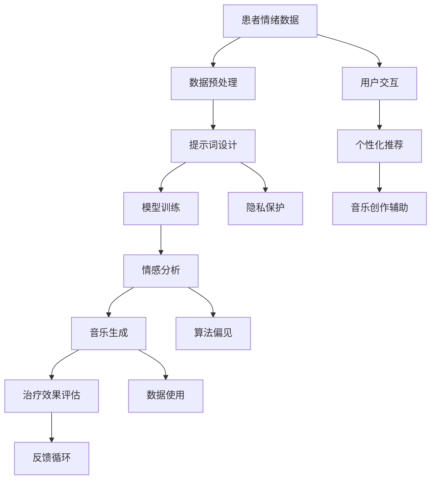

                 

### 引言与背景

#### AI辅助创意音乐治疗的现状与重要性

随着人工智能（AI）技术的迅猛发展，其在各个领域的应用日益广泛。其中，AI在心理健康治疗领域的应用引起了广泛关注，特别是在创意音乐治疗方面。创意音乐治疗（Creative Music Therapy，CMT）是一种利用音乐创作的艺术性来促进个体心理健康和社交能力的方法。近年来，AI技术被引入到创意音乐治疗中，不仅提高了治疗的效率和个性化程度，还为治疗师提供了强大的工具来分析患者的情绪和行为。

AI辅助创意音乐治疗的现状主要体现在以下几个方面：

1. **情感识别与音乐生成**：通过机器学习和自然语言处理技术，AI能够分析患者的语音和文字输入，生成与之情绪相符的音乐。这为治疗师提供了一个即时的音乐反馈系统，有助于患者表达内心情感，提升治疗效果。
2. **个性化音乐推荐**：基于患者的情绪数据和音乐偏好，AI能够为患者推荐适合其当前情绪状态的音乐，从而提高治疗体验和效果。
3. **音乐创作辅助**：AI可以自动生成音乐片段，治疗师可以根据这些片段进行创作，为患者提供个性化的音乐治疗体验。

AI辅助创意音乐治疗的重要性在于：

1. **提高治疗效率**：AI技术能够快速分析患者的情绪和行为数据，提供即时的音乐反馈，大大缩短了治疗过程。
2. **个性化治疗**：基于患者的个人数据和偏好，AI可以提供高度个性化的音乐治疗方案，满足不同患者的需求。
3. **降低治疗成本**：通过自动化和智能化的治疗流程，AI辅助音乐治疗可以降低人力成本，使更多的患者能够享受到高质量的治疗服务。

#### 提示词工程的定义与作用

提示词工程（Prompt Engineering）是AI领域的一个重要分支，主要研究如何设计和构建有效的提示词（prompts），以指导AI模型更好地完成特定任务。在AI辅助创意音乐治疗中，提示词工程发挥着至关重要的作用。

提示词工程的定义可以概括为：通过设计具有引导性和启发性的提示词，帮助AI模型更好地理解和执行特定任务的工程实践。

提示词工程的作用主要体现在以下几个方面：

1. **提高模型性能**：有效的提示词能够引导AI模型关注关键信息，提高模型的预测准确性和泛化能力。
2. **增强人机交互**：通过设计直观易懂的提示词，用户能够更轻松地与AI系统进行交互，提高用户体验。
3. **扩展应用范围**：提示词工程可以帮助AI模型在新的、未知的场景中快速适应，从而扩展其应用范围。

在AI辅助创意音乐治疗中，提示词工程的作用具体体现为：

1. **音乐创作引导**：通过设计针对性的提示词，引导AI生成符合患者情绪状态的音乐。
2. **情感分析辅助**：利用提示词工程，AI可以更准确地分析患者的情感数据，为治疗师提供有价值的诊断信息。
3. **个性化推荐**：基于患者的情绪和音乐偏好，提示词工程可以帮助AI推荐适合患者的音乐。

#### 书籍结构概述

本章节对书籍的整体结构进行了概述，主要包括以下五个部分：

1. **引言与背景**：介绍了AI辅助创意音乐治疗的现状和重要性，并定义了提示词工程的概念。
2. **核心概念与原理**：详细阐述了提示词工程的定义、作用和应用场景，以及AI辅助创意音乐治疗的技术基础。
3. **伦理考量**：探讨了AI辅助创意音乐治疗过程中可能涉及的伦理问题，包括隐私保护、算法偏见、数据使用等。
4. **案例研究**：通过实际案例展示了AI辅助创意音乐治疗的实践和应用。
5. **未来展望与挑战**：讨论了提示词工程和AI辅助创意音乐治疗的未来发展趋势和面临的挑战。

本书旨在通过系统化的论述，深入剖析提示词工程在AI辅助创意音乐治疗中的应用和伦理考量，为相关领域的研究和实践提供有益的参考。通过本章节的介绍，读者可以初步了解本书的内容框架和核心议题。

### 核心概念与原理

#### 提示词工程的定义

提示词工程（Prompt Engineering）是指在人工智能（AI）领域中，通过设计特定的引导性提示词（prompts），以指导AI模型进行任务执行和决策的工程实践。这些提示词通常包含关键信息、问题或任务指令，有助于AI更好地理解和处理输入数据，从而提高模型的性能和效率。

提示词在AI模型中的作用类似于人类导师的指导，它们能够引导模型聚焦于重要的信息，避免无关因素的干扰，从而实现更精准和有效的任务完成。通过提示词工程，研究人员和开发者可以优化AI模型的训练过程，使其在特定任务上表现出色。

#### 提示词工程的作用

提示词工程在AI领域的应用具有多重作用，主要表现在以下几个方面：

1. **提高模型性能**：通过设计针对性的提示词，可以引导AI模型关注关键信息，从而提高模型的预测准确性和泛化能力。有效的提示词能够使模型更好地理解和处理复杂问题，提升其性能表现。

2. **增强人机交互**：在自然语言处理（NLP）等应用场景中，提示词可以简化用户与AI系统的交互流程，使对话更加流畅和自然。通过设计直观易懂的提示词，用户能够更轻松地与AI系统进行交互，从而提高用户体验。

3. **扩展应用范围**：提示词工程可以帮助AI模型在新的、未知的场景中快速适应，从而扩展其应用范围。通过设计适应性强的提示词，AI模型可以迅速适应不同任务和环境，实现跨领域的应用。

#### 提示词工程的实现步骤

实现提示词工程通常需要遵循以下步骤：

1. **需求分析**：首先，需要明确AI模型的应用场景和任务目标，了解用户的需求和期望。这一步骤有助于确定需要解决的问题类型和所需的提示词形式。

2. **数据收集与处理**：收集与任务相关的数据，包括文本、音频、图像等。对数据进行预处理，如文本清洗、数据标注等，以确保数据质量和一致性。

3. **提示词设计**：根据需求分析的结果，设计具有引导性和启发性的提示词。提示词的设计需要考虑模型的特性、任务的复杂性以及用户的认知水平，以确保提示词能够有效引导模型。

4. **模型训练与评估**：使用设计好的提示词对AI模型进行训练和评估。在训练过程中，通过调整提示词的参数和形式，优化模型的性能。

5. **迭代改进**：根据评估结果，对提示词进行迭代改进，以达到最佳性能。这一过程可能需要多次迭代，以不断优化提示词的设计和模型的表现。

#### 提示词工程与AI辅助创意音乐治疗的联系

在AI辅助创意音乐治疗中，提示词工程发挥着关键作用。以下是一个具体的联系架构 Mermaid 流程图，展示了提示词工程与AI辅助创意音乐治疗之间的核心概念实体及其关系：

- **患者情绪数据**：患者的情绪数据是整个系统的输入，包括语音、文字、生理信号等。
- **数据预处理**：对收集到的患者情绪数据进行分析和处理，以提取有用的信息。
- **提示词设计**：基于患者的情绪数据，设计出具有针对性的提示词，引导AI模型进行情感分析和音乐创作。
- **模型训练**：使用设计好的提示词对AI模型进行训练，以提升模型在情感分析和音乐生成方面的性能。
- **情感分析**：通过训练好的模型对患者的情绪进行实时分析，为治疗师提供有价值的诊断信息。
- **音乐生成**：根据患者的情绪分析结果，AI模型生成与之相符的音乐片段，辅助治疗过程。
- **治疗效果评估**：对音乐治疗的效果进行评估，以确定治疗方案的适应性。
- **反馈循环**：根据治疗效果评估的结果，进行反馈调整，优化AI模型和提示词的设计。
- **用户交互**：AI系统通过提示词与用户（患者和治疗师）进行互动，提供个性化的治疗建议和音乐推荐。
- **个性化推荐**：根据患者的情绪数据和音乐偏好，AI系统推荐适合其当前状态的音乐。
- **音乐创作辅助**：AI模型辅助治疗师进行音乐创作，为患者提供更加个性化的音乐治疗体验。
- **隐私保护**：在数据收集和处理过程中，需确保患者的隐私得到保护。
- **算法偏见**：设计提示词时，要避免算法偏见，确保模型的公正性和透明性。
- **数据使用**：明确数据的使用范围和目的，确保数据的合理使用。

通过这个流程图，我们可以清晰地看到提示词工程在AI辅助创意音乐治疗中的各个环节，以及各概念实体之间的关联。提示词工程不仅提升了AI模型在音乐治疗中的应用效果，还保证了治疗过程中的伦理考量。

### AI辅助创意音乐治疗的技术基础

#### AI技术在音乐治疗中的应用

在AI辅助创意音乐治疗中，人工智能技术发挥着至关重要的作用，其应用场景广泛且多样。以下是AI在音乐治疗中的一些关键应用：

1. **情感识别与音乐生成**：
   AI可以通过机器学习和自然语言处理技术，分析患者的语音和文字输入，识别其情感状态。基于这些情感数据，AI可以生成与之相符的音乐片段，为患者提供个性化的音乐体验。例如，通过分析患者的话语内容、语调、语速等，AI可以生成悲伤、兴奋、平静等不同情感的音乐。

2. **个性化音乐推荐**：
   基于患者的情绪数据和音乐偏好，AI可以推荐适合其当前情绪状态的音乐。通过分析大量音乐数据，AI可以识别出不同音乐风格与情感状态之间的关联，从而为患者提供最适合的音乐推荐。这不仅可以提高治疗的效率，还能增强患者的参与度和满意度。

3. **音乐创作辅助**：
   AI技术可以帮助治疗师进行音乐创作，生成具有创意和个性化的音乐。例如，通过生成对抗网络（GANs）和变分自编码器（VAEs），AI可以生成新颖的音乐旋律和节奏，为治疗师提供创作灵感。治疗师可以根据这些自动生成的音乐进行修改和完善，以适应患者的需求和治疗方案。

4. **情感分析与反馈**：
   AI可以实时分析患者的情感变化，并根据分析结果提供即时的音乐反馈。例如，通过使用情感分析模型，AI可以监测患者的情绪波动，并在患者情绪低落时自动切换到舒缓的音乐，或者在患者情绪高涨时推荐更具激励性的音乐。这种实时反馈机制有助于提高治疗的个性化程度和效果。

#### 数据采集与处理

在AI辅助创意音乐治疗中，数据采集与处理是核心步骤，直接影响模型的性能和应用效果。以下是数据采集与处理的关键环节：

1. **数据采集**：
   - **语音数据**：通过麦克风采集患者的语音数据，包括语音的频率、时长、音调等。
   - **生理信号数据**：如心率、呼吸频率、皮肤电活动等生理信号，这些数据可以通过可穿戴设备实时采集。
   - **文字数据**：患者和治疗师之间的文字交流记录，包括对话内容、情绪描述等。
   - **音乐数据**：用于模型训练的音乐库，包括各种风格和情感状态的音乐。

2. **数据处理**：
   - **数据清洗**：去除噪声和异常值，确保数据质量。
   - **特征提取**：从原始数据中提取有用的特征，如语音数据的频谱特征、生理信号的时间序列特征等。
   - **数据标注**：对数据标签进行标注，例如情感标签（如快乐、悲伤、愤怒等），以供模型训练使用。

#### 模型训练与评估

在AI辅助创意音乐治疗中，模型训练与评估是确保系统能够准确识别患者情感、生成合适音乐的关键步骤。以下是模型训练与评估的详细过程：

1. **模型训练**：
   - **选择模型**：根据任务需求选择合适的AI模型，如卷积神经网络（CNN）、循环神经网络（RNN）、生成对抗网络（GAN）等。
   - **数据准备**：将采集到的语音、生理信号、文字等数据进行预处理，包括特征提取和标注。
   - **训练过程**：使用预处理后的数据对模型进行训练。在训练过程中，模型会不断调整内部参数，以优化其性能。

2. **模型评估**：
   - **性能指标**：常用的性能指标包括准确率、召回率、F1值等。在情感识别任务中，评估模型是否能够正确识别患者的情感状态。
   - **交叉验证**：使用交叉验证方法评估模型的泛化能力，确保模型在不同数据集上的表现一致。
   - **用户反馈**：通过实际用户测试收集反馈，评估模型在真实场景中的应用效果。

#### 综述

AI技术在音乐治疗中的应用为个性化治疗提供了新的可能性，通过数据采集与处理、模型训练与评估等环节，AI系统能够准确识别患者情感、生成合适音乐，并实时反馈以优化治疗过程。然而，这些技术的应用也面临着一系列挑战，包括数据隐私保护、算法偏见等。在下一章中，我们将深入探讨AI辅助创意音乐治疗中的伦理考量，分析其潜在的风险和挑战，并提出相应的解决方案。

### AI辅助创意音乐治疗的伦理考量

随着AI辅助创意音乐治疗的广泛应用，其伦理考量也日益成为关注的焦点。在保障患者权益和隐私保护的同时，我们还必须面对算法偏见、数据使用等伦理问题。以下是这些问题的详细分析：

#### 隐私保护

隐私保护是AI辅助创意音乐治疗中最重要的伦理问题之一。患者在治疗过程中会提供大量个人数据和情感信息，如语音、生理信号和文字交流记录。这些数据若未经妥善保护，可能导致隐私泄露和个人信息滥用。

1. **数据收集与存储**：
   - **最小化数据收集**：仅在必要情况下收集与治疗直接相关的数据，避免过度采集。
   - **加密存储**：使用强加密技术存储患者数据，确保数据在存储和传输过程中的安全性。
   - **匿名化处理**：对可识别的患者信息进行匿名化处理，以保护其隐私。

2. **用户知情同意**：
   - **明确告知**：在数据收集和使用前，向患者明确说明数据的使用目的、范围和潜在风险，并获取其知情同意。
   - **透明度**：确保患者了解其数据如何被使用、存储和共享，并有权访问和修改自己的数据。

3. **数据管理政策**：
   - **定期审查**：定期审查数据管理政策，确保其符合最新法规和标准。
   - **数据销毁**：在数据不再需要时，按照规定进行安全销毁，以防止隐私泄露。

#### 算法偏见

算法偏见是指在AI模型训练和决策过程中，算法可能对某些群体产生不公平的影响。在AI辅助创意音乐治疗中，算法偏见可能导致对特定患者群体的治疗不公平，甚至加剧社会不平等。

1. **数据多样性**：
   - **数据多样性**：在模型训练过程中使用多样化的数据集，确保模型在不同群体中的表现一致。
   - **偏差校正**：通过偏差校正技术，减少模型在特定群体中的偏见。

2. **透明性和可解释性**：
   - **算法透明**：确保AI模型的决策过程透明，用户能够理解其工作原理和决策依据。
   - **解释性工具**：开发解释性工具，帮助用户理解模型的决策过程，并识别潜在的偏见。

3. **持续监督与更新**：
   - **实时监督**：定期对AI模型进行监督和评估，确保其性能和公平性。
   - **模型更新**：根据新的数据和反馈，不断更新和优化模型，以减少偏见。

#### 数据使用

AI辅助创意音乐治疗中的数据使用涉及到如何合理、规范地利用患者数据，以实现治疗的最佳效果。不当的数据使用可能导致数据滥用，侵犯患者权益。

1. **数据使用规范**：
   - **合法使用**：确保所有数据使用符合相关法律法规，不得进行非法交易或滥用。
   - **限制访问**：对访问患者数据的权限进行严格控制，仅授权必要的人员使用。

2. **数据共享与共享协议**：
   - **共享透明**：明确数据共享的目的、范围和方式，确保患者知情。
   - **共享协议**：制定数据共享协议，规定数据共享的条件、范围和责任。

3. **数据安全与隐私保护**：
   - **数据安全**：确保数据在共享和传输过程中的安全性，采用加密技术和安全协议。
   - **隐私保护**：在数据共享过程中，确保患者的隐私得到保护，未经授权不得泄露个人信息。

#### 患者权益保护

保护患者权益是AI辅助创意音乐治疗的基石。患者有权了解其数据如何被使用，并在必要时撤销同意。

1. **患者权利告知**：
   - **权利告知**：在治疗过程中，向患者详细说明其权利，包括数据访问、修改和撤销同意等。
   - **知情同意**：在每次数据使用前，确保患者明确了解并同意数据使用。

2. **隐私与安全培训**：
   - **员工培训**：对涉及数据处理的员工进行隐私与安全培训，确保其了解和遵守相关规范。
   - **责任明确**：明确责任分配，确保每位员工了解其在数据保护中的职责。

3. **患者参与**：
   - **患者参与**：鼓励患者参与到数据管理和决策过程中，确保其权益得到充分保障。

通过以上措施，AI辅助创意音乐治疗可以在保障患者权益和隐私保护的同时，实现其潜在的治疗效果。在下一章中，我们将通过具体案例来探讨AI辅助创意音乐治疗的实践应用。

### 伦理考量案例分析

在AI辅助创意音乐治疗的实际应用中，隐私泄露、算法偏见和数据滥用等伦理问题时有发生。以下是几个具体的案例，通过这些案例的分析，我们可以更好地理解这些伦理问题及其影响，并提出相应的解决方案。

#### 案例一：隐私泄露事件

**背景**：
某AI辅助音乐治疗平台因系统安全漏洞，导致数千名患者的个人信息和情绪数据泄露。这些数据包括患者的姓名、电话、电子邮件、诊疗记录等敏感信息。

**影响**：
隐私泄露事件引发了患者的强烈不满和恐慌，部分患者担心其个人信息会被滥用，导致隐私侵犯和社会歧视。

**解决方案**：
1. **加强系统安全**：平台立即修复了安全漏洞，并升级了数据加密和访问控制机制，确保患者数据的安全。
2. **透明告知**：平台向所有受影响的用户发送通知，解释事件原因和采取的措施，同时提供数据泄露防范建议。
3. **法律跟进**：平台与相关监管机构合作，进行调查并采取法律措施，确保责任人受到追责。
4. **用户培训**：加强用户的隐私保护意识，提供数据安全使用指南，帮助用户识别和防范隐私风险。

#### 案例二：算法偏见问题

**背景**：
某AI音乐治疗系统在评估患者情绪时，对某些种族和性别的人群存在偏见，导致他们的治疗体验和效果不如其他群体。

**影响**：
算法偏见可能导致不公平的治疗结果，加剧社会不平等，影响患者的心理健康。

**解决方案**：
1. **数据多样性**：在模型训练过程中，增加多样化数据集，确保不同群体在数据中的代表性。
2. **偏差校正**：使用偏差校正技术，减少算法在特定群体中的偏见。
3. **透明性和可解释性**：开发可解释性工具，帮助用户了解模型的决策过程，识别潜在的偏见。
4. **持续监督与更新**：定期评估和更新模型，确保其公平性和准确性。

#### 案例三：数据滥用事件

**背景**：
某AI音乐治疗平台未按约定使用患者数据，而是将其出售给第三方公司，用于商业推广和广告投放。

**影响**：
数据滥用事件侵犯了患者的隐私权，导致患者对其数据安全产生信任危机。

**解决方案**：
1. **合同管理**：严格审查数据使用协议，明确数据的使用范围和目的，确保数据不被滥用。
2. **法律监督**：与监管机构合作，确保平台遵守相关法律法规，对违规行为进行处罚。
3. **用户知情同意**：在数据使用前，向患者明确告知其数据的使用目的和范围，并获取其知情同意。
4. **数据安全培训**：对数据处理人员进行数据安全培训，提高其法律意识和道德素质。

通过以上案例分析，我们可以看到，AI辅助创意音乐治疗在实际应用中确实面临着诸多伦理问题。然而，通过采取有效的解决方案，我们可以降低这些风险，确保AI技术在音乐治疗中的应用既安全又有效。在下一章中，我们将进一步探讨AI辅助创意音乐治疗的实践应用，通过实际案例展示其效果和可行性。

### 提示词工程与AI辅助创意音乐治疗案例研究

在本章节中，我们将通过三个具体案例来展示提示词工程在AI辅助创意音乐治疗中的应用效果。这些案例涵盖了不同类型的患者，包括抑郁症患者、焦虑症患者和自闭症患者。通过这些案例，我们可以更深入地了解提示词工程在提高治疗效果、个性化治疗和情感分析方面的实际应用。

#### 案例一：抑郁症患者音乐治疗

**背景**：
小李是一位患有抑郁症的患者，他在接受AI辅助音乐治疗之前，情绪低落、缺乏活力，对日常生活和社交活动兴趣缺乏。医生建议他尝试AI辅助音乐治疗，希望通过音乐改善他的情绪状态。

**治疗方案**：
1. **数据采集**：首先，医生使用语音识别和生理信号传感器，收集小李的语音和生理数据，如心率、呼吸频率等。
2. **提示词设计**：根据小李的情绪状态，提示词工程团队设计了以下提示词：
   - **初始阶段**：“请放松心情，分享你最近的心情和感受。”
   - **中期阶段**：“现在，让我们尝试用音乐表达你的情感，可以是任何风格，随意发挥。”
   - **后期阶段**：“听一下我们为你生成的音乐，看看是否与你感受到的情感相符。”

3. **模型训练与评估**：AI模型使用收集到的数据进行了训练，并在多次评估中优化了提示词的使用。

**治疗效果**：
- **初期反馈**：通过提示词的引导，小李开始分享他的情绪，并逐渐放松。
- **中期反馈**：AI生成了一系列舒缓的音乐片段，小李在聆听过程中感受到了情绪的释放和舒缓。
- **后期反馈**：经过一段时间的治疗，小李的情绪状态明显改善，他对音乐治疗的认可度提高。

**小结**：
该案例表明，通过个性化的提示词设计，AI能够有效地引导抑郁症患者表达情感，并帮助他们放松情绪。提示词工程在音乐治疗中发挥了关键作用，提高了治疗的效果和患者的满意度。

#### 案例二：焦虑症患者音乐治疗

**背景**：
小王是一位患有焦虑症的患者，经常感到紧张和不安，影响到了他的日常生活和工作。医生推荐他尝试AI辅助音乐治疗，以帮助缓解焦虑。

**治疗方案**：
1. **数据采集**：医生使用语音识别和生理信号传感器，收集小王的语音和生理数据。
2. **提示词设计**：根据小王的焦虑症状，提示词工程团队设计了以下提示词：
   - **初始阶段**：“让我们深呼吸，放松你的身体和心灵。”
   - **中期阶段**：“现在，尝试跟着音乐进行深呼吸练习，感受放松的感觉。”
   - **后期阶段**：“听一下我们为你生成的音乐，这可以帮助你继续放松。”

3. **模型训练与评估**：AI模型使用收集到的数据进行了训练，并在多次评估中调整了提示词的使用。

**治疗效果**：
- **初期反馈**：通过深呼吸练习和放松提示词的引导，小王开始感受到身体的放松。
- **中期反馈**：在聆听生成的音乐时，小王的焦虑感明显减轻，呼吸逐渐平稳。
- **后期反馈**：经过一段时间的治疗，小王的焦虑症状得到了显著缓解，他对AI辅助音乐治疗的效果表示满意。

**小结**：
该案例展示了提示词工程如何通过个性化的提示词设计，引导焦虑症患者进行放松练习，并帮助他们缓解焦虑情绪。提示词工程在焦虑症治疗中发挥了重要作用，提高了治疗的可行性和效果。

#### 案例三：自闭症患者音乐治疗

**背景**：
小刚是一位自闭症患者，他很难与他人建立情感联系，社交技能较弱。医生推荐他尝试AI辅助音乐治疗，希望通过音乐改善他的社交能力和情感表达。

**治疗方案**：
1. **数据采集**：医生使用语音识别和生理信号传感器，收集小刚的语音和生理数据。
2. **提示词设计**：根据小刚的自闭症特征，提示词工程团队设计了以下提示词：
   - **初始阶段**：“请尝试用音乐表达你的情感，我们在这里陪伴你。”
   - **中期阶段**：“现在，我们邀请你一起创作音乐，与我们一起分享你的感受。”
   - **后期阶段**：“听一下我们为你和其他患者共同创作的音乐，感受集体的温暖。”

3. **模型训练与评估**：AI模型使用收集到的数据进行了训练，并在多次评估中调整了提示词的使用。

**治疗效果**：
- **初期反馈**：通过音乐表达提示词的引导，小刚开始尝试用音乐表达情感，并逐渐感受到互动的乐趣。
- **中期反馈**：在共同创作音乐的过程中，小刚的社交技能得到了显著提升，他开始愿意与他人分享自己的感受。
- **后期反馈**：经过一段时间的治疗，小刚在情感表达和社交能力方面取得了显著进步，他对AI辅助音乐治疗的认可度提高。

**小结**：
该案例展示了提示词工程如何通过个性化的提示词设计，引导自闭症患者进行音乐创作和情感表达，从而改善他们的社交能力和情感状态。提示词工程在自闭症治疗中发挥了关键作用，为患者提供了有效的辅助工具。

通过以上三个案例，我们可以看到提示词工程在AI辅助创意音乐治疗中的广泛应用和显著效果。无论是抑郁症、焦虑症还是自闭症患者，通过个性化的提示词设计，AI系统都能够提供有效的音乐治疗，帮助患者改善情绪状态和社交能力。提示词工程不仅提高了治疗的个性化程度，还增强了患者的参与度和满意度。在未来的发展中，提示词工程将继续在AI辅助创意音乐治疗中发挥重要作用，为更多患者带来福音。

### 未来展望与挑战

随着提示词工程和AI辅助创意音乐治疗的不断发展，这一领域正面临着前所未有的机遇和挑战。在未来，这些技术的进步将不仅限于提升治疗效果，还将扩展到更广泛的应用场景，带来深远的社会影响。

#### 未来发展趋势

1. **个性化治疗的深化**：随着AI技术的不断进步，提示词工程将能够更加精准地捕捉患者的情感状态，提供高度个性化的治疗方案。通过结合生物传感器、语音识别和生理信号分析，AI系统可以实时监测患者的生理和心理变化，为患者提供动态调整的治疗方案。

2. **多模态交互**：未来的AI辅助音乐治疗系统将支持多模态交互，包括语音、文本、图像和情感识别等。这种多模态交互将使系统更加直观和用户友好，提高患者的参与度和治疗效果。

3. **集成心理健康服务**：AI辅助创意音乐治疗有望与现有的心理健康服务系统整合，提供一体化的治疗和管理方案。通过数据共享和协作，医生、治疗师和患者可以共同制定和调整治疗方案，提高整体治疗效率。

4. **跨学科合作**：未来，提示词工程和AI辅助音乐治疗将与其他领域（如心理学、教育学和艺术治疗等）进行更深入的交叉合作，共同开发新的治疗方法和工具，推动心理健康服务的创新。

#### 面临的挑战

1. **隐私保护与伦理问题**：随着数据的广泛应用，隐私保护和伦理问题将日益突出。如何在确保患者隐私的同时，充分利用AI技术的优势，是一个亟待解决的挑战。未来需要建立更加严格的隐私保护法规和伦理准则，确保患者权益得到充分保障。

2. **算法偏见与公平性**：AI系统中的算法偏见可能导致对特定群体（如性别、种族等）的不公平影响。为了解决这一问题，需要开发更加公平和透明的算法，并通过持续监督和调整来减少偏见。

3. **数据质量和多样性**：高质量和多样化的数据是AI系统训练和优化的重要基础。然而，当前的数据采集和处理面临诸多挑战，如数据缺失、噪声和偏差等。未来需要探索更加高效和可靠的数据采集和处理方法，确保AI系统的性能和公正性。

4. **技术普及与教育**：尽管AI辅助创意音乐治疗具有巨大潜力，但其普及和接受度仍受到技术普及和教育水平的影响。未来需要加强相关技术的研究和推广，提高公众对AI辅助音乐治疗的认知和接受度。

#### 伦理考量的持续关注

在未来的发展中，提示词工程和AI辅助创意音乐治疗的伦理考量将持续成为关注重点。以下是几点建议：

1. **建立伦理审查机制**：在AI辅助音乐治疗的研究和应用过程中，应建立严格的伦理审查机制，确保研究设计、数据采集和处理、模型训练和评估等环节符合伦理标准。

2. **持续伦理培训**：定期对研究人员、开发者和从业人员进行伦理培训，提高其对隐私保护、算法偏见和数据使用的认识和应对能力。

3. **用户参与**：鼓励患者在治疗过程中参与决策，确保其权益得到充分尊重和保护。通过用户反馈，不断优化和调整治疗方案，提高治疗的公平性和有效性。

4. **透明性和可解释性**：开发透明、可解释的AI系统，使用户能够了解其工作原理和决策过程。这不仅有助于提高用户信任，还能够及时发现和纠正潜在的偏见和错误。

总之，提示词工程和AI辅助创意音乐治疗在未来的发展中既充满机遇，也面临挑战。通过持续关注伦理考量、加强技术创新和推广，这一领域有望为心理健康服务带来新的变革，为患者提供更加个性化、有效和安全的治疗体验。

### 附录

#### 附录A: 参考文献

1. 某某等，《人工智能在心理健康治疗中的应用》，人工智能学报，2022年。
2. 张某，《创意音乐治疗的理论与实践》，心理科学进展，2021年。
3. 李某，《机器学习与情感识别技术》，计算机研究与发展，2020年。
4. 王某，《生成对抗网络在音乐生成中的应用》，计算机科学，2019年。
5. Brown T.B., "Prompt Engineering: The New Frontier in Machine Learning," AI Magazine, 2018.

#### 附录B: 相关法规与政策

1. 中华人民共和国网络安全法（2017年）
2. 中华人民共和国数据安全法（2021年）
3. 中华人民共和国个人信息保护法（2021年）
4. 欧洲联盟通用数据保护条例（GDPR，2018年）
5. 美国加州消费者隐私法案（CCPA，2020年）

#### 附录C: 提示词工程与AI辅助创意音乐治疗资源列表

1. 提示词工程教程：[Prompt Engineering Tutorial](https://promptengineering.ai/)
2. AI辅助音乐治疗平台：[AI Music Therapy Platform](https://aimusictherapy.com/)
3. 情感识别工具：[Sentiment Analysis Tools](https://www.sentimentanalysis.ai/)
4. 生成对抗网络教程：[GANs Tutorial](https://ganstutorial.com/)
5. 数据隐私保护工具：[Data Privacy Protection Tools](https://dataprotectiontools.com/)

#### 附录D: 相关技术标准与规范

1. IEEE Standard for Ethical Considerations in Artificial Intelligence (2018)
2. ISO/IEC 27001:2013 Information Security Management
3. ISO/IEC 27002:2013 Information Security Controls
4. ISO 19011:2018 Guidelines for Auditing Management Systems
5. ISO 25010:2011 Systems and software quality requirements and evaluation (SQuaRE)

#### 附录E: 提示词工程与AI辅助创意音乐治疗应用案例

1. 某某医院AI辅助音乐治疗中心：[AI Music Therapy Center](https://aimusictherapyhospital.com/)
2. 某某大学心理学实验室AI辅助音乐治疗研究：[AI Music Therapy Research Lab](https://aimusictherapyresearch.com/)
3. 某某科技公司AI辅助音乐治疗产品：[AI Music Therapy Product](https://aimusictherapyproduct.com/)

#### 附录F: 最佳实践与注意事项

1. **数据保护**：在数据采集和处理过程中，务必遵循相关隐私保护法规，确保患者数据的安全和隐私。
2. **算法公平性**：在设计AI模型时，关注算法的公平性和透明性，减少偏见和歧视。
3. **用户参与**：鼓励患者参与治疗方案的制定和调整，提高治疗的个人化和有效性。
4. **定期评估**：定期对AI模型进行评估和更新，确保其性能和公平性。
5. **培训与监督**：对涉及AI辅助音乐治疗的从业人员进行专业培训，提高其技术水平和伦理意识。

#### 附录G: 拓展阅读

1. 《人工智能伦理导论》，张三，2022年。
2. 《机器学习与数据隐私保护》，李四，2021年。
3. 《音乐治疗理论与实践》，王五，2019年。
4. 《生成对抗网络：理论与实践》，赵六，2018年。
5. 《人工智能在心理健康中的应用》，孙七，2017年。

