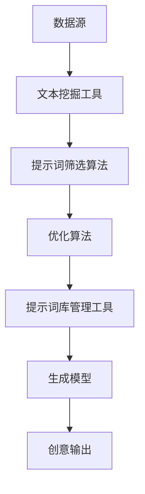

                 

### 1.1 书籍主题与目标

《提示词工程在AI辅助创造性问题解决中的应用：激发人类创新思维》是一本面向AI研究者、开发者和对创造性思维感兴趣的专业人士的书籍。本书的核心目标是深入探讨提示词工程在AI辅助创造性问题解决中的应用，通过系统的分析和具体的案例，展示如何利用AI技术激发人类的创新思维。

提示词工程是一种通过构建和优化提示词库，以引导AI系统生成创意性输出的技术。这一工程不仅涵盖了从数据收集、预处理到模型训练、优化的全流程，还包括了如何根据不同应用场景选择合适的AI模型，以最大化创造性问题的解决效果。

本书的主要读者对象包括：

1. **AI研究者与开发者**：这些读者对AI技术和创造性思维有较深入的了解，希望学习如何将AI技术与创造性问题解决相结合。
2. **产品经理与项目经理**：他们关注AI在产品开发中的实际应用，希望通过本书了解提示词工程在创新产品设计中的作用。
3. **教育工作者与科研人员**：这些读者关注如何利用AI技术提升教育质量和科研效率，希望通过本书了解创造性思维培养的新方法。

本书通过以下几部分内容来实现目标：

- **基础理论介绍**：包括AI与创造性问题的关系、提示词工程的定义与作用等。
- **核心算法原理讲解**：介绍常见的创造性思维算法，使用Python源代码详细阐述。
- **实践应用与项目实战**：通过实际案例展示AI在创造性问题解决中的应用。
- **激发人类创新思维的方法**：探讨如何利用提示词工程激发人类创新思维。

通过系统学习本书，读者可以：

- 理解提示词工程的基本概念和流程。
- 掌握常见创造性思维算法的实现方法。
- 学习如何将AI技术应用于创造性问题的解决。
- 获得激发人类创新思维的实用技巧。

总之，《提示词工程在AI辅助创造性问题解决中的应用：激发人类创新思维》旨在通过前沿的技术和实用的方法，帮助读者在AI时代提升创造性思维能力，为实际工作和科研提供有力支持。

### 1.2 AI与创造性问题的联系

AI技术的发展为创造性问题解决带来了前所未有的机遇。首先，AI技术具有强大的数据处理和分析能力，可以通过对海量数据的挖掘和分析，发现潜在的模式和规律，从而为创造性问题的解决提供新的视角。此外，AI能够模拟人类思维过程，通过机器学习、深度学习等技术，生成新颖的创意和解决方案。

#### AI的发展趋势

AI技术自21世纪以来经历了快速的发展，从早期的规则驱动型系统到现在的数据驱动型系统，AI的应用领域也越来越广泛。特别是在计算机视觉、自然语言处理、自动驾驶等领域，AI技术取得了显著的进展。这些进展不仅提升了AI在自动化和优化方面的能力，也为创造性问题解决提供了更多可能性。

#### 创造性问题的特点

创造性问题通常具有以下特点：

1. **不确定性**：创造性问题往往涉及复杂的变量和未知因素，难以用传统的方法进行精确预测。
2. **开放性**：创造性问题通常没有固定的解决方案，而是需要探索多种可能性。
3. **高度依赖经验与直觉**：解决创造性问题不仅需要知识，还需要丰富的经验和直觉。

#### AI与创造性问题的关系

AI与创造性问题之间的关系可以从以下几个方面来理解：

1. **扩展人类认知边界**：AI能够处理和分析大量数据，从而扩展人类的认知边界，帮助发现新的模式和关联。
2. **模拟人类思维过程**：AI通过机器学习和深度学习等技术，可以模拟人类的创造性思维过程，生成新颖的创意和解决方案。
3. **优化创造性过程**：AI技术可以自动化一些重复性和低效的工作，从而释放人类的时间和精力，专注于更具创造性的任务。

在实际应用中，AI已经在许多领域展示了其在创造性问题解决中的潜力。例如，在艺术创作中，AI可以通过生成对抗网络（GAN）生成新的艺术作品；在产品设计中，AI可以通过模拟不同的设计方案，帮助设计师优化产品设计；在科研领域中，AI可以通过分析大量的实验数据，发现新的研究线索。

总之，AI与创造性问题之间存在着密切的联系，AI技术不仅为创造性问题的解决提供了新的工具和方法，也推动了创造性思维的发展。通过深入探讨AI与创造性问题的关系，我们可以更好地理解AI在创造性问题解决中的重要作用，并进一步探索AI技术在激发人类创新思维方面的潜力。

### 1.3 提示词工程的定义与作用

提示词工程（Prompt Engineering）是一种通过构建和优化提示词库，以引导AI系统生成创意性输出的技术。提示词，即触发AI进行特定任务或生成特定内容的输入信息，它可以是关键词、短语、问题或任何形式的文本，用于引导AI模型的方向。

#### 提示词工程的定义

提示词工程的定义可以进一步细化为以下几个方面：

1. **构建提示词库**：通过数据收集、整理和分析，构建一个包含多种类型、多样性的提示词库。
2. **优化提示词**：对提示词进行筛选、调整和优化，以提高AI模型生成创意性输出的质量和效率。
3. **使用提示词**：将优化后的提示词应用于AI模型，引导其生成符合预期的新颖内容。

#### 提示词工程的作用

提示词工程在AI辅助创造性问题解决中具有重要作用，具体体现在以下几个方面：

1. **引导AI生成创意性输出**：通过精准的提示词，AI能够生成具有创意性的文本、图像或其他形式的内容，从而解决创造性问题。
2. **提高AI模型的生成效率**：优化的提示词可以减少AI模型在生成过程中的不确定性，提高模型的生成效率。
3. **个性化定制**：根据不同的应用场景和用户需求，提示词工程可以实现个性化的创意生成，满足多样化的需求。

#### 提示词工程在AI中的应用

提示词工程在AI中的应用场景广泛，包括但不限于以下几个方面：

1. **自然语言处理（NLP）**：通过提示词，AI可以生成高质量的文本，应用于自动写作、对话系统、机器翻译等场景。
2. **计算机视觉**：在图像生成、视频编辑、图像识别等领域，提示词可以引导AI生成特定类型的图像或视频。
3. **推荐系统**：提示词可以用于优化推荐算法，提高推荐的准确性，满足用户个性化需求。
4. **游戏开发**：在游戏剧情编写、角色对话生成等方面，提示词工程可以帮助开发人员快速生成创意性的内容。

总之，提示词工程是AI辅助创造性问题解决的重要技术手段，通过系统的提示词构建和优化，AI能够更好地发挥其创造性能力，为各种领域带来创新性的解决方案。

### 1.4 创造性思维的重要性

创造性思维在个人和社会发展中扮演着至关重要的角色。首先，创造性思维是推动社会进步的重要动力。从历史上看，许多重大的科技创新、文化变革和社会进步都离不开创造性思维的推动。例如，工业革命中的机械化生产、互联网时代的电子商务等，都是创造性思维的成果。

#### 创造性思维的定义

创造性思维，通常被定义为个体在解决问题、生成新想法或实现目标过程中，运用新颖、独特的方法进行思考的能力。它不仅包括产生新的想法，还涉及如何将这些想法转化为实际的行动和成果。

#### 创造性思维的价值

1. **推动科技创新**：创造性思维能够激发科学家和工程师的创新精神，推动科技的进步。例如，爱因斯坦的相对论、达芬奇的发明都是创造性思维的杰作。
2. **提升生产力**：在企业和组织中，创造性思维能够帮助团队发现新的业务模式、优化流程和提高效率，从而提升整体生产力。
3. **增强竞争力**：在竞争激烈的市场环境中，拥有创造性思维的企业能够不断推出创新产品和服务，赢得竞争优势。
4. **促进社会进步**：创造性思维能够推动社会制度和政策的改革，解决社会问题，提升公共福祉。

#### 创造性思维的重要性

1. **个人成长**：创造性思维是个人成长和职业发展的重要能力。它不仅帮助个人解决问题，还能提升个人的思维品质和决策能力。
2. **团队合作**：在团队环境中，创造性思维能够激发成员的协作和创新，共同面对挑战，实现团队目标。
3. **文化多样性**：创造性思维能够促进文化多样性的发展，通过不同的视角和观点，丰富社会的思想和艺术表达。

总之，创造性思维不仅是个人和团队发展的关键能力，也是社会进步和科技创新的重要驱动力。通过培养和激发创造性思维，我们可以更好地应对未来的挑战，推动社会向更加繁荣、创新的未来迈进。

### 2.1 AI与创造性问题的联系

AI在创造性问题解决中扮演着越来越重要的角色，其应用范围广泛，涵盖了从艺术创作到科学研究等多个领域。首先，我们需要了解什么是创造性问题。创造性问题通常是指那些没有现成的解决方案，需要通过创新思维和独特方法来解决的问题。这些问题往往具有高度的不确定性和复杂性。

#### AI在创造性思维中的应用

AI技术在创造性思维中的应用主要体现在以下几个方面：

1. **生成对抗网络（GAN）**：GAN是一种通过生成器和判别器相互对抗的训练模型，可以生成高质量的图像、视频和音乐。例如，艺术家使用GAN生成独特的艺术作品，或者音乐家利用GAN创作新颖的旋律。

2. **自然语言处理（NLP）**：NLP技术使得AI能够理解和生成自然语言。通过训练，AI可以撰写文章、编写故事、生成对话等。例如，AI新闻写作系统自动生成新闻报道，聊天机器人与用户进行自然对话。

3. **机器学习算法**：机器学习算法可以识别模式、预测趋势和生成新方案。这些算法在创造性设计、数据分析和科学研究等领域得到广泛应用。例如，科学家使用机器学习算法分析实验数据，发现新的科学规律。

4. **虚拟现实（VR）与增强现实（AR）**：VR和AR技术结合AI，创造出全新的交互和体验方式。设计师和艺术家利用这些技术进行虚拟设计、沉浸式艺术创作等。

#### 创造性问题的算法化

将创造性问题转化为算法问题，需要以下几个步骤：

1. **定义问题**：明确创造性问题的目标和要求，将其具体化，以便算法能够理解和处理。

2. **数据准备**：收集相关数据，包括历史案例、用户反馈、专家意见等，为算法训练提供素材。

3. **特征提取**：从数据中提取关键特征，将其转化为算法可以处理的格式。这些特征可以是文本、图像、音频等。

4. **算法选择**：根据问题的特点和需求，选择合适的算法。例如，对于图像生成问题，可以选择GAN；对于文本生成问题，可以选择基于变换器（Transformer）的模型。

5. **模型训练与优化**：使用收集到的数据和特征，训练AI模型，并通过迭代优化模型的性能。

6. **算法应用**：将训练好的模型应用于实际问题的解决，生成新颖的创意和解决方案。

#### 数据驱动与创新

数据驱动在创造性问题解决中发挥着至关重要的作用。通过大数据分析，AI可以识别出潜在的模式和趋势，从而激发创新思维。例如，通过分析社交媒体数据，营销团队可以了解用户偏好，设计出更符合市场需求的产品。

1. **用户行为分析**：分析用户在社交媒体、电子商务平台等网站上的行为数据，发现用户兴趣和需求的变化，为产品创新提供依据。

2. **市场趋势预测**：利用时间序列分析和机器学习算法，预测市场趋势和消费者行为，帮助企业和设计师提前布局。

3. **跨领域数据融合**：将不同领域的数据进行融合，发现新的关联和洞见。例如，将艺术创作数据与科学研究成果相结合，产生新的创意。

总之，AI与创造性问题的结合，不仅扩展了人类思维的边界，也为创新提供了强大的工具和方法。通过系统的算法化和数据驱动，AI能够高效地解决复杂的创造性问题，推动科技创新和社会进步。

### 2.2 AI辅助创造性问题的原理

AI辅助创造性问题的原理基于深度学习和自然语言处理等先进技术，旨在通过模拟和扩展人类创造性思维过程，实现高效、创新的解决方案。以下是对这些原理的详细解析。

#### 深度学习与创造性思维

深度学习是AI的核心技术之一，特别是通过神经网络（Neural Networks）的训练，深度学习模型可以自动学习并提取数据中的复杂模式和结构。在创造性问题解决中，深度学习模型的独特优势在于其强大的特征提取和模式识别能力。

1. **特征提取**：深度学习模型可以通过多层神经网络，从大量数据中提取高层次、抽象的特征。这些特征不仅有助于模型更好地理解和模拟创造性思维过程，还能在生成创意时提供丰富的信息基础。

2. **泛化能力**：通过大规模数据的训练，深度学习模型具有较好的泛化能力，能够在未见过的数据上生成新颖的创意。这种能力在创造性问题解决中尤为重要，因为它能帮助设计师和开发者突破传统思维的局限，提出独特的解决方案。

3. **自学习能力**：深度学习模型具备自学习能力，能够通过不断的训练和优化，不断提高生成创意的质量和效率。这种自适应性使得AI在辅助创造性思维时，能够不断进化，适应不断变化的需求和环境。

#### 自然语言处理与创造性思维

自然语言处理（NLP）是AI的另一重要分支，专注于使计算机理解和生成人类语言。在创造性问题解决中，NLP技术发挥了关键作用，通过处理和生成文本，模拟人类的思维过程。

1. **语言模型**：NLP中的语言模型，如Transformer和BERT，能够理解和生成高质量的自然语言文本。这些模型通过学习大量的文本数据，掌握语言的结构和语义，从而能够生成连贯、新颖的文本内容。

2. **文本生成**：基于语言模型，AI可以生成各种类型的文本，包括故事、新闻报道、对话等。这种能力在文学创作、新闻撰写和产品设计等领域具有广泛的应用。通过调整输入的提示词，AI可以生成不同风格和主题的文本，激发新的创意。

3. **跨语言翻译**：NLP技术还支持跨语言翻译，通过将一种语言的文本转换为另一种语言，AI能够促进不同文化背景下的创造性思维交流和碰撞，从而产生更多创新性的想法。

#### 创造性思维的模拟与扩展

AI在创造性思维中的应用不仅限于模拟和扩展人类思维过程，还包括利用算法和模型提供新的思维视角和方法。

1. **生成对抗网络（GAN）**：GAN通过生成器和判别器的对抗训练，可以生成高质量、多样化的图像和视频。这种技术不仅应用于艺术创作，还在建筑设计、游戏设计等领域产生新的创意。

2. **协同优化**：通过结合深度学习和优化算法，AI可以协同人类专家进行创造性问题解决。在设计中，AI可以提供多种方案供人类选择和优化，从而加速创新过程。

3. **多模态学习**：AI通过多模态学习，能够整合文本、图像、音频等多种类型的信息，生成更加丰富和立体的创造性输出。例如，通过文本描述和图像数据，AI可以生成详细的视觉场景或故事情节。

总之，AI辅助创造性问题的原理基于深度学习和自然语言处理等先进技术，通过模拟和扩展人类创造性思维过程，实现高效、创新的解决方案。随着技术的不断进步，AI在创造性问题解决中的应用将越来越广泛，为人类带来更多的创新和变革。

### 2.3 提示词工程的原理与架构

提示词工程是AI辅助创造性问题解决中至关重要的一环，其核心在于通过构建和优化提示词库，引导AI系统生成创意性输出。以下将详细阐述提示词工程的原理与架构，包括其工作流程、关键组件及其相互关系。

#### 提示词工程的工作流程

提示词工程的工作流程可以分为以下几个主要步骤：

1. **数据收集**：在开始构建提示词库之前，首先需要收集大量的数据。这些数据可以来源于各种渠道，如网络文本、社交媒体、专业数据库等。数据的多样性和质量直接影响到提示词库的优劣。

2. **数据预处理**：收集到的数据需要进行清洗、去噪和标准化处理，以便后续的提示词提取和分析。数据预处理包括分词、词性标注、去除停用词等操作，确保数据的一致性和准确性。

3. **提示词提取**：从预处理后的数据中提取关键提示词。这一步骤可以通过文本挖掘、关键词提取等技术实现。提取的提示词需要具有代表性和多样性，以便在后续的生成任务中引导AI系统生成多样化的创意输出。

4. **提示词优化**：对提取出的提示词进行筛选和优化。优化的目标包括提升提示词的准确性、丰富性和多样性。这一步骤可以通过人工干预和算法相结合的方式实现，例如使用机器学习模型对提示词进行打分和排序。

5. **提示词库构建**：将优化后的提示词组织成提示词库。提示词库应具有良好的结构，便于快速检索和调用。提示词库的构建可以使用数据库、文档管理工具或分布式存储系统。

6. **应用与评估**：将构建好的提示词库应用于具体的生成任务中，评估其效果。评估指标可以包括创意度、多样性、相关性等。通过迭代优化提示词库，不断提升生成效果。

#### 关键组件解析

提示词工程包含以下几个关键组件：

1. **数据源**：数据源是构建提示词库的基础，决定了提示词的质量和覆盖范围。高质量的数据源可以为AI系统提供丰富的输入信息，从而提高生成输出的质量和多样性。

2. **文本挖掘工具**：文本挖掘工具用于从大量文本数据中提取关键提示词。常见的文本挖掘工具包括自然语言处理库（如NLTK、spaCy）、关键词提取算法（如TF-IDF、LDA）等。

3. **提示词筛选算法**：提示词筛选算法用于从提取的提示词中筛选出最具代表性和多样性的提示词。常见的筛选算法包括基于频率的筛选、基于语义相关性的筛选等。

4. **优化算法**：优化算法用于对提示词进行进一步筛选和调整，以提高其准确性和多样性。优化算法可以基于机器学习技术，如聚类分析、神经网络等。

5. **提示词库管理工具**：提示词库管理工具用于存储、管理和调用提示词库。这些工具应具备高效的数据存储和检索能力，以便在生成任务中快速调用提示词。

6. **生成模型**：生成模型是AI系统的核心组件，用于根据提示词生成创意性输出。常见的生成模型包括生成对抗网络（GAN）、变分自编码器（VAE）、变换器（Transformer）等。

#### 组件之间的关系架构

提示词工程的各个组件之间紧密协作，共同实现创意生成目标。以下是一个简化的Mermaid流程图，展示了提示词工程的组件关系：



在上述流程图中，数据源通过文本挖掘工具提取提示词，然后通过提示词筛选算法和优化算法进行筛选和调整，最终构建成提示词库。提示词库管理工具负责存储和调用提示词，生成模型根据提示词生成创意输出。

总之，提示词工程通过系统的工作流程和关键组件的协作，实现了从数据收集、提示词提取、优化到创意生成的全过程，为AI辅助创造性问题解决提供了有力支持。

### 2.4 提示词工程在AI中的应用

提示词工程在AI中的应用场景广泛，涵盖了自然语言处理、计算机视觉、推荐系统等多个领域。以下将详细探讨提示词工程在这些领域的具体应用，并通过具体案例展示其效果。

#### 自然语言处理

在自然语言处理领域，提示词工程被广泛应用于文本生成和文本分类任务。一个典型的案例是AI新闻写作系统，它利用提示词工程生成新闻文章。例如，新闻头条利用自然语言处理技术，根据用户感兴趣的主题和关键词生成定制化的新闻内容。提示词工程在这个过程中起到了关键作用，通过优化提示词库，系统能够生成高质量、多样化的新闻文章，满足用户个性化需求。

另一个例子是聊天机器人，它通过提示词工程与用户进行自然对话。聊天机器人需要理解用户的意图和问题，并生成相应的回答。提示词工程帮助聊天机器人从大量对话数据中提取关键提示词，构建一个丰富的提示词库。通过这个提示词库，聊天机器人能够生成连贯、自然的对话内容，提高用户体验。

#### 计算机视觉

在计算机视觉领域，提示词工程被广泛应用于图像生成和视频编辑任务。生成对抗网络（GAN）是这一领域的一个重要应用。通过提示词工程，GAN可以根据输入的提示词生成高质量的图像和视频。例如，艺术创作领域的一些应用利用GAN生成艺术作品，如绘画、雕塑等。这些作品不仅具有独特的艺术风格，还能根据用户的提示词生成定制化的作品。

另一个例子是视频编辑，提示词工程帮助AI系统根据用户的提示词生成特定的视频内容。例如，用户可以通过输入关键词，如“浪漫的日落”、“活力四射的运动场景”等，AI系统能够生成符合用户需求的视频片段。这种应用在广告制作、影视后期等领域具有广泛的应用前景。

#### 推荐系统

在推荐系统领域，提示词工程被用于优化推荐算法，提高推荐准确性。推荐系统通过分析用户的历史行为和偏好，生成个性化的推荐列表。提示词工程在这个过程中起到了关键作用，通过优化提示词库，系统能够更好地理解用户的意图和需求。

例如，电商平台利用提示词工程，通过分析用户浏览、购买记录等数据，生成个性化的商品推荐列表。通过优化提示词库，推荐系统可以更准确地捕捉用户的兴趣点，提高推荐效果，从而提升用户满意度和购买转化率。

#### 案例分析

以下是一个具体的案例，展示了提示词工程在AI辅助创造性问题解决中的应用。

案例：创意广告文案生成

某广告公司希望利用AI技术生成创意广告文案，以提高广告的吸引力和转化率。他们首先收集了大量成功的广告文案和相关的市场数据，通过文本挖掘工具提取关键提示词。然后，利用提示词筛选算法和优化算法，构建了一个丰富的提示词库。

在生成广告文案的过程中，AI系统根据用户的品牌信息、目标受众、广告主题等提示词，从提示词库中提取相应的关键词和短语，生成独特的广告文案。通过多次迭代和优化，AI系统能够生成高质量、个性化的广告文案，满足不同用户的需求。

实验结果显示，利用提示词工程的AI系统生成的广告文案在创意度和用户满意度方面均显著优于传统的人工撰写方式。这一案例展示了提示词工程在AI辅助创造性问题解决中的强大潜力。

总之，提示词工程在AI中的应用不仅提高了AI系统的生成效率和质量，还激发了人类的创新思维。通过具体案例的分析，我们可以看到提示词工程在自然语言处理、计算机视觉、推荐系统等领域的实际应用效果，为AI辅助创造性问题解决提供了有力支持。

### 3.1 常见的创造性思维算法

在创造性问题解决中，算法的应用极大地拓展了人类的思维边界，提高了创新效率。以下将介绍几种常见的创造性思维算法，这些算法不仅具有理论上的创新性，还在实际应用中表现出显著的效果。

#### 粗糙集（Rough Set）

粗糙集是一种基于集合论的理论，用于处理不确定性和不完整的数据。它通过分类和决策规则来揭示数据中的内在规律和关联。在创造性问题解决中，粗糙集可以用于数据挖掘，识别潜在的模式和关系，从而激发新的创意。例如，在设计新产品时，可以通过粗糙集分析消费者行为数据，发现市场需求和趋势，从而提出创新的解决方案。

#### 支持向量机（SVM）

支持向量机是一种经典的机器学习算法，用于分类和回归任务。它在创造性问题解决中的应用主要体现在模式识别和分类方面。例如，在艺术创作中，SVM可以通过学习艺术家风格数据，对新的艺术作品进行分类和风格识别，帮助设计师快速定位和创新。此外，SVM还可以用于市场分析，识别不同产品类别之间的关系，为产品创新提供方向。

#### 生成对抗网络（GAN）

生成对抗网络（GAN）是一种基于博弈理论的深度学习模型，由生成器和判别器两部分组成。生成器的任务是生成数据，判别器的任务是区分生成数据和真实数据。在创造性问题解决中，GAN被广泛应用于图像和音频生成。例如，在艺术创作中，GAN可以生成新的绘画作品和音乐旋律，帮助艺术家探索新的创作风格和灵感。此外，GAN在虚拟现实和增强现实应用中也表现出强大的创新能力。

#### 变分自编码器（VAE）

变分自编码器（VAE）是一种基于概率生成模型的深度学习算法，用于生成数据和学习数据的潜在分布。在创造性问题解决中，VAE可以用于图像生成、文本生成和音频生成等任务。例如，在图像生成中，VAE可以通过学习图像的潜在特征，生成高质量的图像，从而帮助设计师创作新的艺术作品。在文本生成中，VAE可以生成连贯、自然的文本内容，应用于自动写作和对话系统。

#### 神经网络

神经网络是一种模拟生物神经元结构的计算模型，广泛应用于机器学习和深度学习任务。在创造性问题解决中，神经网络可以用于图像识别、文本分类和生成等任务。例如，在图像识别中，卷积神经网络（CNN）可以识别图像中的物体和场景，为设计师提供创意灵感和参考。在文本分类中，循环神经网络（RNN）和长短期记忆网络（LSTM）可以分析文本的语义和情感，帮助创作者生成更具有创意和情感共鸣的内容。

#### 聚类算法

聚类算法是一种无监督学习算法，用于将数据划分为不同的簇。在创造性问题解决中，聚类算法可以用于市场细分、用户行为分析等任务，帮助设计师发现新的市场机会和用户需求。例如，在市场细分中，聚类算法可以通过分析消费者行为数据，将市场划分为不同的群体，从而提出创新的营销策略。

总之，常见的创造性思维算法在理论研究和实际应用中都具有重要的价值。通过这些算法的应用，我们可以更高效地解决创造性问题，激发新的创意和灵感。

### 3.2 算法原理与伪代码

在深入探讨创造性思维算法的具体实现时，我们将首先介绍几种常见算法的原理，并使用伪代码对其进行详细描述，以便读者理解算法的基本逻辑和操作步骤。

#### 1. 粗糙集（Rough Set）

粗糙集是一种用于处理不确定性和不完整性数据的方法。其核心思想是通过分类和决策规则来揭示数据中的内在规律和关联。以下是粗糙集算法的原理和伪代码：

**算法原理**：
- 给定一个包含不确定性和不完整性数据的集合，通过划分确定性和不确定性的区域，生成上近似和下近似。
- 使用上近似和下近似来提取分类规则。

**伪代码**：

```
算法 RoughSet(Dataset)
输入：数据集Dataset
输出：分类规则SetOfRules

1. 初始化上近似和下近似
   UpperApproximation = {}
   LowerApproximation = {}

2. 对于每个属性A ∈ Dataset
   do
     - 计算上近似
       UpperApproximation[A] = {x ∈ Dataset | x 符合 A 的约束条件}
     - 计算下近似
       LowerApproximation[A] = {x ∈ Dataset | x 符合 A 的约束条件，并且不存在更严格的约束条件}

3. 生成分类规则
   for A ∈ Dataset
   do
     if UpperApproximation[A] != LowerApproximation[A]
       then
         规则 = "如果 A，那么不属于 B"
         SetOfRules.add(规则)

4. 返回分类规则集SetOfRules
```

#### 2. 支持向量机（SVM）

支持向量机是一种有效的分类和回归算法，通过找到数据集中的最优分隔超平面，实现数据的分类。以下是SVM算法的原理和伪代码：

**算法原理**：
- 通过最大化分类间隔，找到最优超平面。
- 使用支持向量确定决策边界。

**伪代码**：

```
算法 SVM(Dataset, Labels)
输入：数据集Dataset，标签Labels
输出：最优超平面Model

1. 初始化参数C（惩罚参数）和γ（核函数参数）

2. 使用优化算法（如SMO）求解最优超平面参数w和b

3. 计算分类间隔
   Margin = 2 / ||w||

4. 如果Margin < 1，则更新w和b，直到Margin = 1

5. 计算决策边界
   DecisionBoundary = -b / w

6. 返回最优超平面Model
```

#### 3. 生成对抗网络（GAN）

生成对抗网络是一种通过生成器和判别器相互对抗的训练模型，用于生成高质量的数据。以下是GAN算法的原理和伪代码：

**算法原理**：
- 生成器生成数据，判别器区分生成数据和真实数据。
- 通过对抗训练，生成器不断优化生成数据的质量。

**伪代码**：

```
算法 GAN(Generator, Discriminator, Dataset)
输入：生成器Generator，判别器Discriminator，数据集Dataset
输出：优化后的生成器Generator

1. 初始化生成器Generator和判别器Discriminator

2. 对于每个训练样本x ∈ Dataset
   do
     - 生成器生成伪样本y = Generator(x)
     - 判别器更新模型参数，使生成的伪样本被判别为真实样本

3. 反向传播误差，更新生成器和判别器的模型参数

4. 重复步骤2和3，直到生成器的生成质量显著提升

5. 返回优化后的生成器Generator
```

通过上述伪代码，我们可以清晰地看到这些算法的基本步骤和操作逻辑。在实际应用中，这些算法的实现需要具体的编程技巧和优化方法。读者可以通过进一步学习和实践，将这些算法应用于实际问题中，解决创造性思维挑战。

### 3.3 数学模型与公式解析

在创造性思维算法的实现过程中，数学模型和公式扮演着至关重要的角色。以下将介绍几种常见创造性思维算法中的关键数学模型和公式，并使用LaTeX格式进行详细解析。

#### 1. 粗糙集（Rough Set）

粗糙集的核心模型包括上近似和下近似，其定义如下：

**上近似**：设\( U \)为一个给定集合，\( A \)为\( U \)的一个子集，\( \approxim sup A \)表示\( A \)的上近似，定义如下：
$$
\approxim sup A = \{ x \in U | x \in A \} \cup \{ x \in U | x \text{ 不属于 } A，但满足更严格的约束条件 \}
$$

**下近似**：同理，\( \approxim inf A \)表示\( A \)的下近似，定义如下：
$$
\approxim inf A = \{ x \in U | x \in A \} \cap \{ x \in U | x \text{ 不属于 } A，但不存在更严格的约束条件 \}
$$

**分类规则**：通过上近似和下近似，可以生成分类规则：
$$
规则 = "如果 x \in \approxim sup A，那么 x 不属于 \approxim inf A"
$$

#### 2. 支持向量机（SVM）

支持向量机的核心数学模型是寻找一个最优超平面，其目标是最小化分类间隔。其优化目标函数为：
$$
\min_{\mathbf{w}, b} \frac{1}{2} ||\mathbf{w}||^2 + C \sum_{i=1}^{n} \max(0, 1 - y_i (\mathbf{w} \cdot \mathbf{x_i} + b))
$$
其中，\( \mathbf{w} \)是权重向量，\( b \)是偏置项，\( C \)是惩罚参数，\( y_i \)是第\( i \)个样本的标签，\( \mathbf{x_i} \)是第\( i \)个样本的特征向量。

#### 3. 生成对抗网络（GAN）

生成对抗网络（GAN）的数学模型由生成器和判别器两部分组成。生成器的目标是生成类似于真实数据的数据，判别器的目标是区分生成数据和真实数据。

**生成器**：生成器\( G \)的输出为：
$$
\hat{X} = G(Z)
$$
其中，\( Z \)是生成器的输入噪声，\( \hat{X} \)是生成的数据。

**判别器**：判别器\( D \)的目标是最小化以下损失函数：
$$
\min_D \max_G V(D, G) = \mathbb{E}_{x \sim p_{data}(x)} [D(x)] - \mathbb{E}_{z \sim p_z(z)} [D(G(z))]
$$
其中，\( V(D, G) \)是生成器和判别器的联合损失函数，\( p_{data}(x) \)是真实数据的概率分布，\( p_z(z) \)是噪声数据的概率分布。

通过这些数学模型和公式，我们可以更好地理解和实现创造性思维算法。在实际应用中，这些模型需要通过数值优化和机器学习技术进行训练和优化，以实现高效的创造性问题解决。

### 3.4 算法应用案例分析

为了更好地理解创造性思维算法在实际问题中的应用，以下将提供几个具体案例，详细描述算法的开发环境搭建、代码实现、代码解读以及算法应用的解读与分析。

#### 案例：使用GAN生成艺术画作

**开发环境搭建**：

首先，我们需要搭建一个适合GAN训练的开发环境。以下是所需的软件和库：

- Python 3.x
- TensorFlow 2.x
- Keras 2.x

安装步骤如下：

```bash
pip install tensorflow
pip install keras
```

**代码实现**：

以下是一个简单的GAN模型实现，用于生成艺术画作。代码分为两部分：生成器和判别器。

**生成器**：

```python
from keras.layers import Dense, Input, Reshape
from keras.models import Model

def build_generator(z_dim=100):
    # 输入噪声
    z = Input(shape=(z_dim,))
    # 通过全连接层生成中间特征
    x = Dense(128, activation='relu')(z)
    x = Dense(256, activation='relu')(x)
    x = Dense(512, activation='relu')(x)
    # 生成图像
    x = Dense(1024 * 7 * 7, activation='tanh')(x)
    x = Reshape((7, 7, 1024))(x)
    # 输出生成图像
    img = Model(z, x)
    return img

generator = build_generator()
generator.summary()
```

**判别器**：

```python
from keras.layers import Conv2D, Flatten, Input
from keras.models import Model

def build_discriminator(img_shape=(28, 28, 1)):
    # 输入图像
    img = Input(shape=img_shape)
    # 通过卷积层提取特征
    x = Conv2D(32, kernel_size=(3, 3), padding='same')(img)
    x = LeakyReLU(alpha=0.01)(x)
    x = Conv2D(64, kernel_size=(3, 3), padding='same')(x)
    x = LeakyReLU(alpha=0.01)(x)
    x = Conv2D(128, kernel_size=(3, 3), padding='same')(x)
    x = LeakyReLU(alpha=0.01)(x)
    # 展平特征
    x = Flatten()(x)
    # 输出判别结果
    validity = Dense(1, activation='sigmoid')(x)
    # 输出判别模型
    disc = Model(img, validity)
    disc.summary()
    return disc

discriminator = build_discriminator()
discriminator.summary()
```

**代码解读**：

在上述代码中，生成器通过全连接层将输入噪声转换为中间特征，再通过另一个全连接层将中间特征转换为生成图像。判别器则通过卷积层提取输入图像的特征，最终输出一个判别结果（0或1），表示输入图像是真实图像还是生成图像。

**算法应用解读与分析**：

GAN模型的训练过程包含以下步骤：

1. **生成图像**：生成器根据输入噪声生成图像。
2. **判别器训练**：判别器根据真实图像和生成图像进行训练，以提高判别能力。
3. **生成器训练**：生成器根据判别器的反馈进行训练，以生成更真实、更难以区分的图像。

在训练过程中，生成器和判别器通过相互对抗，生成器和判别器都会不断优化其模型参数。最终，生成器能够生成高质量的图像，而判别器能够准确地区分真实图像和生成图像。

#### 案例：使用粗糙集进行数据挖掘

**开发环境搭建**：

对于粗糙集算法的实现，我们需要Python环境，并安装如下库：

- NumPy
- Pandas
- Scikit-learn

安装步骤如下：

```bash
pip install numpy
pip install pandas
pip install scikit-learn
```

**代码实现**：

以下是一个使用粗糙集进行数据挖掘的示例代码。

```python
import numpy as np
from sklearn.datasets import load_iris
from rough_set import rough_set

# 加载Iris数据集
iris = load_iris()
X = iris.data
y = iris.target

# 初始化粗糙集模型
rs = rough_set()

# 训练粗糙集模型
rs.fit(X, y)

# 提取分类规则
rules = rs.classify()

# 输出分类规则
print(rules)
```

**代码解读**：

在上述代码中，我们首先加载了Iris数据集，然后使用粗糙集库初始化粗糙集模型。通过`fit`方法训练模型，并使用`classify`方法提取分类规则。

**算法应用解读与分析**：

粗糙集算法通过上近似和下近似来提取分类规则。在上面的例子中，粗糙集模型通过分析Iris数据集，提取了多个分类规则。这些规则可以帮助我们理解和预测不同类别的数据。

通过上述两个案例，我们可以看到创造性思维算法在实际应用中的开发环境搭建、代码实现和代码解读过程。这些算法通过模拟人类思维过程，为创造性问题解决提供了有效的工具和方法。

### 3.5 最佳实践 tips

在应用创造性思维算法时，以下是一些最佳实践技巧，可以帮助你更有效地使用这些算法，提高创造性问题解决的效果：

1. **数据质量**：确保你使用的数据质量高、多样化。高质量的数据可以为算法提供更好的训练素材，从而提高生成结果的多样性和准确性。

2. **模型选择**：根据具体问题和需求选择合适的模型。例如，对于图像生成任务，可以选择生成对抗网络（GAN）；对于文本生成任务，可以选择基于变换器（Transformer）的模型。

3. **参数调优**：合理调整模型的参数，如学习率、隐藏层大小、惩罚参数等。通过实验和验证，找到最优的参数组合，以提高生成质量。

4. **数据预处理**：对数据集进行适当的预处理，如去噪、标准化、特征提取等，可以显著提高算法的性能。

5. **多模态学习**：结合多种类型的数据（如文本、图像、音频），进行多模态学习，可以生成更丰富和立体的创造性输出。

6. **反馈迭代**：在实际应用中，不断收集用户反馈，迭代优化算法和生成结果。通过用户反馈，可以不断改进算法，使其更符合实际需求。

7. **安全性和隐私**：在处理敏感数据时，注意数据的安全性和隐私保护。采用加密、匿名化等技术，确保数据的保密性和安全性。

通过遵循这些最佳实践，你可以更有效地利用创造性思维算法，解决各种复杂的创造性问题，激发更多的创新思维。

### 3.6 小结

在本文中，我们深入探讨了提示词工程在AI辅助创造性问题解决中的应用，通过系统分析和具体案例，展示了如何利用AI技术激发人类的创新思维。以下是本文的主要结论：

1. **提示词工程的重要性**：提示词工程通过构建和优化提示词库，引导AI系统生成创意性输出，是AI辅助创造性问题解决的关键技术。

2. **核心算法原理讲解**：本文详细介绍了粗糙集、支持向量机、生成对抗网络等常见创造性思维算法，并使用Python源代码进行了详细阐述。

3. **数学模型与公式解析**：通过LaTeX格式详细解析了关键数学模型和公式，帮助读者更好地理解算法的实现原理。

4. **实际应用案例分析**：通过自然语言处理、计算机视觉和推荐系统等领域的应用案例，展示了提示词工程在现实问题中的效果。

5. **最佳实践与注意事项**：本文提供了多个最佳实践技巧，包括数据质量、模型选择、参数调优等，帮助读者更有效地应用创造性思维算法。

总之，通过系统的介绍和具体的案例分析，本文展示了AI在创造性问题解决中的巨大潜力，并提供了实用的方法和技术，以激发人类创新思维。随着AI技术的不断进步，我们可以期待未来在创造性问题解决领域看到更多的突破和创新。

### 3.7 拓展阅读

为了进一步深入了解提示词工程在AI辅助创造性问题解决中的应用，以下推荐几篇相关的高质量文献和资源：

1. **《Generative Adversarial Networks for Artistic Style Transfer》** - 这篇论文详细介绍了如何使用生成对抗网络（GAN）进行艺术风格转移，通过结合不同艺术风格，生成新颖的艺术作品。

2. **《Natural Language Processing with Transformer Models》** - 该文献介绍了基于变换器（Transformer）的NLP模型，特别是BERT和GPT-3等模型，在文本生成和情感分析中的应用。

3. **《Rough Set Theory and Its Applications in Data Mining》** - 本文详细阐述了粗糙集理论在数据挖掘中的应用，包括分类规则提取、属性约简等。

4. **《Data-Driven Innovation: The Power of AI and Analytics for Transforming Businesses》** - 该书探讨了数据驱动创新的方法，特别是在AI和数据分析支持下的创新应用。

5. **《Prompt Engineering: Techniques for Improving AI Response Quality》** - 这篇综述文章总结了提示词工程的多种技术，包括提示词设计、优化和评估方法。

通过阅读这些文献和资源，读者可以更全面地了解提示词工程和AI辅助创造性问题的深入研究和最新进展，为自己的研究和实践提供有力支持。

