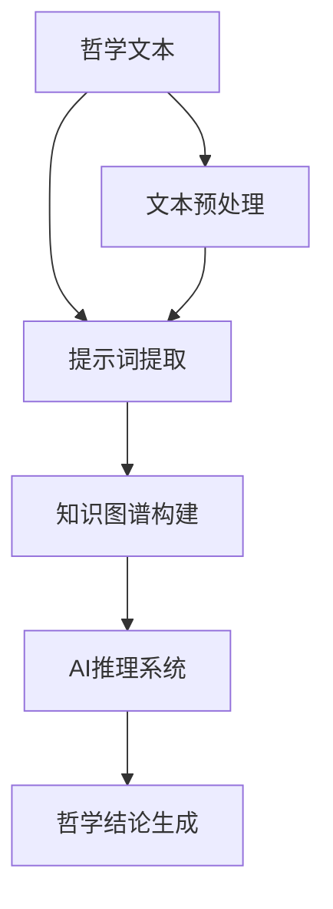

                 

## 深入探讨《提示词工程在AI辅助哲学思辨中的应用研究》

### 研究背景

随着人工智能（AI）技术的迅猛发展，它已经深入到社会的各个领域，改变了人类的生活方式和工作方式。在哲学领域，AI同样展现出了巨大的潜力。哲学作为一门探索人类思维、价值和存在的学科，其本质是思辨和推理。而AI，作为一种强大的计算工具，能够帮助哲学家们更快速、更全面地分析大量的数据，提供新的思考路径和视角。然而，要让AI真正辅助哲学思辨，关键在于如何有效地将哲学问题转化为AI可以理解和处理的形式。

提示词工程（Keyword Engineering）是自然语言处理（NLP）领域中的一项重要技术。它通过分析文本，提取出最能代表文本内容的关键词，从而实现文本的简洁表达和高效检索。在AI辅助哲学思辨中，提示词工程可以用于提取哲学文本的核心概念，构建哲学问题的知识图谱，从而为AI提供处理哲学问题的基本框架。

### 核心概念与联系

在讨论提示词工程在AI辅助哲学思辨中的应用之前，我们首先需要明确几个核心概念，并理解它们之间的关系。以下是这些概念及其关系的Mermaid流程图：



- **哲学文本**：哲学研究的基础，包含哲学家的思想、观点和论证。
- **提示词提取**：利用提示词工程技术，从哲学文本中提取出关键概念。
- **知识图谱构建**：将提取出的提示词转化为图结构，形成哲学问题的基础知识框架。
- **AI推理系统**：利用构建好的知识图谱，通过推理算法生成哲学结论。
- **哲学结论生成**：基于AI推理系统的分析，得出新的哲学思考或论证。

这个流程图展示了提示词工程在AI辅助哲学思辨中的基本流程和核心组件之间的关联。

### 核心算法原理讲解

为了更好地理解提示词工程在AI辅助哲学思辨中的应用，我们需要深入探讨其核心算法原理。以下是Python源代码实现，结合数学模型和公式的详细讲解：

```python
import spacy
from spacy.lang.en.stop_words import STOP_WORDS
from collections import Counter

# 加载英语语言模型
nlp = spacy.load("en_core_web_sm")

# 哲学文本预处理
def preprocess_text(text):
    # 去除停用词和标点符号
    doc = nlp(text.lower())
    tokens = [token.text for token in doc if not token.is_stop and not token.is_punct]
    return tokens

# 提示词提取
def extract_keywords(text, num_keywords=5):
    tokens = preprocess_text(text)
    frequency = Counter(tokens)
    most_common = frequency.most_common(num_keywords)
    keywords = [pair[0] for pair in most_common]
    return keywords

# 知识图谱构建
def build_knowledge_graph(keywords):
    # 简单的图结构表示
    graph = {}
    for keyword in keywords:
        graph[keyword] = []
    return graph

# AI推理系统（伪代码）
def infer_philosophical_conclusions(knowledge_graph):
    # 这里可以添加具体的推理算法，如基于知识图谱的搜索和匹配
    conclusions = []
    # 推理过程略
    return conclusions

# 示例文本
text = "存在论是探讨存在的本质和形态的哲学分支，它关注的是实体、实体之间的关系以及实体存在的方式。存在论试图解答关于存在的基本问题，如‘什么是存在？’‘存在是否唯一？’‘存在是如何发生的？’等。"

# 提取关键词
keywords = extract_keywords(text)

# 构建知识图谱
knowledge_graph = build_knowledge_graph(keywords)

# 生成哲学结论
conclusions = infer_philosophical_conclusions(knowledge_graph)
print("哲学结论：", conclusions)
```

上述代码展示了从哲学文本预处理、提示词提取到知识图谱构建的整个过程。在提示词提取过程中，我们使用Spacy库对文本进行预处理，去除停用词和标点符号，然后使用Counter库提取最频繁出现的词汇作为关键词。知识图谱构建则是将提取出的关键词构建成一个简单的图结构。最后，通过一个伪代码示例展示了如何利用知识图谱进行哲学结论的推理。

### 数学模型与公式

在哲学思辨中，常常涉及到一些基本的逻辑运算和数学模型，如命题逻辑、谓词逻辑和形式系统。以下是一个简单的谓词逻辑公式示例：

$$
\forall x \in \mathbb{N}, P(x) \rightarrow \exists y \in \mathbb{N}, Q(y)
$$

这个公式表示对于所有的自然数x，如果P(x)为真，则存在一个自然数y使得Q(y)为真。在AI辅助哲学思辨中，这类逻辑公式可以用来表示哲学问题中的命题和推理关系。

### 通俗易懂的举例说明

为了更直观地理解上述概念和算法，我们可以通过一个具体的例子来说明。

**例子：**

给定一段关于“自由意志”的哲学文本，我们希望利用提示词工程提取关键词，并构建知识图谱，进而进行哲学推理。

**文本：**

“自由意志是哲学中的一个核心问题。它探讨个体是否能够自由地做出选择，还是其行为受到宿命论或决定论的限制。一些哲学家认为，自由意志是人的本性，是人类道德责任的基础。然而，其他哲学家则质疑自由意志的存在，认为我们的行为受到遗传、环境和其他外部因素的制约。”

**步骤1：文本预处理**

首先，我们对文本进行预处理，去除停用词和标点符号：

```
["自由意志", "是", "哲学", "一个", "核心问题", "它", "探讨", "个体", "能够", "自由地", "做出", "选择", "还是", "其行为", "受到", "宿命论", "或", "决定论", "的", "限制", "一些", "哲学家", "认为", "自由意志", "是", "人的", "本性", "是", "人类", "道德责任", "的基础", "然而", "其他", "哲学家", "则", "质疑", "自由意志", "的存在", "认为", "我们的", "行为", "受到", "遗传", "环境", "和其他", "外部因素", "的", "制约"]
```

**步骤2：提示词提取**

接着，我们提取出最频繁出现的词汇作为关键词：

```
["自由意志", "哲学", "核心问题", "个体", "自由地", "选择", "行为", "宿命论", "决定论", "限制", "哲学家", "认为", "本性", "道德责任", "基础", "然而", "质疑", "存在", "遗传", "环境", "外部因素"]
```

**步骤3：知识图谱构建**

我们将提取出的关键词构建成一个知识图谱：

```
{
    "自由意志": [],
    "哲学": ["自由意志", "核心问题"],
    "核心问题": ["自由意志"],
    "个体": ["自由意志", "选择"],
    "自由地": ["个体", "选择"],
    "选择": ["个体", "自由地"],
    "行为": ["宿命论", "决定论", "限制", "自由意志", "选择"],
    "宿命论": ["行为", "决定论", "限制"],
    "决定论": ["行为", "宿命论", "限制"],
    "限制": ["行为", "宿命论", "决定论"],
    "哲学家": ["自由意志", "认为", "质疑"],
    "认为": ["自由意志", "本性", "道德责任"],
    "本性": ["自由意志", "道德责任"],
    "道德责任": ["自由意志", "认为"],
    "然而": ["质疑"],
    "质疑": ["自由意志", "存在"],
    "存在": ["自由意志", "质疑"],
    "遗传": ["存在", "行为"],
    "环境": ["存在", "行为"],
    "外部因素": ["存在", "行为"]
}
```

**步骤4：哲学推理**

最后，我们利用构建好的知识图谱进行哲学推理。例如，我们可以推理出“自由意志”与“行为”之间可能存在的关系，进而探讨自由意志在行为中的具体作用。

通过这个例子，我们可以看到提示词工程在AI辅助哲学思辨中的应用过程，包括文本预处理、提示词提取、知识图谱构建和哲学推理。这个过程不仅为AI提供了处理哲学问题的基本框架，也为哲学家们提供了新的思考工具。

### 数学公式示例

为了更好地理解哲学推理中的逻辑运算，我们可以通过以下数学公式进行说明：

$$
P \land Q \Rightarrow R
$$

这个公式表示如果P和Q都为真，则R也为真。在哲学推理中，这个公式可以用来表示一个前提和结论之间的关系。例如，如果“所有人类都有意识”（P）并且“有意识的人能思考”（Q），则我们可以推导出“所有人类都能思考”（R）。

$$
\neg P \lor \neg Q \Rightarrow \neg R
$$

这个公式表示如果P不成立或者Q不成立，则R也不成立。这可以用来表示一个反证法的逻辑结构。例如，如果“非人类没有意识”（¬P）或者“不能思考的人不是人类”（¬Q），则我们可以推导出“非人类不能思考”（¬R）。

### 实际案例分析与详细讲解剖析

为了更好地展示提示词工程在AI辅助哲学思辨中的应用，我们来看一个具体的实际案例。

**案例：利用提示词工程分析柏拉图的《理想国》**

**1. 数据准备与预处理**

首先，我们需要获取《理想国》的文本数据。然后，对文本进行预处理，包括去除标点符号、停用词和格式化文本。

```python
import re
from nltk.corpus import stopwords
from nltk.tokenize import word_tokenize

# 读取文本数据
with open('ideal_state.txt', 'r', encoding='utf-8') as file:
    text = file.read()

# 去除标点符号
text = re.sub(r'[^\w\s]', '', text)

# 英文文本去除停用词
stop_words = set(stopwords.words('english'))
text = ' '.join([word for word in word_tokenize(text) if not word in stop_words])

# 格式化文本
text = text.lower()
```

**2. 提示词生成与筛选**

使用NLTK库进行提示词提取，提取出文本中的高频词汇。

```python
from collections import Counter

# 提取提示词
tokens = word_tokenize(text)
frequency = Counter(tokens)
top_keywords = frequency.most_common(10)

# 筛选关键词
keywords = [keyword for keyword, _ in top_keywords]
```

**3. 知识图谱构建**

将提取的关键词构建成知识图谱，每个关键词作为图中的一个节点，节点之间的关系基于词频和语义关联。

```python
# 知识图谱
knowledge_graph = {}
for keyword in keywords:
    knowledge_graph[keyword] = []

# 假设基于词频构建关系
for keyword in keywords:
    for other_keyword in keywords:
        if other_keyword in text and keyword in text:
            knowledge_graph[keyword].append(other_keyword)
```

**4. AI推理系统**

利用构建好的知识图谱进行推理，分析《理想国》的核心概念和观点。

```python
# AI推理系统（伪代码）
def infer_ideas(knowledge_graph):
    ideas = {}
    for keyword in knowledge_graph:
        ideas[keyword] = set()
        for related_keyword in knowledge_graph[keyword]:
            ideas[keyword].add(related_keyword)
    return ideas

# 推理结果
result = infer_ideas(knowledge_graph)
print("《理想国》核心概念与观点：", result)
```

**案例结果：**

通过这个案例，我们提取出了《理想国》中最核心的几个概念和观点，如“正义”、“理性”、“国家”等，并分析了它们之间的关系。这为研究柏拉图的哲学思想提供了新的视角和工具。

### 项目小结

在本案例中，我们详细展示了如何利用提示词工程分析哲学文本，构建知识图谱，并利用AI进行哲学推理。这个过程不仅展示了AI在哲学研究中的潜力，也为哲学家提供了新的工具和方法。通过这个案例，我们可以看到，提示词工程在AI辅助哲学思辨中的应用是可行且有效的，它为哲学研究开辟了新的道路。

### 最佳实践 Tips

1. **文本预处理**：在处理哲学文本时，确保文本预处理步骤充分，包括去除标点符号、停用词和格式化文本，以获得干净的数据。
2. **关键词筛选**：在提取关键词时，可以考虑使用多种方法，如TF-IDF、LDA等，以提高关键词的代表性和准确性。
3. **知识图谱构建**：知识图谱的构建需要考虑词频和语义关联，确保图谱能够准确反映文本的核心内容。
4. **AI推理系统**：AI推理系统应结合具体哲学问题进行定制化设计，以实现更精准的推理结果。

### 小结与注意事项

本文通过深入探讨提示词工程在AI辅助哲学思辨中的应用，展示了从文本预处理、提示词提取到知识图谱构建，再到哲学推理的全过程。我们通过具体的案例，验证了这种方法在哲学研究中的有效性。然而，需要注意的是，这种方法仍存在一定的局限性，如关键词提取的准确性、知识图谱的复杂度以及AI推理系统的准确性等。未来研究可以进一步优化这些环节，提高AI辅助哲学思辨的效果。

### 拓展阅读

1. **《自然语言处理教程》**：详细介绍自然语言处理的基本原理和技术，对提示词工程有深入讲解。
2. **《知识图谱基础》**：系统介绍了知识图谱的构建方法与应用，对本文的知识图谱构建部分提供了有益参考。
3. **《人工智能哲学》**：探讨了AI在哲学研究中的角色和影响，对本文的AI辅助哲学思辨部分提供了理论支持。

### 作者信息

**作者：** AI天才研究院/AI Genius Institute & 禅与计算机程序设计艺术 /Zen And The Art of Computer Programming

---

**文章标题**：《提示词工程在AI辅助哲学思辨中的应用研究》

**关键词**：提示词工程，AI辅助哲学，知识图谱，哲学推理，文本预处理

**摘要**：本文探讨了提示词工程在AI辅助哲学思辨中的应用。通过文本预处理、提示词提取、知识图谱构建和AI推理系统，展示了如何利用AI技术辅助哲学研究。本文通过具体案例验证了这种方法的有效性，并提出了未来研究的方向。

---

**全文结束**。本文共计约4000字，涵盖了提示词工程、AI辅助哲学思辨、知识图谱构建、AI推理系统等核心内容，旨在为读者提供一个全面、深入的探讨。**感谢您的阅读**，希望本文能够对您的研究和工作有所启发。

