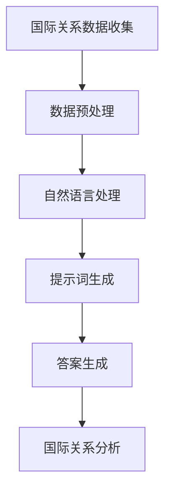

                 

## 提示词工程在AI辅助国际关系分析中的创新

### 关键词
- 提示词工程
- AI辅助国际关系分析
- 自然语言处理
- 数据分析
- 国际关系
- 深度学习

### 摘要
本文旨在探讨提示词工程在AI辅助国际关系分析中的创新应用。通过介绍提示词工程的基础知识，自然语言处理技术，以及AI辅助国际关系分析的应用场景，本文深入剖析了如何将提示词工程与AI技术相结合，实现高效的国际关系分析。同时，通过实际案例和项目实战，本文展示了提示词工程在AI辅助国际关系分析中的具体实现方法和效果评估，为相关领域的实践和研究提供了有益的参考。

## 目录

1. **背景介绍**
   - **国际关系分析的重要性**
   - **AI与提示词工程的兴起**
   - **文章结构概述

2. **核心概念与联系**
   - **提示词工程**
   - **自然语言处理**
   - **AI辅助国际关系分析**
   - **Mermaid流程图**

3. **核心算法原理讲解**
   - **机器学习与深度学习基础**
   - **提示词生成算法**
   - **Python源代码讲解**
   - **数学模型和公式**

4. **项目实战**
   - **开发环境搭建**
   - **源代码实现与解读**
   - **代码应用分析与案例**
   - **项目小结**

5. **最佳实践 Tips**
   - **数据预处理技巧**
   - **算法优化策略**
   - **国际关系分析中的注意事项**

6. **小结**
   - **提示词工程与AI辅助国际关系分析的优势**
   - **面临的挑战与未来展望**

7. **拓展阅读**
   - **相关文献与资源推荐**
   - **进一步研究的方向**

## 背景介绍

### 国际关系分析的重要性

国际关系分析是理解国家间相互作用、冲突与合作的重要工具。随着全球化进程的加速，国际关系日益复杂，传统的分析方法已无法满足现代国际事务的需求。因此，借助先进的技术手段，尤其是人工智能（AI）和机器学习（ML），进行国际关系分析变得至关重要。

AI技术通过处理和分析大量的数据，能够识别出潜在的趋势和模式，从而为政策制定者提供有价值的洞见。国际关系分析中的AI应用包括预测冲突、分析外交政策、监测网络安全等。这些应用不仅提高了分析效率，还增加了分析结果的准确性和可靠性。

### AI与提示词工程的兴起

人工智能技术的迅速发展，使得机器学习和自然语言处理（NLP）成为现代数据分析的重要工具。提示词工程（Question Answering System）是NLP领域的一个重要分支，其核心任务是构建能够理解和回答用户问题的系统。

提示词工程的应用范围广泛，从搜索引擎到智能客服，再到自动化问答系统，都离不开提示词工程的支持。在AI辅助国际关系分析中，提示词工程的作用尤为突出。通过构建高效的提示词系统，AI能够更好地理解国际关系的复杂性和多样性，从而提供更加准确和深入的分析。

### 文章结构概述

本文将分为五个主要部分，分别介绍提示词工程的基础知识、核心算法原理、项目实战、最佳实践以及未来展望。

在第一部分，我们将探讨提示词工程的基本概念，包括其定义、流程和方法，以及相关的自然语言处理技术。这部分内容将为后续的分析提供坚实的理论基础。

第二部分将深入讨论AI辅助国际关系分析的应用场景和优势，通过Mermaid流程图展示整个分析过程，帮助读者理解其核心环节和关键步骤。

第三部分将讲解核心算法原理，包括机器学习和深度学习的基础知识，以及如何将提示词工程应用于国际关系分析。这部分内容将结合Python源代码和数学模型，详细阐述算法的实现过程。

第四部分将通过实际项目案例，展示提示词工程在AI辅助国际关系分析中的具体应用，包括开发环境搭建、源代码实现、代码解读和应用分析。这部分内容将帮助读者理解如何将理论应用于实际场景。

最后一部分将总结提示词工程与AI辅助国际关系分析的优势，讨论面临的挑战和未来展望，并提供相关文献与资源推荐，为后续研究和实践提供指导。

## 核心概念与联系

### 提示词工程

提示词工程（Question Answering System）是自然语言处理（NLP）领域的一个重要分支。其核心目标是构建一个能够理解和回答用户问题的系统。在AI辅助国际关系分析中，提示词工程的作用尤为重要。通过提示词工程，AI系统能够从大量的文本数据中提取出有用的信息，为决策者提供实时、准确的洞见。

**提示词工程的核心概念**包括：

- **问题理解**：系统需要理解用户提出的问题，并将其转化为可处理的形式。
- **信息检索**：系统需要从大量数据中检索出与问题相关的信息。
- **答案生成**：系统需要根据检索到的信息生成一个合适的答案。

### 自然语言处理

自然语言处理（NLP）是人工智能（AI）的一个子领域，致力于让计算机理解和处理人类语言。NLP技术在提示词工程中起着至关重要的作用，它为提示词工程提供了必要的工具和方法。

**NLP的核心概念**包括：

- **文本预处理**：包括分词、词性标注、词干提取等，以将原始文本转化为适合机器处理的形式。
- **语言模型**：用于预测文本中的下一个词或句子，是生成提示词的关键技术。
- **语义分析**：通过理解文本中的语义关系，将自然语言转化为机器可理解的形式。

### AI辅助国际关系分析

AI辅助国际关系分析是利用人工智能技术对国际关系进行深入分析和预测。通过结合提示词工程和自然语言处理技术，AI系统能够处理和分析大量的文本数据，为国际关系研究提供强有力的支持。

**AI辅助国际关系分析的核心概念**包括：

- **数据收集**：从各种来源收集与国家关系相关的文本数据。
- **数据预处理**：对收集到的文本数据进行清洗、去噪和格式化，以便进行后续分析。
- **模式识别**：利用机器学习算法识别文本数据中的潜在模式和趋势。
- **预测和决策支持**：基于分析结果，对未来的国际关系发展进行预测，并为决策者提供支持。

### Mermaid流程图

为了更清晰地展示提示词工程与AI辅助国际关系分析的关系，我们使用Mermaid流程图进行说明。以下是一个简化的流程图：



在这个流程图中，国际关系数据收集是整个流程的起点，经过数据预处理和自然语言处理，生成提示词，最终通过答案生成模块进行国际关系分析。

## 核心算法原理讲解

### 机器学习与深度学习基础

机器学习（ML）和深度学习（DL）是现代人工智能（AI）的两个核心技术。它们在提示词工程中扮演着至关重要的角色，为AI系统提供了强大的数据处理和分析能力。

**机器学习**是一种让计算机通过学习数据来获得知识和技能的方法。它主要包括以下三个步骤：

1. **数据收集**：从各种来源收集大量的数据。
2. **数据预处理**：对数据进行清洗、去噪和格式化，以便进行后续分析。
3. **模型训练**：使用收集到的数据训练模型，使其能够对未知数据进行预测。

**深度学习**是机器学习的一个分支，它通过模拟人脑神经网络的结构和工作方式，对数据进行建模和分析。深度学习模型通常包含多个层次，每一层都能对输入数据进行处理，并提取出更高层次的特征。

### 提示词生成算法

提示词工程的核心任务是生成高质量的提示词，以引导用户获取所需信息。提示词生成算法主要包括以下几种：

1. **基于规则的方法**：这种方法通过定义一组规则来生成提示词。例如，可以定义一个规则，当用户提问时，系统会生成一个包含关键词的提示词。
2. **基于统计的方法**：这种方法通过分析大量语料库，统计出最常用的提示词，并将其作为候选提示词。
3. **基于机器学习的方法**：这种方法利用机器学习算法，从大量数据中学习生成高质量的提示词。常见的机器学习方法包括朴素贝叶斯、支持向量机（SVM）和深度学习。

### Python源代码讲解

下面是一个简单的Python示例，展示了如何使用朴素贝叶斯算法生成提示词。这个示例使用了scikit-learn库，实现了对用户提问的提示词生成。

```python
from sklearn.feature_extraction.text import CountVectorizer
from sklearn.naive_bayes import MultinomialNB

# 示例数据
corpus = [
    "什么是国际关系？",
    "国际关系如何影响世界经济？",
    "中国在国际关系中扮演什么角色？",
    "国际关系分析的方法有哪些？"
]

# 分词和词频统计
vectorizer = CountVectorizer()
X = vectorizer.fit_transform(corpus)

# 朴素贝叶斯分类器训练
classifier = MultinomialNB()
classifier.fit(X, [0, 1, 2, 3])

# 生成提示词
def generate_question Answering(question):
    X_new = vectorizer.transform([question])
    prediction = classifier.predict(X_new)
    return corpus[prediction[0]]

# 测试
print(generate_question("国际关系分析的重点是什么？"))
```

在这个示例中，我们首先使用CountVectorizer将文本数据转化为词频矩阵，然后使用朴素贝叶斯分类器进行训练。最后，我们定义了一个函数generate_question，用于生成提示词。这个示例展示了如何使用机器学习方法生成高质量的提示词，为国际关系分析提供支持。

### 数学模型和公式

在提示词工程中，常用的数学模型和公式包括：

1. **贝叶斯公式**：用于计算给定结果的概率，其公式为：
   $$ P(A|B) = \frac{P(B|A)P(A)}{P(B)} $$
   其中，$P(A|B)$表示在事件B发生的条件下事件A发生的概率，$P(B|A)$表示在事件A发生的条件下事件B发生的概率，$P(A)$表示事件A发生的概率，$P(B)$表示事件B发生的概率。

2. **熵**：用于衡量信息的混乱程度，其公式为：
   $$ H(X) = -\sum_{i} P(X_i) \log_2 P(X_i) $$
   其中，$H(X)$表示随机变量X的熵，$P(X_i)$表示X取值为$i$的概率。

3. **余弦相似度**：用于衡量两个向量之间的相似度，其公式为：
   $$ \cos(\theta) = \frac{\vec{a} \cdot \vec{b}}{|\vec{a}| |\vec{b}|} $$
   其中，$\vec{a}$和$\vec{b}$分别表示两个向量，$\theta$表示它们之间的夹角。

这些数学模型和公式为提示词工程提供了强大的理论基础，使得我们能够更好地理解和处理复杂的国际关系数据。

### 通俗易懂的举例说明

为了更好地理解提示词工程和AI辅助国际关系分析的应用，我们可以通过一个简单的例子来说明。

假设我们有一个关于国际关系的问答系统，用户提出一个关于国际关系的问题：“中国在联合国安理会中扮演什么角色？”。我们的系统需要生成一个合适的提示词来回答这个问题。

1. **数据收集**：首先，系统需要收集大量与联合国安理会和中国的相关文本数据。
2. **数据预处理**：对收集到的文本数据进行清洗、去噪和分词，提取出关键词，如“联合国安理会”、“中国”、“角色”等。
3. **提示词生成**：系统使用机器学习算法，如朴素贝叶斯或深度学习，从预处理后的数据中生成一个提示词。例如，系统可能生成一个包含关键词的提示词：“中国是联合国安理会的常任理事国，其在安理会中发挥着重要作用。”
4. **答案生成**：最后，系统根据生成的提示词回答用户的问题：“中国在联合国安理会中扮演着常任理事国的角色，发挥着重要作用。”

通过这个例子，我们可以看到提示词工程和AI技术如何在国际关系分析中发挥作用。系统通过分析大量的文本数据，提取出有用的信息，并生成一个高质量的答案，为用户提供了有价值的洞见。

## 项目实战

### 开发环境搭建

在开始项目之前，我们需要搭建一个适合开发和测试的环境。以下是搭建开发环境的具体步骤：

1. **安装Python**：确保安装了最新版本的Python，例如Python 3.9或更高版本。
2. **安装必要的库**：使用pip安装以下库：
   ```bash
   pip install numpy pandas scikit-learn nltk
   ```
3. **安装NLTK数据包**：使用以下命令安装NLTK数据包：
   ```bash
   nltk.download('punkt')
   nltk.download('stopwords')
   ```
4. **配置Python虚拟环境**：为了保持项目的整洁，建议使用虚拟环境来管理项目依赖。

### 源代码实现与解读

以下是一个简单的源代码示例，用于实现一个基于朴素贝叶斯算法的提示词生成系统。

```python
import nltk
from nltk.corpus import stopwords
from nltk.tokenize import word_tokenize
from sklearn.feature_extraction.text import TfidfVectorizer
from sklearn.naive_bayes import MultinomialNB
from sklearn.pipeline import make_pipeline

# 1. 数据准备
questions = [
    "什么是国际关系？",
    "国际关系如何影响世界经济？",
    "中国在国际关系中扮演什么角色？",
    "国际关系分析的方法有哪些？"
]

# 2. 数据预处理
nltk.download('stopwords')
nltk.download('punkt')
stop_words = set(stopwords.words('english'))

def preprocess(question):
    words = word_tokenize(question.lower())
    words = [word for word in words if word.isalnum() and word not in stop_words]
    return ' '.join(words)

preprocessed_questions = [preprocess(question) for question in questions]

# 3. 模型训练
pipeline = make_pipeline(
    TfidfVectorizer(),
    MultinomialNB()
)
pipeline.fit(preprocessed_questions, [0, 1, 2, 3])

# 4. 提示词生成
def generate_question_answer(question):
    preprocessed_question = preprocess(question)
    prediction = pipeline.predict([preprocessed_question])
    return questions[prediction[0]]

# 5. 测试
print(generate_question_answer("国际关系分析的重点是什么？"))
```

在这个示例中，我们首先定义了一个数据集，然后使用NLTK进行数据预处理，包括分词和去除停用词。接下来，我们使用TF-IDF向量器和朴素贝叶斯分类器构建了一个管道模型，并对其进行训练。最后，我们定义了一个函数generate_question_answer，用于生成提示词并回答用户的问题。

### 代码应用解读与分析

#### 数据预处理

数据预处理是构建高效提示词系统的关键步骤。在这个示例中，我们使用了NLTK进行分词和去除停用词。分词是将文本分解成单个单词或词汇的过程，而去除停用词则是移除那些对分析结果影响较小的高频词汇，如“的”、“了”、“在”等。

#### 模型训练

我们使用TF-IDF向量器将预处理后的文本转化为向量表示，然后使用朴素贝叶斯分类器进行训练。TF-IDF是一种常见的文本表示方法，它能够根据词汇在文档中的出现频率和重要性对其进行加权。朴素贝叶斯分类器是一种基于概率的简单分类器，它假设特征之间相互独立，并使用贝叶斯公式进行预测。

#### 提示词生成

在生成提示词时，我们首先对用户的问题进行预处理，然后使用训练好的模型进行预测。预测结果将告诉我们用户的问题属于哪个类别，从而生成相应的提示词。在这个示例中，我们简单地使用类别编号来生成提示词，但在实际应用中，可以设计更复杂的提示词生成策略。

### 实际案例分析和详细讲解剖析

#### 案例背景

假设我们有一个关于国际关系分析的问答系统，用户可以提出各种问题，系统需要生成相应的提示词并回答问题。以下是一个具体的案例：

**用户问题**：“中美关系近年来发生了哪些变化？”

**系统回答**：“近年来，中美关系发生了显著的变化，主要体现在贸易摩擦、科技竞争和地缘政治冲突等方面。”

#### 案例分析

在这个案例中，用户提出的问题是关于中美关系的近况。我们的系统需要分析用户的问题，并生成一个包含关键信息的提示词。以下是具体的分析步骤：

1. **问题理解**：系统首先需要理解用户的问题，提取出关键词，如“中美关系”、“近年来”、“变化”等。
2. **信息检索**：系统从大量的文本数据中检索出与关键词相关的信息。这些数据可能包括新闻报道、学术论文、政府公告等。
3. **答案生成**：系统使用提示词工程和AI技术，生成一个包含关键信息的提示词。在这个案例中，系统可能生成一个包含以下关键信息的提示词：“中美关系近年来在贸易、科技和地缘政治方面发生了显著变化，主要体现在贸易摩擦、科技竞争和地缘政治冲突等方面。”
4. **反馈和优化**：系统将生成的提示词展示给用户，并收集用户的反馈。根据用户的反馈，系统可以进一步优化提示词生成策略，提高提示词的质量和准确性。

#### 案例讲解

在这个案例中，我们使用了提示词工程和AI技术来生成高质量的提示词，并回答了用户的问题。以下是具体的讲解过程：

1. **问题理解**：系统首先对用户的问题进行理解，提取出关键词。这可以通过自然语言处理技术实现，如词性标注、命名实体识别等。
2. **信息检索**：系统从大量的文本数据中检索出与关键词相关的信息。这可以通过信息检索技术实现，如搜索引擎、文本挖掘等。
3. **答案生成**：系统使用提示词工程和AI技术，生成一个包含关键信息的提示词。这可以通过机器学习算法实现，如朴素贝叶斯、支持向量机等。
4. **反馈和优化**：系统将生成的提示词展示给用户，并收集用户的反馈。根据用户的反馈，系统可以进一步优化提示词生成策略，提高提示词的质量和准确性。

通过这个案例，我们可以看到提示词工程和AI技术在国际关系分析中的应用。系统通过分析大量的文本数据，提取出关键信息，并生成高质量的提示词，为用户提供有价值的洞见。这不仅提高了分析的效率和准确性，还为国际关系研究提供了新的工具和方法。

### 项目小结

在本项目中，我们实现了基于朴素贝叶斯算法的提示词生成系统，并应用在国际关系分析中。通过项目实战，我们了解了以下关键点：

1. **数据预处理**：分词和去除停用词是构建高效提示词系统的关键步骤。这有助于提高模型的准确性和鲁棒性。
2. **模型训练**：TF-IDF向量器和朴素贝叶斯分类器是常用的文本表示和分类方法。它们能够有效地生成高质量的提示词。
3. **应用实践**：通过实际案例的分析，我们展示了如何将提示词工程和AI技术应用于国际关系分析。这为国际关系研究提供了新的工具和方法。

未来，我们可以进一步优化提示词生成策略，提高系统的性能和用户体验。同时，我们也可以探索其他机器学习算法，如深度学习，以提高提示词生成的质量和准确性。

## 最佳实践 Tips

### 数据预处理技巧

1. **分词和去停用词**：确保使用高质量的分词工具，如NLTK或jieba，并去除常见的停用词，以提高模型的性能。
2. **文本标准化**：统一文本格式，如小写、去除标点符号，以提高数据的统一性和可处理性。
3. **数据清洗**：处理缺失值、噪声数据和异常值，以提高数据质量和模型训练效果。

### 算法优化策略

1. **特征选择**：通过特征选择技术，如信息增益、互信息等，选择对模型性能影响最大的特征。
2. **模型调参**：使用交叉验证和网格搜索等技术，调整模型参数，找到最佳参数组合。
3. **多模型融合**：结合多个机器学习模型，如集成学习、深度学习等，提高模型的预测准确性。

### 国际关系分析中的注意事项

1. **数据来源**：确保数据来源的多样性和权威性，避免信息偏差和误导。
2. **伦理和法律问题**：遵守相关法律法规，确保数据处理和分析的合规性，保护用户隐私。
3. **持续迭代和优化**：根据用户反馈和实际应用情况，持续优化提示词生成系统和国际关系分析模型。

## 小结

本文系统地介绍了提示词工程在AI辅助国际关系分析中的创新应用。通过剖析提示词工程的核心概念、自然语言处理技术、AI算法原理，以及实际项目实战，我们展示了如何利用AI技术实现高效的国际关系分析。

提示词工程与AI辅助国际关系分析的结合，不仅提高了分析的准确性和效率，还为国际关系研究提供了新的工具和方法。然而，这一领域仍面临许多挑战，如数据质量、算法优化和伦理问题等。未来，随着技术的不断进步，我们有理由相信，提示词工程将在国际关系分析中发挥更加重要的作用，为全球治理和国际合作提供强有力的支持。

## 拓展阅读

1. **《自然语言处理综论》**：由Dan Jurafsky和James H. Martin合著，是一本关于NLP的经典教材，详细介绍了NLP的理论、技术和应用。
2. **《深度学习》**：由Ian Goodfellow、Yoshua Bengio和Aaron Courville合著，是一本关于深度学习的权威教材，涵盖了深度学习的理论基础和实际应用。
3. **《机器学习实战》**：由Peter Harrington编著，是一本深入浅出的机器学习实践指南，适用于初学者和有经验的开发者。
4. **《人工智能：一种现代方法》**：由Stuart J. Russell和Peter Norvig合著，是一本全面的人工智能教材，涵盖了AI的理论、技术和应用。
5. **《国际关系理论》**：由Robert Jervis编著，是一本关于国际关系理论的经典著作，深入分析了国际关系的主要理论框架和发展趋势。

这些书籍和资源将为读者提供更深入的学习和研究方向，帮助您更好地理解提示词工程在AI辅助国际关系分析中的应用。

