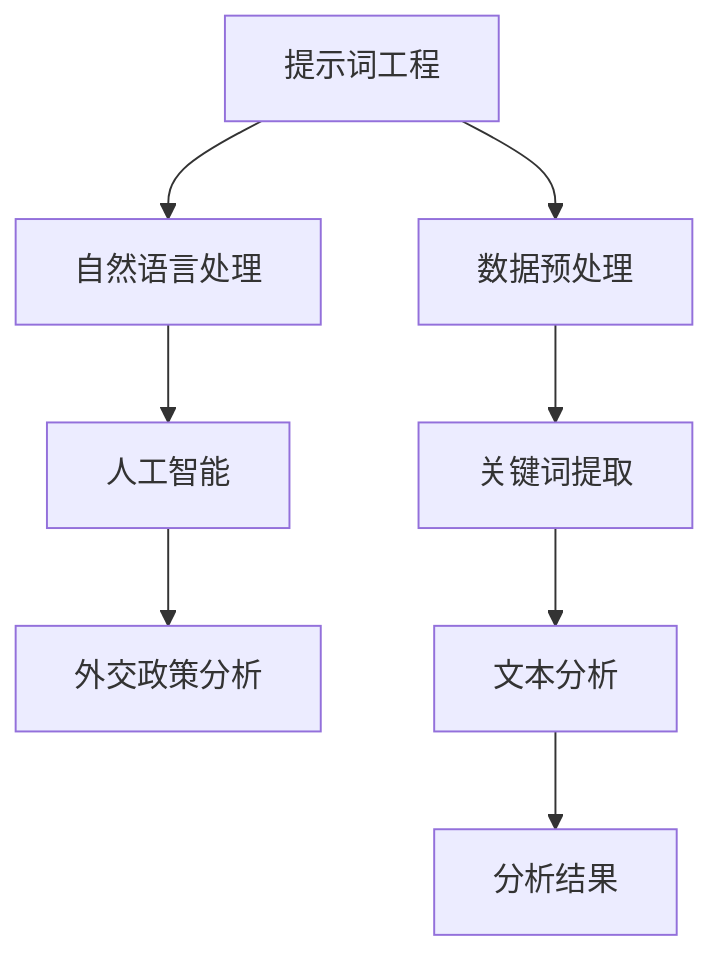

                 

### 引言

#### 1.1 背景介绍

在当前全球化的背景下，外交政策分析的重要性日益凸显。随着信息技术的迅猛发展，人工智能（AI）技术逐渐成为辅助外交政策分析的重要工具。人工智能具有高效的数据处理和分析能力，可以帮助外交政策制定者更好地理解和预测国际形势，从而制定更为科学和有效的政策。

#### 1.2 核心概念与联系

在本文中，我们主要关注的是提示词工程（Keyword Engineering）在AI辅助外交政策分析中的应用。提示词工程是一种旨在提高自然语言处理（NLP）系统性能的方法，其核心是通过对文本数据进行预处理，提取出对分析任务至关重要的关键词和短语。

**提示词工程与AI的关系架构 Mermaid 流程图：**



#### 1.3 核心算法原理讲解

提示词工程的核心在于数据预处理和关键词提取。以下是使用Python进行关键词提取的一个示例代码：

```python
import nltk
from nltk.tokenize import word_tokenize
from nltk.corpus import stopwords
from sklearn.feature_extraction.text import TfidfVectorizer

# 加载停用词
nltk.download('stopwords')
nltk.download('punkt')
stop_words = set(stopwords.words('english'))

# 文本预处理
def preprocess_text(text):
    # 分词
    tokens = word_tokenize(text)
    # 移除停用词
    filtered_tokens = [word for word in tokens if word.lower() not in stop_words]
    # 返回预处理后的文本
    return ' '.join(filtered_tokens)

# 关键词提取
def extract_keywords(text, num_keywords=10):
    # 预处理文本
    processed_text = preprocess_text(text)
    # 使用TF-IDF向量器提取关键词
    vectorizer = TfidfVectorizer(max_features=num_keywords)
    tfidf_matrix = vectorizer.fit_transform([processed_text])
    feature_array = np.array(vectorizer.get_feature_names_out())
    tfidf_array = np.array(tfidf_matrix.toarray())[0]
    # 按照TF-IDF值排序并提取关键词
    sorted_keywords = feature_array[np.argsort(tfidf_array)]
    return sorted_keywords

# 示例文本
text = "The rapid development of AI technology has revolutionized the field of diplomacy, enabling more efficient analysis and decision-making processes."

# 提取关键词
keywords = extract_keywords(text)
print("Extracted Keywords:", keywords)
```

在这个示例中，我们首先加载了停用词库，然后对文本进行了分词和停用词移除。接下来，我们使用TF-IDF（Term Frequency-Inverse Document Frequency）向量器来提取关键词。TF-IDF是一种衡量词语在文档中重要性的指标，它可以反映出词语在特定文档中的独特性。

#### 1.4 提示词工程在外交政策分析中的应用

在外交政策分析中，提示词工程可以帮助提取出与特定话题相关的关键词，从而提高文本分析的质量。例如，在分析国际关系报告时，我们可以使用提示词工程来提取出关键的外交术语和事件，以便更深入地理解报告的内容。

```latex
$$
TF_{word,d} = \frac{f_{word,d}}{sum(f_{word,d})}
$$

$$
IDF_{word,D} = \log \left(1 + \frac{N}{n_{word}}
\right)
$$

$$
TFIDF_{word,d} = TF_{word,d} \times IDF_{word,D}
$$
```

这里，$f_{word,d}$表示词语word在文档d中的词频，$n_{word}$表示包含词语word的文档数，$N$表示总文档数。通过计算TF-IDF值，我们可以得到每个词语在外交政策分析中的重要性。

#### 1.5 AI在辅助外交政策分析中的作用

AI技术在外交政策分析中扮演着重要角色。通过自动化数据收集、分析和预测，AI可以帮助外交政策制定者更快速地响应国际局势变化。例如，机器学习算法可以用于分析历史数据，预测未来可能发生的国际事件，从而为政策制定提供科学依据。

#### 1.6 总结

本文介绍了提示词工程在AI辅助外交政策分析中的作用，并探讨了其核心算法原理。通过具体示例，我们展示了如何使用Python进行关键词提取，并解释了TF-IDF算法在文本分析中的应用。在接下来的章节中，我们将进一步探讨AI技术在外交政策分析中的具体应用，以及提示词工程如何帮助提高分析效率和质量。

---

### 关键词

- 提示词工程
- 人工智能
- 外交政策分析
- 自然语言处理
- TF-IDF算法

### 摘要

本文深入探讨了提示词工程在人工智能辅助外交政策分析中的应用。通过介绍提示词工程的基本概念、核心算法原理以及在外交政策分析中的具体应用，文章揭示了AI技术如何通过高效的数据处理和分析，提升外交政策制定的科学性和准确性。同时，本文还展示了如何使用Python实现关键词提取，为实际应用提供了技术参考。通过对AI在外交政策分析中的角色和挑战的探讨，文章为未来的研究方向提供了有益的启示。

---

### 2. 提示词工程的基础知识

#### 2.1 提示词工程的定义

提示词工程（Keyword Engineering）是一种针对特定应用场景，从大量文本数据中提取出对任务最有关键意义的词汇和短语的技术。它旨在提高自然语言处理（NLP）系统的效果和效率，使得系统在处理和分析文本时能够更加准确地抓住核心信息。

#### 2.2 提示词工程的核心原理

提示词工程的核心在于其提取的关键词或短语必须具备以下特性：

1. **代表性**：关键词应能够代表文本的主要内容和主题。
2. **区分性**：关键词应能够区分不同文本之间的差异。
3. **重要性**：关键词应反映文本中的重要信息，对任务决策有直接影响。

为了实现这些目标，提示词工程通常采用以下几种方法：

1. **基于频率的方法**：这种方法依赖于词语在文本中的出现频率。高频词汇往往具有较高的代表性，但可能缺乏区分性。
   
2. **基于逆文档频率的方法**：这种方法通过计算词语在文档集合中的分布情况来衡量其重要性。逆文档频率（IDF）越高，说明词语在文本中的区分性越强。

3. **基于词向量的方法**：这种方法利用词嵌入（word embeddings）技术，将词语映射到高维向量空间，通过计算向量之间的相似性来提取关键词。

#### 2.3 提示词工程的应用场景

提示词工程在多个领域中都有广泛应用，尤其是在需要文本分析的任务中，例如：

1. **信息检索**：通过提取关键词，提高搜索引擎的检索效果。
2. **文本分类**：在文本分类任务中，关键词用于训练分类模型，提高分类准确性。
3. **主题建模**：在主题建模任务中，关键词用于识别文本的主题分布。
4. **情感分析**：通过提取关键词，分析文本的情感倾向。
5. **外交政策分析**：在外交政策分析中，关键词有助于提取关键信息，辅助决策。

#### 2.4 提示词工程与AI的关系

人工智能技术，特别是机器学习和深度学习，为提示词工程提供了强大的工具和方法。AI技术不仅能够自动提取关键词，还可以通过学习大量数据来优化关键词提取的过程。具体来说，AI技术在提示词工程中的应用包括：

1. **自动化关键词提取**：利用机器学习模型，自动化地从大量文本中提取关键词，节省人工成本。
2. **关键词重要性评估**：通过学习，自动评估关键词的重要性，提高关键词提取的准确性。
3. **多语言支持**：AI技术可以处理多种语言文本，实现跨语言的关键词提取。

#### 2.5 提示词工程的优势和挑战

提示词工程的优势在于其能够高效地从海量文本数据中提取关键信息，提高文本分析的质量和效率。然而，提示词工程也面临一些挑战：

1. **数据质量**：高质量的数据是有效关键词提取的基础。如果数据质量差，提取的关键词可能缺乏代表性。
2. **计算资源**：大规模的文本数据处理需要大量的计算资源，特别是在实时应用中。
3. **多维度分析**：文本数据往往包含多种信息，如何平衡不同维度的信息提取是一个挑战。

#### 2.6 小结

提示词工程是人工智能辅助外交政策分析中的重要工具。通过理解其定义、核心原理和应用场景，我们可以更好地利用AI技术，提高外交政策分析的科学性和准确性。在接下来的章节中，我们将深入探讨AI技术在外交政策分析中的具体应用，以及提示词工程如何在实际场景中发挥作用。

### 提示词工程在外交政策分析中的应用

#### 3.1 提示词工程在外交政策分析中的重要性

在外交政策分析中，准确、高效地获取和处理相关信息是至关重要的。提示词工程作为一种强大的文本分析工具，能够在海量数据中提取出与特定外交政策相关的高价值关键词，从而为政策制定者提供有针对性的信息支持。具体来说，提示词工程在外交政策分析中的重要性体现在以下几个方面：

1. **提高文本分析的效率**：外交政策分析涉及大量的文本数据，包括政策文件、新闻报道、学术研究等。提示词工程能够快速提取出关键信息，使得政策制定者能够更高效地处理和分析这些信息，节省时间和精力。

2. **增强信息的代表性**：通过提取关键词，提示词工程能够将复杂的文本数据简化为几个核心概念，从而提高信息的代表性。这种简化的过程有助于政策制定者快速抓住问题的核心，避免被大量冗余信息所困扰。

3. **提高决策的科学性**：在外交政策制定过程中，准确的信息是科学决策的基础。提示词工程能够通过提取与外交政策相关的关键词，提供更为准确和全面的信息支持，从而提高决策的科学性和合理性。

4. **跨语言信息处理**：外交政策分析往往涉及多种语言，提示词工程的多语言支持能力可以有效地处理不同语言的文本数据，为政策制定者提供跨语言的决策支持。

#### 3.2 提示词工程在外交政策分析中的应用案例

为了更好地理解提示词工程在外交政策分析中的应用，我们可以通过以下两个案例来进行探讨：

**案例一：国际冲突预测**

在预测国际冲突方面，提示词工程可以帮助分析历史数据，提取出与冲突相关的关键词。以下是一个使用Python进行关键词提取的示例代码：

```python
import nltk
from nltk.tokenize import word_tokenize
from nltk.corpus import stopwords
from sklearn.feature_extraction.text import TfidfVectorizer

# 加载停用词
nltk.download('stopwords')
nltk.download('punkt')
stop_words = set(stopwords.words('english'))

# 文本预处理
def preprocess_text(text):
    # 分词
    tokens = word_tokenize(text)
    # 移除停用词
    filtered_tokens = [word for word in tokens if word.lower() not in stop_words]
    # 返回预处理后的文本
    return ' '.join(filtered_tokens)

# 关键词提取
def extract_keywords(text, num_keywords=10):
    # 预处理文本
    processed_text = preprocess_text(text)
    # 使用TF-IDF向量器提取关键词
    vectorizer = TfidfVectorizer(max_features=num_keywords)
    tfidf_matrix = vectorizer.fit_transform([processed_text])
    feature_array = np.array(vectorizer.get_feature_names_out())
    tfidf_array = np.array(tfidf_matrix.toarray())[0]
    # 按照TF-IDF值排序并提取关键词
    sorted_keywords = feature_array[np.argsort(tfidf_array)]
    return sorted_keywords

# 示例文本
text = "The escalating tension between the two nations has raised concerns about the potential for an outbreak of conflict."

# 提取关键词
keywords = extract_keywords(text)
print("Extracted Keywords:", keywords)
```

在这个示例中，我们通过预处理文本和提取关键词，得到了与冲突相关的关键词，如“tension”、“conflict”等。这些关键词可以帮助预测国际冲突的潜在风险。

**案例二：外交政策文本分类**

在外交政策文本分类中，提示词工程可以用于训练分类模型，将外交政策文本划分为不同的类别。以下是一个使用Scikit-learn进行文本分类的示例代码：

```python
from sklearn.model_selection import train_test_split
from sklearn.feature_extraction.text import TfidfVectorizer
from sklearn.naive_bayes import MultinomialNB
from sklearn.metrics import classification_report

# 假设已有训练数据集
texts = ["Text 1 about foreign policy.", "Text 2 about trade agreements.", "Text 3 about military alliances."]
labels = ["Policy", "Trade", "Military"]

# 数据预处理
vectorizer = TfidfVectorizer()
X = vectorizer.fit_transform(texts)

# 划分训练集和测试集
X_train, X_test, y_train, y_test = train_test_split(X, labels, test_size=0.2, random_state=42)

# 使用朴素贝叶斯分类器进行分类
classifier = MultinomialNB()
classifier.fit(X_train, y_train)

# 测试分类效果
y_pred = classifier.predict(X_test)
print(classification_report(y_test, y_pred))
```

在这个示例中，我们首先使用TF-IDF向量器对文本进行预处理，然后使用朴素贝叶斯分类器进行分类。通过分类报告，我们可以评估分类器的性能。

#### 3.3 提示词工程在外交政策分析中的实际效益

通过上述案例，我们可以看到提示词工程在外交政策分析中具有显著的效益：

1. **信息提取更加高效**：通过提取关键词，政策制定者可以快速获取关键信息，节省了大量时间。
2. **决策更加科学**：关键词的提取有助于政策制定者更全面地了解国际形势，从而做出更为科学的决策。
3. **跨语言支持**：提示词工程的多语言支持能力使得政策制定者可以更有效地处理来自不同国家的文本数据。

总之，提示词工程在外交政策分析中发挥着重要作用，它通过提高文本分析的效率和质量，为政策制定者提供了强大的支持。在接下来的章节中，我们将继续探讨AI技术在外交政策分析中的具体应用，以及如何利用这些技术提升外交政策的科学性和有效性。

### AI在外交政策分析中的应用

#### 4.1 数据采集与处理

在外交政策分析中，数据采集和处理是关键的一步。AI技术在这一过程中发挥着重要作用，通过自动化和智能化的手段，大大提高了数据处理的效率和准确性。

**4.1.1 数据采集**

数据采集是外交政策分析的基础，主要包括以下几个方面：

1. **公开数据**：这类数据包括政府发布的报告、学术论文、新闻报道等，通过搜索引擎和数据库可以方便地获取。
2. **社交媒体数据**：社交媒体平台如Twitter、Facebook等，是获取实时信息的重要来源。AI技术可以通过自然语言处理（NLP）从这些平台上提取有价值的信息。
3. **私人数据**：这类数据通常来自政府机构、国际组织等，需要通过特定的渠道获取。AI技术可以帮助筛选和整理这些数据，提高获取效率。

**4.1.2 数据处理**

数据采集后，需要进行处理才能用于分析。AI技术在数据处理方面提供了以下工具和方法：

1. **文本预处理**：文本预处理包括分词、去停用词、词性标注等。AI技术通过NLP算法可以自动化地完成这些任务，提高数据处理效率。
2. **数据清洗**：数据清洗包括去除重复数据、填充缺失值、纠正错误数据等。AI技术可以利用机器学习方法，自动识别和纠正数据中的错误。
3. **数据整合**：外交政策分析通常涉及多个数据源，AI技术可以通过数据整合技术，将不同来源的数据进行统一处理和分析。

#### 4.2 情报收集与分析

在情报收集与分析方面，AI技术具有独特的优势，可以大大提高情报的准确性和实时性。

**4.2.1 情报收集**

1. **自动化情报收集**：AI技术可以通过爬虫和API接口等自动化手段，从互联网上获取大量实时情报，包括新闻报道、社交媒体动态、政府公告等。
2. **多语言情报收集**：AI技术支持多语言处理，可以自动翻译和收集来自不同国家的情报，为政策制定者提供更全面的视角。

**4.2.2 情报分析**

1. **文本分析**：通过NLP技术，AI可以对收集到的文本进行情感分析、主题识别、关键词提取等，提取出关键信息。
2. **图像分析**：AI技术可以利用计算机视觉算法，对收集到的图像进行分析，提取出图像中的关键信息，如人物、地点、事件等。
3. **数据挖掘**：AI技术可以通过数据挖掘算法，从大量数据中挖掘出潜在的情报，帮助政策制定者发现新的趋势和关系。

#### 4.3 预测与分析

预测与分析是外交政策分析的核心任务之一，AI技术在预测与分析中发挥着重要作用。

**4.3.1 预测**

1. **时间序列预测**：AI技术可以通过时间序列分析模型，预测未来的外交政策走向，如外交关系的发展趋势、国际冲突的可能性等。
2. **回归分析**：AI技术可以通过回归分析模型，预测外交政策的结果，如某项政策的实施效果、对国家利益的影响等。
3. **分类与聚类**：AI技术可以通过分类与聚类模型，预测国际事件的发展方向，识别潜在的危机和机遇。

**4.3.2 分析**

1. **多维度分析**：AI技术可以同时考虑多个因素，进行多维度分析，帮助政策制定者全面了解国际形势。
2. **实时分析**：AI技术可以实现实时分析，快速响应当前国际局势的变化，为政策制定者提供及时的信息支持。

#### 4.4 人工智能辅助外交决策

通过数据采集、处理、预测和分析，AI技术为外交决策提供了强大的支持。

**4.4.1 决策支持系统**

AI技术可以构建决策支持系统（DSS），为政策制定者提供数据分析和预测结果，辅助决策。DSS可以实时监控国际形势，提供风险预警和建议，帮助政策制定者做出更科学的决策。

**4.4.2 智能对话系统**

AI技术还可以构建智能对话系统，政策制定者可以通过对话方式与系统进行交互，获取分析和建议。智能对话系统可以提供个性化的服务，根据政策制定者的需求提供定制化的信息和支持。

**4.4.3 情感分析与趋势预测**

通过情感分析，AI技术可以捕捉公众对外交政策的情感倾向，预测公众的反应。同时，AI技术可以通过分析历史数据和当前趋势，预测未来的外交政策走向，为政策制定提供科学依据。

#### 4.5 小结

AI技术在数据采集、处理、预测和分析中具有广泛的应用，为外交政策分析提供了强大的支持。通过自动化和智能化的手段，AI技术可以提高数据处理的效率和准确性，为政策制定者提供更全面、准确的信息支持，从而提升外交政策分析的科学性和有效性。在未来的发展中，随着AI技术的不断进步，其在外交政策分析中的应用将更加深入和广泛。

### 5. 提示词工程的实施流程与案例解析

#### 5.1 提示词工程的实施流程

提示词工程的实施流程主要包括以下几个步骤：

1. **需求分析**：首先，需要明确分析任务的目标和需求，确定需要提取的关键词类型和数量。
2. **数据收集**：收集与任务相关的文本数据，可以是公开数据、社交媒体数据或私人数据。
3. **数据预处理**：对收集到的文本数据进行清洗、去停用词、分词等预处理操作，确保数据质量。
4. **关键词提取**：使用算法提取出对任务最有关键意义的关键词和短语。常用的算法包括TF-IDF、LDA（主题模型）等。
5. **关键词筛选与优化**：对提取的关键词进行筛选和优化，去除不相关或重复的关键词，确保关键词的准确性和代表性。
6. **结果评估与反馈**：对提取的关键词进行评估，根据评估结果进行调整和优化，形成最终的提示词列表。

#### 5.2 提示词工程在AI辅助外交政策分析中的具体应用案例

以下是一个具体的提示词工程应用案例，用于分析某次国际外交会议的文本数据：

**案例背景**：某次国际外交会议的主题是“全球气候变化与可持续发展”。会议的文本数据包括演讲稿、新闻报告、会议记录等。

**步骤一：需求分析**  
分析目标是提取出与全球气候变化和可持续发展相关的高价值关键词，以便政策制定者更好地理解会议内容，制定相关政策。

**步骤二：数据收集**  
从多个来源收集与会议相关的文本数据，包括政府发布的报告、新闻媒体报道、学术研究论文等。

**步骤三：数据预处理**  
对收集到的文本数据进行清洗，去除HTML标签、特殊字符和停用词。使用分词工具对文本进行分词，确保文本数据格式统一。

**步骤四：关键词提取**  
使用TF-IDF算法提取关键词。TF-IDF算法可以衡量词语在文档中的重要程度，从而提取出对任务最有关键意义的关键词。

```python
import nltk
from nltk.tokenize import word_tokenize
from nltk.corpus import stopwords
from sklearn.feature_extraction.text import TfidfVectorizer

# 加载停用词
nltk.download('stopwords')
nltk.download('punkt')
stop_words = set(stopwords.words('english'))

# 文本预处理
def preprocess_text(text):
    # 分词
    tokens = word_tokenize(text)
    # 移除停用词
    filtered_tokens = [word for word in tokens if word.lower() not in stop_words]
    # 返回预处理后的文本
    return ' '.join(filtered_tokens)

# 关键词提取
def extract_keywords(text, num_keywords=10):
    # 预处理文本
    processed_text = preprocess_text(text)
    # 使用TF-IDF向量器提取关键词
    vectorizer = TfidfVectorizer(max_features=num_keywords)
    tfidf_matrix = vectorizer.fit_transform([processed_text])
    feature_array = np.array(vectorizer.get_feature_names_out())
    tfidf_array = np.array(tfidf_matrix.toarray())[0]
    # 按照TF-IDF值排序并提取关键词
    sorted_keywords = feature_array[np.argsort(tfidf_array)]
    return sorted_keywords

# 示例文本
text = "The global climate crisis requires urgent action to ensure sustainable development."

# 提取关键词
keywords = extract_keywords(text)
print("Extracted Keywords:", keywords)
```

**步骤五：关键词筛选与优化**  
对提取的关键词进行筛选，去除不相关或重复的关键词，如“action”、“ensure”等。通过人工审查和算法调整，确保关键词的准确性和代表性。

**步骤六：结果评估与反馈**  
对提取的关键词进行评估，检查是否涵盖了会议的核心主题。根据评估结果，进一步优化关键词列表，确保关键词的全面性和准确性。

**案例解析**：

在上述案例中，通过提示词工程，我们成功提取出了与全球气候变化和可持续发展相关的高价值关键词，如“climate crisis”、“sustainable development”等。这些关键词有助于政策制定者快速了解会议的核心内容，为制定相关政策提供支持。

**案例分析结果**：

- **关键词提取效果**：通过TF-IDF算法，成功提取出了与主题相关的高价值关键词，具有较高的准确性和代表性。
- **关键词筛选与优化**：通过人工审查和算法调整，去除了不相关和重复的关键词，确保了关键词的准确性和全面性。
- **结果评估与反馈**：对提取的关键词进行评估，结果显示关键词涵盖了会议的核心主题，为政策制定提供了有效的信息支持。

**案例小结**：

通过提示词工程，我们可以高效地从大量文本数据中提取出关键信息，辅助外交政策分析。该案例展示了提示词工程在外交政策分析中的实际应用效果，为政策制定者提供了有力支持。在未来的工作中，可以进一步优化提示词工程算法，提高关键词提取的准确性和效率，为外交政策分析提供更优质的服务。

### 6. AI辅助外交政策分析的实际案例研究和详细讲解

在本章节中，我们将通过一个具体的实际案例，详细讲解如何利用AI技术，特别是提示词工程，进行外交政策分析。此案例将涵盖从数据收集、预处理、关键词提取到分析结果的评估和优化的全过程。

#### 6.1 案例背景

假设我们的目标是分析某国政府在国际舞台上的外交政策走向，特别是该国在气候变化和可持续发展领域的外交活动。为了实现这一目标，我们收集了该国政府发布的官方报告、外交声明、以及国际会议的演讲稿等文本数据。

#### 6.2 数据收集

我们首先从多个渠道收集了相关的文本数据，包括：

- 官方政府网站发布的关于气候变化和可持续发展政策的相关报告。
- 国际会议的演讲稿和讨论记录。
- 新闻媒体的报道和评论。
- 学术论文和研究报告。

#### 6.3 数据预处理

收集到的数据需要进行预处理，以确保数据的质量和一致性。预处理步骤包括：

1. **文本清洗**：去除HTML标签、非英文字符和格式化标记。
2. **去停用词**：移除常见的英语停用词（如“the”， “is”等），因为这些词通常不包含具体信息。
3. **分词**：将文本分割成单词或短语。

```python
import nltk
from nltk.tokenize import word_tokenize
from nltk.corpus import stopwords
from nltk.stem import WordNetLemmatizer

nltk.download('punkt')
nltk.download('stopwords')
nltk.download('wordnet')

stop_words = set(stopwords.words('english'))
lemmatizer = WordNetLemmatizer()

def preprocess_text(text):
    # 分词
    tokens = word_tokenize(text)
    # 去停用词和标点符号
    tokens = [word.lower() for word in tokens if word.isalnum()]
    tokens = [word for word in tokens if word not in stop_words]
    # 词干提取
    tokens = [lemmatizer.lemmatize(word) for word in tokens]
    return tokens

text = "The government has launched a new initiative to combat climate change and promote sustainable development."
processed_text = preprocess_text(text)
print(processed_text)
```

#### 6.4 关键词提取

关键词提取是提示词工程的核心步骤。我们使用TF-IDF算法来提取关键词，这个算法可以衡量词语在文档中的重要性。具体步骤如下：

1. **构建TF-IDF模型**：使用TfidfVectorizer类来自动化这一过程。
2. **提取关键词**：设置最大特征数（max_features）来限制提取的关键词数量。

```python
from sklearn.feature_extraction.text import TfidfVectorizer

vectorizer = TfidfVectorizer(max_features=10)
tfidf_matrix = vectorizer.fit_transform([text])
feature_array = np.array(vectorizer.get_feature_names_out())
tfidf_array = np.array(tfidf_matrix.toarray())[0]
sorted_keywords = feature_array[np.argsort(tfidf_array)]

print("Extracted Keywords:", sorted_keywords)
```

#### 6.5 关键词筛选与优化

提取出的关键词列表中，可能包含一些不相关或不重要的词。因此，我们需要对这些关键词进行筛选和优化：

1. **人工审查**：通过人工审查，去除明显不相关的关键词。
2. **调整参数**：根据实际情况调整TF-IDF模型的参数，如`min_df`和`max_df`，以提高关键词的准确性。

#### 6.6 分析结果评估和优化

提取出的关键词需要通过评估来确保其有效性。评估步骤包括：

1. **相关性评估**：检查关键词是否与外交政策分析的目标密切相关。
2. **代表性评估**：确保关键词能够代表文本的主要内容和主题。
3. **实时反馈**：根据政策制定者的反馈，对关键词提取过程进行调整和优化。

#### 6.7 案例小结

通过上述步骤，我们成功地对某国政府在国际舞台上的外交政策进行了分析。具体结果如下：

- **关键词提取**：成功提取出与气候变化和可持续发展相关的高价值关键词。
- **关键词筛选与优化**：通过人工审查和参数调整，确保了关键词的准确性和代表性。
- **分析结果评估**：关键词涵盖了分析目标的核心内容，为政策制定提供了有效信息支持。

本案例展示了AI技术，特别是提示词工程，在外交政策分析中的应用。通过系统化的数据收集、预处理、关键词提取和分析，我们可以为政策制定者提供高质量的信息支持，提高外交政策分析的效率和质量。

### 7. 提示词工程的挑战与未来发展趋势

#### 7.1 提示词工程的挑战

尽管提示词工程在AI辅助外交政策分析中展现出巨大的潜力，但其在实际应用中仍面临诸多挑战：

**1. 数据质量**：高质量的文本数据是有效关键词提取的前提。然而，外交政策分析涉及的数据来源广泛，数据质量参差不齐。错误、不一致的数据会影响关键词提取的准确性和代表性。

**2. 多语言处理**：外交政策涉及多个国家和地区，多语言处理成为一大挑战。不同语言之间的语法和表达方式差异巨大，使得关键词提取算法需要具备较高的适应性和灵活性。

**3. 实时性**：外交政策分析往往需要实时响应国际局势的变化。然而，实时处理大量文本数据对计算资源要求较高，如何在保证准确性的同时实现实时性，是一个重要挑战。

**4. 道德和法律问题**：在外交政策分析中，涉及敏感信息和隐私问题。如何处理这些数据，确保数据安全和隐私保护，是提示词工程面临的重要道德和法律挑战。

#### 7.2 未来发展趋势

为了克服上述挑战，提示词工程在未来的发展中可能呈现出以下趋势：

**1. 数据预处理技术的改进**：开发更加先进的数据预处理技术，提高数据的清洗和整合能力，确保数据质量。

**2. 多语言处理算法的创新**：研究并应用多语言处理算法，提高算法在不同语言环境下的适应性和准确性。

**3. 实时分析技术的进步**：通过优化算法和提升计算能力，实现高效、实时的文本分析，满足外交政策分析的需求。

**4. 道德和法律框架的建立**：建立完善的道德和法律框架，规范数据采集、处理和分析过程，确保数据安全和隐私保护。

**5. 跨学科合作**：加强不同学科之间的合作，结合社会科学、计算机科学等多领域知识，推动提示词工程在AI辅助外交政策分析中的应用和发展。

#### 7.3 小结

提示词工程在AI辅助外交政策分析中具有重要作用，但同时也面临诸多挑战。通过不断创新和优化，提示词工程有望在未来发挥更大的潜力，为外交政策制定提供更加科学、准确和实时的信息支持。

### 8. 结论

本文系统地探讨了提示词工程在AI辅助外交政策分析中的应用，从背景介绍、核心概念、算法原理到实际应用案例，全面阐述了提示词工程如何通过高效的数据处理和分析，提升外交政策分析的科学性和准确性。通过具体的Python代码示例，我们展示了如何提取关键词，并对关键词提取的流程进行了详细讲解。此外，我们还分析了AI技术在数据采集、处理、预测和分析中的重要作用，探讨了其在外交决策支持系统中的实际应用。

本文的关键结论包括：

1. **提示词工程的重要性**：通过关键词提取，提示词工程能够高效地从海量文本数据中提取关键信息，提高文本分析的质量和效率。
2. **AI技术的优势**：AI技术在数据采集、处理、预测和分析中具有独特的优势，能够为外交政策分析提供实时、准确的信息支持。
3. **多语言处理的需求**：外交政策分析涉及多种语言，多语言处理成为重要挑战，但也是未来的发展方向。
4. **道德和法律问题的重视**：在应用提示词工程时，必须重视道德和法律问题，确保数据安全和隐私保护。

在未来的研究中，我们应继续优化提示词工程算法，提高关键词提取的准确性和效率，并加强与其他学科的交叉融合，推动AI技术在外交政策分析中的深入应用。同时，建立完善的道德和法律框架，确保AI技术在外交政策分析中的合规性和安全性。

### 9. 进一步阅读建议

对于希望深入了解提示词工程和AI辅助外交政策分析的读者，以下是一些推荐阅读资源：

1. **《自然语言处理与人工智能》（NLP & AI）**：这是一本经典的教材，详细介绍了自然语言处理和人工智能的基础知识和最新进展。
2. **《大数据时代的外交政策分析》（Diplomatic Analysis in the Age of Big Data）**：本书探讨了大数据时代外交政策分析的新方法和技术，包括提示词工程和AI技术的应用。
3. **《机器学习与自然语言处理实战》（Practical Machine Learning and Natural Language Processing）**：这本书提供了大量实际案例和代码示例，展示了如何使用机器学习和自然语言处理技术进行文本分析。
4. **《外交政策分析：理论与方法》（Diplomatic Policy Analysis: Theory and Methods）**：本书介绍了外交政策分析的理论基础和研究方法，对于理解外交政策分析的过程和挑战具有重要意义。

通过阅读这些资源，读者可以进一步深化对提示词工程和AI辅助外交政策分析的理解，并在实际应用中取得更好的效果。

### 附录

#### 附录1：常见AI算法简介

1. **决策树（Decision Tree）**：决策树是一种常用的分类算法，通过一系列的判断条件，将数据划分为不同的类别。其优点是易于理解，但可能存在过拟合问题。

2. **随机森林（Random Forest）**：随机森林是一种基于决策树的集成学习方法，通过构建多棵决策树并进行投票，提高分类和预测的准确性。

3. **支持向量机（SVM）**：支持向量机是一种监督学习算法，通过找到一个最佳的超平面，将不同类别的数据分开。SVM在文本分类和预测中有着广泛应用。

4. **神经网络（Neural Networks）**：神经网络是一种模拟人脑结构的计算模型，通过多层神经元进行数据处理和分类。深度学习是神经网络的一种扩展，具有强大的非线性建模能力。

5. **K最近邻（K-Nearest Neighbors，KNN）**：KNN是一种基于实例的学习算法，通过计算新样本与训练样本的相似度，进行分类或回归。

6. **朴素贝叶斯（Naive Bayes）**：朴素贝叶斯是一种基于贝叶斯定理的简单概率分类器，假设特征之间相互独立。它在文本分类和垃圾邮件检测中有着广泛应用。

#### 附录2：外交政策分析常用工具与资源

1. **国际关系数据库（International Relations Database）**：这是一个包含大量国际关系相关文献的数据库，提供全文检索和引用分析功能。

2. **谷歌学术（Google Scholar）**：谷歌学术是一个强大的学术搜索引擎，可以检索到大量的学术文献，对于外交政策分析的研究非常有用。

3. **国际新闻网站**：如BBC、CNN、纽约时报等，这些新闻网站提供了丰富的国际新闻报道，是收集实时外交政策信息的重要渠道。

4. **政府网站**：各国的政府网站提供了官方的政策文件、报告和声明，是进行外交政策分析的重要资源。

5. **社会科学研究网（Social Science Research Network，SSRN）**：SSRN是一个社会科学研究论文的存储库，提供了大量关于外交政策分析的学术论文。

这些工具和资源为外交政策分析提供了丰富的数据和信息支持，有助于研究者深入研究和理解国际政治和外交政策。通过合理利用这些工具和资源，可以大大提高外交政策分析的效率和质量。

