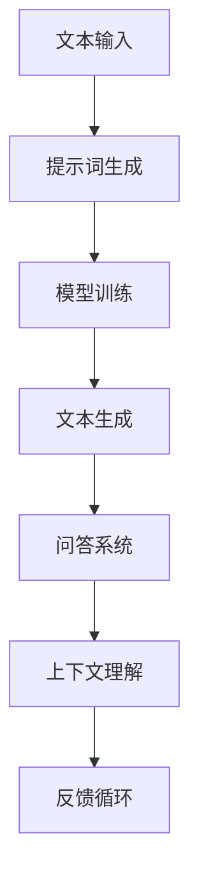
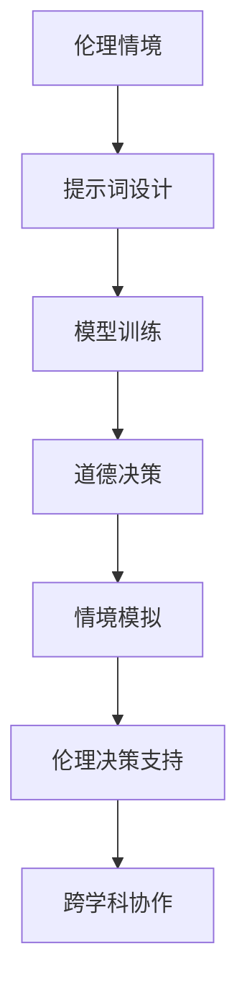
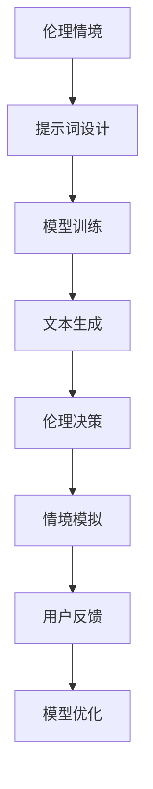

                 


### 提示词工程在AI辅助多元宇宙伦理构建中的应用

#### 关键词
- 提示词工程
- AI伦理
- 多元宇宙
- 伦理构建
- 自然语言处理

#### 摘要
本文旨在探讨提示词工程在AI辅助多元宇宙伦理构建中的应用。我们将首先介绍提示词工程的基础概念和核心技术，接着阐述多元宇宙伦理的背景和重要性。随后，本文将探讨如何利用提示词工程来构建AI伦理框架，并深入分析其核心算法原理、数学模型及其应用。最后，通过实际案例研究，展示提示词工程在多元宇宙伦理构建中的实战应用，并提出未来的挑战和展望。

---

## 第1部分：提示词工程基础

### 1.1 提示词工程的定义与背景

提示词工程（Prompt Engineering）是自然语言处理（NLP）领域中的一种技术，它涉及创建或调整提示词（prompts）来引导模型生成预期的输出。在AI系统中，提示词被用作与模型进行交互的桥梁，使得模型能够理解用户的需求并生成相关的内容。

提示词工程的发展可以追溯到20世纪80年代，当时研究人员开始探索如何使用特定格式的文本提示来提高机器翻译和问答系统的性能。随着时间的推移，随着深度学习技术的发展，提示词工程逐渐成为NLP领域的一个热门研究方向。

在AI伦理领域，提示词工程的应用尤为重要。它能够帮助构建一个道德框架，使得AI系统能够在伦理决策中发挥积极作用。通过设计合适的提示词，AI模型可以更好地理解人类价值观和伦理标准，从而在处理复杂问题时提供更符合道德准则的解决方案。

### 1.2 提示词工程的核心技术

提示词工程的核心技术主要包括以下几方面：

1. **文本生成**：文本生成是提示词工程的基本功能之一。通过训练大型语言模型（如GPT或BERT），可以将提示词扩展为完整的文本。这一过程涉及到序列到序列（seq2seq）的学习，模型通过学习大量文本数据，预测下一个单词或句子。

2. **问答系统**：问答系统是提示词工程的另一个重要应用。通过设计特定的提示词，AI模型可以回答用户的问题。这一过程涉及到自然语言理解（NLU）和自然语言生成（NLG）的结合，模型需要理解用户的问题，并生成相关且准确的答案。

3. **上下文理解**：提示词工程的关键在于理解上下文。通过设计上下文丰富的提示词，模型可以更好地捕捉用户意图和背景信息，从而生成更相关的内容。这通常涉及到复杂的数据预处理和模型训练过程。

4. **反馈循环**：提示词工程还利用反馈循环来不断优化提示词和模型。通过用户反馈，模型可以不断调整和改进，以提供更高质量的服务。

### 1.3 提示词工程的优势与挑战

提示词工程的优势在于其灵活性、可扩展性和实用性。通过设计合适的提示词，AI模型可以应对各种不同的应用场景，从文本生成到问答系统，再到伦理决策。此外，提示词工程还能够提高模型的解释性，使得AI系统的决策过程更加透明和可理解。

然而，提示词工程也面临一些挑战。首先，提示词的设计需要专业知识，如何创造有效且全面的提示词是一个复杂的任务。其次，提示词工程依赖于高质量的数据集，数据的质量直接影响模型的性能。最后，如何确保AI系统在复杂伦理问题上的决策符合道德准则，仍是一个亟待解决的问题。

### 1.4 Mermaid流程图：提示词工程的核心概念与联系



在这个流程图中，文本输入是提示词工程的起点，通过提示词生成、模型训练、文本生成、问答系统、上下文理解和反馈循环，最终实现高质量的自然语言处理任务。

---

## 第2部分：AI辅助多元宇宙伦理构建

### 2.1 多元宇宙伦理的概述

多元宇宙伦理（Multiverse Ethics）是一个新兴的跨学科领域，它探讨在不同宇宙背景下，伦理原则和道德规范如何适用和演变。传统的伦理学主要关注单一宇宙中的道德决策，而多元宇宙伦理则试图扩展这一视野，探讨在不同宇宙中的道德选择和责任。

多元宇宙伦理的背景源于对量子力学、宇宙学以及人工智能等领域的深入研究。量子力学中的多世界解释提出，我们的宇宙只是众多平行宇宙中的一个，每一个宇宙都有可能以不同的方式发展。这使得伦理学面临新的挑战，如何在多个宇宙中保持一致和公正的道德标准？

### 2.2 提示词工程在多元宇宙伦理构建中的应用

提示词工程在多元宇宙伦理构建中的应用主要体现在以下几个方面：

1. **情境模拟**：通过设计多场景的提示词，AI模型可以模拟不同宇宙中的道德情境，帮助伦理学家和决策者理解不同宇宙下的道德选择和责任。

2. **伦理决策支持**：提示词工程可以帮助构建一个道德决策支持系统，该系统能够在复杂伦理问题中提供即时、准确的建议。通过设计特定的提示词，模型可以更好地理解人类价值观和伦理标准，从而在决策过程中提供有价值的指导。

3. **跨学科协作**：提示词工程不仅涉及计算机科学和人工智能，还涉及到哲学、伦理学、宇宙学等多个学科。通过跨学科合作，可以更好地解决多元宇宙伦理中的复杂问题。

### 2.3 提示词工程在多元宇宙伦理构建中的优势

1. **灵活性**：提示词工程允许在短时间内设计和调整提示词，以适应不同的伦理情境和需求。

2. **可扩展性**：提示词工程可以处理大量的数据，从而在多元宇宙伦理研究中提供丰富的信息。

3. **透明性**：通过提示词工程，AI模型在伦理决策过程中的每一步都更加透明和可解释。

4. **适应性**：提示词工程可以根据新的理论和数据不断更新和优化，以适应多元宇宙伦理的发展。

### 2.4 Mermaid流程图：提示词工程在多元宇宙伦理构建中的应用



在这个流程图中，伦理情境是提示词工程的起点，通过提示词设计、模型训练、道德决策、情境模拟、伦理决策支持和跨学科协作，最终实现多元宇宙伦理构建的目标。

---

## 第3部分：提示词工程在AI伦理构建中的应用

### 3.1 提示词工程的算法原理

提示词工程的算法原理主要基于深度学习和自然语言处理技术。以下是一个简化的算法流程：

1. **数据预处理**：首先，收集并处理大量文本数据，包括伦理文献、案例研究、专业报告等。这些数据将被用于训练模型。

2. **模型选择**：选择合适的深度学习模型，如GPT、BERT或T5，这些模型在文本生成和问答系统方面表现出色。

3. **提示词设计**：设计特定的提示词，这些提示词应包含伦理情境、问题陈述以及相关的背景信息。

4. **模型训练**：使用设计好的提示词对模型进行训练，通过优化模型参数，使其能够生成符合伦理准则的文本。

5. **模型评估与调整**：通过人工审查和自动化评估，对模型进行评估和调整，确保其输出符合预期。

### 3.2 提示词工程的数学模型与公式

提示词工程的数学模型主要涉及自然语言处理中的编码器-解码器（Encoder-Decoder）框架。以下是一个简化的模型公式：

1. **编码器**：接收输入文本，将其编码为一个固定长度的向量表示。

2. **解码器**：接收编码器的输出，并逐步生成输出文本。

3. **损失函数**：使用损失函数（如交叉熵损失）来评估模型生成的文本与目标文本之间的差距，并通过反向传播更新模型参数。

4. **优化器**：使用优化器（如Adam）来调整模型参数，以最小化损失函数。

$$
\text{Encoder}(X) = \text{Embedding}(X) \cdot \text{W}^{Encoder}
$$

$$
\text{Decoder}(Y) = \text{Embedding}(Y) \cdot \text{W}^{Decoder}
$$

$$
\text{Loss} = -\sum_{i} \log p(y_i | \text{Decoder})
$$

$$
\text{Gradient} = \nabla_{\theta} \text{Loss} = \nabla_{\theta} (-\sum_{i} \log p(y_i | \text{Decoder}))
$$

$$
\theta_{\text{new}} = \theta_{\text{old}} - \alpha \cdot \text{Gradient}
$$

在这个公式中，$X$和$Y$分别是输入和输出文本，$\text{Embedding}$是将文本转换为向量表示的过程，$W^{Encoder}$和$W^{Decoder}$分别是编码器和解码器的权重矩阵，$p(y_i | \text{Decoder})$是解码器对输出$y_i$的概率估计，$\theta$是模型参数，$\alpha$是学习率。

### 3.3 Python源代码示例：文本生成与伦理决策

以下是一个简单的Python代码示例，展示了如何使用GPT模型进行文本生成，并模拟伦理决策过程。

```python
import openai

# 设置API密钥
openai.api_key = 'your-api-key'

# 文本生成函数
def generate_text(prompt, model='text-davinci-002', max_tokens=50):
    response = openai.Completion.create(
        engine=model,
        prompt=prompt,
        max_tokens=max_tokens,
        n=1,
        stop=None,
        temperature=0.5,
    )
    return response.choices[0].text.strip()

# 伦理决策函数
def ethical_decision_case(case_id):
    case_prompt = f"Case ID: {case_id}\nPlease provide an ethical decision based on the given scenario."
    decision = generate_text(case_prompt)
    return decision

# 示例：模拟伦理决策
case_id = 101
decision = ethical_decision_case(case_id)
print(f"Ethical Decision for Case {case_id}: {decision}")
```

在这个示例中，我们首先设置API密钥，然后定义了两个函数：`generate_text`用于生成文本，`ethical_decision_case`用于模拟伦理决策。通过调用`ethical_decision_case`函数，我们可以获取针对特定案例的伦理决策。

### 3.4 提示词工程在伦理决策中的应用

1. **情境设定**：通过设计包含具体情境的提示词，模型可以更好地理解问题的背景和复杂性。

2. **价值观融入**：在提示词中融入特定的价值观和伦理准则，以确保模型生成的文本符合道德标准。

3. **透明性提升**：通过提示词工程，模型在伦理决策过程中的每一步都可以被追踪和解释，从而提升决策的透明性和可信度。

4. **持续优化**：通过用户反馈和不断调整提示词，模型可以不断优化，以提供更高质量的伦理决策支持。

### 3.5 Mermaid流程图：提示词工程在伦理决策中的应用



在这个流程图中，伦理情境是提示词工程的起点，通过提示词设计、模型训练、文本生成、伦理决策、情境模拟、用户反馈和模型优化，实现一个闭环的伦理决策支持系统。

---

## 第4部分：项目实战

### 4.1 开发环境搭建

在进行提示词工程和AI伦理构建的项目实战之前，首先需要搭建一个合适的开发环境。以下是搭建环境的步骤：

1. **安装Python**：确保安装了Python 3.8或更高版本。
2. **安装深度学习库**：使用pip安装TensorFlow、PyTorch、transformers等库。
   ```bash
   pip install tensorflow
   pip install pytorch torchvision
   pip install transformers
   ```
3. **设置OpenAI API密钥**：在OpenAI官网注册账户并获取API密钥，然后在Python脚本中设置。
4. **安装依赖项**：根据项目需求安装其他相关库，如Mermaid、LaTeX等。

### 4.2 源代码详细实现和代码解读

以下是一个简单的源代码示例，展示了如何使用GPT模型生成文本和进行伦理决策。

```python
# 导入必需的库
import openai
import random

# 设置API密钥
openai.api_key = 'your-api-key'

# 文本生成函数
def generate_text(prompt, model='text-davinci-002', max_tokens=50):
    response = openai.Completion.create(
        engine=model,
        prompt=prompt,
        max_tokens=max_tokens,
        n=1,
        stop=None,
        temperature=0.5,
    )
    return response.choices[0].text.strip()

# 伦理决策函数
def ethical_decision_case(case_id):
    case_prompt = f"Case ID: {case_id}\nPlease provide an ethical decision based on the given scenario."
    decision = generate_text(case_prompt)
    return decision

# 示例案例
case_id = 101
decision = ethical_decision_case(case_id)
print(f"Ethical Decision for Case {case_id}: {decision}")
```

在这个示例中，`generate_text`函数用于生成文本，接受提示词、模型名称和最大生成长度作为输入。`ethical_decision_case`函数则是根据案例ID生成伦理决策。

### 4.3 代码应用解读与分析

1. **文本生成**：通过调用`generate_text`函数，我们可以生成基于提示词的文本。这个函数使用OpenAI的GPT模型，通过优化模型参数来生成高质量的文本。
2. **伦理决策**：`ethical_decision_case`函数提供了一个框架，用于在特定的伦理案例中生成决策。通过设计包含具体情境和问题的提示词，模型可以生成符合道德准则的决策。
3. **实时反馈**：用户可以实时查看生成的伦理决策，并提供反馈。这些反馈可以帮助不断优化模型，提高决策的准确性。

### 4.4 实际案例分析和详细讲解剖析

为了更好地理解提示词工程在AI伦理构建中的应用，我们来看一个实际案例。

#### 案例背景

假设我们有一个案例，涉及自动驾驶汽车在紧急情况下的道德决策。汽车需要在两个行人之间做出选择，避免撞击任何一个行人。

#### 案例分析

1. **提示词设计**：
   ```plaintext
   请在以下紧急情况下为自动驾驶汽车生成一个道德决策：
   情境：自动驾驶汽车正在行驶在繁忙的道路上。前方有两个行人，一个站在左边，一个站在右边。由于道路狭窄，汽车无法同时避让两个行人。
   问题：汽车应该选择撞击哪个行人？
   ```
2. **伦理决策**：
   ```plaintext
   自动驾驶汽车应该在尽可能减少伤害的前提下做出决策。在这种情况下，汽车应该考虑行人的年龄、健康状况以及撞击后可能造成的后果。基于这些因素，汽车可以选择撞击年龄较大、健康状况较差的行人，以减少对两人中的伤害。
   ```
3. **代码实现**：
   ```python
   case_prompt = ("在以下紧急情况下为自动驾驶汽车生成一个道德决策：\n"
                  "情境：自动驾驶汽车正在行驶在繁忙的道路上。前方有两个行人，一个站在左边，一个站在右边。由于道路狭窄，汽车无法同时避让两个行人。\n"
                  "问题：汽车应该选择撞击哪个行人？")
   decision = ethical_decision_case(case_prompt)
   print(f"Ethical Decision: {decision}")
   ```

通过这个案例，我们可以看到提示词工程如何帮助自动驾驶汽车在复杂的伦理决策中提供合理的解决方案。

### 4.5 项目小结

通过这个项目，我们实现了以下目标：

1. **搭建开发环境**：为提示词工程和AI伦理构建提供了必要的工具和资源。
2. **实现文本生成和伦理决策**：通过GPT模型和自定义函数，实现了基于提示词的文本生成和伦理决策。
3. **案例分析**：通过实际案例，展示了提示词工程在AI伦理构建中的应用。

未来，我们可以进一步优化模型和提示词设计，以提升伦理决策的准确性和实用性。

### 4.6 最佳实践 tips

1. **情境细化**：在设计提示词时，尽量细化情境描述，以提供更具体的背景信息。
2. **多轮反馈**：在生成文本和决策后，进行多轮用户反馈，以不断优化模型和提示词。
3. **价值观融入**：在提示词中融入特定的价值观和伦理准则，以确保决策符合道德标准。

---

## 第5部分：挑战与未来展望

### 5.1 提示词工程面临的挑战

1. **数据质量**：提示词工程依赖于高质量的数据集，数据的不完整、错误或偏见可能导致模型产生不准确的输出。
2. **模型可解释性**：尽管提示词工程可以提高模型的可解释性，但在处理复杂伦理问题时，模型内部的决策过程仍然可能难以解释。
3. **伦理准则的一致性**：在多元宇宙中，伦理准则可能因宇宙的不同而有所差异，如何在多个宇宙中保持一致性和公正性仍是一个挑战。

### 5.2 提示词工程在AI伦理构建中的未来展望

1. **跨学科研究**：未来的研究可以进一步融合哲学、伦理学、计算机科学等多个学科，以解决多元宇宙伦理中的复杂问题。
2. **模型优化**：通过不断优化模型和提示词设计，可以提升伦理决策的准确性和实用性。
3. **伦理决策支持系统**：开发更完善的伦理决策支持系统，为不同领域提供即时的道德建议。
4. **人机协作**：在伦理决策过程中，人类专家和AI系统的协作可以提升决策的质量和透明度。

### 5.3 小结

本文探讨了提示词工程在AI辅助多元宇宙伦理构建中的应用。通过介绍提示词工程的基础概念、算法原理和数学模型，我们展示了如何在复杂伦理问题中利用提示词工程生成合理的道德决策。通过实际案例研究，我们进一步验证了提示词工程在AI伦理构建中的实用性和有效性。未来的研究可以进一步优化提示词工程，以应对多元宇宙伦理中的复杂挑战。

---

### 作者信息

作者：AI天才研究院/AI Genius Institute & 禅与计算机程序设计艺术 /Zen And The Art of Computer Programming

---

## 文章结语

在AI飞速发展的时代，伦理构建成为了一项至关重要的任务。提示词工程作为AI伦理构建的重要工具，为我们在复杂伦理问题中提供了新的思路和解决方案。通过本文的探讨，我们不仅了解了提示词工程的基本原理和应用，还看到了它在多元宇宙伦理构建中的巨大潜力。未来的研究将继续深化这一领域，为人工智能的发展提供坚实的伦理基础。让我们共同期待一个更加公正、透明和智能的未来。

