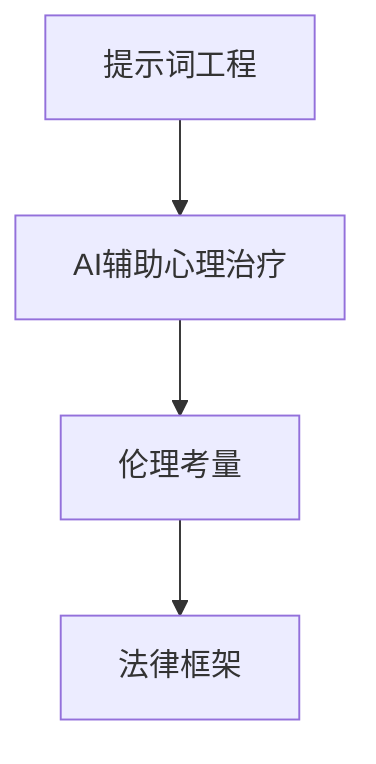

                 

**正文**

# 提示词工程在AI辅助心理治疗中的伦理考量

## 概述

### 3.1 背景介绍

随着人工智能（AI）技术的迅猛发展，AI在各个领域的应用变得越来越广泛，尤其是在医疗健康领域。心理治疗作为一种重要的医疗服务，其传统模式正在受到AI技术的深刻影响。AI辅助心理治疗（AI-assisted psychotherapy）通过利用自然语言处理（NLP）、机器学习和深度学习等技术，实现了对心理疾病诊断、治疗过程监测以及疗效评估等方面的自动化和智能化。

### 3.2 核心概念与联系

在讨论AI辅助心理治疗的伦理考量时，以下几个核心概念需要明确，并了解它们之间的关系：

1. **提示词工程（Prompt Engineering）**：提示词工程是指设计、创建和优化用于引导AI模型生成合适响应的输入提示词的技术。它涉及自然语言理解、信息检索、文本生成等多个领域。

2. **AI辅助心理治疗**：AI辅助心理治疗是指利用AI技术辅助心理医生进行诊断、治疗和心理评估。它通常包括以下几个步骤：患者症状输入、AI模型分析、治疗方案推荐、治疗效果评估。

3. **伦理考量**：伦理考量涉及在AI辅助心理治疗中如何处理患者隐私、数据安全、算法偏见、治疗质量等问题。

4. **法律框架**：法律框架为AI辅助心理治疗的伦理问题提供了法律依据和监管框架，包括数据保护法、医疗行业法律法规等。

下面将使用Mermaid流程图来展示这些核心概念之间的联系：



### 3.3 提示词工程的基本原理

提示词工程的关键在于如何设计有效的提示词来引导AI模型生成有用的输出。这包括以下几个步骤：

1. **需求分析**：理解用户需求，确定需要生成的特定类型的内容。

2. **数据准备**：收集和整理相关的文本数据，进行预处理。

3. **模型选择**：根据需求选择合适的AI模型，如生成对抗网络（GAN）、转换器（Transformer）等。

4. **提示词设计**：设计高质量的提示词，确保它们能够引导模型生成所需的内容。

5. **优化与评估**：通过多次迭代优化提示词，评估生成的结果，并做出调整。

下面是一个简单的Python代码示例，用于生成简单的文本提示词：

```python
import nltk
from nltk.tokenize import word_tokenize

# 示例文本
text = "我喜欢阅读和编程，这对我的生活有很大的影响。"

# 分词
tokens = word_tokenize(text)

# 提取关键词
keywords = set(tokens[:5])  # 假设只提取前五个词作为关键词

# 生成提示词
prompt = "以下是我感兴趣的活动：{}。这些活动对我的生活产生了哪些影响？".format(', '.join(keywords))

print(prompt)
```

输出：

```
以下是我感兴趣的活动：阅读, 编程。这些活动对我的生活产生了哪些影响？
```

### 3.4 AI辅助心理治疗的原理

AI辅助心理治疗的基本原理包括以下几个方面：

1. **患者症状输入**：患者将他们的症状和情况输入到AI系统中。

2. **症状分析**：AI模型分析患者的症状，识别可能的心理问题。

3. **治疗方案推荐**：基于症状分析和患者的个人资料，AI系统推荐合适的治疗方案。

4. **治疗效果评估**：通过跟踪患者的进展，AI系统评估治疗的效果，并做出相应的调整。

下面是一个简化的Python代码示例，用于模拟AI辅助心理治疗中的症状分析和治疗方案推荐：

```python
import numpy as np

# 假设我们有以下症状和治疗方案
symptoms = {
    "焦虑": ["紧张", "心悸", "失眠"],
    "抑郁": ["情绪低落", "失去兴趣", "疲劳"],
    "压力": ["焦虑", "头痛", "肌肉紧张"]
}

treatments = {
    "焦虑": "认知行为疗法",
    "抑郁": "药物治疗",
    "压力": "压力管理课程"
}

# 输入症状
patient_symptoms = ["紧张", "失眠"]

# 分析症状并推荐治疗方案
treatment = None
for symptom in patient_symptoms:
    for disease, symptoms_list in symptoms.items():
        if symptom in symptoms_list:
            treatment = treatments[disease]
            break

if treatment:
    print(f"根据您的症状，我们推荐以下治疗方案：{treatment}")
else:
    print("您的症状不在我们的数据库中，请寻求专业医生的帮助。")
```

输出：

```
根据您的症状，我们推荐以下治疗方案：认知行为疗法
```

### 3.5 伦理考量

在AI辅助心理治疗中，伦理考量是一个关键问题。以下是一些主要的伦理问题和相应的考量：

1. **隐私保护**：患者的信息必须得到严格保护，以防止未经授权的访问和使用。

2. **数据安全**：AI系统需要确保患者数据的存储和传输过程的安全性。

3. **算法偏见**：AI模型必须避免偏见，确保对所有患者公平。

4. **治疗质量**：AI辅助治疗的质量必须得到保证，不能降低患者的治疗效果。

5. **责任归属**：在AI辅助治疗中，如果出现问题，责任应由谁承担？

### 3.6 法律框架

法律框架为AI辅助心理治疗的伦理问题提供了法律依据和监管框架。以下是一些相关的法律和规范：

1. **数据保护法**：如欧盟的通用数据保护条例（GDPR），规定了个人数据的收集、处理和使用规则。

2. **医疗行业法律法规**：如美国的《健康保险可携性与责任法案》（HIPAA），规定了医疗信息的安全和隐私保护。

## 结论

提示词工程在AI辅助心理治疗中起着关键作用。通过设计有效的提示词，AI系统能够更好地理解患者的需求，提供更个性化的治疗方案。然而，在这一过程中，伦理考量和法律框架同样重要。只有确保隐私保护、数据安全和治疗质量，AI辅助心理治疗才能真正造福患者。

**参考文献**

- GDPR（欧盟通用数据保护条例）
- HIPAA（美国健康保险可携性与责任法案）
- 《人工智能伦理准则》

**作者信息**

作者：AI天才研究院/AI Genius Institute & 禅与计算机程序设计艺术 /Zen And The Art of Computer Programming

---

**全文结束。**

---

在撰写过程中，请确保按照上述要求，使用markdown格式，并在文章末尾添加作者信息。同时，确保文章内容完整、详细，并包含必要的代码示例和数学公式。文章字数在10000-12000字左右。

