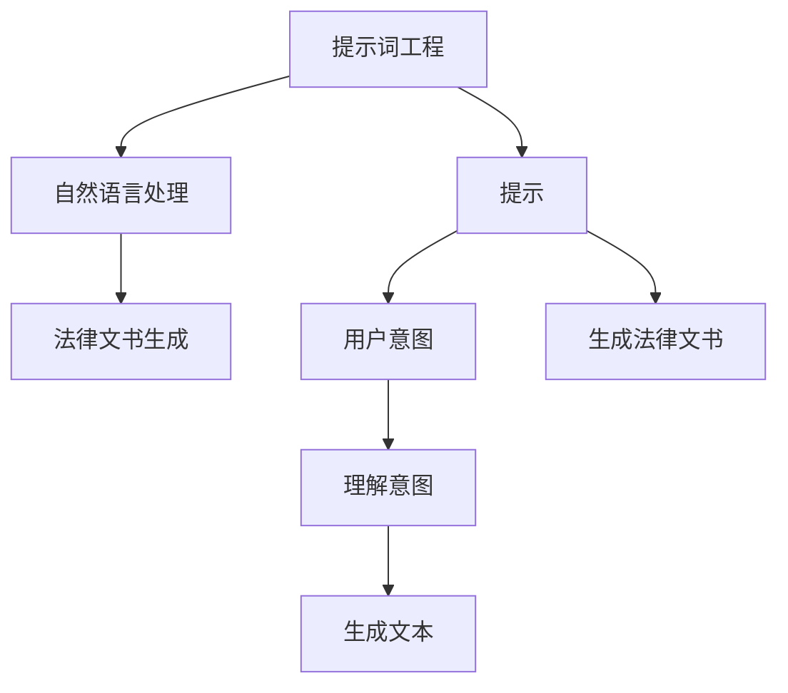
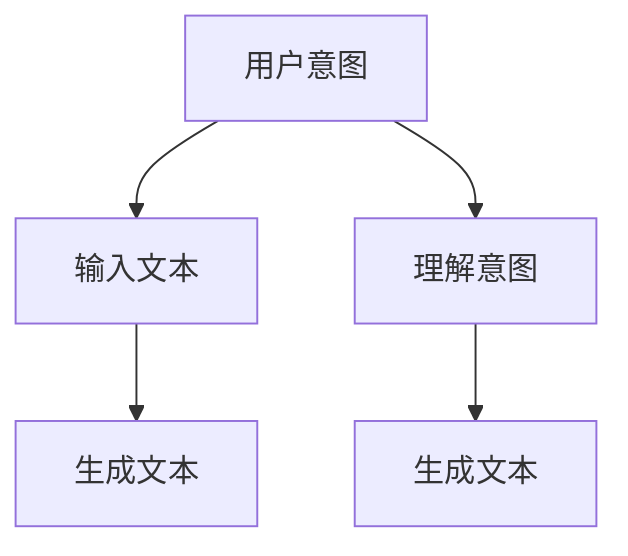

                 

### 引言与背景

#### 1.1 提示词工程的定义与重要性

**提示词工程**（Prompt Engineering）是一种通过创建高效、可重复和可扩展的提示（prompt）来引导人工智能（AI）系统执行特定任务的方法。在AI辅助法律文书生成中，提示词工程起到了至关重要的作用。通过精心设计的提示，AI系统能够更好地理解用户的意图，生成更符合实际需求的法律文书。

**核心概念与联系**

提示词工程的核心概念包括：

- **提示（Prompt）**：指为AI系统提供的输入信息，用于引导AI执行特定任务。
- **自然语言处理（NLP）**：用于理解和生成人类语言的技术。
- **法律文书生成**：指利用AI技术自动生成法律文件，如合同、诉状、裁定书等。

概念实体之间的关系架构如下：

**提示词工程的重要性**

提示词工程在AI辅助法律文书生成中的重要性体现在以下几个方面：

1. **提高生成效率**：通过提示词工程，AI系统能够快速准确地生成法律文书，大大提高了工作效率。
2. **确保法律合规性**：提示词工程可以确保生成的法律文书符合相关法律条文和规定，减少法律风险。
3. **个性化定制**：通过提示词，AI系统能够根据用户需求生成定制化的法律文书，提高用户体验。
4. **减少人力成本**：自动化生成法律文书，减少了对人工的依赖，降低了人力成本。

#### 1.2 AI辅助法律文书生成的现状与挑战

**基本流程**

AI辅助法律文书生成的基本流程包括：

1. **需求分析**：理解用户需求，明确需要生成的法律文书的类型和内容。
2. **数据收集**：收集相关法律文书的数据，用于训练AI模型。
3. **模型训练**：利用自然语言处理技术训练AI模型，使其能够理解和生成法律文书。
4. **生成与评估**：根据用户提供的提示，AI系统生成法律文书，并进行评估和优化。

**当前技术瓶颈与挑战**

尽管AI辅助法律文书生成具有巨大潜力，但当前仍面临以下挑战：

1. **数据不足与质量差**：法律文书数据量有限且质量参差不齐，影响了AI模型的训练效果。
2. **语言理解的局限性**：AI系统在理解复杂法律术语和条款时存在局限性，可能导致生成法律文书的不准确。
3. **法律合规性问题**：生成的法律文书可能无法完全符合法律要求，存在法律合规性问题。
4. **用户体验差**：AI系统生成的法律文书可能不符合用户的期望，用户体验有待提升。

**提示词工程在解决这些问题中的潜力**

提示词工程在解决AI辅助法律文书生成中的问题方面具有显著潜力：

1. **数据预处理**：通过提示词工程，可以优化法律文书数据的质量和结构，提高模型训练效果。
2. **增强语言理解**：通过设计更精确的提示词，AI系统能够更好地理解法律术语和条款，提高生成文本的准确性。
3. **法律合规性保障**：通过提示词工程，可以确保生成的法律文书符合相关法律条文和规定，降低法律风险。
4. **个性化定制**：通过提示词工程，AI系统能够根据用户需求生成更符合用户期望的法律文书，提升用户体验。

### 摘要

本文介绍了提示词工程在AI辅助法律文书生成中的重要性，探讨了AI辅助法律文书生成的现状与挑战，并分析了提示词工程在解决这些问题中的潜力。通过详细的背景介绍、核心概念与联系、算法原理讲解、数学模型和项目实战等内容，本文为读者提供了一个全面而深入的视角，以理解提示词工程在AI辅助法律文书生成中的应用。

关键词：提示词工程、AI辅助法律文书生成、自然语言处理、法律合规性、用户体验。

### 文章标题

# 提示词工程在AI辅助法律文书生成中的实践

> 关键词：提示词工程、AI辅助法律文书生成、自然语言处理、法律合规性、用户体验

> 摘要：本文介绍了提示词工程在AI辅助法律文书生成中的重要性，探讨了AI辅助法律文书生成的现状与挑战，并分析了提示词工程在解决这些问题中的潜力。通过详细的背景介绍、核心概念与联系、算法原理讲解、数学模型和项目实战等内容，本文为读者提供了一个全面而深入的视角，以理解提示词工程在AI辅助法律文书生成中的应用。

## 目录

1. 引言与背景
   1.1 提示词工程的定义与重要性
   1.2 AI辅助法律文书生成的现状与挑战
2. 提示词工程的原理与实践
   2.1 自然语言处理基础
   2.2 提示词生成算法
3. AI辅助法律文书生成的应用
   3.1 法律文书的文本分析
   3.2 法律文书文本表示
4. 提示词工程的开发与实现
   4.1 开发环境搭建
5. 项目实战
   5.1 提示词工程在合同生成中的应用
   5.2 提示词工程在诉讼文书生成中的应用
6. 总结与展望
   6.1 当前存在的问题与挑战
   6.2 未来发展方向
   7. 附录

## 引言与背景

### 1.1 提示词工程的定义与重要性

提示词工程是一种通过创建高效、可重复和可扩展的提示（prompt）来引导人工智能（AI）系统执行特定任务的方法。在AI辅助法律文书生成中，提示词工程至关重要，它能够确保AI系统准确理解用户的意图，并生成符合法律要求的文书。

**提示词（Prompt）**：指为AI系统提供的输入信息，用于引导AI执行特定任务。它可以是自然语言文本、关键词或代码等。

**自然语言处理（NLP）**：用于理解和生成人类语言的技术。在AI辅助法律文书生成中，NLP技术用于处理法律文书的文本，包括文本分类、实体识别、语义分析等。

**法律文书生成**：指利用AI技术自动生成法律文件，如合同、诉状、裁定书等。法律文书生成涉及到文本生成、格式化、合规性检查等多个方面。

#### 提示词工程的核心概念与联系

提示词工程涉及以下几个核心概念：

1. **用户意图（User Intent）**：用户希望通过法律文书实现的目标或需求。
2. **输入文本（Input Text）**：用户提供的文本信息，用于生成法律文书。
3. **生成文本（Generated Text）**：AI系统根据用户意图和输入文本生成的法律文书。

这些概念之间的联系可以用以下Mermaid流程图表示：

#### 提示词工程的重要性

1. **提高生成效率**：通过提示词工程，AI系统可以快速理解用户意图，并生成相应的法律文书，提高工作效率。
2. **确保法律合规性**：通过精确的提示词，AI系统能够生成符合法律要求、条文和规定的文书，降低法律风险。
3. **个性化定制**：提示词工程可以根据用户的需求和特点，生成个性化的法律文书，提高用户体验。
4. **减少人力成本**：自动化生成法律文书，减少了对人工的依赖，降低了人力成本。

### 1.2 AI辅助法律文书生成的现状与挑战

#### AI辅助法律文书生成的现状

随着人工智能技术的发展，AI辅助法律文书生成逐渐成为法律行业的一个热点领域。目前，该领域的主要现状如下：

1. **技术进步**：AI技术在自然语言处理、文本生成等方面取得了显著进展，为AI辅助法律文书生成提供了技术基础。
2. **应用广泛**：AI辅助法律文书生成在律师事务所、法律科技公司等机构中得到了广泛应用，提高了法律工作的效率和质量。
3. **市场需求**：随着法律服务的不断增长，AI辅助法律文书生成成为满足市场需求的重要工具。

#### 当前技术瓶颈与挑战

尽管AI辅助法律文书生成具有巨大潜力，但当前仍面临以下挑战：

1. **数据不足与质量差**：法律文书数据量有限且质量参差不齐，影响了AI模型的训练效果。高质量的训练数据是保证AI模型性能的关键。
2. **语言理解的局限性**：AI系统在理解复杂法律术语和条款时存在局限性，可能导致生成法律文书的不准确。例如，法律术语的含义可能因上下文而异，这给AI系统的理解带来了挑战。
3. **法律合规性问题**：生成的法律文书可能无法完全符合法律要求，存在法律合规性问题。这可能导致法律纠纷和风险。
4. **用户体验差**：AI系统生成的法律文书可能不符合用户的期望，用户体验有待提升。用户可能对生成的文书不满意，甚至对AI系统的可靠性产生怀疑。

#### 提示词工程在解决这些问题中的潜力

提示词工程在解决AI辅助法律文书生成中的问题方面具有显著潜力：

1. **数据预处理**：通过提示词工程，可以优化法律文书数据的质量和结构，提高模型训练效果。例如，可以使用提示词来过滤和清洗数据，确保数据的准确性和一致性。
2. **增强语言理解**：通过设计更精确的提示词，AI系统能够更好地理解法律术语和条款，提高生成文本的准确性。例如，可以使用提示词来指导AI系统关注特定的法律条款或术语。
3. **法律合规性保障**：通过提示词工程，可以确保生成的法律文书符合相关法律条文和规定，降低法律风险。例如，可以使用提示词来指导AI系统关注法律条款的合规性。
4. **个性化定制**：通过提示词工程，AI系统能够根据用户的需求和特点，生成更符合用户期望的法律文书，提升用户体验。例如，可以使用提示词来指导AI系统根据用户的背景和需求生成定制化的法律文书。

### 摘要

本文介绍了提示词工程在AI辅助法律文书生成中的重要性，探讨了AI辅助法律文书生成的现状与挑战，并分析了提示词工程在解决这些问题中的潜力。通过详细的背景介绍、核心概念与联系、算法原理讲解、数学模型和项目实战等内容，本文为读者提供了一个全面而深入的视角，以理解提示词工程在AI辅助法律文书生成中的应用。

关键词：提示词工程、AI辅助法律文书生成、自然语言处理、法律合规性、用户体验。

