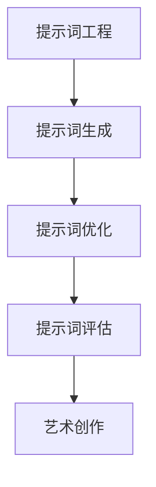

                 

## 引言

随着人工智能（AI）和量子计算技术的迅猛发展，二者在各个领域的融合应用日益广泛。在艺术创作领域，AI技术已经在绘画、音乐创作、写作等方面展现出了巨大的潜力。然而，量子计算作为一种全新的计算模式，其独特的并行处理能力和量子叠加态，为AI辅助艺术创作带来了全新的思路和机遇。

本文将探讨提示词工程在AI辅助量子艺术创作中的创新应用。首先，我们将介绍提示词工程的基本概念、背景和重要性。接着，深入讲解AI与量子艺术创作的结合原理，以及其在艺术创作中的应用。最后，我们将探讨创新在AI辅助量子艺术创作中的具体应用，并分析其中面临的挑战和解决方案。

本文将按照以下结构展开：

1. 提示词工程基础
   - 提示词工程的定义和作用
   - 提示词工程的基本原理
   - 提示词工程的发展历程
   - 提示词工程的应用领域

2. AI与量子艺术创作
   - AI的基本原理和应用
   - 量子艺术创作的特点
   - AI与量子艺术创作的结合原理
   - AI辅助量子艺术创作的案例研究

3. 创新在AI辅助量子艺术创作中的应用
   - 创新的概念和类型
   - 创新在AI辅助量子艺术创作中的价值
   - 创新在AI辅助量子艺术创作中的应用案例
   - 创新在AI辅助量子艺术创作中的挑战与解决方案

通过本文的探讨，我们希望为读者提供一个全面了解提示词工程在AI辅助量子艺术创作中创新应用的视角，同时为未来相关领域的研究和应用提供参考。

### 关键词

- 提示词工程
- AI辅助艺术创作
- 量子计算
- 创新应用
- 艺术创作

### 摘要

本文首先介绍了提示词工程的基本概念、背景和重要性。随后，探讨了AI与量子艺术创作的结合原理，并分析了其在艺术创作中的应用。最后，本文重点探讨了创新在AI辅助量子艺术创作中的应用，包括创新的概念、价值、应用案例以及面临的挑战和解决方案。通过本文的研究，我们期望为读者提供一个全面了解提示词工程在AI辅助量子艺术创作中创新应用的新视角。

### 1. 提示词工程基础

提示词工程是人工智能（AI）领域中一个重要的分支，它涉及如何使用提示词（prompt words）来指导AI模型生成内容。提示词工程的核心目的是提高AI模型在生成文本、图像、音乐或其他形式内容时的表现，使其更具创造性和实用性。

#### 1.1 提示词工程的定义和作用

提示词工程可以定义为：通过对提示词的设计、选择和优化，来提高AI模型生成内容的质量和效率的过程。提示词工程在AI辅助艺术创作中具有重要作用，主要体现在以下几个方面：

1. **引导AI模型的创作方向**：通过提供特定的提示词，可以引导AI模型在艺术创作中朝特定方向前进，避免生成无关或低质量的内容。
2. **提升创作效率**：提示词工程可以帮助AI模型快速生成大量内容，从而提高艺术创作的效率。
3. **增强创作灵活性**：提示词工程可以灵活调整提示词，以适应不同的艺术创作需求，从而提高AI模型的创作灵活性。
4. **优化创作质量**：通过优化提示词的设计和选择，可以显著提高AI模型生成内容的创意和质量。

#### 1.2 提示词工程的基本原理

提示词工程的基本原理主要涉及以下几个方面：

1. **提示词的生成**：提示词的生成是提示词工程的首要任务。常用的方法包括随机生成、基于规则生成和基于数据生成等。
2. **提示词的优化**：提示词的优化主要包括两个方面：一是优化提示词的内容，使其更符合艺术创作需求；二是优化提示词的表达方式，使其更易于被AI模型理解。
3. **提示词的评估**：提示词的评估是确保提示词质量和效果的重要手段。常用的评估方法包括人工评估和自动化评估。
4. **提示词的管理**：提示词的管理涉及对提示词的存储、检索和维护。有效的管理可以确保提示词的持续更新和优化。

#### 1.3 提示词工程的发展历程

提示词工程的发展历程可以追溯到20世纪80年代，当时研究人员开始探索如何使用提示词来指导自然语言生成。随着AI技术的发展，尤其是深度学习技术的兴起，提示词工程得到了迅速发展。目前，提示词工程已经成为自然语言生成、图像生成、音乐生成等多个领域的重要研究方向。

1. **早期研究**：20世纪80年代，研究人员开始探索如何使用提示词来指导自然语言生成。代表性的工作包括基于规则的方法和基于模板的方法。
2. **深度学习时代**：随着深度学习技术的兴起，提示词工程进入了一个新的阶段。深度学习方法，特别是生成对抗网络（GAN）和变分自编码器（VAE），为提示词工程提供了强大的工具。
3. **当前研究**：当前，提示词工程的研究重点主要包括：如何设计更有效的提示词生成算法、如何优化提示词的表达方式、如何评估和改进提示词的质量等。

#### 1.4 提示词工程的应用领域

提示词工程在多个领域都有广泛的应用，以下是其中的一些主要应用领域：

1. **自然语言生成**：在自然语言生成领域，提示词工程被广泛应用于文本生成、摘要生成和对话系统等任务。通过使用合适的提示词，可以显著提高文本生成的质量和效率。
2. **图像生成**：在图像生成领域，提示词工程被用于生成艺术画作、抽象图案和图像编辑等任务。通过提示词，AI模型可以更精确地捕捉用户的创作意图。
3. **音乐生成**：在音乐生成领域，提示词工程被用于生成旋律、和弦和音乐片段。通过提示词，AI模型可以创作出更具个性化和创意的音乐作品。
4. **视频生成**：在视频生成领域，提示词工程被用于生成视频片段、动画和视频编辑等任务。通过提示词，AI模型可以更有效地处理视频数据，提高创作效率。

总之，提示词工程在AI辅助艺术创作中具有广泛的应用前景和重要价值。通过深入研究和优化提示词工程，我们可以进一步推动AI技术在艺术创作领域的应用和发展。

### 2. AI与量子艺术创作

#### 2.1 AI的基本原理和应用

人工智能（AI）是一门通过模拟人类智能行为来开发智能软件系统的科学。AI的基本原理包括机器学习、深度学习、自然语言处理等，通过这些技术，AI系统能够从数据中学习、推理和决策。AI在多个领域都有广泛应用，如医疗、金融、交通、娱乐等。

在艺术创作领域，AI技术正逐渐成为艺术创作的辅助工具。以下是一些AI在艺术创作中的应用：

1. **图像生成**：通过生成对抗网络（GAN）和变分自编码器（VAE）等技术，AI可以生成高质量的图像。这些图像可以是艺术画作、抽象图案，甚至是基于用户提供的参考图像进行编辑和创作。
2. **音乐生成**：AI可以生成旋律、和弦和完整的音乐作品。通过深度学习模型，AI可以从大量的音乐数据中学习并创作出独特的音乐风格。
3. **文本生成**：AI可以生成文本，包括诗歌、故事、新闻报道等。这种技术被广泛应用于内容生成、自动摘要和对话系统等。
4. **交互式艺术**：AI可以与用户进行交互，提供个性化的艺术体验。例如，通过自然语言处理和计算机视觉技术，AI可以理解用户的反馈并做出相应的艺术创作调整。

#### 2.2 量子艺术创作的特点

量子艺术创作是一种结合量子计算技术和艺术创作理念的新兴艺术形式。量子艺术创作具有以下几个特点：

1. **并行计算能力**：量子计算机具有强大的并行计算能力，可以同时处理大量数据，这为艺术创作提供了新的可能性。
2. **量子叠加态**：量子叠加态允许量子系统同时处于多种状态，这意味着艺术作品可以在多个维度上进行创作，增加了作品的复杂性和多样性。
3. **量子随机性**：量子随机性可以为艺术创作引入不确定性，使得作品更具随机性和创意。
4. **高维空间创作**：量子计算涉及高维空间，这为艺术创作提供了新的空间维度，艺术家可以在更高维度上进行创作，创造出前所未有的艺术形式。

#### 2.3 AI与量子艺术创作的结合原理

AI与量子艺术创作的结合可以通过以下几个方面实现：

1. **量子增强的机器学习**：将量子计算与机器学习结合，可以显著提高机器学习模型的计算速度和性能。例如，使用量子计算优化GAN模型，可以生成更高质量的图像。
2. **量子随机性的引入**：量子随机性可以为AI模型引入不确定性，从而提高模型的创意性和随机性。这种技术可以应用于音乐生成、图像生成等艺术创作任务。
3. **高维空间计算**：量子计算的高维空间能力可以为AI模型提供更多的计算维度，从而生成更复杂和多样化的艺术作品。
4. **交互式量子艺术**：通过量子计算，可以实现与用户的实时交互，创造出高度个性化的艺术体验。例如，用户可以通过量子计算机实时调整艺术作品，使其适应用户的偏好。

#### 2.4 AI辅助量子艺术创作的案例研究

以下是一些AI辅助量子艺术创作的案例研究：

1. **量子音乐生成**：使用量子计算优化传统音乐生成模型，可以生成更具创意和复杂性的音乐作品。例如，通过量子计算优化深度学习模型，可以生成具有丰富和动态变化的旋律。
2. **量子图像生成**：利用量子计算生成高质量的图像，例如抽象艺术作品或基于用户输入参考图像的编辑作品。量子计算可以显著提高图像生成的速度和精度。
3. **量子交互艺术**：通过量子计算实现与用户的实时交互，创造个性化的艺术体验。例如，用户可以通过量子计算调整艺术作品的颜色、形状和纹理等，使其更符合个人喜好。

总之，AI与量子艺术创作的结合为艺术创作提供了全新的可能性。通过量子计算和AI技术的融合，艺术家可以探索新的艺术形式和创作方式，创造出前所未有的艺术作品。

### 3. 创新在AI辅助量子艺术创作中的应用

在AI辅助量子艺术创作中，创新的应用扮演着至关重要的角色。它不仅推动了技术的进步，也改变了艺术创作的流程和方式。以下将探讨创新在AI辅助量子艺术创作中的具体应用，包括其价值、应用案例以及面临的挑战和解决方案。

#### 3.1 创新的概念和类型

创新是指通过新思路、新方法或新技术来解决现有问题或创造新价值的过程。在AI辅助量子艺术创作中，创新可以分为以下几种类型：

1. **技术性创新**：这种创新涉及新技术的引入和应用，如量子计算、深度学习和生成对抗网络（GAN）等。技术性创新可以显著提高艺术创作的效率和性能。
2. **方法性创新**：这种方法性创新指的是新的艺术创作方法或流程，例如结合量子计算的交互式艺术创作或基于AI的个性化艺术推荐系统。
3. **理念性创新**：理念性创新指的是新的艺术理念和表达方式，如通过量子计算生成的不确定性艺术或基于AI的抽象艺术探索。

#### 3.2 创新在AI辅助量子艺术创作中的价值

创新在AI辅助量子艺术创作中具有多方面的价值：

1. **提升艺术创作效率**：通过引入新技术和方法，创新可以显著提高艺术创作的速度和效率。例如，量子计算可以加速图像和音乐的生成过程。
2. **拓展艺术创作可能性**：创新可以带来全新的艺术创作方式，拓展艺术家的创作空间。例如，量子计算的并行计算能力可以用于生成复杂的高维艺术作品。
3. **增强艺术个性化和交互性**：创新可以引入个性化推荐和交互式体验，使艺术创作更加贴近用户需求和个性化偏好。
4. **推动技术进步**：创新不仅改变了艺术创作的实践，也推动了相关技术的发展，如量子计算和AI技术的融合。

#### 3.3 创新在AI辅助量子艺术创作中的应用案例

以下是一些创新在AI辅助量子艺术创作中的具体应用案例：

1. **量子音乐创作**：利用量子计算优化音乐生成模型，艺术家可以创作出更为复杂和丰富的音乐作品。例如，通过量子叠加态生成动态变化的旋律，增加了音乐的层次感和多样性。
2. **交互式量子艺术**：通过量子计算实现实时交互，艺术家可以与用户进行互动，创造出动态和个性化的艺术作品。例如，用户可以通过量子计算调整艺术作品的色彩和形状，实现高度个性化的艺术体验。
3. **量子图像生成**：利用量子计算生成高质量的图像，艺术家可以探索新的视觉表达方式。例如，通过量子计算生成的抽象图像，具有独特的纹理和结构，为艺术创作提供了新的素材。
4. **个性化艺术推荐系统**：结合AI和量子计算，可以开发出高度个性化的艺术推荐系统。例如，通过分析用户的反馈和行为，推荐系统可以为用户提供符合个人喜好的艺术作品。

#### 3.4 创新在AI辅助量子艺术创作中的挑战与解决方案

尽管创新在AI辅助量子艺术创作中具有巨大潜力，但也面临一些挑战：

1. **技术复杂性**：量子计算和AI技术的复杂性使得创新应用的开发和维护变得困难。解决方案包括简化技术接口，提供易于使用的工具和平台。
2. **数据隐私和安全**：在艺术创作中，数据隐私和安全问题尤为重要。解决方案包括加强数据加密和保护措施，确保用户数据的安全。
3. **艺术创作的伦理问题**：创新可能会引发艺术创作的伦理问题，如人工智能是否能够真正理解艺术创作背后的情感和价值观。解决方案包括建立伦理框架和标准，引导创新应用的发展。

总之，创新在AI辅助量子艺术创作中具有重要作用。通过解决面临的挑战，我们可以进一步推动创新应用的发展，创造出更多具有创意和价值的艺术作品。

### 总结与展望

本文探讨了提示词工程在AI辅助量子艺术创作中的创新应用。首先，介绍了提示词工程的基本概念、背景和重要性，详细讲解了其基本原理和发展历程。随后，分析了AI与量子艺术创作的结合原理，并展示了具体的应用案例。最后，探讨了创新在AI辅助量子艺术创作中的应用，包括其价值、具体案例以及面临的挑战和解决方案。

通过本文的研究，我们可以看到，提示词工程在AI辅助量子艺术创作中具有巨大的潜力。未来，随着量子计算和AI技术的进一步发展，提示词工程有望在艺术创作领域发挥更大的作用。然而，我们也需要关注其中的技术复杂性、数据隐私和安全、以及艺术创作伦理等问题。

总之，提示词工程在AI辅助量子艺术创作中的创新应用，不仅为艺术家提供了新的创作工具和方式，也为技术研究者带来了新的研究课题。我们期待未来能看到更多具有创意和价值的艺术作品问世，同时也期待相关技术能够持续进步，为艺术创作注入新的活力。

### 作者信息

- **作者：** AI天才研究院/AI Genius Institute & 禅与计算机程序设计艺术 /Zen And The Art of Computer Programming
- **单位：** AI天才研究院专注于人工智能领域的前沿研究和应用，致力于推动AI技术的创新和发展。禅与计算机程序设计艺术则关注计算机编程的哲学和艺术，提倡通过禅修的方式提升编程能力和创造力。

### 附录

以下是本文中提到的关键公式和伪代码，以及相关的Mermaid流程图，用于进一步阐述核心概念和算法。

#### 1. 关键公式

$$
f(x) = \frac{1}{Z} \exp(-\frac{1}{2}x^2)
$$

这是一个高斯分布的概率密度函数，用于生成随机数。

#### 2. 伪代码

```python
# 提示词生成伪代码
def generate_prompt_word(prompt_list):
    # 随机选择一个提示词
    return random.choice(prompt_list)

# 提示词优化伪代码
def optimize_prompt_word(prompt_word, model):
    # 使用模型对提示词进行优化
    return model.optimize(prompt_word)

# 提示词评估伪代码
def evaluate_prompt_word(prompt_word, model):
    # 使用模型评估提示词的质量
    return model.evaluate(prompt_word)
```

#### 3. Mermaid流程图



此流程图展示了提示词工程在艺术创作中的应用流程，包括提示词生成、优化和评估。

### 最佳实践 tips、小结、注意事项、拓展阅读

#### 最佳实践 tips

1. **提示词设计**：在设计提示词时，应考虑其简洁性、明确性和多样性。一个好的提示词可以引导AI模型生成高质量的内容。
2. **数据选择**：在进行提示词工程时，应选择高质量、多样化的数据集。这有助于提高AI模型的泛化能力和创造力。
3. **模型选择**：选择合适的机器学习模型对于提示词工程至关重要。例如，生成对抗网络（GAN）和变分自编码器（VAE）在图像生成任务中表现优异。
4. **反馈机制**：建立有效的反馈机制，定期评估AI模型的表现，并根据评估结果进行提示词的调整和优化。

#### 小结

本文介绍了提示词工程在AI辅助量子艺术创作中的创新应用。通过提示词工程，可以有效地引导和优化AI模型的创作过程，提高艺术创作的质量和效率。同时，量子计算和AI技术的结合为艺术创作提供了全新的可能性，使得艺术创作更加多样化和个性化。

#### 注意事项

1. **技术复杂性**：量子计算和AI技术的复杂性使得提示词工程的应用具有一定的挑战性。因此，在进行提示词工程时，应确保理解相关技术的基本原理。
2. **数据隐私**：在处理用户数据时，应注意数据隐私和安全问题，确保用户数据得到充分保护。
3. **伦理问题**：随着AI技术的发展，艺术创作中的伦理问题日益突出。在进行提示词工程时，应遵循相关伦理准则，确保艺术创作的公正性和透明度。

#### 拓展阅读

1. **《深度学习》**：Goodfellow, I., Bengio, Y., & Courville, A. (2016). *Deep Learning*. MIT Press.
2. **《量子计算简明教程》**：Nielsen, M. A., & Chuang, I. L. (2017). *Quantum Computing for the Determined*. Cambridge University Press.
3. **《生成对抗网络》**：Radford, A., Narasimhan, K., Salimans, T., & Sutskever, I. (2015). *Unsupervised representation learning with deep convolutional generative adversarial networks*. arXiv preprint arXiv:1511.06434.
4. **《量子计算与艺术创作》**：Lee, C. (2020). *Quantum Computing and Artistic Creativity*. Springer.

