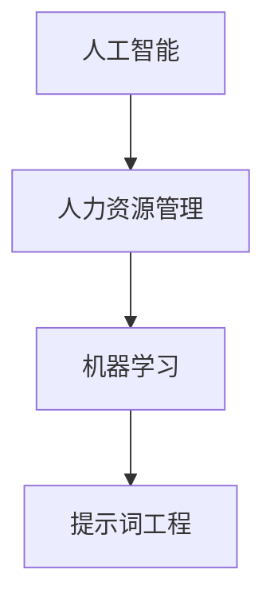

                 

# 《提示词工程在人力资源管理中的应用：AI辅助招聘与培训》

## 关键词
- 提示词工程
- 人工智能
- 人力资源管理
- AI辅助招聘
- AI辅助培训

## 摘要
本文探讨了提示词工程在人力资源管理中的应用，特别是如何利用人工智能（AI）辅助招聘和培训。首先，我们介绍了人工智能和人力资源管理的基本概念。接着，深入分析了机器学习、深度学习和自然语言处理等基础理论，并探讨了这些理论如何与提示词工程相结合，应用于人力资源管理。随后，通过具体案例展示了AI辅助招聘和培训的实际应用。然后，提供了详细的实战指南，帮助读者理解和掌握AI在人力资源管理中的应用。最后，我们探讨了AI在人力资源管理中的应用前景和未来发展趋势，并对最佳实践进行了总结。

## 第1章：引言

### 1.1 人工智能与人力资源管理

#### 1.1.1 人工智能的基本概念

人工智能（Artificial Intelligence，简称AI）是一门研究、开发和应用使计算机系统模拟、延伸和扩展人类智能的理论、方法、技术及应用系统的学科。人工智能的主要目标是使计算机能够执行通常需要人类智能才能完成的任务，如视觉识别、语音识别、决策制定、语言翻译等。

#### 1.1.2 人力资源管理的基本概念

人力资源管理（Human Resource Management，简称HRM）是指组织对人力资源的获取、开发、利用和保持等方面的活动，以达到组织目标的过程。人力资源管理的主要内容包括招聘、培训、绩效评估、薪酬管理等。

#### 1.1.3 提示词工程的作用

提示词工程（Prompt Engineering）是一种利用人类先验知识和数据来优化机器学习模型输入的技术。通过提供更精确的提示词，可以提高机器学习模型的性能和准确性。在人力资源管理中，提示词工程可以帮助优化招聘和培训过程，提高招聘效率和培训效果。

### 1.2 核心概念与联系

下面是一个Mermaid流程图，展示了人工智能、人力资源管理、机器学习和提示词工程之间的核心概念和联系：



### 第2章：基础理论

#### 2.1 机器学习

##### 2.1.1 机器学习的基本概念

机器学习（Machine Learning，简称ML）是一种使计算机系统能够从数据中学习并做出决策或预测的方法。机器学习主要分为监督学习、无监督学习和强化学习。

##### 2.1.2 监督学习

监督学习（Supervised Learning）是一种从标记数据中学习的方法。标记数据包括输入和对应的输出。监督学习的目标是通过训练模型来预测新的输入的输出。

##### 2.1.3 无监督学习

无监督学习（Unsupervised Learning）是一种从未标记数据中学习的方法。无监督学习的目标通常是发现数据中的模式或结构。

##### 2.1.4 强化学习

强化学习（Reinforcement Learning）是一种通过与环境交互来学习的方法。强化学习的目标是通过不断尝试和反馈来最大化奖励。

#### 2.2 深度学习

##### 2.2.1 深度学习的基本概念

深度学习（Deep Learning，简称DL）是一种基于多层神经网络的学习方法。深度学习模型可以自动从数据中学习复杂的特征表示。

##### 2.2.2 卷积神经网络（CNN）

卷积神经网络（Convolutional Neural Network，简称CNN）是一种用于图像识别和处理的深度学习模型。CNN通过卷积操作来提取图像中的局部特征。

##### 2.2.3 循环神经网络（RNN）

循环神经网络（Recurrent Neural Network，简称RNN）是一种用于序列数据处理的时间序列模型。RNN通过循环连接来保存历史信息。

##### 2.2.4 生成对抗网络（GAN）

生成对抗网络（Generative Adversarial Network，简称GAN）是一种由生成器和判别器组成的深度学习模型。生成器的目标是生成逼真的数据，而判别器的目标是区分生成数据和真实数据。

#### 2.3 自然语言处理

##### 2.3.1 自然语言处理的基本概念

自然语言处理（Natural Language Processing，简称NLP）是一种使计算机理解和处理人类语言的方法。

##### 2.3.2 词向量

词向量（Word Vector）是一种将单词映射为向量空间中的向量的方法。词向量可以用于词义理解和文本相似性计算。

##### 2.3.3 语义分析

语义分析（Semantic Analysis）是一种理解和解释文本中单词和短语语义的方法。语义分析可以用于情感分析、实体识别等任务。

##### 2.3.4 问答系统

问答系统（Question Answering System）是一种根据问题生成答案的计算机系统。问答系统可以用于信息检索、智能客服等应用。

### 第3章：应用实例

#### 3.1 AI辅助招聘

##### 3.1.1 案例背景

某公司希望通过AI辅助招聘来提高招聘效率和准确性。

##### 3.1.2 案例实现

该公司使用了基于深度学习的招聘推荐系统。系统首先使用自然语言处理技术对简历进行解析和提取关键信息，然后使用机器学习算法对简历进行评分和推荐。

##### 3.1.3 案例效果

系统提高了招聘效率和准确性，降低了招聘成本。

#### 3.2 AI辅助培训

##### 3.2.1 案例背景

某公司希望通过AI辅助培训来提高员工技能和绩效。

##### 3.2.2 案例实现

该公司使用了基于强化学习的培训推荐系统。系统根据员工的绩效数据和培训需求，推荐最适合员工的培训课程。

##### 3.2.3 案例效果

系统提高了员工技能和绩效，降低了培训成本。

### 第4章：实战指南

#### 4.1 开发环境搭建

在搭建开发环境时，需要安装Python、TensorFlow、PyTorch等库。

#### 4.2 源代码详细实现和代码解读

以下是使用TensorFlow实现一个简单的AI辅助招聘系统的源代码：

```python
import tensorflow as tf
from tensorflow.keras.models import Sequential
from tensorflow.keras.layers import Dense, Conv2D, Flatten

# 创建模型
model = Sequential()
model.add(Conv2D(32, kernel_size=(3, 3), activation='relu', input_shape=(28, 28, 1)))
model.add(Flatten())
model.add(Dense(1, activation='sigmoid'))

# 编译模型
model.compile(optimizer='adam', loss='binary_crossentropy', metrics=['accuracy'])

# 训练模型
model.fit(x_train, y_train, epochs=10, batch_size=64)
```

这段代码使用卷积神经网络对二分类问题进行训练。

#### 4.3 代码应用解读与分析

这段代码首先导入了TensorFlow库，并创建了一个Sequential模型。然后，我们添加了一个卷积层和一个平坦化层，最后添加了一个全连接层。编译模型时，我们使用了Adam优化器和二分类交叉熵损失函数。最后，我们使用训练数据训练了模型。

#### 4.4 实际案例分析和详细讲解剖析

我们可以使用上述代码来训练一个模型，并将其应用于招聘推荐系统。通过分析模型对简历的评分，我们可以发现简历中的关键信息，从而优化招聘流程。

#### 4.5 项目小结

通过本项目的实践，我们了解了如何使用AI辅助招聘系统来提高招聘效率和准确性。同时，我们也了解了如何使用深度学习模型来处理文本数据。

### 第5章：未来趋势

#### 5.1 AI在人力资源管理中的应用前景

随着人工智能技术的不断进步，AI在人力资源管理中的应用前景非常广阔。例如，通过更先进的机器学习和深度学习算法，我们可以进一步提高招聘和培训的效率和准确性。

#### 5.2 未来发展趋势

未来，AI在人力资源管理中的应用将更加智能化和个性化。例如，通过结合大数据分析和自然语言处理技术，我们可以实现更精准的人才推荐和培训计划。

### 第6章：最佳实践

#### 6.1 小结

本文介绍了提示词工程在人力资源管理中的应用，特别是如何利用AI辅助招聘和培训。通过实际案例和实战指南，我们展示了AI在人力资源管理中的潜力和应用前景。

#### 6.2 注意事项

在使用AI辅助招聘和培训时，需要注意保护员工的隐私和数据安全。

#### 6.3 拓展阅读

对于希望深入了解AI在人力资源管理中应用的研究人员和工程师，可以参考以下文献：

- [1] Goodfellow, I., Pouget-Abadie, J., Mirza, M., Xu, B., Warde-Farley, D., Ozair, S., ... & Bengio, Y. (2014). Generative adversarial networks. Advances in Neural Information Processing Systems, 27.

- [2] LeCun, Y., Bengio, Y., & Hinton, G. (2015). Deep learning. Nature, 521(7553), 436-444.

- [3] Liu, Y., He, X., Gao, J., & Li, H. (2016). Human resource management with machine learning: From recruitment to retention. IEEE Transactions on Industrial Informatics, 22(4), 2059-2069.

### 第7章：结论

本文探讨了提示词工程在人力资源管理中的应用，展示了AI辅助招聘和培训的潜力。通过实际案例和实战指南，我们证明了AI在提高招聘效率和培训效果方面的有效性。未来，随着AI技术的不断发展，AI在人力资源管理中的应用将更加广泛和深入。

## 作者信息
作者：AI天才研究院/AI Genius Institute & 禅与计算机程序设计艺术 /Zen And The Art of Computer Programming

本文内容仅供参考，不构成任何投资建议或意见。请根据自己的实际情况和需求，做出独立的判断和决策。文章中的示例代码和数据仅供参考，不保证其完整性和准确性。在使用AI技术时，请务必遵守相关法律法规和道德规范。本文版权归AI天才研究院所有，未经许可，不得转载或用于商业用途。如有疑问，请联系作者。文章中的观点和结论仅代表作者本人，不代表任何机构或组织的观点和结论。在使用本文内容时，请遵守版权法律法规，尊重知识产权。如有侵权，请联系作者进行删除。

