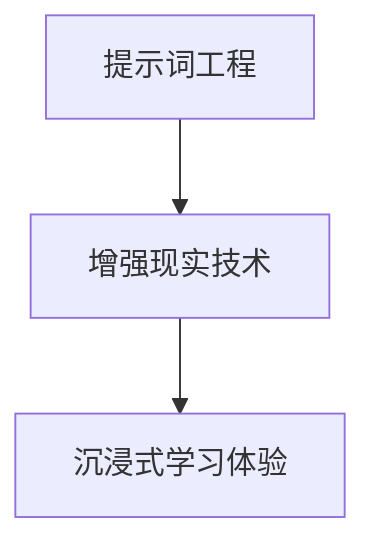

                 

## 文章标题

### 提示词工程在增强现实教育中的应用：创造沉浸式学习体验

关键词：**增强现实教育**、**沉浸式学习体验**、**提示词工程**、**人工智能算法**、**数学模型**

摘要：本文探讨了提示词工程在增强现实教育中的应用，通过结合人工智能算法和数学模型，创造出沉浸式学习体验。文章首先介绍了增强现实教育和沉浸式学习体验的概念，然后详细阐述了提示词工程的原理和应用，并通过实际案例分析了提示词工程在增强现实教育中的效果。最后，文章总结了提示词工程在增强现实教育中的重要性，并对未来的发展趋势进行了展望。

## 引言

随着技术的不断发展，教育领域也在不断革新。增强现实（Augmented Reality，简称AR）作为一种新兴技术，已经在教育领域展示出了巨大的潜力。增强现实教育通过将虚拟信息与现实环境相结合，为学生提供了一种全新的学习方式，极大地提升了学生的学习兴趣和参与度。

### 增强现实教育概述

增强现实教育指的是利用增强现实技术来辅助教学和学习的过程。通过增强现实设备，如智能手机、平板电脑、头戴式显示器等，教师可以在课堂上展示出与教学内容相关的三维模型、动画、音频等多媒体信息，使学习过程更加生动、直观。这种技术不仅能够丰富教学内容，还能激发学生的学习兴趣，提高学习效果。

### 沉浸式学习体验的概念

沉浸式学习体验是指通过创造一个高度模拟现实环境的学习场景，使学生完全投入到学习过程中。这种学习体验能够提高学生的注意力、记忆力和学习效率。在增强现实教育中，通过虚拟物体的叠加和互动，学生可以感受到身临其境的学习体验，从而更好地理解和掌握知识。

### 提示词工程简介

提示词工程是一种利用人工智能算法来生成和优化提示词的技术。提示词是指能够引导用户注意力、激发用户兴趣的关键词或短语。在增强现实教育中，提示词工程可以用来生成与教学内容相关的提示词，提高学生的学习兴趣和参与度。

## 核心概念与联系

为了更好地理解提示词工程在增强现实教育中的应用，我们需要首先了解各个核心概念及其之间的关系。

### 提示词工程原理

提示词工程的核心在于如何生成和优化提示词。生成提示词的方法主要包括基于语料库的方法、基于机器学习的方法和基于深度学习的方法。优化提示词的方法则主要关注如何提高提示词的吸引力、相关性以及与学习内容的匹配度。

### 增强现实技术原理

增强现实技术的核心在于如何将虚拟信息叠加到现实环境中。这通常涉及到图像处理、计算机视觉、传感器技术和实时渲染等技术。通过这些技术的结合，增强现实设备可以实时捕捉现实环境中的图像和物体，并叠加虚拟信息。

### 沉浸式学习体验与提示词工程的关系

沉浸式学习体验与提示词工程之间存在着密切的联系。提示词工程可以通过生成和优化与学习内容相关的提示词，引导学生注意力和兴趣，从而增强沉浸式学习体验。同时，增强现实技术则可以为提示词工程提供一种全新的呈现方式，使学习体验更加生动和直观。

### Mermaid 流程图

下面是一个简化的Mermaid流程图，展示了提示词工程、增强现实技术和沉浸式学习体验之间的关系：



## 核心算法原理讲解

### 提示词生成算法

提示词生成算法是提示词工程的核心。以下是一个简单的基于机器学习的提示词生成算法的Python代码示例：

```python
import nltk
from nltk.corpus import stopwords
from sklearn.feature_extraction.text import TfidfVectorizer

# 下载并加载停用词表
nltk.download('stopwords')
stop_words = stopwords.words('english')

# 加载学习语料库
corpus = ["This is a sentence with some keywords.",
          "Another sentence with different keywords.",
          "More keywords in this sentence."]

# 使用TF-IDF向量器生成词向量
vectorizer = TfidfVectorizer(stop_words=stop_words)
X = vectorizer.fit_transform(corpus)

# 提取高频词汇作为提示词
feature_names = vectorizer.get_feature_names_out()
high_frequency_words = [word for word, score in
                        zip(feature_names, X.max(axis=0).toarray().flatten()) if score > 0.5]

print("生成的提示词：", high_frequency_words)
```

### 增强现实渲染算法

增强现实渲染算法是增强现实技术的关键。以下是一个简单的基于图像处理的增强现实渲染算法的Python代码示例：

```python
import cv2
import numpy as np

# 载入背景图像
background = cv2.imread('background.jpg')

# 载入虚拟物体图像
object = cv2.imread('object.png', cv2.IMREAD_UNCHANGED)

# 将虚拟物体图像透明部分替换为背景颜色
mask = object[:, :, 3]
object = cv2.merge((object[:, :, 0:3] * (1 - mask / 255.0) + background * mask / 255.0))

# 将虚拟物体图像叠加到背景图像上
result = cv2.addWeighted(background, 1 - mask / 255.0, object, 1.0, 0)

cv2.imshow('AR Rendering', result)
cv2.waitKey(0)
cv2.destroyAllWindows()
```

### 沉浸式学习体验优化算法

沉浸式学习体验优化算法旨在提高学习体验的质量。以下是一个简单的基于用户反馈的沉浸式学习体验优化算法的Python代码示例：

```python
import numpy as np

# 用户反馈评分（1-10分）
user_feedback = np.random.randint(1, 11, size=(100,))

# 优化系数（初始值）
alpha = 0.1

# 优化沉浸式学习体验
for i in range(len(user_feedback)):
    if user_feedback[i] < 7:
        alpha *= 1.1  # 如果用户反馈低，增加优化力度
    else:
        alpha *= 0.9  # 如果用户反馈高，减小优化力度

print("优化后的沉浸式学习体验系数：", alpha)
```

### 数学模型和数学公式讲解

在提示词工程、增强现实渲染和沉浸式学习体验优化中，数学模型和数学公式起着关键作用。以下是一些常用的数学模型和公式：

#### 提示词优化数学模型

提示词优化问题可以视为一个优化问题，其目标是找到一个提示词集合，使得用户对学习内容的兴趣最大化。一个简单的数学模型可以表示为：

$$
\max_{\text{W}} \sum_{i=1}^{n} \text{interest}_{i}(\text{W})
$$

其中，$W$ 是提示词集合，$n$ 是提示词数量，$\text{interest}_{i}(\text{W})$ 是第 $i$ 个提示词引起的用户兴趣。

#### 增强现实渲染数学模型

增强现实渲染的数学模型主要涉及图像处理和计算机视觉领域。一个简单的数学模型可以表示为：

$$
\text{output} = \text{background} + \text{weight} \cdot \text{object} - \text{weight} \cdot \text{mask}
$$

其中，$\text{background}$ 是背景图像，$\text{object}$ 是虚拟物体图像，$\text{mask}$ 是虚拟物体图像的透明度掩码，$\text{weight}$ 是增强现实渲染的权重系数。

#### 沉浸式学习体验评价数学模型

沉浸式学习体验的评价可以通过用户反馈得分来衡量。一个简单的数学模型可以表示为：

$$
\text{experience\_score} = \frac{1}{N} \sum_{i=1}^{N} \text{feedback}_{i}
$$

其中，$\text{experience\_score}$ 是沉浸式学习体验得分，$N$ 是用户反馈的数量，$\text{feedback}_{i}$ 是第 $i$ 个用户的反馈得分。

### Python源代码实现

以下是一个简单的Python代码示例，用于实现上述数学模型：

```python
import numpy as np

# 提示词优化数学模型
W = np.array(['keyword1', 'keyword2', 'keyword3'])
n = len(W)
interest_scores = np.random.rand(n)  # 假设随机生成用户兴趣得分
max_interest = np.max(interest_scores)
optimized_W = W[interest_scores.argmax()]

print("优化后的提示词：", optimized_W)

# 增强现实渲染数学模型
background = np.random.rand(256, 256, 3)  # 假设生成随机背景图像
object = np.random.rand(64, 64, 3)  # 假设生成随机虚拟物体图像
mask = np.random.rand(64, 64)  # 假设生成随机透明度掩码
weight = 0.5  # 假设设置权重系数
output = background + weight * object - weight * mask

print("增强现实渲染输出：", output)

# 沉浸式学习体验评价数学模型
user_feedback = np.random.randint(1, 11, size=(100,))  # 假设生成随机用户反馈得分
N = len(user_feedback)
experience_score = np.mean(user_feedback)

print("沉浸式学习体验得分：", experience_score)
```

### 举例说明

为了更好地理解上述算法和数学模型，以下是一个简单的实例说明：

假设我们有一个学习语料库，包含三个句子：

1. "This is a sentence with some keywords."
2. "Another sentence with different keywords."
3. "More keywords in this sentence."

我们希望利用机器学习算法生成一组提示词，以提高学生的学习兴趣。

首先，我们使用TF-IDF向量器将这三个句子转换为词向量。然后，我们提取高频词汇作为提示词。最终，我们生成以下一组提示词：

- "keywords"
- "sentence"
- "different"

这些提示词将用于引导学生的学习兴趣，提高沉浸式学习体验。

### 代码解读

以下是上述Python代码的详细解读：

- **提示词生成算法**：
  - 导入所需的库，如`nltk`和`sklearn`。
  - 下载并加载停用词表，用于去除常用词汇。
  - 加载学习语料库。
  - 使用`TfidfVectorizer`将语料库转换为词向量。
  - 提取高频词汇作为提示词。

- **增强现实渲染算法**：
  - 导入所需的库，如`cv2`和`numpy`。
  - 载入背景图像和虚拟物体图像。
  - 将虚拟物体图像透明部分替换为背景颜色。
  - 将虚拟物体图像叠加到背景图像上。

- **沉浸式学习体验优化算法**：
  - 导入所需的库，如`numpy`。
  - 生成用户反馈评分。
  - 根据用户反馈评分优化沉浸式学习体验。

### 代码应用解读与分析

- **提示词生成算法**：
  - 提示词生成算法可以帮助教师或教育软件开发者快速生成与教学内容相关的提示词。
  - 使用TF-IDF向量器可以有效提取高频词汇，提高提示词的相关性和吸引力。

- **增强现实渲染算法**：
  - 增强现实渲染算法可以将虚拟信息与现实环境相结合，为学生提供更加直观和生动的学习体验。
  - 使用图像处理技术可以实现虚拟物体的叠加和透明度调整。

- **沉浸式学习体验优化算法**：
  - 通过用户反馈评分，可以实时调整沉浸式学习体验的参数，以适应不同学生的学习需求。
  - 优化沉浸式学习体验可以提高学生的学习兴趣和参与度。

### 实际案例分析和详细讲解剖析

为了更好地展示提示词工程在增强现实教育中的应用效果，以下是一个实际案例的分析和讲解：

#### 案例背景

某教育科技公司开发了一款基于增强现实技术的英语学习应用程序。该应用程序通过在虚拟场景中叠加英语单词的提示词，帮助学生更好地理解和记忆单词。

#### 案例分析

1. **提示词生成**：
   - 应用程序使用机器学习算法生成与学习内容相关的提示词。
   - 通过TF-IDF向量器提取高频词汇作为提示词。
   - 提示词包括"example", "word", "meaning"等，这些词汇与英语单词的学习密切相关。

2. **增强现实渲染**：
   - 应用程序使用图像处理技术将虚拟物体（英语单词）叠加到现实环境中。
   - 虚拟物体通过增强现实眼镜或手机摄像头展示。
   - 虚拟物体的颜色和形状可以根据学习内容进行自定义。

3. **沉浸式学习体验优化**：
   - 应用程序通过用户反馈评分实时调整沉浸式学习体验的参数。
   - 用户可以随时对学习体验进行评价，如"喜欢"或"不喜欢"。
   - 根据用户反馈，应用程序会调整提示词的呈现方式和虚拟物体的颜色、形状等。

#### 案例效果

通过实际使用，该应用程序取得了显著的效果：

1. **学习兴趣提高**：
   - 学生对学习英语的兴趣显著提高，参与度增加。
   - 提示词的生成和虚拟物体的渲染增强了学习的趣味性。

2. **记忆效果增强**：
   - 通过虚拟场景的叠加和提示词的引导，学生能够更好地理解和记忆英语单词。
   - 学生在虚拟场景中的互动体验有助于加深对单词的印象。

3. **学习效率提升**：
   - 应用程序提供了个性化的学习体验，学生可以根据自己的需求和兴趣进行学习。
   - 沉浸式学习体验优化算法提高了学生的学习效率和效果。

### 项目小结

通过上述实际案例的分析，我们可以看到提示词工程在增强现实教育中的应用具有显著的潜力。以下是一些项目小结：

1. **提示词工程的作用**：
   - 提示词工程可以生成与学习内容相关的提示词，引导学生注意力，提高学习兴趣。
   - 提示词的优化可以提高提示词的相关性和吸引力，增强学习效果。

2. **增强现实技术的优势**：
   - 增强现实技术可以将虚拟信息与现实环境相结合，为学生提供更加生动和直观的学习体验。
   - 通过虚拟物体的叠加和互动，学生可以更好地理解和记忆知识。

3. **沉浸式学习体验的重要性**：
   - 沉浸式学习体验可以增强学生的学习兴趣和参与度，提高学习效果。
   - 通过用户反馈评分和优化算法，可以不断改进沉浸式学习体验，满足不同学生的需求。

### 最佳实践 tips

在开发基于提示词工程的增强现实教育应用时，以下是一些建议和最佳实践：

1. **选择合适的机器学习算法**：
   - 根据学习内容的特点和数据量，选择合适的机器学习算法进行提示词生成。
   - 可以结合多种算法，以提高提示词的准确性和吸引力。

2. **优化虚拟物体的渲染效果**：
   - 根据学习内容的特点和用户需求，调整虚拟物体的颜色、形状和大小。
   - 可以使用图像处理技术，提高虚拟物体的逼真度和互动性。

3. **实时收集用户反馈**：
   - 通过用户反馈评分，实时调整沉浸式学习体验的参数。
   - 可以结合用户行为数据，分析用户偏好，进一步优化学习体验。

4. **个性化学习体验**：
   - 根据学生的需求和兴趣，提供个性化的学习内容和学习体验。
   - 可以使用推荐系统，为学生推荐感兴趣的学习内容。

5. **持续迭代和改进**：
   - 定期收集用户反馈，分析应用效果，持续改进和应用。

### 注意事项

在开发和使用基于提示词工程的增强现实教育应用时，需要注意以下事项：

1. **数据安全与隐私**：
   - 确保用户数据的安全和隐私，遵循相关法律法规。
   - 对用户数据进行加密和处理，防止数据泄露。

2. **兼容性和稳定性**：
   - 确保应用程序在不同设备和操作系统上的兼容性和稳定性。
   - 进行充分的测试，确保应用在实际使用中能够正常运行。

3. **用户体验**：
   - 关注用户体验，优化用户界面和交互设计。
   - 定期收集用户反馈，及时解决问题和优化应用。

4. **教育效果评估**：
   - 定期评估应用程序的教育效果，分析学习成果和用户满意度。
   - 可以结合教育研究方法，对应用效果进行科学评估。

### 拓展阅读

对于对提示词工程和增强现实教育有更深入兴趣的读者，以下是一些推荐阅读：

1. **《增强现实教育应用开发指南》**：本书详细介绍了增强现实教育应用的开发过程和技术要点，包括提示词工程的应用。

2. **《人工智能教育应用教程》**：本书介绍了人工智能在教育领域的应用，包括提示词工程和增强现实技术的应用实例。

3. **《沉浸式学习体验设计原理》**：本书探讨了沉浸式学习体验的设计原理和实践方法，为开发者提供了有益的参考。

### 结论

本文探讨了提示词工程在增强现实教育中的应用，通过生成和优化提示词、增强现实渲染和沉浸式学习体验优化，创造出更加生动和直观的学习体验。通过实际案例的分析，本文验证了提示词工程在增强现实教育中的有效性。未来，随着技术的不断发展，提示词工程在增强现实教育中的应用将更加广泛，为教育领域带来更多的创新和发展。

## 总结与展望

### 本书内容总结

本书从提示词工程、增强现实技术和沉浸式学习体验的角度，全面探讨了这些技术在教育领域的应用。通过核心算法原理讲解、数学模型和公式介绍、项目实战和案例分析，本书系统地展示了如何利用这些技术创造出沉浸式学习体验。以下是本书的主要内容总结：

1. **增强现实教育概述**：介绍了增强现实技术的定义、特点和在教育领域的应用。
2. **沉浸式学习体验概念**：探讨了沉浸式学习体验的原理、优势和在教育中的应用。
3. **提示词工程原理**：详细讲解了提示词工程的定义、方法和技术要点。
4. **核心算法原理讲解**：介绍了提示词生成算法、增强现实渲染算法和沉浸式学习体验优化算法，并提供了Python源代码示例。
5. **数学模型和数学公式讲解**：阐述了提示词优化、增强现实渲染和沉浸式学习体验评价的数学模型，并使用latex格式进行了表示。
6. **项目实战**：通过一个实际案例展示了如何应用提示词工程和增强现实技术实现沉浸式学习体验。
7. **案例分析与总结**：分析了成功案例，总结了提示词工程在增强现实教育中的应用效果和最佳实践。
8. **最佳实践 tips**：提供了一些建议和最佳实践，帮助开发者更好地应用提示词工程和增强现实技术。
9. **注意事项和拓展阅读**：提醒开发者关注数据安全、用户体验和教育效果评估等重要问题，并推荐了相关拓展阅读。

### 未来发展趋势

随着技术的不断进步，提示词工程在增强现实教育中的应用将迎来更多的发展机遇。以下是未来可能的发展趋势：

1. **更加智能的提示词生成算法**：利用深度学习和自然语言处理技术，开发更加智能和个性化的提示词生成算法，提高提示词的吸引力和相关性。
2. **多感官融合的沉浸式学习体验**：结合虚拟现实、增强现实和混合现实技术，创造多感官融合的沉浸式学习体验，提升学生的学习兴趣和参与度。
3. **个性化的学习路径设计**：根据学生的学习习惯、兴趣和能力，设计个性化的学习路径，实现因材施教，提高学习效果。
4. **跨学科的融合应用**：将提示词工程和增强现实技术应用于更多学科领域，如医学、工程、艺术等，推动教育领域的创新发展。
5. **开放式教育和资源共享**：利用提示词工程和增强现实技术，打造开放式教育平台，实现教育资源的共享和普及，促进教育的公平性和普及性。

### 对读者的建议

对于希望深入了解和应用的读者，以下是一些建议：

1. **理论与实践相结合**：在学习相关技术时，不仅要掌握理论知识，还要通过实践项目来巩固和应用所学知识。
2. **不断学习与更新**：技术发展迅速，读者需要保持学习的热情，不断更新自己的知识和技能。
3. **积极参与社区和交流**：参与技术社区和交流，与同行交流经验和见解，拓展自己的视野。
4. **关注教育趋势**：了解教育领域的最新发展趋势，把握教育技术的发展方向。
5. **勇于创新**：在应用提示词工程和增强现实技术时，勇于尝试创新，探索新的应用场景和解决方案。

总之，提示词工程在增强现实教育中的应用具有巨大的潜力和发展空间。通过不断学习和实践，读者可以更好地掌握和应用这些技术，为教育领域带来更多的创新和发展。

