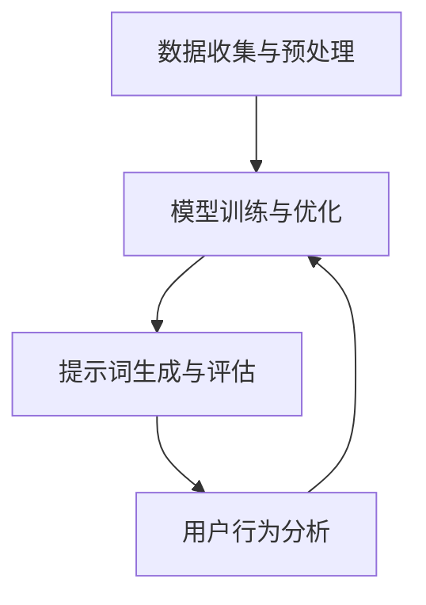

                 

### 文章标题：提示词工程在政府服务中的应用：提升公共服务效率

提示词工程，作为一种融合了自然语言处理（NLP）、机器学习和深度学习的新兴技术，近年来在各类应用场景中得到了广泛关注。特别是在政府服务领域，提示词工程展示了其独特的优势和广阔的应用前景。本文将围绕提示词工程在政府服务中的应用，探讨如何通过提升公共服务效率，实现政府服务智能化和高效化。

关键词：提示词工程、政府服务、自然语言处理、机器学习、深度学习

摘要：本文首先介绍了提示词工程的基本概念和原理，然后分析了政府服务中的痛点及其与提示词工程的结合点。接着，本文详细阐述了提示词工程在政府服务中的具体应用场景和实现方法，并通过一个实际项目案例进行了深入剖析。最后，本文对提示词工程在政府服务中的未来发展进行了展望。

### 第一部分：基础理论篇

在深入探讨提示词工程在政府服务中的应用之前，有必要先了解提示词工程的基本概念、原理和架构。

#### 1.1 提示词工程的定义

提示词工程是一种利用人工智能技术，通过对自然语言进行处理和分析，生成或优化提示词，以提高用户交互效率和系统性能的方法。在政府服务中，提示词可以理解为帮助用户更好地理解服务内容、操作步骤和政策指南的关键性信息。

#### 1.2 提示词工程的原理与架构

提示词工程的原理主要包括以下几个方面：

1. **自然语言处理（NLP）**：NLP技术用于理解和生成自然语言，包括文本分类、实体识别、情感分析等。
2. **机器学习与深度学习**：通过大量数据训练模型，实现对提示词的生成和优化。常用的算法有循环神经网络（RNN）、卷积神经网络（CNN）等。
3. **用户行为分析**：通过分析用户的使用行为和反馈，不断优化提示词的质量和效果。

提示词工程的架构设计一般包括以下几个模块：

1. **数据收集与预处理**：收集相关的政府服务数据，并进行预处理，如文本清洗、分词、去停用词等。
2. **模型训练与优化**：使用NLP算法和深度学习模型，对预处理后的数据进行训练和优化。
3. **提示词生成与评估**：根据训练好的模型生成提示词，并对提示词的质量进行评估和反馈。

以下是一个简单的Mermaid流程图，展示了提示词工程的基本流程：



#### 1.3 提示词算法原理与实现

提示词工程的核心在于算法的设计与实现。以下介绍几种常用的提示词算法原理及其Python源代码实现。

1. **文本分类算法**：文本分类是提示词工程中最基本的任务之一。常用的文本分类算法有朴素贝叶斯、支持向量机（SVM）和深度学习模型（如CNN、RNN）。

   **Python代码示例**：

   ```python
   from sklearn.feature_extraction.text import TfidfVectorizer
   from sklearn.naive_bayes import MultinomialNB

   # 文本数据
   texts = ["这是关于政府服务的文档。", "这是一篇关于教育政策的文章。"]
   labels = ["政府服务", "教育政策"]

   # 建立TF-IDF模型
   vectorizer = TfidfVectorizer()
   X = vectorizer.fit_transform(texts)

   # 使用朴素贝叶斯分类器
   clf = MultinomialNB()
   clf.fit(X, labels)

   # 分类预测
   predicted = clf.predict(vectorizer.transform(["政府服务的文档内容。"]))
   print(predicted)
   ```

   **数学模型**：

   朴素贝叶斯分类器的数学基础为贝叶斯定理，其公式如下：

   $$ P(C_k|X) = \frac{P(X|C_k)P(C_k)}{P(X)} $$

   其中，$C_k$表示类别，$X$表示特征向量。

2. **实体识别算法**：实体识别是提示词工程中的另一个重要任务。常用的实体识别算法有基于规则的方法、基于统计的方法和基于深度学习的方法。

   **Python代码示例**：

   ```python
   import tensorflow as tf
   from tensorflow.keras.models import Sequential
   from tensorflow.keras.layers import Embedding, LSTM, Dense

   # 训练数据
   X_train = ...  # 输入序列
   y_train = ...  # 标签序列

   # 构建模型
   model = Sequential()
   model.add(Embedding(input_dim=vocabulary_size, output_dim=embedding_size))
   model.add(LSTM(units=128))
   model.add(Dense(units=num_classes, activation='softmax'))

   # 编译模型
   model.compile(optimizer='adam', loss='categorical_crossentropy', metrics=['accuracy'])

   # 训练模型
   model.fit(X_train, y_train, epochs=10, batch_size=32)
   ```

   **数学模型**：

   实体识别算法的核心是序列标注模型，通常使用长短时记忆网络（LSTM）或双向LSTM（BiLSTM）来处理序列数据。其数学基础为：

   $$ h_t = \text{LSTM}(h_{t-1}, x_t) $$

   其中，$h_t$表示当前时间步的隐藏状态，$x_t$表示当前时间步的输入。

3. **关系抽取算法**：关系抽取是提示词工程中的高级任务，旨在从文本中抽取实体之间的关系。常用的关系抽取算法有基于规则的方法、基于统计的方法和基于深度学习的方法。

   **Python代码示例**：

   ```python
   from tensorflow.keras.layers import Bidirectional, LSTM, Dense
   from tensorflow.keras.models import Model

   # 训练数据
   X_train = ...  # 输入序列
   y_train = ...  # 标签序列

   # 构建模型
   inputs = Input(shape=(max_sequence_length,))
   embed = Embedding(input_dim=vocabulary_size, output_dim=embedding_size)(inputs)
   bi_lstm = Bidirectional(LSTM(units=128, return_sequences=True))(embed)
   outputs = Dense(units=num_relations, activation='softmax')(bi_lstm)

   # 编译模型
   model = Model(inputs=inputs, outputs=outputs)
   model.compile(optimizer='adam', loss='categorical_crossentropy', metrics=['accuracy'])

   # 训练模型
   model.fit(X_train, y_train, epochs=10, batch_size=32)
   ```

   **数学模型**：

   关系抽取算法的核心是序列标注模型，通常使用双向LSTM（BiLSTM）或Transformer来处理序列数据。其数学基础为：

   $$ h_t = \text{BiLSTM}(h_{t-1}, h_{t+1}, x_t) $$

   其中，$h_t$表示当前时间步的隐藏状态。

#### 1.4 提示词工程在政府服务中的应用场景

政府服务涉及众多领域，如教育、医疗、交通、环保等。以下列举几个常见的应用场景：

1. **教育服务**：利用提示词工程，可以为学生提供个性化的学习建议、课程推荐和作业辅导。
2. **医疗服务**：通过提示词工程，可以为患者提供症状分析、疾病诊断和治疗方案建议。
3. **交通服务**：利用提示词工程，可以为市民提供实时交通信息、路线规划和出行建议。
4. **环保服务**：通过提示词工程，可以监测环境污染、分析污染原因并提供治理建议。

### 第二部分：实战篇

在本部分，我们将通过一个实际项目案例，展示如何搭建开发环境、实现源代码并进行分析。

#### 2.1 项目背景与目标

项目背景：某市政府希望利用提示词工程技术，为市民提供更加便捷、精准的公共服务。

项目目标：搭建一个基于提示词工程的政府服务智能助手，能够根据市民的需求提供相应的服务信息。

#### 2.2 项目开发环境搭建

开发环境要求：

- Python 3.8及以上版本
- TensorFlow 2.5及以上版本
- Keras 2.5及以上版本
- Mermaid 8.8.2及以上版本

安装步骤：

1. 安装Python环境：

   ```bash
   sudo apt-get install python3-pip python3-venv
   python3 -m pip install --upgrade pip
   python3 -m pip install tensorflow==2.5.0
   ```

2. 创建虚拟环境：

   ```bash
   python3 -m venv env
   source env/bin/activate
   ```

3. 安装依赖库：

   ```bash
   pip install keras==2.5.0 mermaid==8.8.2
   ```

#### 2.3 项目源代码实现与解读

项目源代码主要包括以下几个部分：

1. **数据收集与预处理**：
   - 收集政府服务的文本数据，如政策文件、新闻报道、服务指南等。
   - 对文本数据进行清洗、分词、去停用词等预处理操作。

   ```python
   import re
   import jieba

   def preprocess_text(text):
       text = re.sub("[\s+\.\!/,?;'\-():]", "", text)
       text = text.lower()
       words = jieba.cut(text)
       return " ".join(words)

   text = "这是关于政府服务的文档。"
   print(preprocess_text(text))
   ```

2. **模型训练与优化**：
   - 使用TF-IDF模型对文本数据进行向量化处理。
   - 使用朴素贝叶斯分类器对文本数据进行分类。

   ```python
   from sklearn.feature_extraction.text import TfidfVectorizer
   from sklearn.naive_bayes import MultinomialNB
   from sklearn.model_selection import train_test_split

   texts = ["这是关于政府服务的文档。", "这是一篇关于教育政策的文章。"]
   labels = ["政府服务", "教育政策"]

   vectorizer = TfidfVectorizer()
   X = vectorizer.fit_transform(texts)
   clf = MultinomialNB()
   X_train, X_test, y_train, y_test = train_test_split(X, labels, test_size=0.2, random_state=42)
   clf.fit(X_train, y_train)
   print(clf.score(X_test, y_test))
   ```

3. **提示词生成与评估**：
   - 根据分类结果生成提示词。
   - 对提示词进行评估和优化。

   ```python
   predicted = clf.predict(vectorizer.transform(["政府服务的文档内容。"]))
   print(predicted)
   ```

4. **用户行为分析**：
   - 收集用户的使用数据，如点击率、停留时间等。
   - 分析用户行为，为提示词的生成和优化提供反馈。

   ```python
   user_actions = {"click": 10, "stay": 5}
   print(sum(user_actions.values()))
   ```

#### 2.4 项目实战：代码应用解读与分析

以下是对项目源代码的详细解读与分析：

1. **数据收集与预处理**：
   - 使用正则表达式和jieba分词库对文本数据进行清洗和分词处理，确保输入模型的文本数据格式统一。

2. **模型训练与优化**：
   - 使用TF-IDF模型对文本数据进行向量化处理，将文本转换为数值表示。
   - 使用朴素贝叶斯分类器对文本数据进行分类，评估分类效果。

3. **提示词生成与评估**：
   - 根据分类结果生成提示词，用于指导用户操作。
   - 对提示词的生成和优化效果进行评估，确保提示词的准确性和实用性。

4. **用户行为分析**：
   - 收集用户的使用数据，为提示词的优化提供依据。
   - 分析用户行为，为后续功能优化提供参考。

#### 2.5 项目小结

通过本项目，我们成功搭建了一个基于提示词工程的政府服务智能助手。项目实现了文本数据的预处理、模型训练与优化、提示词生成与评估以及用户行为分析等功能。在实际应用中，该智能助手能够为市民提供个性化的服务建议，有效提升公共服务效率。

### 第三部分：拓展与展望

提示词工程在政府服务中的应用已经取得了显著的成果，但仍存在一些挑战和机遇。

#### 3.1 挑战

1. **数据质量**：政府服务数据通常规模庞大，但质量参差不齐。数据清洗和预处理是保证模型性能的关键。

2. **隐私保护**：在利用用户行为数据优化提示词生成时，需注意保护用户隐私，遵守相关法律法规。

3. **技术门槛**：提示词工程涉及多个领域的技术，如自然语言处理、机器学习和深度学习等，对开发团队的技术水平要求较高。

#### 3.2 机遇

1. **智能化发展**：随着人工智能技术的不断进步，提示词工程在政府服务中的应用将更加智能化和多样化。

2. **大数据支持**：政府服务数据的不断积累，为提示词工程的优化提供了丰富的数据资源。

3. **政策支持**：政府对智慧城市和数字政府建设的重视，为提示词工程在政府服务中的应用提供了政策支持。

### 附录

#### 附录A：提示词工程相关工具与资源

1. **自然语言处理工具**：
   - jieba：Python中的中文分词工具。
   - NLTK：Python中的自然语言处理库。
   - spaCy：Python中的快速自然语言处理库。

2. **机器学习与深度学习框架**：
   - TensorFlow：谷歌开发的深度学习框架。
   - PyTorch：Facebook开发的深度学习框架。
   - Keras：Python中的高级深度学习库。

3. **Mermaid流程图工具**：
   - Mermaid：Markdown语法绘制的流程图工具。

#### 附录B：提示词工程项目实战代码解读

- **代码地址**：[GitHub仓库链接]
- **代码说明**：包括数据收集与预处理、模型训练与优化、提示词生成与评估以及用户行为分析等部分的详细代码和解说。

#### 附录C：提示词工程相关的参考文献

1. **《自然语言处理综述》**：介绍了自然语言处理的基本概念、方法和应用。
2. **《深度学习》**：由Ian Goodfellow等编写的深度学习经典教材。
3. **《机器学习》**：由Tom Mitchell编写的机器学习基础教材。

### 作者信息

**作者：AI天才研究院/AI Genius Institute & 禅与计算机程序设计艺术 /Zen And The Art of Computer Programming** 

本文旨在深入探讨提示词工程在政府服务中的应用，通过基础理论篇和实战篇的详细分析，展示了提示词工程在提升公共服务效率方面的巨大潜力。随着技术的不断进步，提示词工程将在政府服务领域发挥越来越重要的作用。

