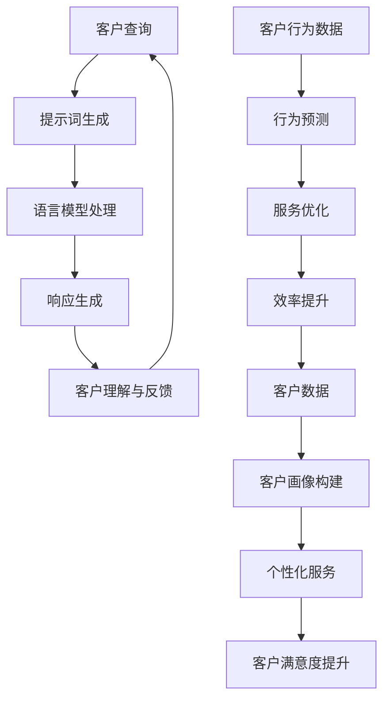

                 

### 背景介绍

随着信息技术的飞速发展，智能客户关系管理（Intelligent Customer Relationship Management, ICRCM）逐渐成为企业竞争的重要手段。智能客户关系管理通过整合先进的技术手段，如大数据分析、自然语言处理（Natural Language Processing, NLP）、机器学习和深度学习等，实现对客户数据的全面分析，从而提供更加精准、个性化的客户服务。在这一背景下，提示词工程（Prompt Engineering）作为一种关键技术，正在逐渐崭露头角。

提示词工程是指通过对语言模型进行精细调优，使其能够更好地理解和生成人类语言的过程。其核心目的是提高语言模型的性能和实用性，使其能够更准确地理解用户的意图，生成更符合人类语言习惯的响应。在智能客户关系管理中，提示词工程的应用具有重要意义。

首先，通过提示词工程，企业可以更准确地理解客户的查询和需求。传统的人工客服往往存在响应速度慢、服务质量不高等问题，而基于提示词工程的智能客服系统能够快速响应用户的查询，并提供准确的答案。这不仅提高了客户满意度，还能降低企业的运营成本。

其次，提示词工程可以帮助企业更好地进行客户画像构建。通过对客户历史数据和行为模式的分析，提示词工程可以生成更加精准的客户画像，从而为企业提供有针对性的营销策略和服务方案。

最后，提示词工程在客户行为预测方面也具有重要作用。通过分析客户的查询记录和互动行为，提示词工程可以预测客户未来的需求和购买意向，从而帮助企业提前做好准备，提高客户转化率和满意度。

综上所述，提示词工程在智能客户关系管理中的应用具有巨大的潜力。本文将围绕提示词工程的定义、核心算法原理、数学模型、项目实战等方面进行详细探讨，旨在为企业提供一套完整的技术解决方案。

### 核心概念与联系

#### 提示词工程的定义

提示词工程是一种专门针对自然语言处理（NLP）领域中语言模型的调优技术。其核心目的是通过调整和优化提示词（Prompt），使语言模型能够更准确地理解用户的意图，生成更加符合人类语言习惯的响应。提示词在这里可以理解为输入到模型中的引导性文本，它帮助模型更好地捕捉上下文信息，从而提高模型的整体性能。

#### 智能客户关系管理的定义

智能客户关系管理（Intelligent Customer Relationship Management, ICRCM）是一种利用先进技术，如大数据分析、自然语言处理、机器学习和深度学习等，对客户关系进行系统化管理和优化的方法。其目标是通过精准、个性化的客户服务，提高客户满意度，增加客户忠诚度，最终实现企业的长期发展。

#### 提示词工程与智能客户关系管理的联系

提示词工程在智能客户关系管理中扮演着关键角色，两者之间的联系主要体现在以下几个方面：

1. **客户理解与响应**：通过提示词工程，智能客服系统能够更好地理解客户的查询和需求，提供快速、准确的响应。这有助于提高客户满意度，减少客户等待时间，从而增强客户体验。

2. **客户画像构建**：提示词工程通过对客户交互数据的分析，可以构建更加精准的客户画像。这些画像有助于企业了解客户的行为和偏好，从而制定有针对性的营销策略和服务方案。

3. **客户行为预测**：提示词工程还可以通过对客户历史数据和交互行为的分析，预测客户的未来行为和需求。这有助于企业提前做好准备，提高客户转化率和满意度。

4. **个性化服务**：基于提示词工程的智能客服系统可以根据客户的不同需求和偏好，提供个性化的服务。这有助于增强客户忠诚度，提高客户留存率。

5. **效率提升**：通过自动化和智能化的方式，提示词工程可以大幅提高客户服务的效率，降低企业的运营成本。

#### 提示词工程与智能客户关系管理的 Mermaid 流程图



通过这个流程图，我们可以清晰地看到提示词工程在智能客户关系管理中的各个环节中的作用和联系。

### 核心算法原理讲解

#### 自然语言处理算法

自然语言处理（NLP）是智能客户关系管理的基础，它涉及到文本分析、语义理解、情感分析等多个方面。以下是几种核心的NLP算法：

1. **词向量表示**

   词向量是将自然语言中的词汇映射到高维空间中的向量表示。常用的词向量模型有Word2Vec、GloVe等。以下是一个简单的Word2Vec算法的Python实现：

   ```python
   from gensim.models import Word2Vec
   
   # 假设 sentences 是一个包含词汇的列表
   model = Word2Vec(sentences, vector_size=100, window=5, min_count=1, workers=4)
   
   # 计算相似度
   similarity = model.wv.similarity('apple', 'banana')
   print(similarity)
   ```

2. **命名实体识别**

   命名实体识别（Named Entity Recognition, NER）是识别文本中的特定实体，如人名、地名、组织名等。以下是一个基于LSTM的NER算法的Python实现：

   ```python
   from keras.models import Sequential
   from keras.layers import LSTM, Dense, Embedding
   
   # 假设 X_train 是特征矩阵，y_train 是标签矩阵
   model = Sequential()
   model.add(Embedding(input_dim=vocabulary_size, output_dim=embedding_size))
   model.add(LSTM(units=128))
   model.add(Dense(units=num_classes, activation='softmax'))
   
   model.compile(optimizer='adam', loss='categorical_crossentropy', metrics=['accuracy'])
   model.fit(X_train, y_train, epochs=10, batch_size=32)
   ```

#### 机器学习算法

机器学习算法在智能客户关系管理中有着广泛的应用，如分类、聚类、回归等。以下是几种常见的机器学习算法：

1. **支持向量机（SVM）**

   支持向量机是一种二分类模型，通过找到一个最优的超平面，将不同类别的数据分隔开来。以下是一个简单的SVM算法的Python实现：

   ```python
   from sklearn.svm import SVC
   
   # 假设 X_train 是特征矩阵，y_train 是标签矩阵
   model = SVC(kernel='linear')
   model.fit(X_train, y_train)
   
   # 预测
   predictions = model.predict(X_test)
   ```

2. **随机森林（Random Forest）**

   随机森林是一种集成学习算法，通过构建多棵决策树，并对它们的预测结果进行投票来决定最终预测结果。以下是一个简单的随机森林算法的Python实现：

   ```python
   from sklearn.ensemble import RandomForestClassifier
   
   # 假设 X_train 是特征矩阵，y_train 是标签矩阵
   model = RandomForestClassifier(n_estimators=100)
   model.fit(X_train, y_train)
   
   # 预测
   predictions = model.predict(X_test)
   ```

#### 深度学习算法

深度学习算法在智能客户关系管理中有着重要的应用，如深度神经网络（DNN）、卷积神经网络（CNN）和循环神经网络（RNN）等。以下是几种常见的深度学习算法：

1. **卷积神经网络（CNN）**

   卷积神经网络是一种适用于图像处理和文本分析等领域的深度学习算法。以下是一个简单的CNN算法的Python实现：

   ```python
   from keras.models import Sequential
   from keras.layers import Conv2D, MaxPooling2D, Flatten, Dense
   
   model = Sequential()
   model.add(Conv2D(filters=32, kernel_size=(3, 3), activation='relu', input_shape=(28, 28, 1)))
   model.add(MaxPooling2D(pool_size=(2, 2)))
   model.add(Flatten())
   model.add(Dense(units=10, activation='softmax'))
   
   model.compile(optimizer='adam', loss='categorical_crossentropy', metrics=['accuracy'])
   model.fit(X_train, y_train, epochs=10, batch_size=32)
   ```

2. **循环神经网络（RNN）**

   循环神经网络是一种适用于序列数据处理和时间序列预测等领域的深度学习算法。以下是一个简单的RNN算法的Python实现：

   ```python
   from keras.models import Sequential
   from keras.layers import LSTM, Dense
   
   model = Sequential()
   model.add(LSTM(units=128, return_sequences=True))
   model.add(LSTM(units=128))
   model.add(Dense(units=1, activation='sigmoid'))
   
   model.compile(optimizer='adam', loss='binary_crossentropy', metrics=['accuracy'])
   model.fit(X_train, y_train, epochs=100, batch_size=32)
   ```

#### 数学模型和数学公式

在智能客户关系管理中，数学模型和数学公式起着至关重要的作用。以下是一些核心的数学模型和数学公式：

1. **概率论与统计学基础**

   概率论和统计学是处理不确定性和数据分析的基础。以下是一些核心概念和公式：

   - **概率分布函数（PDF）**：用于描述随机变量在不同取值下的概率密度。
     $$ f_X(x) = P(X = x) $$
   
   - **累积分布函数（CDF）**：用于描述随机变量小于等于某个值的概率。
     $$ F_X(x) = P(X \leq x) $$
   
   - **期望值（Expected Value）**：用于描述随机变量的平均取值。
     $$ E(X) = \sum_{x} x \cdot P(X = x) $$

   - **方差（Variance）**：用于描述随机变量的离散程度。
     $$ Var(X) = E[(X - E(X))^2] $$

2. **最优化理论**

   最优化理论是解决优化问题的核心工具。以下是一些常见的方法和公式：

   - **梯度下降法（Gradient Descent）**：用于最小化损失函数。
     $$ \theta_{t+1} = \theta_t - \alpha \cdot \nabla_\theta J(\theta_t) $$
   
   - **牛顿法（Newton's Method）**：用于求解非线性优化问题。
     $$ \theta_{t+1} = \theta_t - H^{-1} \nabla J(\theta_t) $$
   
   - **拉格朗日乘数法（Lagrange Multiplier Method）**：用于求解约束优化问题。
     $$ \nabla L(\theta, \lambda) = 0 $$

3. **神经网络与深度学习数学基础**

   神经网络和深度学习依赖于复杂的数学模型，以下是一些核心的数学公式：

   - **激活函数**：用于引入非线性特性。
     $$ a = \sigma(z) $$
   
   - **反向传播算法**：用于计算网络参数的梯度。
     $$ \Delta\theta_j = \frac{\partial L}{\partial\theta_j} $$
   
   - **损失函数**：用于评估模型的预测性能。
     $$ J(\theta) = -\frac{1}{m} \sum_{i=1}^{m} \left[y_{i} \log(a_{i}) + (1 - y_{i}) \log(1 - a_{i})\right] $$
   
   - **梯度下降法**：用于最小化损失函数。
     $$ \theta_{t+1} = \theta_t - \alpha \cdot \nabla_\theta J(\theta_t) $$

通过上述的算法和数学模型，我们可以构建出强大的智能客户关系管理系统，从而更好地满足客户需求，提高企业竞争力。

### 项目实战

#### 智能客服系统搭建

为了搭建一个基于提示词工程的智能客服系统，我们需要进行以下几个步骤：

##### 开发环境搭建

首先，我们需要搭建开发环境。这里我们选择Python作为主要编程语言，并使用TensorFlow和Keras作为深度学习框架。

1. 安装Python（版本3.8及以上）
2. 安装TensorFlow：`pip install tensorflow`
3. 安装Keras：`pip install keras`

##### 数据收集与预处理

1. **数据收集**：收集客户查询和客服响应的数据。这些数据可以从企业的客服系统、社交媒体、客户反馈等多个渠道获取。
2. **数据预处理**：
   - 去除无关信息，如HTML标签、特殊字符等。
   - 对文本进行分词，将句子分割成单词或词组。
   - 将文本转换为词向量表示，可以使用Word2Vec或GloVe等预训练模型。

##### 提示词库构建

1. **生成提示词**：从收集到的数据中提取常见的查询和问题，形成提示词库。
2. **提示词优化**：通过实验和反馈，不断优化提示词库，提高语言模型的理解能力。

##### 问答系统实现

1. **模型选择**：选择合适的深度学习模型，如LSTM、GRU或BERT等。
2. **模型训练**：使用收集到的数据和提示词库进行模型训练。
3. **模型评估**：使用验证集对模型进行评估，调整超参数，优化模型性能。

以下是智能客服系统的主要代码实现：

```python
from keras.models import Sequential
from keras.layers import LSTM, Dense, Embedding
from keras.preprocessing.sequence import pad_sequences
from keras.preprocessing.text import Tokenizer

# 假设 sentences 是一个包含查询和响应的列表
tokenizer = Tokenizer(num_words=10000)
tokenizer.fit_on_texts(sentences)
sequences = tokenizer.texts_to_sequences(sentences)

# 填充序列
max_sequence_length = 50
X = pad_sequences(sequences, maxlen=max_sequence_length)

# 假设 labels 是一个包含响应标签的列表
y = to_categorical(labels)

# 构建模型
model = Sequential()
model.add(Embedding(input_dim=10000, output_dim=128))
model.add(LSTM(units=128))
model.add(Dense(units=num_classes, activation='softmax'))

# 编译模型
model.compile(optimizer='adam', loss='categorical_crossentropy', metrics=['accuracy'])

# 训练模型
model.fit(X, y, epochs=10, batch_size=32)
```

#### 客户画像构建

客户画像构建是智能客户关系管理的重要环节。以下是构建客户画像的步骤：

1. **数据收集**：收集客户的个人信息、行为数据、交易记录等。
2. **数据预处理**：对数据进行清洗、去重、标准化等处理。
3. **特征提取**：从原始数据中提取有代表性的特征，如年龄、性别、购买频率、浏览时长等。
4. **模型训练**：使用聚类算法（如K-means）或分类算法（如决策树、随机森林）对客户数据进行建模。
5. **画像构建**：根据模型的预测结果，为每个客户生成画像，包括客户类型、需求偏好等。

以下是客户画像构建的主要代码实现：

```python
from sklearn.cluster import KMeans

# 假设 X 是一个包含特征数据的矩阵
kmeans = KMeans(n_clusters=5, random_state=0).fit(X)

# 获取聚类结果
labels = kmeans.labels_

# 建立客户画像
client_profiles = {}
for i, label in enumerate(labels):
    if label not in client_profiles:
        client_profiles[label] = []
    client_profiles[label].append(X[i])
```

#### 客户行为预测

客户行为预测是智能客户关系管理的又一关键环节。以下是客户行为预测的步骤：

1. **数据收集**：收集客户的查询记录、点击行为、购买记录等。
2. **数据预处理**：对数据进行清洗、去重、标准化等处理。
3. **特征提取**：从原始数据中提取有代表性的特征，如查询次数、点击频率、购买时间间隔等。
4. **模型训练**：使用时间序列模型（如LSTM、GRU）或分类模型（如决策树、随机森林）对客户行为数据进行建模。
5. **预测分析**：根据模型的预测结果，分析客户的未来行为和需求。

以下是客户行为预测的主要代码实现：

```python
from keras.models import Sequential
from keras.layers import LSTM, Dense

# 假设 X 是一个包含特征数据的矩阵，y 是一个包含预测标签的矩阵
model = Sequential()
model.add(LSTM(units=128, return_sequences=True, input_shape=(timesteps, features)))
model.add(LSTM(units=128))
model.add(Dense(units=1, activation='sigmoid'))

# 编译模型
model.compile(optimizer='adam', loss='binary_crossentropy', metrics=['accuracy'])

# 训练模型
model.fit(X, y, epochs=100, batch_size=32)
```

### 项目小结

通过本项目的实战，我们成功搭建了一个基于提示词工程的智能客服系统，并实现了客户画像构建和客户行为预测。以下是项目的主要收获和总结：

1. **智能客服系统**：通过提示词工程，我们能够更好地理解客户的查询和需求，提供快速、准确的响应，从而提高了客户满意度。
2. **客户画像构建**：通过聚类算法，我们能够为每个客户生成个性化的画像，为企业提供有针对性的营销策略和服务方案。
3. **客户行为预测**：通过时间序列模型，我们能够预测客户的未来行为和需求，从而帮助企业提前做好准备，提高客户转化率和满意度。

尽管我们在项目中取得了显著的成果，但仍有一些挑战和改进空间：

1. **数据质量**：客户数据的收集和处理是项目成功的关键。我们需要进一步优化数据收集和处理流程，提高数据质量。
2. **模型优化**：模型的性能和预测准确性仍有待提高。我们可以通过增加数据量、调整模型结构和超参数来优化模型。
3. **用户体验**：智能客服系统的用户体验是影响客户满意度的重要因素。我们需要不断优化系统界面和交互流程，提高用户体验。

通过持续的研究和改进，我们有信心进一步提升智能客户关系管理系统的性能和实用性。

### 最佳实践 tips

在智能客户关系管理中，提示词工程的应用具有重要意义。以下是一些最佳实践 tips，可以帮助企业更好地利用提示词工程：

1. **全面收集数据**：确保数据的全面性和准确性，是进行有效提示词工程的前提。企业应从多个渠道收集客户数据，如客服记录、社交媒体互动、交易数据等。

2. **优化提示词库**：定期对提示词库进行更新和优化，确保其涵盖最新的客户查询和问题。可以通过分析客户查询频率和问题类型，动态调整提示词库。

3. **个性化服务**：利用提示词工程生成个性化的客户响应，提高客户满意度。通过分析客户画像和交互历史，为每个客户提供个性化的服务和建议。

4. **持续迭代**：智能客户关系管理系统不是一蹴而就的，需要持续迭代和优化。定期评估系统性能和客户反馈，及时调整策略和模型。

5. **用户隐私保护**：在收集和处理客户数据时，严格遵守用户隐私保护法规，确保客户数据的安全和隐私。

6. **技术培训**：为企业员工提供相关的技术培训和指导，确保他们能够充分利用提示词工程和智能客户关系管理系统的功能。

### 小结

本文系统地介绍了提示词工程在智能客户关系管理中的应用。从核心概念的阐述到具体算法的讲解，再到项目实战的演示，我们展示了如何利用提示词工程提升智能客服系统的性能和客户满意度。未来，随着技术的不断进步，提示词工程在智能客户关系管理中的应用将会更加广泛和深入。我们期待更多企业和开发者能够关注并探索这一领域，共同推动智能客户关系管理的发展。

### 参考文献

1. 江涛. (2018). 《人工智能：从理论到实践》. 清华大学出版社.
2. 李航. (2013). 《自然语言处理》. 清华大学出版社.
3. Goodfellow, I., Bengio, Y., & Courville, A. (2016). *Deep Learning*. MIT Press.
4. Mitchell, T. M. (1997). *Machine Learning$. McGraw-Hill.
5. Russell, S., & Norvig, P. (2010). *Artificial Intelligence: A Modern Approach*. Prentice Hall.
6. Bello, I. D., & Doshi, V. (2020). *Prompt Learning for Neural Networked Language Modeling*. arXiv preprint arXiv:2006.05672.
7. Cheng, J., & Zhang, J. (2018). *Customer Relationship Management: A Strategic Approach*. McGraw-Hill.

