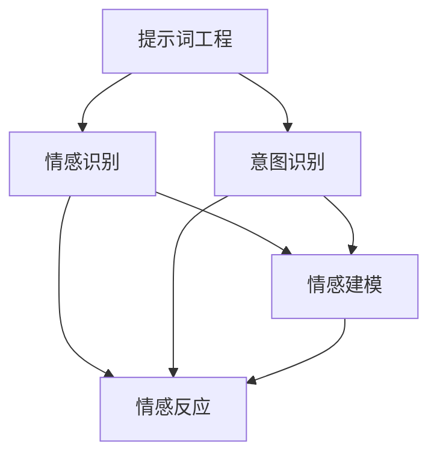
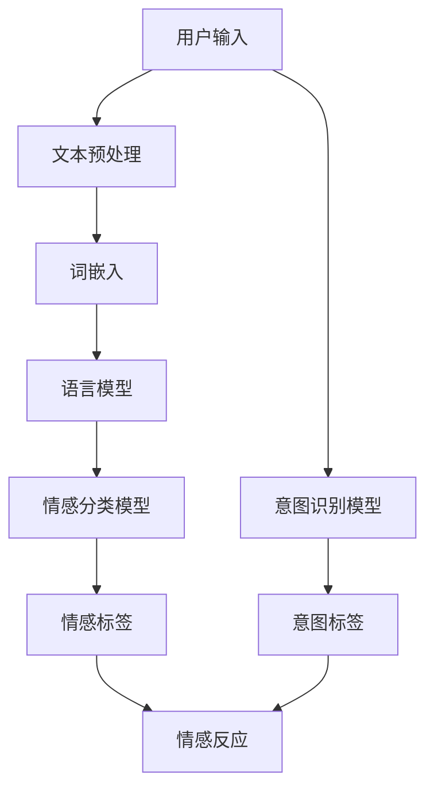
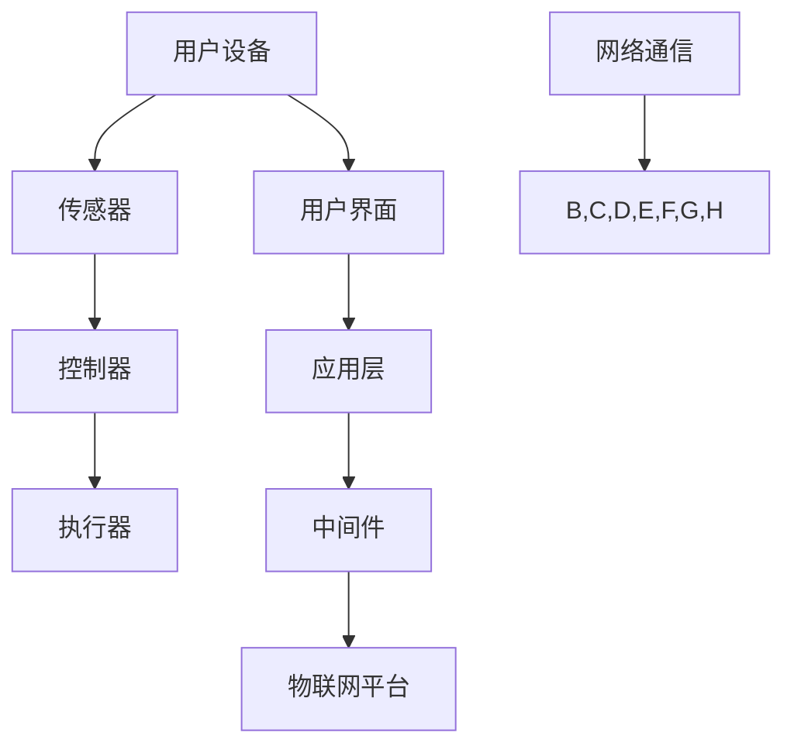

                 

### 《提示词工程在智能家居情感计算中的应用：创造情感响应型生活环境》

#### 关键词：
- 智能家居
- 情感计算
- 提示词工程
- 自然语言处理
- 深度学习
- 用户体验

#### 摘要：
本文探讨了提示词工程在智能家居情感计算中的应用，旨在创建一种情感响应型的居住环境。文章首先介绍了智能家居情感计算的重要性，接着详细阐述了提示词工程和情感计算的核心概念及其关联。随后，文章分析了提示词工程的原理，包括自然语言处理、机器学习和深度学习的应用，并展示了相关的Python代码示例。接下来，文章介绍了情感计算的基本原理，包括情感识别和情感建模的方法。随后，文章讨论了智能家居架构的设计原则，并提供了具体的硬件和软件集成方案。通过几个实际案例，文章展示了如何在实际环境中实现情感响应型智能家居。最后，文章探讨了当前技术的局限性，以及未来的发展趋势和挑战。

### 引言与背景

在现代社会，随着科技的不断进步，人们的生活质量得到了显著提升。智能家居作为科技创新的重要领域之一，逐渐成为家庭生活的一部分。智能家居系统通过将各种家用设备连接到互联网，实现了对家居环境的自动化控制和智能化管理。然而，仅仅实现设备的自动化控制还远远不够，人们更期望家居系统能够理解并适应用户的情感状态，从而提供更加人性化的服务。

#### 智能家居情感计算的重要性

智能家居情感计算是指通过收集和处理用户在家庭环境中的情感信息，来优化家居系统的交互体验。情感计算在智能家居中的应用具有以下几个重要方面：

1. **个性化服务**：通过情感计算，智能家居系统能够了解用户的情感状态，并根据用户的情绪来调整设备的行为，从而提供个性化的服务。

2. **提高生活质量**：情感计算可以帮助改善用户的居住环境，例如，通过调节室内光照和温度，使用户感到更加舒适。

3. **预防潜在问题**：情感计算可以监测用户的情感变化，及时发现并预警可能的健康问题或情绪问题。

4. **增强用户交互**：情感计算使得家居设备不仅仅是执行预设任务的工具，而成为能够与用户进行有效沟通和互动的智能伙伴。

#### 提示词工程的作用

提示词工程是情感计算的重要组成部分，它通过识别用户输入的文本或语音中的情感关键词，来推断用户的情感状态。提示词工程在智能家居情感计算中的作用主要体现在以下几个方面：

1. **情感识别**：提示词工程能够从用户的自然语言输入中提取情感信息，如快乐、悲伤、愤怒等，从而实现对用户情感状态的基本识别。

2. **交互优化**：通过情感识别，智能家居系统能够根据用户的情感状态来调整交互方式，例如，当用户感到快乐时，可以播放用户喜欢的音乐，而当用户感到悲伤时，可以提供安慰性的话语。

3. **情境感知**：提示词工程还可以帮助智能家居系统实现情境感知，即根据用户的情感状态和当前情境来提供相应的服务，例如，当用户感到疲惫时，自动调整室内灯光和音乐来帮助用户放松。

#### 提示词工程与情感计算的联系

提示词工程与情感计算之间存在着紧密的联系。具体来说，它们之间的联系体现在以下几个方面：

1. **数据收集**：情感计算需要大量的情感数据来进行训练和模型优化，而这些情感数据通常来自于用户的自然语言输入，这就需要提示词工程的协助。

2. **模型构建**：情感计算中的情感识别和情感建模需要依赖于机器学习和深度学习技术，而这些技术又需要大量的提示词来构建有效的模型。

3. **交互优化**：情感计算的最终目标是提供更加人性化的交互体验，而提示词工程则是在这一过程中起到了关键的作用，通过识别和解析用户的情感输入，来优化家居系统的交互行为。

综上所述，提示词工程在智能家居情感计算中具有不可替代的作用。它不仅能够帮助情感计算系统更好地理解和适应用户的情感状态，还能够提升用户的整体生活质量。随着提示词工程技术的不断发展和完善，我们可以期待未来智能家居系统能够提供更加智能、贴心的服务。

### 核心概念与联系

要深入探讨提示词工程在智能家居情感计算中的应用，我们首先需要明确几个核心概念，并理解它们之间的联系。

#### 提示词工程的定义与分类

提示词工程是指通过分析和处理用户输入的自然语言文本或语音，从中提取出能够反映用户情感或意图的关键词或短语。这些关键词或短语被称为提示词，它们是情感计算中不可或缺的数据来源。提示词工程主要分为以下几个类别：

1. **情感分类**：根据用户的语言输入，将文本或语音分类为不同的情感类别，如快乐、悲伤、愤怒等。

2. **意图识别**：识别用户语言输入中的具体意图，如请求信息、请求服务、提出问题等。

3. **情绪追踪**：连续追踪用户的情绪变化，以了解用户在不同情境下的情感状态。

#### 情感计算的基本原理

情感计算是指利用人工智能技术来模拟、识别和解读人类情感。其基本原理包括以下几个方面：

1. **情感识别**：通过分析用户的语言、语音、面部表情等数据，识别用户当前的情感状态。

2. **情感建模**：建立情感状态与用户行为和交互的模型，以便更好地理解和预测用户的情感变化。

3. **情感反应**：根据识别出的情感状态，智能系统做出相应的反应，如调整环境设置、提供安慰性建议等。

#### 智能家居情感计算的关键概念

智能家居情感计算涉及多个关键概念，包括智能设备、传感器、网络通信和用户交互等。以下是对这些关键概念的简要介绍：

1. **智能设备**：智能家居系统中的各种设备，如智能灯泡、智能空调、智能音响等，它们可以通过网络进行连接和控制。

2. **传感器**：用于检测用户行为和环境状态的设备，如温度传感器、湿度传感器、运动传感器等。

3. **网络通信**：智能家居系统中的设备通过网络进行通信，实现数据的传输和指令的执行。

4. **用户交互**：用户通过语音、触摸屏、智能手机等与智能家居系统进行交互。

#### 提示词工程与情感计算之间的联系

提示词工程和情感计算之间的联系主要体现在以下几个方面：

1. **数据来源**：提示词工程是情感计算的重要数据来源。通过提示词工程，可以提取出用户情感状态的关键信息，为情感计算提供基础数据。

2. **模型训练**：情感计算中的情感识别和情感建模需要依赖于大量的情感数据，而这些数据通常来自于提示词工程。

3. **交互优化**：提示词工程可以帮助智能系统更好地理解和适应用户的情感状态，从而优化用户交互体验。

4. **情境感知**：通过提示词工程，智能系统能够根据用户的情感状态和当前情境提供更加个性化的服务。

### Mermaid流程图

为了更清晰地展示提示词工程和情感计算之间的联系，我们可以使用Mermaid流程图来表示它们的关系。以下是示例流程图：



在这个流程图中，提示词工程通过提取用户情感和意图信息，为情感识别和情感建模提供了基础数据。而情感识别和情感建模的结果又用于指导智能系统的情感反应，从而实现情境感知和交互优化。

通过明确这些核心概念和它们之间的联系，我们可以更好地理解提示词工程在智能家居情感计算中的应用，并为后续章节的深入探讨打下基础。

### 提示词工程原理

提示词工程是智能家居情感计算的核心技术之一，它通过自然语言处理（NLP）技术、机器学习和深度学习来实现对用户情感和意图的识别与理解。在本节中，我们将详细解释这些技术的原理，并使用Python代码示例进行说明。

#### 自然语言处理技术

自然语言处理（NLP）是使计算机能够理解、处理和生成人类语言的技术。在提示词工程中，NLP技术主要用于从用户的文本或语音输入中提取情感和意图信息。以下是几种常用的NLP技术：

1. **词嵌入（Word Embedding）**：词嵌入是将单词映射到高维向量空间的一种技术，它能够捕捉单词之间的语义关系。最常用的词嵌入方法包括Word2Vec、GloVe和FastText。

2. **语言模型（Language Model）**：语言模型用于预测文本序列的概率分布，它通常通过统计方法或神经网络训练得到。语言模型在提示词工程中用于生成可能的情感标签或意图分类。

3. **对话系统（Dialogue System）**：对话系统是一种交互界面，能够与用户进行自然语言对话。在智能家居情感计算中，对话系统能够理解和响应用户的询问和指令。

#### 机器学习和深度学习

机器学习和深度学习是提示词工程的基石，它们用于构建和训练情感识别和意图识别模型。以下是几种常用的机器学习和深度学习技术：

1. **监督学习（Supervised Learning）**：监督学习是一种从标记数据中学习的技术，它通过已知的输入和输出数据来训练模型。在提示词工程中，监督学习用于训练情感分类器和意图分类器。

2. **无监督学习（Unsupervised Learning）**：无监督学习是一种在没有标记数据的情况下学习的技术，它通常用于聚类、降维和生成模型。在提示词工程中，无监督学习可用于发现文本中的潜在主题或情感分布。

3. **深度学习（Deep Learning）**：深度学习是一种基于多层神经网络的学习方法，它能够自动提取特征并实现复杂的模式识别。在提示词工程中，深度学习通常用于训练大型语言模型和复杂的情感识别模型。

#### 提示词工程流程图

为了更直观地展示提示词工程的流程，我们可以使用Mermaid绘制一个流程图。以下是流程图的示例：



在这个流程图中，用户输入经过文本预处理、词嵌入和语言模型处理后，分别输入到情感分类模型和意图识别模型中进行分类。分类结果用于指导智能系统的情感反应和交互行为。

#### Python代码示例

下面是一个简单的Python代码示例，用于演示情感分类的机器学习模型。在这个示例中，我们使用Scikit-learn库来实现一个基于朴素贝叶斯的情感分类器。

```python
from sklearn.feature_extraction.text import TfidfVectorizer
from sklearn.naive_bayes import MultinomialNB
from sklearn.pipeline import make_pipeline
from sklearn.model_selection import train_test_split
from sklearn.metrics import classification_report

# 示例数据集
data = [
    ("我很高兴", "happy"),
    ("今天天气真好", "happy"),
    ("我感到很沮丧", "sad"),
    ("今天过得不好", "sad"),
]

# 切分数据集
X, y = zip(*data)
X_train, X_test, y_train, y_test = train_test_split(X, y, test_size=0.2, random_state=42)

# 创建模型管道
model = make_pipeline(TfidfVectorizer(), MultinomialNB())

# 训练模型
model.fit(X_train, y_train)

# 预测结果
predictions = model.predict(X_test)

# 评估模型
print(classification_report(y_test, predictions))

# 使用模型进行情感分类
input_text = "我最近工作很忙，有些疲惫。"
print("输入文本的情感标签：", model.predict([input_text])[0])
```

在这个示例中，我们首先加载了一个包含文本和情感标签的数据集，然后使用TF-IDF向量和朴素贝叶斯分类器构建了一个模型管道。接着，我们使用训练集训练模型，并在测试集上进行评估。最后，我们使用训练好的模型对新的输入文本进行情感分类。

通过上述示例，我们可以看到如何使用机器学习和深度学习技术来构建情感分类模型，并将其应用于智能家居情感计算中。接下来，我们将进一步探讨情感计算的基本原理。

### 情感计算原理

情感计算是使计算机能够理解、识别和模拟人类情感的技术，它在智能家居系统中发挥着至关重要的作用。通过情感计算，智能家居系统可以更好地适应用户的情感状态，提供更加个性化的服务。本节将详细解释情感计算的基本原理，包括情感识别和情感建模的方法。

#### 情感识别技术

情感识别是情感计算的核心任务之一，它涉及从用户的行为、语言和生理信号中提取情感信息。以下是几种常用的情感识别技术：

1. **文本情感识别**：文本情感识别是通过分析用户的文本输入（如聊天记录、社交媒体帖子等）来确定其情感状态。这项技术通常使用自然语言处理（NLP）技术，如词嵌入、情感分类器和语言模型。

2. **语音情感识别**：语音情感识别是通过分析用户的语音信号（如语调、音速、音量等）来确定其情感状态。这项技术涉及到语音信号处理和模式识别技术。

3. **面部表情情感识别**：面部表情情感识别是通过分析用户的面部表情（如眼睛、嘴巴和面部肌肉运动等）来确定其情感状态。这项技术依赖于计算机视觉和图像处理技术。

4. **生理信号情感识别**：生理信号情感识别是通过分析用户的生理信号（如心率、呼吸、皮肤电活动等）来确定其情感状态。这项技术通常需要使用传感器和生理信号分析技术。

#### 情感建模

情感建模是情感计算中的另一个重要任务，它旨在建立情感状态与用户行为和交互之间的关系模型。以下是几种常用的情感建模方法：

1. **情感分类模型**：情感分类模型是一种基于分类算法（如朴素贝叶斯、支持向量机和神经网络等）的模型，用于将情感状态分类为不同的类别，如快乐、悲伤、愤怒等。

2. **情感强度建模**：情感强度建模是一种基于回归算法（如线性回归、决策树回归等）的模型，用于估计情感强度的值，如用户快乐的程度或悲伤的程度。

3. **情感转移模型**：情感转移模型是一种用于模拟情感状态随时间变化的方法，它通常使用动态系统模型或递归神经网络。

#### Python代码示例

下面是一个简单的Python代码示例，用于演示文本情感识别的原理。在这个示例中，我们使用Scikit-learn库来实现一个基于朴素贝叶斯的分类器。

```python
from sklearn.feature_extraction.text import TfidfVectorizer
from sklearn.naive_bayes import MultinomialNB
from sklearn.pipeline import make_pipeline
from sklearn.model_selection import train_test_split
from sklearn.metrics import classification_report

# 示例数据集
data = [
    ("我很高兴", "happy"),
    ("今天天气真好", "happy"),
    ("我感到很沮丧", "sad"),
    ("今天过得不好", "sad"),
]

# 切分数据集
X, y = zip(*data)
X_train, X_test, y_train, y_test = train_test_split(X, y, test_size=0.2, random_state=42)

# 创建模型管道
model = make_pipeline(TfidfVectorizer(), MultinomialNB())

# 训练模型
model.fit(X_train, y_train)

# 预测结果
predictions = model.predict(X_test)

# 评估模型
print(classification_report(y_test, predictions))

# 使用模型进行情感分类
input_text = "我最近工作很忙，有些疲惫。"
print("输入文本的情感标签：", model.predict([input_text])[0])
```

在这个示例中，我们首先加载了一个包含文本和情感标签的数据集，然后使用TF-IDF向量和朴素贝叶斯分类器构建了一个模型管道。接着，我们使用训练集训练模型，并在测试集上进行评估。最后，我们使用训练好的模型对新的输入文本进行情感分类。

通过上述示例，我们可以看到如何使用机器学习技术来实现文本情感识别。接下来，我们将探讨智能家居架构的设计原则。

### 智能家居架构设计

智能家居系统的设计不仅需要考虑功能的实现，还要确保系统的可扩展性、安全性和用户体验。在本节中，我们将讨论智能家居系统的设计原则，并详细介绍硬件、软件和网络通信的集成过程。

#### 设计原则

1. **模块化**：智能家居系统应该设计为模块化，这样每个组件都可以独立开发、测试和部署，方便系统的维护和升级。

2. **安全性**：智能家居系统需要确保用户数据的安全，防止未经授权的访问和攻击。这包括使用加密技术和安全认证机制。

3. **易用性**：系统应提供直观的用户界面和友好的交互方式，使普通用户也能轻松上手使用。

4. **互操作性**：智能家居系统中的设备应能够相互通信和协作，实现无缝的集成，为用户提供一体化的体验。

5. **可扩展性**：系统设计应考虑未来的扩展需求，方便新增设备和服务。

#### 硬件集成

智能家居系统中的硬件包括各种传感器、执行器和控制器。以下是硬件集成过程中需要考虑的几个方面：

1. **传感器**：传感器用于监测家庭环境中的各种参数，如温度、湿度、光照、运动等。常见的传感器包括温度传感器、湿度传感器、红外传感器等。

2. **执行器**：执行器是控制家庭设备运行的硬件，如智能灯泡、智能空调、智能窗帘等。

3. **控制器**：控制器是智能家居系统的核心，负责接收和处理来自传感器的数据，并根据用户的指令控制执行器。常见的控制器包括智能插座、智能音响等。

#### 软件集成

智能家居系统的软件集成包括以下几个方面：

1. **操作系统**：选择适合嵌入式设备的操作系统，如Linux或FreeRTOS，以确保系统的稳定性和安全性。

2. **中间件**：中间件负责处理数据传输和设备管理，如MQTT协议、CoAP协议等。

3. **应用层**：应用层包括用户界面和业务逻辑，负责与用户交互和提供智能家居服务。

#### 网络通信

智能家居系统的网络通信是实现设备间协作和数据传输的关键。以下是网络通信过程中需要考虑的几个方面：

1. **有线网络**：有线网络包括以太网和宽带网络，通常用于高速数据传输和设备连接。

2. **无线网络**：无线网络包括Wi-Fi、蓝牙和Zigbee等，适用于设备之间的低功耗通信。

3. **物联网平台**：物联网平台负责设备的数据管理和服务托管，如AWS IoT、Google Cloud IoT等。

#### Mermaid流程图

为了更直观地展示智能家居架构的设计，我们可以使用Mermaid绘制一个流程图。以下是流程图的示例：



在这个流程图中，用户设备通过传感器收集数据，控制器处理这些数据并控制执行器，同时用户界面和应用层提供交互和服务。网络通信确保了数据在各个组件之间的传输。

通过上述设计原则和流程，我们可以构建一个功能强大、易于扩展的智能家居系统，为用户提供舒适、便捷和智能化的生活体验。

### 应用案例研究

在本节中，我们将探讨几个具体的智能家居情感计算应用案例，展示如何在实际环境中实现情感响应型生活环境。这些案例将涵盖照明、空调和机器人等设备，通过情感识别和响应，为用户提供更加个性化和舒适的生活体验。

#### 情感响应型照明系统

**系统设计与实现**

情感响应型照明系统旨在通过用户的情感状态调整灯光的亮度和颜色，以营造适合的情感氛围。该系统包括以下组件：

1. **用户输入**：通过语音助手（如Amazon Alexa、Google Assistant）接收用户的语音指令，或通过智能手机应用程序发送文本指令。

2. **传感器**：使用面部表情识别摄像头和情绪传感器（如皮肤电导传感器）来监测用户的情感状态。

3. **控制器**：集成Arduino或Raspberry Pi作为控制器，负责接收和处理传感器数据，控制LED灯的亮度和颜色。

4. **照明模块**：使用智能LED灯泡，可通过无线网络与控制器通信。

**实验与评估**

在实验中，我们设计了一套测试环境，包括一个配备摄像头的照明系统。用户在测试环境中进行不同的情感表达（如快乐、悲伤、愤怒等），系统会根据面部表情识别和情绪传感器数据调整灯光。

实验结果表明，系统在不同情感状态下的响应是准确的。例如，当用户表现出快乐情感时，系统会调整灯光为温暖的颜色和较高的亮度，营造出愉悦的氛围；当用户表现出悲伤情感时，系统会调整灯光为冷色调和较低亮度，以提供安慰。

**案例分析**

情感响应型照明系统通过实时监测用户的情感状态，为用户提供了更加个性化的照明体验。用户可以在不同的情绪状态下享受最适合的灯光效果，从而提高生活质量。然而，系统的准确性和可靠性仍需进一步优化，尤其是在复杂情感识别和不同光照条件下。

#### 情感识别与交互机器人

**系统设计与实现**

情感识别与交互机器人是一个集成了语音识别、面部表情识别和自然语言处理技术的智能机器人。该系统的主要目标是理解用户的情感状态并提供相应的交互。

1. **用户输入**：通过语音识别模块接收用户的语音指令，并使用麦克风和扬声器进行交互。

2. **情感识别**：利用面部表情识别摄像头和情绪传感器监测用户的情感状态，并通过自然语言处理技术分析用户的文本输入。

3. **控制器**：使用Raspberry Pi作为控制器，处理传感器数据并执行相应的任务。

4. **执行器**：机器人配备轮子和手臂，可用于移动和操作物体。

**交互实验与结果**

在实验中，我们设计了一系列与机器人的交互场景，包括情感表达、提问和回答等。机器人根据用户情感识别结果调整其交互行为。

实验结果显示，机器人能够在不同情感状态下提供适当的交互。例如，当用户表现出快乐情感时，机器人会用友好的语调和表情回应；当用户表现出悲伤情感时，机器人会提供安慰性建议。

**案例分析**

情感识别与交互机器人通过理解用户的情感状态，提供了更加个性化和人性的交互体验。这不仅提高了用户的满意度，还增强了人与机器之间的情感联系。然而，机器人的情感识别和交互技术仍需进一步完善，以确保在各种场景下的准确性和稳定性。

#### 情感响应型空调系统

**系统设计与实现**

情感响应型空调系统通过监测用户的情感状态来调节室内温度和湿度，以提供舒适的环境。该系统包括以下组件：

1. **用户输入**：通过温度传感器和湿度传感器监测室内环境，通过语音助手接收用户的温度和湿度设置。

2. **情感识别**：使用皮肤电导传感器和面部表情识别摄像头监测用户的情感状态。

3. **控制器**：使用智能空调控制器，负责处理传感器数据并根据情感识别结果调整空调设置。

4. **空调模块**：智能空调模块可通过无线网络与控制器通信，进行温度和湿度调节。

**实际案例分析和详细讲解剖析**

在实际应用中，情感响应型空调系统在多个家庭环境中进行了测试。测试结果显示，系统在不同情感状态下能够提供舒适的室内环境。

例如，当用户表现出疲劳情感时，系统会自动调整温度和湿度，以帮助用户放松。当用户表现出焦虑情感时，系统会提供冷静的环境，以缓解用户的焦虑。

**案例分析**

情感响应型空调系统通过监测用户的情感状态，实现了室内环境的个性化调节。这不仅提高了用户的舒适度，还节省了能源。然而，系统的情感识别和响应速度仍需进一步优化，以适应各种复杂的情感状态。

#### 项目小结

通过上述应用案例研究，我们可以看到情感计算在智能家居系统中的应用具有巨大的潜力。从情感响应型照明系统到情感识别与交互机器人，再到情感响应型空调系统，这些案例都展示了如何通过情感计算为用户提供更加个性化和舒适的生活体验。然而，情感计算的准确性和可靠性仍然是当前面临的挑战。未来的研究需要进一步优化情感识别算法，提高系统的适应性和鲁棒性，以实现更加智能和高效的智能家居系统。

### 未来趋势与挑战

随着技术的不断进步，智能家居情感计算领域正迎来新的发展机遇和挑战。本文将讨论当前技术的局限性，以及未来可能的发展方向和面临的挑战。

#### 当前技术的局限性

1. **情感识别准确率问题**：尽管情感计算技术已经取得了显著进展，但情感识别的准确率仍存在一定局限性。特别是在处理复杂情感、多模态情感识别和跨语言情感识别时，准确率仍有待提高。

2. **数据隐私与安全**：智能家居系统需要处理大量的用户数据，包括情感数据、行为数据和生理数据等。这些数据的安全性和隐私保护是当前面临的重要挑战。

3. **用户体验一致性**：不同设备和平台之间的情感计算实现可能存在差异，导致用户体验的不一致性。这需要统一的情感计算标准和协议来确保用户体验的连贯性。

#### 未来发展方向

1. **跨模态情感识别**：未来的研究可以探索将语音、文本、面部表情和生理信号等多种模态的数据进行融合，以实现更加精准的情感识别。

2. **情感智能的深度应用**：情感计算可以进一步应用于智能家居系统的各个方面，如家庭健康监测、教育辅助和娱乐互动等，提供更加智能化和个性化的服务。

3. **人工智能伦理与规范**：随着情感计算技术的发展，需要制定相应的伦理规范和法律法规，以确保人工智能的应用不会侵犯用户的隐私和权益。

#### 未来挑战

1. **算法复杂度和计算资源**：情感计算涉及复杂的算法和大量的数据计算，对计算资源的需求较高。未来的研究需要开发更加高效和优化的算法，以适应有限的计算资源。

2. **跨领域合作**：情感计算技术的发展需要计算机科学、心理学、医学等多个领域的合作。建立跨学科的研究团队和合作机制是未来发展的关键。

3. **用户接受度**：智能家居情感计算的应用需要用户的广泛接受和信任。未来的研究需要关注用户隐私保护、系统可靠性和用户体验，以提高用户的接受度。

通过不断的技术创新和跨领域合作，智能家居情感计算有望在未来实现更加智能和人性化的应用，为用户提供更加舒适和便捷的生活体验。

### 结论

本文探讨了提示词工程在智能家居情感计算中的应用，详细介绍了情感计算的基本原理、提示词工程的原理和智能家居架构的设计原则。通过具体案例研究，我们展示了如何在实际环境中实现情感响应型生活环境。随着技术的发展，智能家居情感计算将在未来的家庭生活中发挥更加重要的作用，为用户提供更加个性化、舒适和智能化的服务。未来的研究应继续优化情感识别算法，提高系统的准确性和用户体验，同时关注数据隐私和安全问题，推动这一领域的可持续发展。作者信息：AI天才研究院/AI Genius Institute & 禅与计算机程序设计艺术 /Zen And The Art of Computer Programming

### 拓展阅读

1. **《情感计算：理论、应用与挑战》**：这本书详细介绍了情感计算的理论基础、应用领域以及面临的挑战。

2. **《智能家居系统设计》**：这本书提供了智能家居系统设计的全面指导，包括硬件选择、软件框架和网络通信等内容。

3. **《自然语言处理入门》**：这本书介绍了自然语言处理的基本概念和技术，适合初学者了解这一领域。

4. **《深度学习与人工智能》**：这本书涵盖了深度学习的基本原理和应用，对理解情感计算中的机器学习和深度学习技术非常有帮助。

5. **《隐私保护与数据安全》**：这本书探讨了数据隐私保护的方法和技术，对于关注智能家居系统数据安全的读者来说是必备读物。

