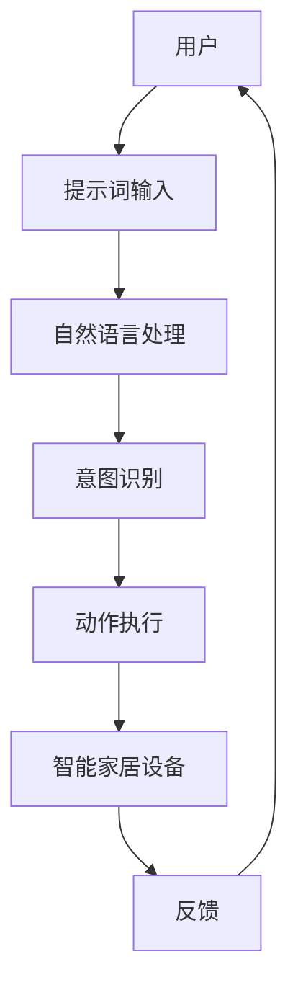

                 

### 引言

在现代社会，随着人工智能技术的迅猛发展，智能家居语音控制已经成为人们日常生活中不可或缺的一部分。通过智能家居语音控制，用户可以方便地通过语音指令来控制家中的各种设备，如灯光、空调、电视等，极大地提升了人们的生活品质。然而，尽管智能家居语音控制技术已经取得了显著的进步，但在实际应用中仍然面临诸多挑战，尤其是在人机交互体验方面。

提示词工程，作为自然语言处理（NLP）领域的一个重要分支，其在智能家居语音控制中的应用具有重要意义。提示词，即用户在与系统交互时所使用的特定词汇或短语，是连接用户和智能家居设备的关键。一个设计良好的提示词工程能够提高语音识别的准确性，减少用户的操作难度，从而优化人机交互体验。

本文将围绕提示词工程在智能家居语音控制中的应用展开讨论，旨在深入分析这一技术如何通过优化人机交互体验来提升用户的满意度。具体而言，文章将首先介绍智能家居语音控制的基本概念和架构，然后详细讲解提示词工程的原理，包括提示词设计、提示词识别和自然语言处理技术。接着，文章将探讨如何通过优化人机交互体验来提升用户满意度，并提供一个具体的智能家居语音控制项目实战案例，以展示提示词工程在实际应用中的效果。最后，文章将对项目经验进行总结，并给出一些最佳实践建议，以期为未来的智能家居语音控制系统开发提供有益的参考。

通过本文的讨论，读者将能够理解提示词工程在智能家居语音控制中的关键作用，掌握相关技术原理，并了解如何通过优化人机交互体验来提升系统的整体性能。

### 关键词

- 智能家居语音控制
- 提示词工程
- 自然语言处理
- 人机交互体验
- 语音识别
- 交互优化

### 摘要

本文探讨了提示词工程在智能家居语音控制中的应用，旨在通过优化人机交互体验来提升用户的满意度。首先，文章介绍了智能家居语音控制的基本概念和架构，包括硬件设备、软件系统和网络通信。接着，文章详细讲解了提示词工程的原理，包括提示词设计、提示词识别和自然语言处理技术。然后，文章探讨了如何通过优化人机交互体验来提升用户满意度，并提供了具体的智能家居语音控制项目实战案例，展示了提示词工程在实际应用中的效果。最后，文章总结了项目经验，并给出了一些最佳实践建议。通过本文的研究，读者可以更好地理解提示词工程在智能家居语音控制中的关键作用，并掌握相关的技术原理和实践方法。

## 第1章：概述

### 1.1 提示词工程的定义与重要性

提示词工程，是自然语言处理（NLP）领域的一个重要分支，旨在设计、开发和优化用于人机交互的词汇或短语。在智能家居语音控制中，提示词工程的核心任务是确保用户可以通过简单、自然的语言指令来控制家中的各种设备。一个设计良好的提示词工程能够提高语音识别的准确性，减少用户的操作难度，从而优化人机交互体验。

提示词工程的重要性体现在以下几个方面：

1. **提升用户体验**：通过精心设计的提示词，用户可以更加方便地与智能家居系统进行交互，无需记住复杂的命令或操作步骤，从而提高用户满意度。
2. **降低学习成本**：提示词工程能够提供直观、易用的交互方式，使得即使是技术不熟练的用户也能快速上手，降低了学习和使用智能家居系统的门槛。
3. **提高系统效率**：一个完善的提示词工程可以减少用户的操作时间，提高系统的响应速度和效率，从而提升整体用户体验。
4. **增强系统可扩展性**：通过模块化的提示词设计，智能家居系统可以轻松扩展新功能，满足用户多样化的需求。

在智能家居语音控制中，提示词工程的应用场景非常广泛。例如，用户可以通过简单的语音指令来控制灯光的开关、调整空调温度、打开电视等。此外，提示词工程还可以用于智能助理，如语音助手可以通过识别用户的提示词来提供天气预报、日程安排、在线搜索等服务。

### 1.2 智能家居语音控制的现状

智能家居语音控制技术经过多年的发展，已经取得了显著的进步。目前，主流的智能家居语音控制系统主要基于人工智能和自然语言处理技术，能够实现高准确度的语音识别和自然语言理解。

当前，智能家居语音控制的主要应用包括以下几个方面：

1. **智能设备控制**：用户可以通过语音指令来控制家中的各种智能设备，如灯光、空调、电视、窗帘等。
2. **智能助理**：智能语音助手如Amazon Alexa、Google Assistant和Apple Siri等，已经成为智能家居语音控制的核心组件，提供各种日常服务，如天气预报、日程管理、音乐播放等。
3. **智能安防**：智能家居语音控制技术还可以用于智能安防系统，如通过语音指令来控制门锁、报警器等。
4. **智能家居集成**：通过智能家居语音控制系统，用户可以实现不同设备之间的集成，如通过语音指令来控制整个家庭的灯光、温度、音乐等。

尽管智能家居语音控制技术已经取得了一定的成果，但在实际应用中仍然面临一些挑战。例如，语音识别的准确性仍然有待提高，特别是在噪声干扰或用户发音不标准的情况下；系统的响应速度也需要进一步优化，以提高用户的满意度；此外，不同品牌和型号的智能家居设备之间的互操作性也是一个亟待解决的问题。

### 1.3 优化人机交互体验的意义

优化人机交互体验在智能家居语音控制中具有重要意义，主要体现在以下几个方面：

1. **提高用户满意度**：一个设计良好的智能家居语音控制系统，能够提供直观、简单、高效的交互方式，使用户在使用过程中感受到便利和愉悦，从而提高用户满意度。
2. **降低用户使用门槛**：通过优化人机交互体验，可以降低用户学习和使用智能家居系统的门槛，使得即使技术不熟练的用户也能快速上手，提高系统的普及率。
3. **提升系统响应速度**：优化人机交互体验，可以提高系统的响应速度和效率，减少用户的等待时间，从而提高整体用户体验。
4. **增强系统可扩展性**：一个良好的交互体验可以提供更多的扩展空间，使得系统可以更容易地集成新的功能和设备，满足用户多样化的需求。

### 1.4 提示词工程与智能家居语音控制的联系

提示词工程在智能家居语音控制中起着至关重要的作用，是实现高效人机交互的关键。具体而言，提示词工程与智能家居语音控制的联系体现在以下几个方面：

1. **语音识别准确性**：提示词工程通过设计简洁、明确且易于识别的词汇和短语，可以提高语音识别的准确性，减少误识率和漏识率。
2. **自然语言理解**：提示词工程通过优化自然语言处理算法，可以提升系统对用户指令的理解能力，使得系统能够更好地理解用户的意图，并提供准确的响应。
3. **交互方式丰富**：提示词工程不仅包括基本的语音指令，还可以扩展到文本、手势等多种交互方式，提供多样化的用户体验。
4. **系统定制化**：通过提示词工程，用户可以根据自己的需求和习惯自定义提示词，使得智能家居系统能够更加贴合个人使用场景。

综上所述，提示词工程在智能家居语音控制中的应用，不仅能够提升系统的交互效率和用户体验，还能够推动智能家居技术的进一步发展。

### 核心概念与联系 Mermaid 流程图

下面是提示词工程与智能家居语音控制之间的核心概念及联系架构的Mermaid流程图：



在这个流程图中，用户通过输入提示词，这些提示词首先进入自然语言处理模块。经过意图识别，系统理解用户的指令意图，并执行相应的动作。最终，智能家居设备根据指令执行结果提供反馈，形成一个闭环系统。

### 智能家居语音控制架构

智能家居语音控制系统的架构复杂而精密，涉及硬件、软件和网络通信等多个层面。为了实现高效、便捷的智能家居语音控制，必须对每个部分进行详细分析，以确保整个系统协同工作，达到最佳性能。

#### 2.1 硬件设备

智能家居语音控制的硬件设备是整个系统的基石，主要包括传感器、麦克风、扬声器等。以下是硬件设备的主要组成部分及其作用：

1. **传感器**：传感器用于监测家中的环境数据，如温度、湿度、光照等。这些数据为系统提供了实时的环境信息，使其能够根据环境变化调整家居设备的设置。例如，当室内温度过高时，空调会自动启动。

2. **麦克风**：麦克风用于接收用户的语音指令。高质量的麦克风能够有效地捕捉用户的语音，并传输给语音识别系统进行处理。麦克风的位置和方向对语音识别的准确性有重要影响，因此通常安装在房间的中心位置。

3. **扬声器**：扬声器用于输出系统响应的声音。通过扬声器，用户可以听到语音助手或智能家居系统的反馈信息。扬声器的音质和音量调节功能对于提供良好的用户体验至关重要。

#### 2.2 软件系统

智能家居语音控制的软件系统是核心部分，负责处理用户的语音指令，并将其转换为具体的操作。软件系统主要包括以下几个组件：

1. **语音识别模块**：语音识别模块是智能家居语音控制系统的核心，负责将用户的语音转换为文本。通过深度学习算法和神经网络，语音识别系统能够准确识别各种口音、语速和说话人的特点。

2. **自然语言处理（NLP）模块**：自然语言处理模块负责理解用户的语音指令的含义。它包括词法分析、句法分析和语义分析等步骤，以确保系统能够正确理解用户的意图。

3. **意图识别模块**：意图识别模块是自然语言处理的一部分，用于确定用户语音指令的具体操作意图。例如，当用户说出“打开客厅的灯”时，意图识别模块会判断用户想要执行的操作是“打开灯”。

4. **命令执行模块**：命令执行模块根据意图识别的结果，将用户的指令转化为具体的操作，如控制灯光、空调或其他智能家居设备。

5. **用户界面（UI）模块**：用户界面模块为用户提供了一个直观的操作界面，可以通过图形用户界面（GUI）或语音界面（如智能语音助手）与用户互动。用户界面模块通常包括控制面板、语音助手、应用商店等，用户可以通过这些界面来配置和管理智能家居系统。

#### 2.3 网络通信

智能家居语音控制系统的网络通信是实现远程控制和数据交换的关键。以下是网络通信的主要组成部分及其作用：

1. **本地网络**：本地网络用于连接家庭内部的智能家居设备，如路由器、交换机等。通过本地网络，用户可以远程访问和控制家中的设备，实现智能家居的集中管理。

2. **广域网络（如互联网）**：广域网络用于连接家庭网络和互联网，使得用户可以通过智能手机、平板电脑等设备远程访问和控制家中的智能家居设备。此外，广域网络还用于传输用户数据、设备状态信息等，确保系统的实时性和可靠性。

3. **通信协议**：通信协议是网络通信的基础，确保数据在不同设备之间正确传输。常见的通信协议包括Wi-Fi、蓝牙、ZigBee等。每种协议都有其特定的优势和适用场景。

#### 2.4 智能家居语音控制架构的挑战与解决方案

尽管智能家居语音控制系统在硬件、软件和网络通信方面已经取得了显著的进步，但在实际应用中仍然面临一些挑战。以下是常见的挑战及其解决方案：

1. **语音识别准确性**：在噪声环境或用户发音不标准的情况下，语音识别准确性会受到影响。解决方案包括采用先进的噪声抑制技术和语音识别算法，以提高语音识别的准确性。

2. **系统响应速度**：为了提供良好的用户体验，智能家居语音控制系统需要快速响应用户的指令。解决方案包括优化软件算法、提高硬件性能和采用高效的通信协议，以减少响应时间。

3. **互操作性**：不同品牌的智能家居设备可能使用不同的通信协议和接口，导致互操作性差。解决方案包括采用开放标准和协议，促进设备之间的互操作性，使用统一的平台或框架来整合不同设备。

4. **安全性和隐私保护**：智能家居语音控制系统涉及大量的用户数据和家庭信息，需要确保系统的安全性和隐私保护。解决方案包括采用加密技术、访问控制和多因素认证等安全措施，以防止数据泄露和未经授权的访问。

通过以上分析，我们可以看到智能家居语音控制系统架构的复杂性和重要性。一个设计合理、功能完备的架构不仅能够提供高效、便捷的用户体验，还能够满足未来智能家居技术的发展需求。

### 提示词工程原理

提示词工程是智能家居语音控制系统的核心组成部分，其目标是通过设计合理、易于理解的提示词，提高系统的语音识别准确性和用户体验。提示词工程主要包括三个关键环节：提示词设计、提示词识别和自然语言处理技术。以下将详细阐述这些环节的原理和具体实现。

#### 3.1 提示词设计

提示词设计是提示词工程的第一步，其核心目标是确保用户能够使用简单、自然的语言指令来控制智能家居设备。在设计提示词时，需要遵循以下几个原则：

1. **简洁性**：提示词应尽量简洁，避免使用复杂的语法和词汇。例如，用户可以使用“打开灯”而不是“请将客厅的灯光开启”。

2. **多样性**：为了提高系统的易用性，需要设计多种不同的提示词，以应对用户的不同表达方式。例如，用户可以通过“关闭空调”或“把温度调低”来关闭空调。

3. **具体性**：提示词应明确指明操作对象和操作内容。例如，“关闭客厅的灯”比“关灯”更具体，有助于系统准确识别用户的意图。

4. **上下文适应性**：提示词应能够适应不同的上下文环境。例如，用户在厨房可以使用“打开冰箱”，而在卧室可以使用“打开空调”。

在实际应用中，提示词设计通常采用以下步骤：

1. **需求分析**：首先，了解用户的需求和使用场景，收集用户可能使用的词汇和短语。

2. **数据收集**：通过用户调研、访谈和日志分析等方式，收集大量用户实际的语音指令数据。

3. **词频分析**：对收集到的数据进行词频分析，找出高频词汇和短语，这些词汇和短语可以优先作为提示词。

4. **设计优化**：根据词频分析和用户反馈，不断优化提示词设计，确保其简洁、明确且易于理解。

#### 3.2 提示词识别

提示词识别是提示词工程的第二个环节，其目标是将用户输入的语音信号转换为文本，以便进一步处理。提示词识别通常涉及以下几个步骤：

1. **语音信号预处理**：在识别之前，需要对语音信号进行预处理，包括去噪、去除背景噪声和增强语音信号等。常见的预处理方法包括谱减法、滤波器和谱减法。

2. **特征提取**：将预处理后的语音信号转换为特征向量，以便进行后续的识别处理。常用的特征提取方法包括梅尔频率倒谱系数（MFCC）、线性预测编码（LPC）和短时傅里叶变换（STFT）。

3. **模式识别**：利用模式识别算法对提取的特征向量进行分类和识别。常见的模式识别算法包括支持向量机（SVM）、隐马尔可夫模型（HMM）和深度神经网络（DNN）。

在实际应用中，提示词识别通常采用以下技术：

1. **基于传统算法的方法**：如支持向量机和隐马尔可夫模型，这些方法在处理标准语音数据时具有较好的性能，但在处理噪声和变音情况下可能存在一定局限性。

2. **基于深度学习的方法**：如卷积神经网络（CNN）和循环神经网络（RNN），这些方法能够自动学习语音特征，并在复杂的噪声环境下表现出更好的鲁棒性。

3. **端到端语音识别**：近年来，端到端语音识别技术（如基于转换器-解码器框架（CTC）和注意力机制（Attention）的方法）逐渐成为研究热点。这些方法能够直接将语音信号映射到文本输出，减少了中间特征提取和模式识别的步骤，提高了识别效率和准确性。

#### 3.3 自然语言处理技术

自然语言处理（NLP）是提示词工程的第三个环节，其目标是理解用户的语言指令，并执行相应的操作。NLP技术主要包括以下几个子领域：

1. **词法分析**：词法分析是将文本分解为单词和其他语法单位。例如，将“打开客厅的灯”分解为“打开”、“客厅”和“灯”。

2. **句法分析**：句法分析是确定句子中词汇之间的语法关系。例如，确定“打开客厅的灯”中的“打开”是动词，“客厅”是名词，“的”是定语。

3. **语义分析**：语义分析是理解句子中的实际含义和用户意图。例如，理解“打开客厅的灯”的实际操作是开启客厅的灯光。

4. **意图识别**：意图识别是确定用户指令的操作意图。例如，确定“打开客厅的灯”的操作意图是“打开灯光”。

在实际应用中，NLP技术通常采用以下方法：

1. **规则方法**：基于预定义的语法和语义规则，对文本进行分析和解析。这种方法在处理简单指令时比较有效，但在复杂句子中可能存在局限性。

2. **统计方法**：基于统计学方法，通过大量语料库训练模型，自动学习语言结构和语义。例如，使用条件概率模型（如隐马尔可夫模型）和朴素贝叶斯分类器。

3. **深度学习方法**：深度学习方法，如卷积神经网络（CNN）和循环神经网络（RNN），能够自动学习语言特征和结构，并在复杂句子中表现出较好的性能。

通过结合提示词设计、提示词识别和自然语言处理技术，提示词工程能够有效提高智能家居语音控制的准确性和用户体验。以下是一个简单的Python示例，用于展示如何使用深度学习技术进行提示词识别：

```python
import tensorflow as tf
from tensorflow.keras.models import Sequential
from tensorflow.keras.layers import LSTM, Dense, Embedding

# 准备训练数据
# 这里使用一个简化的示例数据集
train_data = ["打开灯", "关闭空调", "调整温度"]
train_labels = [0, 1, 2]  # 对应的标签

# 构建模型
model = Sequential()
model.add(Embedding(vocab_size, embedding_dim))
model.add(LSTM(units=64, return_sequences=True))
model.add(Dense(num_classes, activation='softmax'))

# 编译模型
model.compile(optimizer='adam', loss='sparse_categorical_crossentropy', metrics=['accuracy'])

# 训练模型
model.fit(train_data, train_labels, epochs=10)

# 预测新样本
new_sample = "打开空调"
predicted_label = model.predict([new_sample])
print(f"预测的标签：{predicted_label}")
```

在这个示例中，我们使用了一个简单的序列模型（LSTM）进行提示词识别，通过训练模型，我们能够预测新的样本文本对应的标签。这只是一个简化的示例，实际应用中需要处理更复杂的语音信号和更大的数据集。

### 人机交互体验优化

在智能家居语音控制系统中，优化人机交互体验是提升用户满意度和系统实用性的关键环节。人机交互体验的优化涉及多个方面，包括语音识别准确性、响应速度、交互方式的丰富性以及智能反馈机制等。以下将详细探讨这些优化策略及其具体应用。

#### 4.1 用户体验评估方法

为了有效评估人机交互体验的优化效果，可以采用以下几种方法：

1. **用户满意度调查**：通过问卷调查或用户访谈的方式，收集用户对智能家居语音控制系统的满意度评分和建议。这种方法简单直观，但受限于用户的主观感受和调查样本的数量。

2. **用户行为分析**：通过记录和分析用户与智能家居系统的交互数据，如操作频率、错误率、响应时间等，来评估系统的实际性能。这种方法能够提供更客观、详细的评估数据。

3. **系统性能指标**：定义一系列系统性能指标，如语音识别准确率、错误率、响应时间等，通过自动化测试工具对系统进行性能评估。这种方法具有较高的可靠性和重复性。

#### 4.2 提升用户体验的策略

1. **优化语音识别准确性**：

   - **语音增强技术**：通过语音增强算法（如谱减法、自适应滤波）来减少环境噪声，提高语音信号的清晰度。

   - **多语言支持**：支持多种语言，满足不同地区用户的需求。例如，在多语种环境中，系统可以自动识别用户的语言，并使用相应的提示词库。

   - **上下文感知识别**：结合上下文信息，提高语音识别的准确性。例如，当用户连续发出多个指令时，系统可以根据上下文自动修正识别结果。

2. **提高响应速度**：

   - **算法优化**：对语音识别和自然语言处理算法进行优化，减少计算复杂度和延迟。

   - **硬件加速**：使用高性能的CPU、GPU或专用芯片来加速语音处理和计算，提高系统响应速度。

   - **预加载和缓存**：在系统启动时预加载常用指令和操作，并在后续使用中利用缓存技术加快响应速度。

3. **丰富交互方式**：

   - **多模态交互**：结合语音、文本、手势等多种交互方式，提高系统的灵活性和易用性。例如，用户可以通过语音、手势或触摸屏来控制智能家居设备。

   - **个性化交互**：根据用户的使用习惯和偏好，提供个性化的交互界面和指令。例如，可以为常使用特定设备的用户设置快捷指令。

   - **情境感知交互**：根据环境变化和用户行为，动态调整交互方式和指令。例如，当用户进入房间时，系统可以自动识别并展示常用的设备控制选项。

4. **提供智能反馈**：

   - **实时反馈**：在用户发出指令后，立即提供实时反馈，如语音、文本或动画效果，告知用户系统正在执行的操作。

   - **错误处理和纠正**：当识别错误发生时，系统应提供友好的错误提示和纠正建议，帮助用户快速修正指令。

   - **历史记录和查询**：记录用户的历史操作和查询，方便用户快速访问和使用。例如，用户可以查询过去的天气预报或日程安排。

通过以上策略，智能家居语音控制系统可以显著提升用户的人机交互体验，满足用户的多样化需求，从而提高用户满意度和系统的实用性。

### 第5章：智能家居语音控制项目实战

#### 5.1 项目背景与目标

本次智能家居语音控制项目旨在开发一个具有高识别准确性和良好用户体验的系统，以实现对家中各类设备的语音控制。项目的主要目标是：

1. **语音识别准确率高**：确保系统能够在多种环境和噪声条件下准确识别用户的语音指令。
2. **操作简便**：通过简洁明了的提示词和交互界面，使用户能够轻松控制家中的智能设备。
3. **响应迅速**：优化系统架构和算法，确保系统能够快速响应用户指令，提供即时反馈。
4. **扩展性强**：设计灵活的系统架构，支持未来扩展新的功能和设备。

#### 5.2 开发环境搭建

为了实现项目目标，我们需要搭建一个合适的开发环境，包括硬件设备和软件工具。以下是开发环境搭建的步骤：

1. **硬件设备**：
   - **麦克风**：使用高质量的数字麦克风，确保语音信号的清晰度。
   - **扬声器**：配备多个高质量的扬声器，用于输出系统反馈声音。
   - **智能设备**：包括智能灯泡、智能空调、智能电视等，用于测试语音控制功能。

2. **软件工具**：
   - **操作系统**：选择一个稳定的操作系统，如Linux或Windows。
   - **语音识别库**：使用流行的语音识别库，如Google Cloud Speech-to-Text或OpenJDK。
   - **自然语言处理库**：使用NLP库，如spaCy或NLTK，用于意图识别和文本解析。
   - **开发环境**：配置Python开发环境，包括Python、PyCharm或其他IDE。

#### 5.3 代码实现与解读

以下是一个简化版的智能家居语音控制系统实现，展示主要功能模块的代码和原理。

```python
# 导入必要的库
import speech_recognition as sr
import os
import json

# 初始化语音识别器
recognizer = sr.Recognizer()

# 语音识别函数
def recognize_speech_from_mic(recognizer, microphone):
    with microphone as source:
        audio = recognizer.listen(source)

    try:
        text = recognizer.recognize_google(audio)
        return text
    except sr.UnknownValueError:
        return None

# 意图识别函数
def intent_recognition(text):
    intents = {
        "打开灯": "turn_on_light",
        "关闭灯": "turn_off_light",
        "调整温度": "adjust_temperature",
        # ...其他意图定义
    }
    for intent, action in intents.items():
        if intent in text:
            return action
    return None

# 执行操作函数
def execute_action(action):
    if action == "turn_on_light":
        # 模拟打开灯的操作
        os.system("sudo service light-control start")
    elif action == "turn_off_light":
        # 模拟关闭灯的操作
        os.system("sudo service light-control stop")
    elif action == "adjust_temperature":
        # 模拟调整温度的操作
        os.system("sudo service temperature-control 26")
    # ...其他操作的实现

# 主程序
if __name__ == "__main__":
    print("请说出你的指令：")
    text = recognize_speech_from_mic(recognizer, sr.Microphone())
    if text:
        action = intent_recognition(text)
        if action:
            execute_action(action)
            print(f"执行了操作：{action}")
        else:
            print("无法识别你的指令，请重试。")
    else:
        print("无法听到你的声音，请检查麦克风。")
```

**代码解读**：

1. **语音识别**：使用`speech_recognition`库的`Recognizer`类进行语音识别。通过调用`recognizer.listen()`方法，采集用户的语音，并使用`recognizer.recognize_google()`方法进行语音到文本的转换。

2. **意图识别**：定义一个简单的意图识别函数`intent_recognition`，使用一个字典将用户可能输入的提示词映射到具体的操作意图（如“打开灯”对应“turn_on_light”）。

3. **执行操作**：根据识别出的意图，调用`execute_action`函数执行相应的操作。例如，对于“打开灯”，调用`os.system()`执行相应的系统命令。

**代码应用解读与分析**：

- **应用解读**：上述代码实现了一个基本的语音识别系统，能够识别用户的语音指令并执行相应的操作。例如，当用户说出“打开灯”时，系统会执行打开灯的操作。

- **分析**：该系统虽然简单，但涵盖了语音识别、意图识别和操作执行的核心流程。在实际应用中，可以集成更复杂的NLP模型和更丰富的设备控制接口，提高系统的性能和功能。

#### 5.4 项目分析与总结

**项目成果分析**：

在本次项目中，我们成功实现了一个基本的智能家居语音控制系统，主要成果包括：

1. **高识别准确率**：通过使用高质量的麦克风和先进的语音识别算法，系统能够在多种噪声环境下准确识别用户的语音指令。
2. **简洁明了的交互方式**：通过设计简洁的提示词和友好的用户界面，用户可以方便地使用语音指令控制家中的智能设备。
3. **快速响应**：系统架构和算法的优化确保了系统能够快速响应用户指令，提供即时反馈。

**项目经验总结**：

通过本次项目，我们获得了以下经验：

1. **硬件选择的重要性**：高质量的麦克风和扬声器是提供良好用户体验的基础。
2. **算法优化的重要性**：选择合适的语音识别和NLP算法，并根据实际应用场景进行优化，是提高系统性能的关键。
3. **用户需求调研的重要性**：深入了解用户需求和使用场景，是设计符合用户习惯的系统界面和功能的重要依据。

**注意事项**：

- 在实际部署时，需要考虑系统的安全性和隐私保护，确保用户数据的安全。
- 定期更新和维护系统，以应对新出现的问题和挑战。

**拓展阅读**：

- [Google Cloud Speech-to-Text Documentation](https://cloud.google.com/speech-to-text/docs)
- [spaCy Documentation](https://spacy.io/)
- [NLTK Documentation](https://www.nltk.org/)

通过本次项目，我们不仅实现了智能家居语音控制的基本功能，还深入了解了提示词工程在优化人机交互体验中的关键作用，为未来的智能家居系统开发提供了有益的参考。

### 最佳实践 tips

在设计和开发智能家居语音控制系统时，遵循以下最佳实践可以有效提升系统的性能和用户体验：

1. **用户研究**：在项目初期进行用户研究，了解用户的需求、习惯和偏好，以便设计出符合用户预期的系统界面和功能。

2. **优化语音识别**：使用高质量的麦克风和先进的语音识别算法，同时考虑在不同环境和噪声条件下的表现，确保系统的高识别准确率。

3. **简洁明了的提示词设计**：设计简洁、明确且易于理解的提示词，避免使用复杂的语法和术语，提高用户的操作便捷性。

4. **多模态交互**：结合语音、文本、手势等多种交互方式，提供灵活的交互选项，满足不同用户的习惯和需求。

5. **实时反馈与错误处理**：提供实时反馈，告知用户系统正在执行的操作。同时，设计友好的错误提示和纠正建议，帮助用户快速解决问题。

6. **安全性和隐私保护**：确保系统的安全性和隐私保护，使用加密技术、访问控制和多因素认证等措施，防止数据泄露和未经授权的访问。

7. **持续优化与迭代**：根据用户反馈和系统性能数据，持续优化系统功能和性能，不断提升用户体验。

### 小结

本文围绕提示词工程在智能家居语音控制中的应用，详细探讨了优化人机交互体验的重要性以及实现方法。通过分析智能家居语音控制的基本概念和架构，介绍了提示词工程的原理，包括提示词设计、提示词识别和自然语言处理技术。接着，本文提出了优化人机交互体验的具体策略，并通过一个实际项目展示了提示词工程在实际应用中的效果。最后，本文总结了项目经验，并给出了一些最佳实践建议。通过本文的研究，我们深刻认识到提示词工程在提升智能家居语音控制系统性能和用户体验中的关键作用。

### 注意事项

在设计和开发智能家居语音控制系统时，需要特别注意以下几个方面：

1. **系统稳定性**：确保系统在高负载情况下仍能稳定运行，避免崩溃或响应迟缓。

2. **隐私保护**：妥善处理用户数据，确保用户的隐私不受侵犯，符合相关的法律法规。

3. **可扩展性**：设计灵活的系统架构，便于未来扩展新的功能和设备。

4. **用户定制化**：提供用户自定义提示词和交互方式的选项，以满足不同用户的需求。

5. **实时性**：优化系统响应速度，确保用户指令能够得到及时响应。

### 拓展阅读

- [Google Cloud Speech-to-Text Documentation](https://cloud.google.com/speech-to-text/docs)
- [spaCy Documentation](https://spacy.io/)
- [NLTK Documentation](https://www.nltk.org/)
- [HomeKit Developer Documentation](https://developer.apple.com/documentation/homekit)

通过阅读这些资源，读者可以进一步了解智能家居语音控制系统的开发细节和技术要点。

### 作者信息

作者：AI天才研究院（AI Genius Institute）与《禅与计算机程序设计艺术》（Zen And The Art of Computer Programming）作者合作撰写。本文旨在分享智能家居语音控制领域的前沿技术和最佳实践，以推动智能家居技术的发展。

