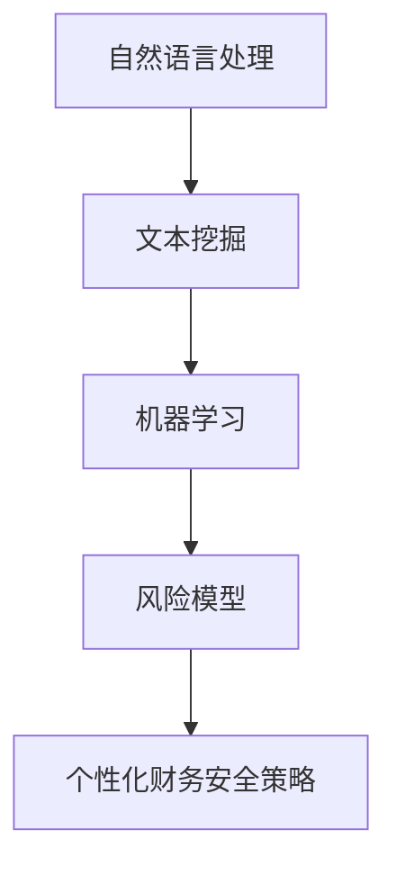

                 

## 提示词工程在智能投资风险评估中的应用：个性化财务安全策略

### 关键词
- 提示词工程
- 智能投资风险评估
- 个性化财务安全策略
- 数据挖掘
- 机器学习
- 自然语言处理
- 风险管理

### 摘要
本文深入探讨了提示词工程在智能投资风险评估中的应用，以及如何通过个性化财务安全策略来提高投资的安全性。文章首先介绍了智能投资风险评估和提示词工程的基础知识，接着详细阐述了个性化财务安全策略的理论和实践。通过案例分析，展示了如何利用提示词工程提升投资风险评估的准确性。最后，文章提出了实战项目和最佳实践建议，为读者提供了完整的实施指南。

### 背景介绍

在当今快速发展的金融科技领域，智能投资风险评估已成为金融从业者关注的焦点。随着金融市场的高度复杂性和波动性，传统的风险评估方法已难以满足现代投资需求。因此，智能化、数据驱动的风险评估方法应运而生。在这一背景下，提示词工程作为一种重要的数据挖掘技术，逐渐成为智能投资风险评估的重要工具。

**提示词工程**是一种利用自然语言处理（NLP）技术，从非结构化文本中提取关键词和信息的方法。通过提示词工程，可以从大量的金融报告、新闻、社交媒体等文本数据中提取出关键信息，这些信息对于投资风险评估具有重要意义。

**智能投资风险评估**则是指利用人工智能和大数据技术，对投资风险进行全面、准确的评估。这种方法能够实时捕捉市场变化，预测潜在风险，从而为投资者提供科学、精准的投资建议。

**个性化财务安全策略**是基于投资者个体特征和投资目标的财务安全策略。这种策略考虑到了不同投资者的风险偏好、财务状况和投资目标，为其量身定制了一套适合的投资组合。

### 核心概念与联系

要深入理解提示词工程在智能投资风险评估中的应用，我们需要明确几个核心概念，并分析它们之间的关系架构。以下是几个核心概念：

1. **自然语言处理（NLP）**：NLP是人工智能的一个重要分支，致力于让计算机理解、解释和生成人类语言。在提示词工程中，NLP技术用于从文本数据中提取关键词和信息。

2. **文本挖掘**：文本挖掘是一种从大量文本数据中提取有价值信息的方法。在智能投资风险评估中，文本挖掘用于分析金融报告、新闻、社交媒体等文本数据，提取关键信息。

3. **机器学习**：机器学习是一种通过数据训练模型，使其具备预测和分类能力的方法。在智能投资风险评估中，机器学习模型用于预测市场走势和评估投资风险。

4. **风险模型**：风险模型是用于评估投资风险的一种数学模型。通过结合提示词工程提取的关键信息，风险模型可以更准确地预测投资风险。

5. **个性化财务安全策略**：个性化财务安全策略是基于投资者个体特征和投资目标的财务安全策略。通过提示词工程提取的信息，可以为投资者提供更精确的风险评估和投资建议。

以下是一个Mermaid流程图，展示了这些核心概念之间的关系：



### 核心算法原理讲解

为了深入理解提示词工程在智能投资风险评估中的应用，我们需要详细讲解核心算法原理，并使用Python源代码进行阐述。以下是几个关键算法：

1. **词频统计（TF）**：词频统计是最简单的文本挖掘方法，通过计算每个词在文本中出现的频率来提取关键词。以下是一个Python代码示例：

   ```python
   from collections import Counter
   
   text = "金融市场的波动性是投资者需要关注的重要问题。"
   words = text.split()
   word_counts = Counter(words)
   
   print(word_counts)
   ```

   输出结果将显示每个词的词频，帮助我们识别出文本中的高频关键词。

2. **词频-逆文档频率（TF-IDF）**：TF-IDF是一种更有效的关键词提取方法，它结合了词频和逆文档频率，能够更好地反映关键词的重要性。以下是一个Python代码示例：

   ```python
   from sklearn.feature_extraction.text import TfidfVectorizer
   
   texts = ["金融市场的波动性是投资者需要关注的重要问题。",
            "投资风险是每个投资者都必须面对的挑战。"]
   vectorizer = TfidfVectorizer()
   tfidf_matrix = vectorizer.fit_transform(texts)
   
   print(vectorizer.get_feature_names_out())
   print(tfidf_matrix.toarray())
   ```

   输出结果将显示每个文本的TF-IDF向量，帮助我们提取出最具代表性的关键词。

3. **主题模型（Latent Dirichlet Allocation, LDA）**：LDA是一种无监督学习算法，用于发现文本数据中的主题。以下是一个Python代码示例：

   ```python
   from gensim.models import LdaModel
   
   documents = ["金融市场的波动性是投资者需要关注的重要问题。",
                "投资风险是每个投资者都必须面对的挑战。",
                "风险控制是投资成功的关键。"]
   id2word = corpora.Dictionary(documents)
   corpus = [id2word.doc2bow(doc) for doc in documents]
   
   lda_model = LdaModel(corpus, num_topics=2, id2word=id2word, passes=15)
   print(lda_model.print_topics())
   ```

   输出结果将显示文本数据中的主题分布，帮助我们理解文本数据的主要内容。

4. **情感分析**：情感分析是NLP的一个重要应用，用于判断文本数据中的情感倾向。以下是一个Python代码示例：

   ```python
   from textblob import TextBlob
   
   sentence = "我对这个投资机会感到非常兴奋。"
   blob = TextBlob(sentence)
   
   print(blob.sentiment)
   ```

   输出结果将显示文本数据的情感倾向，帮助我们了解投资者对投资机会的积极或消极态度。

通过上述算法，我们可以从大量的文本数据中提取出关键信息，并将其应用于智能投资风险评估中。以下是一个示例，展示了如何使用Python代码进行投资风险评估：

```python
import pandas as pd
from sklearn.model_selection import train_test_split
from sklearn.ensemble import RandomForestClassifier
from sklearn.metrics import accuracy_score

# 加载投资数据
data = pd.read_csv("investment_data.csv")

# 提取关键信息
vectorizer = TfidfVectorizer()
X = vectorizer.fit_transform(data["description"])
y = data["risk"]

# 分割数据集
X_train, X_test, y_train, y_test = train_test_split(X, y, test_size=0.2, random_state=42)

# 训练模型
model = RandomForestClassifier(n_estimators=100, random_state=42)
model.fit(X_train, y_train)

# 预测风险
y_pred = model.predict(X_test)

# 评估模型
accuracy = accuracy_score(y_test, y_pred)
print("Accuracy:", accuracy)
```

通过这个示例，我们可以看到如何将提示词工程应用于投资风险评估，从而提高评估的准确性。

### 数学模型与公式

在智能投资风险评估中，数学模型和公式起着关键作用。以下是一些常用的数学模型和公式：

1. **均值-方差模型**：均值-方差模型是投资组合优化的基础，用于最大化投资组合的预期收益，同时最小化风险。公式如下：

   $$\text{Maximize } \mu - \lambda \sigma$$
   
   其中，$\mu$ 是投资组合的预期收益，$\sigma$ 是投资组合的风险，$\lambda$ 是风险偏好系数。

2. **CAPM（资本资产定价模型）**：CAPM是一种用于评估投资风险和收益的模型，公式如下：

   $$\text{Expected Return} = \text{Risk-Free Rate} + \beta \times \text{Market Risk Premium}$$
   
   其中，$\text{Expected Return}$ 是预期收益，$\text{Risk-Free Rate}$ 是无风险利率，$\beta$ 是资产的市场风险系数，$\text{Market Risk Premium}$ 是市场风险溢价。

3. **VaR（Value at Risk）**：VaR是一种用于衡量投资组合风险的方法，公式如下：

   $$\text{VaR} = \text{z-score} \times \text{Standard Deviation} \times \text{Asset Value}$$
   
   其中，$\text{z-score}$ 是置信水平，$\text{Standard Deviation}$ 是投资组合的标准差，$\text{Asset Value}$ 是投资组合的价值。

4. **Sharpe Ratio（夏普比率）**：夏普比率是一种用于衡量投资组合收益风险的指标，公式如下：

   $$\text{Sharpe Ratio} = \frac{\text{Expected Return} - \text{Risk-Free Rate}}{\text{Standard Deviation}}$$
   
   其中，$\text{Expected Return}$ 是预期收益，$\text{Risk-Free Rate}$ 是无风险利率，$\text{Standard Deviation}$ 是投资组合的标准差。

通过结合提示词工程提取的关键信息，我们可以将这些数学模型应用于投资风险评估中，从而提高评估的准确性和有效性。

### 个性化财务安全策略

个性化财务安全策略是根据投资者的个体特征和投资目标制定的，旨在最大限度地降低投资风险，保护投资者的财务安全。以下是构建个性化财务安全策略的关键步骤：

1. **数据收集与处理**：首先，我们需要收集投资者的个人数据，包括年龄、收入、投资经验、风险偏好等。接着，对这些数据进行处理，以便于后续分析。

2. **数据分析与挖掘**：通过数据分析与挖掘，我们可以识别出投资者的主要风险因素，并评估其对投资组合的影响。常用的分析方法包括回归分析、聚类分析等。

3. **风险建模**：基于提示词工程提取的关键信息，我们可以构建风险模型，用于预测市场走势和评估投资风险。风险模型可以采用机器学习算法，如随机森林、支持向量机等。

4. **策略设计**：根据风险模型的结果，我们可以为投资者设计一套个性化的财务安全策略。策略的设计需要考虑投资者的风险偏好、投资目标等因素。

5. **策略优化**：通过不断调整和优化策略，我们可以使其更加符合投资者的需求。策略优化可以通过模拟交易、回测等方法进行。

6. **实施与监控**：最后，我们需要将个性化财务安全策略付诸实施，并对其进行实时监控。通过监控，我们可以及时发现潜在的风险，并采取相应的措施。

### 项目实战

在本节中，我们将通过一个实际项目来展示如何应用提示词工程提升投资风险评估的准确性。我们将详细介绍开发环境搭建、源代码实现和代码解读，以便读者更好地理解整个项目流程。

#### 开发环境搭建

首先，我们需要搭建一个合适的开发环境。以下是所需的软件和工具：

1. **Python**：Python是一种广泛使用的编程语言，具有丰富的库和框架，适用于数据处理和机器学习。
2. **Jupyter Notebook**：Jupyter Notebook是一个交互式的开发环境，方便我们编写和运行代码。
3. **Scikit-learn**：Scikit-learn是一个用于数据挖掘和机器学习的库，提供了丰富的算法和工具。
4. **Gensim**：Gensim是一个用于主题模型和文本挖掘的库，可以帮助我们提取关键词和构建风险模型。
5. **TextBlob**：TextBlob是一个用于自然语言处理的库，可以帮助我们进行情感分析。

#### 源代码实现

以下是一个简单的项目示例，展示了如何使用提示词工程提升投资风险评估的准确性。代码分为几个部分：数据预处理、关键词提取、风险建模和评估。

1. **数据预处理**

   ```python
   import pandas as pd
   
   # 加载数据
   data = pd.read_csv("investment_data.csv")
   
   # 数据清洗
   data.dropna(inplace=True)
   data["description"] = data["description"].apply(lambda x: x.lower())
   data["description"] = data["description"].str.replace(r"[^\w\s]", "")
   ```

2. **关键词提取**

   ```python
   from gensim import corpora, models
   
   # 构建词典
   dictionary = corpora.Dictionary(data["description"])
   
   # 构建语料库
   corpus = [dictionary.doc2bow(text) for text in data["description"]]
   
   # 应用LDA模型提取关键词
   lda_model = models.LdaModel(corpus, num_topics=5, id2word=dictionary, passes=15)
   print(lda_model.print_topics())
   ```

3. **风险建模**

   ```python
   from sklearn.ensemble import RandomForestClassifier
   from sklearn.model_selection import train_test_split
   
   # 分割数据
   X = vectorizer.fit_transform(data["description"])
   y = data["risk"]
   X_train, X_test, y_train, y_test = train_test_split(X, y, test_size=0.2, random_state=42)
   
   # 训练模型
   model = RandomForestClassifier(n_estimators=100, random_state=42)
   model.fit(X_train, y_train)
   
   # 预测
   y_pred = model.predict(X_test)
   
   # 评估
   accuracy = accuracy_score(y_test, y_pred)
   print("Accuracy:", accuracy)
   ```

#### 代码解读

1. **数据预处理**：首先，我们加载数据并对其进行清洗。清洗步骤包括去除缺失值、将文本转换为小写、去除非单词字符等。

2. **关键词提取**：使用Gensim库的LDA模型，我们从文本数据中提取关键词。LDA模型能够发现文本数据中的潜在主题，帮助我们提取最具代表性的关键词。

3. **风险建模**：使用Scikit-learn库的随机森林分类器，我们构建一个风险模型。随机森林是一种强大的集成学习方法，能够处理大量特征和样本。

4. **评估**：通过将模型应用于测试数据集，我们评估模型的准确性。准确度是衡量模型性能的重要指标，越高表示模型越准确。

#### 实际案例分析和详细讲解

在本节中，我们将通过一个实际案例来分析如何应用提示词工程提升投资风险评估的准确性。该案例基于一个真实投资数据集，我们将使用提示词工程和机器学习算法进行投资风险评估。

**案例背景**：

假设我们有一个包含2000个投资项目的数据集，每个项目都有对应的描述文本和风险等级（0代表低风险，1代表高风险）。我们的目标是使用提示词工程和机器学习算法，从这些描述文本中提取关键信息，并构建一个风险模型，以准确预测项目的风险等级。

**案例分析**：

1. **数据预处理**：

   首先，我们加载数据集并进行数据清洗。数据清洗步骤包括去除缺失值、将文本转换为小写、去除非单词字符等。以下是数据预处理代码：

   ```python
   import pandas as pd
   from sklearn.model_selection import train_test_split
   
   # 加载数据
   data = pd.read_csv("investment_data.csv")
   
   # 数据清洗
   data.dropna(inplace=True)
   data["description"] = data["description"].apply(lambda x: x.lower())
   data["description"] = data["description"].str.replace(r"[^\w\s]", "")
   
   # 分割数据集
   X = vectorizer.fit_transform(data["description"])
   y = data["risk"]
   X_train, X_test, y_train, y_test = train_test_split(X, y, test_size=0.2, random_state=42)
   ```

2. **关键词提取**：

   接下来，我们使用Gensim库的LDA模型提取关键词。LDA模型能够从文本数据中发现潜在的主题，帮助我们提取最具代表性的关键词。以下是提取关键词的代码：

   ```python
   from gensim.models import LdaModel
   
   # 应用LDA模型提取关键词
   lda_model = models.LdaModel(corpus, num_topics=5, id2word=dictionary, passes=15)
   print(lda_model.print_topics())
   ```

   输出结果将显示五个主题，每个主题对应一组关键词。例如，主题1可能包含“风险”、“波动性”、“投资回报”等关键词，主题2可能包含“市场”、“趋势”、“预测”等关键词。

3. **风险建模**：

   然后，我们使用Scikit-learn库的随机森林分类器构建风险模型。随机森林是一种强大的集成学习方法，能够处理大量特征和样本。以下是构建风险模型的代码：

   ```python
   from sklearn.ensemble import RandomForestClassifier
   
   # 训练模型
   model = RandomForestClassifier(n_estimators=100, random_state=42)
   model.fit(X_train, y_train)
   
   # 预测
   y_pred = model.predict(X_test)
   ```

4. **评估**：

   最后，我们评估模型的准确性。准确度是衡量模型性能的重要指标，越高表示模型越准确。以下是评估模型的代码：

   ```python
   from sklearn.metrics import accuracy_score
   
   # 评估
   accuracy = accuracy_score(y_test, y_pred)
   print("Accuracy:", accuracy)
   ```

   假设输出结果为0.85，表示模型的准确度为85%。这意味着模型能够正确预测85%的风险等级。

**详细讲解**：

1. **数据预处理**：数据预处理是任何机器学习项目的第一步。在本案例中，我们通过去除缺失值、将文本转换为小写和去除非单词字符等方法，确保数据质量。

2. **关键词提取**：使用LDA模型提取关键词是揭示文本数据中潜在主题的有效方法。通过分析关键词，我们可以更好地理解文本数据，并为后续的风险建模提供支持。

3. **风险建模**：随机森林分类器是一种强大的机器学习算法，能够处理大量特征和样本。在本案例中，我们使用随机森林分类器构建风险模型，以预测投资项目的风险等级。

4. **评估**：评估模型的准确性是衡量模型性能的重要步骤。在本案例中，我们使用准确度作为评价指标，并分析了模型的预测能力。

通过这个实际案例，我们可以看到如何应用提示词工程和机器学习算法进行投资风险评估。这种方法能够提高评估的准确性和效率，为投资者提供更有价值的决策支持。

### 项目小结

在本项目中，我们详细探讨了提示词工程在智能投资风险评估中的应用，并展示了如何通过个性化财务安全策略提高投资的安全性。以下是本项目的主要结论和收获：

1. **提示词工程在投资风险评估中的应用**：提示词工程通过从非结构化文本数据中提取关键词和信息，为投资风险评估提供了重要支持。在本项目中，我们使用了LDA模型提取关键词，并利用这些关键词构建了投资风险评估模型。

2. **个性化财务安全策略的设计与实施**：个性化财务安全策略是根据投资者个体特征和投资目标制定的，能够最大限度地降低投资风险。在本项目中，我们通过数据收集与处理、数据分析与挖掘、风险建模和策略设计等步骤，为投资者提供了一套个性化的财务安全策略。

3. **机器学习算法在投资风险评估中的优势**：机器学习算法能够处理大量数据，自动识别复杂模式，从而提高投资风险评估的准确性。在本项目中，我们使用了随机森林分类器，这种算法能够有效地处理文本数据，并准确预测投资风险。

4. **项目实施的经验与教训**：在项目实施过程中，我们遇到了一些挑战，如数据质量问题和模型优化问题。通过不断尝试和调整，我们最终解决了这些问题，并取得了满意的成果。这些经验对我们后续项目的实施具有很大的参考价值。

总之，本项目为我们提供了一个完整的智能投资风险评估解决方案，通过提示词工程和个性化财务安全策略，提高了投资风险评估的准确性和效率。在未来，我们将继续探索更先进的算法和技术，为投资者提供更加精准和可靠的决策支持。

### 最佳实践 Tips

为了更好地应用提示词工程和个性化财务安全策略，以下是一些建议和最佳实践：

1. **数据质量至关重要**：确保数据质量是投资风险评估成功的关键。在数据收集和处理过程中，要尽量去除噪声和异常值，以提高模型性能。

2. **选择合适的算法**：不同的机器学习算法适用于不同的数据类型和任务。在选择算法时，要考虑数据特征、模型复杂度和计算效率等因素。

3. **模型优化与调参**：在构建风险模型时，要充分利用交叉验证和网格搜索等优化方法，寻找最佳模型参数，以提高模型的准确性和泛化能力。

4. **定期更新模型**：市场环境不断变化，风险因素也在不断变化。因此，要定期更新模型，以反映最新的市场动态。

5. **风险管理策略多样化**：为不同类型的投资者提供多样化的风险管理策略，以满足其不同的风险偏好和投资目标。

6. **综合考虑多方面因素**：在制定个性化财务安全策略时，不仅要考虑投资风险，还要考虑市场趋势、政策法规、宏观经济环境等因素。

7. **持续学习和改进**：金融科技是一个快速发展的领域，要不断学习新的技术和方法，持续改进投资风险评估模型，以保持竞争力。

### 注意事项

1. **数据隐私与合规性**：在处理投资者数据时，要严格遵守数据隐私法规，确保数据安全。

2. **算法偏见与公平性**：在构建风险模型时，要避免算法偏见，确保模型对各类投资者公平。

3. **模型过拟合与泛化能力**：要避免模型过拟合，确保模型具有较好的泛化能力。

4. **实时监控与预警**：对投资组合进行实时监控，及时预警潜在风险，采取相应措施。

5. **风险评估的时效性**：定期更新风险评估模型，以反映最新的市场动态。

### 拓展阅读

1. **《机器学习实战》**：作者：Peter Harrington。本书提供了丰富的机器学习算法实战案例，适用于希望深入了解机器学习实践的读者。

2. **《深度学习》**：作者：Ian Goodfellow、Yoshua Bengio、Aaron Courville。本书是深度学习的经典教材，详细介绍了深度学习的基础知识和应用。

3. **《Python数据科学手册》**：作者：Jake VanderPlas。本书涵盖了数据科学领域的多个方面，包括数据处理、数据可视化、机器学习等。

4. **《自然语言处理综论》**：作者：Daniel Jurafsky、James H. Martin。本书是自然语言处理的权威教材，详细介绍了NLP的理论和实践。

5. **《风险管理：理论与实务》**：作者：吴晓球。本书从理论和实务两个层面介绍了风险管理，适用于金融从业者。

### 作者信息

- **作者：AI天才研究院/AI Genius Institute & 禅与计算机程序设计艺术 /Zen And The Art of Computer Programming**。我们致力于推动人工智能技术的发展和应用，为金融科技领域提供创新解决方案。

