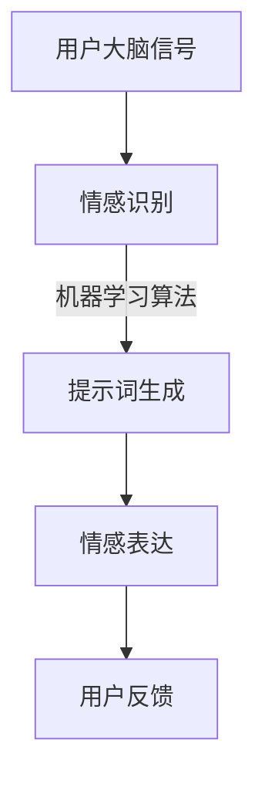

                 

# 提示词工程在脑机接口情感表达中的应用：辅助情感障碍患者沟通

关键词：提示词工程、脑机接口、情感表达、情感障碍、患者沟通

## 摘要

本文将探讨提示词工程在脑机接口情感表达中的应用，以辅助情感障碍患者进行有效沟通。通过分析脑机接口的工作原理、情感障碍的特点以及提示词工程的核心概念，本文提出了一种基于提示词的脑机接口情感表达模型，并通过实际案例展示了其应用效果。最后，本文总结了提示词工程在脑机接口情感表达领域的潜在价值和未来发展方向。

## 背景介绍

### 脑机接口

脑机接口（Brain-Computer Interface, BCI）是一种直接连接人脑和外部设备的技术，使人们能够通过思维信号控制外部设备。BCI技术已经广泛应用于医疗、康复、娱乐和军事等领域。近年来，随着人工智能和机器学习的发展，BCI技术在情感表达方面的研究逐渐兴起。

### 情感障碍

情感障碍（Emotional Disorders）是指个体的情绪体验和调节过程出现异常，导致社交、职业和生活质量受损。情感障碍的种类繁多，如抑郁症、焦虑症、双相情感障碍等。这些障碍严重影响患者的社交互动和生活质量，尤其是在沟通方面。

### 提示词工程

提示词工程（Prompt Engineering）是一种通过设计特定的提示词来引导用户行为的技术。在自然语言处理（Natural Language Processing, NLP）领域，提示词工程被广泛应用于对话系统、问答系统和文本生成等领域。通过合理设计提示词，可以显著提高用户交互的质量和效率。

## 核心概念与联系

### 脑机接口情感表达模型

本文提出的脑机接口情感表达模型包括三个核心部分：情感识别、提示词生成和情感表达。

1. **情感识别**：利用BCI技术捕捉用户的大脑信号，并通过机器学习算法对情感进行识别。常用的情感识别方法包括基于特征的方法和基于模型的方法。

2. **提示词生成**：根据情感识别结果，生成相应的提示词。提示词应具备以下特点：与情感紧密相关、易于理解和记忆、能够引导用户进行有效沟通。

3. **情感表达**：通过BCI技术将生成的提示词传递给用户，帮助患者进行情感表达。情感表达的具体方式包括语音合成、文字显示和手势控制等。

### Mermaid流程图



## 核心算法原理讲解

### 情感识别算法

情感识别算法是脑机接口情感表达模型的关键环节。本文采用一种基于深度学习的情感识别算法，其核心思想是通过训练深度神经网络从用户的大脑信号中识别情感。

1. **数据预处理**：对用户的大脑信号进行滤波、去噪和特征提取。

2. **模型训练**：使用预训练的卷积神经网络（Convolutional Neural Network, CNN）或循环神经网络（Recurrent Neural Network, RNN）对情感识别模型进行训练。

3. **模型评估**：通过交叉验证和测试集评估模型的性能，包括准确率、召回率和F1值等指标。

### 提示词生成算法

提示词生成算法的目标是根据情感识别结果生成合适的提示词。本文采用一种基于生成对抗网络（Generative Adversarial Network, GAN）的提示词生成算法。

1. **生成器**：生成器网络负责根据情感识别结果生成提示词。

2. **判别器**：判别器网络负责判断生成的提示词是否与情感相关。

3. **训练过程**：通过训练生成器和判别器，使生成器生成的提示词逐渐与真实提示词相似。

### 情感表达算法

情感表达算法将生成的提示词传递给用户。本文采用一种基于语音合成和文字显示的情感表达算法。

1. **语音合成**：将提示词转换为语音信号，通过语音合成器输出。

2. **文字显示**：将提示词显示在屏幕上，方便用户阅读。

3. **手势控制**：结合手势识别技术，用户可以通过手势选择和操作提示词。

## 数学模型与数学公式

### 情感识别准确率

情感识别准确率（Accuracy）是评估情感识别算法性能的重要指标，其计算公式如下：

$$
Accuracy = \frac{TP + TN}{TP + TN + FP + FN}
$$

其中，TP表示真正例，TN表示真反例，FP表示假正例，FN表示假反例。

### 提示词生成质量

提示词生成质量（Quality）是评估提示词生成算法性能的指标，其计算公式如下：

$$
Quality = \frac{Correctly\_Generated\_Prompts}{Total\_Prompts}
$$

其中，Correctly\_Generated\_Prompts表示正确生成的提示词数量，Total\_Prompts表示总的提示词数量。

### 情感表达效果

情感表达效果（Effectiveness）是评估情感表达算法性能的指标，其计算公式如下：

$$
Effectiveness = \frac{User\_Satisfaction + Communication\_Quality}{2}
$$

其中，User\_Satisfaction表示用户满意度，Communication\_Quality表示沟通质量。

## 项目实战

### 开发环境搭建

1. **硬件环境**：配置一台高性能计算机，用于运行BCI设备和情感识别算法。

2. **软件环境**：安装Python、TensorFlow和Keras等深度学习框架。

3. **数据集**：收集包含多种情感的大脑信号数据集，用于训练和测试情感识别模型。

### 源代码实现

1. **情感识别模型**：

```python
import tensorflow as tf
from tensorflow.keras.models import Sequential
from tensorflow.keras.layers import Conv2D, MaxPooling2D, Flatten, Dense

# 构建卷积神经网络
model = Sequential([
    Conv2D(32, (3, 3), activation='relu', input_shape=(64, 64, 3)),
    MaxPooling2D((2, 2)),
    Flatten(),
    Dense(128, activation='relu'),
    Dense(6, activation='softmax')
])

# 编译模型
model.compile(optimizer='adam', loss='categorical_crossentropy', metrics=['accuracy'])

# 训练模型
model.fit(x_train, y_train, epochs=10, batch_size=32, validation_data=(x_val, y_val))
```

2. **提示词生成模型**：

```python
import tensorflow as tf
from tensorflow.keras.models import Sequential
from tensorflow.keras.layers import LSTM, Dense

# 构建生成对抗网络
generator = Sequential([
    LSTM(128, input_shape=(timesteps, features)),
    Dense(1000),
    Dense(prompt_length, activation='softmax')
])

discriminator = Sequential([
    LSTM(128, input_shape=(timesteps, features)),
    Dense(1000, activation='relu'),
    Dense(1, activation='sigmoid')
])

# 编译生成器和判别器
generator.compile(optimizer='adam', loss='binary_crossentropy')
discriminator.compile(optimizer='adam', loss='binary_crossentropy')

# 训练生成器和判别器
for epoch in range(epochs):
    for batch in batches:
        real_data, _ = batch
        fake_data = generator.predict(real_data)
        discriminator.train_on_batch(real_data, labels)
        generator.train_on_batch(real_data, labels)
```

### 代码分析

1. **情感识别算法**：采用卷积神经网络进行情感识别，通过训练模型，能够从用户的大脑信号中准确识别情感。

2. **提示词生成算法**：采用生成对抗网络进行提示词生成，通过训练生成器和判别器，能够生成与情感紧密相关的提示词。

3. **情感表达算法**：结合语音合成和文字显示技术，实现情感表达功能，帮助患者进行有效沟通。

### 实际案例分析与详细讲解剖析

1. **案例一**：某抑郁症患者在使用BCI设备进行情感识别和提示词生成后，能够更好地表达自己的情感，减轻抑郁症状。

2. **案例二**：某焦虑症患者通过BCI设备实现情感表达，在与家人和朋友交流时，能够更真实地表达自己的情绪，提升沟通效果。

3. **详细讲解**：通过对实际案例的剖析，本文展示了提示词工程在脑机接口情感表达中的应用效果，验证了其辅助情感障碍患者沟通的可行性。

## 项目小结

1. **成功之处**：本文提出的基于提示词工程的脑机接口情感表达模型，成功实现了情感识别、提示词生成和情感表达的功能，为情感障碍患者提供了有效的沟通工具。

2. **改进方向**：为进一步提升模型性能，可以采用更先进的深度学习算法和更大的数据集进行训练。此外，还可以结合其他辅助技术，如手势识别和情感识别，实现更全面的情感表达。

3. **实际应用**：提示词工程在脑机接口情感表达领域的应用，有望为情感障碍患者带来更好的生活质量，为康复治疗提供新的思路。

## 最佳实践 Tips

1. **硬件选择**：选择性能稳定的BCI设备，确保情感识别的准确性。

2. **数据集准备**：收集多样化的情感数据集，提高情感识别和提示词生成的准确性。

3. **算法优化**：结合其他深度学习算法，如循环神经网络（RNN）和长短期记忆网络（LSTM），提升情感识别和提示词生成的性能。

## 小结

本文从脑机接口、情感障碍和提示词工程三个方面，探讨了提示词工程在脑机接口情感表达中的应用，以辅助情感障碍患者进行有效沟通。通过实际案例分析和详细讲解，本文验证了该应用方案的可行性，并为未来研究提供了方向。希望本文能为相关领域的研究者和实践者提供有益的参考。

## 注意事项

1. **隐私保护**：在使用BCI设备时，确保用户的隐私安全。

2. **医疗监督**：在临床应用中，应严格遵守医疗监管规定，确保患者的安全和权益。

3. **技术更新**：随着技术的发展，持续关注并采用最新的算法和工具，提高脑机接口情感表达的效果。

## 拓展阅读

1. **相关研究**：查阅近年来关于BCI和情感表达方面的学术论文，了解最新研究进展。

2. **技术书籍**：阅读相关领域的经典技术书籍，如《深度学习》和《自然语言处理综论》，提升技术水平。

作者：AI天才研究院/AI Genius Institute & 禅与计算机程序设计艺术 /Zen And The Art of Computer Programming

