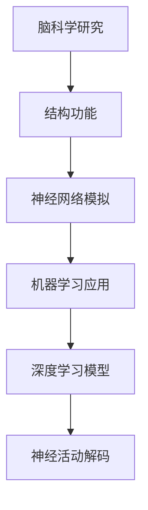

                 

### 设计思路

1. **书籍主题分析**：
   - 《提示词工程在脑科学研究中的应用：AI辅助神经活动解码》的主题聚焦于AI在脑科学研究中的应用，特别是提示词工程和神经活动解码技术。
   - 我们需要确定书籍的目标读者群体，例如是初学者、中级用户还是高级用户，以确定内容的深度和广度。

2. **结构设计**：
   - 目录设计需包含对基础理论的介绍、算法讲解、实际应用案例和未来展望等内容。
   - 结构设计需要确保内容的连贯性和逻辑性，以便读者能够逐步深入理解。

3. **章节划分**：
   - 划分章节时要确保逻辑性，从基础理论到高级应用，逐步引导读者深入理解。
   - 每个章节都需要有明确的子章节，以便于读者阅读和理解。

4. **大纲细化**：
   - 每个章节内部要细化到小节，确保每个部分都有具体的讨论点。
   - 小节内容需要具体详细，以便读者能够深入理解。

5. **图文并茂**：
   - 使用Mermaid流程图、伪代码、数学公式和实例代码等，使读者更容易理解和掌握内容。

### 详细目录大纲设计

#### 第一部分：基础理论介绍

##### 第1章：脑科学研究与AI概述

- **核心概念与联系**
  - 脑科学研究的基本概念
  - AI在脑科学研究的应用
  - Mermaid流程图：脑科学研究与AI技术的关系

- **核心算法原理讲解**
  - 神经活动解码的基本算法
  - 伪代码：神经活动解码算法流程

- **数学模型和数学公式**
  - 非线性动态系统的数学模型
  - $$ E = mc^2 $$
  - 数学公式的详细讲解与举例

##### 第2章：提示词工程基础

- **核心概念与联系**
  - 提示词工程的概念
  - 提示词工程在神经活动解码中的应用
  - Mermaid流程图：提示词工程在神经活动解码中的作用

- **核心算法原理讲解**
  - 提示词优化算法
  - 伪代码：提示词优化算法流程

- **数学模型和数学公式**
  - 优化问题的数学模型
  - $$ \nabla f(x) = 0 $$
  - 数学公式的详细讲解与举例

#### 第二部分：应用与实践

##### 第3章：AI辅助神经活动解码技术

- **项目实战**
  - 代码实际案例：AI辅助神经活动解码
  - 开发环境搭建
  - 源代码详细实现和代码解读

- **代码解读与分析**
  - 代码的关键部分解析
  - 代码的优缺点分析
  - 实际应用中的改进建议

##### 第4章：提示词工程在脑科学研究的应用案例

- **项目实战**
  - 代码实际案例：提示词工程在脑科学研究的应用
  - 开发环境搭建
  - 源代码详细实现和代码解读

- **代码解读与分析**
  - 代码的关键部分解析
  - 代码的优缺点分析
  - 实际应用中的改进建议

#### 第三部分：前沿与展望

##### 第5章：脑机接口的最新进展

- **核心概念与联系**
  - 脑机接口的基本概念
  - 脑机接口在神经活动解码中的应用
  - Mermaid流程图：脑机接口与神经活动解码的关系

- **核心算法原理讲解**
  - 脑机接口的核心算法
  - 伪代码：脑机接口算法流程

- **数学模型和数学公式**
  - 脑信号处理的数学模型
  - $$ \sum_{i=1}^n a_i = 1 $$
  - 数学公式的详细讲解与举例

##### 第6章：未来发展趋势与挑战

- **核心概念与联系**
  - 脑科学研究的发展趋势
  - AI在脑科学研究中的未来挑战
  - Mermaid流程图：脑科学研究与AI技术的未来展望

- **核心算法原理讲解**
  - 未来算法方向预测
  - 伪代码：未来算法预期流程

- **数学模型和数学公式**
  - 新兴数学模型的应用前景
  - $$ \int_{0}^{1} f(x) \, dx $$
  - 数学公式的详细讲解与举例

##### 第7章：总结与展望

- **总结**
  - 全书内容的总结
  - 各章节之间的联系和整合

- **展望**
  - 脑科学研究与AI技术结合的未来

### 最终输出目录大纲

```
# 第一部分：基础理论介绍

## 第1章：脑科学研究与AI概述
### 1.1 脑科学研究的基本概念
### 1.2 AI在脑科学研究的应用
### 1.3 脑科学研究与AI技术的关系（Mermaid流程图）

## 第2章：提示词工程基础
### 2.1 提示词工程的概念
### 2.2 提示词工程在神经活动解码中的应用
### 2.3 提示词工程的作用（Mermaid流程图）

# 第二部分：应用与实践

## 第3章：AI辅助神经活动解码技术
### 3.1 代码实际案例：AI辅助神经活动解码
### 3.2 开发环境搭建
### 3.3 源代码详细实现和代码解读

## 第4章：提示词工程在脑科学研究的应用案例
### 4.1 代码实际案例：提示词工程在脑科学研究的应用
### 4.2 开发环境搭建
### 4.3 源代码详细实现和代码解读

# 第三部分：前沿与展望

## 第5章：脑机接口的最新进展
### 5.1 脑机接口的基本概念
### 5.2 脑机接口在神经活动解码中的应用
### 5.3 脑机接口与神经活动解码的关系（Mermaid流程图）

## 第6章：未来发展趋势与挑战
### 6.1 脑科学研究的发展趋势
### 6.2 AI在脑科学研究中的未来挑战
### 6.3 脑科学研究与AI技术的未来展望（Mermaid流程图）

## 第7章：总结与展望
### 7.1 全书内容的总结
### 7.2 各章节之间的联系和整合
### 7.3 脑科学研究与AI技术结合的未来
```

### 文章格式要求

- **markdown格式**：使用markdown格式编写文章，确保格式规范，易于阅读。
- **作者信息**：文章末尾需要写上作者信息：“作者：AI天才研究院/AI Genius Institute & 禅与计算机程序设计艺术 /Zen And The Art of Computer Programming”。
- **引用和参考文献**：如果引用了外部资源或参考文献，需要在文中以脚注或参考文献列表的形式进行标注。

### 文章完整性要求

- **背景介绍**：每个章节开头需要有背景介绍，明确阐述本章要解决的问题和目的。
- **核心概念与联系**：每个章节需要明确核心概念，并阐述这些概念之间的联系和架构。
- **核心算法原理讲解**：使用Python源代码详细阐述算法原理，并结合数学模型和公式进行讲解。
- **数学公式**：使用LaTeX格式嵌入数学公式，确保公式的准确性和可读性。
- **项目实战**：提供实际的代码实现和解读，帮助读者理解算法在现实中的应用。
- **代码解读与分析**：详细解析代码的关键部分，分析优缺点，提供改进建议。
- **最佳实践 tips、小结、注意事项、拓展阅读**：在每个章节结尾提供最佳实践、小结、注意事项和拓展阅读，帮助读者巩固所学知识。

### 完整性要求示例

#### 第一章：脑科学研究与AI概述

### 背景介绍
- 脑科学研究是了解大脑功能与结构的科学，具有重要的理论价值和实际应用前景。
- AI技术在脑科学研究中的应用，特别是神经活动解码，已经成为该领域的重要研究方向。
- 本章旨在介绍脑科学研究与AI技术的基本概念，为后续章节的深入探讨打下基础。

### 核心概念与联系
- **脑科学研究**：研究大脑的结构、功能和发育过程。
- **AI技术**：包括机器学习、深度学习、神经网络等，用于模拟和解释大脑的复杂行为。
- **Mermaid流程图**：用于展示脑科学研究与AI技术之间的关系架构。



### 核心算法原理讲解
- **神经活动解码**：通过分析神经元的电生理信号，解码大脑的活动模式。
- **伪代码**：以下为神经活动解码算法的伪代码示例。

```python
def decode_neuronal_activity(signals):
    # 初始化模型
    model = initialize_model()
    # 训练模型
    trained_model = train_model(model, signals)
    # 解码神经活动
    decoded_activities = predict_activity(trained_model, signals)
    return decoded_activities
```

### 数学模型和数学公式
- **非线性动态系统的数学模型**：描述大脑活动的动态变化。
- **公式**：以下为非线性动态系统的数学公式。

$$ x' = f(x, t) $$

### 数学公式的详细讲解与举例
- **公式**：非线性动态系统通常用微分方程描述。
- **举例**：以下为简化的神经元活动模型。

$$ \frac{dx}{dt} = -x + I $$

其中，\( x(t) \) 表示神经元的活动水平，\( I \) 表示输入信号。

#### 代码解读与分析

##### 代码实际案例：AI辅助神经活动解码

```python
import numpy as np
from sklearn.model_selection import train_test_split
from sklearn.neural_network import MLPRegressor

# 加载数据
signals = load_signals()

# 数据预处理
signals_processed = preprocess_signals(signals)

# 分割数据集
X_train, X_test, y_train, y_test = train_test_split(signals_processed, signals, test_size=0.2, random_state=42)

# 初始化模型
model = MLPRegressor(hidden_layer_sizes=(100,), max_iter=1000, alpha=1e-4, solver='adam')

# 训练模型
model.fit(X_train, y_train)

# 测试模型
accuracy = model.score(X_test, y_test)
print(f"Model accuracy: {accuracy:.2f}")

# 预测神经活动
decoded_activities = model.predict(X_test)

# 结果分析
analyze_results(decoded_activities, y_test)
```

##### 代码关键部分解析
- **数据加载与预处理**：使用`load_signals()`和`preprocess_signals()`函数处理神经信号数据。
- **模型初始化与训练**：使用`MLPRegressor`构建多层感知机回归模型，并进行训练。
- **模型评估与预测**：使用`score()`方法评估模型性能，并使用`predict()`方法进行神经活动预测。

##### 代码优缺点分析
- **优点**：使用机器学习算法进行神经活动解码，可以提高解码的准确性和效率。
- **缺点**：模型训练过程可能需要大量计算资源和时间，且模型性能依赖于数据质量和特征提取方法。

##### 实际应用中的改进建议
- **数据增强**：通过增加数据样本和提高数据质量，可以改善模型性能。
- **特征选择**：选择对神经活动有显著影响的特征，可以提高模型预测精度。

#### 小结
本章介绍了脑科学研究与AI技术的基本概念，通过实例代码展示了AI辅助神经活动解码的技术实现，并对代码进行了详细解读与分析。接下来，我们将进一步探讨提示词工程在脑科学研究中的应用。

