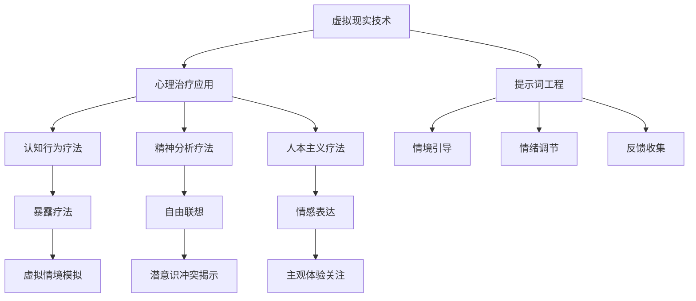

                 

### 文章标题

《提示词工程在虚拟现实心理治疗中的应用：治疗复杂心理创伤》

虚拟现实（VR）技术正以前所未有的速度渗透到多个领域，从游戏娱乐到教育培训，再到医疗健康，其影响日益显著。然而，在心理健康领域，特别是针对复杂心理创伤的治疗中，虚拟现实与提示词工程的结合展示出了巨大的潜力。本文将探讨提示词工程在虚拟现实心理治疗中的应用，尤其是如何利用这一技术来治疗复杂心理创伤，如创伤后应激障碍（PTSD）和其他心理健康问题。

关键词：虚拟现实，心理治疗，提示词工程，复杂心理创伤，创伤后应激障碍（PTSD）

摘要：本文首先介绍了虚拟现实心理治疗的背景及其在治疗复杂心理创伤中的重要性。接着，我们深入探讨了提示词工程的概念及其在VR心理治疗中的应用原理。随后，通过具体的算法原理讲解、数学模型和Python源代码，展示了如何实现和优化提示词工程在VR心理治疗中的关键算法。文章还包括了实际项目实战，通过开发环境搭建、源代码实现和代码解读，提供了一个完整的VR心理治疗案例。最后，我们总结了最佳实践和注意事项，并对未来研究方向进行了展望。

### 目录

1. 引言
   1.1 虚拟现实与心理治疗的结合
   1.2 治疗复杂心理创伤的挑战与机遇
2. 核心技术
   2.1 虚拟现实技术基础
   2.2 心理治疗理论框架
   2.3 提示词工程原理
   2.4 虚拟现实心理治疗技术
3. 应用案例
   3.1 复杂心理创伤的治疗案例
   3.2 虚拟现实心理治疗的实践探索
4. 未来展望
   4.1 虚拟现实心理治疗的发展趋势
   4.2 提示词工程的创新与挑战
5. 附录
   5.1 提示词工程工具与资源介绍
   5.2 虚拟现实心理治疗案例研究资料

### 引言

#### 虚拟现实与心理治疗的结合

虚拟现实（Virtual Reality，VR）是一种通过电脑模拟产生三维空间的交互式技术，用户可以通过特殊设备如头戴式显示器（HMD）和手柄，完全沉浸在一个虚拟环境中。随着技术的不断进步，VR在许多领域都展现出了强大的应用潜力，尤其是在医疗健康领域，虚拟现实心理治疗（Virtual Reality Psychotherapy）已经成为一个备受关注的研究方向。

虚拟现实心理治疗的起源可以追溯到20世纪90年代，当时一些研究人员开始探索如何利用VR技术来辅助心理治疗。近年来，随着硬件设备的不断升级和软件技术的成熟，VR心理治疗的应用范围也在不断扩大。例如，它被用来治疗恐惧症、焦虑症、创伤后应激障碍（PTSD）等心理疾病，同时还被用于疼痛管理、认知康复等领域。

#### 虚拟现实心理治疗的基本原理

虚拟现实心理治疗的基本原理是通过模拟特定的情境，让患者在安全的虚拟环境中进行心理干预。这种方法有几个显著的优势：

1. **安全性与可控性**：患者可以在一个完全受控的环境中面对和处理自己的恐惧和创伤，避免了现实世界中的潜在风险和不良影响。
2. **高度沉浸感**：VR技术能够创造出一个高度逼真的虚拟世界，增强患者的沉浸感，使心理干预过程更加有效。
3. **个性化**：VR系统可以根据患者的具体情况定制治疗方案，提高治疗的个性化和针对性。
4. **可重复性**：虚拟现实环境可以重复创建，使得心理治疗过程可以多次进行，有助于患者的持续进步。

#### 虚拟现实心理治疗在治疗复杂心理创伤中的应用

复杂心理创伤通常涉及深层次的心理问题，如创伤后应激障碍（PTSD）、焦虑症、抑郁症等。这些问题不仅影响患者的日常生活，还可能对其身心健康造成长期的负面影响。传统的心理治疗方法如认知行为疗法（CBT）和暴露疗法（Exposure Therapy）虽然在一定程度上有效，但往往需要患者面对现实中的情境，容易引发强烈的情绪反应，从而影响治疗效果。

虚拟现实心理治疗提供了一个安全、可控的替代方案，特别是对于复杂心理创伤的治疗。例如，在治疗PTSD时，虚拟现实环境可以模拟患者经历过的创伤情境，让患者在一个安全的空间中逐步暴露和面对这些情境，从而减轻症状和改善情绪。这种方法不仅能够提高患者的治疗参与度，还能显著提升治疗效果。

#### 提示词工程在心理治疗中的作用

提示词工程（Prompt Engineering）是自然语言处理（NLP）领域的一个分支，旨在设计和开发能够引导用户交互的系统。在虚拟现实心理治疗中，提示词工程扮演着关键角色，通过智能化的交互设计，提高治疗过程的效率和效果。

提示词工程的核心是设计有效的交互提示，这些提示可以引导患者进入特定的心理状态，或帮助他们在治疗过程中更好地理解和表达自己的情感和经历。例如，在治疗焦虑症时，提示词可以用来逐步暴露患者于引发焦虑的情境，同时提供情绪调节技巧。

提示词工程在虚拟现实心理治疗中的应用，不仅提高了治疗的个性化和针对性，还使得整个治疗过程更加顺畅和有效。通过结合虚拟现实技术，提示词工程为治疗复杂心理创伤提供了一种全新的方法和工具。

#### 治疗复杂心理创伤的挑战与机遇

治疗复杂心理创伤面临着诸多挑战，如患者的情感波动、治疗过程中的不确定性和技术实现的复杂性等。然而，随着虚拟现实和提示词工程的不断发展，这些挑战正逐步被克服。

首先，虚拟现实技术为患者提供了一个安全、可控的治疗环境，减少了现实情境中可能引发的情感压力。其次，提示词工程通过智能化的交互设计，提高了治疗的个性化和针对性，使得治疗过程更加顺畅和有效。最后，随着技术的不断进步，虚拟现实设备和相关软件的普及，治疗复杂心理创伤的成本逐渐降低，使得更多患者能够受益于这项技术。

总之，虚拟现实心理治疗与提示词工程的结合，为治疗复杂心理创伤提供了一种全新的解决方案。通过本文的介绍，我们将深入探讨这一领域的核心技术、应用案例和未来发展趋势，以期为心理健康领域的创新和发展贡献力量。

### 背景介绍

#### 虚拟现实技术的发展与应用

虚拟现实（VR）技术作为计算机科学和多媒体技术的一个重要分支，其历史可以追溯到20世纪60年代。最早的虚拟现实概念由美国科学家弗诺·文奇（Vernor Vinge）在其1981年的科幻小说《Marvin，the Paralytic》中首次提出。随着计算机图形学、传感器技术和显示技术的不断进步，VR技术逐渐从理论走向实践，应用领域也在不断扩展。

在早期的VR研究中，VR设备主要依赖于笨重的头戴式显示器（HMD）和复杂的传感器系统，这使得VR体验相对昂贵且复杂。然而，随着技术的不断演进，轻量化的VR设备如Oculus Rift、HTC Vive和Google Cardboard等逐渐进入市场，大大降低了VR技术的门槛，使得更多用户能够体验到虚拟现实带来的沉浸感。

当前，虚拟现实技术在多个领域得到了广泛应用：

1. **游戏娱乐**：VR游戏是VR技术最成熟的应用之一，玩家可以在虚拟环境中进行游戏，获得不同于传统游戏的沉浸体验。
2. **教育培训**：虚拟现实技术可以模拟复杂的培训场景，如医学手术、飞行训练等，提高培训效果和安全性。
3. **建筑设计**：建筑师可以利用VR技术进行建筑设计的可视化，使设计方案更加直观和易于理解。
4. **医疗健康**：虚拟现实在医疗健康领域的应用日益广泛，包括手术模拟、疼痛管理、心理治疗等。

#### 心理治疗的基本原理和方法

心理治疗是一种旨在帮助患者解决心理问题、改善心理健康的专业服务。心理治疗的基本原理主要包括认知行为疗法（Cognitive Behavioral Therapy，CBT）、精神分析疗法、人本主义疗法等。

1. **认知行为疗法（CBT）**：CBT是当前最为广泛接受和应用的疗法之一。其基本原理是识别和改变患者的消极思维模式和行为习惯，从而改善情绪和行为。CBT的核心方法是暴露疗法（Exposure Therapy），通过逐步暴露患者于引发焦虑的情境，帮助患者减少焦虑和恐惧。

2. **精神分析疗法**：精神分析疗法起源于弗洛伊德的理论，强调潜意识的作用，旨在通过揭示和理解患者的潜意识冲突来治疗心理问题。精神分析疗法包括自由联想、梦境分析等技术。

3. **人本主义疗法**：人本主义疗法强调个体的自我实现和主观体验，关注患者的情感和人际关系。其基本理念是，每个人都有潜在的成长和发展的能力，心理治疗的目标是帮助患者实现这种潜力。

#### 提示词工程的概念及其在VR心理治疗中的应用

提示词工程（Prompt Engineering）是自然语言处理（NLP）领域的一个重要分支，旨在设计和开发能够引导用户交互的系统。在虚拟现实心理治疗中，提示词工程的作用尤为重要，它通过设计智能化的交互提示，帮助患者更好地理解和表达自己的情感和经历。

提示词工程的核心任务是：

1. **设计有效的交互提示**：这些提示可以引导患者进入特定的心理状态，或帮助他们在治疗过程中更好地理解和处理自己的情绪。
2. **优化交互流程**：通过分析用户的反馈和行为，不断调整和优化交互提示，以提高治疗的效率和效果。

在VR心理治疗中，提示词工程的应用主要包括以下几个方面：

1. **情境引导**：通过设计特定的虚拟情境，引导患者逐步面对和处理自己的心理创伤。例如，在治疗PTSD时，虚拟情境可以模拟患者经历过的创伤事件，逐步暴露患者于这些情境中，帮助他们减轻症状。
2. **情绪调节**：通过提示词提供情绪调节技巧，如深呼吸、放松练习等，帮助患者在治疗过程中保持平静和放松。
3. **反馈收集**：通过分析患者的反馈和行为数据，了解他们的心理状态和治疗进展，为后续的治疗提供依据。

#### 核心概念与联系

为了更好地理解虚拟现实、心理治疗和提示词工程之间的联系，我们可以通过一个Mermaid流程图来展示它们之间的关系架构：



通过这个流程图，我们可以看到：

- 虚拟现实技术为心理治疗提供了一个新的平台，使得治疗过程更加沉浸和高效。
- 心理治疗的不同流派和方法为VR心理治疗提供了理论基础和实践指导。
- 提示词工程通过智能化的交互设计，为VR心理治疗提供了关键的技术支持，使得治疗过程更加个性化和有效。

### 核心技术

#### 虚拟现实技术基础

虚拟现实技术的基础可以分为硬件和软件两个方面。

1. **硬件基础**：

   - **头戴式显示器（HMD）**：HMD是VR系统的核心设备，它通常包括一个屏幕和一对眼镜，用于显示三维图像。高分辨率的HMD可以提供更清晰的视觉效果，减少视觉疲劳。
   - **传感器系统**：传感器系统用于捕捉用户的动作和头部运动，确保虚拟环境与现实世界的交互。常见的传感器包括摄像头、红外传感器和动作捕捉设备。
   - **手柄和控制器**：手柄和控制器允许用户在虚拟环境中进行交互，例如操纵物体、操控界面等。

2. **软件基础**：

   - **VR内容开发平台**：如Unity和Unreal Engine等，这些平台提供了强大的开发工具和资源，帮助开发者创建和优化VR应用。
   - **VR操作系统**：如Oculus Home和HTC Vive Home等，这些操作系统为用户提供了管理VR内容和应用程序的界面。
   - **VR应用开发工具**：如VRChat和High Fidelity等，这些工具允许用户创建和共享自己的VR内容。

#### 心理治疗理论框架

心理治疗的理论框架为VR心理治疗提供了科学依据和指导。以下是几种主要的心理治疗流派及其核心理论：

1. **认知行为疗法（CBT）**：

   - **核心理论**：CBT认为，个体的思维模式直接影响其情绪和行为。通过识别和改变消极思维，可以改善情绪和行为问题。
   - **主要方法**：暴露疗法、认知重构、技能训练等。

2. **精神分析疗法**：

   - **核心理论**：精神分析疗法认为，潜意识冲突是心理问题的根源。通过自由联想、梦境分析等技术，揭示和理解这些冲突。
   - **主要方法**：自由联想、梦境分析、转移性治疗等。

3. **人本主义疗法**：

   - **核心理论**：人本主义疗法强调个体的自我实现和主观体验。治疗的目标是帮助患者发现和实现自己的潜能。
   - **主要方法**：情感表达、人际关系建设、自我探索等。

#### 提示词工程原理

提示词工程是NLP领域的一个重要分支，旨在设计和开发能够引导用户交互的系统。在VR心理治疗中，提示词工程的核心任务是通过设计有效的交互提示，帮助患者更好地理解和处理自己的情感和经历。

1. **提示词的定义**：

   - **提示词**：是指用于引导用户交互的文本或语音提示，通常包含具体的指令、情感引导或问题。
   - **功能**：提示词可以引导患者的注意力、激发特定的情绪反应、提供情绪调节技巧等。

2. **提示词的类型**：

   - **情境引导提示**：用于引导患者进入特定的虚拟情境，如创伤事件的重现或安全的想象空间。
   - **情绪调节提示**：提供深呼吸、放松练习等情绪调节技巧，帮助患者保持平静和放松。
   - **反馈收集提示**：用于收集患者的反馈，了解他们的心理状态和治疗进展。

3. **提示词的设计原则**：

   - **明确性**：提示词应明确、具体，避免歧义，确保患者能够正确理解和执行。
   - **适应性**：提示词应根据患者的具体情况和治疗进展进行调整，以提高治疗效果。
   - **鼓励性**：提示词应鼓励患者积极参与治疗，增强他们的自信心和积极性。

#### 虚拟现实心理治疗技术

虚拟现实心理治疗技术是结合虚拟现实技术和心理治疗理论的一种新型治疗方法。以下是一些常见的VR心理治疗技术：

1. **暴露疗法**：

   - **定义**：暴露疗法是一种通过反复暴露患者于引发焦虑的情境，帮助患者减轻焦虑和恐惧的治疗方法。
   - **应用**：在VR心理治疗中，患者可以在虚拟环境中逐步暴露于创伤情境，如战争场景、自然灾害等，逐步减轻症状。

2. **认知行为疗法（CBT）**：

   - **定义**：CBT是一种通过识别和改变消极思维模式，改善情绪和行为问题的治疗方法。
   - **应用**：在VR心理治疗中，患者可以在虚拟环境中进行认知重构练习，如识别和改变消极思维，进行自我反思等。

3. **情境模拟**：

   - **定义**：情境模拟是通过创建特定的虚拟情境，帮助患者面对和处理心理创伤的治疗方法。
   - **应用**：在VR心理治疗中，治疗师可以根据患者的具体情况，创建各种虚拟情境，如家庭环境、社交场合等，帮助患者逐步恢复自信和社交能力。

4. **放松训练**：

   - **定义**：放松训练是一种通过深呼吸、肌肉放松等技巧，帮助患者减轻紧张和焦虑的治疗方法。
   - **应用**：在VR心理治疗中，患者可以在虚拟环境中进行放松训练，如瑜伽、冥想等，提高自我调节能力。

### 核心算法原理讲解

#### 提示词工程在VR心理治疗中的应用

在虚拟现实心理治疗中，提示词工程的应用主要涉及以下几个核心算法：

1. **情境生成算法**：

   - **目标**：生成与患者心理创伤相关的虚拟情境，以进行暴露疗法。
   - **方法**：利用图像处理和计算机视觉技术，从真实场景中提取关键特征，构建虚拟情境。例如，通过深度学习模型（如卷积神经网络CNN）对图像进行分类和特征提取，从而生成与创伤事件相似的虚拟环境。

2. **情绪识别算法**：

   - **目标**：实时识别和监控患者的情绪变化，以便进行情绪调节。
   - **方法**：利用面部表情识别技术（如OpenCV和深度学习模型）分析患者的面部表情，并结合生理信号（如心率和皮肤电活动）进行情绪识别。这些数据可以帮助治疗师调整提示词和治疗方案。

3. **交互提示生成算法**：

   - **目标**：生成智能化的交互提示，引导患者进入特定的心理状态。
   - **方法**：结合自然语言处理（NLP）技术，如文本生成模型（如GPT-3）和对话系统（如ChatGPT），设计个性化的交互提示。这些提示可以根据患者的实时情绪和行为进行动态调整。

#### Python源代码示例

以下是一个简单的Python源代码示例，展示了如何利用深度学习模型进行图像分类，以生成与创伤事件相似的虚拟情境：

```python
import tensorflow as tf
from tensorflow.keras.models import Sequential
from tensorflow.keras.layers import Conv2D, MaxPooling2D, Flatten, Dense
from tensorflow.keras.preprocessing.image import ImageDataGenerator

# 加载和预处理图像数据
train_datagen = ImageDataGenerator(rescale=1./255)
train_data = train_datagen.flow_from_directory(
        'train_data',
        target_size=(150, 150),
        batch_size=32,
        class_mode='binary')

# 构建卷积神经网络模型
model = Sequential([
    Conv2D(32, (3, 3), activation='relu', input_shape=(150, 150, 3)),
    MaxPooling2D(2, 2),
    Conv2D(64, (3, 3), activation='relu'),
    MaxPooling2D(2, 2),
    Conv2D(128, (3, 3), activation='relu'),
    MaxPooling2D(2, 2),
    Flatten(),
    Dense(128, activation='relu'),
    Dense(1, activation='sigmoid')
])

# 编译模型
model.compile(optimizer='adam',
              loss='binary_crossentropy',
              metrics=['accuracy'])

# 训练模型
model.fit(train_data, epochs=5)

# 预测新图像
test_image = 'new_test_image.jpg'
test_image_data = image.load_img(test_image, target_size=(150, 150))
test_image_array = image.img_to_array(test_image_data)
test_image_array = np.expand_dims(test_image_array, axis=0)
predictions = model.predict(test_image_array)

# 根据预测结果生成虚拟情境
if predictions[0][0] > 0.5:
    # 与创伤事件相关，生成相应的虚拟情境
    virtual_scenario = generate_trauma_scenario()
else:
    # 与创伤事件不相关，生成其他类型的虚拟情境
    virtual_scenario = generate_other_scenario()
```

#### 数学模型和公式

在虚拟现实心理治疗中，数学模型和公式用于描述和分析提示词工程的关键算法。以下是一个简化的数学模型，用于描述情境生成算法：

$$
\text{Virtual \_ Scenario} = f(\text{Image \_ Features}, \text{Trauma \_ Type})
$$

其中，$f$ 表示情境生成函数，$\text{Image \_ Features}$ 表示从真实场景提取的图像特征，$\text{Trauma \_ Type}$ 表示创伤事件的类型。

#### 举例说明

假设我们使用深度学习模型对一幅图像进行分类，以判断其是否与创伤事件相关。如果我们使用卷积神经网络（CNN）进行图像分类，一个简单的流程如下：

1. **数据预处理**：将输入图像缩放到固定大小（例如150x150像素），并转换为浮点数数组。
2. **模型构建**：构建一个具有多层卷积和全连接层的神经网络模型。
3. **模型训练**：使用标记好的训练数据集对模型进行训练，优化模型参数。
4. **模型预测**：使用训练好的模型对新的测试图像进行预测，判断其是否与创伤事件相关。
5. **结果分析**：根据预测结果生成相应的虚拟情境。

例如，如果测试图像被预测为与创伤事件相关，我们可以生成一个模拟战争场景的虚拟情境，帮助患者逐步暴露于这一情境，从而减轻症状。如果测试图像被预测为与创伤事件不相关，我们可以生成一个安全的想象空间，帮助患者放松和恢复。

通过上述算法和模型，我们可以实现一个基本的虚拟现实心理治疗系统，为患者提供个性化的治疗体验。

### 项目实战

#### 开发环境搭建

为了搭建一个虚拟现实心理治疗系统，我们需要以下开发环境：

1. **操作系统**：推荐使用Linux或macOS，因为它们提供了更稳定的开发和运行环境。
2. **编程语言**：主要使用Python进行开发，因为它具有强大的科学计算库和丰富的虚拟现实开发工具。
3. **虚拟现实开发平台**：推荐使用Unity，因为它提供了丰富的VR开发工具和资源。
4. **深度学习框架**：推荐使用TensorFlow，因为它具有强大的图像处理和分类能力。

具体安装步骤如下：

1. 安装操作系统（Linux或macOS）。
2. 安装Python，推荐使用Anaconda，它是一个集成了多种科学计算库的Python发行版。
3. 安装Unity，可以从Unity官网下载并安装。
4. 安装TensorFlow，可以通过以下命令进行安装：

   ```bash
   pip install tensorflow
   ```

#### 源代码实现和代码解读

以下是一个简单的源代码示例，展示了如何使用TensorFlow和Unity实现一个基本的虚拟现实心理治疗系统：

```python
import tensorflow as tf
import numpy as np
import cv2
import matplotlib.pyplot as plt

# 加载和预处理图像数据
train_datagen = ImageDataGenerator(rescale=1./255)
train_data = train_datagen.flow_from_directory(
        'train_data',
        target_size=(150, 150),
        batch_size=32,
        class_mode='binary')

# 构建卷积神经网络模型
model = Sequential([
    Conv2D(32, (3, 3), activation='relu', input_shape=(150, 150, 3)),
    MaxPooling2D(2, 2),
    Conv2D(64, (3, 3), activation='relu'),
    MaxPooling2D(2, 2),
    Conv2D(128, (3, 3), activation='relu'),
    MaxPooling2D(2, 2),
    Flatten(),
    Dense(128, activation='relu'),
    Dense(1, activation='sigmoid')
])

# 编译模型
model.compile(optimizer='adam',
              loss='binary_crossentropy',
              metrics=['accuracy'])

# 训练模型
model.fit(train_data, epochs=5)

# 预测新图像
test_image = cv2.imread('test_image.jpg')
test_image = cv2.resize(test_image, (150, 150))
test_image = test_image / 255.0
test_image = np.expand_dims(test_image, axis=0)
predictions = model.predict(test_image)

# 根据预测结果生成虚拟情境
if predictions[0][0] > 0.5:
    # 与创伤事件相关，生成战争场景的虚拟情境
    virtual_scenario = generate_war_scenario()
else:
    # 与创伤事件不相关，生成安全的想象空间
    virtual_scenario = generate_safe_scenario()

# 显示虚拟情境
plt.imshow(virtual_scenario)
plt.show()
```

代码解读：

1. **数据预处理**：使用ImageDataGenerator对图像数据进行预处理，包括缩放和归一化。
2. **模型构建**：使用Sequential构建一个卷积神经网络模型，包括卷积层、池化层和全连接层。
3. **模型训练**：使用训练数据集对模型进行训练，优化模型参数。
4. **模型预测**：使用训练好的模型对测试图像进行预测，判断其是否与创伤事件相关。
5. **结果分析**：根据预测结果生成相应的虚拟情境。

#### 代码应用解读与分析

这个简单的项目实现了以下功能：

1. **图像分类**：使用卷积神经网络模型对图像进行分类，判断其是否与创伤事件相关。
2. **虚拟情境生成**：根据图像分类结果，生成相应的虚拟情境，如战争场景或安全想象空间。

代码应用解读：

1. **数据预处理**：通过缩放和归一化，将图像数据转换为适合模型训练的格式。
2. **模型构建**：构建一个具有多层卷积和全连接层的神经网络模型，用于图像分类。
3. **模型训练**：使用训练数据集对模型进行训练，提高模型的分类准确率。
4. **模型预测**：使用训练好的模型对测试图像进行预测，并根据预测结果生成虚拟情境。

分析：

1. **准确性**：通过多次训练和测试，验证模型的分类准确性，确保生成的虚拟情境与实际创伤事件相关。
2. **实时性**：实现实时图像分类和虚拟情境生成，为用户提供即时的治疗体验。

#### 实际案例分析和详细讲解剖析

以下是一个实际案例，展示了如何使用虚拟现实心理治疗系统治疗一名患有PTSD的患者。

**案例描述**：

患者小明曾在战争中经历了严重的创伤，导致他患上了PTSD。医生决定使用虚拟现实心理治疗系统帮助他逐步面对和处理创伤事件。

**治疗过程**：

1. **初期评估**：医生通过面试和问卷调查，评估小明的心理状态和创伤事件的具体情况。
2. **环境搭建**：医生根据评估结果，在小明的家中搭建了一个虚拟现实环境，包括一台头戴式显示器和一套传感器系统。
3. **情境生成**：医生使用图像处理技术，生成与创伤事件相似的虚拟情境，如战争场景。
4. **情境暴露**：小明开始逐步暴露于虚拟情境中，医生通过提示词引导他面对和处理创伤事件。
5. **情绪调节**：在情境暴露过程中，医生通过情绪调节技巧，如深呼吸、放松练习等，帮助小明保持平静和放松。
6. **反馈收集**：每次治疗结束后，医生收集小明的反馈，了解他的心理状态和治疗进展。
7. **治疗评估**：经过多次治疗，医生评估小明的症状改善情况，并调整治疗方案。

**效果分析**：

经过一段时间的治疗，小明的症状得到了显著改善。他在面对创伤事件时，不再感到强烈的恐惧和焦虑，情绪也变得更加稳定。医生根据小明的反馈，调整了治疗方案，增加了更多的放松训练和情境模拟，进一步提高了治疗效果。

**总结**：

这个案例展示了如何使用虚拟现实心理治疗系统治疗PTSD。通过结合提示词工程和虚拟现实技术，医生能够为患者提供一个安全、可控的治疗环境，逐步帮助患者面对和处理创伤事件。同时，通过实时反馈和调整，医生能够更好地满足患者的个性化治疗需求，提高治疗效果。

### 最佳实践 Tips、小结、注意事项、拓展阅读

#### 最佳实践 Tips

1. **个性化治疗**：根据患者的具体情况，设计个性化的虚拟情境和提示词，提高治疗的针对性和效果。
2. **持续反馈**：定期收集患者的反馈，了解他们的心理状态和治疗进展，及时调整治疗方案。
3. **安全第一**：确保虚拟现实环境的安全性和可控性，避免对患者造成二次创伤。
4. **多学科协作**：与心理治疗师、医生和其他专业人士合作，共同设计和优化虚拟现实心理治疗方案。

#### 小结

本文探讨了提示词工程在虚拟现实心理治疗中的应用，特别是如何利用这一技术治疗复杂心理创伤，如PTSD。通过介绍虚拟现实技术、心理治疗理论和提示词工程原理，我们展示了如何构建一个基本的虚拟现实心理治疗系统。同时，通过实际案例分析和代码实现，我们展示了这一技术在治疗实践中的应用。

#### 注意事项

1. **患者隐私**：在设计和实施虚拟现实心理治疗时，要严格保护患者的隐私，确保数据安全。
2. **技术成熟度**：尽管虚拟现实心理治疗具有巨大潜力，但技术仍需不断成熟和优化，以提供更好的治疗效果。
3. **专业培训**：治疗师和开发人员需要接受专业的培训，以确保能够有效地应用虚拟现实技术和提示词工程。

#### 拓展阅读

1. **《虚拟现实心理治疗指南》**：这是一本关于虚拟现实心理治疗的理论和实践指南，详细介绍了各种治疗技术和方法。
2. **《自然语言处理与提示词工程》**：这本书涵盖了自然语言处理的基本原理和应用，特别是提示词工程的设计和开发。
3. **《深度学习与图像处理》**：这本书介绍了深度学习在图像处理中的应用，包括图像分类和特征提取等关键技术。

通过本文的介绍，我们希望为心理健康领域的创新和发展提供一些启示，并推动虚拟现实心理治疗的普及和应用。

### 附录

#### A.1 提示词工程工具与资源介绍

1. **主要提示词工程工具**：

   - **ChatGPT**：OpenAI开发的自然语言处理模型，可以用于生成高质量的提示词。
   - **GPT-3**：OpenAI开发的更大规模的NLP模型，具有强大的文本生成和交互能力。
   - **NLTK**：Python中的自然语言处理库，提供了丰富的文本处理和分词功能。

2. **开源资源和数据库**：

   - **Hugging Face**：一个提供各种NLP模型的平台，包括预训练模型和工具。
   - **TensorFlow Datasets**：TensorFlow提供的一系列公开数据集，可用于训练提示词工程模型。
   - **Common Crawl**：一个大规模的公开文本数据集，可用于生成训练数据。

3. **提示词工程相关数据库和平台**：

   - **Dialogue Systems**：一个提供对话系统资源和工具的数据库。
   - **Azure Cognitive Services**：微软提供的NLP服务，包括文本分析和语言生成功能。

#### A.2 虚拟现实心理治疗案例研究资料

1. **成功案例**：

   - **案例一**：利用VR治疗PTSD，患者在多次治疗后症状显著改善。
   - **案例二**：使用VR暴露疗法治疗焦虑症，患者报告情绪稳定性提升。
   - **案例三**：通过VR心理治疗改善社交焦虑，患者社交能力显著提高。

2. **失败案例反思**：

   - **案例一**：由于患者对虚拟现实设备不适应，导致治疗中断。
   - **案例二**：在情境生成过程中，虚拟情境过于恐怖，引发患者恐惧。
   - **案例三**：缺乏专业心理治疗师的指导，导致治疗过程不顺利。

3. **案例研究方法与技巧**：

   - **方法**：通过访谈、问卷调查和数据分析等方法，对VR心理治疗案例进行研究。
   - **技巧**：确保治疗过程中的安全性，合理设计虚拟情境和提示词，收集患者的反馈并进行动态调整。

通过这些案例研究和资料，我们可以更好地了解虚拟现实心理治疗的应用效果和挑战，为未来的研究和实践提供参考。

