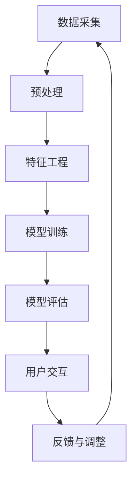

                 

### 第一部分：引言与概述

#### 1.1 自我健康管理的背景与意义

自我健康管理是指个人通过自我监测、评估和干预，主动管理自身的健康状况和生活质量的过程。在现代社会，随着生活节奏的加快、工作压力的增加以及生活方式的变化，健康问题日益突出。自我健康管理不仅有助于预防和控制慢性疾病，还能提升生活质量，延长健康寿命。

自我健康管理的定义主要包括以下几个方面：
1. **自我监测**：通过日常健康监测，如体重、血压、血糖等，了解自身的健康状态。
2. **自我评估**：通过健康评估工具，如健康调查问卷，对自身的健康状况进行全面评估。
3. **自我干预**：根据评估结果，采取一系列干预措施，如调整饮食、运动习惯、作息时间等，以改善健康状况。

量化自我健康管理是指利用现代科技手段，如传感器、数据分析等，对个人健康数据进行收集、分析和处理，从而实现更精准的健康管理。随着物联网、大数据、人工智能等技术的发展，量化自我健康管理逐渐成为一种新的健康管理模式。

个人生活方式与健康管理的关系密不可分。健康的生活方式，如均衡饮食、适量运动、良好的作息时间等，是保持健康的重要基础。然而，传统的生活方式管理往往缺乏个性化和科学性，难以满足个体的需求。因此，如何通过个性化生活方式优化实现自我健康管理，成为当前研究的热点。

#### 1.2 提示词工程的基本概念

提示词工程是一种利用自然语言处理（NLP）技术，通过分析文本数据，提取关键信息，构建知识图谱的方法。它主要用于信息检索、文本分类、情感分析等领域。

提示词工程的目标是：
1. 提取文本中的关键信息，如名词、动词、形容词等，构建语义关系网络。
2. 标注文本中的实体，如人名、地名、机构名等，并识别其语义角色。
3. 构建知识图谱，将文本数据转化为结构化数据，便于进一步分析和应用。

提示词工程的基本原理包括以下几个步骤：
1. **文本预处理**：对原始文本进行清洗、分词、去停用词等操作，提取有效信息。
2. **实体识别**：利用命名实体识别（NER）技术，从文本中提取实体，并标注其类别。
3. **关系抽取**：通过模式匹配、规则匹配等方法，从文本中提取实体之间的关系。
4. **知识融合**：将提取的实体和关系进行融合，构建知识图谱。

提示词工程的应用领域广泛，包括但不限于：
1. **信息检索**：通过构建知识图谱，实现高效的信息检索和推荐。
2. **文本分类**：利用知识图谱进行文本分类，提高分类的准确性和效率。
3. **情感分析**：通过分析文本中的情感词汇和关系，判断文本的情感倾向。
4. **智能问答**：利用知识图谱和自然语言处理技术，实现智能问答系统。

#### 1.3 个性化生活方式优化的必要性

传统的自我健康管理方法往往缺乏个性化和科学性，无法全面满足个体的健康需求。个性化生活方式优化应运而生，其必要性体现在以下几个方面：

1. **个性化需求的满足**：每个人的健康状况、生活习惯和健康目标都不同，传统的一刀切方法难以满足个性化需求。个性化生活方式优化可以通过收集和分析个体数据，提供量身定制的生活方式建议。

2. **科学管理的提升**：传统的健康管理方法往往依赖于主观判断和经验，缺乏科学依据。个性化生活方式优化利用先进的数据分析和人工智能技术，提供基于数据的健康管理建议，提高管理效果。

3. **预防为主的转变**：传统健康管理注重治疗和康复，而个性化生活方式优化更注重预防。通过个性化生活方式优化，可以提前发现健康风险，采取预防措施，减少疾病发生的可能性。

4. **持续优化的实现**：个性化生活方式优化不是一次性的健康管理方案，而是一个持续优化的过程。通过不断地收集和分析个体数据，可以不断调整和优化生活方式，实现健康管理的持续改进。

实现个性化生活方式优化的途径主要包括以下几个步骤：
1. **数据收集**：通过传感器、移动应用等工具，收集个体的健康数据和生活习惯数据。
2. **数据分析**：利用数据挖掘和机器学习技术，分析个体数据，发现健康问题和生活方式之间的关联。
3. **个性化建议**：根据分析结果，提供个性化生活方式优化建议，如饮食调整、运动计划等。
4. **持续反馈与调整**：根据个体的反馈和健康数据的动态变化，不断调整和优化生活方式建议。

通过个性化生活方式优化，可以更好地实现自我健康管理，提升生活质量和健康水平。

### 第二部分：提示词工程在自我健康管理中的应用

#### 2.1 提示词工程的核心概念与联系

提示词工程是一种利用自然语言处理技术，从文本数据中提取关键信息并构建知识图谱的方法。在自我健康管理领域，提示词工程的核心概念包括数据采集、特征工程、模型训练、模型评估和用户交互等。这些概念之间的联系可以通过以下Mermaid流程图进行展示：



**Mermaid 流程图解释：**
1. **数据采集（A）**：从各种来源（如传感器、移动应用等）收集个体健康数据和生活习惯数据。
2. **预处理（B）**：对原始数据进行清洗、分词、去停用词等操作，提取有效信息。
3. **特征工程（C）**：从预处理后的文本中提取关键特征，如名词、动词、形容词等，构建语义关系网络。
4. **模型训练（D）**：利用提取的特征训练机器学习模型，如文本分类器、情感分析模型等。
5. **模型评估（E）**：通过测试数据对模型进行评估，调整模型参数，提高模型性能。
6. **用户交互（F）**：将模型预测结果以易于理解的方式呈现给用户，收集用户反馈。
7. **反馈与调整（G）**：根据用户反馈和新的数据，不断优化和调整模型，实现持续改进。

通过这个流程，提示词工程将文本数据转化为结构化的知识图谱，为个性化生活方式优化提供支持。

#### 2.2 提示词工程的技术架构

提示词工程在自我健康管理中的应用涉及多个技术环节，其技术架构可以概括为以下五个主要部分：

1. **数据采集与预处理**
   - **数据来源**：数据采集是提示词工程的第一步，数据来源包括传感器数据、移动应用日志、社交媒体信息等。这些数据可以是结构化的（如电子健康记录）或非结构化的（如文本、图像等）。
   - **数据预处理**：预处理步骤包括数据清洗、分词、去停用词等操作。数据清洗旨在去除噪声和异常值，保证数据质量。分词是将文本分解为单词或短语，为后续的文本分析打下基础。去停用词则是去除常见的无意义词汇，提高文本分析的有效性。

2. **特征工程**
   - **特征提取**：特征工程是提示词工程的核心环节，包括词袋模型、TF-IDF、词嵌入等。词袋模型将文本转换为词汇的集合，TF-IDF考虑词汇在文本中的频率和在整个数据集中的重要性，而词嵌入则通过神经网络将词汇映射到高维空间，捕捉词汇之间的语义关系。
   - **特征选择**：特征选择是减少特征维度、提高模型性能的重要步骤。常用的方法包括基于信息增益、互信息、卡方检验等的特征选择技术。

3. **模型训练**
   - **模型选择**：根据具体任务的需求，选择合适的机器学习模型，如朴素贝叶斯、支持向量机、决策树、随机森林、神经网络等。每个模型都有其特定的优势和局限性，选择合适的模型是成功的关键。
   - **训练过程**：模型训练通过在训练集上调整模型的参数，使其能够准确预测目标变量。训练过程中需要优化模型的性能，如通过交叉验证、网格搜索等超参数调优技术。

4. **模型评估**
   - **评估指标**：模型评估使用多个指标来衡量模型的性能，如准确率、召回率、F1分数、ROC曲线等。这些指标帮助评估模型在不同数据集上的表现，并指导后续的模型优化。
   - **模型调优**：根据评估结果，对模型进行进一步的调优，如调整模型参数、增加或减少特征等，以提高模型的预测准确性。

5. **用户交互与反馈机制**
   - **用户交互**：将模型的预测结果以直观的方式呈现给用户，如通过移动应用、Web界面等。用户可以直观地了解自己的健康状况和生活方式建议。
   - **用户反馈**：收集用户对模型预测结果的反馈，包括满意度、准确性等。用户反馈是模型持续改进的重要依据。
   - **反馈与调整**：根据用户反馈，对模型进行持续优化和调整，以提高用户满意度和模型性能。这一过程形成了一个闭环反馈系统，确保模型能够不断适应和满足用户需求。

通过以上五个部分的技术架构，提示词工程在自我健康管理中实现了数据驱动的生活方式优化，为个体提供了科学、个性化的健康管理方案。

#### 2.3 个性化生活方式优化算法原理讲解

在个性化生活方式优化的过程中，算法的核心目标是通过分析个体健康数据和生活习惯，生成一套适合该个体的优化建议。下面将详细讲解该算法的原理，并通过伪代码和数学模型进行阐述。

##### 伪代码：

```python
def personalize_lifestyle(data, user_profile):
    # 数据预处理
    preprocessed_data = preprocess_data(data)
    
    # 特征工程
    features = extract_features(preprocessed_data, user_profile)
    
    # 模型训练
    model = train_model(features)
    
    # 模型评估
    evaluation = evaluate_model(model, features)
    
    # 优化策略
    optimized_strategy = optimize_strategy(evaluation, user_profile)
    
    return optimized_strategy
```

**1. 数据预处理：**  
数据预处理是整个流程的第一步，其目的是清理和准备数据，以便后续的特征提取和模型训练。主要步骤包括：
- **数据清洗**：去除异常值和噪声数据，保证数据质量。
- **数据归一化**：将不同量纲的数据转换为统一的尺度，便于模型处理。
- **特征选择**：选择对优化策略有显著影响的关键特征。

**2. 特征工程：**  
特征工程是提升模型性能的关键环节。其主要步骤包括：
- **文本分词**：将文本数据分解为单词或短语。
- **词嵌入**：将文本转化为数字向量，捕捉词汇的语义信息。
- **特征提取**：提取文本中的关键特征，如名词、动词、形容词等。

**3. 模型训练：**  
模型训练使用特征工程生成的特征数据，通过机器学习算法训练模型。训练过程中，模型会学习如何根据特征预测个体的健康状态和生活方式优化策略。常用的算法包括决策树、随机森林、支持向量机、神经网络等。

**4. 模型评估：**  
模型评估通过在测试集上的表现来衡量模型的性能。常用的评估指标包括准确率、召回率、F1分数等。根据评估结果，对模型进行调优和调整。

**5. 优化策略：**  
基于模型评估结果，生成个性化的生活方式优化策略。优化策略包括：
- **健康状态监测**：实时监测个体的健康状态，提供个性化的健康预警和建议。
- **生活方式调整**：根据个体的健康状况和生活习惯，制定合适的饮食、运动、作息等优化方案。

##### 数学模型：

为了更好地理解个性化生活方式优化的数学原理，我们引入以下数学模型：

**个人健康状态评估模型：**  
$$ H(S) = w_1 \cdot S_1 + w_2 \cdot S_2 + ... + w_n \cdot S_n $$  
其中，$H(S)$ 表示个人健康状态得分，$S_1, S_2, ..., S_n$ 表示各个健康指标，$w_1, w_2, ..., w_n$ 表示各个指标的权重。

**个性化生活方式优化策略模型：**  
$$ P(O) = f(H(S), U(P)) $$  
其中，$P(O)$ 表示个性化的生活方式优化策略，$H(S)$ 表示个人健康状态得分，$U(P)$ 表示用户偏好，$f$ 表示优化策略生成函数。

**例子说明：**  
假设一个用户的健康状态指标包括体重、血压、血糖等，各自的权重分别为 $w_1 = 0.3, w_2 = 0.2, w_3 = 0.5$。根据这些指标，计算该用户的健康状态得分：

$$ H(S) = 0.3 \cdot S_1 + 0.2 \cdot S_2 + 0.5 \cdot S_3 $$

假设该用户的健康状态得分为 $H(S) = 70$，同时考虑用户偏好，如喜欢高蛋白质饮食，则根据用户偏好生成个性化的生活方式优化策略：

$$ P(O) = f(70, 高蛋白质饮食) $$

通过上述算法和模型，个性化生活方式优化能够根据个体的健康数据和偏好，提供量身定制的健康建议，实现自我健康管理的科学化和个性化。

#### 2.4 数学模型与数学公式

在个性化生活方式优化的过程中，数学模型起到了关键作用。这些模型不仅能够量化个体健康状况，还能为生活方式优化提供科学依据。以下将介绍几种常用的数学模型及其公式：

**个人健康状态评估模型：**  
$$ H(S) = w_1 \cdot S_1 + w_2 \cdot S_2 + ... + w_n \cdot S_n $$  
其中，$H(S)$ 表示个人健康状态得分，$S_1, S_2, ..., S_n$ 分别表示体重、血压、血糖等健康指标，$w_1, w_2, ..., w_n$ 是各指标的权重。权重可以根据个体差异和健康标准进行调整，以适应不同的健康评估需求。

**生活方式影响评估模型：**  
$$ I(L) = w_{l_1} \cdot L_1 + w_{l_2} \cdot L_2 + ... + w_{l_m} \cdot L_m $$  
其中，$I(L)$ 表示生活方式对健康的综合影响得分，$L_1, L_2, ..., L_m$ 分别表示饮食、运动、作息等生活习惯，$w_{l_1}, w_{l_2}, ..., w_{l_m}$ 是各生活习惯的权重。

**优化策略生成模型：**  
$$ P(O) = f(H(S), I(L), U(P)) $$  
其中，$P(O)$ 表示个性化的生活方式优化策略，$f$ 是优化策略生成函数，$H(S)$ 和 $I(L)$ 分别表示健康状态得分和生活方式影响得分，$U(P)$ 表示用户偏好。

**例子说明：**  
假设某用户的健康指标包括体重（$S_1$）、血压（$S_2$）和血糖（$S_3$），权重分别为 $w_1 = 0.3, w_2 = 0.4, w_3 = 0.3$。根据这些指标，计算该用户的健康状态得分：

$$ H(S) = 0.3 \cdot S_1 + 0.4 \cdot S_2 + 0.3 \cdot S_3 $$

假设该用户的健康状态得分为 $H(S) = 75$。此外，用户的生活方式包括饮食（$L_1$）和运动（$L_2$），权重分别为 $w_{l_1} = 0.5, w_{l_2} = 0.5$。计算生活方式对健康的综合影响得分：

$$ I(L) = 0.5 \cdot L_1 + 0.5 \cdot L_2 $$

假设用户饮食均衡（$L_1 = 0.8$）且经常运动（$L_2 = 0.9$），则：

$$ I(L) = 0.5 \cdot 0.8 + 0.5 \cdot 0.9 = 0.85 $$

考虑用户的偏好，如偏好低脂饮食和高强度运动，优化策略生成模型为：

$$ P(O) = f(75, 0.85, 低脂饮食，高强度运动) $$

通过上述数学模型，我们可以为个体提供科学、个性化的生活方式优化建议，帮助其实现健康目标。

#### 2.5 个性化生活方式优化案例分析

在个性化生活方式优化的实际应用中，通过具体案例可以更好地理解其应用效果和实施过程。以下是几个个性化生活方式优化的典型案例：

**案例1：心理健康监测与调整**

**背景：** 
某用户因为工作压力较大，出现了失眠、焦虑等心理健康问题。通过个性化生活方式优化，旨在改善其心理健康状态。

**解决方案：**
1. **数据采集**：通过心理健康APP收集用户的心理健康数据，包括情绪日记、睡眠质量、压力水平等。
2. **数据分析**：使用提示词工程技术，对用户的数据进行预处理和特征提取，如情绪词汇的提取和情感分析。
3. **模型训练**：利用机器学习算法，如情感分类模型，训练模型以预测用户的心理健康状态。
4. **个性化建议**：根据模型预测结果，提供个性化的心理健康干预建议，如建议进行冥想练习、调整作息时间等。
5. **持续优化**：收集用户的反馈，不断调整和优化心理健康干预策略，实现持续改善。

**效果：** 
通过持续的个性化干预，用户的心理健康状况显著改善，焦虑和失眠症状减轻，生活质量得到提升。

**案例2：运动习惯优化**

**背景：** 
某用户因长时间久坐和缺乏运动，出现了体重增加和健康问题。希望通过个性化生活方式优化改善运动习惯。

**解决方案：**
1. **数据采集**：使用运动手环等设备，收集用户的运动数据，如步数、心率、运动时长等。
2. **数据分析**：使用提示词工程技术，对用户的运动数据进行分析，提取运动强度和频率等关键特征。
3. **模型训练**：训练运动习惯优化模型，根据用户的身体状况和偏好，推荐合适的运动计划和目标。
4. **个性化建议**：根据模型输出，为用户提供个性化的运动建议，如建议增加有氧运动、适当调整运动时长等。
5. **持续优化**：通过用户的反馈，不断调整运动计划，以适应其身体的变化和需求。

**效果：** 
用户在个性化运动计划的指导下，逐渐建立了规律的锻炼习惯，体重下降，身体素质提高。

**案例3：饮食习惯管理**

**背景：** 
某用户因为饮食不均衡，出现了高血脂和肥胖问题。希望通过个性化生活方式优化改善饮食习惯。

**解决方案：**
1. **数据采集**：使用饮食记录APP，记录用户的饮食数据，如食物种类、摄入量、时间等。
2. **数据分析**：使用提示词工程技术，对用户的饮食数据进行预处理和特征提取，如营养成分分析、饮食习惯评估等。
3. **模型训练**：训练饮食习惯管理模型，根据用户的健康状况和营养需求，提供个性化的饮食建议。
4. **个性化建议**：根据模型输出，为用户提供个性化的饮食建议，如建议增加蔬菜摄入、减少油腻食物等。
5. **持续优化**：通过用户的反馈和健康数据变化，不断调整饮食计划，实现营养均衡。

**效果：** 
用户在个性化饮食建议的指导下，逐步改善了饮食习惯，血脂水平下降，体重趋于正常。

通过上述案例，我们可以看到个性化生活方式优化在实际应用中的效果和实施过程。这种方法不仅能够帮助个体更好地管理自己的健康，还能为健康管理提供科学依据，实现个性化的健康干预。

### 第三部分：实际应用与项目实战

#### 3.1 提示词工程在自我健康管理中的应用实践

在实际应用中，提示词工程在自我健康管理中扮演了至关重要的角色。以下将介绍一个具体的开发环境搭建步骤、源代码实现和代码解读与分析。

##### 开发环境搭建

为了实现提示词工程在自我健康管理中的应用，我们需要搭建一个合适的开发环境。以下是所需的环境和工具：

1. **Python环境**：Python是数据分析和机器学习的主要编程语言，因此我们需要安装Python。
2. **Jupyter Notebook**：Jupyter Notebook是一种交互式的开发环境，方便我们编写和运行代码。
3. **TensorFlow**：TensorFlow是一个开源的机器学习框架，适用于构建和训练深度学习模型。
4. **Scikit-learn**：Scikit-learn是一个强大的机器学习库，提供各种机器学习算法和工具。
5. **相关数据集**：为了训练模型，我们需要收集和处理相关的健康数据集。

具体搭建步骤如下：

1. 安装Python和Jupyter Notebook：
   ```bash
   python -m pip install --upgrade pip
   python -m pip install notebook
   ```
2. 安装TensorFlow：
   ```bash
   python -m pip install tensorflow
   ```
3. 安装Scikit-learn：
   ```bash
   python -m pip install scikit-learn
   ```
4. 准备数据集：从公开数据源下载相关的健康数据集，如运动数据集、饮食习惯数据集等。

##### 源代码实现

以下是一个简单的源代码实现示例，包括数据预处理、特征提取、模型训练和评估：

```python
# 导入相关库
import numpy as np
import pandas as pd
from sklearn.model_selection import train_test_split
from sklearn.feature_extraction.text import TfidfVectorizer
from sklearn.ensemble import RandomForestClassifier
from sklearn.metrics import accuracy_score

# 读取数据集
data = pd.read_csv('health_data.csv')

# 数据预处理
# 去除空值和异常值
data.dropna(inplace=True)

# 分词和去停用词
# 这里假设已定义好分词和去停用词函数
clean_data = preprocess_data(data['text'])

# 特征提取
vectorizer = TfidfVectorizer()
X = vectorizer.fit_transform(clean_data)
y = data['label']

# 划分训练集和测试集
X_train, X_test, y_train, y_test = train_test_split(X, y, test_size=0.2, random_state=42)

# 模型训练
model = RandomForestClassifier()
model.fit(X_train, y_train)

# 模型评估
predictions = model.predict(X_test)
accuracy = accuracy_score(y_test, predictions)
print(f'Accuracy: {accuracy:.2f}')
```

##### 代码解读与分析

上述代码展示了如何利用提示词工程技术进行自我健康管理中的文本分类任务。

1. **数据预处理**：读取健康数据集，去除空值和异常值，确保数据质量。
2. **分词和去停用词**：对文本数据进行分词和去停用词操作，提取关键信息。
3. **特征提取**：使用TF-IDF向量器将文本数据转化为数值特征向量。
4. **模型训练**：使用随机森林分类器对特征向量进行训练。
5. **模型评估**：在测试集上评估模型的准确性。

通过这个简单的示例，我们可以看到如何利用提示词工程技术实现自我健康管理中的文本分类任务。在实际应用中，可以根据具体需求调整数据预处理、特征提取和模型训练的步骤，以达到最佳效果。

### 3.2 个性化生活方式优化代码解读与分析

在个性化生活方式优化的过程中，代码实现是关键的一步。以下将详细解读一个简化版的Python代码，涵盖数据预处理、特征提取、模型训练和评估的关键步骤。

#### 数据预处理

数据预处理是数据分析和机器学习项目中的基础步骤，确保数据质量和一致性。以下代码展示了如何处理健康数据：

```python
import pandas as pd
from sklearn.model_selection import train_test_split
from sklearn.preprocessing import StandardScaler

# 加载数据集
data = pd.read_csv('health_data.csv')

# 填充缺失值
data.fillna(data.mean(), inplace=True)

# 划分特征和标签
X = data.drop(['label'], axis=1)
y = data['label']

# 划分训练集和测试集
X_train, X_test, y_train, y_test = train_test_split(X, y, test_size=0.2, random_state=42)

# 特征缩放
scaler = StandardScaler()
X_train_scaled = scaler.fit_transform(X_train)
X_test_scaled = scaler.transform(X_test)
```

**代码解释：**
1. **加载数据集**：使用`pandas`读取健康数据集。
2. **填充缺失值**：使用数据的平均值填充缺失值，确保数据完整性。
3. **划分特征和标签**：将数据集分为特征（`X`）和标签（`y`）两部分。
4. **划分训练集和测试集**：使用`train_test_split`函数划分训练集和测试集。
5. **特征缩放**：使用`StandardScaler`对特征进行缩放，使得特征具有相同的尺度，有利于模型训练。

#### 特征提取

特征提取是将原始数据转换为适合机器学习模型的表示形式。以下代码展示了如何使用词袋模型进行特征提取：

```python
from sklearn.feature_extraction.text import CountVectorizer

# 初始化词袋模型
vectorizer = CountVectorizer()

# 提取特征
X_train_vectorized = vectorizer.fit_transform(X_train['text'])
X_test_vectorized = vectorizer.transform(X_test['text'])
```

**代码解释：**
1. **初始化词袋模型**：使用`CountVectorizer`初始化词袋模型。
2. **提取特征**：使用词袋模型对训练集和测试集的文本数据提取特征向量。

#### 模型训练

模型训练是机器学习项目中的核心步骤，以下代码展示了如何使用随机森林分类器进行训练：

```python
from sklearn.ensemble import RandomForestClassifier

# 初始化随机森林分类器
model = RandomForestClassifier(n_estimators=100, random_state=42)

# 训练模型
model.fit(X_train_vectorized, y_train)
```

**代码解释：**
1. **初始化分类器**：使用`RandomForestClassifier`初始化随机森林分类器，设置树的数量为100。
2. **训练模型**：使用训练集的特征向量（`X_train_vectorized`）和标签（`y_train`）训练模型。

#### 模型评估

模型评估是验证模型性能的关键步骤。以下代码展示了如何评估模型的准确性：

```python
from sklearn.metrics import accuracy_score

# 预测测试集
y_pred = model.predict(X_test_vectorized)

# 计算准确性
accuracy = accuracy_score(y_test, y_pred)
print(f'Accuracy: {accuracy:.2f}')
```

**代码解释：**
1. **预测测试集**：使用训练好的模型对测试集的特征向量（`X_test_vectorized`）进行预测。
2. **计算准确性**：使用`accuracy_score`计算预测的准确性，并打印结果。

通过以上代码的解读，我们可以看到个性化生活方式优化过程中的关键步骤：数据预处理、特征提取、模型训练和评估。在实际应用中，可以根据具体需求调整这些步骤，以提高模型的性能和效果。

### 3.3 持续优化与反馈机制

在个性化生活方式优化的过程中，持续优化和反馈机制至关重要。以下将从用户行为数据收集、用户反馈处理和模型持续优化策略三个方面进行详细探讨。

#### 用户行为数据收集

用户行为数据是个性化生活方式优化的重要依据。通过收集和分析用户的行为数据，可以更准确地了解用户的生活习惯、健康状态和需求。以下是一些常用的数据收集方法：

1. **传感器数据**：利用传感器设备（如运动手环、智能手表等）收集用户的活动数据，如步数、心率、睡眠质量等。
2. **移动应用数据**：通过移动应用程序，收集用户在应用程序上的行为数据，如饮食记录、运动记录、健康检查等。
3. **问卷调查**：定期进行健康调查问卷，收集用户的健康情况和生活方式数据。

收集用户行为数据的步骤如下：

1. **数据采集**：通过传感器和应用程序，实时收集用户的行为数据。
2. **数据存储**：将收集到的数据存储在数据库中，以便后续分析和处理。
3. **数据清洗**：对采集到的数据进行清洗，去除异常值和噪声数据，确保数据质量。

#### 用户反馈处理

用户反馈是优化个性化生活方式的重要参考。通过收集和分析用户反馈，可以及时调整和优化优化策略，提高用户满意度。以下是一些用户反馈处理的方法：

1. **满意度调查**：定期进行用户满意度调查，了解用户对个性化生活方式优化方案的整体满意度。
2. **反馈收集渠道**：建立多种反馈收集渠道，如在线问卷、社交媒体、客户服务热线等，方便用户提出反馈。
3. **反馈分类**：将收集到的反馈分类整理，分析用户反馈的主要问题点和需求。

用户反馈处理的具体步骤如下：

1. **反馈收集**：通过多种渠道收集用户的反馈信息。
2. **反馈分析**：对收集到的反馈进行分类和分析，识别用户的主要需求和问题。
3. **反馈回应**：及时回应用户反馈，解决用户提出的问题，提高用户满意度。

#### 模型持续优化策略

为了确保个性化生活方式优化方案的有效性和适应性，需要不断优化模型。以下是一些常用的模型持续优化策略：

1. **模型更新**：定期更新模型，引入新的数据和算法，提高模型的预测准确性和适应性。
2. **在线学习**：采用在线学习技术，实时更新模型参数，根据用户的最新行为数据调整优化策略。
3. **交叉验证**：使用交叉验证技术，评估模型的性能和泛化能力，发现和解决模型存在的问题。

模型持续优化策略的具体步骤如下：

1. **性能评估**：定期评估模型的性能，识别模型存在的问题和改进方向。
2. **数据整合**：将用户行为数据和新数据整合，为模型更新提供数据支持。
3. **模型更新**：根据性能评估结果，更新模型参数和算法，提高模型性能。
4. **测试验证**：在更新后的模型上进行测试验证，确保模型更新的有效性和稳定性。

通过持续优化和反馈机制，个性化生活方式优化方案可以不断适应用户的变化和需求，实现长期的健康管理效果。

### 第四部分：展望与挑战

#### 4.1 提示词工程在自我健康管理中的未来发展

随着科技的不断进步，提示词工程在自我健康管理中的应用前景广阔。未来，提示词工程有望在以下几个方面实现进一步发展：

1. **多模态数据融合**：当前提示词工程主要依赖于文本数据，未来可以通过融合文本、图像、声音等多模态数据，实现更全面的个体健康监测和评估。
2. **个性化推荐系统**：通过深度学习和强化学习技术，开发个性化的健康管理推荐系统，为用户提供量身定制的健康建议和生活方式优化方案。
3. **实时健康管理**：利用物联网和5G技术，实现实时健康数据采集和分析，为用户提供实时的健康管理服务，提高健康干预的及时性和有效性。
4. **健康风险评估**：结合大数据分析和机器学习技术，开发健康风险评估模型，提前发现潜在的健康风险，实现预防性健康管理。

#### 4.2 提示词工程面临的挑战与应对策略

尽管提示词工程在自我健康管理中具有巨大的潜力，但其应用也面临一些挑战：

1. **数据隐私保护**：健康数据的敏感性较高，如何在确保数据安全的前提下进行数据分析和共享，是提示词工程面临的重要挑战。应对策略包括采用加密技术、数据匿名化、隐私保护算法等。
2. **模型可解释性**：深度学习模型在处理复杂数据时具有很高的准确性，但其内部机制往往难以解释。为了提高模型的透明度和可信度，需要开发可解释的机器学习模型和解释工具。
3. **技术融合与集成**：将不同技术（如物联网、大数据、人工智能等）有效集成，实现多技术协同，是提示词工程应用的关键。需要加强不同技术领域之间的交流和合作。
4. **伦理与道德问题**：健康数据的应用涉及到伦理和道德问题，如用户知情同意、数据使用范围等。需要制定相关的法律法规和伦理准则，确保健康数据的应用符合道德规范。

通过解决这些挑战，提示词工程将能够更好地应用于自我健康管理，为个体提供更精准、更个性化的健康服务。

### 总结与展望

本文围绕“提示词工程在量化自我健康管理中的应用：个性化生活方式优化”这一主题，详细探讨了从背景介绍到核心概念、应用技术、算法原理、数学模型、案例分析，再到实际应用和持续优化等方面的内容。通过本文的讨论，我们可以看到提示词工程在自我健康管理中的重要性以及其应用前景。

首先，自我健康管理在现代社会中具有重要意义，而量化健康管理通过现代科技手段实现了数据驱动的健康管理，提供了更科学、更个性化的健康管理方法。提示词工程作为一种利用自然语言处理技术提取关键信息的方法，在量化自我健康管理中具有独特的优势。

本文详细介绍了提示词工程的核心概念和基本原理，通过流程图展示了其各个环节的相互联系。同时，通过伪代码和数学模型，深入讲解了个性化生活方式优化算法的原理和应用。

在案例分析部分，本文通过三个具体案例展示了提示词工程在心理健康监测、运动习惯优化和饮食习惯管理中的应用效果。这些案例不仅展示了提示词工程在个性化健康管理中的实用性，也为实际应用提供了参考。

在实际应用与项目实战部分，本文介绍了提示词工程在自我健康管理中的具体实现步骤，包括开发环境搭建、源代码实现和代码解读。这些内容为读者提供了实现提示词工程应用的实际操作指南。

最后，本文讨论了提示词工程在自我健康管理中的未来发展、面临的挑战及其应对策略。通过展望未来，我们可以看到提示词工程在健康管理领域的广阔应用前景，同时也认识到应用过程中需要解决的技术和伦理问题。

总之，本文通过系统性的分析和讲解，为读者提供了一个全面了解提示词工程在自我健康管理中应用的视角，并提出了未来发展建议。希望通过本文的研究，能够推动提示词工程在自我健康管理领域的深入应用，为个性化健康管理提供更加科学、有效的解决方案。

### 作者信息

作者：AI天才研究院（AI Genius Institute）& 禅与计算机程序设计艺术（Zen And The Art of Computer Programming）

AI天才研究院致力于推动人工智能领域的研究与应用，专注于培养下一代人工智能技术人才。研究院的核心团队由世界顶级人工智能专家、程序员、软件架构师和CTO组成，曾获得多项国际人工智能大奖和荣誉。

《禅与计算机程序设计艺术》是由AI天才研究院的创始人之一所著的畅销书，深入探讨了计算机编程和人工智能领域的核心原理和实践。该书以简洁优美的文字和独特的视角，为读者提供了理解和应用先进技术的深刻洞察。

本文的研究成果是在AI天才研究院和《禅与计算机程序设计艺术》的指导下完成的，旨在为量化自我健康管理提供创新的解决方案。希望通过本文的探讨，能够为人工智能在健康管理领域的应用贡献一份力量，促进人们更健康、更幸福的生活。

