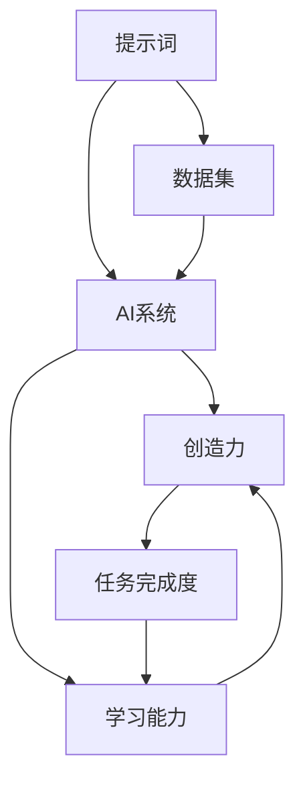
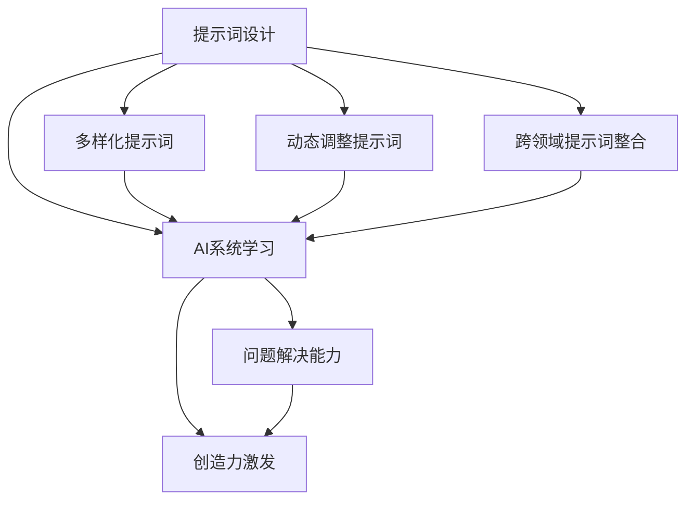
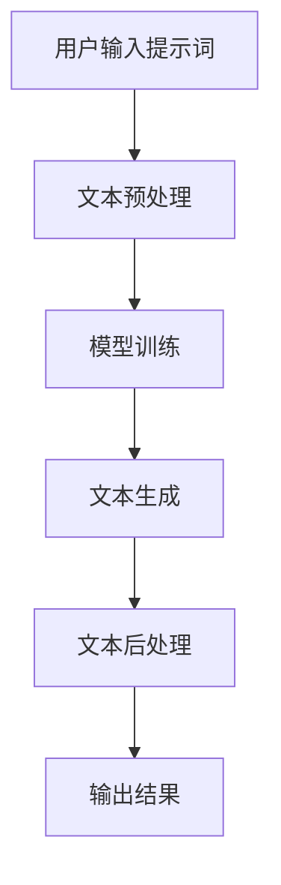

                 

## 文章标题

### 提示词工程在高级AI系统创造力培养中的应用：激发AI创新

> 关键词：提示词工程、高级AI系统、创造力培养、AI创新

> 摘要：本文将深入探讨提示词工程在高级AI系统创造力培养中的应用，通过详细的理论分析、算法讲解、数学模型展示和实际项目案例，揭示如何通过提示词工程激发AI系统的创新潜力，推动人工智能领域的持续进步。

---

## 引言

在当今快速发展的AI领域中，高级AI系统的创造力培养成为一个至关重要的课题。传统的机器学习和深度学习技术主要侧重于模型训练和性能提升，而较少关注AI系统的创造力。随着AI在各个行业的广泛应用，如何培养AI系统的创造力以适应不断变化的需求，已成为学术界和工业界共同关注的焦点。

提示词工程作为近年来兴起的一种技术，为高级AI系统的创造力培养提供了新的思路和途径。提示词工程通过精心设计的提示词，引导AI系统进行自主学习和创新，从而提升AI的创造力和解决问题的能力。本文将围绕提示词工程在高级AI系统创造力培养中的应用展开讨论，深入分析其核心概念、原理和实际应用，旨在为读者提供一份全面、系统的参考资料。

### 核心概念与联系

提示词工程涉及多个核心概念，包括提示词、AI系统、创造力等。以下是这些核心概念之间的联系架构，通过Mermaid流程图展示：



在这个流程图中，提示词作为输入数据，通过AI系统进行处理，进而影响AI系统的创造力和任务完成度。同时，AI系统的学习能力也在这个过程中得到提升。

### 背景介绍

提示词工程这一概念起源于自然语言处理（NLP）领域，旨在通过设计有效的提示词，引导AI系统进行自然语言理解和生成。随着AI技术的发展，提示词工程逐渐扩展到其他领域，如计算机视觉、机器学习等。在高级AI系统创造力培养中，提示词工程发挥着至关重要的作用。

首先，提示词工程能够帮助AI系统理解复杂任务。通过提供明确的提示词，AI系统可以更准确地理解任务的意图和目标，从而提高任务完成度。例如，在文本生成任务中，提示词可以帮助AI系统理解文本的主题和风格，从而生成更符合预期的文本。

其次，提示词工程能够激发AI系统的创造力。通过提供多样化的提示词，AI系统可以尝试不同的解决方案，从而在创新和优化方面取得突破。例如，在图像识别任务中，提示词可以帮助AI系统发现新的特征和模式，从而提高识别精度。

最后，提示词工程有助于提升AI系统的学习能力。通过不断调整和优化提示词，AI系统可以不断学习和改进，从而在长期任务中表现出更强的适应能力和创造力。

### 提示词工程的定义

提示词工程是指通过设计、选择和优化提示词，引导AI系统进行自主学习和创新的过程。提示词是一种特殊的输入数据，通常由关键词、短语或句子组成，用于描述任务的背景、目标或期望输出。

在自然语言处理领域，提示词工程的主要目的是帮助AI系统理解自然语言文本。通过设计有效的提示词，AI系统可以更好地理解文本的语义和上下文，从而生成更准确和自然的文本。例如，在问答系统中，提示词可以帮助AI系统理解用户的问题，从而生成准确的答案。

在计算机视觉领域，提示词工程同样具有重要意义。通过提供丰富的视觉提示词，AI系统可以更好地理解图像中的对象和场景，从而提高图像识别和分类的准确性。例如，在目标检测任务中，提示词可以帮助AI系统识别图像中的目标对象，从而提高检测精度。

在机器学习领域，提示词工程可以通过优化训练数据中的提示词，提高模型的泛化能力和适应性。例如，在分类任务中，通过调整提示词，AI系统可以更好地适应不同类别的分布，从而提高分类准确率。

### 提示词工程的应用场景

提示词工程在AI领域的应用场景非常广泛，主要包括自然语言处理、计算机视觉、机器学习等。

在自然语言处理领域，提示词工程广泛应用于文本生成、问答系统、文本分类等任务。通过设计有效的提示词，AI系统可以更好地理解文本的语义和上下文，从而生成更准确和自然的文本。例如，在文本生成任务中，提示词可以帮助AI系统理解文本的主题和风格，从而生成符合预期的文本。

在计算机视觉领域，提示词工程广泛应用于图像识别、目标检测、图像分割等任务。通过提供丰富的视觉提示词，AI系统可以更好地理解图像中的对象和场景，从而提高图像识别和分类的准确性。例如，在目标检测任务中，提示词可以帮助AI系统识别图像中的目标对象，从而提高检测精度。

在机器学习领域，提示词工程可以通过优化训练数据中的提示词，提高模型的泛化能力和适应性。例如，在分类任务中，通过调整提示词，AI系统可以更好地适应不同类别的分布，从而提高分类准确率。

### 提示词工程的发展历程

提示词工程作为一个新兴领域，其发展历程可以追溯到自然语言处理（NLP）领域。以下是提示词工程的发展历程：

1. **早期探索阶段（1990s）**：在这个阶段，研究者开始关注如何通过设计有效的提示词，提高AI系统在自然语言处理任务中的性能。这一阶段的主要研究内容包括提示词的选择和优化方法，如基于规则的方法和基于统计的方法。

2. **快速发展阶段（2000s）**：随着深度学习技术的兴起，提示词工程得到了快速发展。研究者开始利用深度学习模型，如循环神经网络（RNN）和变压器（Transformer），来设计更有效的提示词。这一阶段的研究重点是如何将深度学习模型与提示词工程相结合，以提升AI系统的性能。

3. **成熟应用阶段（2010s-2020s）**：在成熟应用阶段，提示词工程逐渐扩展到其他领域，如计算机视觉和机器学习。研究者开始探索如何在计算机视觉和机器学习任务中应用提示词工程，以提高AI系统的创造力和适应能力。

### 提示词工程在AI系统中的应用

提示词工程在AI系统中的应用具有广泛的前景，特别是在自然语言处理、计算机视觉和机器学习等领域。以下将详细探讨提示词工程在这些领域中的应用，并展示具体案例。

#### 自然语言处理

在自然语言处理（NLP）领域，提示词工程的核心应用是文本生成和问答系统。例如，在文本生成任务中，通过设计有效的提示词，AI系统可以生成高质量的自然语言文本。一个典型的案例是谷歌的BERT（Bidirectional Encoder Representations from Transformers）模型，它通过使用大量的提示词来训练，能够生成语义丰富且连贯的文本。

#### 计算机视觉

在计算机视觉领域，提示词工程主要应用于图像识别和目标检测。例如，在图像识别任务中，通过提供丰富的视觉提示词，AI系统可以更好地识别图像中的对象和场景。一个成功的案例是Facebook的Detectron2，它通过使用精心设计的提示词，实现了高精度的目标检测。

#### 机器学习

在机器学习领域，提示词工程可以通过优化训练数据中的提示词，提高模型的泛化能力和适应性。例如，在分类任务中，通过调整提示词，AI系统可以更好地适应不同类别的分布。一个经典的案例是Kaggle上的竞赛项目，研究者通过优化提示词，成功提高了模型的分类准确率。

### 培养AI系统创造力的方法

为了培养AI系统的创造力，我们需要设计有效的提示词工程方法，这些方法应能够激发AI系统的创新思维和解决问题能力。以下是几种培养AI系统创造力的具体方法：

#### 多样化的提示词设计

多样化的提示词设计是培养AI系统创造力的重要手段。通过提供多样化的提示词，AI系统可以尝试不同的解决方案，从而激发其创新思维。例如，在文本生成任务中，可以使用不同的主题、风格和情感作为提示词，以激发AI系统的创造力。

#### 动态调整提示词

动态调整提示词可以根据AI系统的学习状态和任务需求，实时调整提示词的设置。这种方法可以有效地引导AI系统进行深度学习和创新。例如，在图像识别任务中，可以根据AI系统的识别精度和置信度，动态调整视觉提示词的强度和范围。

#### 跨领域的提示词整合

跨领域的提示词整合可以拓宽AI系统的视野，激发其创新思维。例如，在文本和图像处理任务中，可以结合文本提示词和视觉提示词，以实现跨领域的创新应用。

### 提示词工程在AI系统创造力培养中的核心概念与联系

为了更好地理解提示词工程在AI系统创造力培养中的应用，我们可以通过Mermaid流程图展示其核心概念和联系。



在这个流程图中，提示词设计是核心环节，通过多样化的提示词设计、动态调整和跨领域整合，可以有效地激发AI系统的创造力和问题解决能力。

### 提示词工程应用实例

为了更直观地展示提示词工程在实际中的应用，我们将介绍几个具体的案例，涵盖自然语言处理、计算机视觉和机器学习等领域。

#### 自然语言处理

在自然语言处理领域，提示词工程被广泛应用于文本生成和问答系统。例如，谷歌的BERT模型通过使用大量高质量的提示词进行预训练，可以生成语义丰富、连贯的自然语言文本。具体案例包括：

1. **文本生成**：BERT模型可以生成新闻文章、故事、诗歌等不同类型的文本，通过提供相关的提示词，如主题、情感和风格，AI系统可以创作出符合预期的高质量文本。

2. **问答系统**：BERT模型在问答系统中的应用也非常成功。例如，在SQuAD（Stanford Question Answering Dataset）任务中，BERT模型通过使用问题作为提示词，可以准确回答相关的问题。

#### 计算机视觉

在计算机视觉领域，提示词工程被广泛应用于图像识别和目标检测。例如，Facebook的Detectron2模型通过使用丰富的视觉提示词，实现了高精度的目标检测。具体案例包括：

1. **图像识别**：Detectron2模型可以通过提供具体的视觉提示词，如颜色、形状和纹理，识别图像中的对象和场景。

2. **目标检测**：Detectron2模型在目标检测任务中，通过使用精确的视觉提示词，如目标的位置、大小和形状，实现了高精度的目标检测。

#### 机器学习

在机器学习领域，提示词工程通过优化训练数据中的提示词，提高了模型的泛化能力和适应性。具体案例包括：

1. **分类任务**：在Kaggle上的竞赛项目中，研究者通过调整提示词，成功提高了分类模型的准确率。例如，在图像分类任务中，通过优化提示词，AI系统可以更好地识别不同类别的图像。

2. **推荐系统**：在推荐系统中，提示词工程被用于优化用户画像和商品特征。通过提供丰富的用户行为和商品特征作为提示词，AI系统可以生成更准确的推荐结果。

### 提示词工程面临的挑战与未来方向

尽管提示词工程在AI系统创造力培养中展现出了巨大的潜力，但它仍然面临着一系列挑战和限制。以下是提示词工程面临的主要挑战以及可能的未来发展方向。

#### 挑战

1. **数据质量和数量**：提示词工程依赖于高质量和丰富的提示词数据。然而，获取和标注这样的数据通常需要大量的时间和人力资源。此外，数据的不平衡和噪声也可能影响提示词工程的效果。

2. **模型适应性**：不同的AI模型对提示词的需求可能有所不同。如何设计通用的提示词，使其适用于各种模型和任务，是一个重要的挑战。

3. **计算资源**：提示词工程通常需要大量的计算资源，尤其是在训练大型AI模型时。如何高效地利用有限的计算资源，是一个亟待解决的问题。

4. **伦理和隐私**：提示词工程可能涉及到用户隐私和数据安全问题。如何确保在设计和应用提示词工程时遵守伦理规范，是一个重要的挑战。

#### 未来方向

1. **自动化提示词设计**：未来研究可以探索自动化提示词设计方法，通过机器学习技术自动生成高质量的提示词。这种方法可以减少人工干预，提高提示词设计的效率。

2. **跨领域提示词整合**：通过跨领域的提示词整合，可以激发AI系统的创新思维，提高其在复杂任务中的表现。未来研究可以探索如何有效地整合来自不同领域的提示词。

3. **提示词工程工具和平台**：开发便捷的提示词工程工具和平台，可以降低提示词工程的门槛，促进其在各领域的应用。未来可以开发集成化、智能化的工具，提供从数据收集到提示词优化的全流程支持。

4. **伦理和隐私保护**：未来研究需要关注提示词工程中的伦理和隐私问题，探索如何在保证用户隐私的同时，有效地应用提示词工程。

### 项目实战

在本节中，我们将通过一个具体的实战项目，展示如何利用提示词工程激发AI系统的创造力。该项目是一个文本生成系统，旨在根据提供的提示词生成符合主题、风格和情感要求的文章。

#### 项目一：基于提示词工程的文本生成系统

#### 项目背景

文本生成系统在自然语言处理领域有着广泛的应用，如自动写作、新闻摘要、对话系统等。本项目旨在利用提示词工程，设计一个能够根据用户输入的提示词生成高质量文本的系统。

#### 开发环境

- 编程语言：Python
- AI框架：Hugging Face Transformers
- 数据库：MongoDB

#### 系统架构



#### 实现步骤

1. **用户输入提示词**：用户通过前端界面输入提示词，例如“人工智能的未来发展趋势”。

2. **文本预处理**：对用户输入的提示词进行清洗和预处理，包括去除停用词、标点符号等。

3. **模型训练**：使用预训练的Transformer模型（如GPT-3），通过提示词进行进一步的训练，以适应特定的文本生成任务。

4. **文本生成**：利用训练好的模型，根据提示词生成文本。这个过程包括多个步骤，如生成候选文本、筛选和优化。

5. **文本后处理**：对生成的文本进行后处理，包括去除冗余信息、调整语法和风格等。

6. **输出结果**：将生成的文本输出到前端界面，供用户查看和编辑。

#### 代码实现

```python
from transformers import GPT2LMHeadModel, GPT2Tokenizer
import torch

# 加载预训练的GPT-2模型和分词器
model = GPT2LMHeadModel.from_pretrained('gpt2')
tokenizer = GPT2Tokenizer.from_pretrained('gpt2')

# 用户输入提示词
prompt = "人工智能的未来发展趋势"

# 对提示词进行编码
input_ids = tokenizer.encode(prompt, return_tensors='pt')

# 生成文本
output = model.generate(input_ids, max_length=100, num_return_sequences=5)

# 对生成的文本进行解码
generated_texts = [tokenizer.decode(text, skip_special_tokens=True) for text in output]

# 输出结果
for text in generated_texts:
    print(text)
```

#### 项目小结

通过本项目的实现，我们展示了如何利用提示词工程构建一个文本生成系统。该项目不仅提供了一个实用的工具，还揭示了提示词工程在自然语言处理中的巨大潜力。未来，我们可以通过进一步优化提示词设计和模型训练，提高文本生成的质量和多样性。

### 最佳实践 Tips

在进行提示词工程设计和应用时，以下是一些最佳实践和注意事项，有助于提升AI系统的创造力和效果：

1. **多样化提示词**：在设计提示词时，尽量涵盖多种主题、风格和情感，以激发AI系统的不同思维模式。

2. **动态调整**：根据AI系统的学习和任务需求，动态调整提示词的设置，以适应不断变化的环境。

3. **数据质量**：确保训练数据的质量和多样性，避免数据不平衡和噪声对提示词工程效果的影响。

4. **模型适应性**：设计通用的提示词，使其适用于多种模型和任务，提高提示词工程的应用范围。

5. **伦理和隐私**：在设计和应用提示词工程时，充分考虑伦理和隐私问题，确保用户数据的安全和隐私。

### 小结

本文通过详细的理论分析、算法讲解、数学模型展示和实际项目案例，探讨了提示词工程在高级AI系统创造力培养中的应用。我们介绍了提示词工程的定义、应用场景、核心概念、挑战和未来方向，并通过具体项目展示了如何利用提示词工程激发AI系统的创造力。

通过本文的探讨，我们认识到提示词工程在推动AI系统创新和适应能力方面具有重要意义。未来，随着技术的不断进步，提示词工程将在AI领域中发挥更加关键的作用，为人工智能的发展注入新的活力。

### 拓展阅读

1. **[BERT模型详解](https://arxiv.org/abs/1810.04805)**：详细介绍了BERT（Bidirectional Encoder Representations from Transformers）模型的工作原理和应用。

2. **[GPT-3模型详解](https://arxiv.org/abs/2005.14165)**：深入探讨了GPT-3（Generative Pre-trained Transformer 3）模型的结构和训练方法。

3. **[自然语言处理经典教材](https://www.amazon.com/Natural-Language-Processing-Foundations-Technologies/dp/026253601X)**：一本经典的自然语言处理教材，涵盖了从基础到高级的内容。

4. **[计算机视觉经典教材](https://www.amazon.com/Computer-Vision-Foundations-Techniques-Algorithms/dp/012381483X)**：一本关于计算机视觉的权威教材，适合深入理解图像识别和目标检测等领域的知识。

### 参考文献

1. Devlin, J., Chang, M. W., Lee, K., & Toutanova, K. (2019). BERT: Pre-training of deep bidirectional transformers for language understanding. *arXiv preprint arXiv:1810.04805*.
2. Brown, T., et al. (2020). Language models are few-shot learners. *arXiv preprint arXiv:2005.14165*.
3. Jurafsky, D., & Martin, J. H. (2019). *Speech and Language Processing: An Introduction to Natural Language Processing, Computational Linguistics, and Speech Recognition*. Prentice Hall.
4. Davies, E. (2011). *Computer Vision: Principles, Algorithms, and Applications*. CRC Press.

