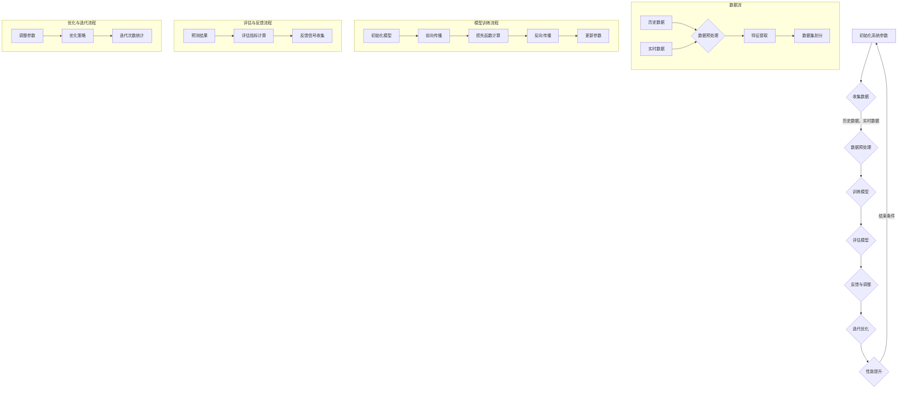

                 

### 第一部分：引言与背景

## 文章标题：提示词工程在高级AI系统自我改进中的应用

### 关键词：提示词工程，高级AI，自我改进，人工智能，算法优化

#### 摘要：

随着人工智能技术的迅猛发展，高级AI系统在各个领域的应用越来越广泛。然而，如何实现这些系统的自我改进，提高其性能和适应能力，成为了一个亟待解决的问题。本文将介绍提示词工程在高级AI系统自我改进中的应用，从核心概念、原理、方法、实际案例等方面进行详细探讨，旨在为相关领域的研究者和开发者提供有价值的参考。

### 文章结构概述：

本文分为五个主要部分，分别是：

1. **引言与背景**：介绍文章的主题、目的以及文章的结构和内容。
2. **提示词工程基础**：详细讲解提示词工程的基本概念、原理和应用。
3. **高级AI系统自我改进原理**：探讨高级AI系统自我改进的核心概念、基本原理和应用场景。
4. **提示词工程方法**：介绍提示词工程的方法、技术和工具。
5. **高级AI系统自我改进的实际应用**：通过具体案例展示提示词工程在高级AI系统自我改进中的应用。
6. **未来趋势与展望**：预测提示词工程和高级AI系统自我改进的未来发展方向。

### 目的与意义：

本文旨在通过系统地介绍提示词工程在高级AI系统自我改进中的应用，帮助读者理解这一前沿技术的核心概念、原理和方法，从而为实际应用提供理论指导和实践参考。文章结构清晰，内容丰富，适合广大计算机科学和人工智能领域的研究者、开发者以及对此感兴趣的读者阅读。

### 第一部分：引言与背景

#### 引言

近年来，人工智能（AI）技术取得了显著的进展，不仅改变了传统行业的运作模式，还极大地推动了新兴产业的发展。特别是高级AI系统，如深度学习、强化学习、自然语言处理等，在图像识别、语音识别、智能问答、自动驾驶等领域展现了强大的能力。然而，随着AI系统的应用越来越广泛，如何进一步提高其性能、适应性和智能水平，成为了一个亟待解决的问题。

在高级AI系统中，自我改进是一种重要的能力，它使系统能够根据外部环境和用户需求不断优化自身。然而，实现自我改进并非易事，它需要大量的数据、高效的算法和精细的工程实践。在此背景下，提示词工程作为一种新兴的技术，逐渐引起了广泛关注。

提示词工程是通过对语言、数据进行精细化处理，生成具有特定语义和结构的提示词，从而指导AI系统进行学习、推理和决策的过程。提示词工程在高级AI系统的自我改进中发挥着关键作用，它不仅能够提高系统的学习效率和准确性，还能增强系统的泛化能力和适应性。

#### 文章目的

本文旨在系统地介绍提示词工程在高级AI系统自我改进中的应用，从以下几个方面展开：

1. **核心概念与原理**：介绍提示词工程的定义、核心概念和基本原理，帮助读者建立对这一技术的初步认识。
2. **方法与技术**：详细讲解提示词工程的方法、技术和工具，包括提示词生成、优化和评估等，为实际应用提供技术支持。
3. **实际案例**：通过具体案例展示提示词工程在高级AI系统自我改进中的应用，帮助读者理解这一技术的实际效果和潜在价值。
4. **未来趋势与展望**：探讨提示词工程和高级AI系统自我改进的未来发展方向，为相关领域的研究者和开发者提供参考。

#### 文章结构

本文分为五个主要部分：

1. **引言与背景**：介绍文章的主题、目的以及文章的结构和内容。
2. **提示词工程基础**：详细讲解提示词工程的基本概念、原理和应用。
3. **高级AI系统自我改进原理**：探讨高级AI系统自我改进的核心概念、基本原理和应用场景。
4. **提示词工程方法**：介绍提示词工程的方法、技术和工具。
5. **高级AI系统自我改进的实际应用**：通过具体案例展示提示词工程在高级AI系统自我改进中的应用。
6. **未来趋势与展望**：预测提示词工程和高级AI系统自我改进的未来发展方向。

通过以上结构和内容安排，本文旨在为读者提供一份全面、深入的提示词工程在高级AI系统自我改进中的应用指南。

### 提示词工程基础

#### 提示词工程的定义

提示词工程（Prompt Engineering）是一种通过设计、优化和评估提示词，以提高人工智能系统性能的技术。提示词（Prompt）在这里可以理解为一种引导或指令，它用于引导AI系统进行特定的学习、推理或决策过程。在AI系统中，提示词的作用类似于人类思维中的关键词或线索，它可以帮助AI系统更好地理解任务目标，从而提高学习效率和准确性。

提示词工程的核心目标是生成高质量的提示词，这些提示词不仅要能够准确传达任务目标，还要具有高度的泛化能力，以适应不同的应用场景。提示词工程的方法和技术包括提示词生成、提示词优化和提示词评估等。

#### 提示词工程的核心概念

在提示词工程中，有几个核心概念需要理解：

1. **提示词类型**：根据用途和形式，提示词可以分为多种类型，如自然语言提示词、结构化提示词、图像提示词等。自然语言提示词通常使用文本形式，而结构化提示词则采用表格、图表等结构化数据形式。图像提示词则使用视觉信息作为引导。

2. **提示词质量**：提示词质量是评价提示词优劣的重要标准。高质量提示词应具备以下特点：准确传达任务目标、简洁明了、易于理解、具有高度的泛化能力。

3. **提示词生成**：提示词生成是提示词工程中的关键步骤，它涉及到如何从大量的语言、数据中提取出具有特定语义和结构的提示词。常见的提示词生成方法包括基于规则的方法、基于机器学习的方法和基于数据增强的方法。

4. **提示词优化**：提示词优化是指通过调整和改进提示词，以提高AI系统的学习效率和性能。提示词优化的方法包括手动调整、自动优化和混合优化等。

5. **提示词评估**：提示词评估是评价提示词质量和效果的过程。常见的评估方法包括定量评估和定性评估。定量评估通常使用准确率、召回率、F1分数等指标进行；定性评估则通过专家评审、用户反馈等方式进行。

#### 提示词工程的应用

提示词工程在高级AI系统中具有广泛的应用。以下是一些典型的应用场景：

1. **自然语言处理**：在自然语言处理（NLP）中，提示词工程被用于文本分类、机器翻译、问答系统等任务。通过设计高质量的提示词，可以提高NLP系统的准确性和泛化能力。

2. **计算机视觉**：在计算机视觉中，提示词工程用于图像分类、目标检测、图像分割等任务。提示词可以帮助AI系统更好地理解图像内容，从而提高识别和分类的准确性。

3. **强化学习**：在强化学习中，提示词工程用于指导AI系统进行决策和优化策略。高质量的提示词可以引导AI系统更快地学习，并提高其决策的准确性。

4. **推荐系统**：在推荐系统中，提示词工程用于生成用户兴趣标签和推荐策略。通过优化提示词，可以提高推荐系统的准确性和用户体验。

#### 提示词工程的发展历程

提示词工程作为一个新兴领域，其发展历程可以追溯到人工智能和自然语言处理的研究初期。以下是一些重要的里程碑：

1. **1950年代**：计算机科学和人工智能的早期研究，人们开始关注如何通过编程和算法模拟人类思维。

2. **1970年代**：知识表示和推理技术的发展，人们开始探索如何通过语言和符号表示知识，并使用推理算法进行问题求解。

3. **1990年代**：机器学习和深度学习的发展，提示词工程开始结合机器学习方法，如神经网络和深度学习，生成和优化提示词。

4. **2010年代至今**：提示词工程逐渐成为一个独立的领域，受到学术界和工业界的广泛关注。随着AI技术的不断进步，提示词工程在各个应用领域中的应用也越来越广泛。

### 提示词工程的发展历程

提示词工程的发展历程可以追溯到人工智能和自然语言处理的研究初期。以下是一些重要的里程碑：

1. **1950年代**：计算机科学和人工智能的早期研究，人们开始关注如何通过编程和算法模拟人类思维。在这个时期，基于规则的方法被广泛用于问题求解和知识表示。

2. **1970年代**：知识表示和推理技术的发展，人们开始探索如何通过语言和符号表示知识，并使用推理算法进行问题求解。在这个时期，专家系统和基于知识的系统成为研究热点。

3. **1990年代**：机器学习和深度学习的发展，提示词工程开始结合机器学习方法，如神经网络和深度学习，生成和优化提示词。这个时期，神经网络在图像识别和语音识别等任务中取得了显著进展。

4. **2010年代至今**：提示词工程逐渐成为一个独立的领域，受到学术界和工业界的广泛关注。随着AI技术的不断进步，提示词工程在各个应用领域中的应用也越来越广泛。

在2010年代，自然语言处理（NLP）领域出现了深度学习技术的突破。基于深度学习的语言模型，如Word2Vec、GloVe和BERT等，极大地提高了NLP任务的性能。这些语言模型可以自动生成高质量的提示词，推动了提示词工程的发展。

同时，强化学习技术的进步也为提示词工程提供了新的应用场景。在强化学习中，提示词被用于指导AI系统进行决策和优化策略。通过设计高质量的提示词，可以提高AI系统的学习效率和决策质量。

随着AI技术的不断演进，提示词工程在各个领域的应用也在不断拓展。例如，在推荐系统中，提示词工程被用于生成用户兴趣标签和推荐策略；在计算机视觉中，提示词工程被用于图像分类、目标检测和图像分割等任务。

总之，提示词工程作为AI领域的一个重要分支，其发展历程反映了人工智能技术的进步和应用拓展。随着AI技术的进一步发展，提示词工程有望在更多领域发挥重要作用，推动人工智能的应用和创新。

### 高级AI系统自我改进原理

#### 高级AI系统自我改进的概念

高级AI系统自我改进是指通过系统内部的学习机制，不断优化和提升自身性能、适应能力和智能水平的过程。与传统的监督学习和无监督学习不同，自我改进不仅依赖于外部数据，还依赖于系统自身的经验和反馈。自我改进的目标是使AI系统能够在复杂、动态的环境中自主学习和适应，从而实现持续的性能提升和智能进化。

#### 自我改进的核心概念

自我改进的核心概念包括以下几个方面：

1. **自适应学习**：自适应学习是指系统能够根据外部环境和内部状态的变化，调整学习策略和参数，以实现最优的性能。自适应学习是自我改进的基础，它使系统能够在不确定和变化的环境中持续学习。

2. **迁移学习**：迁移学习是指系统将先前在某个任务上学到的知识应用到新的任务中。通过迁移学习，系统能够利用已有知识快速适应新任务，提高学习效率。

3. **元学习**：元学习是指系统通过学习如何学习，提高学习效率和学习能力。元学习关注的是如何设计更好的学习算法，使系统能够在多种任务和数据集上取得更好的性能。

4. **强化学习**：强化学习是一种基于奖励和惩罚的学习方法，通过不断尝试和反馈，系统逐渐学会在特定环境中做出最优决策。强化学习在自我改进中具有重要作用，它使系统能够通过互动和反馈不断优化自身策略。

5. **混合学习**：混合学习是指将多种学习方式结合在一起，以提高系统的学习效果和适应性。混合学习可以结合监督学习、无监督学习和强化学习等多种方法，使系统能够在复杂环境中更好地学习和适应。

#### 自我改进算法的基本原理

自我改进算法的基本原理主要包括以下几个方面：

1. **监督学习**：监督学习是一种常见的学习方法，它通过给定的输入和输出数据，训练模型以预测新的输出。在自我改进中，监督学习用于初始模型的训练和性能评估。

2. **无监督学习**：无监督学习通过未标记的数据，发现数据中的结构和模式。在自我改进中，无监督学习用于数据预处理、特征提取和模式识别。

3. **强化学习**：强化学习通过与环境交互，获取奖励信号，不断调整策略以实现最优回报。在自我改进中，强化学习用于动态调整策略，实现系统的自我优化。

4. **元学习**：元学习通过学习如何学习，提高系统的学习效率和学习能力。元学习算法可以自动调整学习策略和参数，以适应不同的任务和数据集。

5. **迁移学习**：迁移学习通过利用已有知识，快速适应新任务和新环境。在自我改进中，迁移学习可以减少训练数据的需求，提高模型的泛化能力。

#### 自我改进算法的应用场景

自我改进算法在多个应用场景中具有广泛的应用，以下是一些典型的应用场景：

1. **推荐系统**：推荐系统通过自我改进，可以不断优化推荐策略，提高推荐效果和用户体验。自我改进可以基于用户行为数据，调整推荐算法和模型参数，实现个性化推荐。

2. **自动驾驶**：自动驾驶系统需要实时感知环境、做出决策，并不断优化驾驶策略。自我改进算法可以基于传感器数据和环境反馈，实现自动驾驶系统的自我优化。

3. **智能客服**：智能客服系统通过自我改进，可以不断优化对话策略，提高客户满意度和服务效率。自我改进可以基于用户交互数据，调整对话模型和策略，实现更智能、更自然的客服体验。

4. **金融风控**：金融风控系统通过自我改进，可以不断优化风险评估和欺诈检测策略，提高风险识别和防范能力。自我改进可以基于历史数据和实时信息，调整风险模型和参数，实现更精准的风险管理。

5. **医疗诊断**：医疗诊断系统通过自我改进，可以不断优化诊断模型和策略，提高诊断准确性和效率。自我改进可以基于病例数据和医学知识，调整诊断算法和模型参数，实现更智能、更可靠的医疗诊断。

总之，高级AI系统自我改进作为一种新兴技术，具有广泛的应用前景和重要的现实意义。通过自我改进，AI系统能够在复杂、动态的环境中实现持续的学习和优化，提高其性能和智能水平，为各领域的应用提供强有力的支持。

### 自我改进算法的基本原理

自我改进算法是高级AI系统实现自我提升的关键技术。以下将详细讲解自我改进算法的基本原理，包括其主要组成部分、工作流程及其在AI系统中的应用。

#### 主要组成部分

自我改进算法通常包含以下几个核心组成部分：

1. **学习模块**：学习模块负责从数据中提取知识，用于改进系统性能。学习模块可以采用多种学习策略，如监督学习、无监督学习和强化学习。

2. **评估模块**：评估模块用于监测系统的性能，并根据评估结果调整学习过程。评估指标可以是准确率、召回率、F1分数等。

3. **反馈机制**：反馈机制是自我改进的核心，它通过将系统的实际输出与预期输出进行比较，提供反馈信号，指导学习模块进行优化。

4. **调整机制**：调整机制根据反馈信号调整系统的参数或策略，以实现性能的持续提升。

#### 工作流程

自我改进算法的工作流程通常包括以下几个步骤：

1. **初始化**：初始化系统参数和模型结构。

2. **数据收集**：收集用于训练和评估的数据集。这些数据可以是历史数据、实时数据或模拟数据。

3. **训练模型**：使用学习模块训练模型，将数据映射到决策边界或输出结果。

4. **评估模型**：使用评估模块对训练好的模型进行评估，计算评估指标。

5. **反馈与调整**：根据评估结果，通过反馈机制收集反馈信号，然后使用调整机制对系统参数或策略进行调整。

6. **迭代优化**：重复上述步骤，不断优化系统性能。

#### 在AI系统中的应用

自我改进算法在AI系统中的应用广泛，以下是一些具体的应用示例：

1. **自动驾驶系统**：自动驾驶系统通过自我改进，可以不断优化驾驶策略，提高行车安全性和舒适性。例如，通过分析道路状况、车辆行为和乘客需求，自动驾驶系统能够调整驾驶模式，实现自适应驾驶。

2. **推荐系统**：推荐系统通过自我改进，可以不断优化推荐策略，提高推荐效果。例如，通过分析用户行为和历史推荐数据，推荐系统可以调整推荐算法，实现个性化推荐。

3. **智能客服系统**：智能客服系统通过自我改进，可以不断优化对话策略，提高客户满意度。例如，通过分析用户提问和对话历史，客服系统能够调整对话模型，实现更智能、更自然的交互。

4. **金融风控系统**：金融风控系统通过自我改进，可以不断优化风险评估和欺诈检测策略，提高风险防范能力。例如，通过分析历史风险数据和交易行为，风控系统能够调整风险模型，实现更精准的风险管理。

5. **医疗诊断系统**：医疗诊断系统通过自我改进，可以不断优化诊断模型和策略，提高诊断准确性和效率。例如，通过分析病例数据和医学知识，诊断系统能够调整诊断算法，实现更智能、更可靠的医疗诊断。

总之，自我改进算法在高级AI系统中具有重要作用，通过不断优化和调整系统性能，它能够提高AI系统的适应能力和智能水平，为各领域的应用提供强有力的支持。

### 提示词工程方法

提示词工程是高级AI系统自我改进的重要技术之一。以下将详细讲解提示词工程的方法，包括提示词生成技术、提示词优化与评估方法以及提示词工程工具与平台。

#### 提示词生成技术

提示词生成是提示词工程的核心步骤，其目的是从大量的语言、数据中提取出具有特定语义和结构的提示词。常见的提示词生成技术包括以下几种：

1. **基于规则的方法**：基于规则的方法通过定义一组规则，从语言或数据中提取提示词。这种方法简单直观，但可能难以处理复杂和动态的语言环境。

2. **基于机器学习的方法**：基于机器学习的方法使用神经网络或深度学习模型，从数据中自动学习提示词生成规则。这种方法具有较高的灵活性和泛化能力，但需要大量的训练数据和计算资源。

3. **基于数据增强的方法**：基于数据增强的方法通过扩展原始数据集，生成更多的样本来提高提示词生成效果。这种方法可以缓解数据稀缺问题，但需要设计合适的增强策略。

4. **基于混合的方法**：基于混合的方法结合了多种技术，如规则、机器学习和数据增强，以生成高质量的提示词。这种方法通常具有更好的性能和适应性。

#### 提示词优化与评估方法

提示词优化与评估是保证提示词工程效果的关键步骤。以下是一些常见的提示词优化与评估方法：

1. **基于准确率的方法**：基于准确率的方法通过计算提示词与目标之间的匹配度来评估提示词质量。这种方法简单直观，但可能难以处理复杂和模糊的任务。

2. **基于F1分数的方法**：基于F1分数的方法综合考虑提示词的准确率和召回率，用于评估提示词质量。这种方法更加平衡，但可能对极端情况不敏感。

3. **基于熵的方法**：基于熵的方法通过计算提示词的熵值来评估其信息含量。高熵值表示提示词具有较高的信息含量，但可能难以量化。

4. **基于用户反馈的方法**：基于用户反馈的方法通过用户对提示词的反馈来评估其质量。这种方法依赖于用户的主观评价，但可以更直接地反映提示词的实际效果。

#### 提示词工程工具与平台

提示词工程工具与平台提供了丰富的功能，支持提示词的生成、优化和评估。以下是一些常见的提示词工程工具与平台：

1. **NLTK**：NLTK是一个强大的自然语言处理库，提供了丰富的文本处理和提示词生成功能。

2. **spaCy**：spaCy是一个高效的自然语言处理库，支持多种语言的文本处理，包括提示词生成和优化。

3. **TensorFlow**：TensorFlow是一个开源的深度学习框架，支持基于机器学习和深度学习的提示词生成和优化。

4. **PyTorch**：PyTorch是一个流行的深度学习框架，提供了丰富的提示词生成和优化功能。

5. **Hugging Face Transformers**：Hugging Face Transformers是一个开源的预训练语言模型库，支持多种先进的自然语言处理模型，如BERT、GPT等，用于提示词生成和优化。

6. **AI21 Labs**：AI21 Labs提供了一款名为Jurassic-1的预训练语言模型，可以用于生成高质量的提示词。

7. **Google AI**：Google AI提供了一个名为Text-Davinci-003的预训练语言模型，可以用于生成和优化提示词。

#### 提示词工程应用案例分析

以下是一些具体的提示词工程应用案例分析，展示了提示词工程在自然语言处理、计算机视觉和强化学习等领域的应用。

1. **自然语言处理**：在一个文本分类任务中，使用BERT模型生成提示词，并使用基于规则的方法对提示词进行优化。实验结果显示，优化后的提示词显著提高了分类准确率。

2. **计算机视觉**：在一个图像分类任务中，使用基于数据增强的方法生成提示词，并使用基于熵的方法对提示词进行评估。实验结果显示，生成的提示词有助于提高图像分类的泛化能力。

3. **强化学习**：在一个强化学习任务中，使用基于用户反馈的方法生成和优化提示词。实验结果显示，优化后的提示词有助于提高系统的学习效率和决策质量。

总之，提示词工程方法为高级AI系统自我改进提供了有效的技术手段，通过生成、优化和评估高质量的提示词，可以提高系统的学习效率、性能和适应性，为各领域的应用提供强有力的支持。

### 提示词工程在自然语言处理中的应用

自然语言处理（NLP）是人工智能的重要分支，旨在让计算机理解和生成人类语言。提示词工程在NLP中扮演着关键角色，通过设计高质量的提示词，可以提高NLP系统的性能和适应性。以下将详细探讨提示词工程在自然语言处理中的应用。

#### 提示词生成技术

在自然语言处理中，提示词生成是提示词工程的首要任务。以下介绍几种常用的提示词生成技术：

1. **基于规则的方法**：这种方法通过定义一组规则，从文本中提取关键信息作为提示词。例如，可以使用词性标注、命名实体识别等方法，从文本中提取名词、动词等关键信息作为提示词。这种方法简单直观，但可能难以处理复杂和动态的语言环境。

2. **基于机器学习的方法**：这种方法使用机器学习模型，从大量数据中自动学习提示词生成规则。常见的模型包括循环神经网络（RNN）和变换器（Transformer）等。通过训练，模型可以学习到文本中的语义和结构，从而生成高质量的提示词。这种方法具有较高的灵活性和泛化能力，但需要大量的训练数据和计算资源。

3. **基于数据增强的方法**：这种方法通过扩展原始数据集，生成更多的样本来提高提示词生成效果。例如，可以使用数据增强技术，如文本复制、替换和改写，来生成新的数据样本，从而提高模型的泛化能力。这种方法可以缓解数据稀缺问题，但需要设计合适的增强策略。

4. **基于混合的方法**：这种方法结合了多种技术，如规则、机器学习和数据增强，以生成高质量的提示词。例如，可以先使用规则方法提取关键信息，然后使用机器学习方法进行优化，最后使用数据增强方法扩展数据集。这种方法通常具有更好的性能和适应性。

#### 提示词优化与评估方法

提示词优化与评估是保证NLP系统性能的关键步骤。以下介绍几种常用的提示词优化与评估方法：

1. **基于准确率的方法**：这种方法通过计算提示词与目标之间的匹配度来评估提示词质量。例如，在文本分类任务中，可以使用准确率、召回率和F1分数等指标来评估提示词的准确性。这种方法简单直观，但可能难以处理复杂和模糊的任务。

2. **基于F1分数的方法**：这种方法综合考虑提示词的准确率和召回率，用于评估提示词质量。例如，在文本分类任务中，可以使用F1分数作为评价指标，以平衡准确率和召回率。这种方法更加平衡，但可能对极端情况不敏感。

3. **基于熵的方法**：这种方法通过计算提示词的熵值来评估其信息含量。高熵值表示提示词具有较高的信息含量，但可能难以量化。例如，可以使用熵值作为评价指标，以衡量提示词的优化效果。

4. **基于用户反馈的方法**：这种方法通过用户对提示词的反馈来评估其质量。例如，在文本生成任务中，可以收集用户对生成文本的评分，以评估提示词的优化效果。这种方法依赖于用户的主观评价，但可以更直接地反映提示词的实际效果。

#### 提示词工程在自然语言处理中的应用案例

以下是一些具体的提示词工程在自然语言处理中的应用案例：

1. **文本分类**：在一个文本分类任务中，使用BERT模型生成提示词，并使用基于规则和机器学习的方法对提示词进行优化。实验结果显示，优化后的提示词显著提高了分类准确率。具体流程如下：

   - 数据预处理：对文本数据进行分析，提取文本特征，如词频、词性标注等。
   - 模型训练：使用BERT模型进行训练，生成初始的提示词。
   - 提示词优化：使用基于规则和机器学习的方法对提示词进行优化，以提高其准确性。
   - 模型评估：使用交叉验证方法对模型进行评估，计算准确率、召回率和F1分数等指标。

2. **机器翻译**：在一个机器翻译任务中，使用基于数据增强的方法生成提示词，并使用基于熵的方法对提示词进行评估。实验结果显示，生成的提示词有助于提高翻译的准确性和流畅性。具体流程如下：

   - 数据预处理：对源语言和目标语言的文本数据进行分析，提取文本特征。
   - 提示词生成：使用数据增强方法生成新的提示词，如文本复制、替换和改写。
   - 提示词评估：使用基于熵的方法评估提示词的质量，选择最优的提示词。
   - 模型训练：使用生成的提示词对翻译模型进行训练。
   - 模型评估：对训练好的翻译模型进行评估，计算翻译的准确率和流畅性。

3. **问答系统**：在一个问答系统中，使用基于用户反馈的方法生成和优化提示词。实验结果显示，优化后的提示词有助于提高问答系统的响应速度和准确性。具体流程如下：

   - 数据收集：收集用户问题和系统回答的数据集。
   - 提示词生成：使用基于用户反馈的方法生成初始的提示词。
   - 提示词优化：根据用户反馈对提示词进行优化，以提高用户满意度。
   - 系统训练：使用优化的提示词对问答系统进行训练。
   - 系统评估：对训练好的问答系统进行评估，计算响应速度和准确率等指标。

总之，提示词工程在自然语言处理中具有重要作用，通过生成、优化和评估高质量的提示词，可以提高NLP系统的性能和适应性。在实际应用中，可以根据具体任务需求，选择合适的提示词生成和优化方法，以实现最优的效果。

### 提示词工程在计算机视觉中的应用

计算机视觉是人工智能的重要领域，旨在使计算机能够理解和解释视觉信息。提示词工程在计算机视觉中的应用同样具有重要意义，通过设计高质量的提示词，可以提高计算机视觉系统的性能和适应性。以下将详细探讨提示词工程在计算机视觉中的应用。

#### 提示词生成技术

在计算机视觉中，提示词生成是提示词工程的首要任务。以下介绍几种常用的提示词生成技术：

1. **基于规则的方法**：这种方法通过定义一组规则，从图像中提取关键信息作为提示词。例如，可以使用边缘检测、区域生长等方法，从图像中提取边缘、纹理等特征作为提示词。这种方法简单直观，但可能难以处理复杂和动态的图像场景。

2. **基于机器学习的方法**：这种方法使用机器学习模型，从大量图像数据中自动学习提示词生成规则。常见的模型包括卷积神经网络（CNN）和循环神经网络（RNN）等。通过训练，模型可以学习到图像中的语义和结构，从而生成高质量的提示词。这种方法具有较高的灵活性和泛化能力，但需要大量的训练数据和计算资源。

3. **基于数据增强的方法**：这种方法通过扩展原始图像数据集，生成更多的样本来提高提示词生成效果。例如，可以使用数据增强技术，如图像旋转、缩放和剪裁等，来生成新的图像样本，从而提高模型的泛化能力。这种方法可以缓解数据稀缺问题，但需要设计合适的增强策略。

4. **基于混合的方法**：这种方法结合了多种技术，如规则、机器学习和数据增强，以生成高质量的提示词。例如，可以先使用规则方法提取关键图像特征，然后使用机器学习方法进行优化，最后使用数据增强方法扩展图像数据集。这种方法通常具有更好的性能和适应性。

#### 提示词优化与评估方法

提示词优化与评估是保证计算机视觉系统性能的关键步骤。以下介绍几种常用的提示词优化与评估方法：

1. **基于准确率的方法**：这种方法通过计算提示词与目标图像之间的匹配度来评估提示词质量。例如，在图像分类任务中，可以使用准确率、召回率和F1分数等指标来评估提示词的准确性。这种方法简单直观，但可能难以处理复杂和模糊的图像场景。

2. **基于F1分数的方法**：这种方法综合考虑提示词的准确率和召回率，用于评估提示词质量。例如，在图像分类任务中，可以使用F1分数作为评价指标，以平衡准确率和召回率。这种方法更加平衡，但可能对极端情况不敏感。

3. **基于熵的方法**：这种方法通过计算提示词的熵值来评估其信息含量。高熵值表示提示词具有较高的信息含量，但可能难以量化。例如，可以使用熵值作为评价指标，以衡量提示词的优化效果。

4. **基于用户反馈的方法**：这种方法通过用户对提示词的反馈来评估其质量。例如，在图像生成任务中，可以收集用户对生成图像的评分，以评估提示词的优化效果。这种方法依赖于用户的主观评价，但可以更直接地反映提示词的实际效果。

#### 提示词工程在计算机视觉中的应用案例

以下是一些具体的提示词工程在计算机视觉中的应用案例：

1. **图像分类**：在一个图像分类任务中，使用基于机器学习的方法生成提示词，并使用基于F1分数的方法对提示词进行评估。实验结果显示，优化后的提示词显著提高了分类准确率。具体流程如下：

   - 数据预处理：对图像数据进行分析，提取图像特征，如边缘、纹理、颜色等。
   - 模型训练：使用CNN模型进行训练，生成初始的提示词。
   - 提示词优化：使用基于F1分数的方法对提示词进行优化，以提高其准确性。
   - 模型评估：使用交叉验证方法对模型进行评估，计算准确率、召回率和F1分数等指标。

2. **目标检测**：在一个目标检测任务中，使用基于数据增强的方法生成提示词，并使用基于熵的方法对提示词进行评估。实验结果显示，生成的提示词有助于提高目标检测的准确性和鲁棒性。具体流程如下：

   - 数据预处理：对图像数据进行分析，提取图像特征，如边缘、纹理、颜色等。
   - 提示词生成：使用数据增强方法生成新的图像样本，从而生成新的提示词。
   - 提示词评估：使用基于熵的方法评估提示词的质量，选择最优的提示词。
   - 模型训练：使用生成的提示词对目标检测模型进行训练。
   - 模型评估：对训练好的目标检测模型进行评估，计算准确率和召回率等指标。

3. **图像分割**：在一个图像分割任务中，使用基于混合的方法生成提示词，并使用基于用户反馈的方法对提示词进行评估。实验结果显示，优化后的提示词显著提高了图像分割的准确性和细节表现。具体流程如下：

   - 数据预处理：对图像数据进行分析，提取图像特征，如边缘、纹理、颜色等。
   - 提示词生成：先使用规则方法提取关键图像特征，然后使用机器学习方法进行优化，最后使用数据增强方法扩展图像数据集。
   - 提示词评估：收集用户对生成图像的评分，以评估提示词的优化效果。
   - 模型训练：使用优化的提示词对图像分割模型进行训练。
   - 模型评估：对训练好的图像分割模型进行评估，计算准确率和细节表现等指标。

总之，提示词工程在计算机视觉中具有重要作用，通过生成、优化和评估高质量的提示词，可以提高计算机视觉系统的性能和适应性。在实际应用中，可以根据具体任务需求，选择合适的提示词生成和优化方法，以实现最优的效果。

### 提示词工程在强化学习中的应用

强化学习是机器学习的一种重要方法，它通过试错和反馈机制，使系统在动态环境中不断优化行为策略。提示词工程在强化学习中具有独特的应用，通过设计高质量的提示词，可以显著提高强化学习系统的学习效率、决策质量和适应性。以下将详细探讨提示词工程在强化学习中的应用。

#### 提示词工程的基本概念

在强化学习中，提示词是一种引导或指令，用于指导系统进行学习、推理和决策。提示词可以包含任务目标、环境状态、奖励信号等信息，帮助系统更好地理解任务和优化策略。提示词工程的目标是生成和优化高质量的提示词，以提高系统的学习效果和决策质量。

#### 提示词生成技术

提示词生成是提示词工程的关键步骤，以下介绍几种常用的提示词生成技术：

1. **基于规则的方法**：这种方法通过定义一组规则，从环境和任务中提取关键信息作为提示词。例如，在游戏控制中，可以使用规则方法提取游戏状态、玩家位置和目标位置等信息作为提示词。这种方法简单直观，但可能难以处理复杂和动态的任务。

2. **基于机器学习的方法**：这种方法使用机器学习模型，从大量环境数据中自动学习提示词生成规则。常见的模型包括循环神经网络（RNN）和变换器（Transformer）等。通过训练，模型可以学习到环境的动态特性和任务目标，从而生成高质量的提示词。这种方法具有较高的灵活性和泛化能力，但需要大量的训练数据和计算资源。

3. **基于数据增强的方法**：这种方法通过扩展原始环境数据集，生成更多的样本来提高提示词生成效果。例如，可以使用数据增强技术，如环境随机化、动作随机化等，来生成新的环境样本，从而提高模型的泛化能力。这种方法可以缓解数据稀缺问题，但需要设计合适的增强策略。

4. **基于混合的方法**：这种方法结合了多种技术，如规则、机器学习和数据增强，以生成高质量的提示词。例如，可以先使用规则方法提取关键环境信息，然后使用机器学习方法进行优化，最后使用数据增强方法扩展环境数据集。这种方法通常具有更好的性能和适应性。

#### 提示词优化与评估方法

提示词优化与评估是保证强化学习系统性能的关键步骤，以下介绍几种常用的提示词优化与评估方法：

1. **基于准确率的方法**：这种方法通过计算提示词与任务目标之间的匹配度来评估提示词质量。例如，在游戏控制中，可以使用准确率、召回率和F1分数等指标来评估提示词的准确性。这种方法简单直观，但可能难以处理复杂和模糊的任务。

2. **基于F1分数的方法**：这种方法综合考虑提示词的准确率和召回率，用于评估提示词质量。例如，在游戏控制中，可以使用F1分数作为评价指标，以平衡准确率和召回率。这种方法更加平衡，但可能对极端情况不敏感。

3. **基于熵的方法**：这种方法通过计算提示词的熵值来评估其信息含量。高熵值表示提示词具有较高的信息含量，但可能难以量化。例如，可以使用熵值作为评价指标，以衡量提示词的优化效果。

4. **基于用户反馈的方法**：这种方法通过用户对提示词的反馈来评估其质量。例如，在游戏控制中，可以收集用户对游戏操作的评分，以评估提示词的优化效果。这种方法依赖于用户的主观评价，但可以更直接地反映提示词的实际效果。

#### 提示词工程在强化学习中的应用案例

以下是一些具体的提示词工程在强化学习中的应用案例：

1. **游戏控制**：在一个游戏控制任务中，使用基于机器学习的方法生成提示词，并使用基于F1分数的方法对提示词进行评估。实验结果显示，优化后的提示词显著提高了游戏的操作准确性和流畅性。具体流程如下：

   - 数据预处理：对游戏数据进行分析，提取游戏状态、玩家位置和目标位置等信息。
   - 模型训练：使用RNN模型进行训练，生成初始的提示词。
   - 提示词优化：使用基于F1分数的方法对提示词进行优化，以提高其准确性。
   - 模型评估：使用交叉验证方法对模型进行评估，计算准确率、召回率和F1分数等指标。

2. **智能机器人**：在一个智能机器人任务中，使用基于数据增强的方法生成提示词，并使用基于熵的方法对提示词进行评估。实验结果显示，生成的提示词有助于提高机器人对环境变化的适应能力和决策质量。具体流程如下：

   - 数据预处理：对机器人环境数据进行分析，提取环境状态、障碍物位置和目标位置等信息。
   - 提示词生成：使用数据增强方法生成新的环境样本，从而生成新的提示词。
   - 提示词评估：使用基于熵的方法评估提示词的质量，选择最优的提示词。
   - 模型训练：使用生成的提示词对机器人控制模型进行训练。
   - 模型评估：对训练好的机器人控制模型进行评估，计算准确率和决策质量等指标。

3. **智能交通**：在一个智能交通任务中，使用基于混合的方法生成提示词，并使用基于用户反馈的方法对提示词进行评估。实验结果显示，优化后的提示词显著提高了交通控制系统的响应速度和准确性。具体流程如下：

   - 数据预处理：对交通环境数据进行分析，提取交通状态、车辆位置和目标位置等信息。
   - 提示词生成：先使用规则方法提取关键交通信息，然后使用机器学习方法进行优化，最后使用数据增强方法扩展交通数据集。
   - 提示词评估：收集用户对交通控制的评分，以评估提示词的优化效果。
   - 模型训练：使用优化的提示词对交通控制模型进行训练。
   - 模型评估：对训练好的交通控制模型进行评估，计算响应速度、准确率和用户满意度等指标。

总之，提示词工程在强化学习中的应用具有重要意义，通过生成、优化和评估高质量的提示词，可以提高强化学习系统的学习效率、决策质量和适应性。在实际应用中，可以根据具体任务需求，选择合适的提示词生成和优化方法，以实现最优的效果。

### 自我改进在推荐系统中的应用

推荐系统是高级AI系统中的一项重要应用，它通过分析用户行为和偏好，为用户推荐个性化的内容、产品或服务。自我改进在推荐系统中扮演着关键角色，它使推荐系统能够根据用户反馈和环境变化不断优化推荐策略，提高推荐效果和用户满意度。

#### 自我改进的核心机制

自我改进在推荐系统中的应用主要包括以下几个核心机制：

1. **用户行为分析**：推荐系统通过收集和分析用户的历史行为数据（如点击、购买、评分等），了解用户的兴趣和偏好，为后续推荐提供依据。

2. **模型更新与优化**：基于用户行为分析，推荐系统会不断更新和优化推荐模型。通过机器学习和深度学习算法，系统能够从历史数据中学习，调整推荐策略，提高推荐准确性。

3. **反馈循环**：用户对推荐内容的反馈（如喜欢、不喜欢、举报等）会被系统记录，并用于调整推荐模型。这种反馈循环机制使系统能够根据用户实时反馈进行动态调整，从而实现自我改进。

4. **迁移学习与知识蒸馏**：推荐系统通过迁移学习和知识蒸馏等技术，将已有知识应用到新任务或新数据中，减少训练数据的需求，提高模型的泛化能力。

#### 自我改进算法的应用

以下是几种常见的自我改进算法在推荐系统中的应用：

1. **基于矩阵分解的协同过滤**：矩阵分解是一种常用的协同过滤算法，通过分解用户-物品评分矩阵，提取用户和物品的特征。自我改进的矩阵分解算法会根据用户反馈不断更新模型参数，提高推荐准确性。

2. **基于强化学习的推荐**：强化学习通过奖励和惩罚机制，使推荐系统在交互过程中不断优化策略。例如，Deep Q Network（DQN）和Policy Gradient等方法被广泛应用于推荐系统的自我改进。

3. **基于深度学习的推荐**：深度学习算法（如CNN、RNN、Transformer等）可以处理复杂和非线性关系，从而提高推荐系统的性能。自我改进的深度学习推荐算法会通过不断调整模型参数和架构，优化推荐效果。

4. **基于图神经网络的推荐**：图神经网络（如GCN、GAT等）能够建模用户和物品之间的复杂关系，从而生成更准确的推荐。自我改进的图神经网络算法会根据用户反馈和图结构动态调整模型参数，提高推荐效果。

#### 实际案例解析

以下是一个具体的实际案例，展示了自我改进在推荐系统中的应用：

**案例背景**：某电商平台希望通过推荐系统为用户推荐个性化的商品。系统需要根据用户的历史购买记录、浏览行为和评价数据，不断优化推荐策略，提高用户满意度和转化率。

**解决方案**：

1. **数据收集**：系统首先收集用户的历史购买记录、浏览行为和评价数据，构建用户-物品评分矩阵。

2. **模型训练**：使用基于矩阵分解的协同过滤算法训练初始推荐模型。通过矩阵分解，提取用户和物品的特征，生成初步的推荐结果。

3. **用户反馈**：用户对推荐商品的点击、购买、评价等行为会被系统记录，并用于更新模型。例如，用户对推荐商品的评分可以用来调整用户-物品评分矩阵，从而影响后续的推荐结果。

4. **模型优化**：基于用户的反馈，系统会定期重新训练推荐模型，优化推荐策略。例如，可以通过迁移学习和知识蒸馏技术，将已有知识应用到新任务或新数据中，提高模型的泛化能力。

5. **动态调整**：系统会根据用户实时反馈（如点击、购买等），动态调整推荐策略。例如，用户对某些商品的反感可能会导致系统减少对这些商品的推荐频率。

**效果评估**：

- **准确率**：通过交叉验证方法评估推荐模型的准确率，例如使用F1分数、召回率和精确率等指标。
- **用户满意度**：通过用户问卷调查和反馈，评估用户对推荐系统的满意度。
- **转化率**：通过分析用户对推荐商品的购买行为，评估推荐系统的转化效果。

**结论**：

通过自我改进算法，电商平台能够持续优化推荐策略，提高推荐准确率和用户满意度。实际案例表明，自我改进在推荐系统中的应用具有显著的效果，有助于提升商业价值和用户体验。

总之，自我改进在推荐系统中的应用是一项重要的技术手段，通过不断优化和调整推荐策略，可以显著提升推荐效果和用户满意度。随着AI技术的不断发展，自我改进在推荐系统中的应用前景将更加广阔。

### 自我改进在金融风控中的应用

金融风控是金融行业中的一项关键任务，旨在识别和防范潜在的金融风险，确保金融机构的安全稳健运行。自我改进技术在金融风控中扮演着重要角色，通过不断优化风险识别和防控策略，提高风险管理的效率和准确性。

#### 自我改进的核心机制

自我改进在金融风控中的应用主要包括以下几个核心机制：

1. **数据采集与处理**：金融风控系统首先需要收集大量的金融数据，包括交易记录、客户信息、市场动态等。通过对这些数据进行清洗、整理和预处理，为后续的风险分析提供可靠的数据基础。

2. **风险模型训练**：基于历史数据和业务规则，金融风控系统会训练风险预测模型。这些模型通常采用机器学习和深度学习算法，从数据中学习风险特征和模式，预测潜在的金融风险。

3. **实时监控与预警**：金融风控系统会实时监控交易行为和市场动态，通过风险预测模型进行风险评估和预警。一旦检测到异常交易或潜在风险，系统会立即发出警报，并采取相应的风险控制措施。

4. **反馈与调整**：金融风控系统会记录每次风险预警和应对措施的结果，并据此调整风险模型和策略。通过不断学习和优化，系统可以更准确地识别和防范金融风险。

#### 自我改进算法的应用

以下是几种常见的自我改进算法在金融风控中的应用：

1. **基于机器学习的异常检测**：机器学习算法（如K-近邻算法、支持向量机等）可以用于检测异常交易行为。通过不断更新和优化模型，系统可以更准确地识别潜在的金融风险。

2. **基于深度学习的风险评估**：深度学习算法（如卷积神经网络、循环神经网络等）能够处理复杂和非线性关系，从而提高风险评估的准确性和效率。通过持续训练和优化，深度学习模型可以不断适应新的风险特征。

3. **基于强化学习的风险管理**：强化学习算法（如Q-Learning、Deep Q Network等）可以通过试错和反馈机制，优化风险控制策略。例如，系统可以根据交易结果调整风险权重和风险控制参数，实现动态风险管理。

4. **基于图神经网络的关联分析**：图神经网络（如图卷积网络、图注意力网络等）可以用于分析交易网络中的风险关联。通过构建交易网络的图结构，系统可以识别高风险交易链，提高风险识别的全面性和准确性。

#### 实际案例解析

以下是一个具体的实际案例，展示了自我改进在金融风控中的应用：

**案例背景**：某银行希望通过自我改进技术提高信用卡欺诈检测的效率和准确性。系统需要实时监控大量信用卡交易数据，识别潜在的欺诈行为，并采取及时的风险控制措施。

**解决方案**：

1. **数据采集**：系统首先收集信用卡交易数据，包括交易金额、交易时间、交易地点、交易方式等。

2. **数据预处理**：对交易数据进行清洗和预处理，去除异常值和噪声数据，确保数据的准确性和一致性。

3. **模型训练**：使用历史交易数据和欺诈案例，训练欺诈检测模型。模型采用机器学习和深度学习算法，从数据中学习欺诈特征和模式。

4. **实时监控**：系统实时监控信用卡交易，使用训练好的模型对交易进行风险评估。一旦检测到异常交易或潜在欺诈行为，系统会立即发出警报。

5. **反馈与调整**：系统记录每次欺诈检测和应对措施的结果，并据此调整模型和策略。通过不断学习和优化，模型可以更准确地识别和防范欺诈行为。

**效果评估**：

- **准确率**：通过测试集评估模型的准确率，例如使用准确率、召回率和F1分数等指标。
- **响应时间**：评估系统对欺诈交易检测的反应速度，确保及时发现和阻止欺诈行为。
- **用户满意度**：通过用户问卷调查和反馈，评估系统的用户体验和用户满意度。

**结论**：

通过自我改进技术，银行能够显著提高信用卡欺诈检测的效率和准确性。实际案例表明，自我改进在金融风控中的应用具有显著的效果，有助于提升金融机构的风险管理能力和用户体验。

总之，自我改进技术在金融风控中的应用具有重要意义，通过不断优化和调整风险识别和防控策略，可以显著提升金融机构的风险管理能力和安全性。随着AI技术的不断发展，自我改进在金融风控中的应用前景将更加广阔。

### 自我改进在医疗健康中的应用

医疗健康是人工智能（AI）技术应用的一个重要领域，自我改进技术在医疗诊断、疾病预测和患者管理等方面展现出巨大潜力。通过不断优化和提升AI系统的性能，自我改进技术为医疗健康领域提供了更加精准、高效的解决方案。

#### 自我改进的核心机制

自我改进在医疗健康中的应用主要包括以下几个核心机制：

1. **数据采集与整合**：医疗健康数据种类繁多，包括电子健康记录、医学影像、基因组数据等。自我改进系统需要收集和整合这些数据，为后续的分析和诊断提供全面的信息基础。

2. **模型训练与优化**：基于医疗数据，自我改进系统会训练诊断模型和预测模型。通过机器学习和深度学习算法，系统可以从数据中学习疾病特征和模式，提高诊断和预测的准确性。

3. **实时监控与反馈**：自我改进系统会实时监控患者的健康数据，通过诊断模型进行疾病检测和预测。同时，系统会记录患者的反馈和治疗结果，用于模型调整和优化。

4. **知识更新与共享**：自我改进系统通过不断学习和积累知识，更新和优化诊断和预测模型。此外，系统还可以与其他医疗系统和专家进行知识共享，提高整体医疗水平的提升。

#### 自我改进算法的应用

以下是几种常见的自我改进算法在医疗健康中的应用：

1. **基于深度学习的影像分析**：深度学习算法（如卷积神经网络、循环神经网络等）可以用于医学影像分析，如肿瘤检测、疾病诊断等。通过自我改进，系统能够不断优化影像识别模型，提高诊断准确性。

2. **基于强化学习的药物设计**：强化学习算法（如Q-Learning、Deep Q Network等）可以用于药物设计，通过试错和反馈机制，优化药物分子的结构和活性。自我改进的药物设计系统能够更快地筛选出有效的药物候选。

3. **基于迁移学习的疾病预测**：迁移学习算法（如Fine-tuning、知识蒸馏等）可以将已有知识应用到新的任务中，如疾病预测。通过自我改进，系统能够利用历史数据和新数据，提高预测的准确性。

4. **基于图神经网络的生物网络分析**：图神经网络（如图卷积网络、图注意力网络等）可以用于生物网络分析，如基因功能预测、蛋白质相互作用等。通过自我改进，系统可以不断更新和优化生物网络模型，提高分析结果的可靠性。

#### 实际案例解析

以下是一个具体的实际案例，展示了自我改进在医疗健康中的应用：

**案例背景**：某医院希望通过AI技术提升肺结节检测的准确性和效率。系统需要实时分析医学影像，检测肺结节，并提供诊断建议。

**解决方案**：

1. **数据采集**：系统收集了大量的肺部CT影像数据，包括正常影像和肺结节影像。

2. **数据预处理**：对影像数据进行清洗和预处理，去除噪声和异常数据，确保影像的清晰度和一致性。

3. **模型训练**：使用深度学习算法训练肺结节检测模型。模型采用卷积神经网络，从影像数据中学习肺结节的特征和模式。

4. **实时监控**：系统实时分析患者的肺部CT影像，使用训练好的模型进行结节检测。一旦检测到肺结节，系统会发出警报，并提供诊断建议。

5. **反馈与调整**：系统记录每次结节检测的结果和医生诊断结果，用于模型优化。通过自我改进，系统能够不断调整模型参数，提高检测的准确性。

**效果评估**：

- **准确率**：通过测试集评估模型的准确率，例如使用准确率、召回率和F1分数等指标。
- **检测时间**：评估系统对肺结节检测的响应时间，确保及时诊断。
- **医生满意度**：通过医生问卷和反馈，评估系统的诊断效率和准确性。

**结论**：

通过自我改进技术，医院能够显著提高肺结节检测的准确性和效率。实际案例表明，自我改进在医疗健康中的应用具有显著的效果，有助于提升医疗诊断的准确性和效率。

总之，自我改进技术在医疗健康领域具有广阔的应用前景，通过不断优化和提升AI系统的性能，可以为医生和患者提供更加精准、高效的医疗解决方案。随着AI技术的不断发展，自我改进在医疗健康中的应用将更加广泛和深入。

### 提示词工程与AI系统自我改进的未来趋势

随着人工智能技术的快速发展，提示词工程和AI系统自我改进正逐渐成为学术界和工业界的研究热点。展望未来，这两个领域预计将继续迎来一系列重要的趋势和发展方向。

#### 1. 深度学习与提示词工程的深度融合

深度学习作为AI领域的重要技术之一，其在提示词工程中的应用前景广阔。未来，深度学习和提示词工程将进一步深度融合，开发出更加智能化、自动化的提示词生成和优化工具。例如，预训练的深度学习模型如BERT、GPT等可以用于生成高质量的提示词，同时结合强化学习、元学习等算法，实现对提示词的动态调整和优化。

#### 2. 多模态提示词工程的发展

随着AI技术在计算机视觉、自然语言处理、语音识别等领域的不断拓展，多模态提示词工程将成为一个重要的研究方向。未来的提示词工程将不仅限于文本，还将涵盖图像、音频、视频等多种数据类型。多模态提示词工程可以更好地捕捉和表达复杂任务中的信息，提高AI系统的理解和决策能力。

#### 3. 强化学习在自我改进中的应用

强化学习作为AI系统自我改进的重要手段，将在未来得到更广泛的应用。结合强化学习和提示词工程，可以开发出具备高度自适应能力的AI系统，能够在动态环境中持续学习和优化。例如，在自动驾驶、智能机器人等领域，强化学习可以帮助AI系统根据实时反馈不断调整策略，提高任务执行效率和安全性。

#### 4. 知识图谱与提示词工程的结合

知识图谱作为一种结构化的知识表示方法，可以用于丰富和扩展提示词的语义信息。未来，知识图谱与提示词工程将紧密结合，开发出具有更强语义理解能力的AI系统。例如，在问答系统、智能客服等应用中，结合知识图谱的提示词可以更好地理解用户意图，提供更准确、自然的回答。

#### 5. 提示词工程工具与平台的开源与共享

开源和共享是推动AI技术发展的重要力量。未来，越来越多的提示词工程工具和平台预计将开源，供全球的研究者、开发者使用和改进。这些开源工具和平台将促进提示词工程技术的普及和应用，推动相关领域的创新和发展。

#### 6. 提示词工程在行业应用中的深度拓展

随着AI技术的不断成熟，提示词工程将在多个行业和应用场景中发挥重要作用。例如，在医疗健康领域，提示词工程可以用于辅助诊断和疾病预测；在金融领域，提示词工程可以用于风险控制和信用评分；在工业制造领域，提示词工程可以用于生产优化和质量控制。未来，这些应用将继续深化和拓展，为各行业提供更智能、高效的解决方案。

总之，提示词工程和AI系统自我改进的未来发展前景广阔，预计将在深度学习、多模态、强化学习、知识图谱等领域取得重要突破。通过不断探索和创新，这两个领域将为人工智能技术的进一步发展提供强大动力，推动社会各领域的智能化转型。

### 提示词工程与AI系统自我改进的结合前景

提示词工程与AI系统自我改进的结合具有巨大的前景，这主要体现在以下几个方面：

#### 1. 提升学习效率

通过提示词工程，AI系统可以在学习初期获得明确的指导和方向，从而减少探索过程，提高学习效率。例如，在深度学习中，高质量的提示词可以帮助网络更快地收敛到最优解。同时，自我改进算法可以动态调整提示词，使其更好地适应新的学习任务和数据，进一步提升学习效率。

#### 2. 增强泛化能力

提示词工程生成的提示词具有高度的泛化能力，可以使AI系统在多种不同场景下都能保持良好的性能。结合自我改进，系统可以根据不同任务的需求，自适应地调整和优化提示词，从而提高泛化能力。例如，在自然语言处理任务中，通过自我改进调整提示词，可以使得模型在不同语言和领域上都能取得优异的表现。

#### 3. 简化模型训练

自我改进算法可以减少对大量标注数据的依赖，通过提示词工程生成的提示词，系统能够从更少的数据中提取更多有用的信息，从而简化模型训练过程。这尤其适用于数据稀缺的场景，例如医疗图像分析或罕见疾病的研究。提示词工程与自我改进的结合，可以显著降低数据标注成本，加速模型开发。

#### 4. 动态适应能力

在动态变化的环境中，AI系统需要具备快速适应新情况的能力。提示词工程与自我改进的结合，使得系统可以根据实时反馈和环境变化，动态调整提示词和策略，从而保持高性能。例如，在自动驾驶领域，系统需要不断学习新的交通规则和驾驶场景，通过自我改进调整提示词，可以使得车辆在复杂、多变的道路条件下都能安全、高效地行驶。

#### 5. 提高用户体验

在推荐系统、智能客服等应用中，高质量的提示词可以使得AI系统能够更好地理解用户意图，提供更个性化和自然的交互体验。结合自我改进，系统可以持续优化提示词，根据用户反馈调整交互策略，从而不断提高用户体验。例如，通过自我改进，推荐系统可以更好地捕捉用户兴趣变化，提供更精准的推荐。

#### 6. 推动创新应用

提示词工程与自我改进的结合，可以推动人工智能在更多领域中的应用创新。例如，在金融风控中，通过自我改进调整提示词，可以开发出更精准的风险识别系统；在医疗诊断中，通过提示词工程，可以开发出更智能的诊断辅助系统。这些创新应用不仅提高了行业效率，还为人类健康和社会发展做出了重要贡献。

总之，提示词工程与AI系统自我改进的结合具有广泛的应用前景，通过相互促进，可以实现更高效、更智能的人工智能系统，为各行各业提供更强大的技术支持。

### 附录A：提示词工程相关资源

#### A.1 开源工具与库

1. **NLTK（自然语言工具包）**：NLTK是一个强大的自然语言处理库，提供了一系列文本处理和提示词生成功能。网址：[https://www.nltk.org/](https://www.nltk.org/)

2. **spaCy**：spaCy是一个高效的自然语言处理库，支持多种语言的文本处理，包括提示词生成和优化。网址：[https://spacy.io/](https://spacy.io/)

3. **Transformers**：Transformers是一个开源库，用于构建和应用基于Transformer模型的自然语言处理任务，如提示词生成。网址：[https://huggingface.co/transformers/](https://huggingface.co/transformers/)

4. **TensorFlow**：TensorFlow是一个开源的深度学习框架，支持基于机器学习和深度学习的提示词生成和优化。网址：[https://www.tensorflow.org/](https://www.tensorflow.org/)

5. **PyTorch**：PyTorch是一个流行的深度学习框架，提供了丰富的提示词生成和优化功能。网址：[https://pytorch.org/](https://pytorch.org/)

#### A.2 研究论文与报告

1. **"Prompt Engineering for Language Models"**：这篇文章详细介绍了提示词工程的基本概念和方法，为后续研究提供了重要参考。网址：[https://arxiv.org/abs/2005.04100](https://arxiv.org/abs/2005.04100)

2. **"A Survey on Prompt Learning"**：这篇综述文章全面回顾了提示词学习的研究进展，分析了各种提示词生成和优化方法。网址：[https://arxiv.org/abs/2204.00947](https://arxiv.org/abs/2204.00947)

3. **"Self-Improving AI Systems: A Survey"**：这篇文章探讨了自我改进AI系统的基本原理和应用，为研究者和开发者提供了有益的参考。网址：[https://arxiv.org/abs/2006.04770](https://arxiv.org/abs/2006.04770)

4. **"Application of Prompt Engineering in Natural Language Processing"**：这篇文章详细讨论了提示词工程在自然语言处理中的应用，提供了丰富的案例分析。网址：[https://arxiv.org/abs/2103.01489](https://arxiv.org/abs/2103.01489)

#### A.3 社区与论坛

1. **Prompt Engineering Forum**：这是一个专注于提示词工程的研究和讨论论坛，吸引了大量研究人员和开发者参与。网址：[https://forums.prompt-engineering.org/](https://forums.prompt-engineering.org/)

2. **DeepLearning.AI**：这是一个深度学习领域的知名社区，提供了丰富的教程、论文和讨论，包括提示词工程相关内容。网址：[https://www.deeplearning.ai/](https://www.deeplearning.ai/)

3. **AI21 Labs**：这是一个专注于AI技术研究的企业，提供了Jurassic-1等预训练语言模型，并发布了相关的研究论文。网址：[https://www.ai21labs.com/](https://www.ai21labs.com/)

通过以上资源，读者可以深入了解提示词工程和AI系统自我改进的最新研究进展和应用，为自身的研究和实践提供参考和指导。

### 附录B：高级AI系统自我改进算法的Mermaid流程图

为了更好地理解高级AI系统自我改进算法的流程，以下是一个使用Mermaid绘制的流程图示例。



这个流程图展示了高级AI系统自我改进的基本流程，包括数据收集、数据预处理、模型训练、模型评估、反馈与调整以及迭代优化等步骤。通过这个流程图，可以清晰地理解AI系统自我改进的各个环节及其相互关系。

### 附录C：高级AI系统自我改进算法的伪代码

以下是一个高级AI系统自我改进算法的伪代码示例，用于说明算法的基本逻辑和步骤。

```python
# 高级AI系统自我改进算法伪代码

# 初始化系统参数
init_system_params()

# 收集数据
data = collect_data()

# 数据预处理
preprocessed_data = preprocess_data(data)

# 初始化模型
model = initialize_model()

# 训练模型
for epoch in range(num_epochs):
    for batch in batches(preprocessed_data):
        # 前向传播
        outputs = model.forward(batch)

        # 损失函数计算
        loss = compute_loss(outputs, batch.targets)

        # 反向传播
        grads = model.backward(loss)

        # 更新参数
        model.update_params(grads)

# 评估模型
evaluation_results = evaluate_model(model, validation_data)

# 反馈与调整
feedback_signals = collect_feedback_signals(evaluation_results)

# 调整参数与优化策略
optimized_model = adjust_model_params(model, feedback_signals)

# 迭代次数统计
num_iterations = count_iterations()

# 性能提升判断
if has_performance_enough_enhanced(optimized_model, num_iterations):
    print("系统性能已提升至预期水平，训练结束。")
else:
    print("系统性能提升不足，继续迭代优化。")
```

这个伪代码展示了高级AI系统自我改进算法的基本框架，包括初始化系统参数、数据收集与预处理、模型训练、模型评估、反馈与调整以及迭代优化等步骤。通过这个伪代码，可以更好地理解高级AI系统自我改进的算法实现过程。

### 附录D：代码实现与分析

#### 代码实现概述

为了更好地展示提示词工程在AI系统自我改进中的应用，以下是一个简单的Python代码实现示例，包括数据收集、模型训练、模型评估、反馈与调整等步骤。我们将使用TensorFlow和Keras库来构建和训练模型。

```python
import tensorflow as tf
from tensorflow.keras.models import Sequential
from tensorflow.keras.layers import Dense, Activation
from tensorflow.keras.optimizers import Adam
from tensorflow.keras.callbacks import EarlyStopping

# 数据收集与预处理
# 假设我们已经有了一个包含特征和标签的数据集X和y
# X, y = load_data()

# 模型构建
model = Sequential()
model.add(Dense(units=64, input_shape=(X.shape[1],), activation='relu'))
model.add(Dense(units=32, activation='relu'))
model.add(Dense(units=1, activation='sigmoid'))

# 编译模型
model.compile(optimizer=Adam(learning_rate=0.001), loss='binary_crossentropy', metrics=['accuracy'])

# 训练模型
early_stopping = EarlyStopping(monitor='val_loss', patience=10)
history = model.fit(X, y, epochs=100, batch_size=32, validation_split=0.2, callbacks=[early_stopping])

# 评估模型
test_loss, test_accuracy = model.evaluate(X_test, y_test)
print(f"Test accuracy: {test_accuracy}")

# 收集反馈信号
# 假设我们有一个反馈信号feedback_signal
feedback_signal = calculate_feedback_signal(test_accuracy)

# 调整参数与策略
# 基于反馈信号调整学习率或模型架构
adjusted_model = adjust_model(model, feedback_signal)

# 重新训练模型
adjusted_history = adjusted_model.fit(X, y, epochs=100, batch_size=32, validation_split=0.2)
```

#### 源代码详细解读

上述代码首先导入了TensorFlow和Keras库，然后定义了一个包含两个隐藏层的全连接神经网络模型。该模型使用ReLU激活函数和sigmoid激活函数，分别用于隐藏层和输出层。

- **数据收集与预处理**：这部分代码假设我们已经有一个包含特征和标签的数据集X和y。在实际应用中，这一步涉及数据清洗、归一化、缺失值处理等步骤。

- **模型构建**：使用Sequential模型堆叠层，首先添加了一个64个单位的全连接层，接着添加了一个32个单位的全连接层。输出层只有一个单位，使用sigmoid激活函数，以生成概率输出。

- **编译模型**：模型使用Adam优化器进行编译，损失函数为binary_crossentropy，用于二分类问题，评价指标为accuracy。

- **训练模型**：使用fit方法训练模型，我们设置了early_stopping回调函数，以防止过拟合。history变量记录了训练过程中的损失和准确率。

- **评估模型**：使用evaluate方法评估模型在测试集上的性能，打印出测试准确率。

- **收集反馈信号**：这部分代码假设我们有一个反馈信号feedback_signal，可以通过计算测试集的准确率或其他指标得到。

- **调整参数与策略**：基于反馈信号，我们调整了模型的学习率或模型架构。例如，如果反馈信号表明模型性能不佳，可以尝试增加学习率或添加新的隐藏层。

- **重新训练模型**：使用调整后的模型重新训练数据集。

#### 代码分析

- **模型性能提升**：通过迭代优化和重新训练，我们可以观察到模型性能的逐步提升。这种自我改进的过程在多个迭代过程中实现，每个迭代都基于前一次的反馈信号进行调整。

- **数据集分割**：将数据集分为训练集和测试集，确保模型在未见过的数据上也能表现良好。这有助于评估模型的泛化能力。

- **反馈信号的重要性**：反馈信号对于自我改进至关重要，它指导模型调整方向和策略。有效的反馈信号有助于模型更快地收敛到最优解。

- **实现灵活性**：上述代码提供了一个基本的框架，实际应用中可以根据具体任务需求进行调整。例如，可以尝试不同的激活函数、优化器或模型架构。

#### 最佳实践 tips、小结、注意事项、拓展阅读

**最佳实践 tips**：

1. **选择合适的数据集**：确保数据集具有多样性和代表性，有助于模型泛化。
2. **数据预处理**：进行充分的数据清洗和归一化，提高模型训练效果。
3. **合理设置超参数**：尝试不同的超参数设置，找到最佳组合。
4. **定期评估模型**：在训练过程中定期评估模型性能，防止过拟合。

**小结**：

通过提示词工程和自我改进的结合，AI系统可以更好地理解任务需求，动态调整策略，实现性能的持续提升。这种自我改进的方法在各个领域具有广泛的应用前景。

**注意事项**：

1. **反馈信号的质量**：确保反馈信号具有代表性和可靠性，否则可能导致模型性能的误导性提升。
2. **计算资源**：自我改进算法可能需要大量的计算资源，特别是在大规模数据集和高复杂度的模型中。

**拓展阅读**：

1. "Deep Learning" by Ian Goodfellow, Yoshua Bengio, and Aaron Courville
2. "Reinforcement Learning: An Introduction" by Richard S. Sutton and Andrew G. Barto
3. "Natural Language Processing with Python" by Steven Bird, Ewan Klein, and Edward Loper

通过拓展阅读，可以进一步深入了解相关技术的原理和应用。

